<!-- README.md is generated from README.Rmd. Please edit that file -->

# scsig

### 1.Introduction

scsig is an R package to perform single cell RNAseq data analysis. Main
advantages: 1. standard single cell pipeline: standard_sc() 2. doublet
detection: doublet_detect() 3. easy dimension plot: dong_dimplot() 4.
find marker genes of clusters: dong_find_markers() 5. training cell
annotation model for reference: training_scRef() 6. identifying tumor
cells: copykat_plus

### 2.Installation

The package is not yet on CRAN. You can install from Github:

### 3.Usage

Main documentation is on the `scsig` function in the package:

``` r
library('scsig')
library('IOBR')
library('mydb')
library('Seurat')
```

#### 3.1 Example

``` r
#' for-single-cell-data-derived-from-10X-genomics
data_path<-"E:/03-NSCLC/13-NSCLC-scRNA-Immunotherapy/3-Data/1-sc-data/1-eset/TIA2/filtered_feature_bc_matrix"

help(standard_sc)
#> 打开httpd帮助服务器… 好了
sce<-standard_sc(eset               = NULL, 
                 file_type          = "10X", 
                 data_path          = data_path,  
                 project            = "TIA2", 
                 nPCs               = 30,
                 res                = 1,  
                 verbose            = FALSE, 
                 index              = 1,   #default resolution
                 plot               = TRUE,  
                 minFeature         = 20, #filtering option
                 cutoff_percent_mt  = 25,
                 minCount           = 10,
                 findmarkers        = FALSE, 
                 already_normalized = FALSE,
                 save_path          = "./test")
#> Warning: Feature names cannot have underscores ('_'), replacing with dashes
#> ('-')
#> An object of class Seurat 
#> 60623 features across 2059 samples within 1 assay 
#> Active assay: RNA (60623 features, 0 variable features)
#> >>>>=== Palette option for random: 1: palette1; 2: palette2; 3: palette3;  4: palette4
#> [1] "'#5f75ae', '#64a841', '#e5486e', '#de8e06', '#b5aa0f', '#7ba39d', '#b15928', '#6a3d9a', '#cab2d6', '#374E55FF', '#00A1D5FF', '#6A6599FF', '#80796BFF', '#e31a1c', '#fb9a99', '#1f78b4', '#a6cee3', '#008280FF', '#3C5488FF', '#8F7700FF', '#666666', '#A20056FF', '#fdbf6f', '#E78AC3', '#b2df8a', '#386CB0', '#CD534CFF', '#008B45FF', '#7AA6DCFF', '#00A087FF', '#A73030FF', '#631879FF', '#003C67FF'"
#>  >>>-----  Data will be deposite in E:/18-Github/scsig/./test/
#> [1] ">>>----- Step-1: Quality control"
#> [1] "Mitochondrial genes: "
#>  [1] "MT-TF"   "MT-RNR1" "MT-TV"   "MT-RNR2" "MT-TL1"  "MT-ND1"  "MT-TI"  
#>  [8] "MT-TQ"   "MT-TM"   "MT-ND2"  "MT-TW"   "MT-TA"   "MT-TN"   "MT-TC"  
#> [15] "MT-TY"   "MT-CO1"  "MT-TS1"  "MT-TD"   "MT-CO2"  "MT-TK"   "MT-ATP8"
#> [22] "MT-ATP6" "MT-CO3"  "MT-TG"   "MT-ND3"  "MT-TR"   "MT-ND4L" "MT-ND4" 
#> [29] "MT-TH"   "MT-TS2"  "MT-TL2"  "MT-ND5"  "MT-ND6"  "MT-TE"   "MT-CYB" 
#> [36] "MT-TT"   "MT-TP"
#> Ribosomal genes have been removed
#> species must be one of `human` or `mouse`.
#> Warning: CombinePlots is being deprecated. Plots should now be combined using
#> the patchwork system.
#> >>>------ For cell subset: Default parameters are : minFeature = 2000, minCount = 1000, cutoff_percent_mt = 25
#> >>>------ After filtering cells with low features, low count and high expression of mitochondrial genes
#> An object of class Seurat 
#> 60623 features across 1649 samples within 1 assay 
#> Active assay: RNA (60623 features, 0 variable features)
#> [1] ">>>------ Step-2: Data normalization and dimension reduction"
#> >>>------ Cell cycle scoring...
```


    #>                    orig.ident nCount_RNA nFeature_RNA percent.mt percent.rp
    #> AAACCTGAGATCACGG-1       TIA2        920          441   3.913043  40.326087
    #> AAACCTGGTAGGAGTC-1       TIA2       1164          817  10.395189   1.030928
    #> AAACCTGGTGCAGGTA-1       TIA2        599          106  14.357262   2.504174
    #> AAACGGGAGGGCTCTC-1       TIA2       3593          453   2.894517   7.180629
    #> AAACGGGAGTTCCACA-1       TIA2        889          499  21.034871  13.160855
    #> AAACGGGCATCTCGCT-1       TIA2        893          505  21.836506  16.909295
    #>                         S.Score    G2M.Score Phase
    #> AAACCTGAGATCACGG-1 -0.037260496 -0.033503464    G1
    #> AAACCTGGTAGGAGTC-1 -0.068185303 -0.083362112    G1
    #> AAACCTGGTGCAGGTA-1 -0.008520917 -0.001408458    G1
    #> AAACGGGAGGGCTCTC-1 -0.018726516 -0.018105992    G1
    #> AAACGGGAGTTCCACA-1 -0.031509755  0.011596915   G2M
    #> AAACGGGCATCTCGCT-1  0.032450378  0.056456534   G2M
    #> ------------------------------------------------------
    #> [1] ">>>------ Step-3: Find clusters"
    #> Computing nearest neighbor graph
    #> Computing SNN
    #> Resolution is 0.4
    #> >>>-- Findclusters when resolution = RNA_snn_res.0.4 ...
    #>   0   1   2   3   4   5   6   7 
    #> 497 274 238 175 147 134 114  70
    #> Resolution is 0.8
    #> >>>-- Findclusters when resolution = RNA_snn_res.0.8 ...
    #>   0   1   2   3   4   5   6   7   8   9  10 
    #> 296 208 200 175 147 144 133 131 114  71  30
    #> Resolution is 1.2
    #> >>>-- Findclusters when resolution = RNA_snn_res.1.2 ...
    #>   0   1   2   3   4   5   6   7   8   9  10  11  12  13 
    #> 285 210 174 145 144 135 114 105  71  69  63  62  42  30
    #> Resolution is 1.6
    #> >>>-- Findclusters when resolution = RNA_snn_res.1.6 ...
    #>   0   1   2   3   4   5   6   7   8   9  10  11  12  13  14  15 
    #> 230 146 144 144 133 120 117 114 105  71  69  63  62  59  42  30
    #> Resolution is 2
    #> >>>-- Findclusters when resolution = RNA_snn_res.2 ...
    #>   0   1   2   3   4   5   6   7   8   9  10  11  12  13  14  15  16 
    #> 227 146 144 121 120 117 114 105 104  71  69  62  62  58  57  42  30
    #> Scale for 'edge_colour' is already present. Adding another scale for
    #> 'edge_colour', which will replace the existing scale.
    #> >>>-- Findclusters when resolution = RNA_snn_res.1 ...
    #>   0   1   2   3   4   5   6   7   8   9  10  11  12 
    #> 288 208 175 147 147 144 133 114  71  69  62  61  30
    #> >>>-- These results will be used to draw dimension plot....
    #> ------------------------------------------------------
    #> Warning: The following arguments are not used: do.fast
    #> Warning: The default method for RunUMAP has changed from calling Python UMAP via reticulate to the R-native UWOT using the cosine metric
    #> To use Python UMAP via reticulate, set umap.method to 'umap-learn' and metric to 'correlation'
    #> This message will be shown once per session

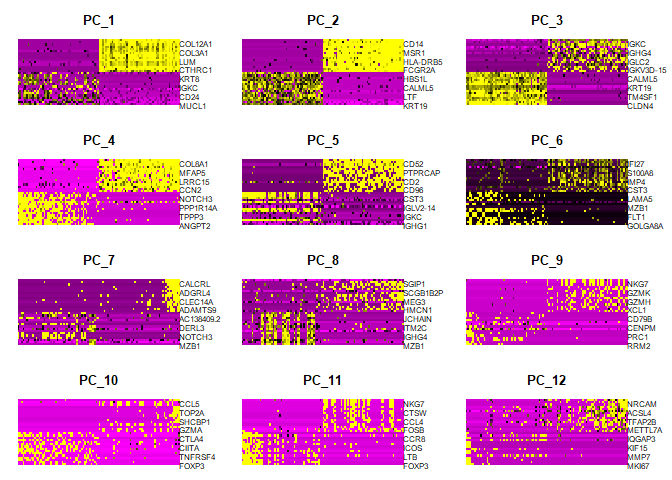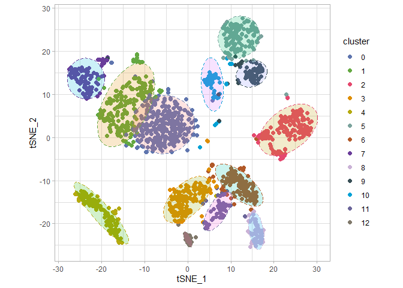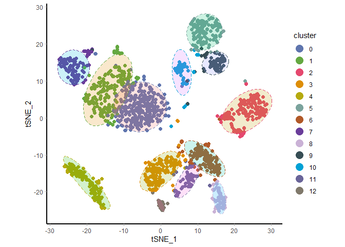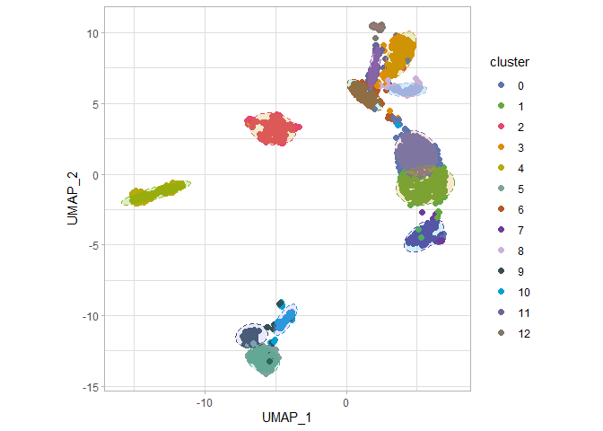

    #> ------------------------------------------------------
    #> >>> Processing method:: pca

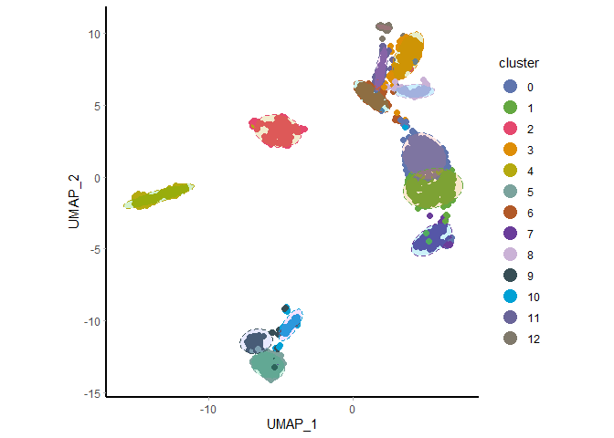

    #> >>> Processing group:: Phase
    #> >>>>Options for `theme`: light, bw, classic and classic2
    #> >>>>Options for 'legend.position' : none, left, right, bottom, top
    #> >>>>Options for 'legend.direction' : horizontal, vertical


    #> ------------------------------------------------------
    #> >>> Processing method:: tsne

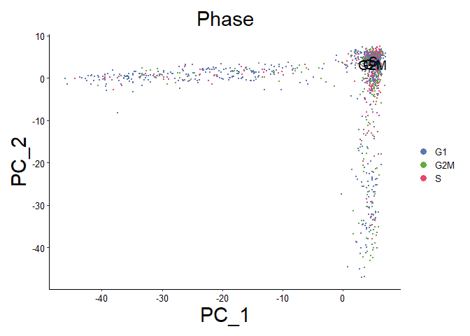

    #> >>> Processing group:: Phase
    #> >>>>Options for `theme`: light, bw, classic and classic2
    #> >>>>Options for 'legend.position' : none, left, right, bottom, top
    #> >>>>Options for 'legend.direction' : horizontal, vertical


    #> ------------------------------------------------------
    #> >>> Processing method:: umap

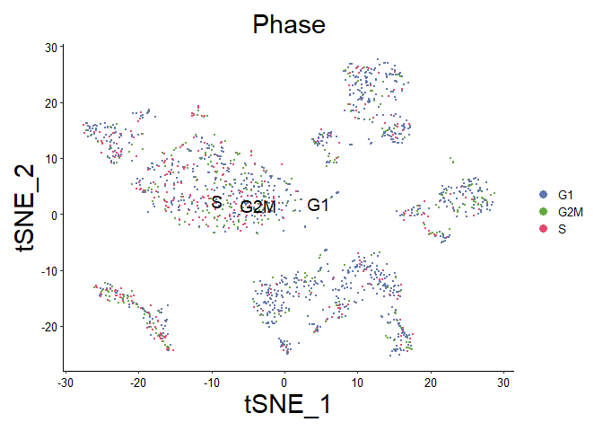

    #> >>> Processing group:: Phase
    #> >>>>Options for `theme`: light, bw, classic and classic2
    #> >>>>Options for 'legend.position' : none, left, right, bottom, top
    #> >>>>Options for 'legend.direction' : horizontal, vertical

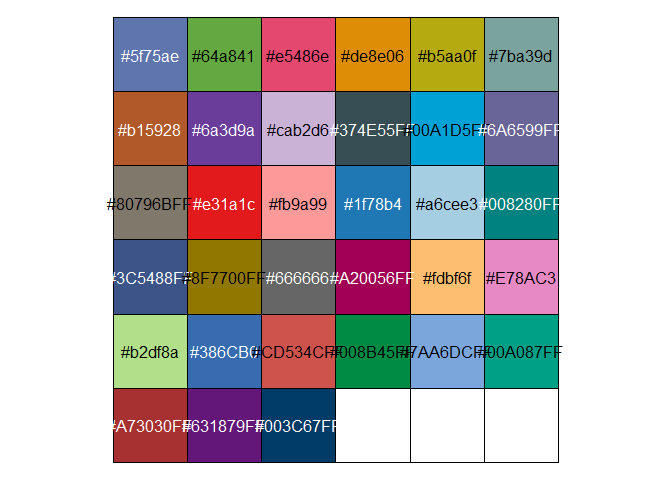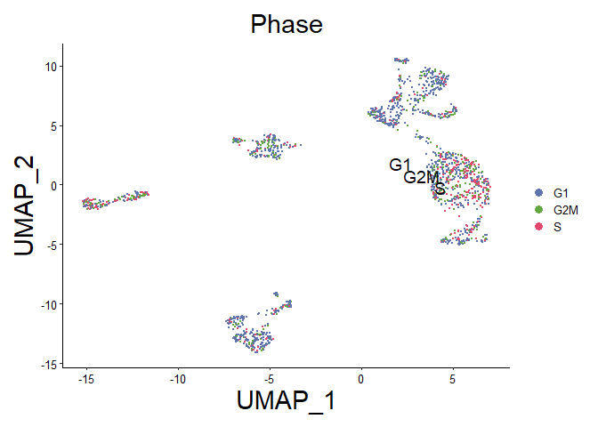

``` r
#' for-single-cell-data-with-raw-count-as-input--------------------------------
data("sc_tnbc")
sce_tnbc<-standard_sc(eset         = sc_tnbc, 
                 file_type          = "10X", 
                 data_path          = NULL,
                 project            = "TNBC", 
                 nPCs               = 30,
                 res                = 1,  
                 verbose            = FALSE, 
                 index              = 1,
                 plot               = TRUE,  
                 minFeature         = 20, 
                 minCount           = 10,
                 findmarkers        = FALSE, # set to TRUE if user want to identify marker genes of each clusters
                 already_normalized = FALSE,
                 save_path          = "./test")
#> An object of class Seurat 
#> 33694 features across 1097 samples within 1 assay 
#> Active assay: RNA (33694 features, 0 variable features)
#> >>>>=== Palette option for random: 1: palette1; 2: palette2; 3: palette3;  4: palette4
#> [1] "'#5f75ae', '#64a841', '#e5486e', '#de8e06', '#b5aa0f', '#7ba39d', '#b15928', '#6a3d9a', '#cab2d6', '#374E55FF', '#00A1D5FF', '#6A6599FF', '#80796BFF', '#e31a1c', '#fb9a99', '#1f78b4', '#a6cee3', '#008280FF', '#3C5488FF', '#8F7700FF', '#666666', '#A20056FF', '#fdbf6f', '#E78AC3', '#b2df8a', '#386CB0', '#CD534CFF', '#008B45FF', '#7AA6DCFF', '#00A087FF', '#A73030FF', '#631879FF', '#003C67FF'"
#>  >>>-----  Data will be deposite in E:/18-Github/scsig/./test/
#> [1] ">>>----- Step-1: Quality control"
#> [1] "Mitochondrial genes: "
#>  [1] "MT-ND1"  "MT-ND2"  "MT-CO1"  "MT-CO2"  "MT-ATP8" "MT-ATP6" "MT-CO3" 
#>  [8] "MT-ND3"  "MT-ND4L" "MT-ND4"  "MT-ND5"  "MT-ND6"  "MT-CYB"
#> Ribosomal genes have been removed
#> species must be one of `human` or `mouse`.
#> Warning: CombinePlots is being deprecated. Plots should now be combined using
#> the patchwork system.
#> >>>------ For cell subset: Default parameters are : minFeature = 2000, minCount = 1000, cutoff_percent_mt = 25
#> >>>------ After filtering cells with low features, low count and high expression of mitochondrial genes
#> An object of class Seurat 
#> 33694 features across 1097 samples within 1 assay 
#> Active assay: RNA (33694 features, 0 variable features)
#> [1] ">>>------ Step-2: Data normalization and dimension reduction"
#> >>>------ Cell cycle scoring...
```


    #>                  orig.ident nCount_RNA nFeature_RNA percent.mt percent.rp
    #> AAACCTGCACCTTGTC       TNBC      13976         3590  16.463938  10.997424
    #> AAACGGGAGTCCTCCT       TNBC       8732         2629   5.817682   9.757215
    #> AAACGGGTCCAGAGGA       TNBC      17138         4166  10.228731   9.738593
    #> AAAGATGCAGTTTACG       TNBC       9519         1703   5.200126  16.482824
    #> AAAGCAACAGGAATGC       TNBC      10285         2778  18.395722  13.349538
    #> AAAGCAATCGGAATCT       TNBC       8436         2822  16.797060   5.263158
    #>                      S.Score   G2M.Score Phase
    #> AAACCTGCACCTTGTC  0.07723506  0.42077041   G2M
    #> AAACGGGAGTCCTCCT -0.07738382 -0.13026069    G1
    #> AAACGGGTCCAGAGGA -0.03538864 -0.09533497    G1
    #> AAAGATGCAGTTTACG -0.04374442 -0.09006494    G1
    #> AAAGCAACAGGAATGC -0.07575323 -0.07794991    G1
    #> AAAGCAATCGGAATCT  0.12829573  0.35263693   G2M
    #> ------------------------------------------------------
    #> [1] ">>>------ Step-3: Find clusters"
    #> Computing nearest neighbor graph
    #> Computing SNN
    #> Resolution is 0.4
    #> >>>-- Findclusters when resolution = RNA_snn_res.0.4 ...
    #>   0   1   2   3   4   5 
    #> 434 303 230  55  54  21
    #> Resolution is 0.8
    #> >>>-- Findclusters when resolution = RNA_snn_res.0.8 ...
    #>   0   1   2   3   4   5   6   7   8   9 
    #> 281 180 168 153 136  54  49  28  27  21
    #> Resolution is 1.2
    #> >>>-- Findclusters when resolution = RNA_snn_res.1.2 ...
    #>   0   1   2   3   4   5   6   7   8   9  10  11 
    #> 214 167 149 136 117  91  71  54  28  27  22  21
    #> Resolution is 1.6
    #> >>>-- Findclusters when resolution = RNA_snn_res.1.6 ...
    #>   0   1   2   3   4   5   6   7   8   9  10  11  12  13 
    #> 169 148 143 116  91  78  65  65  54  49  43  28  27  21
    #> Resolution is 2
    #> >>>-- Findclusters when resolution = RNA_snn_res.2 ...
    #>   0   1   2   3   4   5   6   7   8   9  10  11  12  13 
    #> 166 148 142 113  93  78  68  66  54  49  44  28  27  21
    #> Scale for 'edge_colour' is already present. Adding another scale for
    #> 'edge_colour', which will replace the existing scale.
    #> >>>-- Findclusters when resolution = RNA_snn_res.1 ...
    #>   0   1   2   3   4   5   6   7   8   9  10 
    #> 219 180 168 148 136  67  54  49  28  27  21
    #> >>>-- These results will be used to draw dimension plot....
    #> ------------------------------------------------------
    #> Warning: The following arguments are not used: do.fast

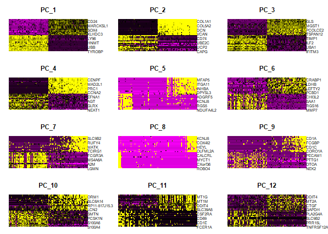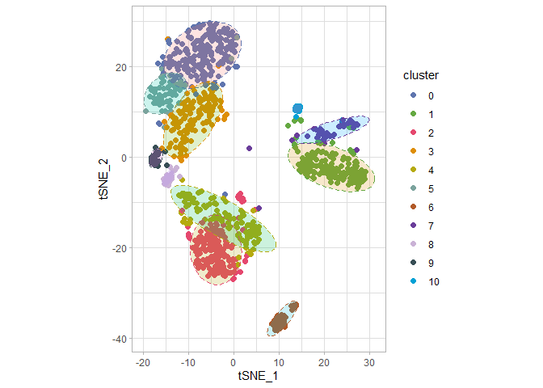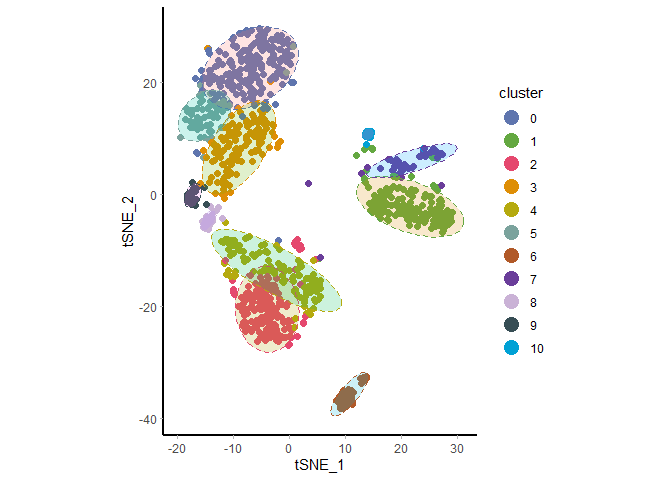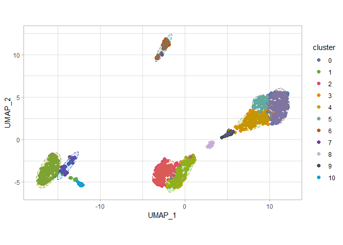

    #> ------------------------------------------------------
    #> >>> Processing method:: pca

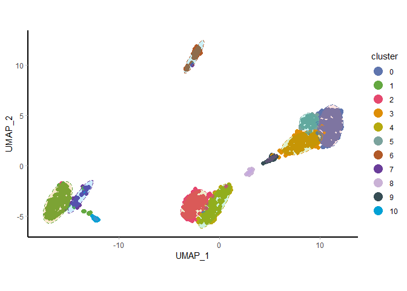

    #> >>> Processing group:: Phase
    #> >>>>Options for `theme`: light, bw, classic and classic2
    #> >>>>Options for 'legend.position' : none, left, right, bottom, top
    #> >>>>Options for 'legend.direction' : horizontal, vertical


    #> ------------------------------------------------------
    #> >>> Processing method:: tsne

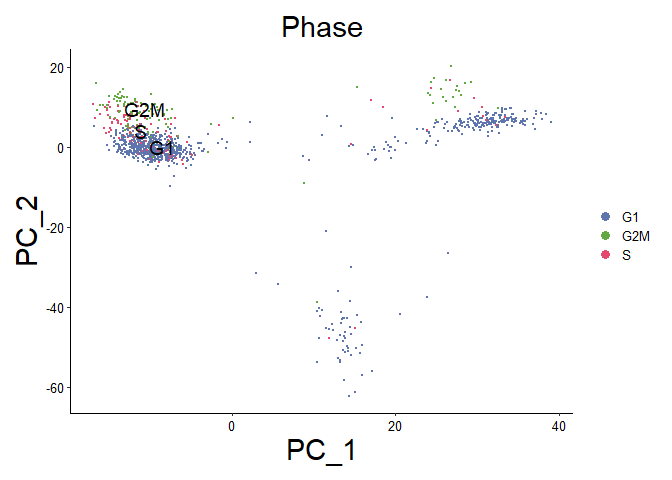

    #> >>> Processing group:: Phase
    #> >>>>Options for `theme`: light, bw, classic and classic2
    #> >>>>Options for 'legend.position' : none, left, right, bottom, top
    #> >>>>Options for 'legend.direction' : horizontal, vertical


    #> ------------------------------------------------------
    #> >>> Processing method:: umap

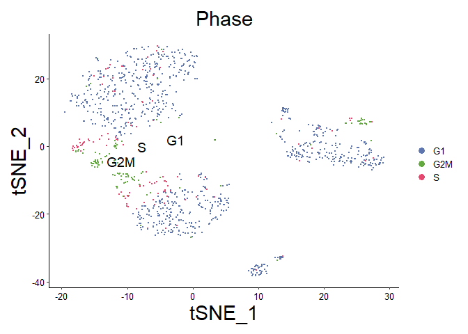

    #> >>> Processing group:: Phase
    #> >>>>Options for `theme`: light, bw, classic and classic2
    #> >>>>Options for 'legend.position' : none, left, right, bottom, top
    #> >>>>Options for 'legend.direction' : horizontal, vertical

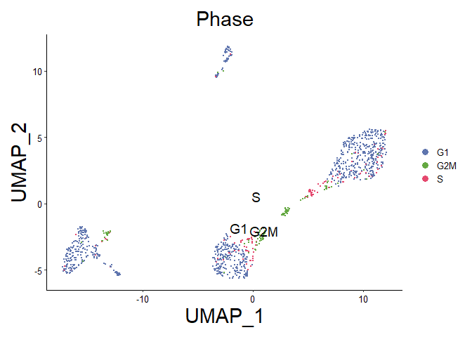

``` r
head(sce@meta.data)
#>                    orig.ident nCount_RNA nFeature_RNA percent.mt percent.rp
#> AAACCTGAGATCACGG-1       TIA2        920          441   3.913043  40.326087
#> AAACCTGGTAGGAGTC-1       TIA2       1164          817  10.395189   1.030928
#> AAACCTGGTGCAGGTA-1       TIA2        599          106  14.357262   2.504174
#> AAACGGGAGGGCTCTC-1       TIA2       3593          453   2.894517   7.180629
#> AAACGGGAGTTCCACA-1       TIA2        889          499  21.034871  13.160855
#> AAACGGGCATCTCGCT-1       TIA2        893          505  21.836506  16.909295
#>                         S.Score    G2M.Score Phase RNA_snn_res.0.4
#> AAACCTGAGATCACGG-1 -0.037260496 -0.033503464    G1               0
#> AAACCTGGTAGGAGTC-1 -0.068185303 -0.083362112    G1               1
#> AAACCTGGTGCAGGTA-1 -0.008520917 -0.001408458    G1               5
#> AAACGGGAGGGCTCTC-1 -0.018726516 -0.018105992    G1               2
#> AAACGGGAGTTCCACA-1 -0.031509755  0.011596915   G2M               4
#> AAACGGGCATCTCGCT-1  0.032450378  0.056456534   G2M               4
#>                    seurat_clusters RNA_snn_res.0.8 RNA_snn_res.1.2
#> AAACCTGAGATCACGG-1               0               0               0
#> AAACCTGGTAGGAGTC-1               9               7               9
#> AAACCTGGTGCAGGTA-1               6               6               5
#> AAACGGGAGGGCTCTC-1               3               1               3
#> AAACGGGAGTTCCACA-1               4               4               7
#> AAACGGGCATCTCGCT-1               4               4               7
#>                    RNA_snn_res.1.6 RNA_snn_res.2 RNA_snn_res.1
#> AAACCTGAGATCACGG-1               0             0             0
#> AAACCTGGTAGGAGTC-1              10            10             9
#> AAACCTGGTGCAGGTA-1               4             4             6
#> AAACGGGAGGGCTCTC-1              11            11             3
#> AAACGGGAGTTCCACA-1               8             7             4
#> AAACGGGCATCTCGCT-1               8             7             4
```

\##find marker genes of each clusters

``` r
dong_find_markers(sce        = sce, 
                  group      = "RNA_snn_res.1", 
                  assay      = "RNA", 
                  verbose    = FALSE,
                  fig.type   = "pdf",
                  pt.size    = 0.5, 
                  cols       = "normal", 
                  seed       = 54321, 
                  show_col   = F, 
                  show_genes = 10,
                  hwidth     = 13, 
                  hheight    = 10,
                  show_plot  = T, 
                  path       = "./test" )
#> >>>---Assay used to estimation:
#> [1] "RNA"
#> >>> Idents of Seurat object is: RNA_snn_res.1
#> 
#>   0   1  10  11  12   2   3   4   5   6   7   8   9 
#> 288 208  62  61  30 175 147 147 144 133 114  71  69
#> >>>>=== Palette option for random: 1: palette1; 2: palette2; 3: palette3;  4: palette4
#>                 p_val avg_log2FC pct.1 pct.2    p_val_adj cluster     gene
#> MUCL1    4.850066e-89  1.3742109 0.934 0.353 1.455020e-85       0    MUCL1
#> KRT19    1.162307e-45  0.9584904 0.785 0.336 3.486920e-42       0    KRT19
#> SCGB1B2P 6.709517e-35  0.8905151 0.615 0.273 2.012855e-31       0 SCGB1B2P
#> CD24     1.643154e-25  0.7069346 0.618 0.295 4.929463e-22       0     CD24
#> S100A9   1.116281e-24  0.7610898 0.542 0.278 3.348843e-21       0   S100A9
#> NDUFA4L2 3.263243e-23  0.7086509 0.472 0.227 9.789729e-20       0 NDUFA4L2
#> Scale for 'fill' is already present. Adding another scale for 'fill', which
#> will replace the existing scale.
#> >>> Idents of Seurat object is: RNA_snn_res.1
#> 
#>   0   1  10  11  12   2   3   4   5   6   7   8   9 
#> 288 208  62  61  30 175 147 147 144 133 114  71  69
#> >>>--- Results of DEs..
#>                     p_val avg_log2FC pct.1 pct.2     p_val_adj cluster
#> MUCL1        4.850066e-89 1.37421092 0.934 0.353  1.455020e-85       0
#> KRT19        1.162307e-45 0.95849038 0.785 0.336  3.486920e-42       0
#> SCGB1B2P     6.709517e-35 0.89051506 0.615 0.273  2.012855e-31       0
#> CD24         1.643154e-25 0.70693462 0.618 0.295  4.929463e-22       0
#> S100A9       1.116281e-24 0.76108980 0.542 0.278  3.348843e-21       0
#> NDUFA4L2     3.263243e-23 0.70865088 0.472 0.227  9.789729e-20       0
#> CTAG2        3.637440e-14 0.61790849 0.347 0.192  1.091232e-10       0
#> ALDH2        2.310249e-13 0.60080484 0.417 0.268  6.930748e-10       0
#> CXCL14       1.371546e-12 0.56372014 0.281 0.129  4.114637e-09       0
#> KRT18        6.287299e-10 0.49762462 0.319 0.194  1.886190e-06       0
#> IGLV2-14     8.178022e-10 0.07749871 0.701 0.403  2.453406e-06       0
#> S100A8       1.947162e-09 0.52330789 0.358 0.223  5.841486e-06       0
#> KRT8         3.109264e-09 0.43438969 0.337 0.208  9.327793e-06       0
#> IFI27        2.460067e-08 0.38973804 0.469 0.356  7.380201e-05       0
#> FTL          2.587062e-08 0.13363538 0.698 0.483  7.761185e-05       0
#> LTF          3.117178e-07 0.38277629 0.337 0.217  9.351535e-04       0
#> CALML5       1.238215e-05 0.34043085 0.306 0.209  3.714646e-02       0
#> ACSL4        1.766099e-05 0.49008483 0.281 0.207  5.298298e-02       0
#> HBS1L        1.005235e-04 0.35018771 0.337 0.273  3.015706e-01       0
#> ELF3         1.098680e-04 0.28354841 0.274 0.188  3.296040e-01       0
#> IMP4         1.189709e-04 0.44701933 0.267 0.206  3.569127e-01       0
#> KRT7         2.462749e-04 0.31592010 0.278 0.201  7.388247e-01       0
#> KYNU         6.593815e-03 0.28526623 0.257 0.220  1.000000e+00       0
#> KRT191       6.816216e-62 1.26209208 0.923 0.341  2.044865e-58       1
#> KRT81        4.447644e-58 1.17493211 0.683 0.165  1.334293e-54       1
#> MUCL11       8.040062e-54 1.22124093 0.889 0.391  2.412019e-50       1
#> KRT181       2.739457e-53 1.13950374 0.625 0.157  8.218371e-50       1
#> IFI271       1.547075e-51 1.14829532 0.822 0.312  4.641226e-48       1
#> CD241        2.064046e-51 1.13858733 0.832 0.282  6.192139e-48       1
#> AZGP1        5.785393e-50 1.10597260 0.524 0.116  1.735618e-46       1
#> CTAG21       3.171024e-48 1.08540612 0.606 0.163  9.513071e-45       1
#> CRABP1       7.725513e-47 1.09276237 0.389 0.065  2.317654e-43       1
#> LTF1         1.142185e-46 1.01788440 0.649 0.179  3.426555e-43       1
#> CALML51      1.200599e-45 1.05062771 0.611 0.171  3.601796e-42       1
#> HBS1L1       1.161657e-44 1.06892596 0.688 0.226  3.484971e-41       1
#> CLDN3        2.578032e-42 1.00592065 0.495 0.117  7.734096e-39       1
#> SCGB1B2P1    4.163957e-41 1.08867257 0.726 0.276  1.249187e-37       1
#> S100A81      4.647506e-41 1.08095169 0.606 0.194  1.394252e-37       1
#> AL596442.3   5.828141e-41 0.98928302 0.495 0.125  1.748442e-37       1
#> S100A91      1.004272e-40 1.08120098 0.702 0.270  3.012816e-37       1
#> NDUFA4L21    2.730691e-39 0.97045742 0.654 0.214  8.192074e-36       1
#> ALDH21       1.211713e-37 1.00766036 0.649 0.243  3.635139e-34       1
#> MT1G         2.862958e-36 0.98444078 0.365 0.076  8.588873e-33       1
#> KRT71        6.113173e-36 0.93243133 0.543 0.167  1.833952e-32       1
#> SPINT2       9.354338e-34 0.90078972 0.558 0.181  2.806301e-30       1
#> RAB25        1.617259e-33 0.90770577 0.370 0.085  4.851778e-30       1
#> S100A14      2.316431e-33 0.90288058 0.433 0.112  6.949293e-30       1
#> GGCT         2.444057e-33 0.95682349 0.500 0.162  7.332170e-30       1
#> NQO1         2.060994e-32 0.95660480 0.409 0.111  6.182983e-29       1
#> KYNU1        1.668547e-30 0.87520063 0.529 0.183  5.005640e-27       1
#> RBP1         4.952490e-30 0.87805084 0.447 0.137  1.485747e-26       1
#> PRXL2A       8.113824e-30 0.94581319 0.399 0.116  2.434147e-26       1
#> ELF31        4.696801e-29 0.76098431 0.519 0.158  1.409040e-25       1
#> IMP41        3.723713e-28 0.92638955 0.486 0.178  1.117114e-24       1
#> MAGEA4       1.231936e-27 0.83201241 0.380 0.106  3.695809e-24       1
#> PDZK1IP1     1.488591e-27 0.84064263 0.375 0.103  4.465774e-24       1
#> TPD52L1      2.027369e-27 0.84092897 0.337 0.085  6.082108e-24       1
#> EFHD1        2.701298e-27 0.87714349 0.365 0.103  8.103894e-24       1
#> MARCKSL1     2.407136e-26 0.80675794 0.447 0.152  7.221408e-23       1
#> MGST1        1.411167e-24 0.78881859 0.380 0.116  4.233500e-21       1
#> TM2D2        1.796249e-24 0.82202244 0.428 0.151  5.388748e-21       1
#> LY6K         4.882805e-24 0.75180924 0.337 0.094  1.464841e-20       1
#> PERP         4.938128e-23 0.72433961 0.476 0.174  1.481438e-19       1
#> SLPI         5.446052e-23 0.74481993 0.303 0.079  1.633816e-19       1
#> ASS1         9.246628e-23 0.77971784 0.365 0.117  2.773988e-19       1
#> RHOC         1.635936e-22 0.76072505 0.606 0.295  4.907807e-19       1
#> TM4SF1       3.549487e-21 0.71183241 0.490 0.201  1.064846e-17       1
#> CLDN7        9.001337e-21 0.74512494 0.332 0.105  2.700401e-17       1
#> TFB1M        1.451416e-20 0.65047980 0.490 0.179  4.354248e-17       1
#> IDH2         5.749883e-20 0.78905452 0.486 0.228  1.724965e-16       1
#> PHGDH        1.320770e-19 0.73684506 0.279 0.080  3.962310e-16       1
#> EPCAM        1.827728e-19 0.70122382 0.303 0.092  5.483183e-16       1
#> AC093001.1   6.694514e-19 0.71256091 0.293 0.090  2.008354e-15       1
#> SMIM22       6.892538e-19 0.67580766 0.303 0.094  2.067761e-15       1
#> MAGEA3       6.985417e-19 0.75448787 0.264 0.076  2.095625e-15       1
#> SQSTM1       9.537275e-19 0.67997643 0.721 0.396  2.861182e-15       1
#> MAGEA6       1.364563e-18 0.64140270 0.260 0.072  4.093690e-15       1
#> SNCG         8.987786e-18 0.73663837 0.260 0.077  2.696336e-14       1
#> AP1M2        2.697971e-17 0.68768126 0.264 0.080  8.093912e-14       1
#> ANXA3        2.919760e-17 0.62416598 0.284 0.087  8.759279e-14       1
#> FKBP4        3.452444e-17 0.74935393 0.361 0.148  1.035733e-13       1
#> PFN2         3.780574e-17 0.65869790 0.327 0.119  1.134172e-13       1
#> GLYATL2      4.387924e-17 0.62977510 0.312 0.104  1.316377e-13       1
#> LINC01503    5.535912e-17 0.65529180 0.341 0.125  1.660774e-13       1
#> FXYD3        5.563584e-17 0.66751649 0.260 0.078  1.669075e-13       1
#> STMN1        1.385812e-15 0.66773149 0.370 0.158  4.157435e-12       1
#> H1F0         2.717732e-15 0.62263730 0.471 0.230  8.153196e-12       1
#> CXCL141      2.953998e-15 0.66459069 0.332 0.130  8.861993e-12       1
#> CXADR        4.265433e-14 0.53973460 0.293 0.105  1.279630e-10       1
#> CLDN4        5.447521e-14 0.48464383 0.322 0.115  1.634256e-10       1
#> BNIP3        1.023507e-13 0.60675169 0.413 0.203  3.070522e-10       1
#> PLPP2        1.233955e-13 0.60476526 0.269 0.099  3.701864e-10       1
#> ANXA1        4.566123e-13 0.59762697 0.558 0.346  1.369837e-09       1
#> CRIP2        1.514543e-12 0.58248805 0.385 0.189  4.543630e-09       1
#> MT1X         1.047686e-11 0.61753653 0.284 0.121  3.143059e-08       1
#> PHLDA2       2.666060e-11 0.57023382 0.274 0.116  7.998180e-08       1
#> ACSL41       1.458642e-09 0.53335774 0.365 0.199  4.375925e-06       1
#> NIT2         2.308611e-09 0.52353842 0.293 0.145  6.925832e-06       1
#> C15orf48     4.188466e-09 0.50535430 0.255 0.115  1.256540e-05       1
#> OCIAD2       4.728780e-09 0.46552162 0.264 0.121  1.418634e-05       1
#> SLC9A3R1     1.053719e-08 0.46884132 0.279 0.135  3.161158e-05       1
#> S100A13      1.695344e-08 0.52501060 0.260 0.128  5.086031e-05       1
#> CHMP2B       4.519366e-08 0.56781982 0.250 0.126  1.355810e-04       1
#> NUPR1        6.154708e-08 0.39179905 0.447 0.267  1.846412e-04       1
#> S100A16      1.062962e-07 0.46775760 0.269 0.139  3.188885e-04       1
#> NSD3         2.138483e-07 0.38017277 0.476 0.282  6.415448e-04       1
#> NFIB         3.351029e-07 0.39051688 0.303 0.162  1.005309e-03       1
#> FABP5        9.419993e-07 0.37982416 0.250 0.127  2.825998e-03       1
#> MDK          1.942218e-06 0.41330425 0.317 0.190  5.826655e-03       1
#> TUBA1A       2.997987e-06 0.36162459 0.452 0.298  8.993961e-03       1
#> PLEKHA2      1.350274e-05 0.38843029 0.260 0.151  4.050822e-02       1
#> NET1         4.990608e-05 0.35253014 0.260 0.157  1.497182e-01       1
#> SOX4         6.843262e-05 0.31910998 0.356 0.237  2.052979e-01       1
#> MGP          1.789202e-04 0.26235076 0.279 0.169  5.367606e-01       1
#> GLUL         1.989232e-04 0.27334802 0.356 0.239  5.967696e-01       1
#> TUBB4B       3.117653e-03 0.36143917 0.250 0.188  1.000000e+00       1
#> MS4A6A      4.471214e-208 2.36994607 0.669 0.008 1.341364e-204       2
#> FCGR2A      3.938166e-207 2.32542391 0.697 0.012 1.181450e-203       2
#> FCGR3A      2.045670e-205 2.43682975 0.714 0.016 6.137009e-202       2
#> CD14        4.689164e-196 2.39788815 0.697 0.018 1.406749e-192       2
#> FCER1G      6.333958e-195 2.47060935 0.771 0.034 1.900187e-191       2
#> HLA-DMB     1.756067e-192 2.29827521 0.663 0.013 5.268201e-189       2
#> MSR1        6.012671e-192 2.28471258 0.651 0.012 1.803801e-188       2
#> CPVL        3.637876e-186 2.21979560 0.589 0.005 1.091363e-182       2
#> CYBB        1.040185e-185 2.31046775 0.669 0.018 3.120555e-182       2
#> CSF1R       2.404719e-173 2.08544199 0.520 0.001 7.214157e-170       2
#> LYZ         6.448810e-172 2.39882555 0.806 0.060 1.934643e-168       2
#> C1QC        5.660166e-171 2.40042755 0.714 0.038 1.698050e-167       2
#> C1QA        6.096561e-171 2.29434850 0.663 0.025 1.828968e-167       2
#> C1QB        2.916331e-168 2.26827917 0.617 0.018 8.748992e-165       2
#> SGK1        6.511799e-166 2.23115837 0.674 0.030 1.953540e-162       2
#> C5AR1       1.480164e-162 2.05433831 0.560 0.010 4.440492e-159       2
#> SLC11A1     2.775287e-162 2.01002332 0.543 0.008 8.325861e-159       2
#> TYROBP      3.618778e-162 2.37667824 0.823 0.079 1.085633e-158       2
#> CD68        1.682171e-161 2.37709201 0.731 0.049 5.046512e-158       2
#> AIF1        2.698650e-161 2.08530238 0.623 0.020 8.095949e-158       2
#> ALOX5       5.852288e-160 1.97924873 0.526 0.007 1.755687e-156       2
#> C1orf162    2.162659e-157 1.97229839 0.543 0.009 6.487976e-154       2
#> FPR3        3.041890e-157 2.01028116 0.480 0.002 9.125671e-154       2
#> SLCO2B1     3.318262e-157 1.97601334 0.480 0.002 9.954787e-154       2
#> MS4A7       6.648304e-156 2.02241869 0.526 0.008 1.994491e-152       2
#> TREM2       2.366590e-154 2.05560833 0.543 0.012 7.099771e-151       2
#> HLA-DRB5    3.070734e-154 2.29217405 0.743 0.056 9.212202e-151       2
#> HLA-DQA1    5.492316e-153 2.26302809 0.731 0.054 1.647695e-149       2
#> LILRB4      5.094632e-152 1.89805871 0.509 0.007 1.528390e-148       2
#> OLR1        1.064599e-148 1.94270466 0.469 0.003 3.193796e-145       2
#> CFD         1.464999e-147 1.94277750 0.497 0.007 4.394996e-144       2
#> RNASE1      2.583808e-147 1.99922410 0.531 0.013 7.751424e-144       2
#> IGSF6       2.616973e-145 1.91397703 0.497 0.008 7.850918e-142       2
#> ADAP2       1.182484e-143 1.91928568 0.560 0.019 3.547451e-140       2
#> FCGR1A      2.430783e-143 1.92180664 0.434 0.001 7.292348e-140       2
#> CD83        5.799455e-140 1.95503806 0.554 0.020 1.739837e-136       2
#> CD163       2.840076e-139 1.88908997 0.457 0.005 8.520228e-136       2
#> PILRA       3.508949e-139 1.91556309 0.457 0.005 1.052685e-135       2
#> MS4A4A      3.593961e-139 1.87720126 0.469 0.007 1.078188e-135       2
#> ITGAX       5.191551e-137 1.83367729 0.434 0.003 1.557465e-133       2
#> HLA-DRB1    9.169710e-135 2.38442718 0.886 0.150 2.750913e-131       2
#> IFI30       5.715271e-134 1.84742066 0.480 0.011 1.714581e-130       2
#> ALOX5AP     5.427486e-133 1.93284516 0.669 0.047 1.628246e-129       2
#> LY86        1.283329e-132 1.74777028 0.429 0.004 3.849986e-129       2
#> SPI1        4.617069e-132 1.87678584 0.526 0.019 1.385121e-128       2
#> HLA-DQB1    1.544157e-131 2.20027936 0.726 0.075 4.632470e-128       2
#> HLA-DPB1    3.314308e-131 2.23065297 0.823 0.121 9.942924e-128       2
#> HLA-DPA1    3.666003e-131 2.27452131 0.829 0.124 1.099801e-127       2
#> PLEK        2.855124e-130 1.71632740 0.491 0.014 8.565372e-127       2
#> CD86        2.497358e-129 1.82161545 0.423 0.005 7.492073e-126       2
#> CCL3        7.694132e-129 1.77695790 0.486 0.014 2.308240e-125       2
#> STAB1       1.287189e-127 1.75344803 0.440 0.007 3.861568e-124       2
#> HLA-DRA     1.521984e-127 2.34445611 0.897 0.178 4.565953e-124       2
#> SERPINA1    3.925921e-127 1.86515302 0.446 0.009 1.177776e-123       2
#> LAIR1       3.288453e-126 1.74549719 0.451 0.009 9.865360e-123       2
#> APOE        5.549345e-126 2.13648666 0.669 0.062 1.664804e-122       2
#> VSIG4       2.324903e-125 1.74175611 0.423 0.006 6.974708e-122       2
#> MRC1        1.479309e-121 1.72364475 0.406 0.005 4.437928e-118       2
#> LAPTM5      9.968337e-121 1.93988824 0.777 0.098 2.990501e-117       2
#> LST1        1.715227e-120 1.65587860 0.446 0.011 5.145681e-117       2
#> HLA-DMA     4.545674e-120 2.01095854 0.669 0.065 1.363702e-116       2
#> ARHGAP18    1.010147e-118 1.88075461 0.646 0.057 3.030441e-115       2
#> EPB41L3     5.416953e-118 1.75728438 0.451 0.014 1.625086e-114       2
#> NCF2        7.868026e-116 1.66087955 0.440 0.012 2.360408e-112       2
#> APOC1       3.807634e-112 1.78929685 0.554 0.037 1.142290e-108       2
#> MARCH1      1.747509e-111 1.69054760 0.354 0.003 5.242526e-108       2
#> ACP5        6.450808e-111 1.76339725 0.543 0.035 1.935243e-107       2
#> CIITA       2.331563e-108 1.62635749 0.383 0.007 6.994688e-105       2
#> FBP1        8.311769e-108 1.63323347 0.394 0.009 2.493531e-104       2
#> ITGB2       2.206739e-107 1.79604749 0.663 0.071 6.620216e-104       2
#> TNFAIP2     4.301237e-106 1.73680732 0.520 0.035 1.290371e-102       2
#> CD300A      3.274919e-105 1.66322413 0.400 0.012 9.824758e-102       2
#> DMXL2       3.297643e-104 1.72659830 0.474 0.026 9.892930e-101       2
#> CTSS        1.523904e-103 2.05392764 0.709 0.109 4.571713e-100       2
#> LILRB2      1.825705e-103 1.56533782 0.320 0.001 5.477116e-100       2
#> PLAUR       4.705327e-103 1.85759281 0.686 0.090  1.411598e-99       2
#> CD84        6.128730e-103 1.41968033 0.400 0.012  1.838619e-99       2
#> FGL2        1.309326e-101 1.68299074 0.446 0.022  3.927978e-98       2
#> FCGR2B      1.183022e-100 1.72507927 0.440 0.022  3.549065e-97       2
#> FCGRT        1.418685e-99 1.90454651 0.640 0.082  4.256055e-96       2
#> NCKAP1L      1.752874e-99 1.45774357 0.429 0.018  5.258623e-96       2
#> MAFB         1.853990e-99 1.71741852 0.486 0.032  5.561969e-96       2
#> RNF130       1.179934e-98 1.69042489 0.554 0.050  3.539803e-95       2
#> CLEC5A       6.551352e-98 1.55997956 0.297 0.001  1.965405e-94       2
#> RASSF4       4.409733e-97 1.67579125 0.469 0.030  1.322920e-93       2
#> SPP1         5.186210e-97 1.95369852 0.611 0.075  1.555863e-93       2
#> CD74         5.244845e-97 2.06918230 0.983 0.455  1.573453e-93       2
#> ABCA1        3.705218e-96 1.68156210 0.526 0.044  1.111566e-92       2
#> CTSD         3.901439e-96 1.83462565 0.617 0.075  1.170432e-92       2
#> SMIM25       3.902772e-96 1.50529442 0.343 0.007  1.170832e-92       2
#> CD4          7.532602e-95 1.33461959 0.389 0.014  2.259781e-91       2
#> CLEC7A       1.350264e-94 1.53817001 0.543 0.048  4.050791e-91       2
#> TREM1        3.473561e-94 1.53638021 0.360 0.010  1.042068e-90       2
#> SLC8A1       5.863324e-94 1.52127581 0.314 0.004  1.758997e-90       2
#> MNDA         6.637594e-94 1.53320148 0.303 0.003  1.991278e-90       2
#> RGS2         7.549387e-94 1.56027078 0.457 0.028  2.264816e-90       2
#> IL1B         1.033568e-93 1.54093114 0.309 0.003  3.100703e-90       2
#> LRRC25       1.893420e-93 1.43828648 0.303 0.003  5.680259e-90       2
#> MPP1         3.603962e-93 1.54043323 0.463 0.031  1.081188e-89       2
#> TNFSF13B     4.951676e-93 1.54772925 0.371 0.013  1.485503e-89       2
#> CSF2RA       1.781859e-92 1.51942784 0.274 0.000  5.345576e-89       2
#> TNFSF13      9.774394e-92 1.59806072 0.440 0.027  2.932318e-88       2
#> CTSH         1.693576e-91 1.73267021 0.651 0.092  5.080729e-88       2
#> ITGAM        2.259287e-91 1.40894815 0.297 0.003  6.777861e-88       2
#> CTSL         1.626645e-88 1.84241649 0.651 0.104  4.879934e-85       2
#> C3AR1        4.013515e-88 1.38947249 0.320 0.007  1.204055e-84       2
#> PTAFR        1.395391e-87 1.44612408 0.286 0.003  4.186174e-84       2
#> CST3         7.546319e-87 1.78303363 0.806 0.212  2.263896e-83       2
#> PTPRC        1.203325e-86 1.38504710 0.686 0.091  3.609974e-83       2
#> LIPA         3.430846e-86 1.52129503 0.463 0.036  1.029254e-82       2
#> SRGN         1.001070e-84 1.74407616 0.720 0.142  3.003211e-81       2
#> FYB1         1.649570e-84 1.34371833 0.606 0.069  4.948711e-81       2
#> TFEC         2.112865e-84 1.31861485 0.303 0.006  6.338594e-81       2
#> HLA-DOA      3.288598e-84 1.43788112 0.263 0.001  9.865794e-81       2
#> NR4A2        1.085343e-83 1.51444264 0.469 0.040  3.256030e-80       2
#> SLC7A7       1.636230e-83 1.53815278 0.377 0.020  4.908691e-80       2
#> GPX1P1       8.521439e-83 1.83194639 0.720 0.157  2.556432e-79       2
#> FRMD4B       1.599696e-82 1.43052033 0.429 0.030  4.799088e-79       2
#> SLC37A2      2.053491e-82 1.47013575 0.263 0.002  6.160473e-79       2
#> GPR34        3.295509e-82 1.40301286 0.263 0.002  9.886526e-79       2
#> CTSB         4.092452e-82 1.82427365 0.874 0.299  1.227736e-78       2
#> MCTP1        4.549287e-82 1.37799715 0.274 0.003  1.364786e-78       2
#> PLA2G7       7.396863e-82 1.39599734 0.274 0.003  2.219059e-78       2
#> CTSZ         1.635477e-81 1.88730900 0.760 0.194  4.906430e-78       2
#> DUSP1        1.906750e-81 1.44982255 0.469 0.041  5.720251e-78       2
#> DOCK4        2.078249e-81 1.43834065 0.429 0.031  6.234748e-78       2
#> PARVG        5.530228e-80 1.27465366 0.314 0.009  1.659068e-76       2
#> TLR2         1.239929e-79 1.48245096 0.326 0.012  3.719786e-76       2
#> TBXAS1       1.457290e-77 1.49865872 0.337 0.016  4.371869e-74       2
#> SAMHD1       1.932358e-77 1.43291848 0.543 0.066  5.797075e-74       2
#> LAT2         3.222410e-76 1.33383228 0.349 0.018  9.667230e-73       2
#> GPRIN3       4.516606e-76 1.26781478 0.360 0.020  1.354982e-72       2
#> DAB2         9.559081e-76 1.57769754 0.566 0.082  2.867724e-72       2
#> ARRB2        1.510801e-75 1.38550456 0.463 0.045  4.532404e-72       2
#> TNFRSF1B     2.783848e-75 1.10531213 0.469 0.043  8.351544e-72       2
#> ZEB2         4.652795e-75 1.41505515 0.594 0.088  1.395839e-71       2
#> MERTK        5.024433e-75 1.33494388 0.291 0.009  1.507330e-71       2
#> RGS1         5.411308e-75 1.39042272 0.411 0.033  1.623392e-71       2
#> TGFBI        5.887896e-75 1.41044120 0.623 0.098  1.766369e-71       2
#> HAVCR2       7.383742e-75 1.26466256 0.280 0.007  2.215123e-71       2
#> CAPG         2.165181e-74 1.64714396 0.674 0.140  6.495544e-71       2
#> IL18         3.082837e-73 1.33422847 0.360 0.022  9.248510e-70       2
#> GLUL1        7.702037e-73 1.59736689 0.760 0.194  2.310611e-69       2
#> CSF3R        1.789402e-72 1.18478118 0.251 0.004  5.368207e-69       2
#> PHACTR1      2.107043e-72 1.31189940 0.280 0.008  6.321130e-69       2
#> TM6SF1       2.150987e-72 1.17893539 0.257 0.005  6.452962e-69       2
#> IL10RA       2.325606e-72 1.29168662 0.400 0.031  6.976817e-69       2
#> SLAMF8       4.298395e-72 1.28660620 0.280 0.008  1.289519e-68       2
#> SLC2A3       9.719348e-72 1.47885584 0.589 0.095  2.915804e-68       2
#> LPCAT2       1.385745e-71 1.46497804 0.349 0.022  4.157234e-68       2
#> CPM          7.829376e-71 1.41455856 0.320 0.016  2.348813e-67       2
#> GIMAP4       8.405955e-71 1.03979036 0.349 0.020  2.521786e-67       2
#> SYK          9.254975e-71 1.36867231 0.406 0.035  2.776492e-67       2
#> ZFP36        1.424316e-70 1.51866830 0.709 0.159  4.272948e-67       2
#> CD53         2.612000e-70 1.28257792 0.526 0.068  7.836000e-67       2
#> MGAT4A       8.894399e-70 1.24848974 0.320 0.016  2.668320e-66       2
#> FTL1         9.731155e-70 1.67636077 0.914 0.474  2.919347e-66       2
#> PDE4B        1.182901e-69 1.25628802 0.406 0.035  3.548704e-66       2
#> PSAP         1.438672e-69 1.59658703 0.874 0.436  4.316017e-66       2
#> LHFPL2       3.136588e-69 1.43442219 0.411 0.039  9.409765e-66       2
#> ASAH1        1.017297e-68 1.64323814 0.686 0.168  3.051892e-65       2
#> NPL          2.683062e-68 1.23216779 0.263 0.007  8.049187e-65       2
#> IER3         8.780081e-68 1.44332114 0.531 0.080  2.634024e-64       2
#> PLXDC2       1.049299e-67 1.28504670 0.674 0.123  3.147898e-64       2
#> GRB2         1.360963e-67 1.57821380 0.714 0.185  4.082890e-64       2
#> CXCL16       1.979956e-66 1.42199563 0.457 0.056  5.939868e-63       2
#> HCST         2.238286e-66 1.07179415 0.469 0.051  6.714858e-63       2
#> CD37         4.819887e-65 1.18878871 0.543 0.078  1.445966e-61       2
#> APBB1IP      6.241413e-64 1.11825035 0.377 0.032  1.872424e-60       2
#> LPAR6        2.167775e-63 1.21162796 0.280 0.013  6.503326e-60       2
#> MFSD1        3.257157e-63 1.48532102 0.571 0.109  9.771472e-60       2
#> LCP1         5.071236e-63 1.12641531 0.531 0.075  1.521371e-59       2
#> SORL1        6.589777e-63 1.14407159 0.366 0.031  1.976933e-59       2
#> TYMP         1.524708e-62 1.41617256 0.600 0.121  4.574124e-59       2
#> ADAM8        9.718225e-62 1.13054203 0.286 0.014  2.915467e-58       2
#> ADA2         1.639970e-61 1.25763252 0.331 0.025  4.919911e-58       2
#> PLBD1        2.054982e-61 1.34357528 0.309 0.020  6.164945e-58       2
#> LGMN         8.020891e-61 1.55746378 0.606 0.138  2.406267e-57       2
#> KCTD12       5.507056e-60 1.24221141 0.360 0.033  1.652117e-56       2
#> ZNF331       6.526632e-60 1.39713693 0.360 0.035  1.957989e-56       2
#> MYO1F        7.451378e-60 1.04808885 0.297 0.018  2.235413e-56       2
#> HSPA1A       1.221560e-59 1.37206960 0.743 0.212  3.664679e-56       2
#> GK           1.341795e-58 1.13534335 0.280 0.016  4.025384e-55       2
#> GAL3ST4      1.638459e-58 1.22474070 0.274 0.015  4.915376e-55       2
#> LILRB1       1.685304e-58 1.30590029 0.269 0.014  5.055912e-55       2
#> DOCK8        7.069165e-58 1.07677247 0.417 0.049  2.120750e-54       2
#> PLTP         1.751142e-57 1.23966968 0.463 0.067  5.253426e-54       2
#> FMNL2        5.968301e-57 1.27150472 0.326 0.028  1.790490e-53       2
#> NINJ1        1.442044e-56 1.34823589 0.497 0.086  4.326132e-53       2
#> HNMT         9.448251e-56 1.18794626 0.354 0.036  2.834475e-52       2
#> KCNMA1       3.032016e-55 1.09606721 0.269 0.016  9.096048e-52       2
#> BMP2K        3.749139e-55 1.17626757 0.291 0.021  1.124742e-51       2
#> MYO5A        1.065802e-54 1.16983775 0.354 0.037  3.197407e-51       2
#> ANPEP        2.131483e-54 1.21047486 0.280 0.019  6.394448e-51       2
#> IQGAP2       2.538754e-54 1.12654292 0.360 0.039  7.616263e-51       2
#> OTULINL      3.321887e-54 1.03173676 0.251 0.013  9.965661e-51       2
#> NABP1        3.398397e-54 1.10571231 0.331 0.031  1.019519e-50       2
#> HCK          6.931062e-54 1.12482199 0.354 0.037  2.079318e-50       2
#> AC020916.1   1.753459e-53 1.25110557 0.417 0.059  5.260376e-50       2
#> FERMT3       8.011970e-53 0.99033427 0.314 0.027  2.403591e-49       2
#> WAS          1.281935e-52 0.94838849 0.331 0.031  3.845806e-49       2
#> NCEH1        1.767218e-52 1.14060340 0.257 0.016  5.301653e-49       2
#> HMOX1        2.028586e-52 1.25766777 0.406 0.057  6.085758e-49       2
#> SLA          2.291011e-51 0.85949370 0.331 0.031  6.873034e-48       2
#> PTGS1        3.852248e-51 1.12748448 0.263 0.018  1.155674e-47       2
#> GPX3         5.580376e-50 0.96284996 0.326 0.033  1.674113e-46       2
#> ALCAM        1.840639e-49 1.07372243 0.320 0.033  5.521916e-46       2
#> SELPLG       3.285101e-49 0.96006955 0.360 0.043  9.855303e-46       2
#> PLIN2        4.822326e-49 1.27496633 0.469 0.088  1.446698e-45       2
#> CXCL8        1.534552e-48 1.13086711 0.269 0.021  4.603657e-45       2
#> CORO1A       1.779867e-48 0.82176409 0.497 0.083  5.339601e-45       2
#> CXCL3        2.581280e-48 1.18357158 0.251 0.018  7.743841e-45       2
#> ME2          2.184494e-47 1.12420066 0.406 0.064  6.553482e-44       2
#> SOD2         2.433910e-47 1.12370208 0.646 0.170  7.301730e-44       2
#> APLP2        1.118887e-46 1.25913131 0.594 0.165  3.356662e-43       2
#> CXCL2        1.341307e-46 1.13210295 0.291 0.028  4.023921e-43       2
#> CXCR4        1.760250e-46 1.02709229 0.497 0.098  5.280751e-43       2
#> BCAT1        3.633407e-45 1.03800943 0.406 0.065  1.090022e-41       2
#> PLD3         6.908596e-45 1.36293297 0.571 0.166  2.072579e-41       2
#> GM2A         1.285070e-44 1.17992986 0.400 0.069  3.855210e-41       2
#> SLC25A19     1.925281e-44 1.04292313 0.251 0.020  5.775842e-41       2
#> CD302        4.727693e-44 1.04936658 0.354 0.050  1.418308e-40       2
#> PPT1         5.216170e-44 1.13919971 0.503 0.116  1.564851e-40       2
#> ITGA4        6.166372e-44 1.03508147 0.383 0.060  1.849911e-40       2
#> ATF3         9.322776e-44 1.11168033 0.526 0.123  2.796833e-40       2
#> RAPGEF1      1.743040e-43 0.95297649 0.274 0.026  5.229120e-40       2
#> MEF2C        1.776887e-43 1.03419736 0.366 0.055  5.330661e-40       2
#> AP1S2        1.919994e-43 1.00826750 0.297 0.033  5.759983e-40       2
#> NRP1         2.009562e-43 1.03525885 0.446 0.084  6.028685e-40       2
#> RAP2B        5.048260e-42 0.97583985 0.303 0.037  1.514478e-38       2
#> HSPB1        5.833235e-42 1.14318572 0.640 0.197  1.749971e-38       2
#> RAB20        7.621854e-42 1.06433374 0.286 0.033  2.286556e-38       2
#> GCHFR        1.198855e-41 1.04878342 0.274 0.029  3.596566e-38       2
#> BTG2         2.089811e-41 1.01021473 0.531 0.128  6.269434e-38       2
#> PPP1R15A     3.579118e-41 1.14687457 0.583 0.170  1.073736e-37       2
#> TUBGCP2      4.785912e-41 1.07650426 0.417 0.081  1.435773e-37       2
#> ENG          3.368382e-40 0.96940568 0.366 0.060  1.010515e-36       2
#> LGALS9       3.638027e-40 0.89356423 0.440 0.086  1.091408e-36       2
#> PTPRE        5.846971e-40 1.04493324 0.326 0.047  1.754091e-36       2
#> LSP1         6.104198e-39 1.09911543 0.549 0.153  1.831260e-35       2
#> FOSB         1.107710e-38 1.14672446 0.469 0.115  3.323129e-35       2
#> LAP3         1.676221e-38 1.09491218 0.400 0.081  5.028664e-35       2
#> NR4A1        1.961746e-38 1.04715443 0.343 0.056  5.885239e-35       2
#> GPNMB        2.457186e-38 1.07077601 0.691 0.250  7.371558e-35       2
#> STAT1        1.101372e-37 1.04517645 0.537 0.149  3.304117e-34       2
#> FRMD4A       2.940735e-33 0.97675074 0.286 0.044  8.822205e-30       2
#> LRP1         3.148323e-32 0.77640908 0.594 0.170  9.444968e-29       2
#> THEMIS2      1.938175e-30 0.88933688 0.263 0.041  5.814526e-27       2
#> EPSTI1       5.488911e-30 0.80374859 0.280 0.046  1.646673e-26       2
#> SERPINB1     7.470501e-30 0.89086821 0.377 0.089  2.241150e-26       2
#> GMFG         3.313234e-29 0.69525106 0.337 0.067  9.939701e-26       2
#> LAMP1        2.842623e-28 0.84904176 0.280 0.050  8.527868e-25       2
#> IER2         9.851595e-27 0.88231158 0.531 0.189  2.955479e-23       2
#> NFKBIA       5.870292e-26 0.88645983 0.577 0.224  1.761088e-22       2
#> CHMP1B       2.458424e-25 0.84535072 0.286 0.060  7.375271e-22       2
#> TNFAIP3      4.097481e-24 0.61913256 0.337 0.081  1.229244e-20       2
#> NRP2         6.232581e-24 0.65226503 0.434 0.123  1.869774e-20       2
#> ID2          2.192522e-23 0.66292187 0.440 0.133  6.577567e-20       2
#> TAGAP        3.041410e-23 0.66302715 0.263 0.053  9.124229e-20       2
#> PECAM1       1.019386e-22 0.64617319 0.263 0.054  3.058158e-19       2
#> A2M          1.666091e-22 0.56212041 0.423 0.120  4.998273e-19       2
#> IRF1         4.559389e-22 0.75465404 0.411 0.132  1.367817e-18       2
#> NUPR11       8.385608e-21 0.80476095 0.571 0.256  2.515683e-17       2
#> RMDN3        2.025980e-20 0.78334691 0.251 0.058  6.077941e-17       2
#> TANC2        2.700335e-20 0.73770822 0.269 0.064  8.101005e-17       2
#> RAB11FIP1    5.322260e-19 0.57333666 0.303 0.082  1.596678e-15       2
#> SLC43A3      9.510483e-19 0.58842516 0.280 0.073  2.853145e-15       2
#> SNX10        1.549580e-18 0.63921136 0.263 0.066  4.648739e-15       2
#> DSC2         1.225742e-17 0.59099643 0.269 0.071  3.677225e-14       2
#> NFKBIZ       7.400489e-17 0.64574020 0.280 0.081  2.220147e-13       2
#> C15orf481    2.495502e-16 0.51467573 0.337 0.108  7.486505e-13       2
#> VAMP5        8.257905e-16 0.56147807 0.286 0.087  2.477372e-12       2
#> IVNS1ABP     8.710560e-16 0.51262927 0.349 0.120  2.613168e-12       2
#> FABP51       2.080786e-15 0.57479587 0.343 0.119  6.242358e-12       2
#> PTPN18       2.347858e-12 0.44071142 0.274 0.094  7.043573e-09       2
#> ID3          2.483123e-11 0.48854881 0.286 0.107  7.449368e-08       2
#> RHOB         1.295354e-10 0.40137196 0.337 0.140  3.886062e-07       2
#> F11R         9.572078e-10 0.30433977 0.274 0.105  2.871623e-06       2
#> ANXA11       1.296896e-09 0.41967814 0.640 0.341  3.890688e-06       2
#> SELENOP      1.831616e-09 0.58034328 0.257 0.107  5.494847e-06       2
#> FN1          5.952244e-09 0.37423218 0.697 0.467  1.785673e-05       2
#> HERPUD1      6.134608e-09 0.33169707 0.509 0.256  1.840382e-05       2
#> PLAU         2.545911e-07 0.26855238 0.303 0.139  7.637734e-04       2
#> PLEC         3.085158e-07 0.36228767 0.349 0.181  9.255474e-04       2
#> ADAM9        4.262800e-07 0.25004537 0.406 0.206  1.278840e-03       2
#> DDIT4        6.618100e-07 0.35620307 0.377 0.206  1.985430e-03       2
#> FLNA         1.045598e-06 0.27172564 0.457 0.237  3.136795e-03       2
#> SCPEP1       2.371000e-06 0.33012883 0.303 0.156  7.113000e-03       2
#> ITGAV        2.631666e-05 0.17531254 0.280 0.141  7.894999e-02       2
#> TIMP2        3.467302e-05 0.18114228 0.274 0.138  1.040191e-01       2
#> TIMP1        3.731463e-05 0.15234409 0.497 0.281  1.119439e-01       2
#> IFI6         3.974694e-05 0.23482882 0.257 0.136  1.192408e-01       2
#> PLEKHA21     4.080898e-04 0.17130834 0.269 0.152  1.000000e+00       2
#> ALDH22       4.879942e-04 0.14478187 0.463 0.274  1.000000e+00       2
#> TACC1        5.924440e-04 0.12813898 0.389 0.230  1.000000e+00       2
#> SQSTM11      7.643787e-04 0.24722753 0.611 0.417  1.000000e+00       2
#> ACTN1        1.111813e-03 0.10684274 0.337 0.200  1.000000e+00       2
#> IGLC2       1.491146e-106 2.22815344 0.830 0.140 4.473437e-103       3
#> IGLV2-8      3.980442e-85 1.69065666 0.442 0.027  1.194133e-81       3
#> IGHV3-20     3.603799e-68 1.71799730 0.442 0.045  1.081140e-64       3
#> IGLV2-141    5.643976e-65 2.15574274 0.946 0.407  1.693193e-61       3
#> IGHV3-43     1.548559e-62 1.82823116 0.571 0.101  4.645678e-59       3
#> IGHG1        5.041897e-59 1.54217920 0.986 0.380  1.512569e-55       3
#> IGLV2-23     3.852747e-38 1.40658611 0.293 0.037  1.155824e-34       3
#> IGLC3        5.575265e-37 1.14961946 0.327 0.047  1.672580e-33       3
#> IGHV3-7      1.749186e-32 1.08533020 0.306 0.049  5.247557e-29       3
#> MZB1         4.973201e-24 0.97580498 0.422 0.129  1.491960e-20       3
#> IGHG4        1.512643e-10 0.60381154 0.299 0.121  4.537930e-07       3
#> JCHAIN       3.976687e-09 0.55331687 0.279 0.116  1.193006e-05       3
#> DERL3        2.766674e-06 0.51422681 0.279 0.149  8.300023e-03       3
#> XBP1         9.747497e-05 0.46173905 0.395 0.298  2.924249e-01       3
#> CD3E        1.155491e-210 2.65220307 0.633 0.003 3.466472e-207       4
#> CD52        1.680668e-178 2.56382869 0.646 0.016 5.042004e-175       4
#> CD3D        8.013521e-171 2.36033016 0.517 0.002 2.404056e-167       4
#> CD2         3.372513e-156 2.25204281 0.490 0.003 1.011754e-152       4
#> CD7         3.885636e-132 2.17104978 0.435 0.005 1.165691e-128       4
#> CCL5        1.079666e-127 2.28504576 0.537 0.023 3.238999e-124       4
#> LTB         3.997002e-125 2.11343525 0.449 0.009 1.199101e-121       4
#> SPOCK2      4.433446e-123 1.99836946 0.381 0.002 1.330034e-119       4
#> LCK         9.649215e-122 2.05524009 0.401 0.005 2.894765e-118       4
#> CD3G        2.247284e-116 1.96134622 0.347 0.001 6.741851e-113       4
#> PTPRCAP     2.843724e-112 2.29169620 0.619 0.053 8.531173e-109       4
#> CST7        4.265731e-110 2.03240971 0.408 0.010 1.279719e-106       4
#> CD96        2.769761e-109 1.93104905 0.333 0.001 8.309284e-106       4
#> GZMA        7.834983e-107 1.89730019 0.327 0.001 2.350495e-103       4
#> NKG7         5.644686e-98 1.86971860 0.354 0.007  1.693406e-94       4
#> IL32         2.371702e-97 2.18762210 0.878 0.212  7.115107e-94       4
#> TRBC2        2.765609e-97 1.78233377 0.299 0.001  8.296827e-94       4
#> CORO1A1      9.135403e-97 2.15841365 0.639 0.077  2.740621e-93       4
#> SKAP1        2.034810e-95 1.82648512 0.306 0.003  6.104431e-92       4
#> PTPRC1       9.507619e-88 1.95114148 0.680 0.103  2.852286e-84       4
#> GZMK         1.534213e-83 1.66585433 0.252 0.001  4.602639e-80       4
#> CTSW         2.954819e-81 1.66727790 0.265 0.003  8.864456e-78       4
#> TIGIT        4.851817e-79 1.61794469 0.265 0.003  1.455545e-75       4
#> EVL          6.786928e-79 1.91959115 0.463 0.041  2.036078e-75       4
#> IL7R         9.499452e-72 1.59286111 0.265 0.006  2.849836e-68       4
#> CD69         2.200045e-66 1.64587091 0.327 0.019  6.600135e-63       4
#> FYB11        3.724248e-58 1.54677920 0.524 0.087  1.117274e-54       4
#> TRAF3IP3     2.160004e-51 1.54445724 0.293 0.023  6.480011e-48       4
#> ACAP1        1.059448e-49 1.55824193 0.286 0.023  3.178344e-46       4
#> LCP11        3.826168e-48 1.50972733 0.476 0.089  1.147850e-44       4
#> BATF         1.943429e-47 1.53440797 0.320 0.033  5.830287e-44       4
#> HCST1        1.782804e-45 1.43162330 0.408 0.065  5.348412e-42       4
#> ITM2A        4.331397e-40 1.49573284 0.306 0.039  1.299419e-36       4
#> GBP5         5.216644e-38 1.36012611 0.340 0.053  1.564993e-34       4
#> LSP11        1.713980e-37 1.28651401 0.558 0.160  5.141941e-34       4
#> IFITM1       3.017797e-37 1.24775053 0.565 0.163  9.053390e-34       4
#> LAPTM51      1.813947e-36 1.06247936 0.551 0.133  5.441840e-33       4
#> TNFAIP31     2.752899e-36 1.42732093 0.395 0.080  8.258697e-33       4
#> CCL4         1.116787e-32 1.16375694 0.265 0.035  3.350362e-29       4
#> HSPA1A1      1.007206e-31 1.13950776 0.633 0.232  3.021617e-28       4
#> SRGN1        2.493529e-31 1.11897396 0.551 0.169  7.480586e-28       4
#> CD27         4.877826e-31 1.23830182 0.272 0.040  1.463348e-27       4
#> CD371        6.686941e-31 1.21435416 0.408 0.100  2.006082e-27       4
#> TNFRSF1B1    2.355374e-22 1.10598958 0.293 0.068  7.066121e-19       4
#> CD531        2.188812e-21 1.11313998 0.333 0.095  6.566435e-18       4
#> GMFG1        7.498473e-20 1.05849625 0.293 0.077  2.249542e-16       4
#> SYNE2        5.807872e-19 1.04926431 0.374 0.131  1.742362e-15       4
#> DOCK81       2.610881e-18 0.95155362 0.272 0.070  7.832644e-15       4
#> LBH          7.903518e-15 0.82164157 0.279 0.087  2.371055e-11       4
#> SLC2A31      2.009114e-13 0.70834384 0.340 0.128  6.027342e-10       4
#> IRF11        5.141142e-13 0.88109087 0.340 0.144  1.542343e-09       4
#> ALOX5AP1     1.074720e-11 0.61156680 0.279 0.097  3.224161e-08       4
#> ITGB21       3.896647e-11 0.66467670 0.299 0.118  1.168994e-07       4
#> PLAAT4       1.298117e-09 0.75410364 0.299 0.137  3.894351e-06       4
#> NFKBIA1      5.780586e-08 0.63295461 0.401 0.248  1.734176e-04       4
#> ZFP361       3.663600e-07 0.63914810 0.347 0.204  1.099080e-03       4
#> HLA-DPB11    7.166118e-07 0.30775162 0.374 0.178  2.149835e-03       4
#> ID21         2.522314e-06 0.58766229 0.279 0.154  7.566943e-03       4
#> CD741        3.779670e-06 0.31500403 0.721 0.490  1.133901e-02       4
#> HLA-DPA11    4.260426e-06 0.34487489 0.361 0.183  1.278128e-02       4
#> HIST1H4C     2.028159e-05 0.56912149 0.259 0.147  6.084477e-02       4
#> DDIT41       3.812775e-04 0.40295646 0.320 0.214  1.000000e+00       4
#> MYH9         4.715593e-04 0.31350181 0.531 0.354  1.000000e+00       4
#> IER21        5.236991e-04 0.45200582 0.306 0.217  1.000000e+00       4
#> PPP1R15A1    2.666422e-03 0.44377968 0.279 0.208  1.000000e+00       4
#> MFAP5       1.612601e-244 2.83305310 0.861 0.019 4.837802e-241       5
#> LRRC15      3.577192e-232 2.70784892 0.854 0.022 1.073158e-228       5
#> ISLR        6.644816e-230 2.71436328 0.826 0.019 1.993445e-226       5
#> FBN1        3.489248e-209 2.61927900 0.938 0.048 1.046775e-205       5
#> CDH11       1.212171e-205 2.57656120 0.944 0.050 3.636514e-202       5
#> CCDC80      2.596746e-203 2.71660487 0.868 0.041 7.790239e-200       5
#> LOX         3.651488e-203 2.49980679 0.757 0.020 1.095446e-199       5
#> MXRA8       8.099488e-203 2.61604300 0.917 0.049 2.429846e-199       5
#> COL8A1      1.698428e-201 2.75145731 0.958 0.064 5.095285e-198       5
#> CTHRC1      4.471753e-201 2.85042200 0.986 0.076 1.341526e-197       5
#> C1R         3.392714e-200 2.48435834 0.861 0.038 1.017814e-196       5
#> CTSK        7.527264e-200 2.71933924 0.951 0.062 2.258179e-196       5
#> ASPN        7.737867e-200 2.59302761 0.931 0.053 2.321360e-196       5
#> COL10A1     2.985352e-199 2.50977481 0.792 0.027 8.956056e-196       5
#> EDIL3       8.832194e-199 2.44750071 0.764 0.022 2.649658e-195       5
#> C1S         1.310683e-198 2.71906100 0.986 0.070 3.932048e-195       5
#> CCN2        1.290103e-197 2.44081744 0.715 0.016 3.870308e-194       5
#> ITGBL1      5.651363e-197 2.40531466 0.743 0.019 1.695409e-193       5
#> FNDC1       3.943673e-196 2.36531998 0.715 0.016 1.183102e-192       5
#> SPON1       6.828587e-195 2.36945502 0.764 0.023 2.048576e-191       5
#> MMP2        3.244994e-193 2.71260460 0.951 0.068 9.734982e-190       5
#> MFAP2       8.326190e-192 2.53702412 0.757 0.025 2.497857e-188       5
#> MXRA5       2.330427e-188 2.65021834 0.917 0.061 6.991280e-185       5
#> RARRES2     7.192885e-184 2.72371940 0.986 0.090 2.157865e-180       5
#> RCN3        1.317913e-181 2.29751748 0.785 0.033 3.953739e-178       5
#> INHBA       2.259151e-181 2.39644962 0.792 0.035 6.777453e-178       5
#> EFEMP2      1.101343e-180 2.35380458 0.743 0.027 3.304029e-177       5
#> SFRP4       2.496559e-179 2.67646987 0.903 0.069 7.489676e-176       5
#> COL11A1     2.159341e-178 2.65606129 0.993 0.096 6.478022e-175       5
#> PODN        6.820025e-178 2.21737594 0.708 0.022 2.046007e-174       5
#> AEBP1       3.679793e-177 2.71912856 1.000 0.108 1.103938e-173       5
#> MSRB3       6.199167e-177 2.23787337 0.736 0.027 1.859750e-173       5
#> CCN5        8.810583e-177 2.41416029 0.674 0.019 2.643175e-173       5
#> PDGFRL      1.451310e-174 2.19299317 0.660 0.017 4.353931e-171       5
#> SERPINF1    3.831071e-174 2.52442895 0.931 0.074 1.149321e-170       5
#> HSPG2       2.849241e-173 2.10535940 0.750 0.030 8.547722e-170       5
#> THY1        1.116214e-172 2.26299948 0.951 0.070 3.348643e-169       5
#> FSTL1       1.692717e-172 2.48318629 0.931 0.074 5.078151e-169       5
#> THBS2       4.007558e-172 2.58837277 0.979 0.093 1.202267e-168       5
#> LUM         2.258938e-171 2.77960640 0.979 0.112 6.776813e-168       5
#> FAP         5.940280e-171 2.19465572 0.847 0.049 1.782084e-167       5
#> FKBP10      2.463587e-170 2.08511540 0.785 0.037 7.390760e-167       5
#> PDPN        1.108206e-169 2.26368222 0.715 0.028 3.324617e-166       5
#> IGFBP5      1.135331e-169 2.54362291 0.938 0.084 3.405993e-166       5
#> ITGA11      1.885240e-169 2.06072604 0.757 0.032 5.655720e-166       5
#> SULF1       4.888342e-168 2.50882732 0.972 0.094 1.466502e-164       5
#> TMEM119     1.404149e-167 2.13848143 0.597 0.011 4.212448e-164       5
#> CEMIP       1.013108e-166 2.11710889 0.757 0.035 3.039325e-163       5
#> ANTXR1      2.487245e-166 2.49128506 0.951 0.090 7.461734e-163       5
#> COL5A1      3.173599e-166 2.26601333 0.854 0.056 9.520797e-163       5
#> COL5A2      1.006272e-164 2.47908057 0.979 0.100 3.018815e-161       5
#> COL6A2      1.180007e-161 2.37766229 1.000 0.101 3.540021e-158       5
#> SMOC2       3.160623e-161 2.11728752 0.625 0.017 9.481869e-158       5
#> MMP11       3.805697e-160 2.48047818 0.889 0.078 1.141709e-156       5
#> SFRP2       5.475752e-160 2.41168613 0.938 0.091 1.642726e-156       5
#> DCN         1.114133e-159 2.70771265 0.979 0.129 3.342398e-156       5
#> TIMP21      2.330058e-159 2.33948005 0.910 0.080 6.990175e-156       5
#> GJA1        2.851015e-158 2.02665082 0.597 0.015 8.553044e-155       5
#> TIMP3       1.933897e-157 2.32426108 0.806 0.055 5.801692e-154       5
#> ADAM12      5.719586e-157 2.12188909 0.771 0.044 1.715876e-153       5
#> FIBIN       2.411882e-156 1.99134619 0.618 0.018 7.235646e-153       5
#> MMP14       7.893075e-156 2.43622120 0.917 0.090 2.367923e-152       5
#> COL12A1     1.587988e-155 2.53093393 0.986 0.122 4.763964e-152       5
#> NBL1        3.739648e-155 2.10954452 0.632 0.021 1.121894e-151       5
#> GLT8D2      5.763626e-155 2.02300934 0.597 0.016 1.729088e-151       5
#> COMP        1.599792e-153 2.26205284 0.660 0.028 4.799377e-150       5
#> FBLN2       1.692580e-153 1.95561625 0.590 0.015 5.077741e-150       5
#> LTBP2       1.802099e-152 2.12386653 0.646 0.025 5.406296e-149       5
#> DPT         4.626989e-150 2.09345489 0.486 0.005 1.388097e-146       5
#> COL6A3      1.636963e-149 2.32664591 0.993 0.120 4.910888e-146       5
#> ECM1        1.167570e-148 2.17807666 0.743 0.046 3.502710e-145       5
#> LMO7        2.181950e-147 1.99310035 0.618 0.023 6.545850e-144       5
#> DPYSL3      8.696382e-147 2.00209821 0.819 0.058 2.608914e-143       5
#> THBS4       1.055211e-146 2.06900312 0.576 0.017 3.165633e-143       5
#> ACTA2       1.769769e-146 2.49977450 0.965 0.130 5.309308e-143       5
#> COL6A1      1.172649e-144 2.17431821 0.951 0.100 3.517948e-141       5
#> VCAN        2.357846e-143 2.42544805 1.000 0.151 7.073538e-140       5
#> SERPINH1    5.189059e-143 2.35203548 0.938 0.112 1.556718e-139       5
#> EMILIN1     1.378509e-142 1.97621330 0.639 0.028 4.135526e-139       5
#> BGN         9.528201e-142 2.27209575 0.965 0.120 2.858460e-138       5
#> SPOCK1      5.457739e-141 1.87903013 0.549 0.015 1.637322e-137       5
#> PXDN        7.155591e-140 2.08963018 0.812 0.067 2.146677e-136       5
#> IGFBP7      7.361905e-140 2.19048808 0.993 0.126 2.208571e-136       5
#> THBS1       4.960067e-138 2.33494595 0.889 0.102 1.488020e-134       5
#> SERPING1    5.416390e-138 2.29830860 0.951 0.124 1.624917e-134       5
#> CAVIN1      5.571796e-138 2.20362581 0.847 0.082 1.671539e-134       5
#> LOXL2       9.256394e-138 1.90290805 0.715 0.044 2.776918e-134       5
#> FBLN1       1.037452e-137 2.06467029 0.639 0.033 3.112356e-134       5
#> PRRX1       1.247941e-136 1.96812434 0.785 0.060 3.743823e-133       5
#> PDGFRA      3.248538e-136 1.85599751 0.590 0.023 9.745615e-133       5
#> HTRA1       1.471235e-134 1.95381903 0.597 0.026 4.413704e-131       5
#> SGCD        1.940364e-134 1.85417133 0.507 0.012 5.821091e-131       5
#> CXCL12      4.147829e-134 1.85866052 0.611 0.027 1.244349e-130       5
#> NTM         3.271093e-132 1.90034011 0.569 0.022 9.813279e-129       5
#> NOX4        1.367572e-130 1.60605847 0.597 0.025 4.102715e-127       5
#> PRELP       2.141593e-130 1.92738546 0.514 0.015 6.424779e-127       5
#> ITGB5       7.061912e-130 1.96522187 0.653 0.039 2.118573e-126       5
#> MEG3        9.848586e-130 1.64464529 0.632 0.032 2.954576e-126       5
#> FGF7        2.201726e-129 1.83616053 0.458 0.008 6.605177e-126       5
#> POSTN       8.219316e-129 2.35239597 0.965 0.162 2.465795e-125       5
#> C1QTNF3     3.612917e-128 1.91840097 0.451 0.008 1.083875e-124       5
#> ADAMTS2     5.021539e-128 1.82918065 0.465 0.009 1.506462e-124       5
#> IGFBP4      5.042497e-128 1.88070384 0.604 0.030 1.512749e-124       5
#> FRMD6       1.786618e-127 1.83238478 0.611 0.031 5.359853e-124       5
#> PALLD       2.015646e-127 2.18085977 0.854 0.098 6.046938e-124       5
#> MRC2        2.244326e-127 1.80508328 0.639 0.037 6.732977e-124       5
#> PLAU1       3.977300e-127 2.13120687 0.833 0.092 1.193190e-123       5
#> PRSS23      4.548139e-127 1.98692297 0.806 0.077 1.364442e-123       5
#> MFGE8       6.223942e-127 2.07140603 0.833 0.090 1.867183e-123       5
#> OLFML3      7.411562e-127 1.84982871 0.597 0.029 2.223469e-123       5
#> PCOLCE      1.256684e-126 1.72314175 0.715 0.049 3.770052e-123       5
#> CREB3L1     4.065989e-124 1.79714189 0.431 0.007 1.219797e-120       5
#> SULF2       1.503383e-123 1.77526852 0.528 0.019 4.510149e-120       5
#> LRP11       7.776017e-123 2.06045567 0.965 0.143 2.332805e-119       5
#> CHPF        6.255790e-122 1.93465276 0.715 0.061 1.876737e-118       5
#> NRP21       4.732148e-121 1.90432773 0.840 0.091 1.419644e-117       5
#> NEXN        1.950047e-120 1.74557300 0.465 0.012 5.850141e-117       5
#> PLPP4       5.040758e-120 1.74398742 0.431 0.008 1.512227e-116       5
#> GALNT5      6.579037e-120 1.84701514 0.424 0.007 1.973711e-116       5
#> CCN1        7.366177e-120 2.09898293 0.722 0.067 2.209853e-116       5
#> CFH         1.324943e-119 1.70053148 0.569 0.028 3.974830e-116       5
#> PPFIBP1     2.939946e-119 1.83516037 0.840 0.094 8.819838e-116       5
#> SPARC       2.290776e-118 2.34780462 1.000 0.213 6.872329e-115       5
#> COL3A1      3.269115e-118 2.40085801 1.000 0.222 9.807344e-115       5
#> ANGPTL2     1.068812e-117 1.81433367 0.583 0.033 3.206437e-114       5
#> PDLIM3      1.402790e-117 1.85837289 0.875 0.105 4.208371e-114       5
#> MYL9        9.942315e-117 2.17064017 0.910 0.146 2.982695e-113       5
#> CRISPLD2    1.066515e-116 1.80207806 0.493 0.018 3.199545e-113       5
#> GPX8        6.824081e-116 1.87107809 0.556 0.030 2.047224e-112       5
#> GASK1B      1.206535e-114 1.89980329 0.549 0.029 3.619606e-111       5
#> HMCN1       1.630873e-113 1.57320294 0.521 0.023 4.892618e-110       5
#> STEAP2      4.241720e-113 1.57128926 0.576 0.033 1.272516e-109       5
#> LAMA4       6.312960e-113 1.66574388 0.757 0.070 1.893888e-109       5
#> MYLK        7.685773e-113 1.75413113 0.674 0.054 2.305732e-109       5
#> GXYLT2      7.738823e-112 1.78703687 0.382 0.005 2.321647e-108       5
#> COL4A2      2.710065e-111 1.55783510 0.736 0.065 8.130196e-108       5
#> COL8A2      9.507709e-111 1.69480919 0.403 0.008 2.852313e-107       5
#> TGFB1I1     1.574380e-110 1.74848630 0.597 0.039 4.723141e-107       5
#> COL1A2      8.601146e-110 2.35987667 1.000 0.259 2.580344e-106       5
#> NT5E        1.300710e-109 1.63881720 0.417 0.010 3.902129e-106       5
#> PLS3        1.306928e-108 1.84780250 0.736 0.079 3.920783e-105       5
#> LAMB1       1.627019e-108 1.60624363 0.618 0.044 4.881057e-105       5
#> KIF26B      4.644689e-108 1.52937641 0.486 0.020 1.393407e-104       5
#> COL1A1      6.340459e-108 2.35722224 1.000 0.269 1.902138e-104       5
#> LMCD1       4.813183e-107 1.68135141 0.583 0.039 1.443955e-103       5
#> CLIC4       5.235273e-106 2.00702710 0.868 0.139 1.570582e-102       5
#> CD55        3.117135e-105 2.15487661 0.917 0.173 9.351405e-102       5
#> SPARCL1     7.643930e-105 1.51846083 0.688 0.060 2.293179e-101       5
#> TMEM47      9.113396e-105 1.71249133 0.438 0.015 2.734019e-101       5
#> TAGLN       9.162717e-105 2.21649325 0.958 0.217 2.748815e-101       5
#> GALNT1      1.433849e-104 1.71372467 0.576 0.041 4.301547e-101       5
#> SPHK1       3.235404e-104 1.65226448 0.493 0.024 9.706211e-101       5
#> DDR2        4.258270e-103 1.56868549 0.507 0.027  1.277481e-99       5
#> FMOD        4.528393e-103 1.68436171 0.368 0.007  1.358518e-99       5
#> PLXDC21     8.018197e-103 1.78263788 0.847 0.118  2.405459e-99       5
#> LTBP1       1.347753e-102 1.78792525 0.618 0.052  4.043258e-99       5
#> FLNA1       3.409796e-102 2.00250712 0.951 0.195  1.022939e-98       5
#> BICC1       8.959912e-102 1.50912728 0.424 0.014  2.687974e-98       5
#> ALDH1B1     1.150063e-101 1.70030702 0.500 0.028  3.450188e-98       5
#> ECM2        1.180930e-101 1.62744558 0.444 0.017  3.542790e-98       5
#> CORIN       1.566456e-101 1.47276023 0.347 0.005  4.699367e-98       5
#> COL4A1      3.643544e-101 1.44525275 0.708 0.069  1.093063e-97       5
#> NNMT        8.562502e-101 1.88289954 0.903 0.155  2.568751e-97       5
#> CALD1       1.599409e-100 2.01699897 0.986 0.238  4.798226e-97       5
#> CAVIN3      2.222047e-100 1.70605471 0.576 0.044  6.666140e-97       5
#> PCDH7       7.486433e-100 1.50965890 0.438 0.017  2.245930e-96       5
#> LAMB2        3.158131e-99 1.66073712 0.549 0.039  9.474392e-96       5
#> NUAK1        8.270313e-99 1.61881216 0.438 0.018  2.481094e-95       5
#> SDC2         9.776418e-99 1.63032911 0.569 0.043  2.932925e-95       5
#> LPP          3.411769e-98 1.83997609 0.889 0.155  1.023531e-94       5
#> ITGAV1       1.526444e-97 1.75451558 0.757 0.098  4.579333e-94       5
#> KIAA1217     2.014023e-97 1.63177999 0.674 0.071  6.042070e-94       5
#> MYH10        1.080295e-96 1.52446469 0.521 0.034  3.240884e-93       5
#> MME          1.255468e-96 1.50861862 0.389 0.011  3.766404e-93       5
#> CYBRD1       1.593363e-96 1.60520537 0.521 0.035  4.780089e-93       5
#> ACTN11       1.910394e-96 1.88590828 0.861 0.153  5.731183e-93       5
#> SH3PXD2A     2.155677e-94 1.56028946 0.569 0.046  6.467032e-91       5
#> CERCAM       1.803270e-93 1.59760619 0.569 0.047  5.409809e-90       5
#> SLC39A14     1.984203e-93 1.59535396 0.458 0.025  5.952609e-90       5
#> DKK3         1.020925e-92 1.46433983 0.458 0.024  3.062775e-89       5
#> COL16A1      1.156646e-92 1.55435177 0.424 0.019  3.469938e-89       5
#> PLAT         5.021201e-92 1.53784066 0.417 0.018  1.506360e-88       5
#> PDGFRB       9.879777e-92 1.25291866 0.618 0.054  2.963933e-88       5
#> VGLL3        3.200090e-91 1.42186882 0.340 0.007  9.600270e-88       5
#> ADAMTS12     3.327324e-91 1.35017605 0.451 0.023  9.981972e-88       5
#> GJB2         3.437559e-91 1.65171332 0.535 0.042  1.031268e-87       5
#> GREM1        1.045637e-90 1.51402866 0.375 0.012  3.136912e-87       5
#> GLIS3        1.235509e-90 1.49235820 0.368 0.011  3.706528e-87       5
#> LAMA2        6.787643e-90 1.48109895 0.389 0.015  2.036293e-86       5
#> LAMC1        7.003511e-90 1.57905559 0.500 0.035  2.101053e-86       5
#> LBH1         1.168331e-89 1.41873110 0.604 0.056  3.504992e-86       5
#> F13A1        1.483193e-89 1.53903800 0.528 0.041  4.449579e-86       5
#> ALDH1L2      3.138011e-89 1.50115088 0.444 0.025  9.414032e-86       5
#> MICAL2       1.798588e-88 1.62703669 0.646 0.072  5.395764e-85       5
#> PLOD2        2.655678e-88 1.60758551 0.639 0.072  7.967035e-85       5
#> GAS6         3.322335e-88 1.64686905 0.465 0.030  9.967004e-85       5
#> PRICKLE1     5.464093e-88 1.47383644 0.444 0.025  1.639228e-84       5
#> EHD2         1.150019e-87 1.33944618 0.458 0.027  3.450057e-84       5
#> JCAD         4.136661e-87 1.37297592 0.424 0.021  1.240998e-83       5
#> COL14A1      6.007747e-87 1.50719030 0.375 0.014  1.802324e-83       5
#> SVEP1        6.586525e-87 1.38306309 0.438 0.023  1.975957e-83       5
#> RAI14        1.636135e-86 1.45858678 0.639 0.071  4.908405e-83       5
#> VCL          2.467229e-86 1.64252897 0.778 0.124  7.401688e-83       5
#> TEAD1        8.925912e-86 1.31272772 0.438 0.024  2.677774e-82       5
#> PARVA        2.257606e-85 1.54415195 0.639 0.074  6.772819e-82       5
#> SRPX         3.133875e-85 1.57939111 0.319 0.007  9.401626e-82       5
#> FN11         3.142691e-85 1.99678229 1.000 0.443  9.428074e-82       5
#> EPDR1        3.510621e-85 1.53448944 0.319 0.007  1.053186e-81       5
#> CNN2         5.401779e-85 1.69488298 0.806 0.142  1.620534e-81       5
#> SERPINE1     6.607080e-85 1.58197690 0.472 0.033  1.982124e-81       5
#> HTRA3        8.238526e-85 1.45744742 0.278 0.003  2.471558e-81       5
#> TMEM45A      2.561713e-84 1.57180595 0.507 0.043  7.685138e-81       5
#> TENM3        3.701912e-84 1.46203657 0.333 0.009  1.110574e-80       5
#> LMOD1        3.948338e-84 1.34779403 0.382 0.016  1.184501e-80       5
#> APOD         1.883127e-83 1.54155832 0.319 0.008  5.649382e-80       5
#> MYH91        3.929473e-83 1.81566834 0.986 0.311  1.178842e-79       5
#> RAB23        7.434617e-82 1.29922681 0.382 0.017  2.230385e-78       5
#> SSPN         1.344633e-81 1.48071275 0.486 0.039  4.033899e-78       5
#> LRIG3        1.942281e-81 1.32066054 0.417 0.023  5.826844e-78       5
#> APBB2        3.806634e-81 1.17995789 0.458 0.031  1.141990e-77       5
#> FAT1         1.131959e-80 1.45289255 0.618 0.072  3.395876e-77       5
#> CILP         1.542730e-80 1.39888114 0.278 0.004  4.628190e-77       5
#> PDLIM7       2.234781e-80 1.41883993 0.618 0.072  6.704344e-77       5
#> TPM1         1.019817e-79 1.77924590 0.958 0.300  3.059451e-76       5
#> PTGFRN       1.245931e-79 1.42496152 0.493 0.041  3.737792e-76       5
#> PTK7         1.969221e-79 1.45463736 0.382 0.019  5.907662e-76       5
#> ZEB1         1.014667e-78 1.27835389 0.493 0.041  3.044001e-75       5
#> SRPX2        1.574623e-78 1.28648113 0.410 0.024  4.723869e-75       5
#> CDH13        2.298983e-78 1.32169958 0.340 0.013  6.896949e-75       5
#> ZFHX4        4.978402e-78 1.33411064 0.396 0.022  1.493521e-74       5
#> DPP4         6.227801e-78 1.22771304 0.368 0.017  1.868340e-74       5
#> JAM3         7.082271e-78 1.42960661 0.312 0.009  2.124681e-74       5
#> SYTL2        1.047459e-77 1.26142620 0.556 0.056  3.142377e-74       5
#> FZD1         1.124617e-76 1.33246416 0.333 0.013  3.373850e-73       5
#> EFEMP1       1.198920e-76 1.48300498 0.347 0.015  3.596761e-73       5
#> TSHZ2        2.160430e-76 1.22423483 0.396 0.023  6.481290e-73       5
#> PDGFC        3.333767e-76 1.37034870 0.340 0.014  1.000130e-72       5
#> OLFML2B      5.629404e-76 1.41369243 0.562 0.062  1.688821e-72       5
#> TNFRSF12A    1.303777e-75 1.58985003 0.597 0.078  3.911330e-72       5
#> GOLM1        2.610314e-75 1.49323825 0.562 0.066  7.830942e-72       5
#> FERMT2       2.171949e-74 1.37878473 0.479 0.043  6.515848e-71       5
#> MARVELD1     8.216656e-74 1.50980382 0.299 0.009  2.464997e-70       5
#> FKBP9        8.330171e-74 1.44128391 0.493 0.047  2.499051e-70       5
#> PRKG1        2.616775e-73 1.09952812 0.431 0.031  7.850325e-70       5
#> LINC00632    2.698035e-73 1.08623069 0.375 0.021  8.094104e-70       5
#> CKAP4        3.363063e-73 1.46178318 0.465 0.043  1.008919e-69       5
#> PRICKLE2     3.931315e-73 1.20194257 0.319 0.012  1.179394e-69       5
#> UACA         4.254878e-73 1.27126767 0.681 0.099  1.276464e-69       5
#> MIR100HG     4.517668e-73 1.28888670 0.319 0.012  1.355300e-69       5
#> FKBP14       5.898397e-73 1.43019486 0.451 0.039  1.769519e-69       5
#> FILIP1L      8.784848e-73 1.47667157 0.736 0.126  2.635454e-69       5
#> ANKH         2.625522e-72 1.36929826 0.472 0.043  7.876565e-69       5
#> PHLDB2       3.712814e-72 1.23437493 0.444 0.036  1.113844e-68       5
#> NID2         5.735359e-72 1.22783711 0.451 0.037  1.720608e-68       5
#> MAP1A        6.732906e-72 1.24773173 0.375 0.022  2.019872e-68       5
#> AKAP12       7.377114e-72 1.35574135 0.451 0.039  2.213134e-68       5
#> A2M1         1.173634e-71 1.46269762 0.667 0.103  3.520901e-68       5
#> PTPRD        1.048302e-70 1.29266633 0.271 0.007  3.144907e-67       5
#> IGFBP6       4.639321e-70 1.29252517 0.299 0.011  1.391796e-66       5
#> GPC6         6.213973e-70 1.26504830 0.424 0.034  1.864192e-66       5
#> FKBP7        8.305045e-70 1.29746183 0.361 0.021  2.491514e-66       5
#> F2R          3.049381e-69 1.30575590 0.361 0.021  9.148142e-66       5
#> C3           3.679509e-69 1.38019357 0.438 0.038  1.103853e-65       5
#> AFAP1        4.958165e-69 1.20977666 0.438 0.037  1.487450e-65       5
#> SGCE         1.351762e-68 1.18952334 0.333 0.017  4.055286e-65       5
#> BNC2         1.541479e-68 1.03830266 0.382 0.025  4.624438e-65       5
#> SUGCT        1.855537e-68 1.22926394 0.299 0.011  5.566610e-65       5
#> LHFPL6       7.131401e-68 0.91101812 0.465 0.042  2.139420e-64       5
#> ST5          1.263667e-67 1.21311891 0.479 0.049  3.791002e-64       5
#> PLPP3        3.078316e-66 1.30318915 0.354 0.023  9.234947e-63       5
#> B4GALT1      5.595244e-66 1.47697500 0.576 0.085  1.678573e-62       5
#> ARHGAP28     6.576186e-66 1.02921423 0.306 0.013  1.972856e-62       5
#> PTGIS        1.322578e-65 1.28093696 0.250 0.006  3.967735e-62       5
#> FMO2         5.279043e-65 1.19922924 0.368 0.025  1.583713e-61       5
#> FGFR1        6.771719e-65 1.22438618 0.590 0.086  2.031516e-61       5
#> C1QTNF1      7.132123e-65 1.25446465 0.354 0.023  2.139637e-61       5
#> TIMP11       1.404270e-64 1.43734001 0.917 0.245  4.212811e-61       5
#> LOXL1        1.683249e-64 1.25239230 0.292 0.013  5.049748e-61       5
#> MAGI2-AS3    2.386870e-64 1.19551856 0.333 0.019  7.160610e-61       5
#> C5orf46      8.056538e-64 1.28908990 0.340 0.021  2.416961e-60       5
#> NINJ2        8.648199e-64 1.35127243 0.285 0.012  2.594460e-60       5
#> CLMP         1.734205e-63 1.02483529 0.250 0.007  5.202614e-60       5
#> SMIM3        1.793238e-63 1.22619922 0.451 0.045  5.379714e-60       5
#> TUBB6        4.152960e-63 1.26746267 0.521 0.068  1.245888e-59       5
#> KCNQ1OT1     6.270794e-63 1.15493064 0.403 0.034  1.881238e-59       5
#> RCN1         1.068655e-62 1.47118140 0.667 0.130  3.205965e-59       5
#> RUNX2        1.069519e-62 1.14051876 0.368 0.027  3.208557e-59       5
#> NXN          3.910887e-62 1.10556701 0.250 0.007  1.173266e-58       5
#> COL18A1      6.178553e-62 1.03218929 0.451 0.045  1.853566e-58       5
#> LIMA1        8.890849e-62 1.31293393 0.618 0.105  2.667255e-58       5
#> TNFRSF19     9.125760e-62 1.12688731 0.264 0.009  2.737728e-58       5
#> SGCB         4.951428e-61 1.22171892 0.424 0.043  1.485428e-57       5
#> SEMA3C       1.183104e-60 1.33612275 0.403 0.039  3.549312e-57       5
#> PDLIM2       2.884342e-60 1.04217339 0.389 0.033  8.653025e-57       5
#> OLFML1       2.948464e-60 1.28910547 0.257 0.009  8.845393e-57       5
#> PTPN14       3.051452e-60 1.14421687 0.410 0.039  9.154357e-57       5
#> FHL2         3.834150e-60 1.19955252 0.514 0.069  1.150245e-56       5
#> TENM4        4.078346e-60 1.05525655 0.306 0.017  1.223504e-56       5
#> ANTXR2       5.080606e-60 1.27325985 0.396 0.037  1.524182e-56       5
#> ID31         8.821142e-60 1.26951459 0.562 0.084  2.646343e-56       5
#> CLEC11A      1.377294e-59 1.16606312 0.396 0.036  4.131882e-56       5
#> AMOTL1       1.582335e-59 1.10500937 0.299 0.016  4.747006e-56       5
#> STEAP1       4.458367e-59 1.17400641 0.340 0.025  1.337510e-55       5
#> FLNB         8.608971e-59 1.20658048 0.479 0.060  2.582691e-55       5
#> CCN4         8.615845e-59 1.08313751 0.285 0.014  2.584754e-55       5
#> ETV1         5.050308e-58 1.12171867 0.278 0.013  1.515092e-54       5
#> EGFL6        6.456644e-58 1.03863878 0.278 0.013  1.936993e-54       5
#> CD109        6.597142e-58 1.12197860 0.340 0.025  1.979143e-54       5
#> FSCN1        1.445473e-57 1.07891189 0.361 0.030  4.336420e-54       5
#> IFITM11      1.794721e-57 1.05417861 0.750 0.146  5.384163e-54       5
#> EMP1         2.407344e-57 1.14538528 0.667 0.124  7.222031e-54       5
#> KDELR3       2.631368e-57 1.31976745 0.444 0.054  7.894105e-54       5
#> LXN          3.638379e-57 1.15566455 0.333 0.025  1.091514e-53       5
#> NID1         7.912267e-57 1.00169158 0.389 0.036  2.373680e-53       5
#> PHACTR2      1.653754e-56 1.07991925 0.458 0.056  4.961262e-53       5
#> PAPSS2       2.035886e-56 1.19146308 0.403 0.041  6.107657e-53       5
#> FBXO32       3.055208e-56 1.27828988 0.486 0.067  9.165623e-53       5
#> PDLIM4       5.507133e-56 1.14302708 0.347 0.029  1.652140e-52       5
#> AHNAK2       2.599838e-55 1.11609366 0.438 0.052  7.799514e-52       5
#> CYP7B1       2.970683e-55 1.12872427 0.319 0.023  8.912050e-52       5
#> CTSB1        3.694596e-55 1.26896220 0.986 0.300  1.108379e-51       5
#> ENAH         5.590262e-54 1.19093332 0.431 0.053  1.677079e-50       5
#> SERPINE2     3.091277e-53 1.13498160 0.486 0.070  9.273832e-50       5
#> ITGA5        5.743796e-53 1.16261229 0.431 0.054  1.723139e-49       5
#> SPON2        5.864479e-53 1.11796773 0.458 0.061  1.759344e-49       5
#> CST31        9.125197e-53 1.15481272 0.903 0.215  2.737559e-49       5
#> SGMS2        1.793648e-52 1.12579399 0.257 0.013  5.380945e-49       5
#> PDGFD        2.224334e-52 0.98653491 0.250 0.012  6.673002e-49       5
#> SPTBN1       1.811042e-51 1.10650497 0.528 0.086  5.433125e-48       5
#> PLEC1        2.628654e-51 1.17367157 0.688 0.152  7.885963e-48       5
#> PLK2         2.681621e-51 1.05714534 0.340 0.031  8.044864e-48       5
#> CYP1B1       3.240105e-51 1.05817407 0.257 0.014  9.720314e-48       5
#> CD248        3.670927e-51 0.98113239 0.326 0.027  1.101278e-47       5
#> FHL1         4.257649e-51 0.92381328 0.292 0.020  1.277295e-47       5
#> PLSCR4       2.851862e-50 1.17655329 0.306 0.025  8.555586e-47       5
#> LAYN         3.516546e-50 0.80000532 0.264 0.015  1.054964e-46       5
#> SEMA5A       6.332852e-50 1.02760759 0.264 0.016  1.899856e-46       5
#> ARHGAP1      5.995995e-49 1.08148630 0.368 0.041  1.798798e-45       5
#> EPB41L2      9.464821e-49 0.99049635 0.451 0.064  2.839446e-45       5
#> BMP1         2.666177e-48 0.88817578 0.333 0.031  7.998531e-45       5
#> SACS         1.055575e-47 0.94469654 0.271 0.019  3.166724e-44       5
#> RAB3B        1.495486e-47 1.08134886 0.257 0.017  4.486458e-44       5
#> PLPP1        1.542384e-47 1.03801579 0.458 0.070  4.627151e-44       5
#> MRVI1        1.107139e-46 0.88434717 0.278 0.021  3.321418e-43       5
#> TLN2         1.315827e-45 0.87156344 0.292 0.025  3.947480e-42       5
#> SGIP1        1.389603e-45 0.82049847 0.333 0.033  4.168810e-42       5
#> RHOBTB3      2.296061e-45 1.00796431 0.347 0.039  6.888183e-42       5
#> PLA2R1       1.264020e-44 0.85190665 0.257 0.018  3.792059e-41       5
#> DAB21        1.823633e-44 0.81779080 0.542 0.094  5.470898e-41       5
#> TJP1         1.980348e-44 0.95149170 0.465 0.077  5.941044e-41       5
#> COL15A1      4.905306e-44 1.04198699 0.299 0.028  1.471592e-40       5
#> CTSF         7.619544e-44 0.88803161 0.410 0.058  2.285863e-40       5
#> TNFAIP6      8.894868e-44 0.89593873 0.271 0.021  2.668460e-40       5
#> EPAS1        7.144261e-43 0.93834889 0.306 0.031  2.143278e-39       5
#> DLC1         8.854333e-43 0.89679480 0.299 0.029  2.656300e-39       5
#> AKT3         1.303654e-42 0.85906719 0.312 0.032  3.910962e-39       5
#> SLC39A13     2.451596e-42 1.04509920 0.326 0.038  7.354787e-39       5
#> WWTR1        4.853152e-42 0.92345919 0.368 0.049  1.455946e-38       5
#> SMARCA1      2.113733e-41 0.97453922 0.326 0.039  6.341200e-38       5
#> GGT5         1.230935e-40 0.99937785 0.292 0.030  3.692805e-37       5
#> AC006453.2   1.532969e-40 0.88763208 0.340 0.043  4.598908e-37       5
#> PLAGL1       1.876375e-40 0.82632955 0.285 0.028  5.629126e-37       5
#> PTMS         2.424511e-40 0.98200302 0.403 0.064  7.273534e-37       5
#> RARRES1      6.566569e-40 0.99104373 0.264 0.024  1.969971e-36       5
#> SPTAN1       7.402362e-40 0.97965506 0.535 0.116  2.220709e-36       5
#> TGFBI1       1.020617e-39 0.97029334 0.549 0.116  3.061850e-36       5
#> PLAUR1       1.316605e-39 0.76573838 0.562 0.114  3.949816e-36       5
#> LIMCH1       1.342399e-39 1.00769766 0.312 0.037  4.027197e-36       5
#> ENC1         3.280650e-39 1.01754392 0.347 0.048  9.841951e-36       5
#> KIRREL1      4.638725e-39 0.88989405 0.250 0.021  1.391617e-35       5
#> SDC1         1.087908e-38 0.89123635 0.576 0.133  3.263725e-35       5
#> TCEAL9       1.345678e-38 0.95554464 0.285 0.031  4.037033e-35       5
#> NFIX         1.494663e-38 0.92796933 0.292 0.033  4.483990e-35       5
#> S100A161     1.936120e-38 0.87597206 0.549 0.118  5.808360e-35       5
#> NRP11        4.650103e-38 0.85947890 0.472 0.089  1.395031e-34       5
#> CAV1         7.765158e-38 0.82751464 0.514 0.110  2.329547e-34       5
#> PHLDA3       3.077383e-37 0.96793121 0.257 0.025  9.232149e-34       5
#> APLP21       3.549536e-37 0.81627663 0.660 0.167  1.064861e-33       5
#> CARMN        6.096639e-37 0.74540993 0.306 0.037  1.828992e-33       5
#> MDK1         2.487116e-36 0.88523334 0.639 0.165  7.461349e-33       5
#> DUXAP8       1.356158e-35 0.75894729 0.306 0.039  4.068475e-32       5
#> BEX3         3.661934e-35 0.79994049 0.375 0.060  1.098580e-31       5
#> TRAC         3.920753e-35 0.69075965 0.257 0.026  1.176226e-31       5
#> RGS16        1.670578e-34 0.87762497 0.354 0.056  5.011734e-31       5
#> SLC5A3       1.828090e-34 0.91079923 0.354 0.057  5.484270e-31       5
#> HSPB11       2.547729e-34 0.86380925 0.701 0.201  7.643186e-31       5
#> SLC6A6       5.150116e-34 0.85891892 0.340 0.053  1.545035e-30       5
#> ITGA1        5.518063e-34 0.71312482 0.299 0.038  1.655419e-30       5
#> BCAT11       7.368203e-34 0.80421107 0.403 0.072  2.210461e-30       5
#> GNG12        2.634859e-33 0.86912892 0.375 0.068  7.904577e-30       5
#> APOL1        5.316660e-31 0.85068574 0.312 0.050  1.594998e-27       5
#> PHLDB1       8.733985e-31 0.75558507 0.382 0.073  2.620195e-27       5
#> NREP         5.254304e-30 0.67220764 0.431 0.090  1.576291e-26       5
#> TMEM204      6.953197e-30 0.63749819 0.264 0.034  2.085959e-26       5
#> MAP1B        3.165212e-29 0.76721174 0.472 0.114  9.495635e-26       5
#> PSAP1        1.122413e-28 0.88035611 0.951 0.437  3.367239e-25       5
#> IL321        2.125542e-28 0.67421802 0.750 0.226  6.376626e-25       5
#> CTSL1        2.521550e-28 0.58577108 0.514 0.128  7.564649e-25       5
#> TANC21       1.655019e-27 0.64801845 0.333 0.062  4.965057e-24       5
#> ARL4C        1.730879e-26 0.68891078 0.451 0.110  5.192638e-23       5
#> MYO1B        4.005892e-26 0.60978718 0.403 0.090  1.201767e-22       5
#> HOPX         1.810650e-25 0.65489509 0.292 0.051  5.431951e-22       5
#> CTSZ1        9.481784e-25 0.60266684 0.660 0.215  2.844535e-21       5
#> LGMN1        1.070648e-24 0.65271095 0.528 0.155  3.211943e-21       5
#> GEM          4.186078e-24 0.63105369 0.257 0.042  1.255823e-20       5
#> CADM1        1.435763e-23 0.74968713 0.382 0.097  4.307288e-20       5
#> FCGRT1       7.432144e-23 0.52917032 0.438 0.113  2.229643e-19       5
#> ENO2         4.487470e-22 0.63597789 0.250 0.044  1.346241e-18       5
#> HUWE1        5.768607e-22 0.60441844 0.410 0.111  1.730582e-18       5
#> CRYAB        1.112928e-21 0.55017071 0.264 0.049  3.338785e-18       5
#> LAMP11       6.834958e-21 0.72669630 0.271 0.056  2.050487e-17       5
#> TUBA1A1      1.762694e-20 0.73916625 0.708 0.280  5.288082e-17       5
#> ATP1B1       4.157376e-20 0.70281810 0.285 0.065  1.247213e-16       5
#> ABCA11       1.628642e-18 0.44700594 0.312 0.074  4.885926e-15       5
#> IFI61        3.625802e-18 0.57580085 0.403 0.125  1.087741e-14       5
#> TRIM22       5.574352e-18 0.48067516 0.271 0.060  1.672305e-14       5
#> TNKS1BP1     5.673112e-17 0.54740049 0.292 0.075  1.701934e-13       5
#> PLTP1        5.130916e-16 0.51209332 0.319 0.089  1.539275e-12       5
#> PLD31        1.178572e-15 0.44695051 0.493 0.181  3.535715e-12       5
#> GBP1         1.599990e-15 0.51351876 0.271 0.070  4.799969e-12       5
#> ENG1         3.942386e-15 0.47381448 0.278 0.074  1.182716e-11       5
#> CCND1        1.517842e-14 0.43669291 0.389 0.130  4.553527e-11       5
#> VAMP51       1.828384e-14 0.42052640 0.306 0.089  5.485152e-11       5
#> STAT11       2.216785e-14 0.46112758 0.451 0.165  6.650356e-11       5
#> ZEB21        6.177031e-14 0.34784209 0.375 0.119  1.853109e-10       5
#> CDCP1        2.982323e-13 0.60405636 0.264 0.079  8.946970e-10       5
#> ITM2C        1.654837e-12 0.37441940 0.396 0.144  4.964510e-09       5
#> ZKSCAN1      2.048105e-12 0.40010976 0.389 0.144  6.144314e-09       5
#> EPHX1        4.799324e-12 0.39452346 0.368 0.135  1.439797e-08       5
#> SOD21        8.472984e-12 0.42258591 0.472 0.197  2.541895e-08       5
#> MFSD11       1.467041e-11 0.39329783 0.368 0.138  4.401122e-08       5
#> CXCL142      3.544861e-11 0.35448187 0.368 0.136  1.063458e-07       5
#> SOX41        3.715534e-11 0.29430937 0.562 0.222  1.114660e-07       5
#> GPNMB1       5.690264e-11 0.39486385 0.639 0.264  1.707079e-07       5
#> CARHSP1      5.825088e-11 0.32625172 0.326 0.117  1.747526e-07       5
#> TM4SF11      1.912677e-10 0.25070990 0.521 0.211  5.738032e-07       5
#> LAP31        2.974355e-10 0.41624066 0.278 0.099  8.923066e-07       5
#> DSP          4.308192e-10 0.28051559 0.326 0.117  1.292458e-06       5
#> EGLN3        5.799610e-10 0.31947699 0.340 0.129  1.739883e-06       5
#> MGP1         1.059058e-08 0.20533840 0.396 0.163  3.177173e-05       5
#> ANXA12       1.077004e-08 0.37415684 0.715 0.340  3.231012e-05       5
#> CRIP21       2.600235e-08 0.23476418 0.444 0.192  7.800706e-05       5
#> FNBP1L       2.653467e-08 0.24509294 0.312 0.126  7.960401e-05       5
#> CDC42EP1     1.231610e-07 0.26010325 0.264 0.105  3.694830e-04       5
#> TNFSF10      1.976423e-07 0.24225008 0.347 0.152  5.929268e-04       5
#> S100A131     3.306038e-07 0.21611398 0.306 0.129  9.918114e-04       5
#> NET11        1.270141e-06 0.19056868 0.340 0.153  3.810423e-03       5
#> ASAH11       2.894796e-06 0.19781099 0.410 0.205  8.684388e-03       5
#> TSC22D1      3.128191e-06 0.23892240 0.264 0.117  9.384574e-03       5
#> TACC11       5.514279e-06 0.17306780 0.458 0.227  1.654284e-02       5
#> DERL31       8.764004e-06 0.25473950 0.306 0.147  2.629201e-02       5
#> RHOC1        1.233158e-05 0.23184121 0.597 0.309  3.699474e-02       5
#> HERPUD11     1.865941e-05 0.14902279 0.507 0.262  5.597824e-02       5
#> SCPEP11      3.386697e-05 0.19365107 0.312 0.158  1.016009e-01       5
#> NUPR12       4.188178e-05 0.16880782 0.493 0.270  1.256454e-01       5
#> PLIN21       5.040511e-05 0.11907328 0.250 0.117  1.512153e-01       5
#> NFIB1        2.231166e-04 0.06097472 0.333 0.165  6.693499e-01       5
#> GPX1P11      6.832753e-04 0.03829764 0.368 0.202  1.000000e+00       5
#> ADAM91       8.098461e-04 0.04444955 0.389 0.211  1.000000e+00       5
#> PERP1        1.080223e-03 0.02121738 0.368 0.197  1.000000e+00       5
#> TUBB4B1      1.133863e-03 0.11967561 0.319 0.184  1.000000e+00       5
#> H1F01        1.828134e-03 0.04116264 0.438 0.244  1.000000e+00       5
#> GRB21        4.055213e-03 0.03538267 0.375 0.229  1.000000e+00       5
#> PPP1R15A2    4.626872e-03 0.10010540 0.326 0.203  1.000000e+00       5
#> IFI272       4.921237e-03 0.16910566 0.604 0.354  1.000000e+00       5
#> FKBP11       5.021719e-03 0.03019689 0.278 0.160  1.000000e+00       5
#> IGKV3D-15    5.407905e-96 1.82317517 0.549 0.040  1.622371e-92       6
#> IGKC         1.096894e-86 1.93224789 0.917 0.190  3.290683e-83       6
#> IGHV1-58     6.903672e-68 1.57856289 0.398 0.029  2.071102e-64       6
#> IGKV3-15     3.704880e-57 2.24161479 0.902 0.367  1.111464e-53       6
#> IGHV1-18     3.954544e-47 2.06195729 0.820 0.313  1.186363e-43       6
#> IGHG11       6.113765e-38 1.30643623 0.902 0.393  1.834129e-34       6
#> IGKV3-20     1.117245e-24 1.01042346 0.496 0.160  3.351736e-21       6
#> IGHV4-59     1.937112e-11 0.89097601 0.271 0.095  5.811337e-08       6
#> JCHAIN1      6.385063e-09 0.54722789 0.286 0.117  1.915519e-05       6
#> IGLV2-142    1.077887e-03 0.01159606 0.654 0.438  1.000000e+00       6
#> NECTIN4     5.581495e-217 2.50808332 0.825 0.018 1.674448e-213       7
#> AC138409.2  1.107658e-163 2.16532339 0.711 0.024 3.322973e-160       7
#> ITGB6       2.386228e-159 2.13898233 0.719 0.026 7.158684e-156       7
#> TACSTD2     3.335316e-150 2.46483578 0.877 0.062 1.000595e-146       7
#> CLDN41      1.032681e-147 2.55518910 0.939 0.081 3.098044e-144       7
#> PTPRF       3.836876e-146 1.97705834 0.807 0.046 1.151063e-142       7
#> PRSS8       2.724109e-141 1.95394569 0.667 0.026 8.172328e-138       7
#> GRHL1       6.074586e-139 1.86772355 0.482 0.007 1.822376e-135       7
#> EFNA1       1.216517e-134 2.10927511 0.833 0.059 3.649552e-131       7
#> AHI1        5.158628e-132 2.35862373 0.939 0.097 1.547588e-128       7
#> MUC1        8.256942e-132 1.79565591 0.535 0.014 2.477083e-128       7
#> LINC01235   1.309872e-129 1.56447225 0.640 0.027 3.929617e-126       7
#> AGT         1.070580e-128 1.80546160 0.632 0.027 3.211740e-125       7
#> SPINT1      2.381269e-127 1.76865645 0.728 0.044 7.143806e-124       7
#> PLPP21      6.461518e-127 1.83467110 0.851 0.066 1.938456e-123       7
#> SEMA4B      1.222113e-126 1.71897023 0.614 0.026 3.666338e-123       7
#> DSP1        4.676458e-126 2.10202568 0.877 0.080 1.402937e-122       7
#> LAMC2       4.685000e-125 1.78538537 0.412 0.004 1.405500e-121       7
#> CXADR1      4.615777e-122 2.07403096 0.851 0.075 1.384733e-118       7
#> SERPINA3    9.511312e-122 1.83043209 0.509 0.014 2.853394e-118       7
#> GPRC5A      1.034243e-121 1.94230721 0.465 0.010 3.102729e-118       7
#> AP001636.3  2.160731e-119 1.54644441 0.614 0.029 6.482192e-116       7
#> SUSD2       3.184437e-117 1.70261932 0.754 0.055 9.553311e-114       7
#> MLPH        9.432294e-115 1.45763161 0.605 0.030 2.829688e-111       7
#> STAC2       2.107463e-114 1.77398321 0.456 0.011 6.322388e-111       7
#> EDN1        2.321790e-113 1.63022856 0.447 0.010 6.965371e-110       7
#> SORBS2      4.328123e-111 1.40977710 0.579 0.028 1.298437e-107       7
#> ERBB3       5.607632e-111 1.43790403 0.509 0.018 1.682289e-107       7
#> VTCN1       6.025639e-109 1.41387379 0.509 0.019 1.807692e-105       7
#> PODXL2      3.976375e-108 1.40759746 0.675 0.045 1.192913e-104       7
#> MPZL2       4.129530e-108 1.34229194 0.491 0.017 1.238859e-104       7
#> DEFB1       1.710372e-107 1.62849503 0.377 0.005 5.131115e-104       7
#> CDH3        2.109953e-107 1.53524852 0.377 0.005 6.329859e-104       7
#> ELF32       2.178476e-107 2.20413819 0.974 0.146 6.535429e-104       7
#> CP          1.732223e-105 1.55726333 0.561 0.029 5.196669e-102       7
#> MUC20       5.042669e-103 1.38988365 0.518 0.023  1.512801e-99       7
#> LINC01285   2.318196e-101 1.64623309 0.351 0.005  6.954587e-98       7
#> DYRK3       2.491429e-101 1.34544505 0.588 0.035  7.474287e-98       7
#> MALL        3.675431e-101 1.28051365 0.561 0.030  1.102629e-97       7
#> STBD1       5.268587e-101 1.56952117 0.500 0.022  1.580576e-97       7
#> AARD        6.800971e-101 1.87524389 0.509 0.024  2.040291e-97       7
#> PDZK1IP11   6.062484e-100 1.63248242 0.833 0.086  1.818745e-96       7
#> ITGB4        2.392882e-99 1.50618713 0.360 0.006  7.178646e-96       7
#> SLC2A1       5.924432e-99 1.66608211 0.632 0.046  1.777329e-95       7
#> NFIB2        1.210612e-98 1.85925270 0.930 0.124  3.631836e-95       7
#> TRPM8        2.538117e-97 1.69194791 0.316 0.003  7.614351e-94       7
#> PROM2        2.817065e-97 1.28166419 0.439 0.015  8.451196e-94       7
#> CFB          3.848655e-97 1.56918389 0.518 0.027  1.154597e-93       7
#> EPCAM1       4.259709e-96 1.46696514 0.763 0.071  1.277913e-92       7
#> LY6K1        1.242715e-95 1.50075947 0.781 0.076  3.728145e-92       7
#> CCL28        6.323587e-95 1.31394155 0.500 0.025  1.897076e-91       7
#> EFNA4        2.704766e-94 1.34408724 0.570 0.036  8.114299e-91       7
#> TFB1M1       2.992956e-94 2.08086134 0.956 0.164  8.978867e-91       7
#> CYP4X1       1.943611e-93 1.22664260 0.570 0.036  5.830832e-90       7
#> SLPI1        4.364417e-93 1.51402615 0.702 0.063  1.309325e-89       7
#> ATG9B        6.873042e-92 1.53924234 0.316 0.004  2.061913e-88       7
#> PLAAT1       1.491138e-91 1.12558510 0.421 0.015  4.473414e-88       7
#> WDR45B       2.053805e-91 1.42777925 0.711 0.068  6.161416e-88       7
#> MGST11       1.584518e-90 1.65802597 0.833 0.098  4.753554e-87       7
#> RHOB1        3.787751e-90 1.94935955 0.816 0.112  1.136325e-86       7
#> SDC4         8.763042e-90 1.18021497 0.658 0.056  2.628913e-86       7
#> CHI3L2       9.247977e-90 1.41762340 0.386 0.012  2.774393e-86       7
#> TMPRSS13     2.075951e-89 1.15292616 0.412 0.015  6.227854e-86       7
#> NDRG1        2.673375e-89 1.80055561 0.851 0.119  8.020126e-86       7
#> ADAM15       5.672669e-89 1.39803041 0.746 0.078  1.701801e-85       7
#> TM4SF1-AS1   1.403551e-87 1.26004301 0.325 0.006  4.210652e-84       7
#> AP1M21       1.795088e-87 1.13904661 0.684 0.061  5.385263e-84       7
#> JUP          4.484937e-87 1.30257035 0.623 0.051  1.345481e-83       7
#> CDH1         1.308912e-86 1.15042917 0.360 0.010  3.926736e-83       7
#> NET12        3.636430e-86 1.58698430 0.860 0.119  1.090929e-82       7
#> CLDN71       3.830228e-86 1.43134687 0.772 0.086  1.149068e-82       7
#> FXYD31       8.668837e-86 1.11321152 0.667 0.059  2.600651e-82       7
#> LDOC1        1.731219e-85 1.27073971 0.535 0.036  5.193657e-82       7
#> LINC00958    1.909257e-85 1.10912490 0.456 0.023  5.727772e-82       7
#> DSG2         5.484352e-85 1.25010527 0.526 0.035  1.645305e-81       7
#> PERP2        7.876715e-85 1.86560134 0.930 0.159  2.363014e-81       7
#> RORC         1.285575e-84 1.19206338 0.342 0.008  3.856725e-81       7
#> DSC21        2.261024e-84 1.37861723 0.614 0.053  6.783073e-81       7
#> ADAM92       2.838598e-84 1.91501995 0.939 0.174  8.515794e-81       7
#> MAPT         5.325202e-84 1.17295445 0.482 0.027  1.597561e-80       7
#> KRT15        1.097579e-83 1.24749917 0.351 0.010  3.292738e-80       7
#> TINAGL1      1.815215e-83 1.14196704 0.404 0.016  5.445646e-80       7
#> TNFSF101     4.824754e-83 1.74390784 0.825 0.121  1.447426e-79       7
#> FUT2         7.102559e-83 1.30990297 0.289 0.004  2.130768e-79       7
#> TACC12       9.194328e-83 1.96874514 0.947 0.195  2.758298e-79       7
#> BCAM         1.376896e-82 1.02522728 0.430 0.020  4.130688e-79       7
#> TRIM47       1.880773e-82 1.17664870 0.465 0.026  5.642318e-79       7
#> SLC41A3      4.101347e-82 1.20555607 0.579 0.048  1.230404e-78       7
#> HOOK1        5.049028e-82 1.11753943 0.377 0.014  1.514708e-78       7
#> CA9          8.299184e-82 1.20739896 0.447 0.023  2.489755e-78       7
#> FNBP1L1      1.032810e-81 1.35195553 0.772 0.095  3.098429e-78       7
#> S100A141     2.447159e-81 1.52052106 0.807 0.104  7.341476e-78       7
#> SOX9         2.599518e-81 1.24067859 0.395 0.016  7.798555e-78       7
#> KIF1A        3.380167e-81 1.36505349 0.298 0.005  1.014050e-77       7
#> MYH14        3.884704e-81 1.13731364 0.325 0.008  1.165411e-77       7
#> CHI3L1       4.204866e-81 1.34017469 0.640 0.062  1.261460e-77       7
#> RAB6B        6.373340e-81 1.02116757 0.570 0.045  1.912002e-77       7
#> ICA1         1.605610e-80 0.98150137 0.447 0.024  4.816829e-77       7
#> CYB561       4.365202e-80 1.15889043 0.588 0.051  1.309561e-76       7
#> CGN          5.034441e-80 1.15608171 0.333 0.009  1.510332e-76       7
#> NMB          1.649063e-79 1.42153235 0.544 0.044  4.947189e-76       7
#> SNCG1        1.860900e-79 1.14934696 0.640 0.060  5.582700e-76       7
#> OCLN         2.794145e-79 1.19613558 0.342 0.010  8.382434e-76       7
#> SPTBN2       4.093901e-79 1.21700973 0.263 0.003  1.228170e-75       7
#> MEST         6.124094e-79 1.04278153 0.430 0.022  1.837228e-75       7
#> HILPDA       1.187156e-78 1.56138319 0.667 0.075  3.561468e-75       7
#> SCPEP12      1.323629e-78 1.61073263 0.816 0.124  3.970886e-75       7
#> AC106886.5   2.228766e-78 0.93714101 0.351 0.012  6.686297e-75       7
#> TMC4         7.777128e-78 1.06761573 0.412 0.020  2.333138e-74       7
#> VANGL1       1.494571e-77 1.23081888 0.412 0.021  4.483714e-74       7
#> ATF31        1.830129e-77 1.53263881 0.807 0.118  5.490386e-74       7
#> NSD31        4.058220e-77 1.98082075 1.000 0.255  1.217466e-73       7
#> AL596442.31  6.106312e-77 1.36564301 0.868 0.120  1.831894e-73       7
#> DNAH11       1.088577e-76 1.36131767 0.263 0.003  3.265732e-73       7
#> TMC5         1.452282e-76 1.32923045 0.263 0.003  4.356846e-73       7
#> HIST3H2A     1.610410e-76 1.05355350 0.474 0.031  4.831230e-73       7
#> TFAP2B       2.654935e-76 1.20931452 0.447 0.027  7.964804e-73       7
#> SERINC2      2.689237e-76 1.24597693 0.640 0.067  8.067712e-73       7
#> MAGEA31      3.466264e-76 0.94771598 0.632 0.060  1.039879e-72       7
#> SOX42        8.470787e-76 1.80851898 0.939 0.201  2.541236e-72       7
#> WFDC2        1.975280e-75 1.14355189 0.430 0.024  5.925841e-72       7
#> ASS11        2.948111e-75 1.30453003 0.781 0.101  8.844332e-72       7
#> RHOV         5.112275e-75 1.13185057 0.360 0.014  1.533682e-71       7
#> ATP13A5      7.730596e-75 1.24401294 0.316 0.009  2.319179e-71       7
#> TM4SF12      1.613750e-74 1.81717681 0.912 0.188  4.841249e-71       7
#> EFNA3        2.225654e-74 1.04719729 0.412 0.022  6.676961e-71       7
#> LSR          3.936950e-74 1.01943629 0.509 0.039  1.181085e-70       7
#> ANXA31       4.546359e-74 1.29555323 0.658 0.072  1.363908e-70       7
#> TPD52L11     6.544462e-74 1.10454918 0.684 0.075  1.963338e-70       7
#> TM2D21       9.192126e-74 1.64159284 0.833 0.138  2.757638e-70       7
#> AL117329.1   1.129552e-73 1.34806163 0.254 0.003  3.388656e-70       7
#> DAAM1        1.595335e-73 1.32866006 0.605 0.063  4.786005e-70       7
#> RAB3IP       3.639011e-73 1.03863954 0.570 0.052  1.091703e-69       7
#> PGM2L1       5.355347e-73 1.19926193 0.553 0.051  1.606604e-69       7
#> MYO5B        7.143259e-73 1.13613171 0.298 0.008  2.142978e-69       7
#> LCAL1        8.587757e-73 1.10535180 0.316 0.010  2.576327e-69       7
#> SMIM221      1.033983e-72 0.98909981 0.693 0.078  3.101948e-69       7
#> CSAG1        1.466182e-72 0.87563789 0.553 0.048  4.398547e-69       7
#> PRR15L       3.683851e-72 0.97515179 0.439 0.027  1.105155e-68       7
#> SLC35A2      8.398558e-72 1.12599549 0.623 0.068  2.519567e-68       7
#> CAPS         8.591544e-72 0.94894899 0.465 0.032  2.577463e-68       7
#> ALDH3B2      8.960951e-72 1.05099208 0.360 0.016  2.688285e-68       7
#> STEAP3       1.140496e-71 1.09834998 0.465 0.033  3.421488e-68       7
#> MAGEA41      2.599644e-71 1.16566250 0.754 0.095  7.798932e-68       7
#> CHMP4C       2.632356e-71 1.07839836 0.316 0.010  7.897067e-68       7
#> TNKS1BP11    4.386797e-71 1.19087449 0.579 0.058  1.316039e-67       7
#> LPIN1        5.062014e-71 1.27171326 0.623 0.072  1.518604e-67       7
#> CLDN31       1.054792e-70 1.54080587 0.798 0.118  3.164377e-67       7
#> SDR16C5      1.399401e-70 0.98431218 0.360 0.016  4.198202e-67       7
#> SPINT21      2.884430e-70 1.69493476 0.904 0.179  8.653290e-67       7
#> F11R1        4.845659e-70 1.11774119 0.675 0.082  1.453698e-66       7
#> CALML52      6.977959e-70 1.61741075 0.912 0.175  2.093388e-66       7
#> TCEA3        1.378300e-69 0.95602335 0.561 0.053  4.134901e-66       7
#> LTF2         2.145167e-69 1.67913280 0.912 0.188  6.435501e-66       7
#> AC093001.11  2.484790e-69 1.07684759 0.658 0.075  7.454369e-66       7
#> LINC01667    6.813074e-69 1.22561541 0.254 0.005  2.043922e-65       7
#> ST8SIA6-AS1  1.090557e-68 0.86566368 0.456 0.033  3.271670e-65       7
#> CDC42EP11    1.844901e-68 1.08062426 0.658 0.079  5.534702e-65       7
#> NQO11        3.141208e-68 1.18475049 0.754 0.104  9.423623e-65       7
#> MTA1         6.816186e-68 1.03696168 0.395 0.023  2.044856e-64       7
#> PKP3         1.624488e-67 0.88393207 0.325 0.013  4.873465e-64       7
#> KRT72        1.751050e-67 1.55329213 0.877 0.165  5.253150e-64       7
#> PRSS22       1.903541e-67 1.11246769 0.263 0.006  5.710622e-64       7
#> RBP11        2.345901e-67 1.36144247 0.807 0.129  7.037703e-64       7
#> ANO7         2.752826e-67 1.16596770 0.281 0.008  8.258478e-64       7
#> PKIB         7.230705e-67 1.03712003 0.465 0.036  2.169211e-63       7
#> LURAP1L      9.997484e-66 0.95083552 0.351 0.018  2.999245e-62       7
#> MAGEA61      1.234608e-65 0.89174396 0.579 0.060  3.703825e-62       7
#> TM4SF18      1.781651e-65 1.05087264 0.281 0.008  5.344954e-62       7
#> AQP3         2.738415e-65 1.13134008 0.588 0.066  8.215245e-62       7
#> KYNU2        3.001081e-65 1.43799371 0.912 0.175  9.003243e-62       7
#> LAD1         4.477843e-65 0.79697067 0.307 0.012  1.343353e-61       7
#> IRF6         5.994809e-65 0.97187035 0.325 0.014  1.798443e-61       7
#> ZKSCAN11     1.965568e-64 1.30340256 0.754 0.121  5.896705e-61       7
#> GLYATL21     2.343785e-64 1.24099630 0.675 0.090  7.031356e-61       7
#> LINC00511    7.562462e-64 1.04204847 0.342 0.018  2.268739e-60       7
#> TRPV6        8.208508e-64 1.06288047 0.281 0.009  2.462552e-60       7
#> MESP1        2.694941e-63 1.05061936 0.439 0.035  8.084823e-60       7
#> GGT6         1.421852e-62 0.88434502 0.272 0.008  4.265555e-59       7
#> SYCE1L       1.439407e-62 0.94259307 0.272 0.008  4.318221e-59       7
#> TSC22D11     2.170162e-62 1.18230507 0.658 0.091  6.510485e-59       7
#> ARHGAP8      1.008141e-61 1.03344944 0.263 0.008  3.024422e-58       7
#> AMOT         1.154496e-61 0.91367954 0.377 0.024  3.463488e-58       7
#> TMEM267      1.510997e-61 1.11620640 0.325 0.016  4.532991e-58       7
#> SYNE21       1.570033e-61 1.16011980 0.719 0.111  4.710099e-58       7
#> SLC9A3R11    1.996620e-61 1.09808093 0.728 0.111  5.989859e-58       7
#> SCGB2A1      2.398449e-61 0.86800264 0.456 0.038  7.195348e-58       7
#> CDCP11       2.548263e-61 1.04274419 0.553 0.061  7.644790e-58       7
#> PPP1R16A     3.931820e-61 0.90354116 0.526 0.054  1.179546e-57       7
#> RAB17        5.763072e-61 0.88705770 0.351 0.020  1.728922e-57       7
#> KRT82        5.838461e-61 1.49541679 0.904 0.180  1.751538e-57       7
#> KRT16        6.900993e-61 0.83593264 0.307 0.014  2.070298e-57       7
#> S100A132     4.514611e-60 1.11546186 0.693 0.104  1.354383e-56       7
#> TC2N         7.133404e-60 0.75054198 0.368 0.023  2.140021e-56       7
#> ABHD11       8.273686e-60 0.92277478 0.465 0.043  2.482106e-56       7
#> CD47         1.139207e-59 1.40438084 0.825 0.166  3.417620e-56       7
#> NCCRP1       1.897781e-59 0.80122661 0.316 0.016  5.693344e-56       7
#> PLEKHA22     2.013868e-59 1.21936792 0.737 0.122  6.041604e-56       7
#> ARHGEF5      2.303946e-59 0.95496113 0.333 0.019  6.911839e-56       7
#> THEM6        2.574001e-59 0.81145267 0.395 0.029  7.722002e-56       7
#> MMP7         3.530570e-59 1.42601120 0.333 0.020  1.059171e-55       7
#> FAM241B      6.225513e-59 0.85115795 0.281 0.011  1.867654e-55       7
#> SDAD1        1.084784e-58 1.26167308 0.675 0.107  3.254353e-55       7
#> SDC11        1.097558e-58 1.54554695 0.711 0.132  3.292675e-55       7
#> TSPAN15      1.109892e-58 0.91561411 0.474 0.046  3.329677e-55       7
#> PFKP         1.340483e-58 1.02824938 0.649 0.091  4.021448e-55       7
#> GABRP        1.380718e-58 0.94898458 0.395 0.029  4.142155e-55       7
#> EGLN31       1.410563e-58 1.24595290 0.684 0.107  4.231689e-55       7
#> ANK3         2.063817e-58 0.95803739 0.263 0.009  6.191450e-55       7
#> CRIP22       2.139232e-58 1.28274532 0.860 0.166  6.417695e-55       7
#> CD242        5.321585e-58 1.61214884 0.991 0.304  1.596475e-54       7
#> ANKRD37      5.944611e-58 1.22208990 0.640 0.096  1.783383e-54       7
#> ADM          6.258753e-58 1.28486404 0.526 0.063  1.877626e-54       7
#> FGFR11       7.784566e-58 1.16877859 0.640 0.092  2.335370e-54       7
#> AC025580.2   1.392443e-57 0.99015126 0.289 0.013  4.177329e-54       7
#> RAB251       1.879161e-57 0.97390934 0.632 0.083  5.637484e-54       7
#> AC109326.1   3.177167e-57 1.27686108 0.456 0.047  9.531501e-54       7
#> KDF1         3.774536e-57 0.74244739 0.254 0.008  1.132361e-53       7
#> IFT57        4.453860e-57 0.96963080 0.509 0.057  1.336158e-53       7
#> SFN          6.510673e-57 0.75164749 0.386 0.029  1.953202e-53       7
#> CHMP2B1      7.546849e-57 0.99930039 0.675 0.102  2.264055e-53       7
#> BNIP31       7.614623e-57 1.27112123 0.877 0.181  2.284387e-53       7
#> HOXC10       1.249228e-56 0.72520074 0.351 0.023  3.747684e-53       7
#> AZGP11       1.416780e-56 1.21852503 0.746 0.124  4.250339e-53       7
#> HBS1L2       1.667192e-56 1.49866610 0.974 0.233  5.001576e-53       7
#> PRXL2A1      1.780953e-56 0.96863957 0.711 0.110  5.342858e-53       7
#> SPINT1-AS1   1.836197e-56 0.88130192 0.342 0.021  5.508592e-53       7
#> DTNB         3.336012e-56 0.87307587 0.412 0.035  1.000804e-52       7
#> CCNG2        3.448809e-56 0.97424493 0.482 0.051  1.034643e-52       7
#> PRLR         6.701426e-56 1.01258979 0.360 0.025  2.010428e-52       7
#> MAP1B1       2.643535e-55 1.04704124 0.675 0.106  7.930605e-52       7
#> RWDD3        3.122557e-55 0.87194701 0.298 0.016  9.367672e-52       7
#> KRT182       7.331995e-55 1.24578087 0.877 0.167  2.199598e-51       7
#> AK4          8.255806e-55 0.90400468 0.561 0.072  2.476742e-51       7
#> GPNMB2       9.764107e-55 1.49060980 0.939 0.249  2.929232e-51       7
#> NCK1         1.172321e-54 1.02173686 0.535 0.067  3.516962e-51       7
#> TOM1L1       2.110062e-54 0.75649197 0.333 0.021  6.330185e-51       7
#> LINC00705    2.328004e-54 1.02898491 0.254 0.010  6.984012e-51       7
#> RASL11A      7.117790e-54 0.87894179 0.333 0.022  2.135337e-50       7
#> PLCB1        8.443087e-54 0.87782954 0.263 0.011  2.532926e-50       7
#> SLC52A2      8.541710e-54 1.00699450 0.518 0.065  2.562513e-50       7
#> MT1X1        1.443940e-53 1.05397763 0.649 0.104  4.331821e-50       7
#> NIT21        1.692137e-53 0.95789185 0.719 0.122  5.076411e-50       7
#> MARCKSL11    1.857477e-53 1.06432599 0.798 0.144  5.572432e-50       7
#> TMPRSS3      2.487558e-53 0.65055530 0.377 0.030  7.462675e-50       7
#> MAP1LC3A     2.917921e-53 0.86085683 0.544 0.069  8.753762e-50       7
#> VAV3         3.259377e-53 0.88876144 0.316 0.020  9.778130e-50       7
#> H1F02        3.380077e-53 1.41408302 0.877 0.215  1.014023e-49       7
#> PHLDA21      8.195636e-53 0.99352033 0.640 0.098  2.458691e-49       7
#> TMEM14A      9.445690e-53 0.95239198 0.614 0.092  2.833707e-49       7
#> AP000769.1   9.975674e-53 0.95706316 0.351 0.027  2.992702e-49       7
#> MAGEA9B      4.121112e-52 0.68165055 0.272 0.013  1.236334e-48       7
#> HACD2        7.586157e-52 0.95031328 0.447 0.048  2.275847e-48       7
#> EN1          1.317007e-51 0.82143138 0.298 0.018  3.951021e-48       7
#> RCAN1        1.498812e-51 0.84533637 0.474 0.053  4.496437e-48       7
#> POU2F3       2.016097e-51 0.78052396 0.307 0.019  6.048292e-48       7
#> TSPY9P       3.078667e-51 0.93724075 0.272 0.014  9.236000e-48       7
#> EPHX11       4.226421e-51 1.03429263 0.675 0.117  1.267926e-47       7
#> BMP4         4.829806e-51 0.81051561 0.307 0.020  1.448942e-47       7
#> ERBB2        8.740713e-51 0.94525698 0.298 0.018  2.622214e-47       7
#> RND3         1.162920e-50 0.98746720 0.281 0.016  3.488760e-47       7
#> SPDEF        2.640413e-50 0.74926585 0.298 0.018  7.921240e-47       7
#> TMEM99       2.824426e-50 0.71293281 0.421 0.042  8.473278e-47       7
#> SECTM1       5.314327e-50 0.76172900 0.360 0.030  1.594298e-46       7
#> TUBB3        5.735495e-50 1.08383384 0.474 0.059  1.720649e-46       7
#> TMEM125      8.612323e-50 0.76600179 0.272 0.014  2.583697e-46       7
#> SPATA13      1.391094e-49 0.91047596 0.377 0.035  4.173281e-46       7
#> PFN21        1.902207e-49 0.85381087 0.658 0.107  5.706622e-46       7
#> PIGM         3.770640e-49 0.90260189 0.325 0.024  1.131192e-45       7
#> STMN11       1.190626e-48 0.98037939 0.746 0.143  3.571877e-45       7
#> KRT192       1.916365e-48 1.44961497 0.982 0.372  5.749096e-45       7
#> ACADS        2.586977e-48 0.84912237 0.316 0.023  7.760930e-45       7
#> PHGDH1       3.047013e-48 0.77983155 0.535 0.073  9.141038e-45       7
#> FAM3B        3.280308e-48 0.68029680 0.342 0.027  9.840924e-45       7
#> IDH21        6.767736e-48 1.18238889 0.868 0.215  2.030321e-44       7
#> VEGFA        7.425387e-48 1.07692915 0.526 0.078  2.227616e-44       7
#> C11orf53     2.733548e-47 0.70946582 0.351 0.030  8.200643e-44       7
#> GGCT1        3.016618e-47 1.00632105 0.789 0.161  9.049853e-44       7
#> C4orf47      4.955189e-47 1.04237699 0.263 0.015  1.486557e-43       7
#> MDK2         5.726259e-47 1.09785121 0.772 0.164  1.717878e-43       7
#> TTLL7        8.239823e-47 0.82464098 0.316 0.024  2.471947e-43       7
#> FLAD1        8.682676e-47 0.79235276 0.447 0.053  2.604803e-43       7
#> NEURL1       8.683079e-47 0.76541830 0.281 0.018  2.604924e-43       7
#> BSPRY        1.152655e-46 0.67296432 0.281 0.018  3.457966e-43       7
#> YDJC         2.540573e-46 0.70026947 0.351 0.031  7.621720e-43       7
#> MB           2.778839e-46 0.57470477 0.272 0.016  8.336518e-43       7
#> STAP2        4.927516e-46 0.68892960 0.307 0.023  1.478255e-42       7
#> PADI2        5.200780e-46 0.85577883 0.298 0.021  1.560234e-42       7
#> EMP11        5.301621e-46 1.06273193 0.684 0.133  1.590486e-42       7
#> EHF          1.017855e-45 0.61672956 0.307 0.023  3.053566e-42       7
#> SQSTM12      1.109081e-45 1.41100727 0.982 0.397  3.327244e-42       7
#> KIT          1.250560e-45 0.73751964 0.316 0.025  3.751681e-42       7
#> TUBA4A       1.504862e-45 0.79911532 0.544 0.083  4.514587e-42       7
#> EPHB6        1.643358e-45 0.73331599 0.263 0.016  4.930074e-42       7
#> MTHFD2L      2.256481e-45 0.76262658 0.351 0.032  6.769444e-42       7
#> SELENOP1     5.791082e-45 0.67632897 0.570 0.089  1.737325e-41       7
#> MYC          7.791731e-45 0.83198808 0.386 0.041  2.337519e-41       7
#> SNAI1        1.839671e-44 0.90364667 0.254 0.015  5.519013e-41       7
#> OCIAD21      2.457305e-44 0.80166279 0.614 0.104  7.371916e-41       7
#> PRAME        4.594952e-44 0.58431406 0.289 0.021  1.378486e-40       7
#> CAPN13       6.042932e-44 0.63979395 0.254 0.015  1.812880e-40       7
#> SELENBP1     6.903350e-44 0.88077464 0.491 0.070  2.071005e-40       7
#> NOL12        2.593504e-43 0.64333987 0.395 0.044  7.780512e-40       7
#> ANGPTL4      3.554641e-43 1.06223755 0.263 0.018  1.066392e-39       7
#> SNX101       7.854082e-43 0.66421059 0.456 0.060  2.356225e-39       7
#> SMYD2        8.218337e-43 0.72684235 0.395 0.046  2.465501e-39       7
#> UNG          3.113374e-42 0.64382762 0.360 0.037  9.340121e-39       7
#> COMTD1       8.327606e-42 0.74567200 0.526 0.084  2.498282e-38       7
#> EIF4EBP3     8.866704e-42 0.59266384 0.395 0.046  2.660011e-38       7
#> RAB11FIP11   1.382797e-41 0.78423552 0.500 0.076  4.148391e-38       7
#> KIF21A       2.429608e-41 0.65708343 0.316 0.029  7.288825e-38       7
#> LINC00342    2.541826e-41 1.00682703 0.351 0.038  7.625478e-38       7
#> ARHGAP29     4.351726e-41 0.63351723 0.307 0.027  1.305518e-37       7
#> IER22        4.584572e-41 1.00964094 0.772 0.184  1.375372e-37       7
#> CTAG22       1.360551e-40 0.86098447 0.825 0.174  4.081654e-37       7
#> PRSS21       1.749343e-40 0.57072885 0.386 0.045  5.248029e-37       7
#> PTGES        2.166619e-40 0.72105138 0.289 0.024  6.499856e-37       7
#> PRKAG2-AS1   2.343959e-40 0.75667845 0.254 0.018  7.031876e-37       7
#> KNOP1        3.546504e-40 0.76404171 0.368 0.042  1.063951e-36       7
#> ACYP1        5.132651e-40 0.73816289 0.263 0.020  1.539795e-36       7
#> SMAD1        8.223439e-40 0.78330739 0.368 0.043  2.467032e-36       7
#> SHTN1        1.041028e-39 0.76657269 0.447 0.064  3.123084e-36       7
#> ECHDC2       1.062750e-39 0.90660304 0.412 0.056  3.188250e-36       7
#> HMGB3        1.156812e-39 0.57073924 0.342 0.036  3.470435e-36       7
#> UBE2F        1.584716e-39 0.64713877 0.456 0.066  4.754148e-36       7
#> CBR3         1.678397e-39 0.67306812 0.386 0.047  5.035192e-36       7
#> TCTEX1D2     1.912730e-39 0.67031894 0.254 0.018  5.738191e-36       7
#> ADIRF        2.411950e-39 0.67067718 0.333 0.035  7.235849e-36       7
#> MUC20-OT1    3.122865e-39 0.90730845 0.386 0.049  9.368594e-36       7
#> NDUFA4L22    6.368811e-39 1.09043267 0.825 0.229  1.910643e-35       7
#> HEBP2        9.273650e-39 0.70746789 0.500 0.082  2.782095e-35       7
#> IL1RN        1.004062e-38 0.55764615 0.281 0.023  3.012186e-35       7
#> MT1G1        1.245439e-38 0.64499694 0.518 0.083  3.736317e-35       7
#> ENDOD1       2.957797e-38 0.66719444 0.289 0.026  8.873391e-35       7
#> CLMN         3.115927e-38 0.67373841 0.289 0.026  9.347782e-35       7
#> S100A162     8.651907e-38 0.88871257 0.605 0.122  2.595572e-34       7
#> DDIT3        9.660566e-38 0.79124233 0.368 0.046  2.898170e-34       7
#> ANKRD36C     1.251471e-37 0.93186025 0.482 0.082  3.754414e-34       7
#> IFT22        1.935888e-37 0.66758145 0.307 0.031  5.807665e-34       7
#> AFDN         2.067802e-37 0.80081605 0.281 0.025  6.203406e-34       7
#> POLD2        3.813139e-37 0.59952686 0.526 0.091  1.143942e-33       7
#> MINPP1       1.047942e-36 0.75847416 0.474 0.078  3.143827e-33       7
#> SLC25A13     1.339735e-36 0.65447194 0.430 0.064  4.019204e-33       7
#> EFHD11       1.399240e-36 0.59889761 0.570 0.104  4.197721e-33       7
#> KLHDC8B      1.601136e-36 0.62193702 0.263 0.022  4.803408e-33       7
#> VPS37B       1.628728e-36 0.70022730 0.325 0.036  4.886183e-33       7
#> AFMID        1.727443e-36 0.55580047 0.412 0.058  5.182328e-33       7
#> TJP11        5.255947e-36 0.65281315 0.491 0.083  1.576784e-32       7
#> COA4         1.188063e-35 0.63677430 0.535 0.100  3.564190e-32       7
#> CRACR2B      2.446529e-35 0.52733490 0.342 0.041  7.339588e-32       7
#> DEPP1        3.707371e-35 0.74556007 0.316 0.036  1.112211e-31       7
#> ID22         5.238893e-35 0.84864407 0.614 0.132  1.571668e-31       7
#> ACSL1        3.302862e-34 0.68407116 0.430 0.069  9.908585e-31       7
#> AP000696.2   5.290829e-34 0.54236571 0.316 0.036  1.587249e-30       7
#> FHL21        6.253431e-34 0.63004931 0.474 0.081  1.876029e-30       7
#> AACS         7.323648e-34 0.52969434 0.307 0.035  2.197094e-30       7
#> ZNF33A       9.451030e-34 0.70957665 0.316 0.038  2.835309e-30       7
#> LINC015031   3.480437e-33 0.71512151 0.579 0.121  1.044131e-29       7
#> FKBP41       7.807063e-33 0.70133536 0.623 0.141  2.342119e-29       7
#> UTP20        1.012400e-32 0.72589769 0.263 0.026  3.037201e-29       7
#> TUBA1A2      1.109504e-32 1.08437648 0.842 0.279  3.328511e-29       7
#> ATP1B11      2.547220e-32 0.64948789 0.395 0.061  7.641659e-29       7
#> RHOD         4.057250e-32 0.63587446 0.281 0.031  1.217175e-28       7
#> DDIT42       9.030430e-32 0.88120034 0.693 0.189  2.709129e-28       7
#> WDR77        1.450534e-31 0.57216807 0.395 0.062  4.351602e-28       7
#> PIAS2        3.650838e-31 0.71735538 0.272 0.030  1.095251e-27       7
#> RHOC2        3.975177e-31 1.06622087 0.868 0.294  1.192553e-27       7
#> SMPDL3B      4.753439e-31 0.51436382 0.289 0.035  1.426032e-27       7
#> CXCL21       1.141613e-30 0.92254189 0.298 0.038  3.424839e-27       7
#> RAPH1        1.285390e-30 0.66692850 0.281 0.033  3.856170e-27       7
#> CA12         1.347135e-30 0.71536897 0.298 0.037  4.041406e-27       7
#> IFI273       3.505593e-30 1.09180398 0.877 0.339  1.051678e-26       7
#> C15orf482    4.706305e-30 0.65874068 0.509 0.104  1.411892e-26       7
#> KCNE4        5.520719e-30 0.65780466 0.307 0.040  1.656216e-26       7
#> ARL4C1       5.947333e-30 0.97681182 0.500 0.113  1.784200e-26       7
#> CSTA         7.580580e-30 0.55342522 0.254 0.027  2.274174e-26       7
#> RARG         7.655972e-30 0.64218336 0.263 0.029  2.296792e-26       7
#> BCAT2        9.586788e-30 0.67260087 0.325 0.046  2.876036e-26       7
#> HUWE11       1.089815e-29 0.72654876 0.509 0.109  3.269446e-26       7
#> GNG121       1.937047e-29 0.52322591 0.412 0.071  5.811142e-26       7
#> FILIP1L1     4.454533e-29 0.84745428 0.596 0.148  1.336360e-25       7
#> PPP1R1B      4.796819e-29 0.45713547 0.325 0.045  1.439046e-25       7
#> NAAA         8.958764e-29 0.58965071 0.439 0.084  2.687629e-25       7
#> CYP27A1      9.600462e-29 0.63781879 0.272 0.033  2.880139e-25       7
#> PPIF         2.133277e-28 0.43725750 0.325 0.047  6.399830e-25       7
#> BLZF1        2.242431e-28 0.44762380 0.263 0.031  6.727294e-25       7
#> CCND11       4.284892e-28 0.62638458 0.544 0.124  1.285468e-24       7
#> CCN11        4.957899e-28 0.52985271 0.482 0.098  1.487370e-24       7
#> TFF2         6.749989e-28 0.37872075 0.281 0.035  2.024997e-24       7
#> APOO         1.244621e-27 0.45928367 0.263 0.032  3.733863e-24       7
#> PDLIM1       1.494637e-27 0.55834624 0.535 0.122  4.483911e-24       7
#> AHNAK21      4.370340e-27 0.72790459 0.368 0.064  1.311102e-23       7
#> P2RX4        5.308668e-27 0.59736296 0.316 0.048  1.592600e-23       7
#> NNMT1        5.344943e-27 0.62325812 0.711 0.184  1.603483e-23       7
#> GALE         5.854327e-27 0.54708766 0.254 0.031  1.756298e-23       7
#> PLAAT41      8.326668e-27 0.56355661 0.535 0.123  2.498000e-23       7
#> IMP42        3.623728e-26 0.54735814 0.684 0.182  1.087118e-22       7
#> TNFRSF12A1   4.338187e-26 0.57903467 0.465 0.098  1.301456e-22       7
#> TPBG         5.733785e-26 0.52573430 0.272 0.036  1.720136e-22       7
#> CRYAB1       3.388330e-25 0.75206915 0.307 0.050  1.016499e-21       7
#> HMOX11       6.767244e-25 0.37298754 0.386 0.072  2.030173e-21       7
#> TOR3A        1.026014e-24 0.52621770 0.395 0.079  3.078043e-21       7
#> SERPINE21    1.027334e-24 0.52594987 0.412 0.083  3.082001e-21       7
#> TUBB4B2      1.125245e-24 0.64161759 0.605 0.165  3.375734e-21       7
#> CARHSP11     2.877380e-24 0.66643270 0.465 0.111  8.632139e-21       7
#> CTSF1        6.045559e-24 0.59347555 0.360 0.069  1.813668e-20       7
#> ALDH23       1.032464e-23 0.77792489 0.789 0.257  3.097391e-20       7
#> MAT2A        1.098720e-23 0.50172481 0.351 0.066  3.296161e-20       7
#> CXCL161      1.884793e-23 0.51197417 0.386 0.077  5.654379e-20       7
#> TP53I3       2.260332e-23 0.48379307 0.333 0.060  6.780997e-20       7
#> PPT11        2.852428e-23 0.46457622 0.526 0.130  8.557283e-20       7
#> RAB201       3.678517e-23 0.38972993 0.281 0.043  1.103555e-19       7
#> SLC43A31     3.708264e-23 0.42383908 0.377 0.074  1.112479e-19       7
#> IER31        3.797806e-23 0.44512463 0.456 0.104  1.139342e-19       7
#> INSIG1       5.156557e-23 0.61336034 0.281 0.045  1.546967e-19       7
#> MID1IP1      1.411784e-22 0.48241338 0.289 0.048  4.235353e-19       7
#> VCL1         2.448207e-22 0.51869789 0.570 0.152  7.344622e-19       7
#> FBXO321      9.355440e-22 0.50769221 0.386 0.083  2.806632e-18       7
#> NUPR13       1.533583e-21 0.68106956 0.746 0.256  4.600748e-18       7
#> MGLL         2.555411e-21 0.49376074 0.298 0.054  7.666233e-18       7
#> ENAH1        3.493858e-21 0.40551957 0.342 0.067  1.048157e-17       7
#> CHMP1B1      3.992284e-21 0.38322347 0.333 0.065  1.197685e-17       7
#> RCN11        5.057840e-21 0.48359400 0.553 0.149  1.517352e-17       7
#> LIMCH11      5.377830e-21 0.57487051 0.272 0.046  1.613349e-17       7
#> TUBB2A       6.325951e-21 0.48340069 0.289 0.051  1.897785e-17       7
#> GOLM11       9.560377e-21 0.44465167 0.395 0.088  2.868113e-17       7
#> LGALS91      1.189455e-20 0.44422698 0.430 0.101  3.568364e-17       7
#> GPATCH4      1.424920e-20 0.41090272 0.289 0.052  4.274759e-17       7
#> NINJ11       1.743979e-20 0.37040181 0.447 0.106  5.231936e-17       7
#> LTBP11       1.848500e-20 0.59354645 0.368 0.082  5.545501e-17       7
#> CXCR41       1.885429e-20 0.45279151 0.465 0.117  5.656287e-17       7
#> IVNS1ABP1    2.293065e-20 0.35746166 0.474 0.120  6.879196e-17       7
#> NFKBIZ1      2.644084e-20 0.52351964 0.368 0.082  7.932252e-17       7
#> GADD45A      4.322211e-20 0.45181523 0.316 0.063  1.296663e-16       7
#> GBA          2.014260e-19 0.51092735 0.298 0.059  6.042780e-16       7
#> MX1          2.526976e-19 0.36568243 0.281 0.052  7.580929e-16       7
#> S100A82      2.664648e-19 0.55966683 0.596 0.220  7.993943e-16       7
#> PTPN181      3.463391e-19 0.48549885 0.386 0.093  1.039017e-15       7
#> PHLDB11      3.659462e-18 0.44814128 0.351 0.081  1.097839e-14       7
#> GLUL2        5.869835e-18 0.42102915 0.684 0.222  1.760950e-14       7
#> FOSB1        1.124151e-17 0.46505499 0.456 0.130  3.372453e-14       7
#> KIAA12171    1.664262e-17 0.38156077 0.404 0.103  4.992787e-14       7
#> BAG3         2.386866e-17 0.38794271 0.254 0.048  7.160599e-14       7
#> LIMA11       2.532803e-17 0.33282850 0.465 0.126  7.598409e-14       7
#> GNL3         2.546659e-17 0.39973107 0.333 0.078  7.639978e-14       7
#> ANXA13       5.390805e-17 0.68437698 0.789 0.342  1.617241e-13       7
#> NFKBIA2      6.503744e-17 0.45525641 0.640 0.233  1.951123e-13       7
#> PLOD21       1.601493e-16 0.31448119 0.395 0.102  4.804479e-13       7
#> ISG15        2.248292e-16 0.30527060 0.386 0.100  6.744877e-13       7
#> COLCA2       3.886381e-16 0.35211435 0.263 0.053  1.165914e-12       7
#> S100A92      6.096715e-16 0.56946459 0.693 0.297  1.829014e-12       7
#> SPTAN11      8.131232e-16 0.39108780 0.447 0.131  2.439370e-12       7
#> FRMD4A1      9.734376e-16 0.35069717 0.263 0.055  2.920313e-12       7
#> PPP1R15A3    1.292960e-15 0.41940697 0.561 0.188  3.878881e-12       7
#> BIK          2.300437e-15 0.22703110 0.263 0.055  6.901312e-12       7
#> MFSD12       4.338978e-15 0.25085534 0.465 0.136  1.301693e-11       7
#> TPM11        6.580532e-15 0.47179468 0.816 0.323  1.974160e-11       7
#> PLS31        1.085566e-14 0.27471872 0.412 0.116  3.256697e-11       7
#> PLPP11       1.397578e-14 0.33952261 0.333 0.087  4.192734e-11       7
#> CTSH1        1.585310e-14 0.18036430 0.447 0.130  4.755931e-11       7
#> MYO1B1       5.328814e-14 0.30950132 0.360 0.100  1.598644e-10       7
#> ZFP362       1.004773e-13 0.32338974 0.535 0.193  3.014319e-10       7
#> APOL11       1.287160e-13 0.36609586 0.254 0.059  3.861480e-10       7
#> SPON21       1.504335e-13 0.34050696 0.307 0.080  4.513004e-10       7
#> RAB32        1.982139e-13 0.33108985 0.254 0.059  5.946416e-10       7
#> ACTN12       2.431078e-13 0.28526114 0.553 0.190  7.293233e-10       7
#> CRABP11      2.613105e-13 0.26277011 0.333 0.089  7.839315e-10       7
#> 7SK.4        2.873377e-13 0.45752226 0.281 0.074  8.620130e-10       7
#> FLNB1        3.251980e-13 0.32290850 0.307 0.081  9.755939e-10       7
#> WWTR11       4.345067e-13 0.24105267 0.263 0.063  1.303520e-09       7
#> APLP22       5.805040e-13 0.29993613 0.535 0.186  1.741512e-09       7
#> IFI62        9.671660e-13 0.26787261 0.412 0.130  2.901498e-09       7
#> GJB21        2.361097e-12 0.37783663 0.272 0.071  7.083292e-09       7
#> CLEC7A1      5.122271e-12 0.23235146 0.307 0.085  1.536681e-08       7
#> LPP1         5.230055e-12 0.22917612 0.544 0.195  1.569017e-08       7
#> TIMP12       5.543370e-12 0.38805537 0.623 0.280  1.663011e-08       7
#> TYMP1        9.041094e-12 0.23029305 0.447 0.152  2.712328e-08       7
#> MGP2         1.053044e-11 0.40899621 0.447 0.164  3.159133e-08       7
#> MFGE81       4.462866e-11 0.22387513 0.412 0.136  1.338860e-07       7
#> IRF12        9.647127e-11 0.29644826 0.404 0.143  2.894138e-07       7
#> ACSL42       2.228284e-10 0.34304221 0.482 0.201  6.684852e-07       7
#> CAV11        6.362830e-10 0.20228733 0.368 0.128  1.908849e-06       7
#> CD551        8.601224e-10 0.12532466 0.500 0.219  2.580367e-06       7
#> ME21         1.116683e-09 0.20691562 0.281 0.087  3.350048e-06       7
#> CAPG1        1.796566e-09 0.09102403 0.474 0.177  5.389699e-06       7
#> CTSZ2        2.103517e-09 0.14389137 0.553 0.232  6.310552e-06       7
#> PLEC2        2.847176e-09 0.27461859 0.456 0.180  8.541528e-06       7
#> ASAH12       4.525161e-09 0.17282913 0.509 0.202  1.357548e-05       7
#> PARVA1       6.400050e-09 0.11849129 0.325 0.109  1.920015e-05       7
#> LGMN2        1.641395e-08 0.12521736 0.430 0.169  4.924185e-05       7
#> B4GALT11     4.984011e-08 0.19832128 0.316 0.114  1.495203e-04       7
#> IL322        9.235078e-08 0.22568353 0.509 0.254  2.770523e-04       7
#> PLD32        1.097490e-07 0.14228899 0.447 0.191  3.292471e-04       7
#> SOD22        1.161433e-07 0.24068453 0.447 0.204  3.484300e-04       7
#> TUBGCP21     1.562884e-07 0.11089953 0.289 0.104  4.688653e-04       7
#> SCGB1B2P2    5.552921e-07 0.28973836 0.509 0.320  1.665876e-03       7
#> SERPINB11    1.011482e-06 0.15564826 0.281 0.107  3.034445e-03       7
#> SPTBN11      1.539490e-06 0.12113211 0.289 0.112  4.618471e-03       7
#> CALD11       1.613950e-06 0.08165927 0.544 0.285  4.841850e-03       7
#> FN12         2.276775e-06 0.32932579 0.728 0.474  6.830325e-03       7
#> TUBB61       2.918854e-06 0.13654765 0.254 0.096  8.756563e-03       7
#> MYH92        8.484259e-06 0.19406523 0.614 0.352  2.545278e-02       7
#> PALLD1       1.857838e-05 0.04838581 0.333 0.152  5.573513e-02       7
#> FAT11        6.481944e-05 0.10004576 0.254 0.110  1.944583e-01       7
#> FLNA2        1.055320e-04 0.03982507 0.456 0.246  3.165960e-01       7
#> HIST1H4C1    8.749626e-04 0.04568883 0.289 0.147  1.000000e+00       7
#> ANKRD36BP2  2.653077e-132 2.31664527 0.662 0.021 7.959230e-129       8
#> IGLL5       4.204828e-122 2.57587722 0.831 0.048 1.261448e-118       8
#> IGKV3-11    2.253840e-101 1.64906764 0.380 0.005  6.761519e-98       8
#> IGKV3D-20   8.703143e-100 1.74933371 0.521 0.017  2.610943e-96       8
#> IGHJ6        1.320058e-91 1.85420727 0.451 0.013  3.960173e-88       8
#> IGKV3D-11    7.325591e-88 1.61694599 0.366 0.007  2.197677e-84       8
#> IGLV3-1      4.881584e-87 1.95411201 0.718 0.053  1.464475e-83       8
#> TENT5C       3.719076e-82 1.85063197 0.718 0.057  1.115723e-78       8
#> CD79A        1.421718e-80 1.72152426 0.704 0.054  4.265153e-77       8
#> JSRP1        8.280991e-79 1.48214840 0.620 0.041  2.484297e-75       8
#> IRF4         3.911833e-78 1.79751269 0.493 0.024  1.173550e-74       8
#> MZB11        2.210463e-73 2.01337881 0.944 0.120  6.631390e-70       8
#> IGHG41       1.497233e-70 1.98584553 0.859 0.105  4.491699e-67       8
#> IGKV3D-151   4.517796e-69 2.09382528 0.634 0.056  1.355339e-65       8
#> SLAMF7       1.815096e-68 1.56004631 0.465 0.025  5.445288e-65       8
#> FCRL5        1.106473e-65 1.52765513 0.479 0.029  3.319419e-62       8
#> PIM2         3.693999e-65 1.46950099 0.746 0.080  1.108200e-61       8
#> LINC02362    8.277254e-65 1.70764036 0.380 0.016  2.483176e-61       8
#> IGKC1        9.554245e-65 2.39470138 0.986 0.215  2.866274e-61       8
#> ISG20        6.514388e-64 1.23535835 0.634 0.056  1.954316e-60       8
#> IGKV1-5      6.057301e-60 1.04246367 0.296 0.009  1.817190e-56       8
#> DERL32       1.489075e-57 1.63775699 0.873 0.129  4.467226e-54       8
#> IGHM         1.998149e-54 1.53420205 0.479 0.038  5.994448e-51       8
#> SPAG4        3.537832e-54 1.53539073 0.535 0.050  1.061350e-50       8
#> HSH2D        4.452556e-53 1.22273285 0.352 0.018  1.335767e-49       8
#> CD38         1.762833e-52 1.04588629 0.451 0.034  5.288498e-49       8
#> FKBP111      1.468665e-51 1.57609291 0.845 0.140  4.405996e-48       8
#> AC012236.1   8.485495e-51 1.29475994 0.408 0.029  2.545649e-47       8
#> TNFRSF17     4.329403e-50 1.17335880 0.394 0.027  1.298821e-46       8
#> BTG21        1.323558e-48 1.51866323 0.831 0.141  3.970674e-45       8
#> P2RX1        1.974156e-43 1.04852502 0.254 0.011  5.922467e-40       8
#> IGKV1-12     2.441624e-43 0.71106003 0.254 0.011  7.324872e-40       8
#> LAX1         2.527452e-43 0.91251986 0.352 0.025  7.582355e-40       8
#> MEF2B        2.648855e-43 1.15133278 0.268 0.013  7.946564e-40       8
#> POU2AF1      4.631449e-43 1.19074838 0.493 0.054  1.389435e-39       8
#> XBP11        2.849267e-41 1.80203463 0.930 0.279  8.547801e-38       8
#> IGKV1-17     1.040852e-40 1.25137961 0.394 0.035  3.122555e-37       8
#> LIME1        2.893571e-40 0.86794862 0.310 0.020  8.680712e-37       8
#> JCHAIN2      3.638773e-40 1.38964150 0.662 0.106  1.091632e-36       8
#> CD79B        5.116082e-39 0.77985547 0.310 0.021  1.534825e-35       8
#> IGKV1-16     1.469831e-37 0.80785586 0.310 0.022  4.409493e-34       8
#> IGKV3-201    3.678397e-37 1.43211866 0.746 0.162  1.103519e-33       8
#> EAF2         3.528263e-36 1.16610694 0.338 0.029  1.058479e-32       8
#> IGHG3        5.177317e-36 0.84112938 0.408 0.043  1.553195e-32       8
#> HERPUD12     1.345240e-35 1.62224498 0.873 0.257  4.035721e-32       8
#> IGKV1-33     7.433142e-34 1.37738657 0.254 0.016  2.229943e-30       8
#> IGKV1-39     1.166420e-33 0.99191037 0.282 0.021  3.499261e-30       8
#> ZBP1         1.903431e-33 0.90329973 0.310 0.026  5.710292e-30       8
#> ITM2C1       6.010105e-30 1.05349687 0.676 0.143  1.803032e-26       8
#> IGHV1-581    8.761692e-30 1.38466087 0.366 0.045  2.628508e-26       8
#> IGHG12       6.180620e-28 1.45290029 0.887 0.414  1.854186e-24       8
#> IGKV3-151    1.154500e-25 1.69788843 0.789 0.394  3.463500e-22       8
#> IGHV4-591    2.043038e-25 1.41536164 0.479 0.093  6.129114e-22       8
#> BLNK         1.964543e-22 0.94442052 0.282 0.035  5.893628e-19       8
#> PECAM11      6.311815e-22 0.82050130 0.380 0.063  1.893544e-18       8
#> IGHV1-2      4.108701e-21 0.96293017 0.521 0.115  1.232610e-17       8
#> IGKV1-9      6.967377e-20 1.01844311 0.620 0.192  2.090213e-16       8
#> CD271        1.330151e-19 0.40873693 0.324 0.049  3.990452e-16       8
#> PTPRCAP1     2.586687e-19 0.38083396 0.451 0.087  7.760060e-16       8
#> HSPA1A2      8.669092e-18 0.90579112 0.732 0.247  2.600728e-14       8
#> LY96         7.639807e-17 0.58275413 0.324 0.058  2.291942e-13       8
#> PTP4A3       1.278713e-15 0.58273516 0.296 0.053  3.836140e-12       8
#> TAGAP1       2.009870e-14 0.33076187 0.324 0.064  6.029610e-11       8
#> ITGA6        2.050082e-14 0.50002914 0.254 0.043  6.150247e-11       8
#> IGHV1-3      2.843245e-13 0.38287233 0.451 0.125  8.529735e-10       8
#> FOSB2        6.168226e-13 0.50559119 0.479 0.138  1.850468e-09       8
#> SRGN2        3.571756e-11 0.17660926 0.606 0.185  1.071527e-07       8
#> MEF2C1       2.492271e-10 0.37846721 0.310 0.078  7.476814e-07       8
#> METTL7A      4.150907e-10 0.41213371 0.254 0.058  1.245272e-06       8
#> IER23        2.559228e-08 0.43124659 0.535 0.211  7.677683e-05       8
#> TUBA4A1      4.375450e-08 0.20271181 0.338 0.105  1.312635e-04       8
#> IGHV1-181    4.540113e-08 1.01397485 0.549 0.345  1.362034e-04       8
#> CADM11       2.392201e-07 0.27134812 0.338 0.112  7.176602e-04       8
#> TOR3A1       3.368288e-07 0.45171823 0.282 0.093  1.010486e-03       8
#> CD532        1.552906e-06 0.12219427 0.324 0.107  4.658719e-03       8
#> GRB22        9.820712e-06 0.14543603 0.535 0.228  2.946214e-02       8
#> NFKBIA3      1.098083e-05 0.38708527 0.507 0.250  3.294248e-02       8
#> IGKV4-1      1.402646e-05 0.04686560 0.366 0.142  4.207937e-02       8
#> CTSS1        1.636770e-05 0.07272469 0.408 0.162  4.910310e-02       8
#> LSP12        1.854340e-05 0.11499804 0.451 0.184  5.563019e-02       8
#> SDC12        2.142221e-05 0.19438254 0.394 0.162  6.426664e-02       8
#> GM2A1        1.165799e-04 0.16460567 0.254 0.097  3.497397e-01       8
#> HIST1H4C2    3.006336e-04 0.12045206 0.338 0.149  9.019008e-01       8
#> PPP1R15A4    2.441902e-03 0.14173113 0.394 0.206  1.000000e+00       8
#> COL6A31      6.959354e-65 2.23041542 0.942 0.163  2.087806e-61       9
#> SGIP11       8.696383e-62 2.52794685 0.507 0.040  2.608915e-58       9
#> COL12A11     3.581579e-59 2.08545793 0.928 0.166  1.074474e-55       9
#> MEG31        3.175272e-57 2.52883291 0.580 0.063  9.525816e-54       9
#> COL5A21      2.583524e-49 1.85319952 0.826 0.149  7.750572e-46       9
#> PPFIBP11     3.167317e-49 2.37912739 0.725 0.134  9.501950e-46       9
#> COL6A11      1.342241e-48 1.86833317 0.812 0.146  4.026724e-45       9
#> VCAN1        1.694609e-46 1.84683635 0.899 0.196  5.083827e-43       9
#> THBS21       2.867239e-45 1.89539450 0.768 0.144  8.601716e-42       9
#> AEBP11       9.151396e-45 1.72285068 0.826 0.158  2.745419e-41       9
#> COL11A11     9.606525e-44 1.73519653 0.783 0.148  2.881958e-40       9
#> CEMIP1       1.396421e-41 2.01081565 0.551 0.078  4.189264e-38       9
#> COL1A11      2.392839e-40 1.84131378 0.986 0.304  7.178517e-37       9
#> COL6A21      1.708999e-39 1.60991328 0.783 0.153  5.126998e-36       9
#> KCNQ1OT11    4.265121e-39 2.02551151 0.435 0.050  1.279536e-35       9
#> FAP1         1.448255e-37 1.83140316 0.580 0.099  4.344766e-34       9
#> COL1A21      3.200211e-36 1.74155513 0.942 0.297  9.600634e-33       9
#> COL3A11      1.538481e-35 1.62479095 0.928 0.262  4.615444e-32       9
#> POSTN1       2.174888e-35 1.57355333 0.826 0.206  6.524665e-32       9
#> LAMA41       3.834673e-35 1.73228703 0.594 0.110  1.150402e-31       9
#> DNM1         2.826758e-34 2.07848387 0.304 0.026  8.480273e-31       9
#> CALD12       5.501077e-34 1.61522820 0.899 0.277  1.650323e-30       9
#> NOX41        5.976275e-34 1.96047598 0.435 0.059  1.792883e-30       9
#> COL8A11      9.332752e-34 1.40330856 0.652 0.120  2.799826e-30       9
#> HMCN11       1.097909e-33 1.93943471 0.406 0.051  3.293727e-30       9
#> PDLIM31      6.679278e-33 1.75758474 0.652 0.151  2.003783e-29       9
#> BNC21        2.211383e-32 2.12836670 0.362 0.042  6.634150e-29       9
#> ITGA111      5.072453e-32 1.82658550 0.478 0.078  1.521736e-28       9
#> CARMN1       7.479000e-32 1.92258262 0.377 0.046  2.243700e-28       9
#> FAT12        1.333315e-31 1.77253974 0.536 0.102  3.999946e-28       9
#> DPYSL31      5.550081e-31 1.64296551 0.551 0.106  1.665024e-27       9
#> CDH111       3.538571e-30 1.48634216 0.565 0.109  1.061571e-26       9
#> TPM12        1.222626e-29 1.52116824 0.899 0.334  3.667878e-26       9
#> LRP12        2.776584e-29 1.57662480 0.696 0.194  8.329753e-26       9
#> SULF11       3.007740e-29 1.43605063 0.652 0.149  9.023219e-26       9
#> ANTXR11      2.067453e-27 1.40535147 0.623 0.145  6.202359e-24       9
#> CCDC144B     1.168947e-26 1.77526292 0.348 0.047  3.506841e-23       9
#> PXDN1        1.634285e-25 1.48963616 0.522 0.115  4.902854e-22       9
#> COL5A11      2.710060e-25 1.46520340 0.507 0.109  8.130179e-22       9
#> NRP22        9.754970e-25 1.53902021 0.551 0.139  2.926491e-21       9
#> FN13         1.036410e-24 1.38158601 0.913 0.473  3.109231e-21       9
#> PRRX11       1.735647e-24 1.46534755 0.493 0.107  5.206941e-21       9
#> ADAM121      1.122368e-23 1.53343983 0.449 0.092  3.367104e-20       9
#> LRIG31       4.360145e-23 1.62915889 0.319 0.046  1.308043e-19       9
#> LPP2         7.628427e-23 1.55818540 0.623 0.202  2.288528e-19       9
#> KIAA12172    9.804682e-22 1.58299466 0.464 0.109  2.941405e-18       9
#> GOLGA8A      2.743567e-21 1.46186332 0.304 0.045  8.230700e-18       9
#> STEAP21      9.226354e-21 1.53976054 0.362 0.068  2.767906e-17       9
#> VCL2         1.569759e-20 1.43060379 0.551 0.165  4.709277e-17       9
#> ITGAV2       1.998296e-20 1.47065004 0.507 0.141  5.994887e-17       9
#> C1S1         8.964081e-20 1.11804507 0.536 0.134  2.689224e-16       9
#> COL4A21      1.127772e-19 1.20691606 0.464 0.109  3.383315e-16       9
#> THBS11       1.330930e-19 1.20127183 0.551 0.154  3.992790e-16       9
#> FLNA3        4.364266e-19 1.27072808 0.652 0.244  1.309280e-15       9
#> SYTL21       6.266846e-19 1.49699146 0.391 0.087  1.880054e-15       9
#> FLNB2        5.506949e-18 1.51704202 0.377 0.085  1.652085e-14       9
#> LOXL21       6.593995e-18 1.30705806 0.391 0.090  1.978199e-14       9
#> KIF26B1      1.372592e-17 1.44890874 0.290 0.051  4.117775e-14       9
#> PLAGL11      1.744568e-17 1.58873398 0.261 0.041  5.233703e-14       9
#> MYH93        2.249685e-17 1.11491880 0.783 0.352  6.749055e-14       9
#> FBN11        4.387015e-17 1.04040190 0.449 0.111  1.316105e-13       9
#> ACTN13       4.684090e-17 1.27987837 0.565 0.199  1.405227e-13       9
#> RUNX21       6.589184e-17 1.47494746 0.275 0.047  1.976755e-13       9
#> RARRES21     2.561635e-16 0.96421640 0.536 0.153  7.684905e-13       9
#> RAI141       2.728637e-16 1.35689879 0.406 0.108  8.185911e-13       9
#> PCDH71       3.479189e-16 1.35605056 0.261 0.044  1.043757e-12       9
#> CD552        5.874355e-16 1.14616076 0.609 0.222  1.762306e-12       9
#> LIMA12       1.181035e-15 1.32382631 0.449 0.137  3.543106e-12       9
#> MRC21        8.445306e-15 1.26642193 0.333 0.078  2.533592e-11       9
#> CTHRC11      2.831151e-14 0.83356682 0.507 0.141  8.493453e-11       9
#> PHLDB21      2.958413e-14 1.33520839 0.290 0.062  8.875239e-11       9
#> UACA1        4.478812e-14 1.19744891 0.435 0.137  1.343644e-10       9
#> PDGFRA1      5.911716e-14 1.19070538 0.290 0.063  1.773515e-10       9
#> MMP21        6.142100e-14 0.98100971 0.449 0.132  1.842630e-10       9
#> NID21        6.656896e-14 1.23353420 0.290 0.063  1.997069e-10       9
#> MYLK1        8.174324e-14 1.18538147 0.362 0.097  2.452297e-10       9
#> FKBP101      1.028216e-13 1.16277268 0.348 0.091  3.084648e-10       9
#> DUXAP81      2.243549e-13 1.38876211 0.261 0.054  6.730648e-10       9
#> PDGFRB1      4.021746e-13 1.09517496 0.348 0.092  1.206524e-09       9
#> MICAL21      7.560302e-13 1.07608519 0.377 0.111  2.268091e-09       9
#> PALLD2       8.037803e-13 0.97065960 0.464 0.151  2.411341e-09       9
#> MXRA51       1.546758e-12 0.87245302 0.420 0.123  4.640274e-09       9
#> IGFBP51      2.709732e-12 0.80438728 0.464 0.146  8.129196e-09       9
#> MMP111       3.431044e-12 0.86784058 0.435 0.137  1.029313e-08       9
#> APBB21       6.026320e-12 1.20974269 0.261 0.059  1.807896e-08       9
#> DCN1         7.297689e-12 0.73638560 0.551 0.188  2.189307e-08       9
#> EPB41L21     7.791867e-12 1.17520336 0.319 0.088  2.337560e-08       9
#> SFRP21       1.180926e-11 0.78732862 0.464 0.152  3.542777e-08       9
#> MMP141       2.415470e-11 0.92984130 0.435 0.150  7.246411e-08       9
#> HSPG21       4.767407e-11 1.00949396 0.304 0.084  1.430222e-07       9
#> PDLIM71      7.201309e-11 1.04272565 0.348 0.110  2.160393e-07       9
#> SPON11       1.932696e-10 0.93386677 0.290 0.079  5.798089e-07       9
#> BGN1         2.827399e-10 0.68158048 0.522 0.179  8.482197e-07       9
#> MXRA81       5.339173e-10 0.77162168 0.362 0.114  1.601752e-06       9
#> EMILIN11     1.562157e-09 1.06896530 0.261 0.073  4.686470e-06       9
#> SPARC1       1.895673e-09 0.62687963 0.667 0.265  5.687018e-06       9
#> LUM1         2.023983e-09 0.60299694 0.493 0.175  6.071948e-06       9
#> ZEB22        2.564194e-09 0.91694397 0.362 0.132  7.692581e-06       9
#> FRMD61       2.948521e-09 1.02350997 0.261 0.074  8.845562e-06       9
#> OLFML2B1     3.156690e-09 0.95051603 0.304 0.097  9.470071e-06       9
#> FSTL11       3.864144e-09 0.74681030 0.391 0.139  1.159243e-05       9
#> PHLDB12      5.156603e-09 1.03775738 0.290 0.092  1.546981e-05       9
#> PLXDC22      5.191600e-09 0.81799778 0.420 0.172  1.557480e-05       9
#> LRRC151      5.269395e-09 0.79074165 0.290 0.086  1.580819e-05       9
#> SLC5A31      7.040699e-09 0.95377721 0.261 0.075  2.112210e-05       9
#> C1R1         7.103496e-09 0.95844529 0.304 0.101  2.131049e-05       9
#> ST51         8.834421e-09 1.07429375 0.261 0.078  2.650326e-05       9
#> ANKRD36C1    1.059786e-08 0.93576271 0.304 0.101  3.179359e-05       9
#> LMCD11       2.059983e-08 0.91535917 0.261 0.079  6.179950e-05       9
#> ACTA21       2.649027e-08 0.57913208 0.493 0.191  7.947080e-05       9
#> INHBA1       2.906159e-08 0.73725150 0.290 0.092  8.718477e-05       9
#> PLEC3        7.050041e-08 0.80351377 0.420 0.189  2.115012e-04       9
#> PLOD22       1.157107e-07 0.91690378 0.304 0.114  3.471322e-04       9
#> FHL22        2.777849e-07 1.01331455 0.275 0.101  8.333546e-04       9
#> FGFR12       8.085177e-07 0.81322908 0.304 0.122  2.425553e-03       9
#> TAGLN1       1.619392e-06 0.54599315 0.565 0.269  4.858176e-03       9
#> PARVA2       2.054015e-06 0.80016979 0.290 0.116  6.162044e-03       9
#> SFRP41       4.906131e-06 0.49265587 0.333 0.134  1.471839e-02       9
#> TIMP31       7.237827e-06 0.56436366 0.290 0.113  2.171348e-02       9
#> NRP12        1.096292e-05 0.75914771 0.275 0.116  3.288875e-02       9
#> COL4A11      1.365812e-05 0.55428721 0.290 0.118  4.097436e-02       9
#> PCOLCE1      1.408769e-05 0.55086462 0.261 0.101  4.226306e-02       9
#> CAVIN11      2.319686e-05 0.57353654 0.319 0.141  6.959057e-02       9
#> SPTBN12      7.434019e-05 0.69930141 0.261 0.118  2.230206e-01       9
#> CCDC801      8.254442e-05 0.46634979 0.261 0.107  2.476332e-01       9
#> SERPINH11    1.119887e-04 0.55155520 0.348 0.177  3.359662e-01       9
#> IGFBP71      1.799079e-04 0.37891351 0.406 0.192  5.397238e-01       9
#> ASPN1        3.320761e-04 0.41408639 0.275 0.123  9.962282e-01       9
#> TIMP22       1.013103e-03 0.51414776 0.275 0.147  1.000000e+00       9
#> PLAU2        1.386094e-03 0.49565819 0.275 0.151  1.000000e+00       9
#> ZKSCAN12     1.577275e-03 0.60915601 0.275 0.160  1.000000e+00       9
#> SERPINF11    1.735431e-03 0.42748391 0.275 0.144  1.000000e+00       9
#> SERPING11    2.790978e-03 0.38993217 0.333 0.191  1.000000e+00       9
#> NDRG11       5.640539e-03 0.44689137 0.275 0.165  1.000000e+00       9
#> ANGPT2      3.653597e-174 3.68899447 0.597 0.005 1.096079e-170      10
#> HIGD1B      3.182734e-143 3.02415955 0.403 0.000 9.548202e-140      10
#> ADGRF5      8.831176e-139 2.78793060 0.452 0.003 2.649353e-135      10
#> RGS5        4.789006e-137 3.35848767 0.500 0.006 1.436702e-133      10
#> TPPP3       9.161100e-129 3.19041877 0.419 0.003 2.748330e-125      10
#> KCNJ8       3.302887e-125 3.34318913 0.484 0.007 9.908661e-122      10
#> HEYL        2.206540e-121 2.81182691 0.435 0.004 6.619619e-118      10
#> ABCC9       2.569068e-120 2.90183224 0.500 0.009 7.707204e-117      10
#> S1PR3       2.259611e-118 2.76629982 0.403 0.003 6.778834e-115      10
#> MCAM        4.706539e-115 3.24219066 0.613 0.021 1.411962e-111      10
#> GJC1        8.967482e-109 2.52370350 0.387 0.004 2.690244e-105      10
#> TFPI        2.476930e-108 2.97180889 0.581 0.020 7.430789e-105      10
#> ESAM        2.498184e-103 2.59687707 0.306 0.001 7.494553e-100      10
#> ENPEP       1.692781e-101 2.58530803 0.387 0.005  5.078342e-98      10
#> GJA4         1.488808e-97 2.33553080 0.274 0.000  4.466423e-94      10
#> FAM162B      1.662253e-92 2.28523163 0.290 0.001  4.986758e-89      10
#> PPP1R14A     1.987727e-88 2.88777679 0.484 0.017  5.963180e-85      10
#> FAM13C       1.050496e-87 2.01572186 0.290 0.002  3.151487e-84      10
#> COX4I2       1.466569e-87 1.97401797 0.290 0.002  4.399707e-84      10
#> SEPTIN4      1.578937e-87 2.48414582 0.371 0.007  4.736811e-84      10
#> OLFML2A      2.849695e-85 2.33097343 0.306 0.003  8.549085e-82      10
#> CCDC102B     1.309081e-84 2.13893977 0.371 0.008  3.927244e-81      10
#> RASL12       3.132419e-82 2.12885135 0.274 0.002  9.397257e-79      10
#> LHFPL61      6.520447e-82 3.28773069 0.694 0.055  1.956134e-78      10
#> AC107918.4   4.822896e-81 2.24565942 0.258 0.001  1.446869e-77      10
#> SPARCL11     1.006791e-80 3.05138122 0.823 0.088  3.020372e-77      10
#> COL4A22      5.521312e-80 2.84115761 0.855 0.095  1.656393e-76      10
#> NOTCH3       1.011423e-77 2.67977445 0.516 0.026  3.034270e-74      10
#> HEY1         1.314503e-77 2.28308327 0.323 0.006  3.943508e-74      10
#> FOXS1        1.056194e-76 2.05077501 0.258 0.002  3.168582e-73      10
#> CD2481       5.289342e-74 2.73096859 0.548 0.033  1.586803e-70      10
#> LPL          8.032563e-73 2.41594694 0.387 0.013  2.409769e-69      10
#> JAG1         3.974885e-70 2.23146084 0.468 0.023  1.192465e-66      10
#> COL4A12      5.797644e-70 2.77905591 0.806 0.098  1.739293e-66      10
#> NR2F2        7.021112e-69 2.59761182 0.452 0.022  2.106333e-65      10
#> H19          2.418265e-68 2.00548809 0.355 0.011  7.254794e-65      10
#> FRZB         8.971939e-68 1.97076991 0.274 0.004  2.691582e-64      10
#> COL18A11     3.186051e-66 2.61029541 0.645 0.059  9.558152e-63      10
#> LYPD1        3.678837e-65 2.01640169 0.274 0.005  1.103651e-61      10
#> IGFBP72      2.149614e-63 2.59234402 0.935 0.173  6.448841e-60      10
#> INAFM1       3.036979e-63 2.30814290 0.452 0.025  9.110936e-60      10
#> ARHGAP291    7.127654e-61 2.53860953 0.468 0.030  2.138296e-57      10
#> PLAC9        2.070236e-60 2.20455402 0.419 0.022  6.210708e-57      10
#> PDGFRB2      2.728387e-59 2.40609528 0.694 0.080  8.185162e-56      10
#> EDNRA        8.738258e-59 2.19223920 0.468 0.030  2.621477e-55      10
#> SNAI2        3.733575e-58 2.15278643 0.387 0.019  1.120073e-54      10
#> PGF          7.648630e-58 2.25092915 0.403 0.021  2.294589e-54      10
#> EBF2         1.399480e-57 1.89537622 0.258 0.006  4.198441e-54      10
#> CAV12        1.472600e-57 2.64578336 0.790 0.120  4.417800e-54      10
#> PRSS231      3.708012e-55 2.18515882 0.790 0.115  1.112404e-51      10
#> GPM6B        2.063574e-54 1.86249985 0.290 0.009  6.190723e-51      10
#> THY11        1.104064e-53 2.34910797 0.774 0.123  3.312192e-50      10
#> EBF1         5.137755e-52 1.94623971 0.323 0.014  1.541326e-48      10
#> PCOLCE2      6.377987e-52 2.33567512 0.661 0.086  1.913396e-48      10
#> PDE1A        1.514583e-51 1.85889702 0.274 0.009  4.543750e-48      10
#> GUCY1B1      2.935081e-51 2.13025631 0.419 0.028  8.805243e-48      10
#> GUCY1A1      7.113076e-51 2.00696090 0.387 0.023  2.133923e-47      10
#> BGN2         1.076830e-50 2.15768138 0.855 0.168  3.230489e-47      10
#> ITGA12       3.654622e-50 1.90975814 0.500 0.043  1.096387e-46      10
#> PLXDC1       5.719857e-48 1.82462484 0.419 0.030  1.715957e-44      10
#> GGT51        1.113391e-47 2.04740374 0.452 0.037  3.340172e-44      10
#> TNFAIP61     1.719828e-47 2.09091443 0.403 0.029  5.159483e-44      10
#> UACA2        2.436015e-47 2.25527849 0.742 0.127  7.308044e-44      10
#> A2M2         4.081370e-47 1.98925622 0.774 0.128  1.224411e-43      10
#> LAMB11       4.323401e-47 1.85817718 0.613 0.074  1.297020e-43      10
#> NID11        9.575479e-46 2.00984259 0.500 0.050  2.872644e-42      10
#> MMP9         6.283438e-44 2.34936451 0.323 0.019  1.885031e-40      10
#> COL6A22      7.125405e-44 1.84493193 0.823 0.154  2.137622e-40      10
#> COX7A1       9.098977e-44 1.82389404 0.355 0.023  2.729693e-40      10
#> MYO1B2       1.217226e-43 2.11984362 0.645 0.097  3.651677e-40      10
#> TGFB3        1.233408e-43 1.92065416 0.306 0.016  3.700225e-40      10
#> SPTBN13      5.568732e-43 2.04551286 0.661 0.103  1.670620e-39      10
#> COL5A3       6.592478e-42 1.55911023 0.306 0.017  1.977743e-38      10
#> SPARC2       1.830136e-40 1.99412150 0.935 0.256  5.490408e-37      10
#> MGP3         1.915404e-40 2.11980317 0.758 0.161  5.746213e-37      10
#> DLC11        2.413480e-40 1.68274503 0.419 0.038  7.240440e-37      10
#> LAMA42       2.679752e-40 1.74066227 0.677 0.109  8.039255e-37      10
#> IFITM12      5.969008e-39 2.10016052 0.774 0.176  1.790702e-35      10
#> TMEM2041     1.658160e-38 1.56111813 0.419 0.040  4.974480e-35      10
#> SPON22       4.385165e-38 2.04726554 0.548 0.078  1.315549e-34      10
#> GNG11        1.062190e-37 1.62864319 0.306 0.020  3.186570e-34      10
#> CPE          3.870725e-37 1.81064266 0.339 0.026  1.161218e-33      10
#> COL6A12      1.051899e-36 1.65740022 0.758 0.151  3.155696e-33      10
#> CARMN2       1.301155e-36 1.39760673 0.435 0.045  3.903466e-33      10
#> ARHGEF17     3.586150e-36 1.39473451 0.258 0.014  1.075845e-32      10
#> BEX31        1.582120e-35 1.65018210 0.516 0.071  4.746361e-32      10
#> SERPINH12    2.809137e-35 1.68729748 0.758 0.161  8.427412e-32      10
#> TIMP13       5.658665e-35 2.15219763 0.855 0.282  1.697599e-31      10
#> COL15A11     2.436261e-34 1.53556328 0.387 0.038  7.308783e-31      10
#> CAVIN31      1.005111e-32 1.45954218 0.516 0.074  3.015333e-29      10
#> NREP1        3.476706e-32 1.39857534 0.597 0.101  1.043012e-28      10
#> CALD13       3.632010e-32 1.63878673 0.919 0.279  1.089603e-28      10
#> EHD21        3.821098e-32 1.55186684 0.419 0.050  1.146330e-28      10
#> NID22        5.617627e-32 1.50099096 0.452 0.058  1.685288e-28      10
#> GEM1         1.704439e-31 1.60667921 0.403 0.047  5.113316e-28      10
#> CLEC11A1     7.367134e-31 1.68017393 0.419 0.054  2.210140e-27      10
#> PTP4A31      3.566751e-30 1.62992151 0.403 0.050  1.070025e-26      10
#> SPRY1        8.037893e-29 1.34074015 0.290 0.025  2.411368e-25      10
#> PRKG11       1.722948e-28 1.42900141 0.403 0.052  5.168844e-25      10
#> BMP11        2.426191e-27 1.37133527 0.371 0.045  7.278574e-24      10
#> TRIB2        2.523676e-27 1.14431163 0.290 0.026  7.571028e-24      10
#> PHLDA1       2.014690e-26 1.34957757 0.387 0.052  6.044071e-23      10
#> OLFML2B2     2.520917e-26 1.48184169 0.500 0.090  7.562751e-23      10
#> PDLIM21      2.605151e-26 1.26655169 0.387 0.052  7.815454e-23      10
#> ANO1         6.181148e-26 1.24914168 0.258 0.022  1.854344e-22      10
#> MYL91        1.021401e-25 1.31225670 0.758 0.192  3.064204e-22      10
#> TGFB1I11     5.250745e-25 1.28402946 0.452 0.074  1.575224e-21      10
#> MAP1A1       5.561660e-25 1.26780942 0.339 0.042  1.668498e-21      10
#> SEMA5A1      1.417114e-23 1.22712430 0.274 0.028  4.251342e-20      10
#> MFGE82       2.233397e-23 1.28258051 0.597 0.137  6.700191e-20      10
#> TSPAN9       2.914461e-23 1.25746235 0.306 0.037  8.743383e-20      10
#> SDC21        3.928007e-23 1.31789386 0.435 0.076  1.178402e-19      10
#> C1orf54      1.370763e-22 1.32931857 0.258 0.026  4.112288e-19      10
#> PRRX12       3.033405e-22 1.07113474 0.532 0.107  9.100214e-19      10
#> ZEB11        5.354465e-22 1.20381909 0.403 0.067  1.606339e-18      10
#> CAVIN12      7.360182e-22 1.15859239 0.581 0.132  2.208055e-18      10
#> SERPINF12    7.728694e-22 1.15591069 0.581 0.132  2.318608e-18      10
#> EPAS11       2.393962e-21 1.13692135 0.323 0.044  7.181885e-18      10
#> SERPING12    1.582567e-20 1.24626513 0.645 0.179  4.747701e-17      10
#> COL5A22      2.391057e-20 0.98236698 0.661 0.158  7.173172e-17      10
#> COL6A32      2.504270e-20 1.10749447 0.677 0.177  7.512809e-17      10
#> CST32        3.265955e-20 1.20289136 0.774 0.255  9.797865e-17      10
#> COL3A12      3.390510e-20 1.18227646 0.823 0.269  1.017153e-16      10
#> PHLDB13      3.809552e-20 1.22682380 0.435 0.087  1.142866e-16      10
#> KCNE41       4.177735e-20 1.36860874 0.323 0.049  1.253320e-16      10
#> IFIT3        4.230948e-20 0.98455840 0.274 0.033  1.269284e-16      10
#> PXDN2        6.406037e-20 0.97721908 0.532 0.117  1.921811e-16      10
#> FHL11        9.044930e-20 1.16763046 0.274 0.035  2.713479e-16      10
#> ID32         2.669221e-19 1.27759073 0.484 0.112  8.007663e-16      10
#> ENG2         4.873678e-19 1.36155931 0.403 0.080  1.462103e-15      10
#> COL1A12      7.055405e-19 1.08777683 0.871 0.312  2.116621e-15      10
#> FKBP102      7.731110e-19 1.07860154 0.435 0.089  2.319333e-15      10
#> RGS161       1.259183e-17 1.14579636 0.371 0.071  3.777550e-14      10
#> MAP1B2       1.632386e-17 1.05200837 0.516 0.130  4.897158e-14      10
#> ANGPTL21     2.044664e-17 0.95814481 0.371 0.069  6.133993e-14      10
#> RCN31        2.242802e-17 0.94550158 0.419 0.086  6.728405e-14      10
#> FAT13        2.814192e-17 0.97078742 0.468 0.106  8.442576e-14      10
#> COL1A22      3.940839e-17 1.07517011 0.823 0.304  1.182252e-13      10
#> NRP13        9.701205e-17 0.93557073 0.468 0.109  2.910361e-13      10
#> LOXL22       2.129626e-16 0.89926796 0.419 0.090  6.388879e-13      10
#> ECM11        7.732804e-16 0.94597217 0.419 0.095  2.319841e-12      10
#> COL5A12      7.791060e-16 0.74359867 0.484 0.112  2.337318e-12      10
#> EFEMP21      7.853360e-16 0.81646071 0.387 0.078  2.356008e-12      10
#> FSTL12       2.212200e-15 0.77814419 0.532 0.134  6.636601e-12      10
#> PPFIBP12     4.272526e-15 0.81476547 0.532 0.144  1.281758e-11      10
#> ADAMTS121    6.782598e-15 1.03128425 0.290 0.052  2.034779e-11      10
#> MEF2C2       6.820162e-15 1.07353458 0.355 0.078  2.046049e-11      10
#> ZEB23        6.979827e-15 0.88160415 0.484 0.128  2.093948e-11      10
#> LUM2         1.418596e-14 0.73252130 0.613 0.171  4.255787e-11      10
#> COL12A12     1.671750e-14 0.55357730 0.661 0.180  5.015251e-11      10
#> AC006453.21  1.803372e-14 1.02739892 0.306 0.059  5.410116e-11      10
#> PDLIM11      2.002884e-14 0.95994695 0.484 0.137  6.008651e-11      10
#> F2R1         2.405183e-14 1.02002496 0.258 0.043  7.215549e-11      10
#> SMTN         4.142841e-14 1.10188805 0.258 0.044  1.242852e-10      10
#> ITGAV3       6.234525e-14 0.85761259 0.500 0.142  1.870357e-10      10
#> OLFML31      7.278852e-14 1.11880172 0.323 0.069  2.183656e-10      10
#> MXRA52       1.136416e-13 0.67474094 0.484 0.122  3.409248e-10      10
#> SRPX21       1.309757e-13 0.80342999 0.274 0.049  3.929272e-10      10
#> DDR21        1.310853e-13 0.72595767 0.306 0.059  3.932558e-10      10
#> CERCAM1      5.667892e-13 0.82742446 0.355 0.083  1.700368e-09      10
#> IGFBP41      1.287417e-12 0.81684747 0.323 0.071  3.862252e-09      10
#> DKK31        1.671124e-12 0.81240568 0.274 0.054  5.013372e-09      10
#> ARHGAP11     1.758592e-12 0.87740868 0.290 0.060  5.275777e-09      10
#> TJP12        2.550402e-12 1.05205504 0.371 0.101  7.651205e-09      10
#> POSTN2       5.348167e-12 0.78176684 0.629 0.217  1.604450e-08      10
#> CRIP23       8.869003e-12 0.85336670 0.565 0.200  2.660701e-08      10
#> PLTP2        9.335043e-12 0.86380612 0.371 0.099  2.800513e-08      10
#> LDB2         1.108129e-11 0.57162399 0.274 0.055  3.324387e-08      10
#> RHOBTB31     1.566473e-11 0.78224849 0.274 0.058  4.699420e-08      10
#> LAMC11       4.906311e-11 0.84846297 0.290 0.067  1.471893e-07      10
#> GPX81        1.576278e-10 0.66976900 0.290 0.067  4.728834e-07      10
#> EMILIN12     1.628983e-10 0.60867724 0.306 0.072  4.886950e-07      10
#> PLPP12       1.948213e-10 0.90446300 0.339 0.095  5.844640e-07      10
#> HOPX1        2.900638e-10 0.77497576 0.274 0.064  8.701914e-07      10
#> AFAP11       3.016314e-10 0.73586613 0.274 0.064  9.048941e-07      10
#> NTM1         3.556177e-10 0.59900697 0.274 0.062  1.066853e-06      10
#> FLNA4        3.822190e-10 0.65443731 0.661 0.245  1.146657e-06      10
#> ADAP21       4.349182e-10 0.52558388 0.290 0.068  1.304754e-06      10
#> AKAP121      5.076814e-10 0.85950885 0.274 0.067  1.523044e-06      10
#> MMP142       5.473606e-10 0.63774435 0.468 0.150  1.642082e-06      10
#> SH3PXD2A1    7.392984e-10 0.55534443 0.323 0.083  2.217895e-06      10
#> FERMT21      8.206114e-10 0.71632706 0.290 0.073  2.461834e-06      10
#> CRYAB2       8.374967e-10 0.81252591 0.258 0.060  2.512490e-06      10
#> APBB22       9.382462e-10 0.77292445 0.258 0.060  2.814739e-06      10
#> SLC2A32      1.331477e-09 0.55440770 0.435 0.136  3.994431e-06      10
#> TPM13        1.350240e-09 0.70810606 0.774 0.341  4.050720e-06      10
#> TIMP23       1.538412e-09 0.64260061 0.435 0.141  4.615235e-06      10
#> CFH1         1.612681e-09 0.71107024 0.274 0.067  4.838043e-06      10
#> ASPN2        2.011017e-09 0.71240884 0.387 0.120  6.033050e-06      10
#> AEBP12       4.486464e-09 0.40179542 0.532 0.172  1.345939e-05      10
#> RHOC3        8.546459e-09 0.74542915 0.677 0.321  2.563938e-05      10
#> PAPSS21      1.004526e-08 0.70876135 0.258 0.066  3.013579e-05      10
#> HSPB12       1.094130e-08 0.76271199 0.532 0.233  3.282390e-05      10
#> EPB41L22     1.462677e-08 0.71594453 0.306 0.089  4.388032e-05      10
#> PTMS1        1.779525e-08 0.81241355 0.290 0.086  5.338575e-05      10
#> VAMP52       1.827788e-08 0.70363514 0.323 0.100  5.483363e-05      10
#> PDLIM32      2.638271e-08 0.58990079 0.452 0.161  7.914812e-05      10
#> VCAN2        2.851621e-08 0.56795388 0.565 0.212  8.554862e-05      10
#> MAP1LC3A1    3.911460e-08 0.65748113 0.306 0.094  1.173438e-04      10
#> DCN2         4.217276e-08 0.45833099 0.532 0.190  1.265183e-04      10
#> EMP12        4.564686e-08 0.70931940 0.419 0.161  1.369406e-04      10
#> MMP112       5.018949e-08 0.41724290 0.419 0.139  1.505685e-04      10
#> FAP2         5.569979e-08 0.46360798 0.355 0.110  1.670994e-04      10
#> MYLK2        6.494079e-08 0.60661137 0.323 0.100  1.948224e-04      10
#> FN14         6.972029e-08 0.63113090 0.774 0.480  2.091609e-04      10
#> ITM2C2       7.352500e-08 0.57527563 0.419 0.156  2.205750e-04      10
#> ANTXR12      1.273756e-07 0.40154886 0.452 0.154  3.821267e-04      10
#> MXRA82       2.340031e-07 0.44572556 0.355 0.115  7.020093e-04      10
#> MYH94        2.524866e-07 0.67485153 0.694 0.357  7.574597e-04      10
#> PHACTR21     2.805200e-07 0.63126741 0.274 0.084  8.415601e-04      10
#> RCN12        2.900264e-07 0.64083238 0.419 0.168  8.700793e-04      10
#> C1R2         2.958638e-07 0.42193748 0.323 0.101  8.875915e-04      10
#> ISG151       2.981674e-07 0.68190364 0.323 0.112  8.945022e-04      10
#> TAGLN2       9.561805e-07 0.66651927 0.565 0.270  2.868541e-03      10
#> LRP13        1.098262e-06 0.46391789 0.500 0.204  3.294785e-03      10
#> CLIC41       1.511767e-06 0.54826331 0.452 0.193  4.535300e-03      10
#> CTSK1        1.518849e-06 0.38365212 0.371 0.130  4.556546e-03      10
#> ACTN14       2.024065e-06 0.54860540 0.468 0.205  6.072195e-03      10
#> RNF1301      2.094941e-06 0.43381037 0.290 0.096  6.284822e-03      10
#> ADAM122      2.113644e-06 0.35490737 0.306 0.100  6.340933e-03      10
#> TSC22D12     2.291223e-06 0.62286001 0.323 0.122  6.873668e-03      10
#> MRC22        4.577608e-06 0.42743858 0.258 0.083  1.373282e-02      10
#> CDC42EP12    4.644665e-06 0.46426527 0.306 0.112  1.393400e-02      10
#> SELENBP11    6.140039e-06 0.40506110 0.274 0.093  1.842012e-02      10
#> LBH2         9.288861e-06 0.52741171 0.274 0.097  2.786658e-02      10
#> TUBB62       1.049261e-05 0.60009352 0.274 0.101  3.147783e-02      10
#> ACTA22       1.404360e-05 0.50464414 0.435 0.194  4.213079e-02      10
#> PLS32        1.430852e-05 0.51398973 0.323 0.129  4.292556e-02      10
#> ASAH13       1.838961e-05 0.46961229 0.452 0.214  5.516883e-02      10
#> LGMN3        2.129137e-05 0.42750801 0.403 0.179  6.387410e-02      10
#> GPX1P12      2.304294e-05 0.32023950 0.468 0.207  6.912882e-02      10
#> TUBA1A3      2.632004e-05 0.51897763 0.581 0.307  7.896011e-02      10
#> C1S2         2.977101e-05 0.38505863 0.355 0.142  8.931304e-02      10
#> TIMP32       3.875871e-05 0.26166509 0.306 0.113  1.162761e-01      10
#> NDUFA4L23    5.382992e-05 0.47659322 0.516 0.260  1.614898e-01      10
#> LIMA13       6.264019e-05 0.35556229 0.339 0.142  1.879206e-01      10
#> PARVA3       6.957314e-05 0.46224000 0.290 0.117  2.087194e-01      10
#> CADM12       9.823133e-05 0.53696881 0.274 0.116  2.946940e-01      10
#> TGFBI2       1.059765e-04 0.39429224 0.339 0.147  3.179294e-01      10
#> FILIP1L2     1.094083e-04 0.42964174 0.371 0.171  3.282250e-01      10
#> RARRES22     1.408661e-04 0.20124000 0.387 0.160  4.225984e-01      10
#> TUBB4B3      1.487791e-04 0.41771428 0.387 0.188  4.463373e-01      10
#> LPP3         1.515416e-04 0.43370010 0.419 0.212  4.546247e-01      10
#> HSPA1A3      2.073123e-04 0.31882993 0.532 0.258  6.219369e-01      10
#> FBN12        2.680676e-04 0.29126184 0.290 0.119  8.042029e-01      10
#> IFI63        2.769504e-04 0.48050437 0.306 0.143  8.308511e-01      10
#> TACC13       3.213286e-04 0.33861228 0.468 0.238  9.639858e-01      10
#> CTSL2        4.931538e-04 0.24132962 0.339 0.155  1.000000e+00      10
#> VCL3         7.894229e-04 0.34424449 0.355 0.174  1.000000e+00      10
#> CDH112       9.792963e-04 0.19788012 0.290 0.122  1.000000e+00      10
#> DAB22        1.367933e-03 0.32246136 0.274 0.128  1.000000e+00      10
#> HIST1H4C3    1.855658e-03 0.25465967 0.306 0.151  1.000000e+00      10
#> NNMT2        2.473270e-03 0.27652547 0.403 0.213  1.000000e+00      10
#> FABP52       2.932631e-03 0.33267381 0.274 0.137  1.000000e+00      10
#> STAT12       3.123076e-03 0.34458997 0.339 0.184  1.000000e+00      10
#> SPTAN12      3.632973e-03 0.24682714 0.290 0.147  1.000000e+00      10
#> CARHSP12     4.337500e-03 0.30302561 0.258 0.130  1.000000e+00      10
#> MARCKSL12    6.960056e-03 0.22981700 0.339 0.183  1.000000e+00      10
#> EPHX12       8.224408e-03 0.29978580 0.274 0.151  1.000000e+00      10
#> PLD33        9.679987e-03 0.29206704 0.339 0.204  1.000000e+00      10
#> JCHAIN3      1.058823e-35 1.72357637 0.639 0.111  3.176469e-32      11
#> MZB12        1.751796e-27 1.25898829 0.672 0.135  5.255387e-24      11
#> CD79A1       1.971594e-27 1.28672650 0.459 0.068  5.914781e-24      11
#> IGKC2        6.524608e-26 1.49860045 0.770 0.229  1.957382e-22      11
#> IGHG42       1.347610e-20 1.16040070 0.541 0.122  4.042829e-17      11
#> IGHV3-21     7.970625e-20 1.45524293 0.377 0.067  2.391187e-16      11
#> DERL33       1.349148e-19 1.15782466 0.574 0.145  4.047444e-16      11
#> IGHG13       2.295331e-18 1.27745837 0.902 0.416  6.885994e-15      11
#> IGLV3-11     3.121677e-16 1.02309252 0.361 0.071  9.365031e-13      11
#> IGLL51       7.480115e-16 0.93787457 0.361 0.071  2.244034e-12      11
#> IGHV3-48     1.714685e-12 1.45181957 0.311 0.072  5.144055e-09      11
#> XBP12        2.607599e-12 0.97481093 0.672 0.293  7.822797e-09      11
#> JSRP11       7.198074e-12 0.90163865 0.279 0.058  2.159422e-08      11
#> POU2AF11     1.326388e-10 0.94280188 0.279 0.065  3.979163e-07      11
#> IGKV1-91     2.107494e-10 1.40839839 0.459 0.201  6.322481e-07      11
#> TENT5C1      3.958357e-09 0.64561555 0.295 0.077  1.187507e-05      11
#> FKBP112      4.635507e-09 0.87748750 0.426 0.161  1.390652e-05      11
#> PIM21        1.210663e-08 0.78109125 0.328 0.100  3.631989e-05      11
#> IGHV1-31     5.258781e-08 1.18366115 0.361 0.131  1.577634e-04      11
#> IGKV4-11     9.296172e-08 1.51853648 0.361 0.144  2.788852e-04      11
#> IGHV1-21     2.372064e-07 0.82711180 0.344 0.125  7.116193e-04      11
#> HERPUD13     9.500860e-06 0.59977703 0.525 0.274  2.850258e-02      11
#> IGLV4-69     2.277230e-04 0.83536181 0.344 0.173  6.831689e-01      11
#> IGHV1-182    2.698828e-04 0.24239951 0.557 0.346  8.096485e-01      11
#> ITM2C3       1.816070e-03 0.34282859 0.311 0.160  1.000000e+00      11
#> IGLV2-11    3.707274e-111 2.70393332 0.433 0.003 1.112182e-107      12
#> IGLV2-81    8.789633e-102 4.11931398 1.000 0.047  2.636890e-98      12
#> IGHV3-15     2.197230e-91 1.71020455 0.600 0.014  6.591691e-88      12
#> IGLV2-231    3.781528e-74 1.31030852 0.867 0.044  1.134458e-70      12
#> IGLC31       1.277973e-71 2.32545501 0.933 0.056  3.833920e-68      12
#> IGHV3-201    1.470343e-63 3.03862281 0.900 0.065  4.411030e-60      12
#> IGHV3-23     3.897924e-57 0.99056597 0.433 0.013  1.169377e-53      12
#> JSRP12       1.304327e-54 2.36528016 0.767 0.053  3.912981e-51      12
#> IGLV3-10     9.359970e-54 0.75848226 0.367 0.009  2.807991e-50      12
#> IGHV3-71     3.538524e-52 1.65541479 0.800 0.059  1.061557e-48      12
#> CD79A2       1.761422e-45 2.06774632 0.800 0.069  5.284266e-42      12
#> ZBP11        2.151694e-45 1.69359818 0.533 0.029  6.455083e-42      12
#> SPAG41       3.272651e-45 1.89792648 0.733 0.059  9.817953e-42      12
#> FCRL51       6.431826e-45 1.80079551 0.600 0.038  1.929548e-41      12
#> AC233755.2   6.982555e-45 1.80007234 0.367 0.012  2.094767e-41      12
#> IGLV2-33     5.146132e-43 1.01909707 0.567 0.034  1.543840e-39      12
#> IGHV3-72     8.216260e-42 0.70583886 0.567 0.035  2.464878e-38      12
#> IGHV3-431    3.171259e-41 3.14114054 0.933 0.128  9.513776e-38      12
#> IGLV1-40     1.404124e-39 0.87085028 0.767 0.070  4.212371e-36      12
#> TENT5C2      1.584207e-39 1.77233592 0.767 0.073  4.752622e-36      12
#> AC012236.11  2.530145e-38 1.62983490 0.533 0.036  7.590436e-35      12
#> MZB13        1.004662e-37 2.30722017 1.000 0.140  3.013987e-34      12
#> CD381        4.569825e-37 1.48668995 0.567 0.042  1.370948e-33      12
#> IGLC21       1.991982e-34 2.72789062 1.000 0.187  5.975946e-31      12
#> PIM22        2.376547e-34 1.99496753 0.800 0.096  7.129641e-31      12
#> FCRLA        2.788559e-34 1.53861113 0.267 0.009  8.365676e-31      12
#> IGHG43       1.773524e-33 1.68973199 0.933 0.122  5.320572e-30      12
#> IGLL52       2.240336e-30 1.53055948 0.667 0.070  6.721009e-27      12
#> LINC023621   3.167653e-30 1.34511304 0.400 0.025  9.502960e-27      12
#> HSH2D1       4.737977e-30 1.50258560 0.400 0.026  1.421393e-26      12
#> POU2AF12     8.440347e-28 1.22911386 0.600 0.063  2.532104e-24      12
#> IGHV3-33     3.894748e-27 0.39303779 0.400 0.028  1.168425e-23      12
#> TNFRSF171    4.470241e-26 1.15533757 0.433 0.035  1.341072e-22      12
#> PECAM12      4.835536e-26 1.21893857 0.600 0.067  1.450661e-22      12
#> DERL34       1.882057e-25 1.49919085 0.900 0.147  5.646171e-22      12
#> IGHA1        1.760592e-24 1.23151139 0.433 0.038  5.281777e-21      12
#> LAX11        2.342302e-24 0.93118433 0.400 0.032  7.026907e-21      12
#> IGHG31       1.021792e-23 0.81406692 0.500 0.051  3.065376e-20      12
#> HERPUD14     1.116991e-23 2.02980688 1.000 0.270  3.350973e-20      12
#> CD272        2.016046e-23 1.23866903 0.500 0.053  6.048138e-20      12
#> MEF2B1       2.220265e-23 0.97440762 0.300 0.019  6.660796e-20      12
#> XBP13        1.214999e-21 1.91630848 1.000 0.294  3.644996e-18      12
#> IGHV3-53     1.321180e-21 0.90501816 0.633 0.086  3.963539e-18      12
#> PTPRCAP2     2.370308e-21 0.79728271 0.667 0.093  7.110924e-18      12
#> SLAMF71      7.984613e-21 0.89361709 0.400 0.038  2.395384e-17      12
#> JCHAIN4      3.141148e-20 1.01889213 0.733 0.119  9.423445e-17      12
#> FKBP113      1.375110e-19 1.42154603 0.800 0.159  4.125330e-16      12
#> IGHV3-211    1.627873e-18 0.52818326 0.533 0.070  4.883619e-15      12
#> IGLV2-143    2.161293e-18 2.58050214 0.967 0.446  6.483878e-15      12
#> IRF41        8.734610e-18 1.03580852 0.367 0.038  2.620383e-14      12
#> IGHV3-481    1.376888e-17 0.34930700 0.533 0.073  4.130664e-14      12
#> IGHG14       7.142334e-16 1.61717269 1.000 0.424  2.142700e-12      12
#> IGHM1        3.995516e-15 0.64391548 0.400 0.051  1.198655e-11      12
#> HSPA1A4      1.056055e-14 1.34445131 0.867 0.257  3.168166e-11      12
#> TOR3A2       2.493409e-14 0.83139769 0.533 0.093  7.480227e-11      12
#> ISG201       2.554181e-14 0.98360917 0.467 0.074  7.662542e-11      12
#> ITM2C4       2.588255e-14 1.05395853 0.700 0.156  7.764765e-11      12
#> ADA21        5.839235e-13 0.92659179 0.367 0.052  1.751770e-09      12
#> ANKRD36BP21  7.198863e-13 0.70378875 0.333 0.043  2.159659e-09      12
#> FGD2         7.289772e-13 0.53812375 0.267 0.028  2.186932e-09      12
#> CD79B1       1.109218e-12 0.77598245 0.267 0.029  3.327653e-09      12
#> LILRB11      2.152432e-12 0.71567108 0.300 0.036  6.457296e-09      12
#> EAF21        3.230838e-12 0.81743893 0.300 0.038  9.692515e-09      12
#> BTG22        4.242317e-11 1.00266192 0.633 0.162  1.272695e-07      12
#> CXCR3        5.864125e-11 0.29719557 0.267 0.033  1.759237e-07      12
#> LY961        2.045138e-10 0.79679508 0.367 0.064  6.135414e-07      12
#> TAGAP2       8.182278e-10 1.01945972 0.367 0.070  2.454683e-06      12
#> IGHV3-11     3.880028e-09 0.30840967 0.267 0.039  1.164008e-05      12
#> RAB30        5.686580e-09 0.51068830 0.267 0.041  1.705974e-05      12
#> BLNK1        8.703395e-09 0.55263112 0.267 0.041  2.611019e-05      12
#> FCGR2B1      9.878219e-09 0.62154232 0.333 0.061  2.963466e-05      12
#> CD533        2.605180e-08 0.57303115 0.467 0.110  7.815541e-05      12
#> FOSB3        3.420985e-08 0.64649783 0.533 0.145  1.026296e-04      12
#> SRGN3        6.277725e-08 0.33799457 0.700 0.194  1.883318e-04      12
#> CADM13       9.032324e-08 0.48233254 0.467 0.116  2.709697e-04      12
#> CD372        9.407619e-08 0.29666171 0.500 0.120  2.822286e-04      12
#> ITM2A1       1.611993e-07 0.48673900 0.300 0.058  4.835979e-04      12
#> VAMP53       1.005846e-06 0.49017935 0.400 0.103  3.017538e-03      12
#> NFKBIA4      1.137230e-06 0.65064637 0.700 0.253  3.411689e-03      12
#> IGLV3-12     2.008104e-06 0.32892610 0.333 0.077  6.024311e-03      12
#> IL16         2.558945e-06 0.66605189 0.267 0.057  7.676834e-03      12
#> AC109326.11  5.230109e-06 0.42965234 0.300 0.071  1.569033e-02      12
#> LSP13        5.922198e-06 0.30457034 0.600 0.188  1.776659e-02      12
#> THEMIS21     1.030353e-05 0.41336090 0.267 0.061  3.091058e-02      12
#> PDE4B1       1.186858e-05 0.21977208 0.300 0.070  3.560575e-02      12
#> CTSS2        5.610262e-05 0.22155321 0.500 0.166  1.683078e-01      12
#> GRB23        8.323319e-05 0.26286214 0.633 0.234  2.496996e-01      12
#> MEF2C3       9.860988e-05 0.35190128 0.300 0.084  2.958297e-01      12
#> SELPLG1      1.930400e-04 0.29518664 0.267 0.073  5.791201e-01      12
#> HIST1H1E     2.605863e-04 0.19909975 0.267 0.074  7.817588e-01      12
#> GPX1P13      2.745855e-04 0.19549266 0.567 0.210  8.237566e-01      12
#> ZFP363       3.178592e-04 0.34355978 0.533 0.211  9.535775e-01      12
#> GMFG2        5.740760e-04 0.16500877 0.300 0.092  1.000000e+00      12
#> DUSP11       8.154865e-04 0.32067431 0.267 0.083  1.000000e+00      12
#> PPP1R15A5    8.499733e-04 0.34660061 0.500 0.209  1.000000e+00      12
#> SDC13        1.060721e-03 0.26455028 0.433 0.167  1.000000e+00      12
#> IGLV4-691    1.060878e-03 0.03330956 0.467 0.174  1.000000e+00      12
#> IFITM13      1.976171e-03 0.07796207 0.500 0.193  1.000000e+00      12
#> CAV13        2.105885e-03 0.19787498 0.367 0.141  1.000000e+00      12
#> ME22         6.180448e-03 0.10907730 0.267 0.098  1.000000e+00      12
#>                    gene
#> MUCL1             MUCL1
#> KRT19             KRT19
#> SCGB1B2P       SCGB1B2P
#> CD24               CD24
#> S100A9           S100A9
#> NDUFA4L2       NDUFA4L2
#> CTAG2             CTAG2
#> ALDH2             ALDH2
#> CXCL14           CXCL14
#> KRT18             KRT18
#> IGLV2-14       IGLV2-14
#> S100A8           S100A8
#> KRT8               KRT8
#> IFI27             IFI27
#> FTL                 FTL
#> LTF                 LTF
#> CALML5           CALML5
#> ACSL4             ACSL4
#> HBS1L             HBS1L
#> ELF3               ELF3
#> IMP4               IMP4
#> KRT7               KRT7
#> KYNU               KYNU
#> KRT191            KRT19
#> KRT81              KRT8
#> MUCL11            MUCL1
#> KRT181            KRT18
#> IFI271            IFI27
#> CD241              CD24
#> AZGP1             AZGP1
#> CTAG21            CTAG2
#> CRABP1           CRABP1
#> LTF1                LTF
#> CALML51          CALML5
#> HBS1L1            HBS1L
#> CLDN3             CLDN3
#> SCGB1B2P1      SCGB1B2P
#> S100A81          S100A8
#> AL596442.3   AL596442.3
#> S100A91          S100A9
#> NDUFA4L21      NDUFA4L2
#> ALDH21            ALDH2
#> MT1G               MT1G
#> KRT71              KRT7
#> SPINT2           SPINT2
#> RAB25             RAB25
#> S100A14         S100A14
#> GGCT               GGCT
#> NQO1               NQO1
#> KYNU1              KYNU
#> RBP1               RBP1
#> PRXL2A           PRXL2A
#> ELF31              ELF3
#> IMP41              IMP4
#> MAGEA4           MAGEA4
#> PDZK1IP1       PDZK1IP1
#> TPD52L1         TPD52L1
#> EFHD1             EFHD1
#> MARCKSL1       MARCKSL1
#> MGST1             MGST1
#> TM2D2             TM2D2
#> LY6K               LY6K
#> PERP               PERP
#> SLPI               SLPI
#> ASS1               ASS1
#> RHOC               RHOC
#> TM4SF1           TM4SF1
#> CLDN7             CLDN7
#> TFB1M             TFB1M
#> IDH2               IDH2
#> PHGDH             PHGDH
#> EPCAM             EPCAM
#> AC093001.1   AC093001.1
#> SMIM22           SMIM22
#> MAGEA3           MAGEA3
#> SQSTM1           SQSTM1
#> MAGEA6           MAGEA6
#> SNCG               SNCG
#> AP1M2             AP1M2
#> ANXA3             ANXA3
#> FKBP4             FKBP4
#> PFN2               PFN2
#> GLYATL2         GLYATL2
#> LINC01503     LINC01503
#> FXYD3             FXYD3
#> STMN1             STMN1
#> H1F0               H1F0
#> CXCL141          CXCL14
#> CXADR             CXADR
#> CLDN4             CLDN4
#> BNIP3             BNIP3
#> PLPP2             PLPP2
#> ANXA1             ANXA1
#> CRIP2             CRIP2
#> MT1X               MT1X
#> PHLDA2           PHLDA2
#> ACSL41            ACSL4
#> NIT2               NIT2
#> C15orf48       C15orf48
#> OCIAD2           OCIAD2
#> SLC9A3R1       SLC9A3R1
#> S100A13         S100A13
#> CHMP2B           CHMP2B
#> NUPR1             NUPR1
#> S100A16         S100A16
#> NSD3               NSD3
#> NFIB               NFIB
#> FABP5             FABP5
#> MDK                 MDK
#> TUBA1A           TUBA1A
#> PLEKHA2         PLEKHA2
#> NET1               NET1
#> SOX4               SOX4
#> MGP                 MGP
#> GLUL               GLUL
#> TUBB4B           TUBB4B
#> MS4A6A           MS4A6A
#> FCGR2A           FCGR2A
#> FCGR3A           FCGR3A
#> CD14               CD14
#> FCER1G           FCER1G
#> HLA-DMB         HLA-DMB
#> MSR1               MSR1
#> CPVL               CPVL
#> CYBB               CYBB
#> CSF1R             CSF1R
#> LYZ                 LYZ
#> C1QC               C1QC
#> C1QA               C1QA
#> C1QB               C1QB
#> SGK1               SGK1
#> C5AR1             C5AR1
#> SLC11A1         SLC11A1
#> TYROBP           TYROBP
#> CD68               CD68
#> AIF1               AIF1
#> ALOX5             ALOX5
#> C1orf162       C1orf162
#> FPR3               FPR3
#> SLCO2B1         SLCO2B1
#> MS4A7             MS4A7
#> TREM2             TREM2
#> HLA-DRB5       HLA-DRB5
#> HLA-DQA1       HLA-DQA1
#> LILRB4           LILRB4
#> OLR1               OLR1
#> CFD                 CFD
#> RNASE1           RNASE1
#> IGSF6             IGSF6
#> ADAP2             ADAP2
#> FCGR1A           FCGR1A
#> CD83               CD83
#> CD163             CD163
#> PILRA             PILRA
#> MS4A4A           MS4A4A
#> ITGAX             ITGAX
#> HLA-DRB1       HLA-DRB1
#> IFI30             IFI30
#> ALOX5AP         ALOX5AP
#> LY86               LY86
#> SPI1               SPI1
#> HLA-DQB1       HLA-DQB1
#> HLA-DPB1       HLA-DPB1
#> HLA-DPA1       HLA-DPA1
#> PLEK               PLEK
#> CD86               CD86
#> CCL3               CCL3
#> STAB1             STAB1
#> HLA-DRA         HLA-DRA
#> SERPINA1       SERPINA1
#> LAIR1             LAIR1
#> APOE               APOE
#> VSIG4             VSIG4
#> MRC1               MRC1
#> LAPTM5           LAPTM5
#> LST1               LST1
#> HLA-DMA         HLA-DMA
#> ARHGAP18       ARHGAP18
#> EPB41L3         EPB41L3
#> NCF2               NCF2
#> APOC1             APOC1
#> MARCH1           MARCH1
#> ACP5               ACP5
#> CIITA             CIITA
#> FBP1               FBP1
#> ITGB2             ITGB2
#> TNFAIP2         TNFAIP2
#> CD300A           CD300A
#> DMXL2             DMXL2
#> CTSS               CTSS
#> LILRB2           LILRB2
#> PLAUR             PLAUR
#> CD84               CD84
#> FGL2               FGL2
#> FCGR2B           FCGR2B
#> FCGRT             FCGRT
#> NCKAP1L         NCKAP1L
#> MAFB               MAFB
#> RNF130           RNF130
#> CLEC5A           CLEC5A
#> RASSF4           RASSF4
#> SPP1               SPP1
#> CD74               CD74
#> ABCA1             ABCA1
#> CTSD               CTSD
#> SMIM25           SMIM25
#> CD4                 CD4
#> CLEC7A           CLEC7A
#> TREM1             TREM1
#> SLC8A1           SLC8A1
#> MNDA               MNDA
#> RGS2               RGS2
#> IL1B               IL1B
#> LRRC25           LRRC25
#> MPP1               MPP1
#> TNFSF13B       TNFSF13B
#> CSF2RA           CSF2RA
#> TNFSF13         TNFSF13
#> CTSH               CTSH
#> ITGAM             ITGAM
#> CTSL               CTSL
#> C3AR1             C3AR1
#> PTAFR             PTAFR
#> CST3               CST3
#> PTPRC             PTPRC
#> LIPA               LIPA
#> SRGN               SRGN
#> FYB1               FYB1
#> TFEC               TFEC
#> HLA-DOA         HLA-DOA
#> NR4A2             NR4A2
#> SLC7A7           SLC7A7
#> GPX1P1           GPX1P1
#> FRMD4B           FRMD4B
#> SLC37A2         SLC37A2
#> GPR34             GPR34
#> CTSB               CTSB
#> MCTP1             MCTP1
#> PLA2G7           PLA2G7
#> CTSZ               CTSZ
#> DUSP1             DUSP1
#> DOCK4             DOCK4
#> PARVG             PARVG
#> TLR2               TLR2
#> TBXAS1           TBXAS1
#> SAMHD1           SAMHD1
#> LAT2               LAT2
#> GPRIN3           GPRIN3
#> DAB2               DAB2
#> ARRB2             ARRB2
#> TNFRSF1B       TNFRSF1B
#> ZEB2               ZEB2
#> MERTK             MERTK
#> RGS1               RGS1
#> TGFBI             TGFBI
#> HAVCR2           HAVCR2
#> CAPG               CAPG
#> IL18               IL18
#> GLUL1              GLUL
#> CSF3R             CSF3R
#> PHACTR1         PHACTR1
#> TM6SF1           TM6SF1
#> IL10RA           IL10RA
#> SLAMF8           SLAMF8
#> SLC2A3           SLC2A3
#> LPCAT2           LPCAT2
#> CPM                 CPM
#> GIMAP4           GIMAP4
#> SYK                 SYK
#> ZFP36             ZFP36
#> CD53               CD53
#> MGAT4A           MGAT4A
#> FTL1                FTL
#> PDE4B             PDE4B
#> PSAP               PSAP
#> LHFPL2           LHFPL2
#> ASAH1             ASAH1
#> NPL                 NPL
#> IER3               IER3
#> PLXDC2           PLXDC2
#> GRB2               GRB2
#> CXCL16           CXCL16
#> HCST               HCST
#> CD37               CD37
#> APBB1IP         APBB1IP
#> LPAR6             LPAR6
#> MFSD1             MFSD1
#> LCP1               LCP1
#> SORL1             SORL1
#> TYMP               TYMP
#> ADAM8             ADAM8
#> ADA2               ADA2
#> PLBD1             PLBD1
#> LGMN               LGMN
#> KCTD12           KCTD12
#> ZNF331           ZNF331
#> MYO1F             MYO1F
#> HSPA1A           HSPA1A
#> GK                   GK
#> GAL3ST4         GAL3ST4
#> LILRB1           LILRB1
#> DOCK8             DOCK8
#> PLTP               PLTP
#> FMNL2             FMNL2
#> NINJ1             NINJ1
#> HNMT               HNMT
#> KCNMA1           KCNMA1
#> BMP2K             BMP2K
#> MYO5A             MYO5A
#> ANPEP             ANPEP
#> IQGAP2           IQGAP2
#> OTULINL         OTULINL
#> NABP1             NABP1
#> HCK                 HCK
#> AC020916.1   AC020916.1
#> FERMT3           FERMT3
#> WAS                 WAS
#> NCEH1             NCEH1
#> HMOX1             HMOX1
#> SLA                 SLA
#> PTGS1             PTGS1
#> GPX3               GPX3
#> ALCAM             ALCAM
#> SELPLG           SELPLG
#> PLIN2             PLIN2
#> CXCL8             CXCL8
#> CORO1A           CORO1A
#> CXCL3             CXCL3
#> ME2                 ME2
#> SOD2               SOD2
#> APLP2             APLP2
#> CXCL2             CXCL2
#> CXCR4             CXCR4
#> BCAT1             BCAT1
#> PLD3               PLD3
#> GM2A               GM2A
#> SLC25A19       SLC25A19
#> CD302             CD302
#> PPT1               PPT1
#> ITGA4             ITGA4
#> ATF3               ATF3
#> RAPGEF1         RAPGEF1
#> MEF2C             MEF2C
#> AP1S2             AP1S2
#> NRP1               NRP1
#> RAP2B             RAP2B
#> HSPB1             HSPB1
#> RAB20             RAB20
#> GCHFR             GCHFR
#> BTG2               BTG2
#> PPP1R15A       PPP1R15A
#> TUBGCP2         TUBGCP2
#> ENG                 ENG
#> LGALS9           LGALS9
#> PTPRE             PTPRE
#> LSP1               LSP1
#> FOSB               FOSB
#> LAP3               LAP3
#> NR4A1             NR4A1
#> GPNMB             GPNMB
#> STAT1             STAT1
#> FRMD4A           FRMD4A
#> LRP1               LRP1
#> THEMIS2         THEMIS2
#> EPSTI1           EPSTI1
#> SERPINB1       SERPINB1
#> GMFG               GMFG
#> LAMP1             LAMP1
#> IER2               IER2
#> NFKBIA           NFKBIA
#> CHMP1B           CHMP1B
#> TNFAIP3         TNFAIP3
#> NRP2               NRP2
#> ID2                 ID2
#> TAGAP             TAGAP
#> PECAM1           PECAM1
#> A2M                 A2M
#> IRF1               IRF1
#> NUPR11            NUPR1
#> RMDN3             RMDN3
#> TANC2             TANC2
#> RAB11FIP1     RAB11FIP1
#> SLC43A3         SLC43A3
#> SNX10             SNX10
#> DSC2               DSC2
#> NFKBIZ           NFKBIZ
#> C15orf481      C15orf48
#> VAMP5             VAMP5
#> IVNS1ABP       IVNS1ABP
#> FABP51            FABP5
#> PTPN18           PTPN18
#> ID3                 ID3
#> RHOB               RHOB
#> F11R               F11R
#> ANXA11            ANXA1
#> SELENOP         SELENOP
#> FN1                 FN1
#> HERPUD1         HERPUD1
#> PLAU               PLAU
#> PLEC               PLEC
#> ADAM9             ADAM9
#> DDIT4             DDIT4
#> FLNA               FLNA
#> SCPEP1           SCPEP1
#> ITGAV             ITGAV
#> TIMP2             TIMP2
#> TIMP1             TIMP1
#> IFI6               IFI6
#> PLEKHA21        PLEKHA2
#> ALDH22            ALDH2
#> TACC1             TACC1
#> SQSTM11          SQSTM1
#> ACTN1             ACTN1
#> IGLC2             IGLC2
#> IGLV2-8         IGLV2-8
#> IGHV3-20       IGHV3-20
#> IGLV2-141      IGLV2-14
#> IGHV3-43       IGHV3-43
#> IGHG1             IGHG1
#> IGLV2-23       IGLV2-23
#> IGLC3             IGLC3
#> IGHV3-7         IGHV3-7
#> MZB1               MZB1
#> IGHG4             IGHG4
#> JCHAIN           JCHAIN
#> DERL3             DERL3
#> XBP1               XBP1
#> CD3E               CD3E
#> CD52               CD52
#> CD3D               CD3D
#> CD2                 CD2
#> CD7                 CD7
#> CCL5               CCL5
#> LTB                 LTB
#> SPOCK2           SPOCK2
#> LCK                 LCK
#> CD3G               CD3G
#> PTPRCAP         PTPRCAP
#> CST7               CST7
#> CD96               CD96
#> GZMA               GZMA
#> NKG7               NKG7
#> IL32               IL32
#> TRBC2             TRBC2
#> CORO1A1          CORO1A
#> SKAP1             SKAP1
#> PTPRC1            PTPRC
#> GZMK               GZMK
#> CTSW               CTSW
#> TIGIT             TIGIT
#> EVL                 EVL
#> IL7R               IL7R
#> CD69               CD69
#> FYB11              FYB1
#> TRAF3IP3       TRAF3IP3
#> ACAP1             ACAP1
#> LCP11              LCP1
#> BATF               BATF
#> HCST1              HCST
#> ITM2A             ITM2A
#> GBP5               GBP5
#> LSP11              LSP1
#> IFITM1           IFITM1
#> LAPTM51          LAPTM5
#> TNFAIP31        TNFAIP3
#> CCL4               CCL4
#> HSPA1A1          HSPA1A
#> SRGN1              SRGN
#> CD27               CD27
#> CD371              CD37
#> TNFRSF1B1      TNFRSF1B
#> CD531              CD53
#> GMFG1              GMFG
#> SYNE2             SYNE2
#> DOCK81            DOCK8
#> LBH                 LBH
#> SLC2A31          SLC2A3
#> IRF11              IRF1
#> ALOX5AP1        ALOX5AP
#> ITGB21            ITGB2
#> PLAAT4           PLAAT4
#> NFKBIA1          NFKBIA
#> ZFP361            ZFP36
#> HLA-DPB11      HLA-DPB1
#> ID21                ID2
#> CD741              CD74
#> HLA-DPA11      HLA-DPA1
#> HIST1H4C       HIST1H4C
#> DDIT41            DDIT4
#> MYH9               MYH9
#> IER21              IER2
#> PPP1R15A1      PPP1R15A
#> MFAP5             MFAP5
#> LRRC15           LRRC15
#> ISLR               ISLR
#> FBN1               FBN1
#> CDH11             CDH11
#> CCDC80           CCDC80
#> LOX                 LOX
#> MXRA8             MXRA8
#> COL8A1           COL8A1
#> CTHRC1           CTHRC1
#> C1R                 C1R
#> CTSK               CTSK
#> ASPN               ASPN
#> COL10A1         COL10A1
#> EDIL3             EDIL3
#> C1S                 C1S
#> CCN2               CCN2
#> ITGBL1           ITGBL1
#> FNDC1             FNDC1
#> SPON1             SPON1
#> MMP2               MMP2
#> MFAP2             MFAP2
#> MXRA5             MXRA5
#> RARRES2         RARRES2
#> RCN3               RCN3
#> INHBA             INHBA
#> EFEMP2           EFEMP2
#> SFRP4             SFRP4
#> COL11A1         COL11A1
#> PODN               PODN
#> AEBP1             AEBP1
#> MSRB3             MSRB3
#> CCN5               CCN5
#> PDGFRL           PDGFRL
#> SERPINF1       SERPINF1
#> HSPG2             HSPG2
#> THY1               THY1
#> FSTL1             FSTL1
#> THBS2             THBS2
#> LUM                 LUM
#> FAP                 FAP
#> FKBP10           FKBP10
#> PDPN               PDPN
#> IGFBP5           IGFBP5
#> ITGA11           ITGA11
#> SULF1             SULF1
#> TMEM119         TMEM119
#> CEMIP             CEMIP
#> ANTXR1           ANTXR1
#> COL5A1           COL5A1
#> COL5A2           COL5A2
#> COL6A2           COL6A2
#> SMOC2             SMOC2
#> MMP11             MMP11
#> SFRP2             SFRP2
#> DCN                 DCN
#> TIMP21            TIMP2
#> GJA1               GJA1
#> TIMP3             TIMP3
#> ADAM12           ADAM12
#> FIBIN             FIBIN
#> MMP14             MMP14
#> COL12A1         COL12A1
#> NBL1               NBL1
#> GLT8D2           GLT8D2
#> COMP               COMP
#> FBLN2             FBLN2
#> LTBP2             LTBP2
#> DPT                 DPT
#> COL6A3           COL6A3
#> ECM1               ECM1
#> LMO7               LMO7
#> DPYSL3           DPYSL3
#> THBS4             THBS4
#> ACTA2             ACTA2
#> COL6A1           COL6A1
#> VCAN               VCAN
#> SERPINH1       SERPINH1
#> EMILIN1         EMILIN1
#> BGN                 BGN
#> SPOCK1           SPOCK1
#> PXDN               PXDN
#> IGFBP7           IGFBP7
#> THBS1             THBS1
#> SERPING1       SERPING1
#> CAVIN1           CAVIN1
#> LOXL2             LOXL2
#> FBLN1             FBLN1
#> PRRX1             PRRX1
#> PDGFRA           PDGFRA
#> HTRA1             HTRA1
#> SGCD               SGCD
#> CXCL12           CXCL12
#> NTM                 NTM
#> NOX4               NOX4
#> PRELP             PRELP
#> ITGB5             ITGB5
#> MEG3               MEG3
#> FGF7               FGF7
#> POSTN             POSTN
#> C1QTNF3         C1QTNF3
#> ADAMTS2         ADAMTS2
#> IGFBP4           IGFBP4
#> FRMD6             FRMD6
#> PALLD             PALLD
#> MRC2               MRC2
#> PLAU1              PLAU
#> PRSS23           PRSS23
#> MFGE8             MFGE8
#> OLFML3           OLFML3
#> PCOLCE           PCOLCE
#> CREB3L1         CREB3L1
#> SULF2             SULF2
#> LRP11              LRP1
#> CHPF               CHPF
#> NRP21              NRP2
#> NEXN               NEXN
#> PLPP4             PLPP4
#> GALNT5           GALNT5
#> CCN1               CCN1
#> CFH                 CFH
#> PPFIBP1         PPFIBP1
#> SPARC             SPARC
#> COL3A1           COL3A1
#> ANGPTL2         ANGPTL2
#> PDLIM3           PDLIM3
#> MYL9               MYL9
#> CRISPLD2       CRISPLD2
#> GPX8               GPX8
#> GASK1B           GASK1B
#> HMCN1             HMCN1
#> STEAP2           STEAP2
#> LAMA4             LAMA4
#> MYLK               MYLK
#> GXYLT2           GXYLT2
#> COL4A2           COL4A2
#> COL8A2           COL8A2
#> TGFB1I1         TGFB1I1
#> COL1A2           COL1A2
#> NT5E               NT5E
#> PLS3               PLS3
#> LAMB1             LAMB1
#> KIF26B           KIF26B
#> COL1A1           COL1A1
#> LMCD1             LMCD1
#> CLIC4             CLIC4
#> CD55               CD55
#> SPARCL1         SPARCL1
#> TMEM47           TMEM47
#> TAGLN             TAGLN
#> GALNT1           GALNT1
#> SPHK1             SPHK1
#> DDR2               DDR2
#> FMOD               FMOD
#> PLXDC21          PLXDC2
#> LTBP1             LTBP1
#> FLNA1              FLNA
#> BICC1             BICC1
#> ALDH1B1         ALDH1B1
#> ECM2               ECM2
#> CORIN             CORIN
#> COL4A1           COL4A1
#> NNMT               NNMT
#> CALD1             CALD1
#> CAVIN3           CAVIN3
#> PCDH7             PCDH7
#> LAMB2             LAMB2
#> NUAK1             NUAK1
#> SDC2               SDC2
#> LPP                 LPP
#> ITGAV1            ITGAV
#> KIAA1217       KIAA1217
#> MYH10             MYH10
#> MME                 MME
#> CYBRD1           CYBRD1
#> ACTN11            ACTN1
#> SH3PXD2A       SH3PXD2A
#> CERCAM           CERCAM
#> SLC39A14       SLC39A14
#> DKK3               DKK3
#> COL16A1         COL16A1
#> PLAT               PLAT
#> PDGFRB           PDGFRB
#> VGLL3             VGLL3
#> ADAMTS12       ADAMTS12
#> GJB2               GJB2
#> GREM1             GREM1
#> GLIS3             GLIS3
#> LAMA2             LAMA2
#> LAMC1             LAMC1
#> LBH1                LBH
#> F13A1             F13A1
#> ALDH1L2         ALDH1L2
#> MICAL2           MICAL2
#> PLOD2             PLOD2
#> GAS6               GAS6
#> PRICKLE1       PRICKLE1
#> EHD2               EHD2
#> JCAD               JCAD
#> COL14A1         COL14A1
#> SVEP1             SVEP1
#> RAI14             RAI14
#> VCL                 VCL
#> TEAD1             TEAD1
#> PARVA             PARVA
#> SRPX               SRPX
#> FN11                FN1
#> EPDR1             EPDR1
#> CNN2               CNN2
#> SERPINE1       SERPINE1
#> HTRA3             HTRA3
#> TMEM45A         TMEM45A
#> TENM3             TENM3
#> LMOD1             LMOD1
#> APOD               APOD
#> MYH91              MYH9
#> RAB23             RAB23
#> SSPN               SSPN
#> LRIG3             LRIG3
#> APBB2             APBB2
#> FAT1               FAT1
#> CILP               CILP
#> PDLIM7           PDLIM7
#> TPM1               TPM1
#> PTGFRN           PTGFRN
#> PTK7               PTK7
#> ZEB1               ZEB1
#> SRPX2             SRPX2
#> CDH13             CDH13
#> ZFHX4             ZFHX4
#> DPP4               DPP4
#> JAM3               JAM3
#> SYTL2             SYTL2
#> FZD1               FZD1
#> EFEMP1           EFEMP1
#> TSHZ2             TSHZ2
#> PDGFC             PDGFC
#> OLFML2B         OLFML2B
#> TNFRSF12A     TNFRSF12A
#> GOLM1             GOLM1
#> FERMT2           FERMT2
#> MARVELD1       MARVELD1
#> FKBP9             FKBP9
#> PRKG1             PRKG1
#> LINC00632     LINC00632
#> CKAP4             CKAP4
#> PRICKLE2       PRICKLE2
#> UACA               UACA
#> MIR100HG       MIR100HG
#> FKBP14           FKBP14
#> FILIP1L         FILIP1L
#> ANKH               ANKH
#> PHLDB2           PHLDB2
#> NID2               NID2
#> MAP1A             MAP1A
#> AKAP12           AKAP12
#> A2M1                A2M
#> PTPRD             PTPRD
#> IGFBP6           IGFBP6
#> GPC6               GPC6
#> FKBP7             FKBP7
#> F2R                 F2R
#> C3                   C3
#> AFAP1             AFAP1
#> SGCE               SGCE
#> BNC2               BNC2
#> SUGCT             SUGCT
#> LHFPL6           LHFPL6
#> ST5                 ST5
#> PLPP3             PLPP3
#> B4GALT1         B4GALT1
#> ARHGAP28       ARHGAP28
#> PTGIS             PTGIS
#> FMO2               FMO2
#> FGFR1             FGFR1
#> C1QTNF1         C1QTNF1
#> TIMP11            TIMP1
#> LOXL1             LOXL1
#> MAGI2-AS3     MAGI2-AS3
#> C5orf46         C5orf46
#> NINJ2             NINJ2
#> CLMP               CLMP
#> SMIM3             SMIM3
#> TUBB6             TUBB6
#> KCNQ1OT1       KCNQ1OT1
#> RCN1               RCN1
#> RUNX2             RUNX2
#> NXN                 NXN
#> COL18A1         COL18A1
#> LIMA1             LIMA1
#> TNFRSF19       TNFRSF19
#> SGCB               SGCB
#> SEMA3C           SEMA3C
#> PDLIM2           PDLIM2
#> OLFML1           OLFML1
#> PTPN14           PTPN14
#> FHL2               FHL2
#> TENM4             TENM4
#> ANTXR2           ANTXR2
#> ID31                ID3
#> CLEC11A         CLEC11A
#> AMOTL1           AMOTL1
#> STEAP1           STEAP1
#> FLNB               FLNB
#> CCN4               CCN4
#> ETV1               ETV1
#> EGFL6             EGFL6
#> CD109             CD109
#> FSCN1             FSCN1
#> IFITM11          IFITM1
#> EMP1               EMP1
#> KDELR3           KDELR3
#> LXN                 LXN
#> NID1               NID1
#> PHACTR2         PHACTR2
#> PAPSS2           PAPSS2
#> FBXO32           FBXO32
#> PDLIM4           PDLIM4
#> AHNAK2           AHNAK2
#> CYP7B1           CYP7B1
#> CTSB1              CTSB
#> ENAH               ENAH
#> SERPINE2       SERPINE2
#> ITGA5             ITGA5
#> SPON2             SPON2
#> CST31              CST3
#> SGMS2             SGMS2
#> PDGFD             PDGFD
#> SPTBN1           SPTBN1
#> PLEC1              PLEC
#> PLK2               PLK2
#> CYP1B1           CYP1B1
#> CD248             CD248
#> FHL1               FHL1
#> PLSCR4           PLSCR4
#> LAYN               LAYN
#> SEMA5A           SEMA5A
#> ARHGAP1         ARHGAP1
#> EPB41L2         EPB41L2
#> BMP1               BMP1
#> SACS               SACS
#> RAB3B             RAB3B
#> PLPP1             PLPP1
#> MRVI1             MRVI1
#> TLN2               TLN2
#> SGIP1             SGIP1
#> RHOBTB3         RHOBTB3
#> PLA2R1           PLA2R1
#> DAB21              DAB2
#> TJP1               TJP1
#> COL15A1         COL15A1
#> CTSF               CTSF
#> TNFAIP6         TNFAIP6
#> EPAS1             EPAS1
#> DLC1               DLC1
#> AKT3               AKT3
#> SLC39A13       SLC39A13
#> WWTR1             WWTR1
#> SMARCA1         SMARCA1
#> GGT5               GGT5
#> AC006453.2   AC006453.2
#> PLAGL1           PLAGL1
#> PTMS               PTMS
#> RARRES1         RARRES1
#> SPTAN1           SPTAN1
#> TGFBI1            TGFBI
#> PLAUR1            PLAUR
#> LIMCH1           LIMCH1
#> ENC1               ENC1
#> KIRREL1         KIRREL1
#> SDC1               SDC1
#> TCEAL9           TCEAL9
#> NFIX               NFIX
#> S100A161        S100A16
#> NRP11              NRP1
#> CAV1               CAV1
#> PHLDA3           PHLDA3
#> APLP21            APLP2
#> CARMN             CARMN
#> MDK1                MDK
#> DUXAP8           DUXAP8
#> BEX3               BEX3
#> TRAC               TRAC
#> RGS16             RGS16
#> SLC5A3           SLC5A3
#> HSPB11            HSPB1
#> SLC6A6           SLC6A6
#> ITGA1             ITGA1
#> BCAT11            BCAT1
#> GNG12             GNG12
#> APOL1             APOL1
#> PHLDB1           PHLDB1
#> NREP               NREP
#> TMEM204         TMEM204
#> MAP1B             MAP1B
#> PSAP1              PSAP
#> IL321              IL32
#> CTSL1              CTSL
#> TANC21            TANC2
#> ARL4C             ARL4C
#> MYO1B             MYO1B
#> HOPX               HOPX
#> CTSZ1              CTSZ
#> LGMN1              LGMN
#> GEM                 GEM
#> CADM1             CADM1
#> FCGRT1            FCGRT
#> ENO2               ENO2
#> HUWE1             HUWE1
#> CRYAB             CRYAB
#> LAMP11            LAMP1
#> TUBA1A1          TUBA1A
#> ATP1B1           ATP1B1
#> ABCA11            ABCA1
#> IFI61              IFI6
#> TRIM22           TRIM22
#> TNKS1BP1       TNKS1BP1
#> PLTP1              PLTP
#> PLD31              PLD3
#> GBP1               GBP1
#> ENG1                ENG
#> CCND1             CCND1
#> VAMP51            VAMP5
#> STAT11            STAT1
#> ZEB21              ZEB2
#> CDCP1             CDCP1
#> ITM2C             ITM2C
#> ZKSCAN1         ZKSCAN1
#> EPHX1             EPHX1
#> SOD21              SOD2
#> MFSD11            MFSD1
#> CXCL142          CXCL14
#> SOX41              SOX4
#> GPNMB1            GPNMB
#> CARHSP1         CARHSP1
#> TM4SF11          TM4SF1
#> LAP31              LAP3
#> DSP                 DSP
#> EGLN3             EGLN3
#> MGP1                MGP
#> ANXA12            ANXA1
#> CRIP21            CRIP2
#> FNBP1L           FNBP1L
#> CDC42EP1       CDC42EP1
#> TNFSF10         TNFSF10
#> S100A131        S100A13
#> NET11              NET1
#> ASAH11            ASAH1
#> TSC22D1         TSC22D1
#> TACC11            TACC1
#> DERL31            DERL3
#> RHOC1              RHOC
#> HERPUD11        HERPUD1
#> SCPEP11          SCPEP1
#> NUPR12            NUPR1
#> PLIN21            PLIN2
#> NFIB1              NFIB
#> GPX1P11          GPX1P1
#> ADAM91            ADAM9
#> PERP1              PERP
#> TUBB4B1          TUBB4B
#> H1F01              H1F0
#> GRB21              GRB2
#> PPP1R15A2      PPP1R15A
#> IFI272            IFI27
#> FKBP11           FKBP11
#> IGKV3D-15     IGKV3D-15
#> IGKC               IGKC
#> IGHV1-58       IGHV1-58
#> IGKV3-15       IGKV3-15
#> IGHV1-18       IGHV1-18
#> IGHG11            IGHG1
#> IGKV3-20       IGKV3-20
#> IGHV4-59       IGHV4-59
#> JCHAIN1          JCHAIN
#> IGLV2-142      IGLV2-14
#> NECTIN4         NECTIN4
#> AC138409.2   AC138409.2
#> ITGB6             ITGB6
#> TACSTD2         TACSTD2
#> CLDN41            CLDN4
#> PTPRF             PTPRF
#> PRSS8             PRSS8
#> GRHL1             GRHL1
#> EFNA1             EFNA1
#> AHI1               AHI1
#> MUC1               MUC1
#> LINC01235     LINC01235
#> AGT                 AGT
#> SPINT1           SPINT1
#> PLPP21            PLPP2
#> SEMA4B           SEMA4B
#> DSP1                DSP
#> LAMC2             LAMC2
#> CXADR1            CXADR
#> SERPINA3       SERPINA3
#> GPRC5A           GPRC5A
#> AP001636.3   AP001636.3
#> SUSD2             SUSD2
#> MLPH               MLPH
#> STAC2             STAC2
#> EDN1               EDN1
#> SORBS2           SORBS2
#> ERBB3             ERBB3
#> VTCN1             VTCN1
#> PODXL2           PODXL2
#> MPZL2             MPZL2
#> DEFB1             DEFB1
#> CDH3               CDH3
#> ELF32              ELF3
#> CP                   CP
#> MUC20             MUC20
#> LINC01285     LINC01285
#> DYRK3             DYRK3
#> MALL               MALL
#> STBD1             STBD1
#> AARD               AARD
#> PDZK1IP11      PDZK1IP1
#> ITGB4             ITGB4
#> SLC2A1           SLC2A1
#> NFIB2              NFIB
#> TRPM8             TRPM8
#> PROM2             PROM2
#> CFB                 CFB
#> EPCAM1            EPCAM
#> LY6K1              LY6K
#> CCL28             CCL28
#> EFNA4             EFNA4
#> TFB1M1            TFB1M
#> CYP4X1           CYP4X1
#> SLPI1              SLPI
#> ATG9B             ATG9B
#> PLAAT1           PLAAT1
#> WDR45B           WDR45B
#> MGST11            MGST1
#> RHOB1              RHOB
#> SDC4               SDC4
#> CHI3L2           CHI3L2
#> TMPRSS13       TMPRSS13
#> NDRG1             NDRG1
#> ADAM15           ADAM15
#> TM4SF1-AS1   TM4SF1-AS1
#> AP1M21            AP1M2
#> JUP                 JUP
#> CDH1               CDH1
#> NET12              NET1
#> CLDN71            CLDN7
#> FXYD31            FXYD3
#> LDOC1             LDOC1
#> LINC00958     LINC00958
#> DSG2               DSG2
#> PERP2              PERP
#> RORC               RORC
#> DSC21              DSC2
#> ADAM92            ADAM9
#> MAPT               MAPT
#> KRT15             KRT15
#> TINAGL1         TINAGL1
#> TNFSF101        TNFSF10
#> FUT2               FUT2
#> TACC12            TACC1
#> BCAM               BCAM
#> TRIM47           TRIM47
#> SLC41A3         SLC41A3
#> HOOK1             HOOK1
#> CA9                 CA9
#> FNBP1L1          FNBP1L
#> S100A141        S100A14
#> SOX9               SOX9
#> KIF1A             KIF1A
#> MYH14             MYH14
#> CHI3L1           CHI3L1
#> RAB6B             RAB6B
#> ICA1               ICA1
#> CYB561           CYB561
#> CGN                 CGN
#> NMB                 NMB
#> SNCG1              SNCG
#> OCLN               OCLN
#> SPTBN2           SPTBN2
#> MEST               MEST
#> HILPDA           HILPDA
#> SCPEP12          SCPEP1
#> AC106886.5   AC106886.5
#> TMC4               TMC4
#> VANGL1           VANGL1
#> ATF31              ATF3
#> NSD31              NSD3
#> AL596442.31  AL596442.3
#> DNAH11           DNAH11
#> TMC5               TMC5
#> HIST3H2A       HIST3H2A
#> TFAP2B           TFAP2B
#> SERINC2         SERINC2
#> MAGEA31          MAGEA3
#> SOX42              SOX4
#> WFDC2             WFDC2
#> ASS11              ASS1
#> RHOV               RHOV
#> ATP13A5         ATP13A5
#> TM4SF12          TM4SF1
#> EFNA3             EFNA3
#> LSR                 LSR
#> ANXA31            ANXA3
#> TPD52L11        TPD52L1
#> TM2D21            TM2D2
#> AL117329.1   AL117329.1
#> DAAM1             DAAM1
#> RAB3IP           RAB3IP
#> PGM2L1           PGM2L1
#> MYO5B             MYO5B
#> LCAL1             LCAL1
#> SMIM221          SMIM22
#> CSAG1             CSAG1
#> PRR15L           PRR15L
#> SLC35A2         SLC35A2
#> CAPS               CAPS
#> ALDH3B2         ALDH3B2
#> STEAP3           STEAP3
#> MAGEA41          MAGEA4
#> CHMP4C           CHMP4C
#> TNKS1BP11      TNKS1BP1
#> LPIN1             LPIN1
#> CLDN31            CLDN3
#> SDR16C5         SDR16C5
#> SPINT21          SPINT2
#> F11R1              F11R
#> CALML52          CALML5
#> TCEA3             TCEA3
#> LTF2                LTF
#> AC093001.11  AC093001.1
#> LINC01667     LINC01667
#> ST8SIA6-AS1 ST8SIA6-AS1
#> CDC42EP11      CDC42EP1
#> NQO11              NQO1
#> MTA1               MTA1
#> PKP3               PKP3
#> KRT72              KRT7
#> PRSS22           PRSS22
#> RBP11              RBP1
#> ANO7               ANO7
#> PKIB               PKIB
#> LURAP1L         LURAP1L
#> MAGEA61          MAGEA6
#> TM4SF18         TM4SF18
#> AQP3               AQP3
#> KYNU2              KYNU
#> LAD1               LAD1
#> IRF6               IRF6
#> ZKSCAN11        ZKSCAN1
#> GLYATL21        GLYATL2
#> LINC00511     LINC00511
#> TRPV6             TRPV6
#> MESP1             MESP1
#> GGT6               GGT6
#> SYCE1L           SYCE1L
#> TSC22D11        TSC22D1
#> ARHGAP8         ARHGAP8
#> AMOT               AMOT
#> TMEM267         TMEM267
#> SYNE21            SYNE2
#> SLC9A3R11      SLC9A3R1
#> SCGB2A1         SCGB2A1
#> CDCP11            CDCP1
#> PPP1R16A       PPP1R16A
#> RAB17             RAB17
#> KRT82              KRT8
#> KRT16             KRT16
#> S100A132        S100A13
#> TC2N               TC2N
#> ABHD11           ABHD11
#> CD47               CD47
#> NCCRP1           NCCRP1
#> PLEKHA22        PLEKHA2
#> ARHGEF5         ARHGEF5
#> THEM6             THEM6
#> MMP7               MMP7
#> FAM241B         FAM241B
#> SDAD1             SDAD1
#> SDC11              SDC1
#> TSPAN15         TSPAN15
#> PFKP               PFKP
#> GABRP             GABRP
#> EGLN31            EGLN3
#> ANK3               ANK3
#> CRIP22            CRIP2
#> CD242              CD24
#> ANKRD37         ANKRD37
#> ADM                 ADM
#> FGFR11            FGFR1
#> AC025580.2   AC025580.2
#> RAB251            RAB25
#> AC109326.1   AC109326.1
#> KDF1               KDF1
#> IFT57             IFT57
#> SFN                 SFN
#> CHMP2B1          CHMP2B
#> BNIP31            BNIP3
#> HOXC10           HOXC10
#> AZGP11            AZGP1
#> HBS1L2            HBS1L
#> PRXL2A1          PRXL2A
#> SPINT1-AS1   SPINT1-AS1
#> DTNB               DTNB
#> CCNG2             CCNG2
#> PRLR               PRLR
#> MAP1B1            MAP1B
#> RWDD3             RWDD3
#> KRT182            KRT18
#> AK4                 AK4
#> GPNMB2            GPNMB
#> NCK1               NCK1
#> TOM1L1           TOM1L1
#> LINC00705     LINC00705
#> RASL11A         RASL11A
#> PLCB1             PLCB1
#> SLC52A2         SLC52A2
#> MT1X1              MT1X
#> NIT21              NIT2
#> MARCKSL11      MARCKSL1
#> TMPRSS3         TMPRSS3
#> MAP1LC3A       MAP1LC3A
#> VAV3               VAV3
#> H1F02              H1F0
#> PHLDA21          PHLDA2
#> TMEM14A         TMEM14A
#> AP000769.1   AP000769.1
#> MAGEA9B         MAGEA9B
#> HACD2             HACD2
#> EN1                 EN1
#> RCAN1             RCAN1
#> POU2F3           POU2F3
#> TSPY9P           TSPY9P
#> EPHX11            EPHX1
#> BMP4               BMP4
#> ERBB2             ERBB2
#> RND3               RND3
#> SPDEF             SPDEF
#> TMEM99           TMEM99
#> SECTM1           SECTM1
#> TUBB3             TUBB3
#> TMEM125         TMEM125
#> SPATA13         SPATA13
#> PFN21              PFN2
#> PIGM               PIGM
#> STMN11            STMN1
#> KRT192            KRT19
#> ACADS             ACADS
#> PHGDH1            PHGDH
#> FAM3B             FAM3B
#> IDH21              IDH2
#> VEGFA             VEGFA
#> C11orf53       C11orf53
#> GGCT1              GGCT
#> C4orf47         C4orf47
#> MDK2                MDK
#> TTLL7             TTLL7
#> FLAD1             FLAD1
#> NEURL1           NEURL1
#> BSPRY             BSPRY
#> YDJC               YDJC
#> MB                   MB
#> STAP2             STAP2
#> PADI2             PADI2
#> EMP11              EMP1
#> EHF                 EHF
#> SQSTM12          SQSTM1
#> KIT                 KIT
#> TUBA4A           TUBA4A
#> EPHB6             EPHB6
#> MTHFD2L         MTHFD2L
#> SELENOP1        SELENOP
#> MYC                 MYC
#> SNAI1             SNAI1
#> OCIAD21          OCIAD2
#> PRAME             PRAME
#> CAPN13           CAPN13
#> SELENBP1       SELENBP1
#> NOL12             NOL12
#> ANGPTL4         ANGPTL4
#> SNX101            SNX10
#> SMYD2             SMYD2
#> UNG                 UNG
#> COMTD1           COMTD1
#> EIF4EBP3       EIF4EBP3
#> RAB11FIP11    RAB11FIP1
#> KIF21A           KIF21A
#> LINC00342     LINC00342
#> ARHGAP29       ARHGAP29
#> IER22              IER2
#> CTAG22            CTAG2
#> PRSS21           PRSS21
#> PTGES             PTGES
#> PRKAG2-AS1   PRKAG2-AS1
#> KNOP1             KNOP1
#> ACYP1             ACYP1
#> SMAD1             SMAD1
#> SHTN1             SHTN1
#> ECHDC2           ECHDC2
#> HMGB3             HMGB3
#> UBE2F             UBE2F
#> CBR3               CBR3
#> TCTEX1D2       TCTEX1D2
#> ADIRF             ADIRF
#> MUC20-OT1     MUC20-OT1
#> NDUFA4L22      NDUFA4L2
#> HEBP2             HEBP2
#> IL1RN             IL1RN
#> MT1G1              MT1G
#> ENDOD1           ENDOD1
#> CLMN               CLMN
#> S100A162        S100A16
#> DDIT3             DDIT3
#> ANKRD36C       ANKRD36C
#> IFT22             IFT22
#> AFDN               AFDN
#> POLD2             POLD2
#> MINPP1           MINPP1
#> SLC25A13       SLC25A13
#> EFHD11            EFHD1
#> KLHDC8B         KLHDC8B
#> VPS37B           VPS37B
#> AFMID             AFMID
#> TJP11              TJP1
#> COA4               COA4
#> CRACR2B         CRACR2B
#> DEPP1             DEPP1
#> ID22                ID2
#> ACSL1             ACSL1
#> AP000696.2   AP000696.2
#> FHL21              FHL2
#> AACS               AACS
#> ZNF33A           ZNF33A
#> LINC015031    LINC01503
#> FKBP41            FKBP4
#> UTP20             UTP20
#> TUBA1A2          TUBA1A
#> ATP1B11          ATP1B1
#> RHOD               RHOD
#> DDIT42            DDIT4
#> WDR77             WDR77
#> PIAS2             PIAS2
#> RHOC2              RHOC
#> SMPDL3B         SMPDL3B
#> CXCL21            CXCL2
#> RAPH1             RAPH1
#> CA12               CA12
#> IFI273            IFI27
#> C15orf482      C15orf48
#> KCNE4             KCNE4
#> ARL4C1            ARL4C
#> CSTA               CSTA
#> RARG               RARG
#> BCAT2             BCAT2
#> HUWE11            HUWE1
#> GNG121            GNG12
#> FILIP1L1        FILIP1L
#> PPP1R1B         PPP1R1B
#> NAAA               NAAA
#> CYP27A1         CYP27A1
#> PPIF               PPIF
#> BLZF1             BLZF1
#> CCND11            CCND1
#> CCN11              CCN1
#> TFF2               TFF2
#> APOO               APOO
#> PDLIM1           PDLIM1
#> AHNAK21          AHNAK2
#> P2RX4             P2RX4
#> NNMT1              NNMT
#> GALE               GALE
#> PLAAT41          PLAAT4
#> IMP42              IMP4
#> TNFRSF12A1    TNFRSF12A
#> TPBG               TPBG
#> CRYAB1            CRYAB
#> HMOX11            HMOX1
#> TOR3A             TOR3A
#> SERPINE21      SERPINE2
#> TUBB4B2          TUBB4B
#> CARHSP11        CARHSP1
#> CTSF1              CTSF
#> ALDH23            ALDH2
#> MAT2A             MAT2A
#> CXCL161          CXCL16
#> TP53I3           TP53I3
#> PPT11              PPT1
#> RAB201            RAB20
#> SLC43A31        SLC43A3
#> IER31              IER3
#> INSIG1           INSIG1
#> MID1IP1         MID1IP1
#> VCL1                VCL
#> FBXO321          FBXO32
#> NUPR13            NUPR1
#> MGLL               MGLL
#> ENAH1              ENAH
#> CHMP1B1          CHMP1B
#> RCN11              RCN1
#> LIMCH11          LIMCH1
#> TUBB2A           TUBB2A
#> GOLM11            GOLM1
#> LGALS91          LGALS9
#> GPATCH4         GPATCH4
#> NINJ11            NINJ1
#> LTBP11            LTBP1
#> CXCR41            CXCR4
#> IVNS1ABP1      IVNS1ABP
#> NFKBIZ1          NFKBIZ
#> GADD45A         GADD45A
#> GBA                 GBA
#> MX1                 MX1
#> S100A82          S100A8
#> PTPN181          PTPN18
#> PHLDB11          PHLDB1
#> GLUL2              GLUL
#> FOSB1              FOSB
#> KIAA12171      KIAA1217
#> BAG3               BAG3
#> LIMA11            LIMA1
#> GNL3               GNL3
#> ANXA13            ANXA1
#> NFKBIA2          NFKBIA
#> PLOD21            PLOD2
#> ISG15             ISG15
#> COLCA2           COLCA2
#> S100A92          S100A9
#> SPTAN11          SPTAN1
#> FRMD4A1          FRMD4A
#> PPP1R15A3      PPP1R15A
#> BIK                 BIK
#> MFSD12            MFSD1
#> TPM11              TPM1
#> PLS31              PLS3
#> PLPP11            PLPP1
#> CTSH1              CTSH
#> MYO1B1            MYO1B
#> ZFP362            ZFP36
#> APOL11            APOL1
#> SPON21            SPON2
#> RAB32             RAB32
#> ACTN12            ACTN1
#> CRABP11          CRABP1
#> 7SK.4             7SK.4
#> FLNB1              FLNB
#> WWTR11            WWTR1
#> APLP22            APLP2
#> IFI62              IFI6
#> GJB21              GJB2
#> CLEC7A1          CLEC7A
#> LPP1                LPP
#> TIMP12            TIMP1
#> TYMP1              TYMP
#> MGP2                MGP
#> MFGE81            MFGE8
#> IRF12              IRF1
#> ACSL42            ACSL4
#> CAV11              CAV1
#> CD551              CD55
#> ME21                ME2
#> CAPG1              CAPG
#> CTSZ2              CTSZ
#> PLEC2              PLEC
#> ASAH12            ASAH1
#> PARVA1            PARVA
#> LGMN2              LGMN
#> B4GALT11        B4GALT1
#> IL322              IL32
#> PLD32              PLD3
#> SOD22              SOD2
#> TUBGCP21        TUBGCP2
#> SCGB1B2P2      SCGB1B2P
#> SERPINB11      SERPINB1
#> SPTBN11          SPTBN1
#> CALD11            CALD1
#> FN12                FN1
#> TUBB61            TUBB6
#> MYH92              MYH9
#> PALLD1            PALLD
#> FAT11              FAT1
#> FLNA2              FLNA
#> HIST1H4C1      HIST1H4C
#> ANKRD36BP2   ANKRD36BP2
#> IGLL5             IGLL5
#> IGKV3-11       IGKV3-11
#> IGKV3D-20     IGKV3D-20
#> IGHJ6             IGHJ6
#> IGKV3D-11     IGKV3D-11
#> IGLV3-1         IGLV3-1
#> TENT5C           TENT5C
#> CD79A             CD79A
#> JSRP1             JSRP1
#> IRF4               IRF4
#> MZB11              MZB1
#> IGHG41            IGHG4
#> IGKV3D-151    IGKV3D-15
#> SLAMF7           SLAMF7
#> FCRL5             FCRL5
#> PIM2               PIM2
#> LINC02362     LINC02362
#> IGKC1              IGKC
#> ISG20             ISG20
#> IGKV1-5         IGKV1-5
#> DERL32            DERL3
#> IGHM               IGHM
#> SPAG4             SPAG4
#> HSH2D             HSH2D
#> CD38               CD38
#> FKBP111          FKBP11
#> AC012236.1   AC012236.1
#> TNFRSF17       TNFRSF17
#> BTG21              BTG2
#> P2RX1             P2RX1
#> IGKV1-12       IGKV1-12
#> LAX1               LAX1
#> MEF2B             MEF2B
#> POU2AF1         POU2AF1
#> XBP11              XBP1
#> IGKV1-17       IGKV1-17
#> LIME1             LIME1
#> JCHAIN2          JCHAIN
#> CD79B             CD79B
#> IGKV1-16       IGKV1-16
#> IGKV3-201      IGKV3-20
#> EAF2               EAF2
#> IGHG3             IGHG3
#> HERPUD12        HERPUD1
#> IGKV1-33       IGKV1-33
#> IGKV1-39       IGKV1-39
#> ZBP1               ZBP1
#> ITM2C1            ITM2C
#> IGHV1-581      IGHV1-58
#> IGHG12            IGHG1
#> IGKV3-151      IGKV3-15
#> IGHV4-591      IGHV4-59
#> BLNK               BLNK
#> PECAM11          PECAM1
#> IGHV1-2         IGHV1-2
#> IGKV1-9         IGKV1-9
#> CD271              CD27
#> PTPRCAP1        PTPRCAP
#> HSPA1A2          HSPA1A
#> LY96               LY96
#> PTP4A3           PTP4A3
#> TAGAP1            TAGAP
#> ITGA6             ITGA6
#> IGHV1-3         IGHV1-3
#> FOSB2              FOSB
#> SRGN2              SRGN
#> MEF2C1            MEF2C
#> METTL7A         METTL7A
#> IER23              IER2
#> TUBA4A1          TUBA4A
#> IGHV1-181      IGHV1-18
#> CADM11            CADM1
#> TOR3A1            TOR3A
#> CD532              CD53
#> GRB22              GRB2
#> NFKBIA3          NFKBIA
#> IGKV4-1         IGKV4-1
#> CTSS1              CTSS
#> LSP12              LSP1
#> SDC12              SDC1
#> GM2A1              GM2A
#> HIST1H4C2      HIST1H4C
#> PPP1R15A4      PPP1R15A
#> COL6A31          COL6A3
#> SGIP11            SGIP1
#> COL12A11        COL12A1
#> MEG31              MEG3
#> COL5A21          COL5A2
#> PPFIBP11        PPFIBP1
#> COL6A11          COL6A1
#> VCAN1              VCAN
#> THBS21            THBS2
#> AEBP11            AEBP1
#> COL11A11        COL11A1
#> CEMIP1            CEMIP
#> COL1A11          COL1A1
#> COL6A21          COL6A2
#> KCNQ1OT11      KCNQ1OT1
#> FAP1                FAP
#> COL1A21          COL1A2
#> COL3A11          COL3A1
#> POSTN1            POSTN
#> LAMA41            LAMA4
#> DNM1               DNM1
#> CALD12            CALD1
#> NOX41              NOX4
#> COL8A11          COL8A1
#> HMCN11            HMCN1
#> PDLIM31          PDLIM3
#> BNC21              BNC2
#> ITGA111          ITGA11
#> CARMN1            CARMN
#> FAT12              FAT1
#> DPYSL31          DPYSL3
#> CDH111            CDH11
#> TPM12              TPM1
#> LRP12              LRP1
#> SULF11            SULF1
#> ANTXR11          ANTXR1
#> CCDC144B       CCDC144B
#> PXDN1              PXDN
#> COL5A11          COL5A1
#> NRP22              NRP2
#> FN13                FN1
#> PRRX11            PRRX1
#> ADAM121          ADAM12
#> LRIG31            LRIG3
#> LPP2                LPP
#> KIAA12172      KIAA1217
#> GOLGA8A         GOLGA8A
#> STEAP21          STEAP2
#> VCL2                VCL
#> ITGAV2            ITGAV
#> C1S1                C1S
#> COL4A21          COL4A2
#> THBS11            THBS1
#> FLNA3              FLNA
#> SYTL21            SYTL2
#> FLNB2              FLNB
#> LOXL21            LOXL2
#> KIF26B1          KIF26B
#> PLAGL11          PLAGL1
#> MYH93              MYH9
#> FBN11              FBN1
#> ACTN13            ACTN1
#> RUNX21            RUNX2
#> RARRES21        RARRES2
#> RAI141            RAI14
#> PCDH71            PCDH7
#> CD552              CD55
#> LIMA12            LIMA1
#> MRC21              MRC2
#> CTHRC11          CTHRC1
#> PHLDB21          PHLDB2
#> UACA1              UACA
#> PDGFRA1          PDGFRA
#> MMP21              MMP2
#> NID21              NID2
#> MYLK1              MYLK
#> FKBP101          FKBP10
#> DUXAP81          DUXAP8
#> PDGFRB1          PDGFRB
#> MICAL21          MICAL2
#> PALLD2            PALLD
#> MXRA51            MXRA5
#> IGFBP51          IGFBP5
#> MMP111            MMP11
#> APBB21            APBB2
#> DCN1                DCN
#> EPB41L21        EPB41L2
#> SFRP21            SFRP2
#> MMP141            MMP14
#> HSPG21            HSPG2
#> PDLIM71          PDLIM7
#> SPON11            SPON1
#> BGN1                BGN
#> MXRA81            MXRA8
#> EMILIN11        EMILIN1
#> SPARC1            SPARC
#> LUM1                LUM
#> ZEB22              ZEB2
#> FRMD61            FRMD6
#> OLFML2B1        OLFML2B
#> FSTL11            FSTL1
#> PHLDB12          PHLDB1
#> PLXDC22          PLXDC2
#> LRRC151          LRRC15
#> SLC5A31          SLC5A3
#> C1R1                C1R
#> ST51                ST5
#> ANKRD36C1      ANKRD36C
#> LMCD11            LMCD1
#> ACTA21            ACTA2
#> INHBA1            INHBA
#> PLEC3              PLEC
#> PLOD22            PLOD2
#> FHL22              FHL2
#> FGFR12            FGFR1
#> TAGLN1            TAGLN
#> PARVA2            PARVA
#> SFRP41            SFRP4
#> TIMP31            TIMP3
#> NRP12              NRP1
#> COL4A11          COL4A1
#> PCOLCE1          PCOLCE
#> CAVIN11          CAVIN1
#> SPTBN12          SPTBN1
#> CCDC801          CCDC80
#> SERPINH11      SERPINH1
#> IGFBP71          IGFBP7
#> ASPN1              ASPN
#> TIMP22            TIMP2
#> PLAU2              PLAU
#> ZKSCAN12        ZKSCAN1
#> SERPINF11      SERPINF1
#> SERPING11      SERPING1
#> NDRG11            NDRG1
#> ANGPT2           ANGPT2
#> HIGD1B           HIGD1B
#> ADGRF5           ADGRF5
#> RGS5               RGS5
#> TPPP3             TPPP3
#> KCNJ8             KCNJ8
#> HEYL               HEYL
#> ABCC9             ABCC9
#> S1PR3             S1PR3
#> MCAM               MCAM
#> GJC1               GJC1
#> TFPI               TFPI
#> ESAM               ESAM
#> ENPEP             ENPEP
#> GJA4               GJA4
#> FAM162B         FAM162B
#> PPP1R14A       PPP1R14A
#> FAM13C           FAM13C
#> COX4I2           COX4I2
#> SEPTIN4         SEPTIN4
#> OLFML2A         OLFML2A
#> CCDC102B       CCDC102B
#> RASL12           RASL12
#> LHFPL61          LHFPL6
#> AC107918.4   AC107918.4
#> SPARCL11        SPARCL1
#> COL4A22          COL4A2
#> NOTCH3           NOTCH3
#> HEY1               HEY1
#> FOXS1             FOXS1
#> CD2481            CD248
#> LPL                 LPL
#> JAG1               JAG1
#> COL4A12          COL4A1
#> NR2F2             NR2F2
#> H19                 H19
#> FRZB               FRZB
#> COL18A11        COL18A1
#> LYPD1             LYPD1
#> IGFBP72          IGFBP7
#> INAFM1           INAFM1
#> ARHGAP291      ARHGAP29
#> PLAC9             PLAC9
#> PDGFRB2          PDGFRB
#> EDNRA             EDNRA
#> SNAI2             SNAI2
#> PGF                 PGF
#> EBF2               EBF2
#> CAV12              CAV1
#> PRSS231          PRSS23
#> GPM6B             GPM6B
#> THY11              THY1
#> EBF1               EBF1
#> PCOLCE2          PCOLCE
#> PDE1A             PDE1A
#> GUCY1B1         GUCY1B1
#> GUCY1A1         GUCY1A1
#> BGN2                BGN
#> ITGA12            ITGA1
#> PLXDC1           PLXDC1
#> GGT51              GGT5
#> TNFAIP61        TNFAIP6
#> UACA2              UACA
#> A2M2                A2M
#> LAMB11            LAMB1
#> NID11              NID1
#> MMP9               MMP9
#> COL6A22          COL6A2
#> COX7A1           COX7A1
#> MYO1B2            MYO1B
#> TGFB3             TGFB3
#> SPTBN13          SPTBN1
#> COL5A3           COL5A3
#> SPARC2            SPARC
#> MGP3                MGP
#> DLC11              DLC1
#> LAMA42            LAMA4
#> IFITM12          IFITM1
#> TMEM2041        TMEM204
#> SPON22            SPON2
#> GNG11             GNG11
#> CPE                 CPE
#> COL6A12          COL6A1
#> CARMN2            CARMN
#> ARHGEF17       ARHGEF17
#> BEX31              BEX3
#> SERPINH12      SERPINH1
#> TIMP13            TIMP1
#> COL15A11        COL15A1
#> CAVIN31          CAVIN3
#> NREP1              NREP
#> CALD13            CALD1
#> EHD21              EHD2
#> NID22              NID2
#> GEM1                GEM
#> CLEC11A1        CLEC11A
#> PTP4A31          PTP4A3
#> SPRY1             SPRY1
#> PRKG11            PRKG1
#> BMP11              BMP1
#> TRIB2             TRIB2
#> PHLDA1           PHLDA1
#> OLFML2B2        OLFML2B
#> PDLIM21          PDLIM2
#> ANO1               ANO1
#> MYL91              MYL9
#> TGFB1I11        TGFB1I1
#> MAP1A1            MAP1A
#> SEMA5A1          SEMA5A
#> MFGE82            MFGE8
#> TSPAN9           TSPAN9
#> SDC21              SDC2
#> C1orf54         C1orf54
#> PRRX12            PRRX1
#> ZEB11              ZEB1
#> CAVIN12          CAVIN1
#> SERPINF12      SERPINF1
#> EPAS11            EPAS1
#> SERPING12      SERPING1
#> COL5A22          COL5A2
#> COL6A32          COL6A3
#> CST32              CST3
#> COL3A12          COL3A1
#> PHLDB13          PHLDB1
#> KCNE41            KCNE4
#> IFIT3             IFIT3
#> PXDN2              PXDN
#> FHL11              FHL1
#> ID32                ID3
#> ENG2                ENG
#> COL1A12          COL1A1
#> FKBP102          FKBP10
#> RGS161            RGS16
#> MAP1B2            MAP1B
#> ANGPTL21        ANGPTL2
#> RCN31              RCN3
#> FAT13              FAT1
#> COL1A22          COL1A2
#> NRP13              NRP1
#> LOXL22            LOXL2
#> ECM11              ECM1
#> COL5A12          COL5A1
#> EFEMP21          EFEMP2
#> FSTL12            FSTL1
#> PPFIBP12        PPFIBP1
#> ADAMTS121      ADAMTS12
#> MEF2C2            MEF2C
#> ZEB23              ZEB2
#> LUM2                LUM
#> COL12A12        COL12A1
#> AC006453.21  AC006453.2
#> PDLIM11          PDLIM1
#> F2R1                F2R
#> SMTN               SMTN
#> ITGAV3            ITGAV
#> OLFML31          OLFML3
#> MXRA52            MXRA5
#> SRPX21            SRPX2
#> DDR21              DDR2
#> CERCAM1          CERCAM
#> IGFBP41          IGFBP4
#> DKK31              DKK3
#> ARHGAP11        ARHGAP1
#> TJP12              TJP1
#> POSTN2            POSTN
#> CRIP23            CRIP2
#> PLTP2              PLTP
#> LDB2               LDB2
#> RHOBTB31        RHOBTB3
#> LAMC11            LAMC1
#> GPX81              GPX8
#> EMILIN12        EMILIN1
#> PLPP12            PLPP1
#> HOPX1              HOPX
#> AFAP11            AFAP1
#> NTM1                NTM
#> FLNA4              FLNA
#> ADAP21            ADAP2
#> AKAP121          AKAP12
#> MMP142            MMP14
#> SH3PXD2A1      SH3PXD2A
#> FERMT21          FERMT2
#> CRYAB2            CRYAB
#> APBB22            APBB2
#> SLC2A32          SLC2A3
#> TPM13              TPM1
#> TIMP23            TIMP2
#> CFH1                CFH
#> ASPN2              ASPN
#> AEBP12            AEBP1
#> RHOC3              RHOC
#> PAPSS21          PAPSS2
#> HSPB12            HSPB1
#> EPB41L22        EPB41L2
#> PTMS1              PTMS
#> VAMP52            VAMP5
#> PDLIM32          PDLIM3
#> VCAN2              VCAN
#> MAP1LC3A1      MAP1LC3A
#> DCN2                DCN
#> EMP12              EMP1
#> MMP112            MMP11
#> FAP2                FAP
#> MYLK2              MYLK
#> FN14                FN1
#> ITM2C2            ITM2C
#> ANTXR12          ANTXR1
#> MXRA82            MXRA8
#> MYH94              MYH9
#> PHACTR21        PHACTR2
#> RCN12              RCN1
#> C1R2                C1R
#> ISG151            ISG15
#> TAGLN2            TAGLN
#> LRP13              LRP1
#> CLIC41            CLIC4
#> CTSK1              CTSK
#> ACTN14            ACTN1
#> RNF1301          RNF130
#> ADAM122          ADAM12
#> TSC22D12        TSC22D1
#> MRC22              MRC2
#> CDC42EP12      CDC42EP1
#> SELENBP11      SELENBP1
#> LBH2                LBH
#> TUBB62            TUBB6
#> ACTA22            ACTA2
#> PLS32              PLS3
#> ASAH13            ASAH1
#> LGMN3              LGMN
#> GPX1P12          GPX1P1
#> TUBA1A3          TUBA1A
#> C1S2                C1S
#> TIMP32            TIMP3
#> NDUFA4L23      NDUFA4L2
#> LIMA13            LIMA1
#> PARVA3            PARVA
#> CADM12            CADM1
#> TGFBI2            TGFBI
#> FILIP1L2        FILIP1L
#> RARRES22        RARRES2
#> TUBB4B3          TUBB4B
#> LPP3                LPP
#> HSPA1A3          HSPA1A
#> FBN12              FBN1
#> IFI63              IFI6
#> TACC13            TACC1
#> CTSL2              CTSL
#> VCL3                VCL
#> CDH112            CDH11
#> DAB22              DAB2
#> HIST1H4C3      HIST1H4C
#> NNMT2              NNMT
#> FABP52            FABP5
#> STAT12            STAT1
#> SPTAN12          SPTAN1
#> CARHSP12        CARHSP1
#> MARCKSL12      MARCKSL1
#> EPHX12            EPHX1
#> PLD33              PLD3
#> JCHAIN3          JCHAIN
#> MZB12              MZB1
#> CD79A1            CD79A
#> IGKC2              IGKC
#> IGHG42            IGHG4
#> IGHV3-21       IGHV3-21
#> DERL33            DERL3
#> IGHG13            IGHG1
#> IGLV3-11        IGLV3-1
#> IGLL51            IGLL5
#> IGHV3-48       IGHV3-48
#> XBP12              XBP1
#> JSRP11            JSRP1
#> POU2AF11        POU2AF1
#> IGKV1-91        IGKV1-9
#> TENT5C1          TENT5C
#> FKBP112          FKBP11
#> PIM21              PIM2
#> IGHV1-31        IGHV1-3
#> IGKV4-11        IGKV4-1
#> IGHV1-21        IGHV1-2
#> HERPUD13        HERPUD1
#> IGLV4-69       IGLV4-69
#> IGHV1-182      IGHV1-18
#> ITM2C3            ITM2C
#> IGLV2-11       IGLV2-11
#> IGLV2-81        IGLV2-8
#> IGHV3-15       IGHV3-15
#> IGLV2-231      IGLV2-23
#> IGLC31            IGLC3
#> IGHV3-201      IGHV3-20
#> IGHV3-23       IGHV3-23
#> JSRP12            JSRP1
#> IGLV3-10       IGLV3-10
#> IGHV3-71        IGHV3-7
#> CD79A2            CD79A
#> ZBP11              ZBP1
#> SPAG41            SPAG4
#> FCRL51            FCRL5
#> AC233755.2   AC233755.2
#> IGLV2-33       IGLV2-33
#> IGHV3-72       IGHV3-72
#> IGHV3-431      IGHV3-43
#> IGLV1-40       IGLV1-40
#> TENT5C2          TENT5C
#> AC012236.11  AC012236.1
#> MZB13              MZB1
#> CD381              CD38
#> IGLC21            IGLC2
#> PIM22              PIM2
#> FCRLA             FCRLA
#> IGHG43            IGHG4
#> IGLL52            IGLL5
#> LINC023621    LINC02362
#> HSH2D1            HSH2D
#> POU2AF12        POU2AF1
#> IGHV3-33       IGHV3-33
#> TNFRSF171      TNFRSF17
#> PECAM12          PECAM1
#> DERL34            DERL3
#> IGHA1             IGHA1
#> LAX11              LAX1
#> IGHG31            IGHG3
#> HERPUD14        HERPUD1
#> CD272              CD27
#> MEF2B1            MEF2B
#> XBP13              XBP1
#> IGHV3-53       IGHV3-53
#> PTPRCAP2        PTPRCAP
#> SLAMF71          SLAMF7
#> JCHAIN4          JCHAIN
#> FKBP113          FKBP11
#> IGHV3-211      IGHV3-21
#> IGLV2-143      IGLV2-14
#> IRF41              IRF4
#> IGHV3-481      IGHV3-48
#> IGHG14            IGHG1
#> IGHM1              IGHM
#> HSPA1A4          HSPA1A
#> TOR3A2            TOR3A
#> ISG201            ISG20
#> ITM2C4            ITM2C
#> ADA21              ADA2
#> ANKRD36BP21  ANKRD36BP2
#> FGD2               FGD2
#> CD79B1            CD79B
#> LILRB11          LILRB1
#> EAF21              EAF2
#> BTG22              BTG2
#> CXCR3             CXCR3
#> LY961              LY96
#> TAGAP2            TAGAP
#> IGHV3-11       IGHV3-11
#> RAB30             RAB30
#> BLNK1              BLNK
#> FCGR2B1          FCGR2B
#> CD533              CD53
#> FOSB3              FOSB
#> SRGN3              SRGN
#> CADM13            CADM1
#> CD372              CD37
#> ITM2A1            ITM2A
#> VAMP53            VAMP5
#> NFKBIA4          NFKBIA
#> IGLV3-12        IGLV3-1
#> IL16               IL16
#> AC109326.11  AC109326.1
#> LSP13              LSP1
#> THEMIS21        THEMIS2
#> PDE4B1            PDE4B
#> CTSS2              CTSS
#> GRB23              GRB2
#> MEF2C3            MEF2C
#> SELPLG1          SELPLG
#> HIST1H1E       HIST1H1E
#> GPX1P13          GPX1P1
#> ZFP363            ZFP36
#> GMFG2              GMFG
#> DUSP11            DUSP1
#> PPP1R15A5      PPP1R15A
#> SDC13              SDC1
#> IGLV4-691      IGLV4-69
#> IFITM13          IFITM1
#> CAV13              CAV1
#> ME22                ME2
#> [1] ">>>>> Features that will be displayed..."
#>  [1] "MUCL1"      "KRT19"      "SCGB1B2P"   "CD24"       "S100A9"    
#>  [6] "KRT19"      "KRT8"       "MUCL1"      "KRT18"      "IFI27"     
#> [11] "MS4A6A"     "FCGR2A"     "FCGR3A"     "CD14"       "FCER1G"    
#> [16] "IGLC2"      "IGLV2-8"    "IGHV3-20"   "IGLV2-14"   "IGHV3-43"  
#> [21] "CD3E"       "CD52"       "CD3D"       "CD2"        "CD7"       
#> [26] "MFAP5"      "LRRC15"     "ISLR"       "FBN1"       "CDH11"     
#> [31] "IGKV3D-15"  "IGKC"       "IGHV1-58"   "IGKV3-15"   "IGHV1-18"  
#> [36] "NECTIN4"    "AC138409.2" "ITGB6"      "TACSTD2"    "CLDN4"     
#> [41] "ANKRD36BP2" "IGLL5"      "IGKV3-11"   "IGKV3D-20"  "IGHJ6"     
#> [46] "COL6A3"     "SGIP1"      "COL12A1"    "MEG3"       "COL5A2"    
#> [51] "ANGPT2"     "HIGD1B"     "ADGRF5"     "RGS5"       "TPPP3"     
#> [56] "JCHAIN"     "MZB1"       "CD79A"      "IGKC"       "IGHG4"     
#> [61] "IGLV2-11"   "IGLV2-8"    "IGHV3-15"   "IGLV2-23"   "IGLC3"     
#> [1] ">>>>> Head of feature data..."
#>          AAACCTGAGATCACGG-1 AAACCTGGTAGGAGTC-1 AAACCTGGTGCAGGTA-1
#> MUCL1             0.8959353         -0.9455811          0.4486593
#> KRT19             1.6533645         -0.8321995         -0.8321995
#> SCGB1B2P         -0.6661345         -0.6661345         -0.6661345
#> CD24              0.9326193         -0.7156837         -0.7156837
#> S100A9           -0.6487908         -0.6487908         -0.6487908
#> KRT19             1.6533645         -0.8321995         -0.8321995
#>          AAACGGGAGGGCTCTC-1 AAACGGGAGTTCCACA-1 AAACGGGCATCTCGCT-1
#> MUCL1            -0.9455811         -0.9455811          0.7739914
#> KRT19            -0.8321995         -0.8321995          0.5986885
#> SCGB1B2P         -0.6661345         -0.6661345          0.8346381
#> CD24             -0.7156837         -0.7156837         -0.7156837
#> S100A9           -0.6487908          1.0809555         -0.6487908
#> KRT19            -0.8321995         -0.8321995          0.5986885
#>          AAACGGGCATGGAATA-1 AAACGGGGTGTAATGA-1 AAACGGGTCTTGAGGT-1
#> MUCL1           -0.01368066          1.1448552         -0.9455811
#> KRT19           -0.83219951          1.0189464         -0.8321995
#> SCGB1B2P        -0.66613451          0.6616791         -0.6661345
#> CD24            -0.71568374          1.1831027         -0.7156837
#> S100A9          -0.64879075         -0.6487908         -0.6487908
#> KRT19           -0.83219951          1.0189464         -0.8321995
#>          AAAGATGAGCGGATCA-1 AAAGATGCAGAGTGTG-1 AAAGATGCAGCGTTCG-1
#> MUCL1             0.1594039          1.6631883        -0.94558109
#> KRT19             0.4704704          1.5495285        -0.83219951
#> SCGB1B2P         -0.6661345          3.2511154        -0.66613451
#> CD24              1.2282204         -0.7156837        -0.71568374
#> S100A9           -0.6487908         -0.6487908        -0.04806854
#> KRT19             0.4704704          1.5495285        -0.83219951
#>          AAAGATGCATTGGTAC-1 AAAGATGTCCGCGCAA-1 AAAGCAAAGTGACTCT-1
#> MUCL1           -0.94558109         0.07849159        -0.94558109
#> KRT19           -0.83219951        -0.83219951        -0.83219951
#> SCGB1B2P        -0.66613451        -0.66613451        -0.05572636
#> CD24            -0.71568374        -0.71568374        -0.71568374
#> S100A9           0.08750895        -0.64879075         0.62166332
#> KRT19           -0.83219951        -0.83219951        -0.83219951
#>          AAAGCAACAATTGCTG-1 AAAGCAACATCACCCT-1 AAAGCAAGTACCGTTA-1
#> MUCL1            -0.9455811          0.2101294         -0.9455811
#> KRT19            -0.8321995         -0.8321995         -0.8321995
#> SCGB1B2P         -0.6661345          1.3839011         -0.6661345
#> CD24              0.3265355         -0.7156837         -0.2503445
#> S100A9           -0.6487908         -0.6487908          0.1145627
#> KRT19            -0.8321995         -0.8321995         -0.8321995
#>          AAAGCAAGTGAGGGAG-1 AAAGTAGTCACTGGGC-1 AAAGTAGTCCGCATCT-1
#> MUCL1             0.5181167         -0.9455811          0.4410828
#> KRT19            -0.8321995          0.4799993         -0.8321995
#> SCGB1B2P         -0.6661345         -0.6661345         -0.6661345
#> CD24              1.2940057         -0.7156837         -0.7156837
#> S100A9           -0.6487908         -0.6487908         -0.6487908
#> KRT19            -0.8321995          0.4799993         -0.8321995
#>          AAAGTAGTCTTGTTTG-1 AAATGCCCAACGATCT-1 AAATGCCCACACCGCA-1
#> MUCL1            -0.9455811         -0.9455811          1.6541038
#> KRT19            -0.8321995         -0.8321995          0.6533963
#> SCGB1B2P         -0.6661345         -0.6661345          2.2319245
#> CD24             -0.7156837         -0.7156837          1.7125471
#> S100A9            0.8529778         -0.6487908          1.8674493
#> KRT19            -0.8321995         -0.8321995          0.6533963
#>          AAATGCCGTGTTTGGT-1 AACACGTCAATCTGCA-1 AACACGTTCCTGCAGG-1
#> MUCL1             2.1709688          0.9886269        -0.47738263
#> KRT19            -0.8321995          1.0620496         1.43885020
#> SCGB1B2P          2.1872421         -0.6661345        -0.08721625
#> CD24             -0.7156837         -0.7156837         2.04182705
#> S100A9           -0.6487908         -0.6487908        -0.64879075
#> KRT19            -0.8321995          1.0620496         1.43885020
#>          AACCATGAGTGCTGCC-1 AACCATGCAAACGCGA-1 AACCATGCACACAGAG-1
#> MUCL1            -0.9455811          1.6544828         0.05831898
#> KRT19            -0.8321995          1.1912897        -0.83219951
#> SCGB1B2P         -0.6661345          0.8309507         0.57516835
#> CD24              1.0674440          1.6409952        -0.71568374
#> S100A9            1.1989650          1.5233405        -0.64879075
#> KRT19            -0.8321995          1.1912897        -0.83219951
#>          AACCATGGTCATTAGC-1 AACCATGGTGACTCAT-1 AACCGCGAGGATCGCA-1
#> MUCL1            0.02415875          2.0227457         -0.9455811
#> KRT19            0.31102954          1.6133833         -0.8321995
#> SCGB1B2P         0.53292990          3.0254015         -0.6661345
#> CD24            -0.71568374          1.6281751         -0.7156837
#> S100A9          -0.64879075         -0.6487908         -0.6487908
#> KRT19            0.31102954          1.6133833         -0.8321995
#>          AACCGCGAGGTGTTAA-1 AACCGCGCACTCTGTC-1 AACCGCGGTGTATGGG-1
#> MUCL1            -0.9455811          1.1851762          0.4770850
#> KRT19            -0.8321995          1.2044222         -0.8321995
#> SCGB1B2P         -0.6661345          0.8439753         -0.6661345
#> CD24             -0.7156837          0.9611840         -0.7156837
#> S100A9           -0.6487908         -0.6487908         -0.6487908
#> KRT19            -0.8321995          1.2044222         -0.8321995
#>          AACGTTGCACGCTTTC-1 AACGTTGGTATTACCG-1 AACGTTGTCGTCCAGG-1
#> MUCL1            -0.2127917         -0.4113143          0.2060403
#> KRT19            -0.8321995         -0.8321995          0.1798915
#> SCGB1B2P         -0.6661345         -0.6661345         -0.6661345
#> CD24             -0.7156837          0.5828512          0.4630592
#> S100A9           -0.6487908         -0.6487908         -0.6487908
#> KRT19            -0.8321995         -0.8321995          0.1798915
#>          AACGTTGTCTGAAAGA-1 AACTCAGCAAATCCGT-1 AACTCAGCATAGAAAC-1
#> MUCL1             0.3506685        -0.08550796          1.7646864
#> KRT19            -0.8321995        -0.83219951          1.4507699
#> SCGB1B2P         -0.6661345        -0.66613451         -0.6661345
#> CD24             -0.7156837        -0.71568374         -0.7156837
#> S100A9           -0.6487908        -0.64879075         -0.6487908
#> KRT19            -0.8321995        -0.83219951          1.4507699
#>          AACTCCCAGGCCGAAT-1 AACTCCCTCGGAGCAA-1 AACTCCCTCTTTACAC-1
#> MUCL1             1.7020632        -0.94558109         -0.4992133
#> KRT19             0.5139780        -0.07499355         -0.8321995
#> SCGB1B2P         -0.6661345        -0.66613451         -0.6661345
#> CD24             -0.7156837        -0.71568374         -0.7156837
#> S100A9            1.4208048         0.26506081         -0.6487908
#> KRT19             0.5139780        -0.07499355         -0.8321995
#>          AACTCTTAGAGTACAT-1 AACTCTTGTTCGTTGA-1 AACTGGTAGAAGCCCA-1
#> MUCL1            2.14052409         -0.9455811         -0.9455811
#> KRT19           -0.02692793         -0.8321995         -0.8321995
#> SCGB1B2P         2.03711490         -0.6661345          0.5584352
#> CD24             0.83548114         -0.7156837         -0.7156837
#> S100A9           0.32306992         -0.6487908          0.7602900
#> KRT19           -0.02692793         -0.8321995         -0.8321995
#>          AACTGGTAGCATGGCA-1 AACTGGTCATATACCG-1 AACTGGTGTACTCGCG-1
#> MUCL1              1.829978         0.01076167        -0.03679979
#> KRT19              1.311887        -0.83219951        -0.83219951
#> SCGB1B2P           2.378367        -0.66613451        -0.66613451
#> CD24               1.080175        -0.71568374        -0.71568374
#> S100A9             1.667002         1.14057379         0.64421075
#> KRT19              1.311887        -0.83219951        -0.83219951
#>          AACTGGTGTCATACTG-1 AACTGGTGTGATAAGT-1 AACTGGTGTTAAGTAG-1
#> MUCL1            -0.3718058         -0.6006909         -0.9455811
#> KRT19             1.5028610         -0.4256074          0.4920727
#> SCGB1B2P          1.8973365         -0.2396845         -0.6661345
#> CD24              1.7518193         -0.7156837         -0.7156837
#> S100A9           -0.1263858         -0.6487908         -0.6487908
#> KRT19             1.5028610         -0.4256074          0.4920727
#>          AACTGGTTCAGTCAGT-1 AACTTTCAGAAGATTC-1 AACTTTCAGCCCAGCT-1
#> MUCL1             0.2397402         -0.5601563          0.2118636
#> KRT19             1.4446427         -0.8321995          0.5323153
#> SCGB1B2P         -0.6661345         -0.6661345         -0.6661345
#> CD24              2.3916257         -0.7156837         -0.7156837
#> S100A9            2.8489017         -0.6487908         -0.6487908
#> KRT19             1.4446427         -0.8321995          0.5323153
#>          AACTTTCAGGCGATAC-1 AACTTTCGTAAATGTG-1 AACTTTCGTGAGGGTT-1
#> MUCL1            -0.9455811         -0.9455811           1.370733
#> KRT19             0.3721756         -0.8321995           1.623784
#> SCGB1B2P         -0.6661345         -0.6661345           2.676546
#> CD24             -0.7156837         -0.7156837           1.691931
#> S100A9           -0.6487908         -0.6487908           2.467440
#> KRT19             0.3721756         -0.8321995           1.623784
#>          AACTTTCTCCGTAGTA-1 AACTTTCTCGGATGGA-1 AAGACCTCACTTAAGC-1
#> MUCL1            -0.9455811         -0.9455811         -0.9455811
#> KRT19            -0.8321995         -0.8321995         -0.8321995
#> SCGB1B2P         -0.6661345         -0.6661345         -0.6661345
#> CD24             -0.7156837         -0.7156837         -0.7156837
#> S100A9           -0.6487908         -0.6487908         -0.6487908
#> KRT19            -0.8321995         -0.8321995         -0.8321995
#>          AAGACCTGTATAATGG-1 AAGACCTTCCAGAAGG-1 AAGCCGCAGTCGATAA-1
#> MUCL1             1.5029473          1.6329039         -0.9455811
#> KRT19             0.6869566          1.1601387         -0.8321995
#> SCGB1B2P          0.7046538          1.2570138         -0.6661345
#> CD24              0.4092602          1.7492792         -0.7156837
#> S100A9           -0.6487908         -0.6487908         -0.6487908
#> KRT19             0.6869566          1.1601387         -0.8321995
#>          AAGCCGCCACGAAACG-1 AAGGAGCAGAATCTCC-1 AAGGAGCAGTAACCCT-1
#> MUCL1            -0.9455811         -0.9455811         -0.9455811
#> KRT19            -0.8321995         -0.8321995         -0.4016807
#> SCGB1B2P         -0.6661345         -0.6661345         -0.6661345
#> CD24             -0.7156837         -0.7156837         -0.7156837
#> S100A9           -0.6487908         -0.6487908         -0.1292092
#> KRT19            -0.8321995         -0.8321995         -0.4016807
#>          AAGGAGCCAACTGCGC-1 AAGGAGCTCGTTACAG-1 AAGGAGCTCTACTTAC-1
#> MUCL1            -0.9455811         -0.9455811          0.9181112
#> KRT19            -0.8321995         -0.8321995         -0.8321995
#> SCGB1B2P         -0.6661345         -0.6661345         -0.6661345
#> CD24             -0.7156837         -0.7156837          0.9611840
#> S100A9           -0.6487908         -0.6487908         -0.6487908
#> KRT19            -0.8321995         -0.8321995         -0.8321995
#>          AAGGCAGAGCATCATC-1 AAGGCAGCAGCCTTTC-1 AAGGCAGGTAAGTGGC-1
#> MUCL1             0.9250124          0.9396957         -0.9455811
#> KRT19             0.7683041         -0.8321995         -0.8321995
#> SCGB1B2P         -0.6661345          2.4077610         -0.6661345
#> CD24             -0.7156837          1.6857201         -0.7156837
#> S100A9            1.2828141          0.6906652         -0.6487908
#> KRT19             0.7683041         -0.8321995         -0.8321995
#>          AAGGTTCCAAGGTTCT-1 AAGGTTCGTGTTGAGG-1 AAGGTTCGTTGCTCCT-1
#> MUCL1            -0.9455811          0.4996908         -0.9455811
#> KRT19            -0.8321995          0.8716356          1.7742222
#> SCGB1B2P         -0.6661345         -0.6661345         -0.6661345
#> CD24             -0.7156837          1.2687066          2.1729902
#> S100A9            0.2880549         -0.6487908          1.6039405
#> KRT19            -0.8321995          0.8716356          1.7742222
#>          AAGTCTGAGCTCTCGG-1 AAGTCTGAGGACACCA-1 AAGTCTGGTGAGGGTT-1
#> MUCL1             0.7059703         -0.4526799         -0.9455811
#> KRT19            -0.8321995         -0.8321995         -0.8321995
#> SCGB1B2P         -0.6661345         -0.2871333         -0.6661345
#> CD24              1.1119158         -0.7156837         -0.7156837
#> S100A9           -0.6487908          0.2436250         -0.6487908
#> KRT19            -0.8321995         -0.8321995         -0.8321995
#>          AAGTCTGGTTACAGAA-1 AAGTCTGTCGCTTAGA-1 AATCCAGAGGCAAAGA-1
#> MUCL1             0.4828344         -0.9455811         -0.9455811
#> KRT19             1.1474075         -0.8321995         -0.8321995
#> SCGB1B2P          1.0128272         -0.6661345         -0.2271758
#> CD24              0.8179485          0.9597905         -0.2282519
#> S100A9            1.3351663         -0.6487908         -0.1436923
#> KRT19             1.1474075         -0.8321995         -0.8321995
#>          AATCCAGCACTCGACG-1 AATCCAGTCAAGATCC-1 AATCGGTCAAGTTAAG-1
#> MUCL1             0.3151283         -0.9455811          0.7295258
#> KRT19            -0.8321995         -0.8321995          1.7588498
#> SCGB1B2P         -0.6661345         -0.6661345         -0.6661345
#> CD24             -0.7156837         -0.7156837          1.1432412
#> S100A9           -0.6487908         -0.6487908         -0.6487908
#> KRT19            -0.8321995         -0.8321995          1.7588498
#>          AATCGGTCATCGATTG-1 AATCGGTGTGAGTGAC-1 ACACCAAAGTAATCCC-1
#> MUCL1             0.3655162        -0.94558109          0.5812056
#> KRT19             1.0904635        -0.83219951          1.5956726
#> SCGB1B2P         -0.6661345        -0.66613451         -0.6661345
#> CD24              1.9737187        -0.71568374          1.7205963
#> S100A9           -0.6487908        -0.07444056          0.9204231
#> KRT19             1.0904635        -0.83219951          1.5956726
#>          ACACCAAGTGCGGTAA-1 ACACCCTCAAGTTAAG-1 ACACCCTCACCTATCC-1
#> MUCL1            -0.1712135          0.5703424          0.8424339
#> KRT19             1.7259256          1.7240507         -0.8321995
#> SCGB1B2P         -0.6661345         -0.6661345         -0.6661345
#> CD24              0.3475401          1.7793254         -0.7156837
#> S100A9            1.4419514          0.5964939          1.8951723
#> KRT19             1.7259256          1.7240507         -0.8321995
#>          ACACCCTCACTTACGA-1 ACACCCTGTAGCTGCC-1 ACACCCTGTGCGAAAC-1
#> MUCL1            -0.2117899         -0.9455811          0.8708789
#> KRT19            -0.8321995         -0.8321995          1.4232009
#> SCGB1B2P         -0.6661345         -0.6661345          0.1124472
#> CD24             -0.7156837         -0.7156837          1.6886452
#> S100A9           -0.6487908         -0.6487908          1.0459208
#> KRT19            -0.8321995         -0.8321995          1.4232009
#>          ACACCCTTCCTGCCAT-1 ACACCCTTCTTTACAC-1 ACACCGGGTCCGAACC-1
#> MUCL1            -0.9455811          1.8131909        -0.94558109
#> KRT19            -0.8321995         -0.8321995        -0.83219951
#> SCGB1B2P          0.9896009          0.5806381        -0.07405134
#> CD24             -0.7156837          0.6687671        -0.30894368
#> S100A9           -0.6487908         -0.6487908        -0.64879075
#> KRT19            -0.8321995         -0.8321995        -0.83219951
#>          ACACCGGTCCAAAGTC-1 ACACTGAAGTGGACGT-1 ACACTGACATAAAGGT-1
#> MUCL1             1.6038646         -0.9455811         -0.4502130
#> KRT19             0.8307554         -0.8321995         -0.2482087
#> SCGB1B2P          1.0780392         -0.6661345         -0.6661345
#> CD24              1.2210950          0.8861850         -0.7156837
#> S100A9           -0.6487908          1.0111364         -0.6487908
#> KRT19             0.8307554         -0.8321995         -0.2482087
#>          ACAGCCGCATCTGGTA-1 ACAGCTACATGGTCAT-1 ACAGCTAGTAAGGATT-1
#> MUCL1            0.09653847          1.3967231         -0.9455811
#> KRT19           -0.83219951          0.9266202         -0.8321995
#> SCGB1B2P        -0.66613451          1.1785860          0.5762572
#> CD24             0.71516949         -0.7156837         -0.7156837
#> S100A9          -0.64879075          1.0265190         -0.6487908
#> KRT19           -0.83219951          0.9266202         -0.8321995
#>          ACAGCTAGTCTCTCTG-1 ACAGCTATCGGTCCGA-1 ACATACGAGTCCGGTC-1
#> MUCL1            -0.9455811         -0.9455811         -0.9455811
#> KRT19             0.4479681         -0.8321995         -0.8321995
#> SCGB1B2P         -0.6661345         -0.6661345         -0.6661345
#> CD24              1.2005663         -0.7156837         -0.7156837
#> S100A9           -0.6487908          1.0261943         -0.6487908
#> KRT19             0.4479681         -0.8321995         -0.8321995
#>          ACATACGTCCCTGACT-1 ACATCAGAGATGCCTT-1 ACATCAGGTCCCTTGT-1
#> MUCL1             0.9058363          0.3476397         -0.9455811
#> KRT19             1.1900555          0.6923822          0.3097698
#> SCGB1B2P         -0.6661345         -0.6661345         -0.6661345
#> CD24              1.3790572         -0.7156837          1.0292730
#> S100A9            1.9853804         -0.6487908         -0.6487908
#> KRT19             1.1900555          0.6923822          0.3097698
#>          ACATCAGGTCCGAACC-1 ACATGGTAGGCTAGAC-1 ACATGGTCACAACGTT-1
#> MUCL1             1.1773272         0.06631928         -0.6240065
#> KRT19             0.8986670        -0.83219951         -0.8321995
#> SCGB1B2P          1.9588001        -0.66613451         -0.0314497
#> CD24             -0.7156837        -0.71568374         -0.7156837
#> S100A9           -0.6487908        -0.64879075         -0.6487908
#> KRT19             0.8986670        -0.83219951         -0.8321995
#>          ACATGGTGTAGCCTCG-1 ACATGGTGTTAAGACA-1 ACATGGTTCACAACGT-1
#> MUCL1             1.3553509         -0.3742116         -0.9455811
#> KRT19             0.8798036         -0.8321995         -0.8321995
#> SCGB1B2P         -0.6661345         -0.6661345          0.4489721
#> CD24              1.2782196         -0.7156837         -0.7156837
#> S100A9           -0.6487908          1.1963608         -0.6487908
#> KRT19             0.8798036         -0.8321995         -0.8321995
#>          ACATGGTTCTTCAACT-1 ACCAGTAAGAAGAAGC-1 ACCAGTAGTCCAGTTA-1
#> MUCL1            -0.4097490         0.01831972          0.3567919
#> KRT19            -0.8321995        -0.83219951         -0.8321995
#> SCGB1B2P         -0.6661345        -0.66613451          0.9442242
#> CD24             -0.7156837         0.60777341         -0.7156837
#> S100A9           -0.6487908        -0.64879075          1.2042075
#> KRT19            -0.8321995        -0.83219951         -0.8321995
#>          ACCAGTAGTGTGAAAT-1 ACCAGTATCCGGGTGT-1 ACCAGTATCTCCTATA-1
#> MUCL1           -0.94558109          1.4871539         -0.3665571
#> KRT19           -0.83219951          1.1683094         -0.8321995
#> SCGB1B2P        -0.01904001          1.1978185         -0.6661345
#> CD24            -0.71568374         -0.7156837         -0.7156837
#> S100A9          -0.64879075         -0.6487908         -0.6487908
#> KRT19           -0.83219951          1.1683094         -0.8321995
#>          ACCCACTTCGTATCAG-1 ACCGTAACAAAGGCGT-1 ACCGTAACAGATGGGT-1
#> MUCL1             1.2352152          1.1027400         -0.9455811
#> KRT19             0.8430653          1.4207933          0.8708764
#> SCGB1B2P         -0.6661345          2.3482187          0.3736714
#> CD24             -0.7156837         -0.7156837          1.5265557
#> S100A9           -0.6487908          2.2655323          0.9623575
#> KRT19             0.8430653          1.4207933          0.8708764
#>          ACCTTTAAGAACAACT-1 ACCTTTAAGGATGCGT-1 ACCTTTAAGTCGTTTG-1
#> MUCL1             1.1060909         -0.9455811          0.2726787
#> KRT19             0.8866606         -0.5029759          0.2521607
#> SCGB1B2P         -0.6661345         -0.6661345         -0.6661345
#> CD24              1.6832292         -0.7156837         -0.7156837
#> S100A9            0.7324119         -0.6487908         -0.6487908
#> KRT19             0.8866606         -0.5029759          0.2521607
#>          ACCTTTAGTTGCTCCT-1 ACGAGCCGTAGCGTCC-1 ACGAGCCGTTATGTGC-1
#> MUCL1             0.8387741          0.3247345          1.6705339
#> KRT19             0.8891495         -0.8321995          0.8150914
#> SCGB1B2P         -0.6661345          0.5309495         -0.6661345
#> CD24             -0.7156837          0.6135914         -0.7156837
#> S100A9            1.4286592         -0.6487908         -0.6487908
#> KRT19             0.8891495         -0.8321995          0.8150914
#>          ACGAGCCTCAGTCCCT-1 ACGAGCCTCTGATTCT-1 ACGAGGAAGGACATTA-1
#> MUCL1             1.0404643          0.3247345         -0.9455811
#> KRT19             1.3477576         -0.8321995         -0.8321995
#> SCGB1B2P          0.9871126         -0.6661345         -0.6661345
#> CD24              1.5604160         -0.7156837         -0.7156837
#> S100A9            1.2535581         -0.6487908         -0.6487908
#> KRT19             1.3477576         -0.8321995         -0.8321995
#>          ACGAGGAAGTACCGGA-1 ACGATACAGTTTCCTT-1 ACGATACAGTTTGCGT-1
#> MUCL1             1.8104772         -0.9455811          0.2045441
#> KRT19             1.8490456          0.5221798          1.6644444
#> SCGB1B2P          1.0108043          0.7543927          0.7559729
#> CD24             -0.7156837         -0.7156837          2.4593720
#> S100A9           -0.6487908         -0.6487908          1.4331011
#> KRT19             1.8490456          0.5221798          1.6644444
#>          ACGATACGTCCATGAT-1 ACGATACGTCGAAAGC-1 ACGATACGTCTTGTCC-1
#> MUCL1             0.6182392        -0.27346625          1.2687498
#> KRT19            -0.8321995         1.95870326          1.2270446
#> SCGB1B2P         -0.6661345        -0.07823661          2.1418166
#> CD24             -0.7156837         1.88968216         -0.7156837
#> S100A9           -0.6487908         1.06578740         -0.6487908
#> KRT19            -0.8321995         1.95870326          1.2270446
#>          ACGATGTCAAACAACA-1 ACGATGTCACCGTTGG-1 ACGATGTGTCCAGTTA-1
#> MUCL1            -0.3866493          1.0304985         -0.2591850
#> KRT19            -0.8321995         -0.8321995          1.4890412
#> SCGB1B2P         -0.6661345         -0.6661345         -0.3206272
#> CD24             -0.7156837         -0.7156837          1.9017291
#> S100A9           -0.6487908         -0.6487908          0.1829691
#> KRT19            -0.8321995         -0.8321995          1.4890412
#>          ACGCAGCAGCATCATC-1 ACGCAGCAGGAGTCTG-1 ACGCAGCAGGGTGTTG-1
#> MUCL1            -0.9455811          1.7201136          0.2002999
#> KRT19            -0.8321995          0.9168745         -0.8321995
#> SCGB1B2P         -0.6661345          2.3211662          0.7507250
#> CD24             -0.7156837          0.9249349         -0.7156837
#> S100A9            0.8056123          1.3349930         -0.6487908
#> KRT19            -0.8321995          0.9168745         -0.8321995
#>          ACGCAGCGTTCGTGAT-1 ACGCAGCTCATAACCG-1 ACGCCAGAGTGGAGAA-1
#> MUCL1            -0.9455811          0.1462897          0.8346411
#> KRT19            -0.8321995          0.4550101          0.4550101
#> SCGB1B2P         -0.6661345         -0.6661345          0.3281709
#> CD24             -0.7156837         -0.7156837          1.3504443
#> S100A9           -0.6487908         -0.6487908          3.0670020
#> KRT19            -0.8321995          0.4550101          0.4550101
#>          ACGCCAGCAACTGCTA-1 ACGCCAGCAATAGAGT-1 ACGCCAGCACAGGAGT-1
#> MUCL1             1.6909878          1.6065865          1.4883558
#> KRT19             1.1705206         -0.8321995          1.5575064
#> SCGB1B2P          0.9826631          0.8710650          2.0105886
#> CD24             -0.7156837         -0.7156837          0.6807154
#> S100A9            0.6791675         -0.6487908          2.5365318
#> KRT19             1.1705206         -0.8321995          1.5575064
#>          ACGCCGAAGATCGGGT-1 ACGCCGAAGGTGCTTT-1 ACGCCGATCACAGTAC-1
#> MUCL1            -0.9455811         -0.9455811         -0.9455811
#> KRT19            -0.8321995         -0.8321995          0.8132798
#> SCGB1B2P         -0.6661345         -0.6661345          0.3216282
#> CD24             -0.7156837         -0.7156837          1.0214673
#> S100A9           -0.6487908         -0.6487908         -0.6487908
#> KRT19            -0.8321995         -0.8321995          0.8132798
#>          ACGCCGATCAGCGATT-1 ACGGCCACAATGTAAG-1 ACGGCCAGTAAAGGAG-1
#> MUCL1            -0.9455811          0.9951733         -0.9455811
#> KRT19            -0.8321995         -0.8321995         -0.8321995
#> SCGB1B2P         -0.6661345          2.8916171          0.5898993
#> CD24             -0.7156837         -0.7156837          0.6790509
#> S100A9           -0.6487908          1.8388500         -0.6487908
#> KRT19            -0.8321995         -0.8321995         -0.8321995
#>          ACGGCCATCCTCAACC-1 ACGGGCTAGATAGGAG-1 ACGGGCTCAGCTGCTG-1
#> MUCL1            -0.9455811          1.6058172          0.3380914
#> KRT19            -0.8321995          0.7597681          1.0569769
#> SCGB1B2P         -0.6661345          1.6753989         -0.6661345
#> CD24             -0.7156837          0.8250034         -0.7156837
#> S100A9           -0.6487908          0.9477373          1.9026203
#> KRT19            -0.8321995          0.7597681          1.0569769
#>          ACGGGCTGTACCGAGA-1 ACGGGCTGTTAAGATG-1 ACGGGTCAGTCAATAG-1
#> MUCL1            -0.9455811         -0.9455811          1.2285890
#> KRT19            -0.8321995         -0.5641674          1.5410395
#> SCGB1B2P          0.2690479         -0.6661345         -0.6661345
#> CD24             -0.7156837         -0.7156837          2.0483352
#> S100A9           -0.6487908         -0.6487908          1.7476702
#> KRT19            -0.8321995         -0.5641674          1.5410395
#>          ACGGGTCCATCGGTTA-1 ACGGGTCGTAGCGATG-1 ACGGGTCTCGGATGGA-1
#> MUCL1             1.8435270          0.3680422         -0.6837450
#> KRT19             1.2561969         -0.8321995         -0.8321995
#> SCGB1B2P         -0.6661345         -0.6661345         -0.6661345
#> CD24             -0.7156837          1.0879501         -0.7156837
#> S100A9           -0.6487908         -0.6487908         -0.6487908
#> KRT19             1.2561969         -0.8321995         -0.8321995
#>          ACGGGTCTCTTGCAAG-1 ACGTCAAAGGAGTTGC-1 ACTATCTAGTCTCCTC-1
#> MUCL1            -0.5808554         -0.2941038           1.353169
#> KRT19            -0.4022233         -0.8321995           0.976816
#> SCGB1B2P         -0.6661345          0.1394044           2.232934
#> CD24             -0.7156837         -0.7156837           1.391206
#> S100A9           -0.6487908         -0.6487908           1.998244
#> KRT19            -0.4022233         -0.8321995           0.976816
#>          ACTATCTAGTGGTAGC-1 ACTATCTCATCGTCGG-1 ACTATCTGTAGCTGCC-1
#> MUCL1            -0.9455811          1.8326056         -0.9455811
#> KRT19            -0.8321995          0.6240372          2.1484071
#> SCGB1B2P         -0.6661345          2.3992913         -0.6661345
#> CD24             -0.7156837         -0.7156837          1.6978089
#> S100A9           -0.6487908          1.8301139          2.1259358
#> KRT19            -0.8321995          0.6240372          2.1484071
#>          ACTGAACAGGAGTCTG-1 ACTGAACCAATACGCT-1 ACTGAACCACCCTATC-1
#> MUCL1            -0.9455811          0.4779017         -0.9455811
#> KRT19            -0.8321995          0.8459484         -0.8321995
#> SCGB1B2P         -0.6661345          1.0939742         -0.6661345
#> CD24             -0.7156837         -0.7156837         -0.7156837
#> S100A9           -0.6487908         -0.6487908         -0.6487908
#> KRT19            -0.8321995          0.8459484         -0.8321995
#>          ACTGAACCAGGGTATG-1 ACTGAACCATACGCTA-1 ACTGAACGTAGTGAAT-1
#> MUCL1             0.3273146         -0.9455811         -0.9455811
#> KRT19            -0.8321995         -0.8321995         -0.8321995
#> SCGB1B2P         -0.6661345         -0.6661345          0.4296626
#> CD24             -0.7156837         -0.7156837          0.5011197
#> S100A9           -0.6487908         -0.6487908         -0.6487908
#> KRT19            -0.8321995         -0.8321995         -0.8321995
#>          ACTGAACGTCGCGGTT-1 ACTGAACGTCTCATCC-1 ACTGAACTCCAAGCCG-1
#> MUCL1             1.6862114          0.2854836          1.3079828
#> KRT19             0.8326301         -0.8321995          1.2069603
#> SCGB1B2P          2.3685660          0.4858441          0.8464944
#> CD24             -0.7156837         -0.7156837          1.3984667
#> S100A9           -0.6487908         -0.6487908          1.5419854
#> KRT19             0.8326301         -0.8321995          1.2069603
#>          ACTGAACTCGAGAACG-1 ACTGAACTCTGTTTGT-1 ACTGAGTTCAGGTTCA-1
#> MUCL1            -0.9455811          0.4078480         -0.9455811
#> KRT19             0.4162814         -0.8321995         -0.8321995
#> SCGB1B2P         -0.6661345         -0.6661345         -0.6661345
#> CD24             -0.7156837          1.1426044         -0.2761482
#> S100A9           -0.6487908         -0.6487908         -0.6487908
#> KRT19             0.4162814         -0.8321995         -0.8321995
#>          ACTGATGCAAACGTGG-1 ACTGATGTCCCTAATT-1 ACTGATGTCCGCGGTA-1
#> MUCL1            -0.9455811         -0.9455811          0.5987425
#> KRT19            -0.8321995         -0.8321995          1.6878583
#> SCGB1B2P         -0.6661345         -0.6661345          0.4819863
#> CD24             -0.7156837         -0.7156837          1.6655740
#> S100A9           -0.6487908         -0.6487908          1.8187737
#> KRT19            -0.8321995         -0.8321995          1.6878583
#>          ACTGCTCAGACGCAAC-1 ACTGCTCAGTGATCGG-1 ACTGCTCCAGCGATCC-1
#> MUCL1             0.1050614          1.8153925         -0.9455811
#> KRT19            -0.8321995         -0.8321995         -0.8321995
#> SCGB1B2P         -0.6661345         -0.6661345         -0.6661345
#> CD24             -0.7156837          1.0076790         -0.7156837
#> S100A9           -0.6487908         -0.6487908          1.3072715
#> KRT19            -0.8321995         -0.8321995         -0.8321995
#>          ACTGCTCGTAACGCGA-1 ACTGCTCGTTAAGACA-1 ACTGTCCAGCGTGAAC-1
#> MUCL1            -0.3745507          0.3789484         -0.5733121
#> KRT19            -0.8321995          1.4936344         -0.3933305
#> SCGB1B2P         -0.6661345         -0.6661345         -0.6661345
#> CD24             -0.7156837          1.1029246         -0.7156837
#> S100A9           -0.6487908          1.9635147         -0.6487908
#> KRT19            -0.8321995          1.4936344         -0.3933305
#>          ACTGTCCAGTAATCCC-1 ACTGTCCTCAAGGCTT-1 ACTGTCCTCCCTAACC-1
#> MUCL1            -0.9455811         -0.9455811          0.4642214
#> KRT19            -0.2146509         -0.8321995         -0.8321995
#> SCGB1B2P         -0.0184248         -0.6661345         -0.6661345
#> CD24             -0.7156837         -0.7156837         -0.7156837
#> S100A9           -0.6487908         -0.6487908         -0.6487908
#> KRT19            -0.2146509         -0.8321995         -0.8321995
#>          ACTGTCCTCTATCCTA-1 ACTTACTAGACCTTTG-1 ACTTACTAGATATGCA-1
#> MUCL1            -0.3718629          1.5686202         -0.9455811
#> KRT19            -0.8321995          1.0927726         -0.8321995
#> SCGB1B2P         -0.6661345          1.6509956         -0.6661345
#> CD24             -0.7156837         -0.7156837         -0.7156837
#> S100A9           -0.6487908          2.6681677         -0.6487908
#> KRT19            -0.8321995          1.0927726         -0.8321995
#>          ACTTACTCATTGAGCT-1 ACTTGTTAGATGCCAG-1 ACTTGTTAGTGAAGTT-1
#> MUCL1            -0.9455811         -0.9455811          0.1418923
#> KRT19            -0.8321995          0.8007748         -0.8321995
#> SCGB1B2P         -0.6661345         -0.6661345         -0.6661345
#> CD24              1.2547133         -0.7156837         -0.7156837
#> S100A9           -0.6487908         -0.6487908         -0.6487908
#> KRT19            -0.8321995          0.8007748         -0.8321995
#>          ACTTGTTAGTTACGGG-1 ACTTGTTCATCGGACC-1 ACTTTCACACGCTTTC-1
#> MUCL1             2.0874329         -0.9455811          1.4019921
#> KRT19            -0.8321995          1.9029151          1.2975717
#> SCGB1B2P          1.7278144         -0.6661345         -0.6661345
#> CD24              1.7550496         -0.7156837          1.1780129
#> S100A9           -0.6487908          2.0748448          2.8486800
#> KRT19            -0.8321995          1.9029151          1.2975717
#>          ACTTTCAGTCTTGATG-1 ACTTTCAGTGATGTCT-1 AGAATAGCACCAGGTC-1
#> MUCL1             0.7956002         -0.9455811         -0.9455811
#> KRT19             0.9963873         -0.8321995         -0.8321995
#> SCGB1B2P         -0.6661345          0.2970395         -0.6661345
#> CD24             -0.7156837         -0.7156837         -0.7156837
#> S100A9            1.5580817         -0.6487908         -0.6487908
#> KRT19             0.9963873         -0.8321995         -0.8321995
#>          AGAATAGGTCTAACGT-1 AGAATAGTCATTTGGG-1 AGAATAGTCTGGAGCC-1
#> MUCL1             1.7595029         -0.1739402          1.6225984
#> KRT19            -0.8321995         -0.8321995         -0.8321995
#> SCGB1B2P          0.7476027         -0.6661345          1.1000734
#> CD24             -0.7156837         -0.7156837         -0.7156837
#> S100A9           -0.6487908         -0.6487908          1.3835391
#> KRT19            -0.8321995         -0.8321995         -0.8321995
#>          AGACGTTAGCTCCTTC-1 AGACGTTGTGCTCTTC-1 AGAGCGAAGCTAGTCT-1
#> MUCL1            -0.9455811         0.01957261         -0.9455811
#> KRT19            -0.8321995         1.63858441         -0.8321995
#> SCGB1B2P         -0.6661345        -0.09815033         -0.6661345
#> CD24             -0.7156837         2.14780605         -0.7156837
#> S100A9            0.9933878         0.72441663         -0.6487908
#> KRT19            -0.8321995         1.63858441         -0.8321995
#>          AGAGCGAGTAACGCGA-1 AGAGCTTGTCTCTCGT-1 AGAGCTTTCGGATGGA-1
#> MUCL1            -0.9455811         -0.9455811          1.5049720
#> KRT19            -0.8321995          1.4555107         -0.8321995
#> SCGB1B2P         -0.6661345         -0.6661345         -0.6661345
#> CD24             -0.7156837         -0.7156837         -0.7156837
#> S100A9           -0.6487908         -0.6487908         -0.6487908
#> KRT19            -0.8321995          1.4555107         -0.8321995
#>          AGAGCTTTCTGGTATG-1 AGAGTGGAGCTAGCCC-1 AGAGTGGAGTCGATAA-1
#> MUCL1             1.9475991          1.4409314          0.7953237
#> KRT19             1.5304548          1.3611006          1.8379820
#> SCGB1B2P          0.9423211          1.0005207         -0.6661345
#> CD24              1.9588718          1.1350163          1.2309838
#> S100A9           -0.6487908         -0.6487908          1.3684321
#> KRT19             1.5304548          1.3611006          1.8379820
#>          AGAGTGGTCCATGAGT-1 AGAGTGGTCGAATCCA-1 AGATCTGGTCTCGTTC-1
#> MUCL1             0.6412742          0.5181167         0.77946316
#> KRT19            -0.8321995         -0.8321995        -0.09714783
#> SCGB1B2P         -0.6661345          1.5447111         0.43137110
#> CD24             -0.7156837         -0.7156837        -0.71568374
#> S100A9           -0.6487908         -0.6487908         0.61408063
#> KRT19            -0.8321995         -0.8321995        -0.09714783
#>          AGATCTGGTGGACGAT-1 AGATTGCAGCTCTCGG-1 AGATTGCAGTCCGTAT-1
#> MUCL1            -0.3612198        -0.03837926          1.5077833
#> KRT19            -0.8321995         0.23730330          1.5050282
#> SCGB1B2P         -0.6661345        -0.66613451          2.7015314
#> CD24             -0.7156837        -0.71568374          1.2964714
#> S100A9           -0.6487908        -0.64879075          0.9906349
#> KRT19            -0.8321995         0.23730330          1.5050282
#>          AGATTGCTCCAAACAC-1 AGCAGCCAGGACGAAA-1 AGCAGCCGTAATCGTC-1
#> MUCL1             0.1206177         -0.7523712         -0.9455811
#> KRT19            -0.8321995         -0.8321995          0.9029536
#> SCGB1B2P         -0.6661345         -0.6661345         -0.6661345
#> CD24             -0.7156837         -0.7156837         -0.7156837
#> S100A9            1.5735345         -0.6487908         -0.6487908
#> KRT19            -0.8321995         -0.8321995          0.9029536
#>          AGCAGCCGTAGCGTCC-1 AGCAGCCTCACCTCGT-1 AGCAGCCTCGTATCAG-1
#> MUCL1            -0.9455811          1.5498962        -0.94558109
#> KRT19            -0.8321995          0.8495752         1.56620354
#> SCGB1B2P         -0.6661345          2.4648095        -0.66613451
#> CD24             -0.7156837          1.5013102         1.03084690
#> S100A9           -0.6487908          0.5254426        -0.03942366
#> KRT19            -0.8321995          0.8495752         1.56620354
#>          AGCATACCAGACGCAA-1 AGCATACGTATCGCAT-1 AGCATACGTTGCTCCT-1
#> MUCL1            -0.3396660         0.01179496          2.0639790
#> KRT19            -0.8321995        -0.83219951          0.8530648
#> SCGB1B2P         -0.6661345        -0.66613451          2.1496247
#> CD24             -0.7156837        -0.71568374          1.2470779
#> S100A9           -0.6487908        -0.64879075         -0.6487908
#> KRT19            -0.8321995        -0.83219951          0.8530648
#>          AGCATACTCTTGAGGT-1 AGCCTAACATGCTGGC-1 AGCGGTCAGGCTAGCA-1
#> MUCL1             0.3680422          0.4650143          1.3628041
#> KRT19            -0.8321995          1.8597318          0.3420658
#> SCGB1B2P         -0.6661345          0.4811007          1.3365093
#> CD24             -0.7156837          1.7644777          0.6519373
#> S100A9            1.2202143          2.7880011          2.0313710
#> KRT19            -0.8321995          1.8597318          0.3420658
#>          AGCGGTCTCCGCATCT-1 AGCGGTCTCGCCTGAG-1 AGCGTATAGCAGATCG-1
#> MUCL1             1.3101874          1.5672053          0.5276275
#> KRT19             1.2095103          0.7002715          1.6012571
#> SCGB1B2P          0.6922143          1.8729578         -0.6661345
#> CD24              1.2189196          1.7698748          0.8765044
#> S100A9           -0.6487908          1.2007075          2.2880828
#> KRT19             1.2095103          0.7002715          1.6012571
#>          AGCGTATTCGACCAGC-1 AGCGTCGCAGAGTGTG-1 AGCTCCTAGGGAGTAA-1
#> MUCL1             1.1643538          0.7297652          0.0882007
#> KRT19            -0.8321995          2.0488885         -0.8321995
#> SCGB1B2P          1.5345794          1.0082146         -0.6661345
#> CD24              1.2830330          2.0357847         -0.7156837
#> S100A9           -0.6487908          1.7348689         -0.6487908
#> KRT19            -0.8321995          2.0488885         -0.8321995
#>          AGCTCCTAGGGTGTGT-1 AGCTCCTCACGCATCG-1 AGCTCCTCAGAGTGTG-1
#> MUCL1             1.2709701          2.0037704          0.4853218
#> KRT19             1.1641810         -0.8321995          1.2360295
#> SCGB1B2P         -0.6661345         -0.6661345          1.1031490
#> CD24              1.3493650          0.8104516          2.5148338
#> S100A9            1.4911040         -0.6487908          2.1210142
#> KRT19             1.1641810         -0.8321995          1.2360295
#>          AGCTCCTTCAGTTAGC-1 AGCTCTCAGAACAACT-1 AGCTCTCCAATGAAAC-1
#> MUCL1              1.317824          0.4803611         -0.9455811
#> KRT19              1.358574         -0.8321995         -0.8321995
#> SCGB1B2P           2.040973          0.7120792         -0.6661345
#> CD24               1.572877         -0.7156837         -0.7156837
#> S100A9             1.266064         -0.6487908         -0.6487908
#> KRT19              1.358574         -0.8321995         -0.8321995
#>          AGCTCTCTCAACTCTT-1 AGCTTGAGTTACCGAT-1 AGCTTGATCCGTCATC-1
#> MUCL1            -0.9455811          1.5105781          1.4709135
#> KRT19            -0.8321995          1.0264583          1.8739684
#> SCGB1B2P         -0.6661345          0.1272047          1.0356027
#> CD24             -0.7156837          1.2889300          1.1739723
#> S100A9           -0.6487908          2.0593959         -0.6487908
#> KRT19            -0.8321995          1.0264583          1.8739684
#>          AGGCCGTGTTACAGAA-1 AGGCCGTTCCCGACTT-1 AGGGAGTTCCTTGACC-1
#> MUCL1             1.9393618          1.6268723         -0.9455811
#> KRT19             1.8676333         -0.8321995         -0.8321995
#> SCGB1B2P         -0.6661345          1.1594363         -0.6661345
#> CD24              1.1669669          0.8807189         -0.7156837
#> S100A9           -0.6487908         -0.6487908         -0.6487908
#> KRT19             1.8676333         -0.8321995         -0.8321995
#>          AGGGAGTTCGTGGTCG-1 AGGGATGCAGTAAGAT-1 AGGGATGGTAGGACAC-1
#> MUCL1            -0.9455811          1.0934726          1.2754772
#> KRT19             1.3841922          1.3778912          1.5310016
#> SCGB1B2P         -0.6661345          2.4190352          1.6144458
#> CD24              1.6785873          1.5758764          1.8167357
#> S100A9           -0.6487908         -0.6487908          0.9233666
#> KRT19             1.3841922          1.3778912          1.5310016
#>          AGGGATGGTTATGTGC-1 AGGGTGAGTAAGTGTA-1 AGGTCATCACGAAAGC-1
#> MUCL1             1.2853266         -0.9455811         -0.9455811
#> KRT19             0.8997353         -0.8321995          0.4846062
#> SCGB1B2P          2.8223209         -0.6661345         -0.6661345
#> CD24             -0.7156837         -0.7156837          0.8179485
#> S100A9           -0.6487908         -0.6487908          0.9404267
#> KRT19             0.8997353         -0.8321995          0.4846062
#>          AGGTCCGAGAGGGCTT-1 AGGTCCGAGCAAATCA-1 AGGTCCGAGCACGCCT-1
#> MUCL1           -0.06919009          0.9257448          1.6089018
#> KRT19           -0.83219951          0.7691325          1.5567034
#> SCGB1B2P        -0.66613451          1.0134066         -0.6661345
#> CD24            -0.71568374         -0.7156837          1.7330255
#> S100A9          -0.64879075         -0.6487908          1.6174280
#> KRT19           -0.83219951          0.7691325          1.5567034
#>          AGGTCCGAGCCACGTC-1 AGGTCCGCACTAAGTC-1 AGGTCCGCAGGGAGAG-1
#> MUCL1             1.6040120          0.7718855         -0.9455811
#> KRT19            -0.8321995          0.8123763         -0.8321995
#> SCGB1B2P          2.0376417         -0.6661345         -0.6661345
#> CD24             -0.7156837         -0.7156837         -0.7156837
#> S100A9           -0.6487908          1.3360037         -0.6487908
#> KRT19            -0.8321995          0.8123763         -0.8321995
#>          AGGTCCGGTCATTAGC-1 AGTAGTCCAGATCTGT-1 AGTAGTCCATACTACG-1
#> MUCL1             0.2612392         -0.3152007         -0.9455811
#> KRT19            -0.8321995         -0.8321995         -0.8321995
#> SCGB1B2P         -0.6661345         -0.6661345         -0.6661345
#> CD24             -0.7156837         -0.7156837         -0.7156837
#> S100A9           -0.6487908          1.0471815         -0.6487908
#> KRT19            -0.8321995         -0.8321995         -0.8321995
#>          AGTAGTCTCCTCAATT-1 AGTAGTCTCTATGTGG-1 AGTCTTTCACACCGCA-1
#> MUCL1             1.3686533         -0.9455811          1.4431161
#> KRT19             1.3791214          0.8675995         -0.8321995
#> SCGB1B2P          1.2497404          1.5170005         -0.6661345
#> CD24              1.4117568         -0.7156837          1.1378504
#> S100A9           -0.6487908         -0.6487908         -0.6487908
#> KRT19             1.3791214          0.8675995         -0.8321995
#>          AGTCTTTCAGGCAGTA-1 AGTCTTTGTCACAAGG-1 AGTCTTTTCGGCCGAT-1
#> MUCL1             2.0531870         -0.9455811         -0.7200424
#> KRT19             1.4278541         -0.8321995         -0.8321995
#> SCGB1B2P          2.3908027         -0.6661345         -0.6661345
#> CD24              1.0841938         -0.7156837         -0.7156837
#> S100A9           -0.6487908         -0.6487908         -0.6487908
#> KRT19             1.4278541         -0.8321995         -0.8321995
#>          AGTGAGGAGGCTACGA-1 AGTGAGGTCATCATTC-1 AGTGGGACAACCGCCA-1
#> MUCL1            -0.9455811         -0.9455811          1.4348671
#> KRT19            -0.3393763         -0.8321995         -0.8321995
#> SCGB1B2P         -0.1492418         -0.6661345          1.7902832
#> CD24             -0.7156837         -0.7156837          0.9243900
#> S100A9            0.4760492         -0.2619557         -0.6487908
#> KRT19            -0.3393763         -0.8321995         -0.8321995
#>          AGTGTCAGTAGCCTAT-1 AGTGTCAGTCGAATCT-1 AGTGTCAGTGATGTGG-1
#> MUCL1            -0.9455811         -0.9455811          1.9690231
#> KRT19            -0.8321995         -0.8321995          1.4043694
#> SCGB1B2P         -0.6661345         -0.6661345          1.1871172
#> CD24             -0.7156837          1.0160658          1.0870811
#> S100A9           -0.6487908         -0.6487908          0.7854164
#> KRT19            -0.8321995         -0.8321995          1.4043694
#>          AGTGTCATCGGAAATA-1 AGTGTCATCGGAGGTA-1 ATAACGCAGCCAACAG-1
#> MUCL1            -0.9455811          1.1027400          1.5566379
#> KRT19            -0.8321995          1.3548056          1.6027438
#> SCGB1B2P          1.0692789          1.2247714          0.2645535
#> CD24             -0.7156837          0.9501312          1.1897687
#> S100A9           -0.6487908          1.5270259          1.0445623
#> KRT19            -0.8321995          1.3548056          1.6027438
#>          ATAACGCTCAGTTGAC-1 ATAACGCTCTGGTTCC-1 ATAAGAGCAATGGTCT-1
#> MUCL1              1.793513         -0.9455811          0.1353873
#> KRT19              1.594468         -0.8321995         -0.8321995
#> SCGB1B2P           2.436738         -0.6661345         -0.6661345
#> CD24               0.719191         -0.7156837         -0.7156837
#> S100A9             1.275367         -0.6487908         -0.6487908
#> KRT19              1.594468         -0.8321995         -0.8321995
#>          ATAAGAGCAGGACCCT-1 ATAAGAGCATCCGGGT-1 ATAGACCAGCGTTCCG-1
#> MUCL1            -0.9455811         -0.9455811          0.9792843
#> KRT19             0.6096918         -0.8321995          0.5580988
#> SCGB1B2P         -0.6661345         -0.6661345          0.7920661
#> CD24              0.5533505         -0.7156837         -0.7156837
#> S100A9           -0.6487908         -0.6487908          1.9390824
#> KRT19             0.6096918         -0.8321995          0.5580988
#>          ATAGACCTCGAGAACG-1 ATCACGAAGTGTGAAT-1 ATCACGATCCGCGGTA-1
#> MUCL1            -0.9455811          1.5833577         0.04224959
#> KRT19             0.3241557          1.0043806         2.23759366
#> SCGB1B2P         -0.6661345         -0.6661345         0.93067369
#> CD24             -0.7156837         -0.7156837         2.02233843
#> S100A9           -0.6487908         -0.6487908         1.64262201
#> KRT19             0.3241557          1.0043806         2.23759366
#>          ATCACGATCGTAGGTT-1 ATCACGATCTCAAACG-1 ATCATCTCATCGGTTA-1
#> MUCL1            -0.9455811          0.3914777         -0.9455811
#> KRT19            -0.8321995         -0.8321995         -0.8321995
#> SCGB1B2P         -0.6661345         -0.6661345          0.7602114
#> CD24             -0.7156837         -0.7156837         -0.7156837
#> S100A9           -0.6487908         -0.6487908         -0.6487908
#> KRT19            -0.8321995         -0.8321995         -0.8321995
#>          ATCATCTGTAAACCTC-1 ATCATGGCAGCGAACA-1 ATCATGGCATATACCG-1
#> MUCL1            -0.9455811         -0.9455811           1.611171
#> KRT19            -0.8321995         -0.8321995           1.099500
#> SCGB1B2P          0.7575581         -0.6661345           1.812684
#> CD24             -0.7156837         -0.7156837           1.534091
#> S100A9           -0.6487908         -0.6487908           2.149184
#> KRT19            -0.8321995         -0.8321995           1.099500
#>          ATCATGGGTGATGTGG-1 ATCCACCAGACCGGAT-1 ATCCACCAGGTCGGAT-1
#> MUCL1             0.5083687           1.122398         -0.5260078
#> KRT19             0.5132394           1.217233         -0.8321995
#> SCGB1B2P         -0.6661345           1.083960         -0.6661345
#> CD24             -0.7156837           1.671211         -0.7156837
#> S100A9            0.9749834           1.824615          0.2634576
#> KRT19             0.5132394           1.217233         -0.8321995
#>          ATCCACCTCACGCATA-1 ATCCGAACAAACAACA-1 ATCCGAATCCGTTGTC-1
#> MUCL1           -0.42740778           1.171287        -0.94558109
#> KRT19           -0.83219951           1.809216        -0.03353231
#> SCGB1B2P        -0.02542331           2.794681        -0.66613451
#> CD24            -0.71568374           1.395552        -0.71568374
#> S100A9          -0.64879075           1.762921         0.31509927
#> KRT19           -0.83219951           1.809216        -0.03353231
#>          ATCGAGTAGCCAGGAT-1 ATCGAGTGTAAATGTG-1 ATCGAGTTCTCTTATG-1
#> MUCL1            0.05307834          1.5756024          1.6874912
#> KRT19           -0.83219951          0.6701187          1.1736642
#> SCGB1B2P        -0.66613451          1.7549983          2.3476475
#> CD24            -0.71568374         -0.7156837         -0.7156837
#> S100A9          -0.64879075          1.8095355         -0.6487908
#> KRT19           -0.83219951          0.6701187          1.1736642
#>          ATCGAGTTCTTTCCTC-1 ATCTACTAGCCACTAT-1 ATCTACTAGTCCTCCT-1
#> MUCL1              1.323866         -0.9455811         -0.9455811
#> KRT19              1.339580         -0.8321995         -0.8321995
#> SCGB1B2P           1.871984         -0.6661345         -0.6661345
#> CD24               1.550997         -0.7156837         -0.2412627
#> S100A9             2.443030         -0.6487908         -0.6487908
#> KRT19              1.339580         -0.8321995         -0.8321995
#>          ATCTACTCAGGCAGTA-1 ATCTACTTCAGTCAGT-1 ATCTACTTCGAGCCCA-1
#> MUCL1             0.3992437         -0.9455811         -0.9455811
#> KRT19             2.3047230         -0.8321995         -0.8321995
#> SCGB1B2P          0.6172432          0.4066765         -0.6661345
#> CD24             -0.7156837         -0.7156837         -0.7156837
#> S100A9            2.8796896         -0.6487908         -0.6487908
#> KRT19             2.3047230         -0.8321995         -0.8321995
#>          ATCTGCCCAGGAATGC-1 ATCTGCCCATCCTTGC-1 ATGCGATAGCCGATTT-1
#> MUCL1             1.2883245         -0.9455811          1.8737246
#> KRT19             0.8043165          0.1691813          0.2188714
#> SCGB1B2P          1.5791196          0.7455320          2.5332440
#> CD24              1.1903026         -0.7156837          0.5084576
#> S100A9            0.8861450         -0.6487908         -0.6487908
#> KRT19             0.8043165          0.1691813          0.2188714
#>          ATGCGATCAGTTCCCT-1 ATGCGATGTCGCGGTT-1 ATGCGATGTGCTGTAT-1
#> MUCL1            -0.2579526          0.9825848          0.1682652
#> KRT19             1.3008420         -0.8321995         -0.8321995
#> SCGB1B2P         -0.6661345         -0.6661345         -0.6661345
#> CD24              1.6601896         -0.7156837         -0.7156837
#> S100A9            1.2918715         -0.6487908         -0.6487908
#> KRT19             1.3008420         -0.8321995         -0.8321995
#>          ATGCGATTCATAAAGG-1 ATGGGAGAGGCGACAT-1 ATGGGAGCACCAGGTC-1
#> MUCL1             1.6053050         -0.9455811        -0.94558109
#> KRT19             1.3249652          1.1851466         0.03611676
#> SCGB1B2P         -0.6661345         -0.6661345        -0.66613451
#> CD24             -0.7156837          1.1913383        -0.71568374
#> S100A9           -0.6487908          1.3273497        -0.64879075
#> KRT19             1.3249652          1.1851466         0.03611676
#>          ATGGGAGGTCGCCATG-1 ATGGGAGGTTCTGAAC-1 ATGGGAGTCACTTCAT-1
#> MUCL1             0.1936012          0.8621385           1.330625
#> KRT19             0.5107857          0.4308883           1.373480
#> SCGB1B2P         -0.6661345          0.6586425           1.625114
#> CD24             -0.7156837          1.6216874           1.943407
#> S100A9           -0.6487908         -0.6487908           1.207232
#> KRT19             0.5107857          0.4308883           1.373480
#>          ATGGGAGTCATGTAGC-1 ATGTGTGAGGGATGGG-1 ATGTGTGAGGTTACCT-1
#> MUCL1            -0.9455811         -0.9455811         -0.6011758
#> KRT19             0.6540544         -0.8321995         -0.8321995
#> SCGB1B2P         -0.6661345         -0.6661345         -0.6661345
#> CD24             -0.7156837         -0.7156837         -0.7156837
#> S100A9           -0.6487908         -0.6487908         -0.6487908
#> KRT19             0.6540544         -0.8321995         -0.8321995
#>          ATGTGTGGTAGGCTGA-1 ATTACTCTCTAGAGTC-1 ATTACTCTCTGCGTAA-1
#> MUCL1            -0.9455811         -0.9455811         -0.9455811
#> KRT19            -0.8321995         -0.8321995         -0.8321995
#> SCGB1B2P         -0.6661345         -0.6661345         -0.6661345
#> CD24             -0.7156837         -0.7156837         -0.7156837
#> S100A9           -0.6487908         -0.6487908         -0.6487908
#> KRT19            -0.8321995         -0.8321995         -0.8321995
#>          ATTATCCAGAGGGCTT-1 ATTATCCCAATGGTCT-1 ATTATCCGTCAGGACA-1
#> MUCL1            -0.9455811       -0.174392448         -0.9455811
#> KRT19            -0.8321995       -0.832199510         -0.8321995
#> SCGB1B2P         -0.6661345       -0.666134513         -0.6661345
#> CD24             -0.7156837        0.005093324         -0.7156837
#> S100A9           -0.6487908        0.448445813         -0.6487908
#> KRT19            -0.8321995       -0.832199510         -0.8321995
#>          ATTCTACAGCCTCGTG-1 ATTCTACAGCTGAACG-1 ATTCTACAGGGAGTAA-1
#> MUCL1            -0.9455811         -0.9455811          1.7946077
#> KRT19            -0.8321995         -0.8321995          1.2226075
#> SCGB1B2P          0.7198639         -0.6661345          0.7048916
#> CD24             -0.7156837         -0.7156837          2.1300438
#> S100A9           -0.6487908         -0.6487908         -0.6487908
#> KRT19            -0.8321995         -0.8321995          1.2226075
#>          ATTCTACGTACTCTCC-1 ATTCTACGTCTGCGGT-1 ATTGGACGTAGCCTAT-1
#> MUCL1            -0.9455811          0.1898818         -0.9455811
#> KRT19             1.5940385         -0.8321995         -0.8321995
#> SCGB1B2P          0.9465172         -0.6661345         -0.6661345
#> CD24              2.1100610         -0.7156837         -0.7156837
#> S100A9           -0.6487908         -0.6487908         -0.6487908
#> KRT19             1.5940385         -0.8321995         -0.8321995
#>          ATTGGACGTCATTAGC-1 ATTGGACGTGAGGCTA-1 ATTGGACTCCTTTCGG-1
#> MUCL1            -0.9455811         -0.5431066          1.1066784
#> KRT19             0.8777495          1.8123013          1.5872150
#> SCGB1B2P         -0.6661345         -0.1684826         -0.6661345
#> CD24             -0.7156837          2.1460613          0.7116204
#> S100A9           -0.6487908          0.9439497         -0.6487908
#> KRT19             0.8777495          1.8123013          1.5872150
#>          ATTGGTGAGTCCAGGA-1 ATTGGTGTCCTGCCAT-1 ATTTCTGAGGTCATCT-1
#> MUCL1            -0.9455811          1.5187157         -0.9455811
#> KRT19            -0.8321995         -0.8321995         -0.8321995
#> SCGB1B2P          0.7193737          1.1588664         -0.6661345
#> CD24              0.8228229          1.3108477         -0.7156837
#> S100A9           -0.6487908          1.4511907         -0.6487908
#> KRT19            -0.8321995         -0.8321995         -0.8321995
#>          ATTTCTGCATCGACGC-1 ATTTCTGCATTTGCTT-1 ATTTCTGGTTACGACT-1
#> MUCL1             1.6165580         -0.9455811        -0.08491714
#> KRT19             1.4527611          0.3917949         0.18243966
#> SCGB1B2P         -0.6661345         -0.6661345        -0.66613451
#> CD24              1.2376683         -0.7156837        -0.71568374
#> S100A9           -0.6487908         -0.6487908         0.57575005
#> KRT19             1.4527611          0.3917949         0.18243966
#>          ATTTCTGTCAGCTTAG-1 CAACCAACAGCCTGTG-1 CAACCTCAGTCAAGGC-1
#> MUCL1            -0.9455811         -0.9455811         -0.9455811
#> KRT19            -0.8321995          0.2770734         -0.8321995
#> SCGB1B2P         -0.6661345         -0.6661345          0.7353065
#> CD24             -0.7156837         -0.7156837         -0.7156837
#> S100A9           -0.6487908         -0.6487908         -0.6487908
#> KRT19            -0.8321995          0.2770734         -0.8321995
#>          CAACCTCCAATAGAGT-1 CAACCTCGTACAGCAG-1 CAACTAGCAATGTTGC-1
#> MUCL1             1.8382654         -0.9455811        -0.94558109
#> KRT19             1.5363209         -0.8321995         0.05205163
#> SCGB1B2P          1.8876723         -0.3409409         0.60957387
#> CD24              1.5915476         -0.3545798        -0.71568374
#> S100A9            0.8469929         -0.6487908        -0.64879075
#> KRT19             1.5363209         -0.8321995         0.05205163
#>          CAACTAGCAGTATCTG-1 CAAGATCGTTTCGCTC-1 CAAGATCTCTTATCTG-1
#> MUCL1             1.4754056         -0.9455811          1.4544716
#> KRT19             2.0219085          0.5842049         -0.8321995
#> SCGB1B2P          2.4260532         -0.6661345          1.4823738
#> CD24              0.1938546         -0.7156837         -0.7156837
#> S100A9            0.2937130         -0.6487908         -0.6487908
#> KRT19             2.0219085          0.5842049         -0.8321995
#>          CAAGGCCAGGATATAC-1 CAAGGCCCACACCGAC-1 CAAGGCCTCACCTTAT-1
#> MUCL1             1.2059468         -0.9455811         -0.4316256
#> KRT19             1.5641784         -0.8321995         -0.8321995
#> SCGB1B2P         -0.2763314         -0.6661345         -0.6661345
#> CD24              2.1112615         -0.7156837         -0.7156837
#> S100A9            2.2985268         -0.6487908         -0.6487908
#> KRT19             1.5641784         -0.8321995         -0.8321995
#>          CAAGTTGCACGGACAA-1 CAAGTTGGTCTCACCT-1 CAAGTTGTCTCACATT-1
#> MUCL1             1.6601700          0.7969851         -0.9455811
#> KRT19             0.9193510         -0.8321995         -0.8321995
#> SCGB1B2P          2.2221474         -0.6661345         -0.6661345
#> CD24              0.8929397         -0.7156837         -0.7156837
#> S100A9           -0.6487908         -0.6487908          1.0200597
#> KRT19             0.9193510         -0.8321995         -0.8321995
#>          CACAAACAGGCGATAC-1 CACAAACAGTGATCGG-1 CACAAACCACCGTTGG-1
#> MUCL1             1.1198951          0.8200230          0.4134467
#> KRT19            -0.8321995          1.6382285          0.7699622
#> SCGB1B2P          2.0199696         -0.6661345         -0.6661345
#> CD24             -0.7156837          1.2640059         -0.7156837
#> S100A9           -0.6487908          1.4026511         -0.6487908
#> KRT19            -0.8321995          1.6382285          0.7699622
#>          CACAAACCAGATCGGA-1 CACAAACCAGATGGCA-1 CACAAACGTGTTTGGT-1
#> MUCL1            -0.9455811         -0.9455811         -0.9455811
#> KRT19             0.8105742         -0.3778212         -0.8321995
#> SCGB1B2P          1.0568724         -0.6661345         -0.6661345
#> CD24             -0.7156837         -0.7156837         -0.7156837
#> S100A9           -0.6487908         -0.6487908         -0.6487908
#> KRT19             0.8105742         -0.3778212         -0.8321995
#>          CACAAACTCAGGTAAA-1 CACACAAAGAAGGTGA-1 CACACAAAGATCCTGT-1
#> MUCL1             0.6284589         -0.5539564         -0.9455811
#> KRT19             1.2479025          1.8449503          2.0248092
#> SCGB1B2P         -0.6661345          1.3128653         -0.6661345
#> CD24              1.0091947          2.3627623         -0.7156837
#> S100A9            1.1386045         -0.6487908          1.9959559
#> KRT19             1.2479025          1.8449503          2.0248092
#>          CACACAACAAACAACA-1 CACACAACACACATGT-1 CACACAACAGGATTGG-1
#> MUCL1             0.2703151         -0.9455811         -0.1767188
#> KRT19             0.2495840         -0.8321995         -0.5470727
#> SCGB1B2P         -0.6661345         -0.6661345         -0.6661345
#> CD24             -0.7156837         -0.7156837         -0.7156837
#> S100A9           -0.6487908         -0.6487908         -0.6487908
#> KRT19             0.2495840         -0.8321995         -0.5470727
#>          CACACAACATCGATTG-1 CACACAAGTTTAGCTG-1 CACACAATCACTGGGC-1
#> MUCL1             1.4818674         -0.9455811         -0.9455811
#> KRT19            -0.8321995         -0.8321995         -0.8321995
#> SCGB1B2P          1.5155598         -0.6661345         -0.6661345
#> CD24              1.0091947         -0.7156837         -0.7156837
#> S100A9            1.1386045         -0.6487908          1.0295582
#> KRT19            -0.8321995         -0.8321995         -0.8321995
#>          CACACAATCGGAAATA-1 CACACAATCTAACTGG-1 CACACCTAGTACGCGA-1
#> MUCL1            -0.9455811          0.4840763           1.871824
#> KRT19             0.2669896         -0.8321995           1.134467
#> SCGB1B2P          0.8570188          0.7164429           2.134310
#> CD24             -0.7156837          0.8195684           1.837785
#> S100A9           -0.6487908         -0.6487908           1.268011
#> KRT19             0.2669896         -0.8321995           1.134467
#>          CACACCTCACAGGTTT-1 CACACCTCACTCAGGC-1 CACACCTTCGAGAGCA-1
#> MUCL1             1.3114697          0.2477298          0.4234235
#> KRT19             1.6827546         -0.8321995          0.4182824
#> SCGB1B2P          1.6584267         -0.6661345         -0.6661345
#> CD24              0.4456354         -0.7156837         -0.7156837
#> S100A9            2.2038422         -0.6487908         -0.6487908
#> KRT19             1.6827546         -0.8321995          0.4182824
#>          CACACTCAGGATGCGT-1 CACACTCTCCGCAGTG-1 CACAGGCAGTGGTCCC-1
#> MUCL1             0.4618512          1.4486217           1.547057
#> KRT19            -0.8321995         -0.8321995           1.226103
#> SCGB1B2P         -0.6661345         -0.6661345           2.549145
#> CD24             -0.7156837         -0.7156837           1.140910
#> S100A9           -0.6487908         -0.6487908           1.462990
#> KRT19            -0.8321995         -0.8321995           1.226103
#>          CACAGGCGTAAATGTG-1 CACAGGCGTATTAGCC-1 CACAGGCGTTTAGCTG-1
#> MUCL1             0.9134477          0.4227031         -0.9455811
#> KRT19            -0.8321995          0.7808746         -0.8321995
#> SCGB1B2P          1.8018658         -0.6661345         -0.6661345
#> CD24             -0.7156837          1.6046512         -0.7156837
#> S100A9            1.7237208          1.2979852          1.1954953
#> KRT19            -0.8321995          0.7808746         -0.8321995
#>          CACAGGCTCTTACCGC-1 CACAGTACATACAGCT-1 CACAGTAGTCGATTGT-1
#> MUCL1            -0.9455811       -0.945581092          2.0485615
#> KRT19            -0.8321995       -0.832199510          0.4304762
#> SCGB1B2P         -0.6661345        0.004030778          2.7236105
#> CD24             -0.2238870       -0.715683736         -0.7156837
#> S100A9           -0.6487908       -0.648790751         -0.6487908
#> KRT19            -0.8321995       -0.832199510          0.4304762
#>          CACAGTATCTGCTGCT-1 CACATAGGTACGACCC-1 CACATAGGTCAAACTC-1
#> MUCL1            -0.9455811          0.1192399         0.01911052
#> KRT19            -0.8321995          0.4231210        -0.83219951
#> SCGB1B2P         -0.6661345          0.6504959         0.52668786
#> CD24             -0.7156837         -0.7156837        -0.71568374
#> S100A9           -0.6487908         -0.6487908        -0.64879075
#> KRT19            -0.8321995          0.4231210        -0.83219951
#>          CACATAGGTGCATCTA-1 CACATAGGTTCGTTGA-1 CACATAGTCACAACGT-1
#> MUCL1             0.9286861         -0.5256988          0.0693259
#> KRT19            -0.8321995         -0.8321995         -0.8321995
#> SCGB1B2P         -0.6661345         -0.6661345         -0.6661345
#> CD24             -0.7156837         -0.7156837         -0.7156837
#> S100A9            1.7451727         -0.6487908         -0.6487908
#> KRT19            -0.8321995         -0.8321995         -0.8321995
#>          CACATAGTCAGGCGAA-1 CACATTTGTTGATTCG-1 CACATTTGTTTGGCGC-1
#> MUCL1            -0.9455811         -0.3346304          0.5294626
#> KRT19            -0.8321995         -0.8321995          1.9084520
#> SCGB1B2P         -0.6661345         -0.6661345         -0.6661345
#> CD24             -0.7156837         -0.7156837          1.7552651
#> S100A9           -0.6487908         -0.6487908          1.4498811
#> KRT19            -0.8321995         -0.8321995          1.9084520
#>          CACCACTAGTTGTCGT-1 CACCACTCAACACGCC-1 CACCACTCATCCGCGA-1
#> MUCL1            1.74033110          0.1204452        -0.07512099
#> KRT19            1.34827274          0.4245419         0.19398836
#> SCGB1B2P         1.62083211          0.6519863        -0.66613451
#> CD24             0.94299350          1.3124946         0.47947725
#> S100A9           0.07249706          0.4621510        -0.64879075
#> KRT19            1.34827274          0.4245419         0.19398836
#>          CACCACTGTATATCCG-1 CACCACTGTGGGTATG-1 CACCACTGTGTTAAGA-1
#> MUCL1             0.6824965          1.4189924         -0.9455811
#> KRT19            -0.8321995          1.5632411         -0.8321995
#> SCGB1B2P         -0.6661345         -0.6661345         -0.6661345
#> CD24             -0.7156837          1.0411835         -0.7156837
#> S100A9           -0.6487908         -0.6487908         -0.6487908
#> KRT19            -0.8321995          1.5632411         -0.8321995
#>          CACCAGGGTGAGTGAC-1 CACCAGGTCATCGCTC-1 CACCTTGAGTCGTTTG-1
#> MUCL1            -0.9455811          1.8759007         -0.9455811
#> KRT19            -0.8321995          2.0571034          0.4554447
#> SCGB1B2P         -0.6661345          0.8697421         -0.6661345
#> CD24              1.0355946          1.4253410         -0.7156837
#> S100A9           -0.6487908         -0.6487908         -0.6487908
#> KRT19            -0.8321995          2.0571034          0.4554447
#>          CACCTTGCAGCTTAAC-1 CACCTTGTCAAACGGG-1 CACCTTGTCTTCGGTC-1
#> MUCL1             0.1473968          0.3440337          0.9184719
#> KRT19            -0.8321995         -0.8321995          0.7609088
#> SCGB1B2P          0.6853114         -0.6661345         -0.6661345
#> CD24             -0.7156837         -0.7156837          1.1397474
#> S100A9           -0.6487908         -0.6487908          1.2738889
#> KRT19            -0.8321995         -0.8321995          0.7609088
#>          CACTCCAAGGATCGCA-1 CACTCCACAGGGATTG-1 CACTCCAGTTAAAGTG-1
#> MUCL1            -0.1936807          1.0291246           1.874151
#> KRT19             0.7480231          1.1089566           1.409384
#> SCGB1B2P         -0.6661345         -0.6661345           2.797834
#> CD24              1.5651792         -0.7156837           1.707729
#> S100A9            0.8220597         -0.6487908           1.139391
#> KRT19             0.7480231          1.1089566           1.409384
#>          CACTCCATCCGTAGGC-1 CACTCCATCCTGCAGG-1 CAGAATCGTCTCCACT-1
#> MUCL1            -0.9455811         -0.3869364          1.6967815
#> KRT19            -0.8321995         -0.1736117          1.4565642
#> SCGB1B2P         -0.6661345         -0.6661345          1.8892920
#> CD24             -0.7156837          0.3984871          0.5174126
#> S100A9            1.3808004          0.5057623          1.8726002
#> KRT19            -0.8321995         -0.1736117          1.4565642
#>          CAGAATCTCGGATGGA-1 CAGAGAGGTATGCTTG-1 CAGAGAGGTCTCTCTG-1
#> MUCL1            -0.9455811           1.533989         -0.9455811
#> KRT19            -0.8321995           1.469365         -0.8321995
#> SCGB1B2P         -0.6661345           1.448459         -0.6661345
#> CD24             -0.7156837           1.372022         -0.7156837
#> S100A9            1.2086114           1.514582         -0.6487908
#> KRT19            -0.8321995           1.469365         -0.8321995
#>          CAGAGAGTCTTTACAC-1 CAGATCAGTTTGTTGG-1 CAGATCATCATAGCAC-1
#> MUCL1            -0.9455811          0.2144790         -0.9455811
#> KRT19            -0.8321995         -0.8321995         -0.8321995
#> SCGB1B2P         -0.6661345          0.7682572         -0.6661345
#> CD24             -0.7156837         -0.7156837         -0.7156837
#> S100A9           -0.6487908         -0.6487908         -0.6487908
#> KRT19            -0.8321995         -0.8321995         -0.8321995
#>          CAGCAGCAGAAACGAG-1 CAGCAGCAGGTACTCT-1 CAGCAGCAGTGACATA-1
#> MUCL1            -0.9455811         -0.9455811         -0.9455811
#> KRT19            -0.8321995         -0.8321995         -0.8321995
#> SCGB1B2P          0.7337908         -0.6661345          1.0929643
#> CD24             -0.7156837         -0.7156837          1.2376683
#> S100A9            0.9620671         -0.6487908         -0.6487908
#> KRT19            -0.8321995         -0.8321995         -0.8321995
#>          CAGCAGCGTCAGAAGC-1 CAGCATAAGAACTGTA-1 CAGCATAAGACCCACC-1
#> MUCL1            -0.9455811         -0.9455811        -0.94558109
#> KRT19            -0.8321995         -0.8321995        -0.83219951
#> SCGB1B2P         -0.6661345          0.4778687         0.04666293
#> CD24             -0.7156837          0.5546491         0.42746444
#> S100A9           -0.6487908         -0.6487908        -0.64879075
#> KRT19            -0.8321995         -0.8321995        -0.83219951
#>          CAGCATACAGGACGTA-1 CAGCCGAAGCGACGTA-1 CAGCCGAAGCGTGTCC-1
#> MUCL1              1.103543          1.5671398         -0.9455811
#> KRT19              1.583519          0.8411521         -0.8321995
#> SCGB1B2P           2.612910         -0.6661345         -0.6661345
#> CD24               1.645690          1.2332036         -0.7156837
#> S100A9             1.339281          1.3707325         -0.6487908
#> KRT19              1.583519          0.8411521         -0.8321995
#>          CAGCGACAGGAGTTGC-1 CAGCGACCACGCGAAA-1 CAGCGACGTATAAACG-1
#> MUCL1             1.0823309          0.6612087         -0.9455811
#> KRT19             0.7911601          0.6860190         -0.8321995
#> SCGB1B2P         -0.6661345         -0.6661345         -0.6661345
#> CD24             -0.7156837         -0.7156837          1.2964714
#> S100A9           -0.6487908         -0.6487908          1.8977914
#> KRT19             0.7911601          0.6860190         -0.8321995
#>          CAGCGACGTGATGTGG-1 CAGCGACTCAACTCTT-1 CAGCTAAAGACTCGGA-1
#> MUCL1           -0.41623734          0.2039046         -0.9455811
#> KRT19            1.48407960         -0.8321995         -0.8321995
#> SCGB1B2P        -0.01161129         -0.6661345         -0.6661345
#> CD24             2.37099567         -0.7156837         -0.7156837
#> S100A9          -0.17424280         -0.6487908         -0.6487908
#> KRT19            1.48407960         -0.8321995         -0.8321995
#>          CAGCTAAAGCTCCTCT-1 CAGCTAAAGGCAGGTT-1 CAGCTAACAATACGCT-1
#> MUCL1           -0.26012733         -0.9455811         -0.9455811
#> KRT19           -0.02411613         -0.8321995          0.8606113
#> SCGB1B2P        -0.66613451          1.0186498         -0.6661345
#> CD24            -0.71568374         -0.7156837         -0.7156837
#> S100A9          -0.64879075         -0.6487908         -0.6487908
#> KRT19           -0.02411613         -0.8321995          0.8606113
#>          CAGCTAACAGTTCCCT-1 CAGCTAACATGCCTAA-1 CAGCTGGAGATAGCAT-1
#> MUCL1            -0.9455811         0.41479899          0.3328141
#> KRT19            -0.8321995        -0.83219951         -0.8321995
#> SCGB1B2P          1.3853280        -0.66613451         -0.6661345
#> CD24              1.1219682        -0.16312581         -0.7156837
#> S100A9           -0.6487908        -0.07620582         -0.6487908
#> KRT19            -0.8321995        -0.83219951         -0.8321995
#>          CAGCTGGAGCTATGCT-1 CAGCTGGCACTTAACG-1 CAGCTGGGTTCATGGT-1
#> MUCL1            -0.9455811          0.1911177         -0.9455811
#> KRT19            -0.8321995          0.5078579         -0.1346679
#> SCGB1B2P         -0.6661345         -0.6661345         -0.6661345
#> CD24             -0.7156837         -0.7156837         -0.7156837
#> S100A9           -0.6487908         -0.6487908         -0.6487908
#> KRT19            -0.8321995          0.5078579         -0.1346679
#>          CAGGTGCAGAAACGAG-1 CAGGTGCAGCTCTCGG-1 CAGTAACAGAAAGTGG-1
#> MUCL1            -0.9455811          0.6466240        -0.94558109
#> KRT19            -0.8321995          1.4305255        -0.83219951
#> SCGB1B2P         -0.6661345         -0.6661345        -0.66613451
#> CD24             -0.7156837          1.9196238        -0.71568374
#> S100A9           -0.6487908          2.0820314         0.05861032
#> KRT19            -0.8321995          1.4305255        -0.83219951
#>          CAGTAACAGAACTCGG-1 CAGTAACCAAACAACA-1 CAGTAACCAAACGCGA-1
#> MUCL1             1.3994988         -0.9455811          1.6719382
#> KRT19             2.0082400         -0.8321995         -0.8321995
#> SCGB1B2P          2.3130322         -0.6661345          1.5596709
#> CD24             -0.7156837         -0.7156837          2.5788176
#> S100A9            1.3765209         -0.6487908          1.4505356
#> KRT19             2.0082400         -0.8321995         -0.8321995
#>          CAGTAACCAAAGGAAG-1 CAGTAACCACGGACAA-1 CAGTAACCAGCATGAG-1
#> MUCL1            -0.9455811         -0.9455811        -0.46709376
#> KRT19             1.7571946         -0.8321995        -0.26810944
#> SCGB1B2P         -0.6661345         -0.6661345        -0.66613451
#> CD24              0.9632806         -0.7156837        -0.05871004
#> S100A9           -0.6487908         -0.6487908        -0.64879075
#> KRT19             1.7571946         -0.8321995        -0.26810944
#>          CAGTAACGTGTGTGCC-1 CAGTAACTCGATAGAA-1 CAGTCCTAGGACCACA-1
#> MUCL1            -0.9455811          1.4660590         -0.9455811
#> KRT19            -0.8321995          0.9615468          0.8933579
#> SCGB1B2P         -0.6661345          2.0271052         -0.6661345
#> CD24             -0.7156837          1.8205940         -0.7156837
#> S100A9            0.4191911          1.0668624          1.4337382
#> KRT19            -0.8321995          0.9615468          0.8933579
#>          CAGTCCTCAATGACCT-1 CATATGGCAAGTTAAG-1 CATATGGCATCCAACA-1
#> MUCL1            -0.9455811         -0.9455811         -0.9455811
#> KRT19             1.3835360         -0.8321995         -0.8321995
#> SCGB1B2P          0.4708016          0.5456756         -0.6661345
#> CD24              1.8904950         -0.7156837         -0.7156837
#> S100A9           -0.6487908         -0.6487908         -0.6487908
#> KRT19             1.3835360         -0.8321995         -0.8321995
#>          CATATGGCATCTGGTA-1 CATATGGGTGGGTCAA-1 CATATGGTCCGCTGTT-1
#> MUCL1            -0.9455811           1.697884         -0.9455811
#> KRT19            -0.8321995           1.498489         -0.8321995
#> SCGB1B2P          1.0374190           1.139285         -0.6661345
#> CD24             -0.7156837           1.289104          1.0253569
#> S100A9           -0.6487908           2.164054         -0.6487908
#> KRT19            -0.8321995           1.498489         -0.8321995
#>          CATATTCAGAATAGGG-1 CATATTCAGTCCAGGA-1 CATCAAGAGGGTGTGT-1
#> MUCL1            0.01831972         -0.6735860         -0.9455811
#> KRT19           -0.83219951         -0.8321995          1.7097170
#> SCGB1B2P        -0.66613451         -0.6661345         -0.6661345
#> CD24            -0.71568374         -0.3422284          2.0015252
#> S100A9          -0.64879075         -0.6487908          1.4536864
#> KRT19           -0.83219951         -0.8321995          1.7097170
#>          CATCAAGCACGGACAA-1 CATCAGATCAATCACG-1 CATCCACAGTCTCCTC-1
#> MUCL1            -0.9455811          0.5127728          0.2101294
#> KRT19            -0.8321995         -0.8321995          0.5302708
#> SCGB1B2P          0.9196443         -0.6661345          1.1503881
#> CD24             -0.7156837         -0.7156837          1.3014332
#> S100A9           -0.6487908         -0.6487908         -0.6487908
#> KRT19            -0.8321995         -0.8321995          0.5302708
#>          CATCCACCAAACTGCT-1 CATCCACCACTGCCAG-1 CATCCACTCCGAGCCA-1
#> MUCL1             1.1481804         -0.9455811          0.3430944
#> KRT19            -0.8321995          1.6933665          1.6059596
#> SCGB1B2P         -0.6661345         -0.6661345         -0.6661345
#> CD24             -0.7156837          1.7173163          2.0684362
#> S100A9           -0.6487908          0.7502068          0.4315125
#> KRT19            -0.8321995          1.6933665          1.6059596
#>          CATCGAAAGAGTACAT-1 CATCGAAAGTAAGTAC-1 CATCGAAAGTACGTTC-1
#> MUCL1             0.8342399         -0.9455811         -0.9455811
#> KRT19             1.2660365          0.7946354         -0.8321995
#> SCGB1B2P          1.8804040         -0.6661345         -0.6661345
#> CD24              0.7205383         -0.7156837         -0.7156837
#> S100A9            3.0332968         -0.6487908         -0.6487908
#> KRT19             1.2660365          0.7946354         -0.8321995
#>          CATCGAAAGTGCAAGC-1 CATCGAACAAGGCTCC-1 CATCGAACATGAAGTA-1
#> MUCL1            -0.9455811          0.4988324         1.35298812
#> KRT19            -0.8321995         -0.8321995         0.72209162
#> SCGB1B2P         -0.6661345         -0.6661345        -0.03049086
#> CD24             -0.7156837         -0.7156837         0.63525878
#> S100A9           -0.6487908         -0.6487908         1.63644948
#> KRT19            -0.8321995         -0.8321995         0.72209162
#>          CATCGGGAGCAGGTCA-1 CATCGGGAGCTACCGC-1 CATCGGGAGGATATAC-1
#> MUCL1           -0.49099533          1.1291365         -0.9455811
#> KRT19           -0.29628707         -0.8321995          0.6927381
#> SCGB1B2P        -0.66613451          1.0919564          0.5577364
#> CD24            -0.09152743          1.2365490         -0.7156837
#> S100A9          -0.64879075          1.8340703         -0.6487908
#> KRT19           -0.29628707         -0.8321995          0.6927381
#>          CATCGGGAGTGTCTCA-1 CATCGGGTCAGCTTAG-1 CATCGGGTCTTGGGTA-1
#> MUCL1            -0.9455811         -0.9455811         -0.9455811
#> KRT19            -0.8321995         -0.8321995         -0.8321995
#> SCGB1B2P         -0.6661345         -0.6661345         -0.6661345
#> CD24             -0.7156837         -0.7156837          0.7332818
#> S100A9            1.4075221          0.4318223         -0.6487908
#> KRT19            -0.8321995         -0.8321995         -0.8321995
#>          CATGACAAGAGCCTAG-1 CATGACAAGCGGATCA-1 CATGACACAATCAGAA-1
#> MUCL1            -0.9455811         -0.9455811          1.2494388
#> KRT19            -0.8321995         -0.8321995          1.4674160
#> SCGB1B2P         -0.6661345         -0.6661345          1.1077956
#> CD24             -0.2135623         -0.7156837          2.0635815
#> S100A9           -0.6487908         -0.6487908         -0.6487908
#> KRT19            -0.8321995         -0.8321995          1.4674160
#>          CATGACAGTTGTGGCC-1 CATGACATCTTTACAC-1 CATGCCTAGATATGGT-1
#> MUCL1            -0.9455811         -0.9455811         -0.9455811
#> KRT19             1.4877587          0.3816008         -0.8321995
#> SCGB1B2P          1.1284047         -0.0405823         -0.6661345
#> CD24             -0.7156837         -0.7156837         -0.7156837
#> S100A9           -0.6487908         -0.6487908          1.1049758
#> KRT19             1.4877587          0.3816008         -0.8321995
#>          CATGCCTCAACGATCT-1 CATGCCTCAAGTAATG-1 CATGCCTCACATAACC-1
#> MUCL1             0.4702039         -0.9455811          0.4971206
#> KRT19            -0.8321995         -0.8321995         -0.8321995
#> SCGB1B2P         -0.6661345         -0.6661345         -0.6661345
#> CD24             -0.7156837         -0.7156837          1.7097323
#> S100A9           -0.6487908         -0.6487908         -0.6487908
#> KRT19            -0.8321995         -0.8321995         -0.8321995
#>          CATGCCTCAGATCGGA-1 CATGCCTTCCACGACG-1 CATGCCTTCGCGATCG-1
#> MUCL1            -0.9455811         -0.1033362        -0.06020593
#> KRT19            -0.8321995         -0.8321995        -0.83219951
#> SCGB1B2P         -0.6661345         -0.6661345        -0.66613451
#> CD24             -0.7156837         -0.7156837        -0.71568374
#> S100A9           -0.6487908         -0.6487908        -0.64879075
#> KRT19            -0.8321995         -0.8321995        -0.83219951
#>          CATGCCTTCTTTAGTC-1 CATGGCGGTAGCAAAT-1 CATGGCGGTTATCACG-1
#> MUCL1             0.9204002          0.3173689        -0.94558109
#> KRT19             1.7256510         -0.8321995        -0.83219951
#> SCGB1B2P          1.0070677         -0.6661345         0.05602487
#> CD24              0.8923222         -0.7156837        -0.71568374
#> S100A9            1.4644388          1.1481170        -0.64879075
#> KRT19             1.7256510         -0.8321995        -0.83219951
#>          CATTATCCATATACCG-1 CATTATCCATGAGCGA-1 CATTATCGTAAGCACG-1
#> MUCL1             1.7607620          0.3264528         -0.9455811
#> KRT19             0.3523392         -0.8321995         -0.8321995
#> SCGB1B2P         -0.6661345         -0.6661345         -0.6661345
#> CD24              0.6639023         -0.7156837         -0.7156837
#> S100A9            0.7807973         -0.6487908         -0.6487908
#> KRT19             0.3523392         -0.8321995         -0.8321995
#>          CATTCGCAGCAGACTG-1 CATTCGCAGTCGAGTG-1 CATTCGCCACCCATGG-1
#> MUCL1            -0.2993291          0.3655162          2.0432132
#> KRT19            -0.8321995         -0.8321995          0.7285266
#> SCGB1B2P         -0.6661345         -0.6661345         -0.6661345
#> CD24              0.1716345         -0.7156837          1.8043203
#> S100A9           -0.6487908         -0.6487908          1.6904296
#> KRT19            -0.8321995         -0.8321995          0.7285266
#>          CCAATCCCACCTTGTC-1 CCAATCCTCTTGTATC-1 CCACCTACACAACTGT-1
#> MUCL1             0.8125016          0.4299613          0.4050758
#> KRT19            -0.8321995          1.7857173         -0.8321995
#> SCGB1B2P          0.8797482         -0.6661345         -0.6661345
#> CD24              1.0009072          2.3333019         -0.7156837
#> S100A9           -0.6487908         -0.6487908         -0.6487908
#> KRT19            -0.8321995          1.7857173         -0.8321995
#>          CCACCTATCAAGCCTA-1 CCACCTATCGTTACGA-1 CCACGGACAAGGGTCA-1
#> MUCL1            -0.7821143         -0.3605846         -0.9455811
#> KRT19             1.2816964         -0.8321995         -0.8321995
#> SCGB1B2P         -0.6661345         -0.6661345         -0.6661345
#> CD24              1.5984400         -0.7156837         -0.7156837
#> S100A9            1.4134549         -0.6487908         -0.6487908
#> KRT19             1.2816964         -0.8321995         -0.8321995
#>          CCACGGAGTAAATGTG-1 CCACGGAGTGGTACAG-1 CCACGGATCATATCGG-1
#> MUCL1            -0.9455811        -0.04683303          1.6084491
#> KRT19            -0.8321995         1.25789104          0.8741743
#> SCGB1B2P         -0.6661345         0.44514994          2.4142736
#> CD24             -0.7156837         0.92569864         -0.7156837
#> S100A9           -0.6487908        -0.64879075         -0.6487908
#> KRT19            -0.8321995         1.25789104          0.8741743
#>          CCACGGATCATCATTC-1 CCACTACCAATCGGTT-1 CCACTACGTCATATGC-1
#> MUCL1            -0.9455811         0.07023256         -0.9455811
#> KRT19            -0.8321995        -0.83219951         -0.8321995
#> SCGB1B2P         -0.6661345         0.58989927         -0.6661345
#> CD24             -0.7156837        -0.71568374         -0.7156837
#> S100A9            0.4284602        -0.64879075         -0.6487908
#> KRT19            -0.8321995        -0.83219951         -0.8321995
#>          CCAGCGAAGCAATATG-1 CCAGCGACAACGATCT-1 CCAGCGACAGAGTGTG-1
#> MUCL1            -0.9455811          0.8507760         -0.9455811
#> KRT19            -0.8321995          1.5127566         -0.8321995
#> SCGB1B2P         -0.6661345          2.2042407         -0.6661345
#> CD24              0.9366125          2.2042966          1.9193449
#> S100A9           -0.6487908         -0.6487908         -0.6487908
#> KRT19            -0.8321995          1.5127566         -0.8321995
#>          CCAGCGAGTGACTCAT-1 CCATGTCAGGTGTGGT-1 CCATGTCGTGCGGTAA-1
#> MUCL1            -0.4660688         -0.9455811         -0.9455811
#> KRT19            -0.8321995         -0.8321995         -0.8321995
#> SCGB1B2P         -0.6661345         -0.6661345         -0.6661345
#> CD24             -0.7156837         -0.7156837         -0.7156837
#> S100A9           -0.6487908         -0.6487908         -0.6487908
#> KRT19            -0.8321995         -0.8321995         -0.8321995
#>          CCATGTCTCAACACTG-1 CCATGTCTCTACTCAT-1 CCATTCGAGAGACTAT-1
#> MUCL1            -0.9455811         -0.9455811         -0.9455811
#> KRT19            -0.8321995         -0.8321995         -0.8321995
#> SCGB1B2P         -0.6661345         -0.6661345         -0.6661345
#> CD24             -0.7156837         -0.7156837         -0.7156837
#> S100A9           -0.6487908         -0.6487908         -0.6487908
#> KRT19            -0.8321995         -0.8321995         -0.8321995
#>          CCATTCGAGGGAACGG-1 CCATTCGTCAAGGCTT-1 CCCAATCGTCCTGCTT-1
#> MUCL1            0.08630213        -0.01512497         -0.9455811
#> KRT19           -0.83219951         0.99094820         -0.8321995
#> SCGB1B2P        -0.66613451        -0.66613451         -0.6661345
#> CD24            -0.71568374         1.22510404         -0.7156837
#> S100A9          -0.64879075        -0.64879075         -0.6487908
#> KRT19           -0.83219951         0.99094820         -0.8321995
#>          CCCAGTTCACATGTGT-1 CCCAGTTTCGGTCCGA-1 CCCTCCTAGACTGTAA-1
#> MUCL1            -0.9455811          1.4826595         -0.9455811
#> KRT19            -0.8321995          1.1833173         -0.8321995
#> SCGB1B2P         -0.6661345         -0.6661345          0.8554102
#> CD24             -0.7156837         -0.7156837         -0.7156837
#> S100A9           -0.6487908         -0.6487908         -0.6487908
#> KRT19            -0.8321995          1.1833173         -0.8321995
#>          CCCTCCTAGGGTCGAT-1 CCCTCCTAGTTTGCGT-1 CCCTCCTGTCGAAAGC-1
#> MUCL1            -0.9455811          0.9755989         -0.9455811
#> KRT19            -0.8321995          1.0469746         -0.8321995
#> SCGB1B2P         -0.6661345          1.3048185         -0.6661345
#> CD24             -0.7156837          1.4729170         -0.7156837
#> S100A9           -0.6487908          0.9105054         -0.6487908
#> KRT19            -0.8321995          1.0469746         -0.8321995
#>          CCCTCCTGTTGAGGTG-1 CCGGGATAGGGTTTCT-1 CCGGGATCAATGGACG-1
#> MUCL1           -0.45114809         -0.9455811          1.8097012
#> KRT19           -0.83219951         -0.8321995          0.6874260
#> SCGB1B2P        -0.05477775         -0.6661345         -0.6661345
#> CD24            -0.71568374         -0.7156837          1.0541649
#> S100A9           0.05468170         -0.6487908          1.6390876
#> KRT19           -0.83219951         -0.8321995          0.6874260
#>          CCGGGATTCCAGAAGG-1 CCGGTAGAGGAGTACC-1 CCGGTAGAGTTTGCGT-1
#> MUCL1             0.3592662         -0.9455811         -0.9455811
#> KRT19             0.7060887          0.6442737         -0.8321995
#> SCGB1B2P          0.9472838         -0.6661345         -0.6661345
#> CD24             -0.7156837         -0.7156837         -0.7156837
#> S100A9            1.2077280         -0.6487908         -0.6487908
#> KRT19             0.7060887          0.6442737         -0.8321995
#>          CCGGTAGCATACTCTT-1 CCGGTAGGTACCAGTT-1 CCGGTAGGTATAAACG-1
#> MUCL1             1.5592369         -0.9455811         -0.9455811
#> KRT19             1.3861453         -0.8321995         -0.8321995
#> SCGB1B2P          2.2412400         -0.6661345         -0.6661345
#> CD24             -0.7156837         -0.7156837         -0.7156837
#> S100A9           -0.6487908         -0.6487908         -0.6487908
#> KRT19             1.3861453         -0.8321995         -0.8321995
#>          CCGGTAGTCAAAGACA-1 CCGGTAGTCTGGAGCC-1 CCGTACTAGTGGGATC-1
#> MUCL1             0.8451979          1.7598889         -0.9455811
#> KRT19             0.5272205          0.9132207         -0.8321995
#> SCGB1B2P          1.7863946          2.4023223         -0.6661345
#> CD24              1.7430954          0.5105620         -0.7156837
#> S100A9           -0.6487908         -0.1498518         -0.6487908
#> KRT19             0.5272205          0.9132207         -0.8321995
#>          CCGTACTAGTTAACGA-1 CCGTACTCAAGGCTCC-1 CCGTACTGTCCGAAGA-1
#> MUCL1            -0.9455811         -0.9455811           0.783051
#> KRT19            -0.8321995          1.4683286           1.432204
#> SCGB1B2P          0.9442242         -0.1570235           1.708863
#> CD24             -0.7156837          2.0669288           1.214592
#> S100A9           -0.6487908         -0.6487908           1.351447
#> KRT19            -0.8321995          1.4683286           1.432204
#>          CCGTGGACAAGGTTCT-1 CCGTGGAGTGCACCAC-1 CCGTGGAGTTTACTCT-1
#> MUCL1             0.5022762         -0.4035198         -0.9455811
#> KRT19             1.4835243         -0.8321995         -0.8321995
#> SCGB1B2P         -0.6661345         -0.6661345         -0.1340552
#> CD24              1.2722563         -0.7156837         -0.7156837
#> S100A9           -0.6487908          0.6041496         -0.6487908
#> KRT19             1.4835243         -0.8321995         -0.8321995
#>          CCGTGGATCTGATTCT-1 CCTAAAGCAATGTTGC-1 CCTAAAGGTGTTGAGG-1
#> MUCL1             1.5867683         -0.9455811         -0.2402020
#> KRT19             0.3816933         -0.8321995          1.4077727
#> SCGB1B2P          1.3823356          1.1548934         -0.6661345
#> CD24              0.6980898         -0.7156837          1.4858276
#> S100A9           -0.6487908         -0.6487908         -0.6487908
#> KRT19             0.3816933         -0.8321995          1.4077727
#>          CCTAAAGGTTGTACAC-1 CCTAAAGTCGCGATCG-1 CCTACACAGCGCCTTG-1
#> MUCL1            -0.5303216          0.4878235          1.8261232
#> KRT19            -0.8321995         -0.8321995          0.5597235
#> SCGB1B2P         -0.6661345          1.1062423          2.5389778
#> CD24             -0.7156837         -0.7156837          0.9054347
#> S100A9           -0.6487908         -0.6487908          1.0310838
#> KRT19            -0.8321995         -0.8321995          0.5597235
#>          CCTACACGTGGGTATG-1 CCTACACTCATTATCC-1 CCTACCACAAACCTAC-1
#> MUCL1            -0.9455811         -0.9455811          0.3630051
#> KRT19            -0.8321995          1.2474454         -0.8321995
#> SCGB1B2P         -0.6661345         -0.2426653         -0.6661345
#> CD24             -0.7156837          1.8219121          0.6626933
#> S100A9           -0.6487908          0.3213567         -0.6487908
#> KRT19            -0.8321995          1.2474454         -0.8321995
#>          CCTACCACATCGGTTA-1 CCTACCAGTGAGTATA-1 CCTACCAGTGGTCTCG-1
#> MUCL1            -0.9455811           1.384043          0.6496238
#> KRT19            -0.8321995           1.924807          1.5595995
#> SCGB1B2P          0.2089281           2.536677         -0.6661345
#> CD24             -0.7156837           1.073068         -0.7156837
#> S100A9           -0.6487908           2.875788         -0.6487908
#> KRT19            -0.8321995           1.924807          1.5595995
#>          CCTAGCTTCCTTTCGG-1 CCTATTACAGACGCTC-1 CCTATTATCTTTACGT-1
#> MUCL1           -0.46882543         -0.9455811          0.0459190
#> KRT19           -0.83219951         -0.8321995         -0.8321995
#> SCGB1B2P        -0.66613451         -0.6661345         -0.6661345
#> CD24            -0.71568374         -0.7156837         -0.7156837
#> S100A9           0.02953062         -0.6487908         -0.6487908
#> KRT19           -0.83219951         -0.8321995         -0.8321995
#>          CCTCAGTAGTTACGGG-1 CCTCAGTCAGCCTGTG-1 CCTCAGTGTACAAGTA-1
#> MUCL1             0.5154366         -0.2197799         -0.9455811
#> KRT19            -0.8321995         -0.8321995         -0.8321995
#> SCGB1B2P          1.5413139         -0.6661345         -0.6661345
#> CD24              1.7355280         -0.7156837         -0.7156837
#> S100A9           -0.6487908         -0.6487908         -0.6487908
#> KRT19            -0.8321995         -0.8321995         -0.8321995
#>          CCTCAGTTCACGACTA-1 CCTCTGAAGCGCCTTG-1 CCTCTGATCCAAGTAC-1
#> MUCL1            -0.7431015         -0.5167851         -0.9455811
#> KRT19            -0.8321995         -0.1795288         -0.8321995
#> SCGB1B2P         -0.6661345         -0.6661345         -0.6661345
#> CD24             -0.7156837         -0.3582906         -0.7156837
#> S100A9           -0.6487908         -0.2784442         -0.6487908
#> KRT19            -0.8321995         -0.1795288         -0.8321995
#>          CCTTACGGTAAATGTG-1 CCTTCCCCACATCCAA-1 CCTTCCCTCTGCTTGC-1
#> MUCL1            -0.9455811         -0.9455811         -0.9455811
#> KRT19            -0.4933050         -0.8321995         -0.8321995
#> SCGB1B2P         -0.6661345          1.5424441         -0.6661345
#> CD24             -0.3209866          1.2915500         -0.7156837
#> S100A9           -0.6487908         -0.6487908         -0.2954321
#> KRT19            -0.4933050         -0.8321995         -0.8321995
#>          CCTTCGAAGGGCACTA-1 CCTTCGACAATAGCGG-1 CCTTCGACACGAAAGC-1
#> MUCL1             0.5271699          0.3815557          0.8963379
#> KRT19            -0.8321995          0.7323659          1.6317823
#> SCGB1B2P         -0.6661345         -0.6661345          2.1323419
#> CD24             -0.7156837         -0.7156837          1.5427089
#> S100A9           -0.6487908          1.2394412          0.8229631
#> KRT19            -0.8321995          0.7323659          1.6317823
#>          CCTTCGACATGATCCA-1 CCTTCGAGTGTCTGAT-1 CCTTTCTGTAAAGGAG-1
#> MUCL1             0.6204902         -0.9455811         -0.9455811
#> KRT19             1.3991098         -0.8321995         -0.8321995
#> SCGB1B2P         -0.6661345         -0.6661345         -0.6661345
#> CD24              2.0713266         -0.7156837         -0.7156837
#> S100A9            2.6210661         -0.6487908         -0.6487908
#> KRT19             1.3991098         -0.8321995         -0.8321995
#>          CCTTTCTTCACAGGCC-1 CCTTTCTTCCGCATCT-1 CGAACATAGCCAACAG-1
#> MUCL1             1.1161203         -0.9455811          0.8045369
#> KRT19             1.9239034         -0.8321995         -0.8321995
#> SCGB1B2P         -0.6661345         -0.6661345         -0.6661345
#> CD24              1.1454753         -0.7156837         -0.7156837
#> S100A9           -0.6487908         -0.6487908         -0.6487908
#> KRT19             1.9239034         -0.8321995         -0.8321995
#>          CGAACATAGCTAACTC-1 CGAACATGTCACTGGC-1 CGAACATGTTGGTGGA-1
#> MUCL1             1.7046097          1.2343920         1.41878422
#> KRT19             1.3028960          0.7597044         1.35731489
#> SCGB1B2P         -0.6661345          0.9252034        -0.66613451
#> CD24             -0.7156837          0.6349536         1.08092672
#> S100A9           -0.6487908          1.6360986         0.04423125
#> KRT19             1.3028960          0.7597044         1.35731489
#>          CGAACATTCATTTGGG-1 CGAATGTAGGACATTA-1 CGAATGTGTCGCATCG-1
#> MUCL1            -0.9455811         -0.9455811        -0.34735337
#> KRT19             0.2320283         -0.8321995         1.75803653
#> SCGB1B2P         -0.6661345          0.4542132        -0.08808958
#> CD24             -0.7156837         -0.7156837         1.96743111
#> S100A9           -0.6487908         -0.6487908         1.79032840
#> KRT19             0.2320283         -0.8321995         1.75803653
#>          CGAATGTTCATCTGTT-1 CGAATGTTCGCATGGC-1 CGACCTTAGCTGTCTA-1
#> MUCL1            -0.9455811         -0.9455811         -0.9455811
#> KRT19            -0.8321995         -0.8321995         -0.8321995
#> SCGB1B2P         -0.6661345         -0.6661345         -0.6661345
#> CD24             -0.7156837         -0.7156837         -0.7156837
#> S100A9           -0.6487908         -0.6487908          0.6394074
#> KRT19            -0.8321995         -0.8321995         -0.8321995
#>          CGACTTCAGATTACCC-1 CGACTTCAGTTCCACA-1 CGACTTCGTGCAGGTA-1
#> MUCL1            -0.1319706          0.1293415         -0.3965080
#> KRT19            -0.8321995         -0.8321995         -0.8321995
#> SCGB1B2P          0.3398790         -0.6661345         -0.6661345
#> CD24             -0.7156837         -0.7156837         -0.7156837
#> S100A9           -0.6487908         -0.6487908         -0.6487908
#> KRT19            -0.8321995         -0.8321995         -0.8321995
#>          CGACTTCTCAGTCAGT-1 CGACTTCTCATGCAAC-1 CGAGCACAGAAACCAT-1
#> MUCL1           -0.08609778        -0.94558109         -0.9455811
#> KRT19           -0.83219951        -0.83219951         -0.8321995
#> SCGB1B2P        -0.66613451        -0.66613451         -0.6661345
#> CD24            -0.71568374        -0.01408544         -0.7156837
#> S100A9          -0.64879075        -0.64879075          0.9803529
#> KRT19           -0.83219951        -0.83219951         -0.8321995
#>          CGAGCACAGGGTATCG-1 CGAGCACGTTTACTCT-1 CGAGCACTCTGCTGCT-1
#> MUCL1             0.3264528          0.3357377         -0.9455811
#> KRT19            -0.8321995          0.6783509          1.7736663
#> SCGB1B2P          0.9067105          0.9181912         -0.2710117
#> CD24             -0.7156837         -0.7156837          2.1233906
#> S100A9           -0.6487908         -0.6487908          0.8973004
#> KRT19            -0.8321995          0.6783509          1.7736663
#>          CGAGCCAAGTCCGGTC-1 CGAGCCATCAGTTTGG-1 CGATCGGAGACGCAAC-1
#> MUCL1             1.5391498          1.4519557         -0.9455811
#> KRT19             1.2362308          1.1689017          1.8142563
#> SCGB1B2P          1.7005726         -0.6661345         -0.6661345
#> CD24              1.1092039          0.9221073          2.0120741
#> S100A9            0.8069274         -0.6487908          0.2745307
#> KRT19             1.2362308          1.1689017          1.8142563
#>          CGATCGGAGCTACCTA-1 CGATCGGGTGGGTCAA-1 CGATCGGTCTAGAGTC-1
#> MUCL1            -0.3461247          1.3386820         -0.9455811
#> KRT19             0.1811636         -0.8321995          0.3458051
#> SCGB1B2P         -0.6661345         -0.6661345          0.5694039
#> CD24             -0.7156837         -0.7156837         -0.7156837
#> S100A9            0.5742100          0.8343840         -0.6487908
#> KRT19             0.1811636         -0.8321995          0.3458051
#>          CGATGGCAGAGACTTA-1 CGATGGCCAGCAGTTT-1 CGATGGCGTGGTCCGT-1
#> MUCL1           -0.03845429         -0.9455811         -0.9455811
#> KRT19           -0.23747194         -0.8321995         -0.8321995
#> SCGB1B2P        -0.66613451         -0.6661345         -0.6661345
#> CD24            -0.71568374          1.0691255         -0.7156837
#> S100A9          -0.64879075         -0.6487908         -0.6487908
#> KRT19           -0.23747194         -0.8321995         -0.8321995
#>          CGATGGCGTTTGTGTG-1 CGATGGCTCGGTCTAA-1 CGATGTAAGGACAGCT-1
#> MUCL1             0.5769800          1.7362384         -0.9455811
#> KRT19            -0.8321995          1.2568938         -0.8321995
#> SCGB1B2P         -0.6661345          1.5249903         -0.6661345
#> CD24             -0.7156837          1.7174018          1.1512595
#> S100A9            1.0682565         -0.6487908         -0.6487908
#> KRT19            -0.8321995          1.2568938         -0.8321995
#>          CGATGTACAGGATCGA-1 CGATGTAGTATAGGTA-1 CGATGTAGTTCTGGTA-1
#> MUCL1             1.2063856           1.724236         -0.9455811
#> KRT19             1.7802996           1.665149          0.5591813
#> SCGB1B2P          1.2606010           1.454888         -0.6661345
#> CD24             -0.7156837           1.972082         -0.7156837
#> S100A9            1.5682541           1.072459         -0.6487908
#> KRT19             1.7802996           1.665149          0.5591813
#>          CGATTGACACCAGATT-1 CGATTGACACGCGAAA-1 CGATTGAGTACTCTCC-1
#> MUCL1            -0.9455811         -0.9455811         -0.9455811
#> KRT19            -0.8321995         -0.8321995         -0.5138512
#> SCGB1B2P         -0.6661345         -0.6661345         -0.6661345
#> CD24             -0.1137249         -0.7156837         -0.3449158
#> S100A9           -0.6487908          0.3298845          0.8242757
#> KRT19            -0.8321995         -0.8321995         -0.5138512
#>          CGCCAAGAGCCGATTT-1 CGCCAAGCACTAAGTC-1 CGCCAAGGTATGGTTC-1
#> MUCL1             0.2501098         -0.9455811         -0.9455811
#> KRT19            -0.8321995         -0.8321995         -0.8321995
#> SCGB1B2P          1.2021170         -0.6661345         -0.6661345
#> CD24             -0.7156837         -0.7156837         -0.7156837
#> S100A9           -0.6487908         -0.6487908         -0.6487908
#> KRT19            -0.8321995         -0.8321995         -0.8321995
#>          CGCCAAGGTCATCCCT-1 CGCCAAGTCACTTCAT-1 CGCCAAGTCTGCGACG-1
#> MUCL1             0.4354863         -0.9455811        -0.54662545
#> KRT19            -0.8321995          1.1196639        -0.83219951
#> SCGB1B2P         -0.6661345          0.9846360        -0.66613451
#> CD24              0.7563466          1.5575755        -0.71568374
#> S100A9           -0.6487908         -0.6487908        -0.08116217
#> KRT19            -0.8321995          1.1196639        -0.83219951
#>          CGCGTTTAGACTAAGT-1 CGCGTTTAGCTGGAAC-1 CGCGTTTAGGTGCAAC-1
#> MUCL1             1.6475492         -0.9455811          0.7261870
#> KRT19            -0.8321995         -0.8321995         -0.8321995
#> SCGB1B2P          2.7825433         -0.6661345         -0.6661345
#> CD24              1.1265950         -0.7156837         -0.7156837
#> S100A9            1.2602599         -0.6487908         -0.6487908
#> KRT19            -0.8321995         -0.8321995         -0.8321995
#>          CGCGTTTCATTGAGCT-1 CGCGTTTGTCCCGACA-1 CGCGTTTTCATCTGTT-1
#> MUCL1            -0.9455811       -0.005632209          0.2491561
#> KRT19            -0.8321995       -0.043588911         -0.8321995
#> SCGB1B2P         -0.6661345       -0.666134513         -0.6661345
#> CD24             -0.7156837       -0.715683736         -0.7156837
#> S100A9           -0.6487908       -0.648790751          1.0510649
#> KRT19            -0.8321995       -0.043588911         -0.8321995
#>          CGCTATCAGCATCATC-1 CGCTATCGTTGGTGGA-1 CGCTGGAAGTCATCCA-1
#> MUCL1           -0.01004444          1.8689698          0.1144558
#> KRT19           -0.83219951          1.0447914         -0.8321995
#> SCGB1B2P        -0.66613451          1.7823529          0.2926749
#> CD24            -0.71568374          0.7590334         -0.7156837
#> S100A9          -0.64879075         -0.6487908          0.4544865
#> KRT19           -0.83219951          1.0447914         -0.8321995
#>          CGCTGGAAGTGTACTC-1 CGCTGGAAGTTACGGG-1 CGCTGGACAATCCGAT-1
#> MUCL1            -0.9455811          1.7894531         -0.1132752
#> KRT19            -0.8321995          1.9976544         -0.8321995
#> SCGB1B2P         -0.6661345          1.5608380         -0.6661345
#> CD24             -0.7156837         -0.7156837         -0.7156837
#> S100A9           -0.6487908         -0.6487908         -0.6487908
#> KRT19            -0.8321995          1.9976544         -0.8321995
#>          CGCTGGAGTATCACCA-1 CGCTGGATCGCAAACT-1 CGCTTCAAGACCTTTG-1
#> MUCL1              1.097687         -0.9455811          0.2954874
#> KRT19              1.414865         -0.8321995         -0.8321995
#> SCGB1B2P           1.453274         -0.6661345         -0.6661345
#> CD24               1.195151         -0.7156837         -0.7156837
#> S100A9             2.063131         -0.6487908         -0.6487908
#> KRT19              1.414865         -0.8321995         -0.8321995
#>          CGCTTCACAAGAAGAG-1 CGCTTCACACAGATTC-1 CGCTTCAGTGAAATCA-1
#> MUCL1             1.7615346         -0.9455811          1.4017167
#> KRT19             1.4939567         -0.8321995          1.3155639
#> SCGB1B2P          1.8813076         -0.6661345          2.4779446
#> CD24              1.8476779         -0.7156837          1.9312761
#> S100A9           -0.6487908         -0.6487908         -0.6487908
#> KRT19             1.4939567         -0.8321995          1.3155639
#>          CGCTTCATCACTGGGC-1 CGGACACAGATGTTAG-1 CGGACACCAGGGCATA-1
#> MUCL1             1.2149537          1.3801937         -0.9455811
#> KRT19             1.1647688         -0.8321995         -0.8321995
#> SCGB1B2P          0.8046981          1.4702880         -0.6661345
#> CD24              0.9175695         -0.7156837         -0.7156837
#> S100A9            3.0864869         -0.6487908         -0.6487908
#> KRT19             1.1647688         -0.8321995         -0.8321995
#>          CGGACACGTCCAACTA-1 CGGACGTAGAAAGTGG-1 CGGACGTAGAACTGTA-1
#> MUCL1            -0.9455811         -0.3240876         -0.9455811
#> KRT19             1.2482456         -0.8321995         -0.8321995
#> SCGB1B2P         -0.6661345         -0.6661345         -0.6661345
#> CD24             -0.7156837         -0.7156837         -0.7156837
#> S100A9           -0.6487908          0.2354616          1.1216468
#> KRT19             1.2482456         -0.8321995         -0.8321995
#>          CGGACGTAGGCCCTCA-1 CGGACGTAGGTGTTAA-1 CGGACGTCACGACTCG-1
#> MUCL1             1.1580985         -0.9455811          0.8463081
#> KRT19             0.8130537         -0.8321995          1.8600355
#> SCGB1B2P          1.5886069         -0.6661345         -0.6661345
#> CD24              1.0212090         -0.7156837          0.7355900
#> S100A9            1.3368213         -0.6487908         -0.6487908
#> KRT19             0.8130537         -0.8321995          1.8600355
#>          CGGACGTCAGACTCGC-1 CGGACGTTCCACGACG-1 CGGACGTTCCGCATCT-1
#> MUCL1            -0.6171617         -0.9455811         -0.9455811
#> KRT19            -0.8321995          0.8114745          0.1782783
#> SCGB1B2P         -0.6661345         -0.6661345         -0.6661345
#> CD24             -0.7156837          1.1986392          0.4611804
#> S100A9           -0.6487908         -0.6487908         -0.6487908
#> KRT19            -0.8321995          0.8114745          0.1782783
#>          CGGACTGAGAGGTAGA-1 CGGACTGAGGGTATCG-1 CGGACTGGTTGGGACA-1
#> MUCL1            -0.5850841        -0.44977166         -0.9455811
#> KRT19            -0.4072085        -0.24768836         -0.8321995
#> SCGB1B2P         -0.6661345        -0.66613451         -0.6661345
#> CD24             -0.7156837        -0.03492640         -0.7156837
#> S100A9           -0.6487908         0.05664007         -0.6487908
#> KRT19            -0.4072085        -0.24768836         -0.8321995
#>          CGGACTGTCAACACTG-1 CGGACTGTCACCGGGT-1 CGGAGCTCAATTGCTG-1
#> MUCL1             1.4624794         -0.1077896          1.5985699
#> KRT19             0.7808746          0.1554753          1.2224439
#> SCGB1B2P          1.9620619          0.3697784          1.7887036
#> CD24              2.3228192         -0.7156837         -0.7156837
#> S100A9           -0.6487908         -0.6487908          1.8309032
#> KRT19             0.7808746          0.1554753          1.2224439
#>          CGGAGCTCACTCGACG-1 CGGAGCTCAGCTGCAC-1 CGGAGCTGTCGAAAGC-1
#> MUCL1             0.4030084          1.0802405         -0.9455811
#> KRT19            -0.8321995         -0.8321995         -0.8321995
#> SCGB1B2P         -0.6661345         -0.6661345         -0.6661345
#> CD24             -0.7156837          0.9745954         -0.7156837
#> S100A9           -0.6487908          1.1027512         -0.6487908
#> KRT19            -0.8321995         -0.8321995         -0.8321995
#>          CGGAGTCCACCTGGTG-1 CGGAGTCGTCTAGGTT-1 CGGCTAGCATTCGACA-1
#> MUCL1            0.06008221         -0.9455811          1.4435923
#> KRT19           -0.83219951         -0.8321995          1.0031847
#> SCGB1B2P        -0.66613451         -0.6661345          2.1743167
#> CD24            -0.71568374         -0.7156837         -0.7156837
#> S100A9          -0.64879075          0.1030405          1.5662852
#> KRT19           -0.83219951         -0.8321995          1.0031847
#>          CGGGTCACAAACAACA-1 CGGGTCAGTAGGACAC-1 CGGGTCATCGCCAAAT-1
#> MUCL1            -0.9455811         -0.9455811          1.9679812
#> KRT19            -0.8321995         -0.8321995          0.9880912
#> SCGB1B2P         -0.6661345         -0.6661345          2.1884619
#> CD24             -0.7156837         -0.7156837          1.4043379
#> S100A9            1.1276959         -0.6487908         -0.6487908
#> KRT19            -0.8321995         -0.8321995          0.9880912
#>          CGGTTAACAGTGGAGT-1 CGGTTAATCCTAAGTG-1 CGGTTAATCGAGGTAG-1
#> MUCL1            -0.5079025          0.1678758          1.6335033
#> KRT19             1.5059747         -0.8321995          0.8169096
#> SCGB1B2P         -0.1249535         -0.6661345          2.4140500
#> CD24              1.8915129         -0.7156837         -0.7156837
#> S100A9            1.1454438         -0.6487908          1.3414748
#> KRT19             1.5059747         -0.8321995          0.8169096
#>          CGTAGCGAGAATTGTG-1 CGTAGCGAGATAGTCA-1 CGTAGCGCAGACGTAG-1
#> MUCL1             0.9917831         -0.9455811         -0.9455811
#> KRT19             1.1891932          2.1052392          1.5690549
#> SCGB1B2P          1.4539831         -0.6661345          0.3210202
#> CD24              1.7567758          1.1092039          1.7874990
#> S100A9            1.4514092          3.1413545          0.8956070
#> KRT19             1.1891932          2.1052392          1.5690549
#>          CGTAGCGGTTGAGGTG-1 CGTAGCGTCAGCTCTC-1 CGTAGGCAGGCATGTG-1
#> MUCL1            0.03741253        -0.54296515         -0.1414395
#> KRT19           -0.16789071        -0.35755443         -0.8321995
#> SCGB1B2P        -0.66613451        -0.66613451         -0.6661345
#> CD24            -0.71568374        -0.71568374         -0.7156837
#> S100A9          -0.64879075        -0.07595434         -0.6487908
#> KRT19           -0.16789071        -0.35755443         -0.8321995
#>          CGTAGGCTCAGAGACG-1 CGTCACTAGACTGGGT-1 CGTCACTCACCGAAAG-1
#> MUCL1            -0.9455811        0.953493621          0.8122148
#> KRT19            -0.8321995        1.171617961         -0.8321995
#> SCGB1B2P          0.3336696        1.783249738         -0.6661345
#> CD24             -0.7156837        2.004180259         -0.7156837
#> S100A9            0.1425875       -0.006923812         -0.6487908
#> KRT19            -0.8321995        1.171617961         -0.8321995
#>          CGTCACTCAGTTTACG-1 CGTCACTCATGGTCTA-1 CGTCACTGTCATCCCT-1
#> MUCL1            -0.9455811         -0.9455811         -0.9455811
#> KRT19            -0.8321995          1.8707919         -0.8321995
#> SCGB1B2P         -0.6661345          1.1198546          0.7082327
#> CD24             -0.7156837         -0.7156837         -0.7156837
#> S100A9           -0.6487908          2.1409227         -0.6487908
#> KRT19            -0.8321995          1.8707919         -0.8321995
#>          CGTCACTGTTATGTGC-1 CGTCACTTCGATAGAA-1 CGTCAGGTCCATTCTA-1
#> MUCL1            -0.9455811          0.2891412       -0.431027657
#> KRT19            -0.8321995         -0.8321995        0.062157141
#> SCGB1B2P         -0.6661345         -0.6661345       -0.029899223
#> CD24             -0.7156837         -0.7156837       -0.009190478
#> S100A9           -0.6487908         -0.6487908       -0.648790751
#> KRT19            -0.8321995         -0.8321995        0.062157141
#>          CGTCCATAGGGAGTAA-1 CGTCCATGTGGCCCTA-1 CGTCCATTCGTAGATC-1
#> MUCL1             1.4912400         -0.9455811          0.3648870
#> KRT19             1.5940385         -0.8321995          1.0896960
#> SCGB1B2P          0.9465172         -0.6661345          0.9542338
#> CD24             -0.7156837         -0.7156837          1.5226730
#> S100A9            1.6615036          0.1087764          2.4129978
#> KRT19             1.5940385         -0.8321995          1.0896960
#>          CGTCCATTCTCCGGTT-1 CGTCTACGTGTCAATC-1 CGTCTACGTTATTCTC-1
#> MUCL1             1.7403853          2.0477481         -0.9455811
#> KRT19             0.5882168          0.3884025         -0.8321995
#> SCGB1B2P          1.4484591          2.5189505         -0.6661345
#> CD24              1.3720220          1.5675745         -0.7156837
#> S100A9           -0.6487908          0.8243211          0.8043003
#> KRT19             0.5882168          0.3884025         -0.8321995
#>          CGTGAGCAGGGCTCTC-1 CGTGAGCGTAAGCACG-1 CGTGAGCTCCTAAGTG-1
#> MUCL1             1.3781907          0.4509584          1.5451957
#> KRT19             1.1057857          0.8141848          1.8420380
#> SCGB1B2P          1.1332740          1.0606593          0.1079327
#> CD24              1.2824292         -0.7156837          1.0504571
#> S100A9           -0.6487908          1.7970429          2.7303113
#> KRT19             1.1057857          0.8141848          1.8420380
#>          CGTGTAATCGACGGAA-1 CGTGTCTAGTATGACA-1 CGTGTCTCAACGCACC-1
#> MUCL1            -0.9455811         -0.6009208         -0.9455811
#> KRT19            -0.8321995         -0.8321995          1.0810743
#> SCGB1B2P         -0.6661345         -0.6661345         -0.6661345
#> CD24             -0.7156837         -0.2424575         -0.7156837
#> S100A9           -0.6487908         -0.6487908         -0.6487908
#> KRT19            -0.8321995         -0.8321995          1.0810743
#>          CGTGTCTGTGGTCCGT-1 CGTGTCTTCCTTTACA-1 CGTTAGAGTAAGTGTA-1
#> MUCL1             0.8237883          1.7741914         -0.9455811
#> KRT19             1.7181684          0.8537166         -0.8321995
#> SCGB1B2P         -0.6661345          1.1021219         -0.6661345
#> CD24              1.1719623         -0.7156837         -0.7156837
#> S100A9            1.6435087         -0.6487908         -0.6487908
#> KRT19             1.7181684          0.8537166         -0.8321995
#>          CGTTAGAGTATATCCG-1 CGTTAGAGTGTTCGAT-1 CGTTCTGAGACAGAGA-1
#> MUCL1             1.8536014         0.65280899          1.2595359
#> KRT19             0.9193510         0.36285603          1.3769447
#> SCGB1B2P          2.0727487         0.06085948          1.4139020
#> CD24             -0.7156837        -0.71568374          1.4092738
#> S100A9            2.5499250        -0.64879075         -0.6487908
#> KRT19             0.9193510         0.36285603          1.3769447
#>          CGTTCTGCACTCTGTC-1 CGTTCTGCAGGTGCCT-1 CGTTCTGCATCACCCT-1
#> MUCL1             0.2777531         -0.9455811         -0.9455811
#> KRT19            -0.8321995         -0.8321995         -0.8321995
#> SCGB1B2P         -0.6661345         -0.6661345         -0.6661345
#> CD24             -0.7156837         -0.7156837         -0.7156837
#> S100A9           -0.6487908         -0.6487908          0.4130064
#> KRT19            -0.8321995         -0.8321995         -0.8321995
#>          CGTTCTGGTCTCAACA-1 CGTTCTGGTGGCCCTA-1 CGTTCTGTCGAGAACG-1
#> MUCL1             0.1040683          0.5146457          1.1574574
#> KRT19             0.9880912          0.9989077          1.6470786
#> SCGB1B2P          0.6317365          1.6579484         -0.6661345
#> CD24              1.1478785          0.9234106          1.5743307
#> S100A9            1.5480693          0.5003378          2.4083623
#> KRT19             0.9880912          0.9989077          1.6470786
#>          CGTTCTGTCGGCGGTT-1 CGTTGGGAGCCTCGTG-1 CGTTGGGGTCTAGTCA-1
#> MUCL1            -0.9455811          1.7221816         -0.9455811
#> KRT19             1.6688442          0.7779135         -0.8321995
#> SCGB1B2P         -0.6661345          0.6416498         -0.6661345
#> CD24              0.8681702          0.7365161         -0.7156837
#> S100A9            2.1739345         -0.6487908         -0.6487908
#> KRT19             1.6688442          0.7779135         -0.8321995
#>          CGTTGGGTCCCAAGAT-1 CGTTGGGTCGAACGGA-1 CTAACTTAGACTACAA-1
#> MUCL1            -0.9455811         -0.9455811          1.3499159
#> KRT19             0.2480564         -0.8321995         -0.8321995
#> SCGB1B2P          1.4610629         -0.6661345         -0.6661345
#> CD24             -0.7156837         -0.7156837          1.7923252
#> S100A9           -0.6487908         -0.6487908         -0.6487908
#> KRT19             0.2480564         -0.8321995         -0.8321995
#>          CTAACTTCAATACGCT-1 CTAAGACAGGTACTCT-1 CTAAGACCATATACGC-1
#> MUCL1             0.4198337         -0.9455811         -0.9455811
#> KRT19            -0.8321995         -0.8321995         -0.8321995
#> SCGB1B2P         -0.6661345         -0.6661345         -0.6661345
#> CD24             -0.7156837         -0.7156837         -0.7156837
#> S100A9           -0.6487908         -0.6487908         -0.6487908
#> KRT19            -0.8321995         -0.8321995         -0.8321995
#>          CTAATGGAGACCACGA-1 CTAATGGCATCCAACA-1 CTAATGGGTATATGGA-1
#> MUCL1             0.1017610         -0.9455811         -0.9455811
#> KRT19            -0.8321995         -0.8321995          0.3107143
#> SCGB1B2P         -0.6661345          0.8402199         -0.6661345
#> CD24             -0.7156837         -0.7156837          1.0304530
#> S100A9           -0.6487908         -0.6487908         -0.6487908
#> KRT19            -0.8321995         -0.8321995          0.3107143
#>          CTAATGGTCGTGACAT-1 CTACACCAGGACCACA-1 CTACACCAGTATGACA-1
#> MUCL1              1.734924         -0.9455811          0.4594939
#> KRT19              1.966056         -0.8321995         -0.8321995
#> SCGB1B2P           1.381909         -0.6661345          1.0712134
#> CD24               1.558521          1.3064360          1.2135154
#> S100A9             2.647679         -0.6487908          3.1359742
#> KRT19              1.966056         -0.8321995         -0.8321995
#>          CTACACCAGTCAAGGC-1 CTACACCAGTCATCCA-1 CTACACCGTATAGGGC-1
#> MUCL1            -0.9455811          0.3057380         -0.9455811
#> KRT19            -0.8321995         -0.8321995         -0.8321995
#> SCGB1B2P         -0.6661345         -0.6661345         -0.6661345
#> CD24             -0.7156837          2.2540786         -0.7156837
#> S100A9           -0.6487908          1.1315688         -0.6487908
#> KRT19            -0.8321995         -0.8321995         -0.8321995
#>          CTACACCGTCCTCTTG-1 CTACACCTCTGTGCAA-1 CTACATTAGCGGATCA-1
#> MUCL1             0.4120402         -0.9455811         -0.9455811
#> KRT19             2.0532504          0.9040309         -0.8321995
#> SCGB1B2P         -0.6661345         -0.6661345         -0.6661345
#> CD24              1.5895558          1.3064360         -0.3234978
#> S100A9           -0.6487908         -0.6487908         -0.6487908
#> KRT19             2.0532504          0.9040309         -0.8321995
#>          CTACATTAGCTCTCGG-1 CTACATTAGTTGAGAT-1 CTACATTCAGGTGCCT-1
#> MUCL1            -0.9455811         -0.6107061          1.0089854
#> KRT19            -0.8321995         -0.8321995          1.2451657
#> SCGB1B2P         -0.6661345         -0.6661345         -0.6661345
#> CD24             -0.7156837         -0.7156837         -0.7156837
#> S100A9           -0.6487908         -0.6487908          2.6045154
#> KRT19            -0.8321995         -0.8321995          1.2451657
#>          CTACATTCAGTCCTTC-1 CTACATTGTTCCAACA-1 CTACATTTCCAAGTAC-1
#> MUCL1            -0.9455811         -0.9455811         -0.9455811
#> KRT19            -0.8321995          0.2574173         -0.8321995
#> SCGB1B2P         -0.6661345         -0.6661345          1.0073542
#> CD24             -0.7156837         -0.7156837         -0.7156837
#> S100A9           -0.6487908         -0.6487908         -0.6487908
#> KRT19            -0.8321995          0.2574173         -0.8321995
#>          CTACCCACAGTCACTA-1 CTACCCAGTGTGCCTG-1 CTACGTCAGAGTACCG-1
#> MUCL1             0.3731397        -0.01560513          1.4122831
#> KRT19             0.7224442        -0.83219951          1.5017488
#> SCGB1B2P          0.9644380         0.48376264         -0.6661345
#> CD24              1.0949491        -0.71568374          1.4087784
#> S100A9            1.2274670        -0.64879075          1.1020115
#> KRT19             0.7224442        -0.83219951          1.5017488
#>          CTACGTCCATTGGCGC-1 CTACGTCGTCGACTAT-1 CTACGTCGTCGGCATC-1
#> MUCL1            -0.9455811         -0.9455811          0.5802332
#> KRT19            -0.8321995         -0.8321995          0.3854083
#> SCGB1B2P         -0.6661345         -0.6661345         -0.6661345
#> CD24             -0.7156837         -0.7156837         -0.7156837
#> S100A9           -0.6487908         -0.6487908         -0.6487908
#> KRT19            -0.8321995         -0.8321995          0.3854083
#>          CTAGAGTCACAGATTC-1 CTAGCCTAGGTCATCT-1 CTAGCCTGTGAAATCA-1
#> MUCL1            -0.3234492          0.1927716          0.8439674
#> KRT19            -0.8321995         -0.8321995          1.2775043
#> SCGB1B2P         -0.6661345         -0.6661345         -0.6661345
#> CD24             -0.7156837         -0.7156837         -0.7156837
#> S100A9            0.2363699         -0.6487908         -0.6487908
#> KRT19            -0.8321995         -0.8321995          1.2775043
#>          CTAGCCTTCAGGCGAA-1 CTAGCCTTCTATGTGG-1 CTAGTGAAGCTATGCT-1
#> MUCL1            -0.9455811           1.608902          0.3809024
#> KRT19            -0.8321995           1.443857         -0.8321995
#> SCGB1B2P          0.8152739           2.131333         -0.6661345
#> CD24             -0.7156837           1.227669         -0.7156837
#> S100A9           -0.6487908           2.098121         -0.6487908
#> KRT19            -0.8321995           1.443857         -0.8321995
#>          CTAGTGACAGTGGAGT-1 CTAGTGACATTGGGCC-1 CTCACACAGCAGCCTC-1
#> MUCL1            -0.9455811          0.6833606         -0.9455811
#> KRT19            -0.8321995          1.3134320         -0.8321995
#> SCGB1B2P         -0.6661345         -0.6661345         -0.6661345
#> CD24             -0.7156837          1.0818941          1.7330255
#> S100A9           -0.6487908         -0.6487908         -0.6487908
#> KRT19            -0.8321995          1.3134320         -0.8321995
#>          CTCACACCACATAACC-1 CTCACACGTAAAGGAG-1 CTCACACGTCGTGGCT-1
#> MUCL1            -0.7814669          1.5232156          0.3636315
#> KRT19            -0.8321995          1.0408758         -0.8321995
#> SCGB1B2P         -0.6661345          1.5957649         -0.6661345
#> CD24             -0.7156837          1.2081597         -0.7156837
#> S100A9           -0.6487908         -0.6487908         -0.6487908
#> KRT19            -0.8321995          1.0408758         -0.8321995
#>          CTCAGAAGTACTTGAC-1 CTCAGAAGTCATTAGC-1 CTCATTAGTCCCGACA-1
#> MUCL1             1.6669940        -0.34962810          0.3241633
#> KRT19             0.9206019         1.56628044          0.6647057
#> SCGB1B2P          2.8136203         0.07074974         -0.6661345
#> CD24              0.4894649         2.14692224         -0.7156837
#> S100A9            0.2262401         0.56837405         -0.6487908
#> KRT19             0.9206019         1.56628044          0.6647057
#>          CTCCTAGAGCGATAGC-1 CTCCTAGCAATAACGA-1 CTCCTAGCACTGTCGG-1
#> MUCL1            -0.9455811         -0.9455811         -0.9455811
#> KRT19             0.6286432          0.3100844          0.8335701
#> SCGB1B2P          0.5898993         -0.6661345         -0.6661345
#> CD24              0.6790509         -0.7156837         -0.7156837
#> S100A9            0.1901523         -0.6487908         -0.6487908
#> KRT19             0.6286432          0.3100844          0.8335701
#>          CTCCTAGGTAATAGCA-1 CTCCTAGGTCACTTCC-1 CTCCTAGGTGCCTGGT-1
#> MUCL1             0.3154078          0.5079307           1.445007
#> KRT19            -0.8321995         -0.8321995           1.351469
#> SCGB1B2P         -0.6661345         -0.6661345           2.260244
#> CD24             -0.7156837         -0.7156837           1.318686
#> S100A9           -0.6487908         -0.6487908           1.050786
#> KRT19            -0.8321995         -0.8321995           1.351469
#>          CTCCTAGGTTCGGCAC-1 CTCCTAGTCATGTCCC-1 CTCCTAGTCGCTGATA-1
#> MUCL1            -0.9455811         -0.3166083          1.0854138
#> KRT19            -0.3518971         -0.8321995          1.1742625
#> SCGB1B2P         -0.1623741         -0.6661345         -0.6661345
#> CD24             -0.7156837         -0.7156837          1.4361180
#> S100A9           -0.6487908         -0.6487908          1.3145927
#> KRT19            -0.3518971         -0.8321995          1.1742625
#>          CTCCTAGTCGGTGTTA-1 CTCGAAAAGATCCCGC-1 CTCGAAAAGTTAGCGG-1
#> MUCL1            -0.9455811         -0.9455811         -0.9455811
#> KRT19            -0.8321995         -0.8321995         -0.8321995
#> SCGB1B2P         -0.6661345          1.0328898          0.9557908
#> CD24             -0.7156837         -0.7156837         -0.7156837
#> S100A9           -0.6487908         -0.6487908         -0.6487908
#> KRT19            -0.8321995         -0.8321995         -0.8321995
#>          CTCGAAATCAACACAC-1 CTCGAAATCATGCTCC-1 CTCGAAATCTGGAGCC-1
#> MUCL1             1.7136266         -0.9455811        -0.25203517
#> KRT19             0.7981345         -0.8321995        -0.01457626
#> SCGB1B2P          2.0193252         -0.6661345        -0.66613451
#> CD24              1.1831027         -0.7156837        -0.71568374
#> S100A9           -0.6487908         -0.6487908        -0.64879075
#> KRT19             0.7981345         -0.8321995        -0.01457626
#>          CTCGAGGAGATATGCA-1 CTCGAGGCACGTAAGG-1 CTCGAGGGTCTGATTG-1
#> MUCL1            -0.9455811        -0.02577653          1.1672062
#> KRT19            -0.8321995        -0.83219951          0.2549192
#> SCGB1B2P         -0.6661345         0.47118590          0.6866841
#> CD24             -0.7156837        -0.71568374          1.2124404
#> S100A9           -0.6487908        -0.64879075          0.9078628
#> KRT19            -0.8321995        -0.83219951          0.2549192
#>          CTCGGAGCATCCTAGA-1 CTCGGAGCATTGGGCC-1 CTCGGGAAGGAATTAC-1
#> MUCL1             0.4754561         -0.9455811         -0.9455811
#> KRT19            -0.8321995         -0.8321995         -0.8321995
#> SCGB1B2P          0.7063207         -0.6661345         -0.6661345
#> CD24             -0.7156837         -0.7156837         -0.7156837
#> S100A9           -0.6487908         -0.6487908         -0.6487908
#> KRT19            -0.8321995         -0.8321995         -0.8321995
#>          CTCGGGAAGGCACATG-1 CTCGTACCATACGCTA-1 CTCGTACGTGCAGGTA-1
#> MUCL1              1.873989         -0.9455811          2.0451482
#> KRT19              1.333490         -0.8321995          1.1203596
#> SCGB1B2P           2.384688         -0.6661345          2.2780421
#> CD24               2.051511         -0.7156837          1.0225020
#> S100A9             2.174864         -0.6487908          0.4887368
#> KRT19              1.333490         -0.8321995          1.1203596
#>          CTCGTACTCATGTGGT-1 CTCGTCAAGATGAGAG-1 CTCGTCACAAGTCTAC-1
#> MUCL1            -0.9455811           2.186153         -0.9455811
#> KRT19            -0.8321995           1.603468          0.1219453
#> SCGB1B2P         -0.6661345           1.510974          0.3346108
#> CD24             -0.4009032           2.217431          0.3955715
#> S100A9           -0.6487908           2.215109         -0.6487908
#> KRT19            -0.8321995           1.603468          0.1219453
#>          CTCGTCACATCTGGTA-1 CTCGTCAGTCAAACTC-1 CTCGTCAGTGCAACTT-1
#> MUCL1            -0.3153888         -0.3194021          0.2950879
#> KRT19            -0.8321995         -0.8321995          1.9339386
#> SCGB1B2P         -0.6661345         -0.6661345         -0.6661345
#> CD24             -0.7156837         -0.7156837          2.2615338
#> S100A9            0.2478381         -0.6487908          1.3782681
#> KRT19            -0.8321995         -0.8321995          1.9339386
#>          CTCGTCATCCCTCAGT-1 CTCTAATTCCAATGGT-1 CTCTAATTCCTCCTAG-1
#> MUCL1            -0.9455811          0.5836836         -0.9455811
#> KRT19            -0.8321995          1.2530024         -0.8321995
#> SCGB1B2P         -0.6661345         -0.6661345         -0.6661345
#> CD24             -0.7156837         -0.7156837         -0.7156837
#> S100A9            0.7351454         -0.6487908         -0.6487908
#> KRT19            -0.8321995          1.2530024         -0.8321995
#>          CTCTACGGTAGGAGTC-1 CTCTACGGTTTAGCTG-1 CTCTGGTAGATAGCAT-1
#> MUCL1           -0.94558109          1.2466758          1.8642340
#> KRT19           -0.83219951          0.7576564          0.7476257
#> SCGB1B2P        -0.03386959         -0.6661345          1.6241935
#> CD24            -0.71568374          1.1359594         -0.7156837
#> S100A9          -0.64879075         -0.6487908          0.8216086
#> KRT19           -0.83219951          0.7576564          0.7476257
#>          CTCTGGTAGCTGTTCA-1 CTCTGGTAGTGCCATT-1 CTCTGGTTCTAGCACA-1
#> MUCL1            -0.4930914         -0.9455811         -0.9455811
#> KRT19            -0.8321995         -0.8321995          0.8016579
#> SCGB1B2P         -0.6661345         -0.6661345          1.0475205
#> CD24             -0.7156837         -0.7156837         -0.7156837
#> S100A9           -0.6487908         -0.6487908         -0.6487908
#> KRT19            -0.8321995         -0.8321995          0.8016579
#>          CTGAAACGTATAATGG-1 CTGAAGTCAAAGAATC-1 CTGAAGTCACATGTGT-1
#> MUCL1             0.1429870         -0.9455811          0.4674018
#> KRT19            -0.8321995         -0.8321995         -0.8321995
#> SCGB1B2P         -0.6661345          0.3675052         -0.6661345
#> CD24              0.7789444         -0.7156837         -0.7156837
#> S100A9           -0.6487908         -0.6487908         -0.6487908
#> KRT19            -0.8321995         -0.8321995         -0.8321995
#>          CTGAAGTTCCTCGCAT-1 CTGATAGCAAGGGTCA-1 CTGATAGGTCTAGTCA-1
#> MUCL1             0.3975434         -0.9455811        -0.07562757
#> KRT19            -0.8321995          1.8545158         1.44512026
#> SCGB1B2P         -0.6661345         -0.2342397         0.08605902
#> CD24              1.1284560          1.7762870         2.19208067
#> S100A9           -0.6487908          0.4916102         1.66483020
#> KRT19            -0.8321995          1.8545158         1.44512026
#>          CTGATCCAGACCGGAT-1 CTGATCCGTCTCATCC-1 CTGATCCTCCAGAAGG-1
#> MUCL1             1.2222902         -0.9455811          1.4341298
#> KRT19             1.2090997         -0.8321995          0.8849749
#> SCGB1B2P          0.4011172         -0.6661345         -0.6661345
#> CD24              1.1218146         -0.7156837         -0.7156837
#> S100A9            1.9453999         -0.6487908          1.8847992
#> KRT19             1.2090997         -0.8321995          0.8849749
#>          CTGATCCTCCATGAGT-1 CTGATCCTCGAGAGCA-1 CTGATCCTCGGCCGAT-1
#> MUCL1            -0.9455811           1.215972        -0.38943485
#> KRT19            -0.8321995           1.451168        -0.17655713
#> SCGB1B2P         -0.6661345           1.597631        -0.66613451
#> CD24             -0.0998326           1.798064         0.04791737
#> S100A9           -0.6487908           2.230690         0.14248645
#> KRT19            -0.8321995           1.451168        -0.17655713
#>          CTGCCTAGTAAAGTCA-1 CTGCCTATCGTCGTTC-1 CTGCCTATCTTTACGT-1
#> MUCL1            -0.9455811         -0.9455811          1.4406202
#> KRT19            -0.2306615         -0.8321995          0.8923026
#> SCGB1B2P         -0.2713082         -0.6661345          1.7818040
#> CD24             -0.7156837         -0.7156837         -0.7156837
#> S100A9            0.6525915         -0.6487908         -0.6487908
#> KRT19            -0.2306615         -0.8321995          0.8923026
#>          CTGCGGAAGCTAACAA-1 CTGCGGAGTAGGGTAC-1 CTGCGGAGTTTGGCGC-1
#> MUCL1             0.4928701         -0.9455811          0.3835218
#> KRT19            -0.8321995         -0.8321995         -0.8321995
#> SCGB1B2P         -0.6661345         -0.6661345         -0.6661345
#> CD24             -0.7156837         -0.7156837         -0.7156837
#> S100A9           -0.6487908         -0.6487908         -0.6487908
#> KRT19            -0.8321995         -0.8321995         -0.8321995
#>          CTGCTGTCAGCCTGTG-1 CTGCTGTTCCGTACAA-1 CTGGTCTCATGCCCGA-1
#> MUCL1            -0.3777320         -0.9455811          0.4920249
#> KRT19            -0.8321995         -0.8321995          0.8625983
#> SCGB1B2P         -0.6661345         -0.6661345         -0.6661345
#> CD24             -0.7156837         -0.7156837         -0.7156837
#> S100A9            0.5212904          0.9761723         -0.6487908
#> KRT19            -0.8321995         -0.8321995          0.8625983
#>          CTGTGCTAGTGTACTC-1 CTGTGCTCACTAGTAC-1 CTGTGCTGTATTAGCC-1
#> MUCL1            -0.2070037          0.7625271          0.9014677
#> KRT19            -0.8321995          0.8016579         -0.8321995
#> SCGB1B2P          0.2471021         -0.6661345         -0.6661345
#> CD24             -0.7156837          1.6295867          1.1173775
#> S100A9           -0.6487908         -0.6487908         -0.6487908
#> KRT19            -0.8321995          0.8016579         -0.8321995
#>          CTGTGCTTCAACACTG-1 CTGTTTACAGGGTATG-1 CTGTTTAGTGCTGTAT-1
#> MUCL1             1.0634023          1.6976983          1.3849473
#> KRT19             1.2228531         -0.8321995          1.1361373
#> SCGB1B2P          0.9277096          1.0125377          1.0013701
#> CD24             -0.7156837          1.8526825         -0.7156837
#> S100A9            1.9105997          2.0126638         -0.6487908
#> KRT19             1.2228531         -0.8321995          1.1361373
#>          CTGTTTATCTTAGAGC-1 CTTAACTAGGCCCGTT-1 CTTAACTCATGGGAAC-1
#> MUCL1           -0.94558109         -0.9455811          1.7700639
#> KRT19           -0.83219951         -0.8321995         -0.8321995
#> SCGB1B2P        -0.66613451         -0.6661345          1.4594313
#> CD24            -0.71568374         -0.7156837         -0.7156837
#> S100A9          -0.04834666         -0.6487908         -0.6487908
#> KRT19           -0.83219951         -0.8321995         -0.8321995
#>          CTTAACTTCAAACCGT-1 CTTAACTTCGGTCCGA-1 CTTACCGCACAGCCCA-1
#> MUCL1            -0.9455811        -0.05829597          0.8946996
#> KRT19            -0.8321995         1.58930566          1.3906623
#> SCGB1B2P         -0.6661345         0.43097624          1.0795133
#> CD24             -0.7156837         2.19860052          1.8731967
#> S100A9           -0.6487908        -0.64879075          2.1973764
#> KRT19            -0.8321995         1.58930566          1.3906623
#>          CTTACCGGTAAGAGAG-1 CTTAGGACAACACGCC-1 CTTCTCTCACGAAAGC-1
#> MUCL1            -0.9455811          0.3776507         -0.5243801
#> KRT19            -0.8321995         -0.8321995         -0.3356445
#> SCGB1B2P         -0.6661345         -0.6661345         -0.6661345
#> CD24             -0.7156837          0.6815496         -0.7156837
#> S100A9           -0.6487908         -0.6487908         -0.6487908
#> KRT19            -0.8321995         -0.8321995         -0.3356445
#>          CTTCTCTTCTGTACGA-1 CTTGGCTAGTGCAAGC-1 CTTGGCTCAGTGGAGT-1
#> MUCL1            -0.9455811         -0.6244479         -0.9455811
#> KRT19            -0.8321995          1.5862622         -0.8321995
#> SCGB1B2P         -0.6661345         -0.6661345         -0.6661345
#> CD24              0.6891185          1.2059128         -0.7156837
#> S100A9            0.8069274          1.3052566         -0.6487908
#> KRT19            -0.8321995          1.5862622         -0.8321995
#>          CTTGGCTCATTGGCGC-1 CTTGGCTGTCGACTGC-1 CTTGGCTTCTAGCACA-1
#> MUCL1            -0.9455811         -0.9455811         -0.9455811
#> KRT19            -0.8321995         -0.8321995          0.8279562
#> SCGB1B2P         -0.2092161         -0.6661345         -0.6661345
#> CD24              0.2751678         -0.7156837         -0.7156837
#> S100A9           -0.6487908         -0.6487908         -0.6487908
#> KRT19            -0.8321995         -0.8321995          0.8279562
#>          CTTTGCGCAGGCTCAC-1 CTTTGCGGTGGCTCCA-1 GAAACTCCACAGAGGT-1
#> MUCL1             1.4052436         -0.9455811         -0.1729330
#> KRT19             1.0362317         -0.8321995         -0.8321995
#> SCGB1B2P          1.0616102         -0.6661345         -0.6661345
#> CD24              1.2028518         -0.7156837         -0.7156837
#> S100A9           -0.6487908         -0.6487908         -0.6487908
#> KRT19             1.0362317         -0.8321995         -0.8321995
#>          GAAACTCCATCTGGTA-1 GAAACTCGTGTGCGTC-1 GAAACTCTCACGATGT-1
#> MUCL1             0.2860042         -0.9455811        -0.05044181
#> KRT19             0.6197199          0.4906637        -0.08948564
#> SCGB1B2P         -0.6661345         -0.6661345        -0.66613451
#> CD24             -0.7156837         -0.7156837        -0.71568374
#> S100A9           -0.6487908         -0.6487908         0.62480107
#> KRT19             0.6197199          0.4906637        -0.08948564
#>          GAAACTCTCCCAGGTG-1 GAAACTCTCGAGAACG-1 GAAATGACATCGGTTA-1
#> MUCL1         -0.9455810917         -0.3217089          1.5869752
#> KRT19         -0.8321995100         -0.8321995         -0.8321995
#> SCGB1B2P      -0.0004166778         -0.6661345          1.6432095
#> CD24          -0.7156837357         -0.7156837          1.1445168
#> S100A9        -0.6487907507         -0.6487908         -0.6487908
#> KRT19         -0.8321995100         -0.8321995         -0.8321995
#>          GAACATCCACGCGAAA-1 GAACATCCATCACCCT-1 GAACATCTCAAACCAC-1
#> MUCL1            -0.9455811         -0.1219589         -0.9455811
#> KRT19            -0.8321995         -0.8321995          1.0738291
#> SCGB1B2P         -0.6661345         -0.6661345          0.9381584
#> CD24             -0.7156837         -0.7156837          2.2200901
#> S100A9            1.2148314         -0.6487908         -0.6487908
#> KRT19            -0.8321995         -0.8321995          1.0738291
#>          GAACATCTCTATCGCC-1 GAACCTAAGGCTATCT-1 GAACCTACAAGCCGTC-1
#> MUCL1             1.0797772          1.6451877         -0.9455811
#> KRT19             0.9443742          1.6313033         -0.3897291
#> SCGB1B2P          1.1972071          0.8817730         -0.6661345
#> CD24             -0.7156837         -0.7156837         -0.7156837
#> S100A9            1.7648556          2.2003283         -0.6487908
#> KRT19             0.9443742          1.6313033         -0.3897291
#>          GAACCTACATATACCG-1 GAACCTATCCTTGGTC-1 GAACCTATCTGCAAGT-1
#> MUCL1             0.1956825         -0.9455811         -0.6203389
#> KRT19            -0.8321995         -0.8321995         -0.8321995
#> SCGB1B2P         -0.6661345         -0.6661345         -0.2639788
#> CD24             -0.7156837         -0.7156837         -0.2691190
#> S100A9           -0.6487908         -0.6487908         -0.6487908
#> KRT19            -0.8321995         -0.8321995         -0.8321995
#>          GAACGGAAGAGGGATA-1 GAACGGAGTACCATCA-1 GAACGGAGTAGCCTCG-1
#> MUCL1              1.606277         -0.9455811          2.1517390
#> KRT19              1.795859         -0.8321995          0.8658436
#> SCGB1B2P           1.724033          0.4459662          2.6899119
#> CD24               1.879882         -0.7156837          1.0816073
#> S100A9             1.039943         -0.6487908          2.3304985
#> KRT19              1.795859         -0.8321995          0.8658436
#>          GAACGGATCGTCTGAA-1 GAACGGATCTGGCGAC-1 GAAGCAGAGAATTCCC-1
#> MUCL1             0.2430111          0.4385865          1.5261597
#> KRT19            -0.8321995          0.2336039          0.7440629
#> SCGB1B2P         -0.6661345         -0.6661345          2.0295032
#> CD24             -0.7156837          0.5256159          1.1201276
#> S100A9           -0.6487908         -0.6487908         -0.6487908
#> KRT19            -0.8321995          0.2336039          0.7440629
#>          GAAGCAGAGCCACGCT-1 GAAGCAGAGTCCGTAT-1 GAAGCAGCATTATCTC-1
#> MUCL1            -0.9455811          0.4746439          0.4977423
#> KRT19            -0.8321995         -0.8321995          1.6589634
#> SCGB1B2P         -0.6661345         -0.6661345          2.2782181
#> CD24             -0.7156837          1.2343167          2.0227318
#> S100A9           -0.6487908         -0.6487908          0.9014666
#> KRT19            -0.8321995         -0.8321995          1.6589634
#>          GAAGCAGGTCTTGTCC-1 GAATAAGAGTGAATTG-1 GAATAAGTCAGCTCTC-1
#> MUCL1            -0.9455811          0.3709020         -0.9455811
#> KRT19            -0.8321995          0.3600272          1.4596190
#> SCGB1B2P          1.0597100         -0.6661345         -0.6661345
#> CD24             -0.7156837         -0.7156837          1.1308841
#> S100A9           -0.6487908          0.7900757          0.3077434
#> KRT19            -0.8321995          0.3600272          1.4596190
#>          GAATAAGTCGGACAAG-1 GAATAAGTCTTCTGGC-1 GAATGAAAGACTAGAT-1
#> MUCL1             1.7079536          1.8566202         0.01309067
#> KRT19             0.8365579          0.8373471         0.29798134
#> SCGB1B2P          1.3164873          2.9681489        -0.66613451
#> CD24              1.2278530         -0.7156837        -0.71568374
#> S100A9            1.2467410         -0.6487908        -0.64879075
#> KRT19             0.8365579          0.8373471         0.29798134
#>          GAATGAAAGGCTCTTA-1 GAATGAACACAAGACG-1 GAATGAACAGTAAGCG-1
#> MUCL1             1.1411662         0.03861592         -0.5860904
#> KRT19             0.8576452        -0.83219951         -0.4083950
#> SCGB1B2P          1.1062423         0.55080590         -0.6661345
#> CD24             -0.7156837        -0.71568374         -0.7156837
#> S100A9            2.3202045        -0.64879075         -0.6487908
#> KRT19             0.8576452        -0.83219951         -0.4083950
#>          GAATGAAGTGAGTGAC-1 GACACGCAGATGCCTT-1 GACACGCAGCGTTTAC-1
#> MUCL1             1.7478709         -0.9455811         -0.9455811
#> KRT19             1.0642385         -0.8321995         -0.8321995
#> SCGB1B2P          1.6206375         -0.6661345         -0.6661345
#> CD24              0.8077990         -0.7156837          0.3192300
#> S100A9           -0.6487908         -0.6487908         -0.6487908
#> KRT19             1.0642385         -0.8321995         -0.8321995
#>          GACACGCCACTCGACG-1 GACACGCCATAGTAAG-1 GACACGCGTCCGACGT-1
#> MUCL1           -0.94558109          1.3427643          1.2621503
#> KRT19           -0.83219951         -0.8321995          1.1539966
#> SCGB1B2P        -0.66613451          1.1145785         -0.6661345
#> CD24            -0.71568374          1.2616692         -0.7156837
#> S100A9          -0.06031908         -0.6487908          1.2908585
#> KRT19           -0.83219951         -0.8321995          1.1539966
#>          GACACGCGTGGGTCAA-1 GACACGCGTTCCTCCA-1 GACACGCGTTTCCACC-1
#> MUCL1             0.1376337          1.6193911         -0.9455811
#> KRT19             0.1065815          1.2127148         -0.8321995
#> SCGB1B2P         -0.6661345          0.8522081         -0.6661345
#> CD24             -0.7156837          2.3076584         -0.7156837
#> S100A9            0.1279325          1.8191615          1.4173799
#> KRT19             0.1065815          1.2127148         -0.8321995
#>          GACACGCTCATGCAAC-1 GACACGCTCCGGGTGT-1 GACAGAGTCAGAGACG-1
#> MUCL1            -0.9455811          0.7850738           1.044463
#> KRT19            -0.8321995          1.2080744           1.676069
#> SCGB1B2P         -0.6661345          1.8022463           1.154893
#> CD24             -0.7156837          0.7911226           2.016691
#> S100A9           -0.6487908          0.9126286           1.908373
#> KRT19            -0.8321995          1.2080744           1.676069
#>          GACAGAGTCATTCACT-1 GACCAATAGATCCCAT-1 GACCAATCAGGGTTAG-1
#> MUCL1            -0.9455811         -0.9455811         -0.9455811
#> KRT19            -0.8321995         -0.8321995         -0.8321995
#> SCGB1B2P         -0.6661345         -0.6661345         -0.6661345
#> CD24              1.8793577         -0.7156837         -0.7156837
#> S100A9           -0.6487908         -0.6487908         -0.6487908
#> KRT19            -0.8321995         -0.8321995         -0.8321995
#>          GACCAATGTCTGCCAG-1 GACCAATTCATAGCAC-1 GACCTGGCAGGTTTCA-1
#> MUCL1             0.5083687         -0.9455811         -0.9455811
#> KRT19             0.8818660         -0.8321995         -0.4647981
#> SCGB1B2P         -0.6661345         -0.6661345         -0.6661345
#> CD24              1.2806215         -0.7156837         -0.7156837
#> S100A9            1.4198689         -0.6487908         -0.6487908
#> KRT19             0.8818660         -0.8321995         -0.4647981
#>          GACCTGGGTGCACCAC-1 GACCTGGTCCTTGGTC-1 GACGCGTAGAAGGTTT-1
#> MUCL1            -0.9455811          0.2539467         -0.9455811
#> KRT19            -0.8321995          1.5651930         -0.8321995
#> SCGB1B2P         -0.6661345         -0.6661345         -0.6661345
#> CD24             -0.7156837          1.8113448         -0.7156837
#> S100A9           -0.6487908         -0.6487908          0.1481911
#> KRT19            -0.8321995          1.5651930         -0.8321995
#>          GACGCGTCACGAAACG-1 GACGCGTCAGGCAGTA-1 GACGCGTGTTGATTGC-1
#> MUCL1             1.6490607          0.5118884           1.402722
#> KRT19             1.0558242          1.2681684           1.156597
#> SCGB1B2P          2.5712275         -0.6661345           1.419795
#> CD24              0.9086026         -0.7156837           2.052025
#> S100A9            2.0242180         -0.6487908           1.751435
#> KRT19             1.0558242          1.2681684           1.156597
#>          GACGCGTTCAAACAAG-1 GACGCGTTCTTCGGTC-1 GACGGCTGTAAAGTCA-1
#> MUCL1           -0.03415167         -0.9455811          1.6787215
#> KRT19            1.21938685         -0.8321995          0.9149276
#> SCGB1B2P        -0.18450269         -0.6661345          0.5612411
#> CD24             1.58899925          0.2223400         -0.7156837
#> S100A9          -0.31751337         -0.6487908          0.7635187
#> KRT19            1.21938685         -0.8321995          0.9149276
#>          GACGTGCAGTGTACCT-1 GACGTGCCAAATCCGT-1 GACGTGCCACGGTTTA-1
#> MUCL1              1.331553         -0.6758359          0.3995846
#> KRT19              1.570248         -0.8321995         -0.8321995
#> SCGB1B2P           1.541540         -0.6661345          0.9971367
#> CD24               1.906689         -0.7156837         -0.7156837
#> S100A9             1.284565         -0.6487908         -0.6487908
#> KRT19              1.570248         -0.8321995         -0.8321995
#>          GACGTGCGTACCGAGA-1 GACGTGCGTAGTAGTA-1 GACGTGCGTCAGCTAT-1
#> MUCL1            -0.9455811         -0.9455811          0.5506509
#> KRT19            -0.8321995         -0.8321995         -0.8321995
#> SCGB1B2P          0.7424421          1.1273285         -0.6661345
#> CD24             -0.7156837         -0.7156837         -0.7156837
#> S100A9           -0.6487908         -0.6487908         -0.6487908
#> KRT19            -0.8321995         -0.8321995         -0.8321995
#>          GACGTGCGTGTGAAAT-1 GACGTGCGTTCCCTTG-1 GACGTGCTCGTCTGCT-1
#> MUCL1            -0.9455811          0.6718326          0.4321629
#> KRT19            -0.4426417          0.6981075         -0.8321995
#> SCGB1B2P         -0.2575507         -0.6661345          1.0374190
#> CD24             -0.7156837         -0.7156837         -0.7156837
#> S100A9           -0.6487908         -0.6487908         -0.6487908
#> KRT19            -0.4426417          0.6981075         -0.8321995
#>          GACGTTAAGCCTTGAT-1 GACGTTAAGCGTCAAG-1 GACGTTAAGGCACATG-1
#> MUCL1             1.2653443         -0.9455811          0.8292139
#> KRT19             1.5586903          0.3506104          1.1361373
#> SCGB1B2P          1.9046565         -0.6661345          1.0013701
#> CD24              0.8224422         -0.7156837          1.7211491
#> S100A9            2.0384240         -0.6487908          2.1941442
#> KRT19             1.5586903          0.3506104          1.1361373
#>          GACGTTAGTAGCTTGT-1 GACGTTAGTTGGTAAA-1 GACTAACAGCGTCTAT-1
#> MUCL1              1.767547          0.7428848          1.4009142
#> KRT19              1.513313         -0.8321995          1.4166912
#> SCGB1B2P           1.624629          1.0239453          0.8951314
#> CD24               1.124740         -0.7156837          1.4546431
#> S100A9             1.258338          1.2959405          1.9750768
#> KRT19              1.513313         -0.8321995          1.4166912
#>          GACTAACCAGATGGGT-1 GACTAACGTGGAAAGA-1 GACTAACTCATGTCCC-1
#> MUCL1            -0.9455811          1.1102876          0.4440975
#> KRT19            -0.8321995          1.4888224          1.8032272
#> SCGB1B2P          1.1103943          0.8427205         -0.6661345
#> CD24             -0.7156837          1.9875199          1.1923758
#> S100A9           -0.6487908          1.0874097          1.3284248
#> KRT19            -0.8321995          1.4888224          1.8032272
#>          GACTACAAGAACTCGG-1 GACTACACACACCGAC-1 GACTACACACTCAGGC-1
#> MUCL1            -0.9455811         -0.9455811         -0.9455811
#> KRT19            -0.8321995         -0.8321995         -0.8321995
#> SCGB1B2P          0.9904329         -0.6661345         -0.6661345
#> CD24             -0.7156837         -0.7156837         -0.7156837
#> S100A9           -0.6487908         -0.6487908         -0.6487908
#> KRT19            -0.8321995         -0.8321995         -0.8321995
#>          GACTACATCATGTCTT-1 GACTACATCGGCGGTT-1 GACTGCGAGCGGCTTC-1
#> MUCL1            -0.9455811          0.8295711         -0.9455811
#> KRT19            -0.8321995          1.2605325         -0.8321995
#> SCGB1B2P         -0.6661345         -0.6661345         -0.6661345
#> CD24             -0.7156837          1.7216396         -0.7156837
#> S100A9           -0.6487908         -0.6487908         -0.6487908
#> KRT19            -0.8321995          1.2605325         -0.8321995
#>          GACTGCGAGCTGAAAT-1 GACTGCGAGGTCGGAT-1 GACTGCGAGTGCAAGC-1
#> MUCL1           -0.94558109         -0.9455811         -0.9455811
#> KRT19           -0.10219273         -0.8321995         -0.8321995
#> SCGB1B2P         0.09952583         -0.6661345         -0.6661345
#> CD24            -0.71568374         -0.7156837         -0.7156837
#> S100A9           0.23223485         -0.6487908         -0.6487908
#> KRT19           -0.10219273         -0.8321995         -0.8321995
#>          GACTGCGGTGCAACGA-1 GAGCAGAAGCGATAGC-1 GAGCAGACAGACGCTC-1
#> MUCL1             1.2267978          0.3605089         -0.9455811
#> KRT19             0.7354586         -0.8321995         -0.8321995
#> SCGB1B2P          1.6108646          0.9488203         -0.3261590
#> CD24             -0.7156837          1.0776067         -0.7156837
#> S100A9           -0.6487908         -0.6487908         -0.6487908
#> KRT19             0.7354586         -0.8321995         -0.8321995
#>          GAGGTGAAGATGTAAC-1 GAGGTGACACCTATCC-1 GAGGTGACATCCGTGG-1
#> MUCL1            -0.9455811          0.9926284          1.2636507
#> KRT19            -0.8321995          0.8449855          0.7766497
#> SCGB1B2P         -0.6661345          1.0929643          1.6559390
#> CD24             -0.3575035         -0.7156837         -0.7156837
#> S100A9           -0.6487908          1.8352620         -0.6487908
#> KRT19            -0.8321995          0.8449855          0.7766497
#>          GAGTCCGCACGCATCG-1 GAGTCCGCATCAGTAC-1 GAGTCCGTCCCACTTG-1
#> MUCL1            -0.4330545          1.9007791          0.0726610
#> KRT19            -0.8321995         -0.8321995         -0.8321995
#> SCGB1B2P         -0.6661345          1.0597100         -0.6661345
#> CD24             -0.7156837         -0.7156837         -0.7156837
#> S100A9           -0.6487908         -0.6487908         -0.6487908
#> KRT19            -0.8321995         -0.8321995         -0.8321995
#>          GATCAGTCAACACCCG-1 GATCAGTCACTGCCAG-1 GATCGATCACGCTTTC-1
#> MUCL1           -0.09768611          1.1212837          1.2528379
#> KRT19            0.16738628         -0.8321995          1.2017071
#> SCGB1B2P        -0.66613451         -0.6661345          0.6846721
#> CD24            -0.71568374         -0.7156837          0.6529239
#> S100A9          -0.64879075         -0.6487908          1.0192039
#> KRT19            0.16738628         -0.8321995          1.2017071
#>          GATCGATGTCACTGGC-1 GATCGATTCCGAAGAG-1 GATCGATTCTACCTGC-1
#> MUCL1            -0.9455811          0.4358572          0.4351158
#> KRT19            -0.8321995         -0.8321995          0.4313008
#> SCGB1B2P         -0.6661345         -0.6661345         -0.6661345
#> CD24             -0.7156837         -0.7156837         -0.7156837
#> S100A9           -0.6487908         -0.6487908          1.3156457
#> KRT19            -0.8321995         -0.8321995          0.4313008
#>          GATCGCGAGATATGGT-1 GATCGCGAGCACCGCT-1 GATCGCGAGGCATGGT-1
#> MUCL1            -0.9455811          1.8381312         -0.6360730
#> KRT19            -0.8321995         -0.8321995         -0.4673196
#> SCGB1B2P         -0.6661345         -0.6661345         -0.6661345
#> CD24             -0.7156837          0.7425756         -0.7156837
#> S100A9           -0.6487908         -0.6487908         -0.6487908
#> KRT19            -0.8321995         -0.8321995         -0.4673196
#>          GATCGCGCAACGATCT-1 GATCGCGCATCGGGTC-1 GATCGTAAGGCATGGT-1
#> MUCL1             0.8891113          0.8907295          1.7881492
#> KRT19             1.7206871          1.6533378          0.8016579
#> SCGB1B2P         -0.6661345          1.1562145          2.7140696
#> CD24              1.8033895          1.6970577         -0.7156837
#> S100A9            1.2338852          2.3206549          1.3230679
#> KRT19             1.7206871          1.6533378          0.8016579
#>          GATCGTAAGTAGTGCG-1 GATCGTATCAACACAC-1 GATCGTATCAGTTTGG-1
#> MUCL1            -0.9455811         -0.9455811          1.4243308
#> KRT19            -0.8321995         -0.8321995          0.8016579
#> SCGB1B2P         -0.6661345         -0.6661345          2.4540479
#> CD24             -0.7156837         -0.7156837          1.1872062
#> S100A9           -0.6487908         -0.6487908         -0.6487908
#> KRT19            -0.8321995         -0.8321995          0.8016579
#>          GATCTAGAGTTGAGAT-1 GATCTAGGTGTTCGAT-1 GATGAAAAGAAGGTTT-1
#> MUCL1            -0.9455811          0.5618854         -0.9455811
#> KRT19            -0.8321995          1.4535596          0.2012236
#> SCGB1B2P         -0.6661345         -0.6661345         -0.6661345
#> CD24             -0.7156837          1.8008369         -0.7156837
#> S100A9           -0.6487908          1.4960118         -0.6487908
#> KRT19            -0.8321995          1.4535596          0.2012236
#>          GATGAAACAAATCCGT-1 GATGAAATCATCTGTT-1 GATGAAATCTCGCTTG-1
#> MUCL1             1.5910425          1.3534084          0.8211911
#> KRT19            -0.8321995          1.3681638          1.8690349
#> SCGB1B2P          2.3940901          1.2173376          1.6871071
#> CD24             -0.7156837          1.4069067          1.0122384
#> S100A9            0.8216086         -0.3452876          2.3343866
#> KRT19            -0.8321995          1.3681638          1.8690349
#>          GATGAGGGTACGCTGC-1 GATGAGGGTTCCATGA-1 GATGAGGTCACCGTAA-1
#> MUCL1            -0.9455811           1.664548          0.1631435
#> KRT19             1.5988869           1.210230          1.7239277
#> SCGB1B2P         -0.6661345           2.612717         -0.6661345
#> CD24              1.6633334           1.529027          1.7481911
#> S100A9            1.3570568           1.999264          1.6036700
#> KRT19             1.5988869           1.210230          1.7239277
#>          GATGCTAGTGCCTGGT-1 GATGCTAGTTGGGACA-1 GATTCAGAGGTACTCT-1
#> MUCL1             0.4920249          1.9843534          1.4287370
#> KRT19             0.8625983         -0.8321995          1.3469343
#> SCGB1B2P          1.7495665         -0.6661345         -0.6661345
#> CD24             -0.7156837          1.1996896         -0.7156837
#> S100A9           -0.6487908         -0.6487908          1.2526067
#> KRT19             0.8625983         -0.8321995          1.3469343
#>          GATTCAGGTAGCACGA-1 GATTCAGGTCTTCTCG-1 GCAAACTAGTCCTCCT-1
#> MUCL1              1.557095         -0.9455811          1.0615086
#> KRT19              1.147635         -0.8321995         -0.8321995
#> SCGB1B2P           2.489111         -0.6661345          1.4869732
#> CD24               1.010334         -0.7156837          0.8046328
#> S100A9             1.139785          0.2723911          1.8287347
#> KRT19              1.147635         -0.8321995         -0.8321995
#>          GCAAACTCAACACCTA-1 GCAAACTCATGTCGAT-1 GCAAACTGTCTGATCA-1
#> MUCL1              2.008041         -0.5669940         -0.9455811
#> KRT19              1.018052         -0.8321995         -0.8321995
#> SCGB1B2P           0.881773         -0.6661345          1.0082146
#> CD24               1.439232         -0.7156837         -0.7156837
#> S100A9             1.132346         -0.6487908         -0.6487908
#> KRT19              1.018052         -0.8321995         -0.8321995
#>          GCAATCAAGCACACAG-1 GCAATCAAGCTGCAAG-1 GCAATCAAGGCTAGAC-1
#> MUCL1             0.6398583         -0.9455811          0.5040083
#> KRT19             1.2230987         -0.8321995         -0.8321995
#> SCGB1B2P          0.4136971         -0.6661345         -0.6661345
#> CD24              1.7647121         -0.7156837         -0.7156837
#> S100A9            1.9215050         -0.6487908         -0.6487908
#> KRT19             1.2230987         -0.8321995         -0.8321995
#>          GCAATCAGTAGTACCT-1 GCAATCATCTTCGGTC-1 GCACATAAGACTAGGC-1
#> MUCL1            -0.9455811         -0.9455811         -0.9455811
#> KRT19            -0.8321995         -0.8321995         -0.8321995
#> SCGB1B2P         -0.6661345         -0.6661345         -0.6661345
#> CD24             -0.7156837         -0.7156837         -0.7156837
#> S100A9           -0.6487908         -0.6487908         -0.6487908
#> KRT19            -0.8321995         -0.8321995         -0.8321995
#>          GCACATAAGAGTGAGA-1 GCACATACAAACGTGG-1 GCACATACACACAGAG-1
#> MUCL1             1.2665577         -0.9455811         -0.9455811
#> KRT19             2.1270526         -0.8321995         -0.8321995
#> SCGB1B2P          2.9760967         -0.6661345         -0.6661345
#> CD24             -0.7156837         -0.7156837         -0.7156837
#> S100A9            1.9232077         -0.6487908         -0.6487908
#> KRT19             2.1270526         -0.8321995         -0.8321995
#>          GCACTCTAGAAACCGC-1 GCACTCTCAAGCTGGA-1 GCACTCTGTCTTCGTC-1
#> MUCL1            -0.4289530         -0.9455811         -0.3429148
#> KRT19            -0.2231452         -0.8321995         -0.1217146
#> SCGB1B2P         -0.2654561         -0.6661345         -0.6661345
#> CD24             -0.7156837          1.0284876          0.1117904
#> S100A9           -0.6487908         -0.6487908         -0.6487908
#> KRT19            -0.2231452         -0.8321995         -0.1217146
#>          GCACTCTGTTCACCTC-1 GCAGCCACAAGCCCAC-1 GCAGCCACACAACGTT-1
#> MUCL1             0.2901922        -0.09097395          0.1328865
#> KRT19             1.3830613        -0.83219951         -0.8321995
#> SCGB1B2P          1.2537882        -0.66613451         -0.6661345
#> CD24             -0.7156837        -0.71568374         -0.7156837
#> S100A9            2.6486852        -0.64879075          0.8856381
#> KRT19             1.3830613        -0.83219951         -0.8321995
#>          GCAGCCACAGACTCGC-1 GCAGCCAGTCGAAAGC-1 GCAGCCAGTGTTGGGA-1
#> MUCL1             1.9021033         -0.9455811          0.3989031
#> KRT19             1.8022919         -0.8321995         -0.8321995
#> SCGB1B2P         -0.6661345         -0.6661345         -0.6661345
#> CD24              1.0122384         -0.7156837         -0.7156837
#> S100A9            1.7426848         -0.6487908         -0.6487908
#> KRT19             1.8022919         -0.8321995         -0.8321995
#>          GCAGTTAAGACAATAC-1 GCAGTTACAGTCACTA-1 GCAGTTATCGTATCAG-1
#> MUCL1             0.3357377         -0.9455811          0.1437186
#> KRT19             2.0611878         -0.8321995         -0.8321995
#> SCGB1B2P          0.9181912         -0.6661345         -0.6661345
#> CD24              1.4812155         -0.7156837         -0.7156837
#> S100A9           -0.6487908         -0.6487908         -0.6487908
#> KRT19             2.0611878         -0.8321995         -0.8321995
#>          GCATACAAGAGATGAG-1 GCATACAGTCTTTCAT-1 GCATACATCTTATCTG-1
#> MUCL1             1.6609731         -0.9455811         -0.9455811
#> KRT19             1.6739949         -0.8321995         -0.8321995
#> SCGB1B2P          1.2292868         -0.6661345         -0.6661345
#> CD24              0.9549403         -0.7156837         -0.7156837
#> S100A9            1.8023136         -0.6487908         -0.6487908
#> KRT19             1.6739949         -0.8321995         -0.8321995
#>          GCATGATAGCAGACTG-1 GCATGATGTATGAAAC-1 GCATGATTCACTCCTG-1
#> MUCL1            -0.9455811          0.2583066         -0.9455811
#> KRT19            -0.8321995          0.5870671         -0.8321995
#> SCGB1B2P          0.8315634          0.8224492         -0.6661345
#> CD24              0.9474014         -0.7156837         -0.7156837
#> S100A9           -0.6487908         -0.6487908         -0.6487908
#> KRT19            -0.8321995          0.5870671         -0.8321995
#>          GCATGCGAGATCCCAT-1 GCATGCGAGCTGGAAC-1 GCATGCGCACGCGAAA-1
#> MUCL1             0.9063633          1.2481280         -0.9455811
#> KRT19             1.3510630         -0.8321995         -0.8321995
#> SCGB1B2P          2.0330087         -0.6661345         -0.6661345
#> CD24              1.1238145          1.2524124         -0.7156837
#> S100A9           -0.6487908          1.8509541          1.7389708
#> KRT19             1.3510630         -0.8321995         -0.8321995
#>          GCATGCGGTAGAAAGG-1 GCATGTAAGCACACAG-1 GCATGTAAGGGTCGAT-1
#> MUCL1           -0.01497206        -0.42862057         -0.9455811
#> KRT19            1.74989413         1.88274349          1.7407534
#> SCGB1B2P        -0.41183113         0.14314449         -0.6661345
#> CD24             1.87047949         2.31266947          1.2376683
#> S100A9           0.72683437         0.08673354         -0.6487908
#> KRT19            1.74989413         1.88274349          1.7407534
#>          GCATGTATCATATCGG-1 GCATGTATCCGCATCT-1 GCATGTATCCTTTCTC-1
#> MUCL1            -0.6528996          0.0651233         -0.9455811
#> KRT19            -0.4871565         -0.8321995         -0.8321995
#> SCGB1B2P         -0.6661345         -0.6661345         -0.6661345
#> CD24             -0.7156837         -0.7156837         -0.7156837
#> S100A9           -0.6487908         -0.6487908         -0.6487908
#> KRT19            -0.4871565         -0.8321995         -0.8321995
#>          GCCAAATGTAGCGCAA-1 GCCAAATGTAGTACCT-1 GCCAAATGTGTAAGTA-1
#> MUCL1           -0.45180584          1.2735205        -0.52056907
#> KRT19           -0.25008647         -0.8321995        -0.33115163
#> SCGB1B2P        -0.66613451         -0.6661345        -0.66613451
#> CD24            -0.03771938          1.1709599        -0.71568374
#> S100A9           1.22689724          1.3062327        -0.04408951
#> KRT19           -0.25008647         -0.8321995        -0.33115163
#>          GCCAAATTCAACGCTA-1 GCCTCTAAGTGGACGT-1 GCCTCTAGTCATATGC-1
#> MUCL1           -0.94558109         0.07023256         -0.3512803
#> KRT19           -0.04026934        -0.83219951         -0.8321995
#> SCGB1B2P        -0.66613451        -0.66613451         -0.6661345
#> CD24            -0.71568374        -0.71568374         -0.7156837
#> S100A9           0.30696853        -0.64879075         -0.6487908
#> KRT19           -0.04026934        -0.83219951         -0.8321995
#>          GCCTCTAGTCCGTCAG-1 GCGACCAAGATGGGTC-1 GCGACCAGTCCAGTAT-1
#> MUCL1            -0.9455811          0.5774921         -0.9455811
#> KRT19            -0.8321995         -0.8321995         -0.8321995
#> SCGB1B2P         -0.6661345          0.8266821          0.7287716
#> CD24             -0.7156837         -0.7156837         -0.7156837
#> S100A9           -0.1505098         -0.6487908          0.9562917
#> KRT19            -0.8321995         -0.8321995         -0.8321995
#>          GCGACCAGTTCACGGC-1 GCGAGAACAAGAAAGG-1 GCGAGAACAGGCAGTA-1
#> MUCL1            -0.9455811          1.8911497          0.3201865
#> KRT19            -0.8321995          0.3400395         -0.8321995
#> SCGB1B2P          0.9708175         -0.6661345         -0.6661345
#> CD24             -0.7156837          1.5054954         -0.7156837
#> S100A9           -0.6487908         -0.6487908         -0.6487908
#> KRT19            -0.8321995          0.3400395         -0.8321995
#>          GCGAGAATCCTTTACA-1 GCGAGAATCTGCAAGT-1 GCGCAACAGACAGGCT-1
#> MUCL1            -0.9455811          0.4754561         -0.9455811
#> KRT19            -0.8321995          0.4763462         -0.8321995
#> SCGB1B2P         -0.6661345         -0.6661345          0.4700339
#> CD24             -0.7156837         -0.7156837         -0.7156837
#> S100A9           -0.6487908         -0.6487908          1.0830990
#> KRT19            -0.8321995          0.4763462         -0.8321995
#>          GCGCAACAGGCATGGT-1 GCGCAACAGTGTACGG-1 GCGCAACCAACTGCTA-1
#> MUCL1            -0.9455811        -0.02013497         0.02335706
#> KRT19             0.8965368        -0.83219951         0.31008442
#> SCGB1B2P          1.1470334        -0.66613451        -0.66613451
#> CD24             -0.7156837        -0.71568374        -0.71568374
#> S100A9           -0.6487908        -0.64879075        -0.64879075
#> KRT19             0.8965368        -0.83219951         0.31008442
#>          GCGCAACCACCCATTC-1 GCGCAACTCAGGCGAA-1 GCGCAACTCGAATGGG-1
#> MUCL1            0.02442637          1.8223767         -0.5993562
#> KRT19           -0.83219951          1.4498479          1.4396531
#> SCGB1B2P        -0.66613451          1.4684089          0.1838680
#> CD24            -0.71568374          1.5784685          1.8757919
#> S100A9          -0.64879075          0.4322357         -0.6487908
#> KRT19           -0.83219951          1.4498479          1.4396531
#>          GCGCAGTAGGCAATTA-1 GCGCAGTCATTCCTGC-1 GCGCAGTGTGTCTGAT-1
#> MUCL1            -0.9455811         -0.9455811         -0.9455811
#> KRT19            -0.8321995         -0.8321995         -0.8321995
#> SCGB1B2P         -0.6661345         -0.6661345         -0.6661345
#> CD24             -0.7156837         -0.7156837         -0.7156837
#> S100A9           -0.6487908         -0.6487908          1.3338288
#> KRT19            -0.8321995         -0.8321995         -0.8321995
#>          GCGCAGTTCAGGCGAA-1 GCGCAGTTCCAAGCCG-1 GCGCCAAAGTAGATGT-1
#> MUCL1            -0.9455811         -0.9455811          1.3547083
#> KRT19            -0.8321995         -0.8321995          0.6916711
#> SCGB1B2P          0.1334362         -0.6661345         -0.6661345
#> CD24             -0.7156837         -0.7156837          0.6421746
#> S100A9            0.2712546         -0.6487908          0.7582821
#> KRT19            -0.8321995         -0.8321995          0.6916711
#>          GCGCCAACAGCGATCC-1 GCGCCAAGTATCGCAT-1 GCGCGATAGAGCTATA-1
#> MUCL1             0.6086135          2.0764872           1.679105
#> KRT19            -0.8321995          1.6076789           1.164034
#> SCGB1B2P          0.6433222          0.5100693           2.487196
#> CD24             -0.7156837          1.5830767           1.167465
#> S100A9           -0.6487908          1.1715571           3.034650
#> KRT19            -0.8321995          1.6076789           1.164034
#>          GCGCGATAGATATACG-1 GCGCGATCAAAGCAAT-1 GCGCGATGTGCCTGCA-1
#> MUCL1            -0.9455811         -0.9455811          0.2666706
#> KRT19            -0.8321995         -0.8321995          0.5969274
#> SCGB1B2P         -0.6661345         -0.6661345          0.8327911
#> CD24             -0.7156837         -0.7156837         -0.7156837
#> S100A9           -0.6487908         -0.6487908          1.0759842
#> KRT19            -0.8321995         -0.8321995          0.5969274
#>          GCGCGATGTGGAAAGA-1 GCGCGATGTGTGGTTT-1 GCGCGATTCGCTTGTC-1
#> MUCL1            -0.9455811          1.9308767         -0.9455811
#> KRT19            -0.8321995          1.6831988          0.9357081
#> SCGB1B2P         -0.6661345          2.2129272         -0.6661345
#> CD24             -0.7156837         -0.7156837         -0.7156837
#> S100A9            1.4099720          1.9168735         -0.6487908
#> KRT19            -0.8321995          1.6831988          0.9357081
#>          GCGGGTTAGATGCGAC-1 GCGGGTTGTCGAGATG-1 GCTCCTACAGATGGCA-1
#> MUCL1             1.3359875          1.5900469         -0.9455811
#> KRT19             0.8146379         -0.8321995          0.4313008
#> SCGB1B2P          1.5903266         -0.6661345         -0.6661345
#> CD24             -0.7156837         -0.7156837         -0.7156837
#> S100A9            1.6056110          1.6373276         -0.6487908
#> KRT19             0.8146379         -0.8321995          0.4313008
#>          GCTCCTACATGCATGT-1 GCTCCTAGTAGCCTCG-1 GCTCTGTAGTTGTAGA-1
#> MUCL1             1.3632242          1.2090570         -0.9455811
#> KRT19             0.8052057          0.7156885         -0.8321995
#> SCGB1B2P         -0.6661345         -0.6661345          0.7106332
#> CD24              1.1913383         -0.7156837         -0.7156837
#> S100A9           -0.6487908         -0.6487908         -0.6487908
#> KRT19             0.8052057          0.7156885         -0.8321995
#>          GCTCTGTGTCAAAGCG-1 GCTCTGTGTGCAGACA-1 GCTGCAGCACTTCTGC-1
#> MUCL1             0.1931862          1.4343787         -0.9455811
#> KRT19            -0.8321995          0.9543724         -0.8321995
#> SCGB1B2P         -0.6661345          1.6572134         -0.6661345
#> CD24             -0.7156837          1.1094294         -0.7156837
#> S100A9           -0.6487908         -0.6487908          1.0950304
#> KRT19            -0.8321995          0.9543724         -0.8321995
#>          GCTGCAGGTAGGACAC-1 GCTGCGACAACACGCC-1 GCTGCGATCACATACG-1
#> MUCL1             1.9081293         -0.2625124         -0.9455811
#> KRT19            -0.8321995          0.2949317         -0.8321995
#> SCGB1B2P          0.6978081         -0.6661345         -0.6661345
#> CD24              0.7988758          0.5970420         -0.7156837
#> S100A9            0.9206628         -0.6487908         -0.6487908
#> KRT19            -0.8321995          0.2949317         -0.8321995
#>          GCTGGGTGTATCACCA-1 GCTGGGTTCGCGGATC-1 GCTTCCAAGAGAACAG-1
#> MUCL1             0.6816341         -0.9455811          0.3728193
#> KRT19             1.2852289         -0.8321995          0.7220664
#> SCGB1B2P          1.2474006         -0.6661345          0.5865441
#> CD24              1.3134690         -0.7156837         -0.7156837
#> S100A9            0.3496691         -0.6487908          0.7926342
#> KRT19             1.2852289         -0.8321995          0.7220664
#>          GCTTCCAAGCTCCTTC-1 GCTTCCACAGACAGGT-1 GCTTCCACAGGGTTAG-1
#> MUCL1            -0.9455811         -0.3693389          0.7514688
#> KRT19            -0.8321995         -0.8321995          1.9117356
#> SCGB1B2P          0.5144549         -0.6661345         -0.6661345
#> CD24             -0.7156837         -0.7156837          1.4294243
#> S100A9           -0.6487908         -0.6487908          2.5648701
#> KRT19            -0.8321995         -0.8321995          1.9117356
#>          GCTTCCACAGTTCATG-1 GCTTCCAGTACCGTTA-1 GCTTCCAGTGACTACT-1
#> MUCL1             0.2726787         -0.9455811          1.5170016
#> KRT19            -0.8321995         -0.8321995          1.5419657
#> SCGB1B2P         -0.6661345         -0.6661345          0.6856161
#> CD24              0.9570139         -0.7156837          0.5493142
#> S100A9           -0.6487908         -0.6487908         -0.6487908
#> KRT19            -0.8321995         -0.8321995          1.5419657
#>          GCTTCCATCCACGTTC-1 GCTTGAACAGACGTAG-1 GCTTGAATCGCGATCG-1
#> MUCL1            -0.9455811          1.4126399          0.9719424
#> KRT19            -0.8321995          0.8888414          0.6674048
#> SCGB1B2P         -0.6661345          0.4718786         -0.6661345
#> CD24             -0.7156837          0.9578454          1.0308469
#> S100A9           -0.6487908          1.4658537          1.1610415
#> KRT19            -0.8321995          0.8888414          0.6674048
#>          GCTTGAATCGTTGCCT-1 GGAAAGCAGGGCACTA-1 GGAACTTAGATCTGCT-1
#> MUCL1            0.25663253          1.8834650         -0.9455811
#> KRT19           -0.83219951          1.5251236         -0.8321995
#> SCGB1B2P         0.07249624          1.5062831         -0.6661345
#> CD24            -0.71568374         -0.7156837         -0.7156837
#> S100A9          -0.10055135          1.5801971         -0.6487908
#> KRT19           -0.83219951          1.5251236         -0.8321995
#>          GGAACTTAGCCCAGCT-1 GGAACTTCAAAGTGCG-1 GGAACTTGTTACGGAG-1
#> MUCL1            -0.3573453         -0.9455811         0.01101972
#> KRT19            -0.8321995         -0.8321995        -0.83219951
#> SCGB1B2P         -0.6661345         -0.6661345        -0.66613451
#> CD24             -0.7156837          1.2421664        -0.71568374
#> S100A9            0.3959676         -0.6487908         0.71224769
#> KRT19            -0.8321995         -0.8321995        -0.83219951
#>          GGAACTTTCTGATACG-1 GGAATAAAGAGTGACC-1 GGAATAAAGCAGGCTA-1
#> MUCL1           -0.37488946         -0.3394939         -0.9455811
#> KRT19           -0.83219951         -0.8321995         -0.8321995
#> SCGB1B2P         0.03951456         -0.6661345          1.1305634
#> CD24            -0.71568374         -0.7156837         -0.7156837
#> S100A9          -0.64879075         -0.6487908         -0.6487908
#> KRT19           -0.83219951         -0.8321995         -0.8321995
#>          GGAATAACATCTGGTA-1 GGAATAACATGCCTTC-1 GGAATAAGTCGCTTTC-1
#> MUCL1             0.3809024         -0.9455811          0.3235928
#> KRT19             1.1092216         -0.8321995         -0.8321995
#> SCGB1B2P          1.9076666         -0.6661345          1.2967122
#> CD24             -0.7156837         -0.7156837         -0.7156837
#> S100A9           -0.6487908         -0.6487908          1.6098063
#> KRT19             1.1092216         -0.8321995         -0.8321995
#>          GGACAAGAGAAGGTGA-1 GGACAAGGTCACAAGG-1 GGACAGACAAGTCATC-1
#> MUCL1             0.4127429         -0.9455811          1.6602929
#> KRT19            -0.8321995         -0.8321995         -0.8321995
#> SCGB1B2P         -0.6661345         -0.6661345          1.5635707
#> CD24              1.1493252         -0.7156837         -0.7156837
#> S100A9           -0.6487908          1.2281971         -0.6487908
#> KRT19            -0.8321995         -0.8321995         -0.8321995
#>          GGACAGACACGCGAAA-1 GGACAGACATGCCTAA-1 GGACAGAGTATAGGTA-1
#> MUCL1             1.1320911          0.9561855         0.09589062
#> KRT19             1.6482480          0.5328278         0.75765641
#> SCGB1B2P         -0.6661345          0.7655608        -0.66613451
#> CD24              1.5640501          0.8741104         0.71427998
#> S100A9            0.7633568          1.4446700        -0.64879075
#> KRT19             1.6482480          0.5328278         0.75765641
#>          GGACAGAGTTGACGTT-1 GGACATTAGACCACGA-1 GGACATTAGGACGAAA-1
#> MUCL1              1.973226          1.0709468          0.8986933
#> KRT19              1.276780          0.7783355          1.8950649
#> SCGB1B2P           1.545848         -0.6661345         -0.6661345
#> CD24               1.295237          2.0530537          1.8165458
#> S100A9             3.435128          1.2949207         -0.6487908
#> KRT19              1.276780          0.7783355          1.8950649
#>          GGACATTGTCCAGTAT-1 GGACATTGTTACCAGT-1 GGACATTTCCCGACTT-1
#> MUCL1            -0.9455811          1.1622975        -0.94558109
#> KRT19            -0.8321995          0.9289905         0.04011674
#> SCGB1B2P         -0.6661345          1.9508882        -0.66613451
#> CD24             -0.7156837          0.7694949         1.36070271
#> S100A9           -0.6487908          0.8902169         1.38306876
#> KRT19            -0.8321995          0.9289905         0.04011674
#>          GGACGTCAGCCACCTG-1 GGACGTCGTACCGCTG-1 GGACGTCGTCTTGATG-1
#> MUCL1            -0.9455811         -0.9455811         -0.9455811
#> KRT19            -0.8321995         -0.8321995          1.2860825
#> SCGB1B2P         -0.6661345         -0.6661345         -0.6661345
#> CD24             -0.7156837         -0.7156837          2.1171677
#> S100A9           -0.6487908          0.5552913          2.2867351
#> KRT19            -0.8321995         -0.8321995          1.2860825
#>          GGACGTCTCTGCGACG-1 GGAGCAAAGCTCTCGG-1 GGAGCAAGTAGATTAG-1
#> MUCL1             1.3543581         -0.9455811         -0.9455811
#> KRT19             1.5366110          0.7877084         -0.8321995
#> SCGB1B2P         -0.6661345         -0.6661345         -0.6661345
#> CD24             -0.7156837         -0.7156837         -0.7156837
#> S100A9            2.4059286          1.3062327         -0.6487908
#> KRT19             1.5366110          0.7877084         -0.8321995
#>          GGATGTTAGGATGCGT-1 GGATGTTAGGATTCGG-1 GGATGTTAGTGTGGCA-1
#> MUCL1            -0.9455811         -0.9455811         -0.9455811
#> KRT19            -0.8321995         -0.8321995         -0.8321995
#> SCGB1B2P         -0.6661345         -0.6661345         -0.6661345
#> CD24             -0.7156837          1.2432963         -0.7156837
#> S100A9           -0.6487908         -0.6487908         -0.6487908
#> KRT19            -0.8321995         -0.8321995         -0.8321995
#>          GGATGTTCAGATGGGT-1 GGATGTTGTACCAGTT-1 GGATGTTTCGTAGGTT-1
#> MUCL1           -0.01416274         -0.2422675         -0.9455811
#> KRT19            0.26585222          1.1200246         -0.8321995
#> SCGB1B2P        -0.66613451          0.2034991         -0.6661345
#> CD24            -0.71568374          1.5579955         -0.7156837
#> S100A9          -0.64879075          1.1752965         -0.6487908
#> KRT19            0.26585222          1.1200246         -0.8321995
#>          GGATGTTTCTCAACTT-1 GGATGTTTCTTTAGTC-1 GGATTACCAAGGTTTC-1
#> MUCL1            -0.1134565        -0.94558109         -0.9455811
#> KRT19            -0.8321995        -0.03274642         -0.8321995
#> SCGB1B2P         -0.6661345        -0.66613451         -0.6661345
#> CD24             -0.7156837        -0.71568374         -0.7156837
#> S100A9           -0.6487908        -0.64879075         -0.6487908
#> KRT19            -0.8321995        -0.03274642         -0.8321995
#>          GGATTACGTGTCGCTG-1 GGCAATTAGTGTACCT-1 GGCAATTCACGAAAGC-1
#> MUCL1             0.5836836          0.4746439        -0.47937387
#> KRT19            -0.8321995          1.8409778        -0.83219951
#> SCGB1B2P         -0.6661345          1.4895446        -0.08967838
#> CD24             -0.7156837          1.6780420        -0.07557090
#> S100A9           -0.6487908          1.3718858        -0.64879075
#> KRT19            -0.8321995          1.8409778        -0.83219951
#>          GGCAATTCAGGTGCCT-1 GGCAATTGTTGCTCCT-1 GGCAATTTCCACGTGG-1
#> MUCL1             1.7914753         -0.9455811         -0.9455811
#> KRT19             1.5538223          1.8203356         -0.8321995
#> SCGB1B2P         -0.6661345         -0.6661345         -0.6661345
#> CD24              1.9171185          1.7993102          1.1848091
#> S100A9            2.6318919          2.7494253         -0.6487908
#> KRT19             1.5538223          1.8203356         -0.8321995
#>          GGCAATTTCGACCAGC-1 GGCAATTTCGCATGAT-1 GGCCGATAGATGTCGG-1
#> MUCL1            -0.9455811         -0.9455811          0.4043856
#> KRT19            -0.8321995          2.0445600          1.1378128
#> SCGB1B2P         -0.6661345          1.0039264         -0.6661345
#> CD24             -0.7156837          2.0307923         -0.7156837
#> S100A9           -0.6487908          1.2729053          1.2719232
#> KRT19            -0.8321995          2.0445600          1.1378128
#>          GGCCGATCACGAAAGC-1 GGCCGATTCGGTGTCG-1 GGCGACTCATGACGGA-1
#> MUCL1           -0.94558109         -0.9455811         -0.9455811
#> KRT19           -0.83219951         -0.8321995          0.8986670
#> SCGB1B2P        -0.66613451         -0.6661345         -0.6661345
#> CD24             0.08676615          0.5907112         -0.7156837
#> S100A9          -0.64879075         -0.6487908         -0.6487908
#> KRT19           -0.83219951         -0.8321995          0.8986670
#>          GGCGACTGTACGACCC-1 GGCGACTGTGTGAAAT-1 GGCGACTTCTACTCAT-1
#> MUCL1             1.1937686         -0.9455811         -0.9455811
#> KRT19             1.1760613         -0.8321995         -0.8321995
#> SCGB1B2P         -0.6661345          0.9526813         -0.6661345
#> CD24              2.4435468         -0.7156837         -0.7156837
#> S100A9           -0.6487908         -0.6487908         -0.6487908
#> KRT19             1.1760613         -0.8321995         -0.8321995
#>          GGCGTGTGTCGAGTTT-1 GGCGTGTGTGTGTGCC-1 GGCTCGAAGAATTGTG-1
#> MUCL1             1.0418718         -0.3865775          0.6159994
#> KRT19             2.0292466          1.3076800          1.5190180
#> SCGB1B2P         -0.6661345         -0.6661345         -0.6661345
#> CD24              1.5623170          1.6232593          1.4284009
#> S100A9           -0.6487908          0.1465519         -0.6487908
#> KRT19             2.0292466          1.3076800          1.5190180
#>          GGCTCGAAGGATGGTC-1 GGCTCGAGTCGAAAGC-1 GGCTCGAGTGTTGGGA-1
#> MUCL1             1.4426676          0.5873354          0.1669039
#> KRT19             1.1934564          0.6022299          0.1378345
#> SCGB1B2P          1.3525298         -0.6661345          0.3512760
#> CD24              0.8849657         -0.7156837         -0.7156837
#> S100A9           -0.1310873         -0.6487908         -0.6487908
#> KRT19             1.1934564          0.6022299          0.1378345
#>          GGCTCGAGTTTAGGAA-1 GGCTGGTAGCGATTCT-1 GGCTGGTTCTGTACGA-1
#> MUCL1            -0.9455811          1.5850306         -0.9455811
#> KRT19            -0.8321995         -0.8321995         -0.8321995
#> SCGB1B2P         -0.6661345         -0.6661345         -0.6661345
#> CD24              0.5598780         -0.7156837         -0.7156837
#> S100A9           -0.6487908          1.7914427          1.2274670
#> KRT19            -0.8321995         -0.8321995         -0.8321995
#>          GGGAATGCATCATCCC-1 GGGAATGCATCCGTGG-1 GGGAATGGTGCTAGCC-1
#> MUCL1            -0.9455811         -0.4314464         -0.9455811
#> KRT19            -0.8321995         -0.2260846          1.0565564
#> SCGB1B2P         -0.6661345         -0.6661345         -0.6661345
#> CD24             -0.7156837         -0.7156837          0.2514248
#> S100A9            0.1803808          1.1827802          1.6840016
#> KRT19            -0.8321995         -0.2260846          1.0565564
#>          GGGAATGGTGCTGTAT-1 GGGAATGGTTGTTTGG-1 GGGAATGTCGCTAGCG-1
#> MUCL1            -0.9455811         -0.9455811         -0.5610573
#> KRT19            -0.8321995         -0.8321995         -0.3788833
#> SCGB1B2P         -0.6661345         -0.6661345         -0.1906783
#> CD24             -0.7156837         -0.7156837         -0.7156837
#> S100A9           -0.6487908         -0.6487908         -0.1016956
#> KRT19            -0.8321995         -0.8321995         -0.3788833
#>          GGGAATGTCTTCATGT-1 GGGACCTAGATGAGAG-1 GGGACCTAGCTGAACG-1
#> MUCL1             0.2813427         -0.9455811         -0.3539840
#> KRT19            -0.8321995          0.6246571          0.5149646
#> SCGB1B2P          0.8509329          0.8618751         -0.6661345
#> CD24             -0.7156837         -0.7156837         -0.7156837
#> S100A9           -0.6487908         -0.6487908          0.1929254
#> KRT19            -0.8321995          0.6246571          0.5149646
#>          GGGACCTAGGTGCAAC-1 GGGACCTCATATACCG-1 GGGACCTGTCTAGTGT-1
#> MUCL1             1.2558259         -0.9455811         -0.9455811
#> KRT19             1.3726172         -0.8321995         -0.8321995
#> SCGB1B2P          0.8515701         -0.6661345         -0.6661345
#> CD24             -0.7156837         -0.7156837         -0.7156837
#> S100A9            1.0975928         -0.6487908         -0.6487908
#> KRT19             1.3726172         -0.8321995         -0.8321995
#>          GGGACCTTCACAGGCC-1 GGGACCTTCACCGGGT-1 GGGACCTTCATCACCC-1
#> MUCL1            0.00589299           1.417278           1.271116
#> KRT19           -0.83219951           1.501931           1.944156
#> SCGB1B2P        -0.66613451           1.712591           2.443310
#> CD24             0.59071124           1.790289           2.106473
#> S100A9          -0.64879075           1.534248           1.760790
#> KRT19           -0.83219951           1.501931           1.944156
#>          GGGAGATAGTTACGGG-1 GGGAGATCATTTCACT-1 GGGAGATGTCCGTGAC-1
#> MUCL1             1.0196185          0.2184342          1.1331124
#> KRT19             0.8757035          0.5400614          1.3903587
#> SCGB1B2P          1.7637965         -0.6661345          2.5236235
#> CD24              1.7182146         -0.7156837          1.4245784
#> S100A9            1.8733222          1.0073541         -0.6487908
#> KRT19             0.8757035          0.5400614          1.3903587
#>          GGGAGATGTCTCCCTA-1 GGGAGATTCTTTAGTC-1 GGGATGAAGCGAGAAA-1
#> MUCL1             1.1549418         -0.9455811          1.3636213
#> KRT19             0.7528168         -0.8321995          1.6241913
#> SCGB1B2P         -0.6661345         -0.6661345          0.9764637
#> CD24              1.1303229         -0.7156837         -0.7156837
#> S100A9           -0.6487908         -0.6487908         -0.6487908
#> KRT19             0.7528168         -0.8321995          1.6241913
#>          GGGATGAAGTGCTGCC-1 GGGATGAGTAGCGTGA-1 GGGATGAGTTTGCATG-1
#> MUCL1             1.6597766         -0.9455811         -0.9455811
#> KRT19            -0.8321995         -0.8321995         -0.8321995
#> SCGB1B2P          1.6007541         -0.6661345         -0.6661345
#> CD24             -0.7156837         -0.3796570         -0.7156837
#> S100A9            1.2320445         -0.6487908         -0.6487908
#> KRT19            -0.8321995         -0.8321995         -0.8321995
#>          GGGATGATCATCGCTC-1 GGGATGATCCCATTAT-1 GGGATGATCTGGCGAC-1
#> MUCL1             0.1216543         -0.9455811         -0.9455811
#> KRT19            -0.8321995         -0.8321995          1.3568959
#> SCGB1B2P         -0.6661345         -0.6661345         -0.6661345
#> CD24             -0.7156837         -0.7156837          2.0219023
#> S100A9            1.3088330         -0.6487908          1.2641229
#> KRT19            -0.8321995         -0.8321995          1.3568959
#>          GGGCACTAGATTACCC-1 GGGCACTCACCACCAG-1 GGGCACTCAGGTTTCA-1
#> MUCL1            -0.9455811          1.3103946        0.447419091
#> KRT19            -0.8321995         -0.8321995        0.873778555
#> SCGB1B2P          0.9628552          1.7131620        0.009049882
#> CD24              1.0931915          1.0395811        1.454376444
#> S100A9           -0.6487908         -0.6487908        0.892648845
#> KRT19            -0.8321995         -0.8321995        0.873778555
#>          GGGCACTTCCCATTTA-1 GGGCATCAGACTAGAT-1 GGGCATCAGAGCTTCT-1
#> MUCL1            0.62919041         -0.9455811         -0.9455811
#> KRT19           -0.83219951         -0.8321995          1.9864296
#> SCGB1B2P         0.03970063         -0.6661345         -0.6661345
#> CD24            -0.71568374         -0.7156837          1.6768717
#> S100A9           0.16339554         -0.6487908         -0.6487908
#> KRT19           -0.83219951         -0.8321995          1.9864296
#>          GGGCATCAGCCACTAT-1 GGGCATCGTCGATTGT-1 GGGCATCTCCCAACGG-1
#> MUCL1            -0.9455811          1.8443232        -0.94558109
#> KRT19             1.0935445         -0.8321995        -0.17626390
#> SCGB1B2P         -0.6661345          2.1876774        -0.22851444
#> CD24             -0.7156837         -0.7156837         0.04825888
#> S100A9           -0.6487908          2.0579078        -0.14523263
#> KRT19             1.0935445         -0.8321995        -0.17626390
#>          GGGCATCTCCTTGGTC-1 GGGTCTGAGCGGCTTC-1 GGGTCTGAGTGACTCT-1
#> MUCL1             0.2726787          0.3782991          0.2808280
#> KRT19            -0.8321995         -0.8321995         -0.8321995
#> SCGB1B2P         -0.6661345         -0.6661345         -0.6661345
#> CD24             -0.7156837         -0.7156837         -0.7156837
#> S100A9           -0.6487908         -0.6487908         -0.6487908
#> KRT19            -0.8321995         -0.8321995         -0.8321995
#>          GGGTCTGCAGTTCATG-1 GGGTCTGTCACATGCA-1 GGGTCTGTCTCTAAGG-1
#> MUCL1            -0.1921174         -0.9455811         -0.5277370
#> KRT19            -0.8321995         -0.8321995         -0.8321995
#> SCGB1B2P         -0.6661345         -0.6661345         -0.6661345
#> CD24             -0.7156837         -0.7156837         -0.7156837
#> S100A9           -0.6487908         -0.6487908         -0.6487908
#> KRT19            -0.8321995         -0.8321995         -0.8321995
#>          GGGTTGCGTGACGGTA-1 GGTGAAGCACGTGAGA-1 GGTGAAGGTTCGGCAC-1
#> MUCL1             1.7098335          0.2553949         -0.9455811
#> KRT19             1.4551886         -0.8321995         -0.1539514
#> SCGB1B2P          1.0082146          1.2089407         -0.6661345
#> CD24              0.7214384         -0.7156837         -0.7156837
#> S100A9            1.8845419         -0.6487908         -0.6487908
#> KRT19             1.4551886         -0.8321995         -0.1539514
#>          GGTGAAGTCGCTTGTC-1 GGTGAAGTCTCTAGGA-1 GGTGCGTAGCCGGTAA-1
#> MUCL1            -0.9455811          0.6508293         -0.9455811
#> KRT19            -0.8321995         -0.8321995         -0.8321995
#> SCGB1B2P         -0.6661345          0.9138562         -0.6661345
#> CD24             -0.3462657         -0.7156837         -0.3269122
#> S100A9           -0.6487908         -0.6487908         -0.6487908
#> KRT19            -0.8321995         -0.8321995         -0.8321995
#>          GGTGCGTCACCTTGTC-1 GGTGCGTCATTGCGGC-1 GGTGCGTGTATCACCA-1
#> MUCL1            -0.3149811         -0.9455811         -0.9455811
#> KRT19            -0.8321995         -0.8321995          0.7254761
#> SCGB1B2P         -0.6661345         -0.6661345          0.9676181
#> CD24             -0.7156837         -0.7156837          1.0984803
#> S100A9           -0.2095859         -0.6487908         -0.6487908
#> KRT19            -0.8321995         -0.8321995          0.7254761
#>          GGTGCGTGTCTCAACA-1 GGTGCGTGTTCCGGCA-1 GGTGTTAAGCCTATGT-1
#> MUCL1            -0.9455811          1.7671372          2.0791540
#> KRT19            -0.8321995          1.2653277          1.0464087
#> SCGB1B2P         -0.6661345          2.9584646          2.8033731
#> CD24             -0.2364199         -0.7156837          1.0349593
#> S100A9           -0.6487908          1.8826586         -0.6487908
#> KRT19            -0.8321995          1.2653277          1.0464087
#>          GGTGTTACAAGGTGTG-1 GGTGTTACATCCAACA-1 GGTGTTAGTGGACGAT-1
#> MUCL1              1.695352         -0.9455811          0.1100657
#> KRT19              1.804065         -0.8321995         -0.8321995
#> SCGB1B2P           1.917789         -0.6661345         -0.6661345
#> CD24               1.340998         -0.7156837         -0.7156837
#> S100A9             1.294242          0.6386908         -0.6487908
#> KRT19              1.804065         -0.8321995         -0.8321995
#>          GGTGTTAGTTCGTGAT-1 GGTGTTATCAGCGATT-1 GGTGTTATCAGCTCGG-1
#> MUCL1            -0.9455811          0.3235928          0.4996908
#> KRT19            -0.8321995          0.6640332         -0.8321995
#> SCGB1B2P         -0.6661345          0.9031743         -0.6661345
#> CD24             -0.7156837         -0.7156837         -0.7156837
#> S100A9           -0.6487908         -0.6487908         -0.6487908
#> KRT19            -0.8321995          0.6640332         -0.8321995
#>          GTAACGTGTGTTTGTG-1 GTAACGTGTTGTCGCG-1 GTAACGTTCGTCGTTC-1
#> MUCL1            -0.9455811         -0.4071837         0.21707761
#> KRT19             0.5500571         -0.8321995         1.86470988
#> SCGB1B2P         -0.6661345         -0.6661345         0.05074733
#> CD24              0.4893228         -0.7156837         1.78169962
#> S100A9           -0.6487908         -0.6487908        -0.64879075
#> KRT19             0.5500571         -0.8321995         1.86470988
#>          GTAACTGAGCTTATCG-1 GTAACTGCACTTCGAA-1 GTAACTGGTACTCGCG-1
#> MUCL1            -0.9455811          1.5651583         0.01231269
#> KRT19             0.3400395          0.6221823        -0.83219951
#> SCGB1B2P         -0.6661345          1.9849314        -0.66613451
#> CD24              0.6495773          1.8612813         0.22436491
#> S100A9           -0.6487908          2.0215743        -0.64879075
#> KRT19             0.3400395          0.6221823        -0.83219951
#>          GTAACTGGTATGCTTG-1 GTACGTAGTAACGACG-1 GTACGTAGTATGCTTG-1
#> MUCL1            -0.9455811          1.4984317          0.9725498
#> KRT19            -0.8321995          0.7381804         -0.8321995
#> SCGB1B2P         -0.6661345         -0.6661345          1.7055970
#> CD24             -0.7156837         -0.7156837          1.0316355
#> S100A9           -0.6487908         -0.6487908          1.8860869
#> KRT19            -0.8321995          0.7381804         -0.8321995
#>          GTACGTATCCAGATCA-1 GTACTTTAGCTGTTCA-1 GTACTTTAGGTAGCCA-1
#> MUCL1            -0.9455811          0.4071533         -0.1360619
#> KRT19             1.7319063          0.7625429          0.8279562
#> SCGB1B2P         -0.6661345         -0.6661345         -0.6661345
#> CD24              2.0814669         -0.7156837          1.0382492
#> S100A9            1.0626999         -0.6487908          1.6219877
#> KRT19             1.7319063          0.7625429          0.8279562
#>          GTACTTTCATGCAACT-1 GTACTTTGTAAGTAGT-1 GTACTTTTCCTGTAGA-1
#> MUCL1             1.1376977         -0.9455811        -0.41665106
#> KRT19             1.2350238          0.3959762        -0.83219951
#> SCGB1B2P          1.5020520          0.6220253        -0.66613451
#> CD24             -0.7156837         -0.7156837         0.01054891
#> S100A9            1.3858962         -0.6487908        -0.64879075
#> KRT19             1.2350238          0.3959762        -0.83219951
#>          GTAGGCCAGACAGAGA-1 GTAGGCCAGCCAGGAT-1 GTAGGCCAGGGAAACA-1
#> MUCL1            -0.9455811          1.6067642         -0.4269818
#> KRT19             0.8891495          1.5091550         -0.2208214
#> SCGB1B2P         -0.6661345          0.9871126         -0.6661345
#> CD24             -0.7156837          1.5604160         -0.7156837
#> S100A9           -0.6487908          1.2535581         -0.6487908
#> KRT19             0.8891495          1.5091550         -0.2208214
#>          GTAGGCCCAGGTCTCG-1 GTAGGCCCATTGAGCT-1 GTAGTCAAGGCATTGG-1
#> MUCL1            -0.9455811          1.7585462         -0.9455811
#> KRT19            -0.8321995          0.8933579         -0.8321995
#> SCGB1B2P         -0.6661345          2.8818552          1.1425924
#> CD24             -0.7156837          0.8640498         -0.7156837
#> S100A9           -0.6487908         -0.6487908         -0.6487908
#> KRT19            -0.8321995          0.8933579         -0.8321995
#>          GTAGTCACAATGCCAT-1 GTAGTCACACTATCTT-1 GTAGTCAGTAGCGCAA-1
#> MUCL1            -0.9455811         -0.9455811         -0.9455811
#> KRT19             0.5226814         -0.8321995         -0.8321995
#> SCGB1B2P          0.7549189         -0.6661345         -0.6661345
#> CD24             -0.7156837         -0.7156837         -0.7156837
#> S100A9           -0.6487908         -0.6487908         -0.6487908
#> KRT19             0.5226814         -0.8321995         -0.8321995
#>          GTAGTCAGTCCGAAGA-1 GTAGTCAGTTGCCTCT-1 GTAGTCATCCCAAGTA-1
#> MUCL1             1.0369638         -0.9455811          0.5066193
#> KRT19             1.2778665         -0.8321995         -0.8321995
#> SCGB1B2P          1.1459197          0.6317365         -0.6661345
#> CD24              1.7418279         -0.7156837          1.2782196
#> S100A9           -0.6487908          0.8446359          2.1523883
#> KRT19             1.2778665         -0.8321995         -0.8321995
#>          GTATCTTAGACATAAC-1 GTATCTTAGGTGCACA-1 GTATCTTCAAGTTCTG-1
#> MUCL1            -0.9455811         -0.2464757         -0.1998574
#> KRT19            -0.2734788         -0.8321995         -0.8321995
#> SCGB1B2P         -0.6661345          0.1982957         -0.6661345
#> CD24             -0.7156837         -0.7156837         -0.7156837
#> S100A9           -0.6487908         -0.6487908         -0.6487908
#> KRT19            -0.2734788         -0.8321995         -0.8321995
#>          GTATCTTCACAGGTTT-1 GTATCTTGTTCCGGCA-1 GTATCTTTCTACTTAC-1
#> MUCL1            -0.9455811         -0.9455811         -0.2068678
#> KRT19            -0.8321995         -0.8321995         -0.8321995
#> SCGB1B2P         -0.6661345          0.6547664         -0.6661345
#> CD24             -0.7156837          0.7510811         -0.7156837
#> S100A9           -0.6487908         -0.6487908          1.2359628
#> KRT19            -0.8321995         -0.8321995         -0.8321995
#>          GTATTCTAGAGCCCAA-1 GTCAAGTAGAATCTCC-1 GTCAAGTCACCGCTAG-1
#> MUCL1            -0.9455811          0.3841791           1.544793
#> KRT19            -0.8321995          1.7288241           1.702055
#> SCGB1B2P         -0.6661345          0.9780881           2.417600
#> CD24             -0.7156837         -0.7156837           1.820246
#> S100A9           -0.6487908          2.5473440           1.369088
#> KRT19            -0.8321995          1.7288241           1.702055
#>          GTCAAGTCATGCCACG-1 GTCAAGTGTTCCGTCT-1 GTCAAGTTCATATCGG-1
#> MUCL1            -0.9455811          1.4134041         -0.9455811
#> KRT19            -0.8321995          0.5323153         -0.8321995
#> SCGB1B2P          1.6661421          1.1526361         -0.6661345
#> CD24             -0.7156837          0.8735135         -0.7156837
#> S100A9           -0.6487908          2.0563489         -0.6487908
#> KRT19            -0.8321995          0.5323153         -0.8321995
#>          GTCACAAAGGAGTCTG-1 GTCACAAGTAAGTGTA-1 GTCACAATCCAACCAA-1
#> MUCL1             1.7134603          1.8930071         -0.9455811
#> KRT19             1.2169093          0.8881027         -0.8321995
#> SCGB1B2P         -0.6661345          2.2797576         -0.6661345
#> CD24              0.9749526         -0.7156837         -0.7156837
#> S100A9            2.8216536          1.4273958         -0.6487908
#> KRT19             1.2169093          0.8881027         -0.8321995
#>          GTCACAATCCTGTAGA-1 GTCACAATCTGAAAGA-1 GTCACGGCAGGTGCCT-1
#> MUCL1             0.5313054         -0.5006615        -0.09136107
#> KRT19            -0.8321995         -0.3076825        -0.83219951
#> SCGB1B2P          0.7720567         -0.6661345        -0.66613451
#> CD24             -0.7156837         -0.7156837        -0.07781923
#> S100A9           -0.6487908         -0.6487908        -0.64879075
#> KRT19            -0.8321995         -0.3076825        -0.83219951
#>          GTCACGGGTGGTCCGT-1 GTCACGGTCTTACCGC-1 GTCATTTAGTAGGTGC-1
#> MUCL1            0.08190852         -0.2727389          0.4861541
#> KRT19           -0.83219951         -0.8321995          1.2370370
#> SCGB1B2P        -0.66613451         -0.6661345         -0.6661345
#> CD24            -0.71568374          0.2081435          1.9584272
#> S100A9           0.81310730         -0.6487908          1.8485153
#> KRT19           -0.83219951         -0.8321995          1.2370370
#>          GTCCTCAAGCCACGCT-1 GTCCTCACATCGGTTA-1 GTCCTCAGTCACCTAA-1
#> MUCL1            -0.9455811         -0.4988607         -0.9455811
#> KRT19            -0.8321995         -0.8321995         -0.8321995
#> SCGB1B2P         -0.6661345         -0.6661345         -0.6661345
#> CD24             -0.7156837         -0.3407831         -0.7156837
#> S100A9           -0.6487908         -0.2603021         -0.6487908
#> KRT19            -0.8321995         -0.8321995         -0.8321995
#>          GTCCTCATCTGAGTGT-1 GTCGGGTGTGCATCTA-1 GTCGTAAAGGTGATAT-1
#> MUCL1             0.4486593          1.4696775          0.7825131
#> KRT19            -0.8321995          1.4968659          1.4907422
#> SCGB1B2P         -0.6661345          0.9748443          1.7702597
#> CD24             -0.7156837          1.1065045         -0.7156837
#> S100A9           -0.6487908         -0.6487908         -0.6487908
#> KRT19            -0.8321995          1.4968659          1.4907422
#>          GTCGTAAGTCACAAGG-1 GTCGTAATCAGTTGAC-1 GTCTCGTCAACCGCCA-1
#> MUCL1             0.4911814         -0.9455811          0.3084780
#> KRT19            -0.8321995         -0.8321995          0.6462143
#> SCGB1B2P         -0.6661345         -0.6661345          0.8844851
#> CD24             -0.7156837         -0.7156837          1.8909872
#> S100A9            1.3954151         -0.6487908          1.1354673
#> KRT19            -0.8321995         -0.8321995          0.6462143
#>          GTCTCGTGTCACTGGC-1 GTCTCGTGTTAAGAAC-1 GTCTTCGAGGATCGCA-1
#> MUCL1             0.2472555         -0.9455811         -0.9455811
#> KRT19             0.5740389          1.7362500         -0.8321995
#> SCGB1B2P         -0.6661345         -0.6661345         -0.6661345
#> CD24             -0.7156837          2.0865070         -0.7156837
#> S100A9           -0.6487908         -0.6487908         -0.6487908
#> KRT19             0.5740389          1.7362500         -0.8321995
#>          GTCTTCGAGGTGATAT-1 GTCTTCGGTAGCACGA-1 GTCTTCGGTATCGCAT-1
#> MUCL1             0.2716712         -0.6149061        -0.03361967
#> KRT19            -0.8321995         -0.8321995        -0.83219951
#> SCGB1B2P         -0.6661345         -0.6661345        -0.66613451
#> CD24             -0.7156837         -0.7156837        -0.71568374
#> S100A9           -0.6487908         -0.6487908        -0.64879075
#> KRT19            -0.8321995         -0.8321995        -0.83219951
#>          GTCTTCGTCTCAACTT-1 GTGCAGCAGCAGATCG-1 GTGCAGCAGTGCAAGC-1
#> MUCL1             1.2860773          0.9425368          1.4268185
#> KRT19             1.7210674          1.4802199          0.8767255
#> SCGB1B2P          1.6681156          0.6517731          1.1262545
#> CD24              0.8874071         -0.7156837         -0.7156837
#> S100A9            2.7491227          1.5730045          2.6210661
#> KRT19             1.7210674          1.4802199          0.8767255
#>          GTGCAGCGTAGCCTCG-1 GTGCAGCTCCAGAAGG-1 GTGCATAGTATATCCG-1
#> MUCL1            -0.9455811         -0.9455811         -0.9455811
#> KRT19            -0.8321995         -0.8321995         -0.3062347
#> SCGB1B2P          1.1470334          0.7169301         -0.6661345
#> CD24              1.2977080         -0.7156837         -0.7156837
#> S100A9           -0.6487908         -0.6487908         -0.6487908
#> KRT19            -0.8321995         -0.8321995         -0.3062347
#>          GTGCATAGTGGTAACG-1 GTGCATATCCGTACAA-1 GTGCGGTAGGACAGCT-1
#> MUCL1           -0.34129535         -0.9455811         -0.9455811
#> KRT19           -0.83219951         -0.8321995         -0.8321995
#> SCGB1B2P         0.08105302          0.9988260         -0.6661345
#> CD24            -0.71568374          1.1331344         -0.7156837
#> S100A9          -0.64879075         -0.6487908         -0.6487908
#> KRT19           -0.83219951         -0.8321995         -0.8321995
#>          GTGCGGTCAAGTTAAG-1 GTGCGGTCAAGTTGTC-1 GTGCGGTCATCAGTAC-1
#> MUCL1             1.3925416         -0.9455811         -0.4546613
#> KRT19            -0.8321995         -0.8321995         -0.8321995
#> SCGB1B2P         -0.6661345         -0.6661345         -0.2889310
#> CD24              0.9487647         -0.7156837         -0.7156837
#> S100A9           -0.6487908         -0.6487908          0.2404179
#> KRT19            -0.8321995         -0.8321995         -0.8321995
#>          GTGCGGTTCTTCTGGC-1 GTGCTTCAGTATTGGA-1 GTGCTTCGTAGTGAAT-1
#> MUCL1            -0.9455811         -0.9455811       -0.945581092
#> KRT19            -0.8321995          1.2400710       -0.210212438
#> SCGB1B2P         -0.6661345          1.5073458       -0.666134513
#> CD24             -0.7156837         -0.7156837        0.008720345
#> S100A9           -0.6487908         -0.6487908       -0.648790751
#> KRT19            -0.8321995          1.2400710       -0.210212438
#>          GTGCTTCGTTACGTCA-1 GTGCTTCGTTAGTGGG-1 GTGCTTCGTTCAGACT-1
#> MUCL1             0.5244344         -0.5623368          0.1063895
#> KRT19             1.2833301         -0.8321995         -0.8321995
#> SCGB1B2P         -0.6661345         -0.6661345         -0.6661345
#> CD24             -0.7156837         -0.1894808          0.7286952
#> S100A9            1.4427270          0.5662378         -0.6487908
#> KRT19             1.2833301         -0.8321995         -0.8321995
#>          GTGTGCGCACCTGGTG-1 GTGTGCGCAGCGTTCG-1 GTGTGCGCATCGGTTA-1
#> MUCL1            -0.9455811         -0.9455811          1.0888284
#> KRT19            -0.8321995         -0.8321995          1.5661716
#> SCGB1B2P         -0.6661345         -0.6661345         -0.6661345
#> CD24             -0.7156837         -0.7156837          1.0444016
#> S100A9           -0.6487908          0.9271739          1.1750874
#> KRT19            -0.8321995         -0.8321995          1.5661716
#>          GTGTTAGAGTCAATAG-1 GTGTTAGCACCGAAAG-1 GTTAAGCAGGCACATG-1
#> MUCL1            -0.9455811         -0.9455811         -0.9455811
#> KRT19            -0.8321995         -0.8321995          0.8860154
#> SCGB1B2P         -0.6661345         -0.6661345         -0.6661345
#> CD24             -0.7156837         -0.7156837         -0.7156837
#> S100A9           -0.6487908         -0.6487908         -0.6487908
#> KRT19            -0.8321995         -0.8321995          0.8860154
#>          GTTACAGTCTCGCATC-1 GTTCATTAGAGTAATC-1 GTTCATTAGCAGGCTA-1
#> MUCL1              1.727124          0.2986973          2.0060643
#> KRT19              1.924453          1.0087522          1.4848441
#> SCGB1B2P           2.158988         -0.6661345          2.5879608
#> CD24               2.002998         -0.7156837          1.0931915
#> S100A9             2.088566         -0.6487908         -0.6487908
#> KRT19              1.924453          1.0087522          1.4848441
#>          GTTCATTCACCGTTGG-1 GTTCATTCATCAGTCA-1 GTTCATTCATGGTAGG-1
#> MUCL1            -0.9455811         -0.6459276        -0.41626919
#> KRT19            -0.8321995         -0.8321995        -0.83219951
#> SCGB1B2P         -0.1632245         -0.6661345        -0.01165067
#> CD24             -0.7156837         -0.7156837        -0.71568374
#> S100A9           -0.6487908         -0.2224479        -0.64879075
#> KRT19            -0.8321995         -0.8321995        -0.83219951
#>          GTTCGGGGTAGAAAGG-1 GTTCGGGTCCAAAGTC-1 GTTCTCGAGCAATCTC-1
#> MUCL1           -0.94558109         -0.9455811          0.1961001
#> KRT19           -0.83219951         -0.8321995          0.5137317
#> SCGB1B2P        -0.66613451          1.3480201          0.7455320
#> CD24            -0.08944513         -0.7156837          0.8518698
#> S100A9          -0.64879075         -0.6487908         -0.6487908
#> KRT19           -0.83219951         -0.8321995          0.5137317
#>          GTTCTCGAGTCATGCT-1 GTTCTCGAGTTTGCGT-1 GTTCTCGCACGAGAGT-1
#> MUCL1             1.4745371         -0.9455811          0.2105622
#> KRT19             1.0730852         -0.8321995          0.5307811
#> SCGB1B2P         -0.6661345         -0.6661345         -0.6661345
#> CD24              0.9276673         -0.7156837          2.2010541
#> S100A9            1.0541222         -0.6487908          2.3736618
#> KRT19             1.0730852         -0.8321995          0.5307811
#>          GTTCTCGGTCAGATAA-1 GTTCTCGTCAACACCA-1 GTTCTCGTCATTATCC-1
#> MUCL1            -0.9455811         -0.9455811           1.173211
#> KRT19             0.4190853          0.7732949           1.768738
#> SCGB1B2P          0.6462631         -0.6661345           1.017772
#> CD24              0.7416389         -0.7156837           1.154173
#> S100A9           -0.6487908          1.2888374           2.018941
#> KRT19             0.4190853          0.7732949           1.768738
#>          GTTCTCGTCTACTATC-1 GTTTCTAAGAGTGACC-1 GTTTCTAAGTACGATA-1
#> MUCL1            -0.9455811          0.3914777         -0.9455811
#> KRT19             0.6916711         -0.8321995          1.5675660
#> SCGB1B2P         -0.6661345         -0.6661345          0.1225734
#> CD24             -0.7156837         -0.7156837          1.7387475
#> S100A9           -0.6487908         -0.6487908          0.4739301
#> KRT19             0.6916711         -0.8321995          1.5675660
#>          GTTTCTACATGTAAGA-1 GTTTCTATCCACGACG-1 GTTTCTATCGTACGGC-1
#> MUCL1            -0.9455811          1.5951747          1.0397621
#> KRT19            -0.3791103          1.4381941         -0.8321995
#> SCGB1B2P         -0.6661345          1.8226456         -0.6661345
#> CD24             -0.7156837          0.9048032          1.3001889
#> S100A9           -0.6487908         -0.6487908         -0.6487908
#> KRT19            -0.3791103          1.4381941         -0.8321995
#>          TAAACCGAGTGATCGG-1 TAAACCGCAATCCAAC-1 TAAACCGCAGAAGCAC-1
#> MUCL1            -0.9455811         -0.9455811        -0.02786945
#> KRT19            -0.8321995         -0.8321995         1.87492485
#> SCGB1B2P         -0.6661345         -0.6661345        -0.66613451
#> CD24             -0.7156837          1.9471491         1.53094528
#> S100A9           -0.6487908         -0.6487908         2.21057277
#> KRT19            -0.8321995         -0.8321995         1.87492485
#>          TAAACCGTCTCTGTCG-1 TAAGAGAAGACATAAC-1 TAAGAGAAGGAGCGTT-1
#> MUCL1            -0.9455811         -0.9455811          0.1717874
#> KRT19             1.4952478         -0.8321995         -0.8321995
#> SCGB1B2P          2.4750316         -0.6661345         -0.6661345
#> CD24              1.9950034         -0.7156837         -0.7156837
#> S100A9            2.5414250         -0.6487908         -0.6487908
#> KRT19             1.4952478         -0.8321995         -0.8321995
#>          TAAGAGAAGTCCTCCT-1 TAAGAGACATGTAGTC-1 TAAGAGATCACATACG-1
#> MUCL1           -0.94558109         -0.9455811         0.13004794
#> KRT19           -0.83219951         -0.8321995         0.09851117
#> SCGB1B2P        -0.66613451         -0.6661345         0.66385982
#> CD24            -0.71568374         -0.7156837        -0.71568374
#> S100A9          -0.07271468         -0.6487908        -0.64879075
#> KRT19           -0.83219951         -0.8321995         0.09851117
#>          TAAGAGATCCTAGAAC-1 TAAGCGTAGCGGCTTC-1 TAAGCGTGTGGTGTAG-1
#> MUCL1            -0.9455811         -0.9455811         -0.9455811
#> KRT19             0.8986670         -0.8321995         -0.8321995
#> SCGB1B2P         -0.6661345         -0.6661345         -0.6661345
#> CD24              1.5594677         -0.7156837         -0.7156837
#> S100A9           -0.6487908         -0.6487908         -0.6487908
#> KRT19             0.8986670         -0.8321995         -0.8321995
#>          TAAGTGCGTTTGACAC-1 TAAGTGCTCACCACCT-1 TAAGTGCTCTGCCCTA-1
#> MUCL1            -0.9455811          0.1694358         -0.9455811
#> KRT19             0.6735322         -0.8321995         -0.8321995
#> SCGB1B2P          0.9131372         -0.6661345         -0.6661345
#> CD24             -0.7156837         -0.7156837         -0.7156837
#> S100A9           -0.6487908         -0.6487908         -0.6487908
#> KRT19             0.6735322         -0.8321995         -0.8321995
#>          TACACGACACCTATCC-1 TACACGATCCGCATCT-1 TACAGTGAGTCGTACT-1
#> MUCL1             0.7236988         -0.9455811         -0.9455811
#> KRT19             0.9772293         -0.8321995         -0.8321995
#> SCGB1B2P          1.7253649         -0.6661345          1.1177380
#> CD24             -0.7156837         -0.7156837         -0.7156837
#> S100A9            1.5349604         -0.6487908         -0.6487908
#> KRT19             0.9772293         -0.8321995         -0.8321995
#>          TACAGTGGTAAATGTG-1 TACAGTGTCCAGGGCT-1 TACCTATAGCGCCTTG-1
#> MUCL1            -0.9455811         -0.9455811          0.4770850
#> KRT19            -0.8321995         -0.8321995         -0.8321995
#> SCGB1B2P         -0.6661345         -0.6661345         -0.6661345
#> CD24             -0.7156837         -0.7156837          1.2376683
#> S100A9           -0.6487908          0.7671744         -0.6487908
#> KRT19            -0.8321995         -0.8321995         -0.8321995
#>          TACCTATGTACAGTTC-1 TACCTTAAGCGCTCCA-1 TACCTTAAGTCTCAAC-1
#> MUCL1             0.4524978        -0.94558109         -0.0297196
#> KRT19             0.8159997         1.28635856         -0.8321995
#> SCGB1B2P         -0.6661345        -0.66613451         -0.6661345
#> CD24             -0.7156837         1.19102737         -0.7156837
#> S100A9           -0.6487908         0.02387952          0.6542843
#> KRT19             0.8159997         1.28635856         -0.8321995
#>          TACGGATCATAGTAAG-1 TACGGATGTAAACACA-1 TACGGATTCCCTGACT-1
#> MUCL1             0.5444248           1.564594          1.0869628
#> KRT19            -0.8321995           1.783002          1.7654030
#> SCGB1B2P         -0.6661345           1.836609          2.1666605
#> CD24             -0.7156837           1.875181         -0.7156837
#> S100A9           -0.6487908           2.382977          0.9597499
#> KRT19            -0.8321995           1.783002          1.7654030
#>          TACGGATTCGCATGGC-1 TACGGATTCGGTGTCG-1 TACGGATTCGTTGCCT-1
#> MUCL1             1.1075781         -0.7092874        -0.02084503
#> KRT19             1.4264693         -0.8321995        -0.83219951
#> SCGB1B2P          1.7028478         -0.6661345         0.47728360
#> CD24             -0.7156837         -0.7156837        -0.71568374
#> S100A9            1.3447809         -0.6487908        -0.64879075
#> KRT19             1.4264693         -0.8321995        -0.83219951
#>          TACGGGCAGATCTGAA-1 TACGGGCTCTTGCAAG-1 TACGGTAAGATCTGCT-1
#> MUCL1            -0.9455811         -0.9455811          0.7355496
#> KRT19            -0.8321995         -0.8321995          0.7707934
#> SCGB1B2P         -0.6661345         -0.6661345          1.0151486
#> CD24             -0.7156837         -0.7156837         -0.7156837
#> S100A9           -0.6487908         -0.6487908         -0.6487908
#> KRT19            -0.8321995         -0.8321995          0.7707934
#>          TACGGTACACCCAGTG-1 TACGGTAGTCAAACTC-1 TACGGTATCATCGCTC-1
#> MUCL1             1.0482586          0.7219298         -0.9455811
#> KRT19             0.6898979          1.8369870         -0.8321995
#> SCGB1B2P          2.3296477         -0.6661345         -0.6661345
#> CD24              0.6402442          2.0248520          1.0691255
#> S100A9           -0.6487908          2.6639569         -0.6487908
#> KRT19             0.6898979          1.8369870         -0.8321995
#>          TACTCATGTACCAGTT-1 TACTCATGTGTCGCTG-1 TACTCGCCAATAGCGG-1
#> MUCL1             1.2394806         -0.9455811         -0.9455811
#> KRT19             1.0427449         -0.0578956          0.5181854
#> SCGB1B2P         -0.6661345         -0.6661345         -0.6661345
#> CD24              1.7297041         -0.7156837          0.8570569
#> S100A9            2.0794352          0.6687646         -0.6487908
#> KRT19             1.0427449         -0.0578956          0.5181854
#>          TACTCGCGTACACCGC-1 TACTCGCGTCTCGTTC-1 TACTCGCTCGGCCGAT-1
#> MUCL1            -0.9455811        -0.09058639          1.7184536
#> KRT19            -0.8321995        -0.83219951          1.6604562
#> SCGB1B2P         -0.6661345        -0.66613451         -0.6661345
#> CD24              1.2265686         0.86025099          1.8590581
#> S100A9           -0.6487908        -0.64879075          2.5682962
#> KRT19            -0.8321995        -0.83219951          1.6604562
#>          TACTTACGTGAGTATA-1 TACTTGTGTTACTGAC-1 TACTTGTGTTCTGGTA-1
#> MUCL1            -0.9455811         -0.9455811         -0.9455811
#> KRT19            -0.8321995         -0.8321995          2.1078798
#> SCGB1B2P         -0.6661345         -0.6661345         -0.6661345
#> CD24             -0.7156837         -0.7156837          2.2144420
#> S100A9            0.1772540         -0.6487908          0.2335868
#> KRT19            -0.8321995         -0.8321995          2.1078798
#>          TACTTGTTCGTTGCCT-1 TAGACCAAGTACGTAA-1 TAGACCAAGTCGAGTG-1
#> MUCL1            -0.9455811         -0.9455811           1.133803
#> KRT19            -0.8321995         -0.8321995           1.041291
#> SCGB1B2P         -0.6661345          0.1762355           2.043429
#> CD24             -0.7156837         -0.7156837           1.134781
#> S100A9           -0.6487908          1.1370338           1.476792
#> KRT19            -0.8321995         -0.8321995           1.041291
#>          TAGACCATCAGAGACG-1 TAGAGCTCATCAGTAC-1 TAGAGCTGTACATGTC-1
#> MUCL1             0.2011452         -0.9455811         -0.9455811
#> KRT19            -0.8321995         -0.8321995         -0.8321995
#> SCGB1B2P         -0.6661345         -0.6661345         -0.6661345
#> CD24             -0.7156837         -0.7156837         -0.7156837
#> S100A9           -0.6487908         -0.6487908         -0.6487908
#> KRT19            -0.8321995         -0.8321995         -0.8321995
#>          TAGAGCTGTGTAATGA-1 TAGAGCTGTTCCACAA-1 TAGCCGGAGAACTGTA-1
#> MUCL1            -0.9455811          0.2721746         -0.9455811
#> KRT19            -0.8321995         -0.8321995          0.7929616
#> SCGB1B2P         -0.6661345          1.2305838          0.4052489
#> CD24             -0.7156837         -0.7156837          2.1311535
#> S100A9           -0.6487908         -0.6487908          0.9188930
#> KRT19            -0.8321995         -0.8321995          0.7929616
#>          TAGGCATCAAGACGTG-1 TAGGCATGTCTCTTTA-1 TAGGCATGTGCACTTA-1
#> MUCL1            -0.9455811          0.4722165         -0.9455811
#> KRT19            -0.8321995         -0.8321995         -0.8321995
#> SCGB1B2P         -0.6661345          1.4864603         -0.6661345
#> CD24             -0.7156837         -0.7156837         -0.7156837
#> S100A9           -0.6487908          1.3684321         -0.6487908
#> KRT19            -0.8321995         -0.8321995         -0.8321995
#>          TAGTGGTTCCACTCCA-1 TAGTTGGGTCGGCTCA-1 TAGTTGGGTGGCAAAC-1
#> MUCL1            -0.9455811         -0.9455811         -0.9455811
#> KRT19            -0.8321995          1.9224134         -0.8321995
#> SCGB1B2P         -0.6661345          1.8527214         -0.6661345
#> CD24             -0.7156837          1.3690912         -0.7156837
#> S100A9           -0.6487908          1.3649975         -0.6487908
#> KRT19            -0.8321995          1.9224134         -0.8321995
#>          TATCAGGAGAAGAAGC-1 TATCAGGAGCGCTTAT-1 TATCAGGCAATGTTGC-1
#> MUCL1             0.9994460         -0.9455811          1.5785501
#> KRT19             0.8527392         -0.8321995          1.1993816
#> SCGB1B2P         -0.6661345         -0.6661345          2.1122506
#> CD24              1.6907614         -0.7156837          0.9556306
#> S100A9            1.3847166         -0.6487908          1.5329674
#> KRT19             0.8527392         -0.8321995          1.1993816
#>          TATCAGGCAGAAGCAC-1 TATCAGGGTTGGTAAA-1 TATCTCAAGAGTAATC-1
#> MUCL1             0.6199264         -0.9455811          0.5290031
#> KRT19             1.0133817         -0.8321995         -0.8321995
#> SCGB1B2P         -0.6661345         -0.6661345         -0.6661345
#> CD24              1.4337927         -0.7156837         -0.7156837
#> S100A9            2.5953543         -0.6487908         -0.6487908
#> KRT19             1.0133817         -0.8321995         -0.8321995
#>          TATCTCAAGGGTCGAT-1 TATCTCACAAAGCAAT-1 TATCTCAGTGGTACAG-1
#> MUCL1            -0.9455811          0.6317526         -0.5707446
#> KRT19            -0.8321995          1.1009338         -0.8321995
#> SCGB1B2P         -0.6661345          0.2420950         -0.2026565
#> CD24             -0.7156837         -0.7156837         -0.7156837
#> S100A9           -0.6487908          2.4268788         -0.1154786
#> KRT19            -0.8321995          1.1009338         -0.8321995
#>          TATGCCCTCTCGTTTA-1 TATTACCTCTGCTGCT-1 TCAACGACACATGTGT-1
#> MUCL1             0.9346251         -0.9455811          1.3254419
#> KRT19             1.3843809         -0.2027338          0.3035255
#> SCGB1B2P         -0.6661345         -0.6661345         -0.6661345
#> CD24              1.1610276         -0.7156837          0.6070508
#> S100A9            1.2959405         -0.6487908          0.7218853
#> KRT19             1.3843809         -0.2027338          0.3035255
#>          TCAACGACATACTCTT-1 TCAATCTCAAGCGCTC-1 TCAATCTCAGCGTAAG-1
#> MUCL1             1.8809304          1.1508378          0.1529796
#> KRT19            -0.8321995          1.2503087         -0.8321995
#> SCGB1B2P         -0.6661345          1.1177380         -0.6661345
#> CD24             -0.7156837         -0.7156837         -0.7156837
#> S100A9            1.3103985          2.3339652         -0.6487908
#> KRT19            -0.8321995          1.2503087         -0.8321995
#>          TCAATCTCAGCTCCGA-1 TCAATCTGTCGTGGCT-1 TCAATCTGTCTCTCGT-1
#> MUCL1            -0.9455811          2.0810002          1.8110553
#> KRT19             0.7721260          1.7713850          1.0171593
#> SCGB1B2P         -0.6661345         -0.6661345          2.3285474
#> CD24              1.7641317          1.3386760          0.7568278
#> S100A9            0.3259769         -0.6487908          1.9248464
#> KRT19             0.7721260          1.7713850          1.0171593
#>          TCAATCTTCACAGGCC-1 TCACAAGGTCGCGTGT-1 TCACAAGGTGGGTATG-1
#> MUCL1            -0.1570112           1.275982         -0.9455811
#> KRT19            -0.3410856           1.498489         -0.8321995
#> SCGB1B2P         -0.1510346           1.139285         -0.6661345
#> CD24             -0.1437026           1.289104         -0.7156837
#> S100A9           -0.6487908           1.889965         -0.6487908
#> KRT19            -0.3410856           1.498489         -0.8321995
#>          TCACGAACAAGAAGAG-1 TCACGAACAATAGCGG-1 TCACGAACATCACGAT-1
#> MUCL1             1.3806051          1.9068509          0.4277710
#> KRT19             0.9083622          0.6853170         -0.8321995
#> SCGB1B2P          1.1594363          2.2050251         -0.6661345
#> CD24             -0.7156837         -0.7156837         -0.7156837
#> S100A9           -0.6487908          1.6364495         -0.6487908
#> KRT19             0.9083622          0.6853170         -0.8321995
#>          TCACGAACATCTATGG-1 TCACGAATCGTCCAGG-1 TCAGATGAGTGCAAGC-1
#> MUCL1             1.3972201         -0.9455811         -0.9455811
#> KRT19             0.7082877         -0.8321995         -0.8321995
#> SCGB1B2P          1.3448210         -0.6661345         -0.6661345
#> CD24              1.0784617         -0.7156837         -0.7156837
#> S100A9            1.2103820         -0.6487908         -0.6487908
#> KRT19             0.7082877         -0.8321995         -0.8321995
#>          TCAGATGTCAGTGTTG-1 TCAGCAACATACTACG-1 TCAGCTCAGCAGGCTA-1
#> MUCL1            -0.9455811         -0.9455811         -0.9455811
#> KRT19            -0.8321995         -0.8321995         -0.8321995
#> SCGB1B2P         -0.6661345         -0.6661345         -0.6661345
#> CD24              0.1021181          0.5817056         -0.7156837
#> S100A9           -0.6487908         -0.6487908         -0.6487908
#> KRT19            -0.8321995         -0.8321995         -0.8321995
#>          TCAGCTCGTCCGAATT-1 TCAGCTCGTGATAAAC-1 TCAGCTCGTTCCACGG-1
#> MUCL1             0.4811840          0.8226555         -0.9455811
#> KRT19             0.8498179          1.2523796         -0.5859873
#> SCGB1B2P          1.0980327         -0.6661345         -0.6661345
#> CD24              2.1399767          1.2675279         -0.7156837
#> S100A9           -0.6487908         -0.6487908         -0.6487908
#> KRT19             0.8498179          1.2523796         -0.5859873
#>          TCAGGATAGCTCTCGG-1 TCAGGATAGGTTACCT-1 TCAGGATCAGGCTGAA-1
#> MUCL1             0.6395050         -0.9455811         -0.9455811
#> KRT19             0.6613524          0.6004560         -0.8321995
#> SCGB1B2P         -0.6661345         -0.6661345         -0.6661345
#> CD24             -0.7156837         -0.7156837          0.7067792
#> S100A9           -0.6487908         -0.6487908         -0.6487908
#> KRT19             0.6613524          0.6004560         -0.8321995
#>          TCAGGATGTCGCCATG-1 TCAGGTAAGCGCTCCA-1 TCAGGTAAGCTGAACG-1
#> MUCL1            -0.9455811         -0.9455811         -0.2724475
#> KRT19            -0.8321995         -0.8321995         -0.4353340
#> SCGB1B2P         -0.6661345         -0.6661345         -0.2498861
#> CD24             -0.7156837         -0.7156837         -0.7156837
#> S100A9           -0.6487908         -0.6487908          0.1102485
#> KRT19            -0.8321995         -0.8321995         -0.4353340
#>          TCAGGTAGTACCGTTA-1 TCAGGTATCGGAGCAA-1 TCATTACAGATCCGAG-1
#> MUCL1            -0.9455811         -0.6683027          0.6022493
#> KRT19             0.6981075         -0.8321995         -0.8321995
#> SCGB1B2P         -0.6661345         -0.6661345         -0.6661345
#> CD24             -0.7156837         -0.7156837         -0.7156837
#> S100A9           -0.6487908          1.2150299         -0.6487908
#> KRT19             0.6981075         -0.8321995         -0.8321995
#>          TCATTACAGGTGCTTT-1 TCATTACCATGGAATA-1 TCATTACTCAATAAGG-1
#> MUCL1            -0.9455811         -0.9455811          0.8829653
#> KRT19            -0.8321995         -0.8321995          1.4358678
#> SCGB1B2P         -0.6661345          0.3098351          0.6193792
#> CD24             -0.7156837         -0.7156837          0.9022846
#> S100A9           -0.6487908         -0.6487908          1.4126164
#> KRT19            -0.8321995         -0.8321995          1.4358678
#>          TCATTTGAGGAGTAGA-1 TCATTTGCAACTGCGC-1 TCCACACAGCTGCCCA-1
#> MUCL1             1.6501810         -0.9455811          1.5155127
#> KRT19             1.3646577         -0.8321995          1.7591381
#> SCGB1B2P         -0.6661345         -0.6661345          2.3106672
#> CD24              0.8255499         -0.7156837          1.7855968
#> S100A9            1.3918284         -0.6487908         -0.6487908
#> KRT19             1.3646577         -0.8321995          1.7591381
#>          TCCACACCATGCCTAA-1 TCCCGATGTAACGACG-1 TCGAGGCGTAAGTGTA-1
#> MUCL1             1.7577407          0.0193745         -0.9455811
#> KRT19             1.2479025          1.4219710         -0.8321995
#> SCGB1B2P          0.7294379          2.2103370         -0.6661345
#> CD24              1.0091947          1.2774210         -0.7156837
#> S100A9            0.5428579          0.7241348         -0.6487908
#> KRT19             1.2479025          1.4219710         -0.8321995
#>          TCGAGGCGTTGCTCCT-1 TCGAGGCTCACCGGGT-1 TCGCGTTCAGCTGCTG-1
#> MUCL1            -0.9455811          1.5906849          0.9057611
#> KRT19            -0.8321995          1.1479773          1.7405381
#> SCGB1B2P         -0.6661345         -0.6661345         -0.6661345
#> CD24             -0.7156837          1.1493252          1.8262500
#> S100A9           -0.6487908         -0.6487908          1.6102274
#> KRT19            -0.8321995          1.1479773          1.7405381
#>          TCGCGTTGTCCGCTGA-1 TCGCGTTTCAGCAACT-1 TCGCGTTTCCAAATGC-1
#> MUCL1             0.1437186          1.5845791          1.6040454
#> KRT19             1.4002320          0.6093911          0.8992009
#> SCGB1B2P          2.0587357          0.8458635          1.3833313
#> CD24              0.7799488          0.9632806          0.9816627
#> S100A9           -0.6487908         -0.6487908          0.6835505
#> KRT19             1.4002320          0.6093911          0.8992009
#>          TCGCGTTTCCCAACGG-1 TCGCGTTTCTGCTGCT-1 TCGGTAAAGTCACGCC-1
#> MUCL1             1.9468657          0.8443538          1.4866398
#> KRT19             0.5353986          0.7351007          0.5369478
#> SCGB1B2P          2.6678135         -0.6661345          2.3001486
#> CD24             -0.7156837          0.8125830          0.8789087
#> S100A9            2.2887577         -0.1319399         -0.6487908
#> KRT19             0.5353986          0.7351007          0.5369478
#>          TCGTACCCAAGTTAAG-1 TCGTACCGTAAATGTG-1 TCGTACCGTCTAGTGT-1
#> MUCL1             0.1261784          0.7046086         -0.9455811
#> KRT19            -0.8321995          1.1132138         -0.8321995
#> SCGB1B2P         -0.6661345         -0.6661345         -0.6661345
#> CD24             -0.7156837          1.1101065         -0.7156837
#> S100A9           -0.6487908          1.6990764         -0.6487908
#> KRT19            -0.8321995          1.1132138         -0.8321995
#>          TCGTACCTCCTTTCGG-1 TCGTAGAAGCCTTGAT-1 TCGTAGAAGCGAAGGG-1
#> MUCL1            -0.9455811          1.1868165         -0.9455811
#> KRT19             0.1388752         -0.8321995         -0.8321995
#> SCGB1B2P         -0.6661345          1.8003885          0.2360082
#> CD24             -0.7156837         -0.7156837         -0.7156837
#> S100A9           -0.6487908         -0.6487908         -0.6487908
#> KRT19             0.1388752         -0.8321995         -0.8321995
#>          TCGTAGAAGTTTCCTT-1 TCGTAGAGTTCAGGCC-1 TCTCATAAGATGCCTT-1
#> MUCL1             2.0086318         -0.4945824          1.6776837
#> KRT19             0.7783355         -0.8321995          0.5762796
#> SCGB1B2P          1.0230591         -0.6661345          2.1246358
#> CD24              1.6016029         -0.7156837          0.9247169
#> S100A9           -0.6487908         -0.6487908          0.7999500
#> KRT19             0.7783355         -0.8321995          0.5762796
#>          TCTCATAAGTGAAGAG-1 TCTGAGAAGACAAAGG-1 TCTGAGAGTCACACGC-1
#> MUCL1            -0.9455811        -0.94558109         -0.5438825
#> KRT19            -0.8321995        -0.83219951         -0.8321995
#> SCGB1B2P         -0.6661345        -0.66613451         -0.6661345
#> CD24             -0.7156837        -0.08855722         -0.7156837
#> S100A9            1.1676102        -0.64879075          0.6056669
#> KRT19            -0.8321995        -0.83219951         -0.8321995
#>          TCTGAGAGTCTCCACT-1 TCTGAGAGTTACAGAA-1 TCTGAGATCCATGAGT-1
#> MUCL1            -0.9455811          1.1707960          0.2691633
#> KRT19            -0.8321995          1.2735349         -0.8321995
#> SCGB1B2P         -0.6661345          0.7543927         -0.6661345
#> CD24             -0.7156837         -0.7156837         -0.7156837
#> S100A9           -0.6487908         -0.6487908         -0.6487908
#> KRT19            -0.8321995          1.2735349         -0.8321995
#>          TCTGAGATCTGACCTC-1 TCTGGAATCAGTACGT-1 TCTGGAATCGAGCCCA-1
#> MUCL1            -0.9455811           1.075467          1.1417467
#> KRT19            -0.8321995           1.388803          0.7946354
#> SCGB1B2P          0.8327911           1.028399          0.6582103
#> CD24              0.9487647           1.165973          1.6211642
#> S100A9           -0.6487908           1.301065         -0.6487908
#> KRT19            -0.8321995           1.388803          0.7946354
#>          TCTTCGGAGCCCTAAT-1 TCTTCGGCATGACATC-1 TCTTCGGTCGAATGGG-1
#> MUCL1             0.4429646           1.247038         -0.9455811
#> KRT19            -0.8321995           1.752686         -0.8321995
#> SCGB1B2P         -0.6661345           1.965812         -0.6661345
#> CD24             -0.7156837           1.653348         -0.7156837
#> S100A9           -0.6487908           2.150848         -0.6487908
#> KRT19            -0.8321995           1.752686         -0.8321995
#>          TCTTCGGTCTATCCTA-1 TCTTTCCGTCGCTTTC-1 TCTTTCCGTTGGACCC-1
#> MUCL1             2.0686464         -0.9455811          0.9084773
#> KRT19             1.4031963         -0.5214930          1.8310534
#> SCGB1B2P          1.1464763         -0.3402531         -0.6661345
#> CD24              0.8669898         -0.7156837          2.1644557
#> S100A9           -0.6487908         -0.6487908          2.4600848
#> KRT19             1.4031963         -0.5214930          1.8310534
#>          TGAAAGACAGGCTGAA-1 TGAAAGACATGAGCGA-1 TGAAAGAGTTCTGAAC-1
#> MUCL1             2.1035645          1.2885680         -0.9455811
#> KRT19             1.2280356          1.3659763         -0.8321995
#> SCGB1B2P         -0.6661345          1.6864356         -0.6661345
#> CD24              1.2399131          0.3299336         -0.7156837
#> S100A9           -0.6487908          0.4347241         -0.6487908
#> KRT19             1.2280356          1.3659763         -0.8321995
#>          TGACAACCATGCCTAA-1 TGACAACTCGTCCAGG-1 TGACGGCCAGGAATCG-1
#> MUCL1             0.1741530          0.5836836          1.8181731
#> KRT19             1.0770648         -0.8321995          0.8043165
#> SCGB1B2P         -0.6661345         -0.6661345          1.0503090
#> CD24             -0.7156837         -0.7156837         -0.7156837
#> S100A9            1.3876700         -0.6487908         -0.6487908
#> KRT19             1.0770648         -0.8321995          0.8043165
#>          TGACGGCTCCGCAGTG-1 TGACGGCTCGGAGCAA-1 TGACGGCTCGTAGATC-1
#> MUCL1            -0.5883334         -0.9455811          1.7282422
#> KRT19            -0.8321995         -0.8321995          1.2231310
#> SCGB1B2P         -0.6661345         -0.6661345          1.9786488
#> CD24             -0.7156837         -0.7156837          1.0578510
#> S100A9           -0.6487908          1.0759842          0.5448495
#> KRT19            -0.8321995         -0.8321995          1.2231310
#>          TGACTAGAGCTGGAAC-1 TGACTAGCAAACTGCT-1 TGACTAGCACGGTGTC-1
#> MUCL1           -0.94558109          1.0473069         -0.9455811
#> KRT19            0.09347079          0.5374653         -0.8321995
#> SCGB1B2P        -0.66613451          0.7704248         -0.6661345
#> CD24            -0.71568374         -0.7156837         -0.7156837
#> S100A9          -0.64879075          1.9123861          1.0245736
#> KRT19            0.09347079          0.5374653         -0.8321995
#>          TGACTAGGTAGCACGA-1 TGACTTTAGAGGTTGC-1 TGACTTTCAAAGTGCG-1
#> MUCL1           -0.94558109          0.3921474         -0.2601273
#> KRT19            0.04221407          0.7448524         -0.8321995
#> SCGB1B2P        -0.66613451         -0.6661345         -0.6661345
#> CD24            -0.71568374         -0.7156837         -0.7156837
#> S100A9           0.63464925          2.8035996         -0.6487908
#> KRT19            0.04221407          0.7448524         -0.8321995
#>          TGACTTTTCAGGCGAA-1 TGAGAGGAGCAATATG-1 TGAGAGGCAAGCGAGT-1
#> MUCL1            -0.9455811         -0.9455811         -0.9455811
#> KRT19            -0.8321995         -0.8321995         -0.8321995
#> SCGB1B2P         -0.6661345         -0.6661345         -0.6661345
#> CD24             -0.7156837         -0.7156837         -0.7156837
#> S100A9           -0.6487908          0.5352306         -0.6487908
#> KRT19            -0.8321995         -0.8321995         -0.8321995
#>          TGAGAGGGTCTTGCGG-1 TGAGAGGTCGCACTCT-1 TGAGCATGTCTAGCGC-1
#> MUCL1            -0.9455811          1.5073383          1.5271551
#> KRT19            -0.8321995          1.5697180          1.4022855
#> SCGB1B2P         -0.6661345         -0.6661345         -0.6661345
#> CD24              0.7640991          1.5436956         -0.7156837
#> S100A9           -0.6487908          1.4694123          2.0479493
#> KRT19            -0.8321995          1.5697180          1.4022855
#>          TGAGCATTCTTTACGT-1 TGAGCCGAGCCAGTTT-1 TGAGCCGAGGCGACAT-1
#> MUCL1            -0.9455811         -0.9455811          1.9600811
#> KRT19             1.8350922         -0.8321995         -0.8321995
#> SCGB1B2P         -0.6661345         -0.6661345          1.9669888
#> CD24              2.0774386         -0.7156837          1.7546187
#> S100A9            0.5611078         -0.6487908          1.4492274
#> KRT19             1.8350922         -0.8321995         -0.8321995
#>          TGAGCCGCAGTCTTCC-1 TGAGCCGGTGTCCTCT-1 TGAGCCGGTTAAGGGC-1
#> MUCL1            -0.9455811         -0.1660764          0.1164989
#> KRT19            -0.8321995         -0.8321995         -0.8321995
#> SCGB1B2P         -0.6661345         -0.6661345         -0.6661345
#> CD24             -0.7156837         -0.7156837         -0.7156837
#> S100A9           -0.6487908          0.1079511         -0.6487908
#> KRT19            -0.8321995         -0.8321995         -0.8321995
#>          TGAGGGAAGCTCAACT-1 TGAGGGAAGGACGAAA-1 TGAGGGAGTGTAAGTA-1
#> MUCL1            -0.9455811          1.8572448          0.4236638
#> KRT19            -0.8321995         -0.8321995          1.7112751
#> SCGB1B2P         -0.6661345         -0.6661345          2.0375244
#> CD24             -0.7156837          1.2070944          1.3460045
#> S100A9           -0.3122276         -0.6487908         -0.6487908
#> KRT19            -0.8321995         -0.8321995          1.7112751
#>          TGAGGGATCACAGGCC-1 TGAGGGATCACCTCGT-1 TGAGGGATCTGGCGAC-1
#> MUCL1             0.6724654         -0.2546023         -0.9455811
#> KRT19            -0.8321995          0.3055451          1.1943876
#> SCGB1B2P          0.9396682          0.1882473          2.5198402
#> CD24             -0.7156837          0.2330455         -0.7156837
#> S100A9            1.1989650         -0.6487908          1.3381863
#> KRT19            -0.8321995          0.3055451          1.1943876
#>          TGATTTCAGACCACGA-1 TGATTTCCAGTTCATG-1 TGCACCTGTCGAGTTT-1
#> MUCL1            -0.9455811         -0.9455811         -0.9455811
#> KRT19            -0.8321995          1.3237811         -0.3584283
#> SCGB1B2P          1.2120706          0.8035366         -0.6661345
#> CD24             -0.7156837          1.3486914         -0.7156837
#> S100A9           -0.6487908          1.0423218         -0.6487908
#> KRT19            -0.8321995          1.3237811         -0.3584283
#>          TGCACCTTCGGACAAG-1 TGCACCTTCTTGACGA-1 TGCCAAAAGACGCACA-1
#> MUCL1             1.1588196         -0.9455811         -0.5017085
#> KRT19             1.5489157         -0.8321995         -0.8321995
#> SCGB1B2P          1.4308783          0.5473794         -0.6661345
#> CD24              1.0386135         -0.7156837         -0.7156837
#> S100A9            0.2580682         -0.6487908         -0.6487908
#> KRT19             1.5489157         -0.8321995         -0.8321995
#>          TGCCAAAAGCTAGCCC-1 TGCCAAAAGCTTCGCG-1 TGCCAAACACCAGATT-1
#> MUCL1            -0.9455811         -0.9455811          0.9859087
#> KRT19            -0.8321995         -0.8321995          0.8373471
#> SCGB1B2P          0.5375845         -0.6661345         -0.6661345
#> CD24             -0.7156837          0.8904739          1.6723441
#> S100A9           -0.6487908         -0.6487908         -0.6487908
#> KRT19            -0.8321995         -0.8321995          0.8373471
#>          TGCCAAACACTGAAGG-1 TGCCAAAGTGGTCCGT-1 TGCCCATAGGATGGTC-1
#> MUCL1            -0.9455811           1.140973          1.4884417
#> KRT19            -0.1629359           1.965087          1.4163410
#> SCGB1B2P         -0.6661345           1.641045         -0.6661345
#> CD24             -0.7156837           1.620119          1.0176039
#> S100A9            1.0730216           2.044663         -0.6487908
#> KRT19            -0.1629359           1.965087          1.4163410
#>          TGCCCATTCACTCCTG-1 TGCCCATTCATTCACT-1 TGCCCTAAGGCTCATT-1
#> MUCL1             0.2701646          0.4682006           1.879248
#> KRT19             1.5857335         -0.8321995           1.254458
#> SCGB1B2P          1.2279929         -0.6661345           1.930457
#> CD24              1.3876078         -0.7156837           1.269887
#> S100A9            3.3249115         -0.6487908           1.869541
#> KRT19             1.5857335         -0.8321995           1.254458
#>          TGCCCTAGTTTGACTG-1 TGCCCTATCCCAGGTG-1 TGCGCAGAGAGCTGCA-1
#> MUCL1             1.3576993         -0.9455811         -0.9455811
#> KRT19             1.1787709         -0.8321995         -0.8321995
#> SCGB1B2P          1.9820234         -0.6661345         -0.6661345
#> CD24             -0.7156837          0.6456678         -0.7156837
#> S100A9           -0.6487908         -0.6487908         -0.6487908
#> KRT19             1.1787709         -0.8321995         -0.8321995
#>          TGCGCAGAGCTGTTCA-1 TGCGCAGAGTGATCGG-1 TGCGGGTGTCTCTTAT-1
#> MUCL1             0.7944952         -0.9455811         -0.9455811
#> KRT19            -0.8321995         -0.8321995         -0.8321995
#> SCGB1B2P         -0.6661345         -0.6661345          0.1461142
#> CD24             -0.7156837         -0.7156837         -0.7156837
#> S100A9           -0.6487908         -0.6487908          0.2858429
#> KRT19            -0.8321995         -0.8321995         -0.8321995
#>          TGCGGGTGTGAGCGAT-1 TGCTACCAGCCGTCGT-1 TGCTACCTCCGTTGCT-1
#> MUCL1             1.6901885          0.5477665        -0.08313855
#> KRT19            -0.8321995          1.3927282        -0.83219951
#> SCGB1B2P          1.9390036          0.9679807        -0.66613451
#> CD24              1.4622929          1.3732989         0.46846897
#> S100A9           -0.6487908          0.2332645        -0.64879075
#> KRT19            -0.8321995          1.3927282        -0.83219951
#>          TGCTACCTCCTGCCAT-1 TGCTGCTGTAGCAAAT-1 TGCTGCTGTAGCACGA-1
#> MUCL1            -0.9455811        -0.94558109         -0.9455811
#> KRT19            -0.8321995        -0.83219951         -0.3156957
#> SCGB1B2P         -0.6661345        -0.05259743         -0.6661345
#> CD24             -0.7156837        -0.71568374         -0.3492044
#> S100A9           -0.6487908        -0.64879075         -0.6487908
#> KRT19            -0.8321995        -0.83219951         -0.3156957
#>          TGGACGCAGAATAGGG-1 TGGACGCAGGCAGTCA-1 TGGACGCCATACGCCG-1
#> MUCL1            -0.9455811         -0.9455811          1.3320764
#> KRT19            -0.8321995         -0.8321995         -0.8321995
#> SCGB1B2P         -0.6661345          1.0177724         -0.6661345
#> CD24             -0.7156837         -0.7156837          0.8723216
#> S100A9            1.1087023         -0.6487908          1.7114455
#> KRT19            -0.8321995         -0.8321995         -0.8321995
#>          TGGACGCCATATGCTG-1 TGGACGCGTTTAGCTG-1 TGGACGCTCGTAGGAG-1
#> MUCL1            -0.9455811         -0.9455811          0.1207903
#> KRT19            -0.8321995         -0.8321995         -0.8321995
#> SCGB1B2P         -0.6661345         -0.6661345         -0.6661345
#> CD24             -0.7156837         -0.7156837         -0.7156837
#> S100A9            1.3730414         -0.6487908          0.4625928
#> KRT19            -0.8321995         -0.8321995         -0.8321995
#>          TGGCCAGCACAGACTT-1 TGGCCAGCATAGAAAC-1 TGGCCAGGTAAACGCG-1
#> MUCL1            -0.9455811       8.480882e-05          1.6259095
#> KRT19            -0.8321995      -8.321995e-01          0.9072760
#> SCGB1B2P         -0.6661345      -6.661345e-01         -0.6661345
#> CD24              0.2166318       5.827365e-01          2.0205956
#> S100A9           -0.6487908       1.124232e+00         -0.6487908
#> KRT19            -0.8321995      -8.321995e-01          0.9072760
#>          TGGCCAGGTCGAAAGC-1 TGGCCAGTCCTTGACC-1 TGGCGCAAGAGCCTAG-1
#> MUCL1            -0.9455811         -0.5675833          1.4625880
#> KRT19            -0.8321995         -0.8321995          0.9171346
#> SCGB1B2P         -0.6661345         -0.6661345          1.8087101
#> CD24             -0.7156837         -0.7156837          1.7676728
#> S100A9           -0.6487908         -0.6487908          2.5471459
#> KRT19            -0.8321995         -0.8321995          0.9171346
#>          TGGCGCAAGGACCACA-1 TGGCGCAGTAGTACCT-1 TGGCGCATCAATCTCT-1
#> MUCL1            -0.9455811         -0.9455811         -0.9455811
#> KRT19            -0.8321995          0.4170807         -0.8321995
#> SCGB1B2P         -0.6661345         -0.6661345         -0.6661345
#> CD24             -0.7156837         -0.7156837         -0.7156837
#> S100A9           -0.6487908         -0.6487908         -0.6487908
#> KRT19            -0.8321995          0.4170807         -0.8321995
#>          TGGCTGGAGCAACGGT-1 TGGCTGGCAAGTTCTG-1 TGGCTGGCAATACGCT-1
#> MUCL1            -0.9455811          0.4328992           1.563989
#> KRT19            -0.8321995          1.1724696           1.543150
#> SCGB1B2P         -0.6661345          1.8432420           1.289444
#> CD24             -0.7156837          1.1770002           1.717402
#> S100A9           -0.6487908         -0.6487908           1.872480
#> KRT19            -0.8321995          1.1724696           1.543150
#>          TGGCTGGTCAATAAGG-1 TGGCTGGTCTCGTTTA-1 TGGGAAGCAAGGTGTG-1
#> MUCL1            0.02730594          1.1754519          1.4065940
#> KRT19            1.56603712          1.3377977          1.3212245
#> SCGB1B2P        -0.27538480          1.6098455          0.9604898
#> CD24             1.11840729          0.7967974          1.0905649
#> S100A9           0.41548993         -0.6487908         -0.6487908
#> KRT19            1.56603712          1.3377977          1.3212245
#>          TGGGAAGTCCCTGACT-1 TGGGCGTAGCAGGTCA-1 TGGGCGTAGTGTACGG-1
#> MUCL1            -0.9455811         -0.6698566         -0.1107263
#> KRT19             1.4628261          1.7595709         -0.8321995
#> SCGB1B2P         -0.6661345          0.8481807         -0.6661345
#> CD24              1.2489776          2.4367410         -0.7156837
#> S100A9            1.8472993         -0.2564938         -0.6487908
#> KRT19             1.4628261          1.7595709         -0.8321995
#>          TGGGCGTGTCAACTGT-1 TGGGCGTGTCCCGACA-1 TGGGCGTTCTCTTGAT-1
#> MUCL1            -0.9455811         -0.9455811          0.4418346
#> KRT19             0.7963820         -0.8321995         -0.8321995
#> SCGB1B2P         -0.6661345         -0.6661345         -0.6661345
#> CD24             -0.7156837         -0.7156837         -0.7156837
#> S100A9           -0.6487908         -0.6487908         -0.6487908
#> KRT19             0.7963820         -0.8321995         -0.8321995
#>          TGGTTAGAGACAAAGG-1 TGGTTAGCAATGGAAT-1 TGGTTAGTCGGCGCAT-1
#> MUCL1             0.3422422          0.2346526         -0.9455811
#> KRT19            -0.8321995         -0.8321995         -0.8321995
#> SCGB1B2P         -0.6661345         -0.6661345          1.1311044
#> CD24             -0.7156837         -0.7156837         -0.7156837
#> S100A9           -0.6487908         -0.6487908         -0.6487908
#> KRT19            -0.8321995         -0.8321995         -0.8321995
#>          TGGTTCCAGGATCGCA-1 TGGTTCCAGTCGCCGT-1 TGGTTCCAGTGAAGTT-1
#> MUCL1             1.6519197         -0.9455811         -0.4940414
#> KRT19             1.7539704          0.8997353         -0.8321995
#> SCGB1B2P         -0.6661345          1.5515670         -0.6661345
#> CD24              0.9597905          1.3014332         -0.7156837
#> S100A9           -0.6487908         -0.6487908          0.3205827
#> KRT19             1.7539704          0.8997353         -0.8321995
#>          TGGTTCCTCATTATCC-1 TGTATTCAGCCAGTAG-1 TGTATTCAGGCTAGGT-1
#> MUCL1             1.7250116         -0.9455811         -0.9455811
#> KRT19             1.8551734         -0.8321995         -0.8321995
#> SCGB1B2P          2.3685660         -0.6661345         -0.6661345
#> CD24              1.0699681         -0.7156837         -0.7156837
#> S100A9           -0.6487908         -0.6487908         -0.6487908
#> KRT19             1.8551734         -0.8321995         -0.8321995
#>          TGTATTCCACCTGGTG-1 TGTATTCCACTGAAGG-1 TGTCCCACAAGGTTCT-1
#> MUCL1            -0.6236525        -0.94558109         -0.6717264
#> KRT19            -0.4526769         0.08430865          0.2863938
#> SCGB1B2P         -0.6661345        -0.66613451         -0.6661345
#> CD24             -0.7156837        -0.71568374         -0.3396752
#> S100A9           -0.6487908        -0.64879075          0.4329808
#> KRT19            -0.4526769         0.08430865          0.2863938
#>          TGTCCCACACATCCGG-1 TGTCCCACAGTGACAG-1 TGTCCCAGTTGATTGC-1
#> MUCL1            0.01361024         -0.9455811          0.2706662
#> KRT19            1.87184875         -0.3920183         -0.8321995
#> SCGB1B2P        -0.66613451         -0.6661345          0.8377316
#> CD24             2.26785934         -0.7156837          0.9542507
#> S100A9           1.59730196         -0.6487908         -0.6487908
#> KRT19            1.87184875         -0.3920183         -0.8321995
#>          TGTCCCATCATCACCC-1 TGTCCCATCGTCCGTT-1 TGTGGTAAGCATCATC-1
#> MUCL1             1.7505582         -0.9455811         -0.9455811
#> KRT19             1.7265676         -0.8321995         -0.5818055
#> SCGB1B2P          0.7701534         -0.6661345         -0.2214589
#> CD24              1.6501833          0.4761479         -0.4240596
#> S100A9            0.1076307         -0.6487908         -0.6487908
#> KRT19             1.7265676         -0.8321995         -0.5818055
#>          TGTGTTTGTCGCATCG-1 TGTGTTTGTCTTGATG-1 TGTTCCGAGGACCACA-1
#> MUCL1            -0.9455811         -0.9455811         -0.9455811
#> KRT19            -0.8321995         -0.8321995         -0.5191402
#> SCGB1B2P          0.8831273         -0.6661345         -0.6661345
#> CD24             -0.7156837         -0.7156837         -0.7156837
#> S100A9           -0.6487908         -0.6487908         -0.6487908
#> KRT19            -0.8321995         -0.8321995         -0.5191402
#>          TTAACTCCACTGAAGG-1 TTAACTCGTAAGTTCC-1 TTAACTCGTTAAGAAC-1
#> MUCL1             1.6189076          1.6805140         -0.9455811
#> KRT19             1.5090630         -0.8321995         -0.8321995
#> SCGB1B2P          2.5433388         -0.6661345         -0.6661345
#> CD24              0.6306996         -0.7156837         -0.7156837
#> S100A9           -0.6487908         -0.6487908         -0.6487908
#> KRT19             1.5090630         -0.8321995         -0.8321995
#>          TTAACTCTCTAAGCCA-1 TTAGGACAGATCACGG-1 TTAGGACAGATTACCC-1
#> MUCL1          -0.945581092         -0.9455811          0.7609189
#> KRT19          -0.199036173         -0.8321995          1.2032366
#> SCGB1B2P       -0.002047446         -0.6661345          2.9226249
#> CD24           -0.715683736         -0.7156837          1.4329286
#> S100A9          0.115357098         -0.6487908          1.1625859
#> KRT19          -0.199036173         -0.8321995          1.2032366
#>          TTAGGACAGCCAGTTT-1 TTAGGACAGGCACATG-1 TTAGGACAGGGATACC-1
#> MUCL1            -0.3315457          0.1145690         -0.5565404
#> KRT19             1.9329991          0.2169712         -0.8321995
#> SCGB1B2P          0.9052931         -0.6661345         -0.6661345
#> CD24              1.9473487         -0.7156837         -0.7156837
#> S100A9            0.5984198         -0.6487908         -0.6487908
#> KRT19             1.9329991          0.2169712         -0.8321995
#>          TTAGGACCAAGCCGTC-1 TTAGGACCAATGGTCT-1 TTAGGCACAATAGCAA-1
#> MUCL1            -0.9455811         -0.3045769         -0.9455811
#> KRT19            -0.8321995          1.9833949         -0.8321995
#> SCGB1B2P         -0.6661345         -0.4034061         -0.6661345
#> CD24             -0.7156837          1.8516426         -0.7156837
#> S100A9            1.4099720          0.9640168         -0.6487908
#> KRT19            -0.8321995          1.9833949         -0.8321995
#>          TTAGGCACAGATAATG-1 TTAGGCACATCGGTTA-1 TTAGGCATCTTAACCT-1
#> MUCL1             0.1529796          0.5262562          0.5040083
#> KRT19             0.4628968          1.5127566         -0.8321995
#> SCGB1B2P         -0.6661345         -0.6661345         -0.6661345
#> CD24             -0.7156837          2.0153952         -0.7156837
#> S100A9           -0.6487908         -0.6487908         -0.6487908
#> KRT19             0.4628968          1.5127566         -0.8321995
#>          TTAGTTCGTAAGTTCC-1 TTAGTTCGTTGGAGGT-1 TTAGTTCTCGCCAGCA-1
#> MUCL1            0.03875502          1.7806839         -0.9455811
#> KRT19           -0.83219951          1.3175742         -0.8321995
#> SCGB1B2P         0.55097790          0.3729817         -0.6661345
#> CD24             0.25634754          0.8382721         -0.7156837
#> S100A9          -0.64879075         -0.6487908          1.4375748
#> KRT19           -0.83219951          1.3175742         -0.8321995
#>          TTATGCTAGGACAGAA-1 TTATGCTTCTAACTGG-1 TTCCCAGCATCACCCT-1
#> MUCL1            -0.9455811         -0.3692620          1.3860231
#> KRT19            -0.8321995         -0.8321995          1.0601598
#> SCGB1B2P         -0.6661345         -0.6661345         -0.6661345
#> CD24              1.2124404         -0.7156837         -0.7156837
#> S100A9           -0.6487908          0.5355317          0.6181885
#> KRT19            -0.8321995         -0.8321995          1.0601598
#>          TTCCCAGGTGAAAGAG-1 TTCCCAGGTTGTCGCG-1 TTCCCAGTCCGCGGTA-1
#> MUCL1             1.6604625          1.0125030         -0.9455811
#> KRT19             1.2513892         -0.8321995         -0.8321995
#> SCGB1B2P          1.7258651          1.1166828         -0.6661345
#> CD24              1.8982835         -0.7156837         -0.7156837
#> S100A9            0.3589962         -0.6487908         -0.6487908
#> KRT19             1.2513892         -0.8321995         -0.8321995
#>          TTCGAAGAGAATTGTG-1 TTCGAAGAGTGCAAGC-1 TTCGAAGTCGTTGACA-1
#> MUCL1            -0.9455811          1.1081934          1.4457233
#> KRT19            -0.8321995          0.8014054          1.7205256
#> SCGB1B2P         -0.6661345          0.9604898          2.6028429
#> CD24             -0.7156837          0.4417641          0.7890737
#> S100A9            0.1235944          0.9655608          2.1891796
#> KRT19            -0.8321995          0.8014054          1.7205256
#>          TTCGAAGTCTCACATT-1 TTCGGTCGTATCACCA-1 TTCTACATCAAGGCTT-1
#> MUCL1             1.3433985         -0.9455811         -0.9455811
#> KRT19             1.0035106         -0.8321995         -0.8321995
#> SCGB1B2P          0.8671063         -0.6661345         -0.3131210
#> CD24              0.3511054         -0.7156837         -0.7156837
#> S100A9           -0.6487908         -0.6487908         -0.2425872
#> KRT19             1.0035106         -0.8321995         -0.8321995
#>          TTCTCAAAGAGGTTGC-1 TTCTCAACACCTCGTT-1 TTCTCAACATCACAAC-1
#> MUCL1            0.03391707          1.3932584          1.4709277
#> KRT19            1.62064459          0.8016579          1.2888490
#> SCGB1B2P        -0.66613451         -0.6661345          0.4383398
#> CD24             1.48288866          1.1872062          1.0545753
#> S100A9           0.74482573          1.3230679         -0.6487908
#> KRT19            1.62064459          0.8016579          1.2888490
#>          TTCTCAAGTCGCGGTT-1 TTCTCAAGTGAAAGAG-1 TTCTCCTAGAATGTGT-1
#> MUCL1            -0.9455811        -0.01126058         -0.9455811
#> KRT19             1.3835008        -0.83219951         -0.8321995
#> SCGB1B2P         -0.6661345         0.48913458         -0.6661345
#> CD24              1.1600435        -0.71568374         -0.7156837
#> S100A9           -0.6487908        -0.64879075         -0.6487908
#> KRT19             1.3835008        -0.83219951         -0.8321995
#>          TTCTCCTAGAGGTTAT-1 TTCTCCTCAACAACCT-1 TTCTTAGCAACTGGCC-1
#> MUCL1           -0.94558109         -0.9455811         -0.9455811
#> KRT19           -0.15843251         -0.8321995         -0.8321995
#> SCGB1B2P         0.04053931         -0.2723289          1.4613898
#> CD24            -0.71568374         -0.7156837         -0.7156837
#> S100A9           0.76419377         -0.1956488         -0.6487908
#> KRT19           -0.15843251         -0.8321995         -0.8321995
#>          TTCTTAGCACGAGAGT-1 TTCTTAGCAGACAAAT-1 TTCTTAGTCAAGCCTA-1
#> MUCL1            -0.9455811         -0.3982282           1.087386
#> KRT19             1.6525212         -0.8321995           1.758134
#> SCGB1B2P          0.7444999         -0.6661345           2.786593
#> CD24              1.7249599         -0.7156837           1.562317
#> S100A9            2.1543185         -0.6487908           0.607522
#> KRT19             1.6525212         -0.8321995           1.758134
#>          TTCTTAGTCCATGAGT-1 TTGAACGAGACTTGAA-1 TTGAACGTCCAGTATG-1
#> MUCL1             0.0711414          0.8745250          1.5112420
#> KRT19             0.7266179          0.7744107          1.0569769
#> SCGB1B2P         -0.6661345          0.7934857          0.9211015
#> CD24             -0.7156837          1.1554725          1.0468270
#> S100A9           -0.6487908          0.6103069          1.1776007
#> KRT19             0.7266179          0.7744107          1.0569769
#>          TTGAACGTCTAACTGG-1 TTGACTTAGCACAGGT-1 TTGACTTAGGTGCACA-1
#> MUCL1            -0.9455811        -0.48081937         -0.3026942
#> KRT19            -0.8321995        -0.83219951          1.6206588
#> SCGB1B2P         -0.6661345        -0.09146571         -0.6661345
#> CD24             -0.7156837        -0.71568374          1.5803140
#> S100A9            0.7511156        -0.64879075          1.7304235
#> KRT19            -0.8321995        -0.83219951          1.6206588
#>          TTGACTTCACTCTGTC-1 TTGCCGTAGTGAATTG-1 TTGCCGTCACTTGGAT-1
#> MUCL1            -0.9455811          1.7285464         -0.9455811
#> KRT19             0.8354551          0.5986885          1.3202443
#> SCGB1B2P          1.4823738          1.2254142         -0.6661345
#> CD24             -0.7156837          1.3847443          1.3446654
#> S100A9           -0.6487908          1.0781096          2.2235056
#> KRT19             0.8354551          0.5986885          1.3202443
#>          TTGCCGTCAGTCAGCC-1 TTGCCGTGTCAGATAA-1 TTGCGTCTCCTAGTGA-1
#> MUCL1            -0.9455811        -0.54254028          0.2496327
#> KRT19            -0.8321995        -0.35705355          0.9484680
#> SCGB1B2P         -0.6661345        -0.66613451         -0.6661345
#> CD24             -0.7156837        -0.71568374          2.5267962
#> S100A9           -0.6487908        -0.07534984         -0.6487908
#> KRT19            -0.8321995        -0.35705355          0.9484680
#>          TTGCGTCTCGACGGAA-1 TTGGAACCAATCAGAA-1 TTGGAACCAGGGATTG-1
#> MUCL1             0.5163282         -0.9455811         -0.9455811
#> KRT19             1.5006600         -0.8321995         -0.8321995
#> SCGB1B2P         -0.6661345         -0.6661345         -0.6661345
#> CD24              2.0013067         -0.7156837         -0.7156837
#> S100A9           -0.6487908         -0.6487908         -0.6487908
#> KRT19             1.5006600         -0.8321995         -0.8321995
#>          TTGGAACGTTCATGGT-1 TTGGAACTCCCTTGCA-1 TTGGCAAAGCTAGTCT-1
#> MUCL1            -0.9455811         -0.9455811         -0.9455811
#> KRT19            -0.8321995         -0.8321995          1.5198700
#> SCGB1B2P         -0.6661345         -0.6661345         -0.6661345
#> CD24             -0.7156837         -0.7156837          2.0833406
#> S100A9           -0.6487908         -0.6487908          0.4008887
#> KRT19            -0.8321995         -0.8321995          1.5198700
#>          TTGGCAAAGTGTTAGA-1 TTGGCAACATTGGGCC-1 TTGGCAAGTCCCTTGT-1
#> MUCL1           -0.94558109        1.810930931           1.297514
#> KRT19            1.96608366        1.271811824           1.260392
#> SCGB1B2P         0.77565012        0.752712705           2.896122
#> CD24             2.05737347        0.000149471           1.023020
#> S100A9          -0.03392134        1.969860409           2.070854
#> KRT19            1.96608366        1.271811824           1.260392
#>          TTGTAGGAGCACCGCT-1 TTGTAGGCATGACGGA-1 TTGTAGGGTAACGCGA-1
#> MUCL1             1.4914601          1.5381039          1.7965178
#> KRT19            -0.8321995          0.3729006         -0.8321995
#> SCGB1B2P          1.8274484          1.5020520         -0.6661345
#> CD24             -0.7156837         -0.7156837         -0.7156837
#> S100A9            2.2205107          2.2435754          1.4161392
#> KRT19            -0.8321995          0.3729006         -0.8321995
#>          TTGTAGGTCTTTCCTC-1 TTTACTGAGCCAACAG-1 TTTACTGCACGGACAA-1
#> MUCL1             1.1338818        -0.25835445         -0.9455811
#> KRT19             1.5116459        -0.83219951         -0.8321995
#> SCGB1B2P         -0.6661345        -0.66613451         -0.6661345
#> CD24              1.0162578        -0.08919172         -0.7156837
#> S100A9            2.9884673        -0.64879075         -0.6487908
#> KRT19             1.5116459        -0.83219951         -0.8321995
#>          TTTACTGTCGGCGCTA-1 TTTATGCGTCGGGTCT-1 TTTCCTCAGGGTATCG-1
#> MUCL1             0.8526504        -0.03589408         -0.9455811
#> KRT19            -0.8321995         1.18698222         -0.8321995
#> SCGB1B2P          1.9658119         0.45867575         -0.6661345
#> CD24             -0.7156837         1.63597846         -0.7156837
#> S100A9           -0.6487908        -0.64879075         -0.6487908
#> KRT19            -0.8321995         1.18698222         -0.8321995
#>          TTTCCTCCAACTGCTA-1 TTTCCTCCAGATGAGC-1 TTTCCTCGTCTAGCGC-1
#> MUCL1            -0.9455811          1.0892960          0.2573337
#> KRT19            -0.8321995          0.7990131          0.5859202
#> SCGB1B2P         -0.6661345          1.6803533         -0.6661345
#> CD24             -0.7156837         -0.7156837         -0.7156837
#> S100A9           -0.6487908          1.3198760         -0.6487908
#> KRT19            -0.8321995          0.7990131          0.5859202
#>          TTTGCGCTCTGCTGTC-1 TTTGGTTAGCTATGCT-1 TTTGGTTGTCCGTTAA-1
#> MUCL1            -0.9455811         -0.9455811         -0.3186599
#> KRT19            -0.8321995         -0.8321995         -0.8321995
#> SCGB1B2P         -0.6661345         -0.6661345         -0.6661345
#> CD24             -0.7156837         -0.7156837         -0.7156837
#> S100A9            1.5492713         -0.6487908         -0.6487908
#> KRT19            -0.8321995         -0.8321995         -0.8321995
#>          TTTGGTTGTGTGTGCC-1 TTTGTCAAGCCACGTC-1 TTTGTCAAGCGCTCCA-1
#> MUCL1             0.1567459          2.2357234         -0.9455811
#> KRT19             0.4673369          0.7082877         -0.8321995
#> SCGB1B2P          0.6968713          2.1606236         -0.6661345
#> CD24             -0.7156837          1.0784617         -0.7156837
#> S100A9           -0.6487908         -0.6487908         -0.6487908
#> KRT19             0.4673369          0.7082877         -0.8321995
#>          TTTGTCAAGTACCGGA-1 TTTGTCATCAGTCCCT-1
#> MUCL1            -0.9455811         -0.9455811
#> KRT19            -0.8321995          0.2466972
#> SCGB1B2P         -0.6661345         -0.6661345
#> CD24             -0.7156837         -0.7156837
#> S100A9           -0.6487908         -0.6487908
#> KRT19            -0.8321995          0.2466972
#> [1] ">>>>> Features not exited in matrix data..."
#>    Mode    TRUE 
#> logical      65 
#> character(0)
#> 载入需要的程辑包：AnnotationDbi
#> 
#> 载入程辑包：'AnnotationDbi'
#> The following object is masked from 'package:dplyr':
#> 
#>     select
#> 
#> 'select()' returned 1:1 mapping between keys and columns
#> 'select()' returned 1:1 mapping between keys and columns
#> 'select()' returned 1:1 mapping between keys and columns
#> 'select()' returned 1:1 mapping between keys and columns
#> 'select()' returned 1:1 mapping between keys and columns
#> 'select()' returned 1:1 mapping between keys and columns
#> 'select()' returned 1:1 mapping between keys and columns
#> 'select()' returned 1:1 mapping between keys and columns
#> 'select()' returned 1:1 mapping between keys and columns
#> 'select()' returned 1:1 mapping between keys and columns
#> 'select()' returned 1:1 mapping between keys and columns
#> 'select()' returned 1:1 mapping between keys and columns
#> 'select()' returned 1:1 mapping between keys and columns
#> >>>>--- Processsing terms: enrichGO
#>   Cluster         ID                   Description GeneRatio  BgRatio
#> 1       0 GO:0050786         RAGE receptor binding      2/13 10/18410
#> 2       0 GO:0035325    Toll-like receptor binding      2/13 12/18410
#> 3       0 GO:0036041 long-chain fatty acid binding      2/13 15/18410
#> 4       0 GO:0005504            fatty acid binding      2/13 49/18410
#> 5       0 GO:0097110      scaffold protein binding      2/13 67/18410
#> 6       0 GO:0033293   monocarboxylic acid binding      2/13 81/18410
#>         pvalue     p.adjust       qvalue    geneID Count
#> 1 2.064756e-05 0.0008623806 0.0003981443 6280/6279     2
#> 2 3.025897e-05 0.0008623806 0.0003981443 6280/6279     2
#> 3 4.808177e-05 0.0009135536 0.0004217699 6280/6279     2
#> 4 5.312714e-04 0.0075706172 0.0034952065 6280/6279     2
#> 5 9.917098e-04 0.0113054917 0.0052195253 3875/3856     2
#> 6 1.445173e-03 0.0135550734 0.0062581133 6280/6279     2
#> Scale for 'colour' is already present. Adding another scale for 'colour',
#> which will replace the existing scale.
#> Scale for 'y' is already present. Adding another scale for 'y', which will
#> replace the existing scale.
#> Scale for 'size' is already present. Adding another scale for 'size', which
#> will replace the existing scale.
#> >>>>Options for `theme`: light, bw, classic and classic2
#> >>>>Options for 'legend.position' : none, left, right, bottom, top
#> >>>>Options for 'legend.direction' : horizontal, vertical
```

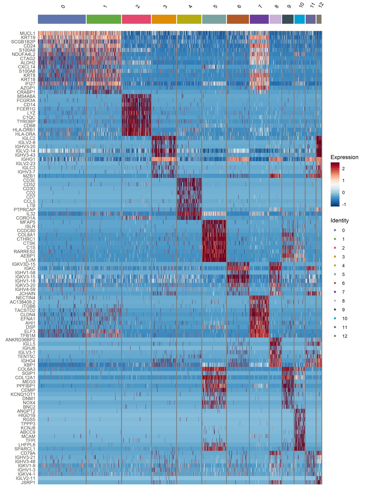

    #> >>>>--- Processsing terms: enrichKEGG
    #>   Cluster       ID                       Description GeneRatio  BgRatio
    #> 1       0 hsa04915        Estrogen signaling pathway       3/9 138/8217
    #> 2       0 hsa04657           IL-17 signaling pathway       2/9  94/8217
    #> 3       0 hsa05150   Staphylococcus aureus infection       2/9  96/8217
    #> 4       0 hsa00770 Pantothenate and CoA biosynthesis       1/9  21/8217
    #> 5       0 hsa00340              Histidine metabolism       1/9  22/8217
    #> 6       0 hsa04744                 Phototransduction       1/9  29/8217
    #>         pvalue   p.adjust     qvalue          geneID Count
    #> 1 0.0003615572 0.02567056 0.02283519 3880/3875/51806     3
    #> 2 0.0044240064 0.10910445 0.09705362       6280/6279     2
    #> 3 0.0046100470 0.10910445 0.09705362       3880/3875     2
    #> 4 0.0227783360 0.21955755 0.19530694             217     1
    #> 5 0.0238514199 0.21955755 0.19530694             217     1
    #> 6 0.0313337253 0.21955755 0.19530694           51806     1
    #> Scale for 'colour' is already present. Adding another scale for 'colour',
    #> which will replace the existing scale.
    #> Scale for 'y' is already present. Adding another scale for 'y', which will
    #> replace the existing scale.
    #> Scale for 'size' is already present. Adding another scale for 'size', which
    #> will replace the existing scale.
    #> >>>>Options for `theme`: light, bw, classic and classic2
    #> >>>>Options for 'legend.position' : none, left, right, bottom, top
    #> >>>>Options for 'legend.direction' : horizontal, vertical

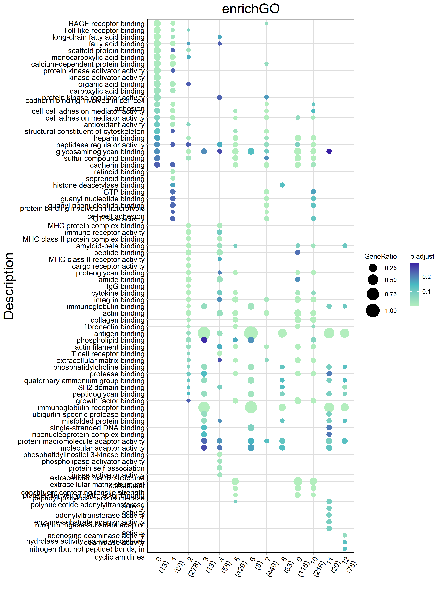

    #> >>>--- Processing cluster: 0
    #>                 p_val   avg_diff pct.1 pct.2    p_val_adj
    #> MUCL1    4.850066e-89  1.3742109 0.934 0.353 1.455020e-85
    #> KRT19    1.162307e-45  0.9584904 0.785 0.336 3.486920e-42
    #> SCGB1B2P 6.709517e-35  0.8905151 0.615 0.273 2.012855e-31
    #> CD24     1.643154e-25  0.7069346 0.618 0.295 4.929463e-22
    #> HERPUD1  5.597419e-25 -0.5886422 0.028 0.337 1.679226e-21
    #> S100A9   1.116281e-24  0.7610898 0.542 0.278 3.348843e-21
    #> [1] "Default assay is RNA"
    #> [1] ">>>-- Colors could be change by parameter: 'cols'"
    #> Warning: 'ncol' is ignored with 'stack' is TRUE
    #> >>>--- Processing cluster: 1
    #>              p_val avg_diff pct.1 pct.2    p_val_adj
    #> KRT19 6.816216e-62 1.262092 0.923 0.341 2.044865e-58
    #> KRT8  4.447644e-58 1.174932 0.683 0.165 1.334293e-54
    #> MUCL1 8.040062e-54 1.221241 0.889 0.391 2.412019e-50
    #> KRT18 2.739457e-53 1.139504 0.625 0.157 8.218371e-50
    #> IFI27 1.547075e-51 1.148295 0.822 0.312 4.641226e-48
    #> CD24  2.064046e-51 1.138587 0.832 0.282 6.192139e-48
    #> [1] "Default assay is RNA"
    #> [1] ">>>-- Colors could be change by parameter: 'cols'"
    #> Warning: 'ncol' is ignored with 'stack' is TRUE
    #> >>>--- Processing cluster: 10
    #>                p_val avg_diff pct.1 pct.2     p_val_adj
    #> ANGPT2 3.653597e-174 3.688994 0.597 0.005 1.096079e-170
    #> HIGD1B 3.182734e-143 3.024160 0.403 0.000 9.548202e-140
    #> ADGRF5 8.831176e-139 2.787931 0.452 0.003 2.649353e-135
    #> RGS5   4.789006e-137 3.358488 0.500 0.006 1.436702e-133
    #> TPPP3  9.161100e-129 3.190419 0.419 0.003 2.748330e-125
    #> KCNJ8  3.302887e-125 3.343189 0.484 0.007 9.908661e-122
    #> [1] "Default assay is RNA"
    #> [1] ">>>-- Colors could be change by parameter: 'cols'"
    #> Warning: 'ncol' is ignored with 'stack' is TRUE
    #> >>>--- Processing cluster: 11
    #>                 p_val avg_diff pct.1 pct.2    p_val_adj
    #> JCHAIN   1.058823e-35 1.723576 0.639 0.111 3.176469e-32
    #> MZB1     1.751796e-27 1.258988 0.672 0.135 5.255387e-24
    #> CD79A    1.971594e-27 1.286727 0.459 0.068 5.914781e-24
    #> IGKC     6.524608e-26 1.498600 0.770 0.229 1.957382e-22
    #> IGHG4    1.347610e-20 1.160401 0.541 0.122 4.042829e-17
    #> IGHV3-21 7.970625e-20 1.455243 0.377 0.067 2.391187e-16
    #> [1] "Default assay is RNA"
    #> [1] ">>>-- Colors could be change by parameter: 'cols'"
    #> Warning: 'ncol' is ignored with 'stack' is TRUE
    #> >>>--- Processing cluster: 12
    #>                  p_val avg_diff pct.1 pct.2     p_val_adj
    #> IGLV2-11 3.707274e-111 2.703933 0.433 0.003 1.112182e-107
    #> IGLV2-8  8.789633e-102 4.119314 1.000 0.047  2.636890e-98
    #> IGHV3-15  2.197230e-91 1.710205 0.600 0.014  6.591691e-88
    #> IGLV2-23  3.781528e-74 1.310309 0.867 0.044  1.134458e-70
    #> IGLC3     1.277973e-71 2.325455 0.933 0.056  3.833920e-68
    #> IGHV3-20  1.470343e-63 3.038623 0.900 0.065  4.411030e-60
    #> [1] "Default assay is RNA"
    #> [1] ">>>-- Colors could be change by parameter: 'cols'"
    #> Warning: 'ncol' is ignored with 'stack' is TRUE
    #> >>>--- Processing cluster: 2
    #>                 p_val avg_diff pct.1 pct.2     p_val_adj
    #> MS4A6A  4.471214e-208 2.369946 0.669 0.008 1.341364e-204
    #> FCGR2A  3.938166e-207 2.325424 0.697 0.012 1.181450e-203
    #> FCGR3A  2.045670e-205 2.436830 0.714 0.016 6.137009e-202
    #> CD14    4.689164e-196 2.397888 0.697 0.018 1.406749e-192
    #> FCER1G  6.333958e-195 2.470609 0.771 0.034 1.900187e-191
    #> HLA-DMB 1.756067e-192 2.298275 0.663 0.013 5.268201e-189
    #> [1] "Default assay is RNA"
    #> [1] ">>>-- Colors could be change by parameter: 'cols'"
    #> Warning: 'ncol' is ignored with 'stack' is TRUE
    #> >>>--- Processing cluster: 3
    #>                  p_val avg_diff pct.1 pct.2     p_val_adj
    #> IGLC2    1.491146e-106 2.228153 0.830 0.140 4.473437e-103
    #> IGLV2-8   3.980442e-85 1.690657 0.442 0.027  1.194133e-81
    #> IGHV3-20  3.603799e-68 1.717997 0.442 0.045  1.081140e-64
    #> IGLV2-14  5.643976e-65 2.155743 0.946 0.407  1.693193e-61
    #> IGHV3-43  1.548559e-62 1.828231 0.571 0.101  4.645678e-59
    #> IGHG1     5.041897e-59 1.542179 0.986 0.380  1.512569e-55
    #> [1] "Default assay is RNA"
    #> [1] ">>>-- Colors could be change by parameter: 'cols'"
    #> Warning: 'ncol' is ignored with 'stack' is TRUE
    #> >>>--- Processing cluster: 4
    #>              p_val avg_diff pct.1 pct.2     p_val_adj
    #> CD3E 1.155491e-210 2.652203 0.633 0.003 3.466472e-207
    #> CD52 1.680668e-178 2.563829 0.646 0.016 5.042004e-175
    #> CD3D 8.013521e-171 2.360330 0.517 0.002 2.404056e-167
    #> CD2  3.372513e-156 2.252043 0.490 0.003 1.011754e-152
    #> CD7  3.885636e-132 2.171050 0.435 0.005 1.165691e-128
    #> CCL5 1.079666e-127 2.285046 0.537 0.023 3.238999e-124
    #> [1] "Default assay is RNA"
    #> [1] ">>>-- Colors could be change by parameter: 'cols'"
    #> Warning: 'ncol' is ignored with 'stack' is TRUE
    #> >>>--- Processing cluster: 5
    #>                p_val avg_diff pct.1 pct.2     p_val_adj
    #> MFAP5  1.612601e-244 2.833053 0.861 0.019 4.837802e-241
    #> LRRC15 3.577192e-232 2.707849 0.854 0.022 1.073158e-228
    #> ISLR   6.644816e-230 2.714363 0.826 0.019 1.993445e-226
    #> FBN1   3.489248e-209 2.619279 0.938 0.048 1.046775e-205
    #> CDH11  1.212171e-205 2.576561 0.944 0.050 3.636514e-202
    #> CCDC80 2.596746e-203 2.716605 0.868 0.041 7.790239e-200
    #> [1] "Default assay is RNA"
    #> [1] ">>>-- Colors could be change by parameter: 'cols'"
    #> Warning: 'ncol' is ignored with 'stack' is TRUE
    #> >>>--- Processing cluster: 6
    #>                  p_val avg_diff pct.1 pct.2    p_val_adj
    #> IGKV3D-15 5.407905e-96 1.823175 0.549 0.040 1.622371e-92
    #> IGKC      1.096894e-86 1.932248 0.917 0.190 3.290683e-83
    #> IGHV1-58  6.903672e-68 1.578563 0.398 0.029 2.071102e-64
    #> IGKV3-15  3.704880e-57 2.241615 0.902 0.367 1.111464e-53
    #> IGHV1-18  3.954544e-47 2.061957 0.820 0.313 1.186363e-43
    #> IGHG1     6.113765e-38 1.306436 0.902 0.393 1.834129e-34
    #> [1] "Default assay is RNA"
    #> [1] ">>>-- Colors could be change by parameter: 'cols'"
    #> Warning: 'ncol' is ignored with 'stack' is TRUE
    #> >>>--- Processing cluster: 7
    #>                    p_val avg_diff pct.1 pct.2     p_val_adj
    #> NECTIN4    5.581495e-217 2.508083 0.825 0.018 1.674448e-213
    #> AC138409.2 1.107658e-163 2.165323 0.711 0.024 3.322973e-160
    #> ITGB6      2.386228e-159 2.138982 0.719 0.026 7.158684e-156
    #> TACSTD2    3.335316e-150 2.464836 0.877 0.062 1.000595e-146
    #> CLDN4      1.032681e-147 2.555189 0.939 0.081 3.098044e-144
    #> PTPRF      3.836876e-146 1.977058 0.807 0.046 1.151063e-142
    #> [1] "Default assay is RNA"
    #> [1] ">>>-- Colors could be change by parameter: 'cols'"
    #> Warning: 'ncol' is ignored with 'stack' is TRUE
    #> >>>--- Processing cluster: 8
    #>                    p_val avg_diff pct.1 pct.2     p_val_adj
    #> ANKRD36BP2 2.653077e-132 2.316645 0.662 0.021 7.959230e-129
    #> IGLL5      4.204828e-122 2.575877 0.831 0.048 1.261448e-118
    #> IGKV3-11   2.253840e-101 1.649068 0.380 0.005  6.761519e-98
    #> IGKV3D-20  8.703143e-100 1.749334 0.521 0.017  2.610943e-96
    #> IGHJ6       1.320058e-91 1.854207 0.451 0.013  3.960173e-88
    #> IGKV3D-11   7.325591e-88 1.616946 0.366 0.007  2.197677e-84
    #> [1] "Default assay is RNA"
    #> [1] ">>>-- Colors could be change by parameter: 'cols'"
    #> Warning: 'ncol' is ignored with 'stack' is TRUE
    #> >>>--- Processing cluster: 9
    #>                p_val avg_diff pct.1 pct.2    p_val_adj
    #> COL6A3  6.959354e-65 2.230415 0.942 0.163 2.087806e-61
    #> SGIP1   8.696383e-62 2.527947 0.507 0.040 2.608915e-58
    #> COL12A1 3.581579e-59 2.085458 0.928 0.166 1.074474e-55
    #> MEG3    3.175272e-57 2.528833 0.580 0.063 9.525816e-54
    #> COL5A2  2.583524e-49 1.853200 0.826 0.149 7.750572e-46
    #> PPFIBP1 3.167317e-49 2.379127 0.725 0.134 9.501950e-46
    #> [1] "Default assay is RNA"
    #> [1] ">>>-- Colors could be change by parameter: 'cols'"
    #> Warning: 'ncol' is ignored with 'stack' is TRUE

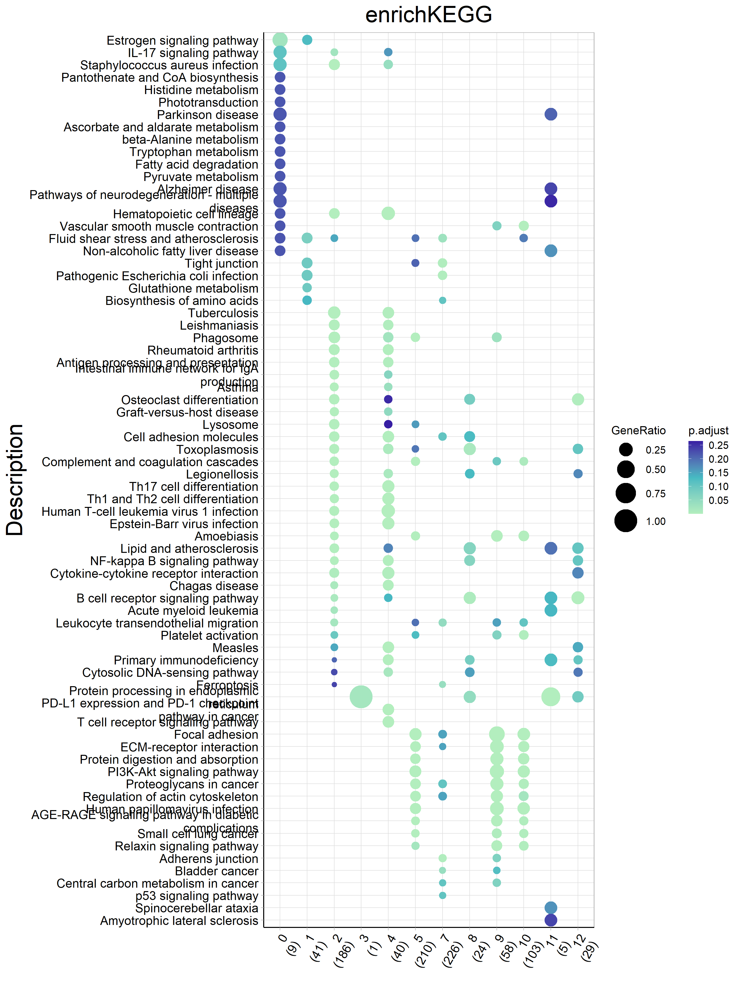

## Doublet detection by DoubletFinder or scds packages

``` r
#find-doublet------------------------------------------------------------------
sce_df<-doublet_detect(sce                  = sce,
                         already_normalized = T,
                         eset               = NULL,
                         file_type          = "10X",
                         data_path          = NULL,
                         project            = "TNBC",
                         index              = 1,
                         check_data         = TRUE,
                         filter_data        = FALSE,
                         minFeature         = 2000,
                         minCount           = 1000,
                         percent.mt         =20,
                         method             = "doubletfinder",
                         save_path          = "./test")
#> An object of class Seurat 
#> 60623 features across 1649 samples within 1 assay 
#> Active assay: RNA (60623 features, 3000 variable features)
#>  3 dimensional reductions calculated: pca, tsne, umap
#> [1] "Creating artificial doublets for pN = 5%"
#> [1] "Creating Seurat object..."
#> [1] "Normalizing Seurat object..."
#> [1] "Finding variable genes..."
#> [1] "Scaling data..."
#> [1] "Running PCA..."
#> [1] "Calculating PC distance matrix..."
#> [1] "Defining neighborhoods..."
#> [1] "Computing pANN across all pK..."
#> [1] "pK = 0.01..."
#> [1] "pK = 0.02..."
#> [1] "pK = 0.03..."
#> [1] "pK = 0.04..."
#> [1] "pK = 0.05..."
#> [1] "pK = 0.06..."
#> [1] "pK = 0.07..."
#> [1] "pK = 0.08..."
#> [1] "pK = 0.09..."
#> [1] "pK = 0.1..."
#> [1] "pK = 0.11..."
#> [1] "pK = 0.12..."
#> [1] "pK = 0.13..."
#> [1] "pK = 0.14..."
#> [1] "pK = 0.15..."
#> [1] "pK = 0.16..."
#> [1] "pK = 0.17..."
#> [1] "pK = 0.18..."
#> [1] "pK = 0.19..."
#> [1] "pK = 0.2..."
#> [1] "pK = 0.21..."
#> [1] "pK = 0.22..."
#> [1] "pK = 0.23..."
#> [1] "pK = 0.24..."
#> [1] "pK = 0.25..."
#> [1] "pK = 0.26..."
#> [1] "pK = 0.27..."
#> [1] "pK = 0.28..."
#> [1] "pK = 0.29..."
#> [1] "pK = 0.3..."
#> [1] "Creating artificial doublets for pN = 10%"
#> [1] "Creating Seurat object..."
#> [1] "Normalizing Seurat object..."
#> [1] "Finding variable genes..."
#> [1] "Scaling data..."
#> [1] "Running PCA..."
#> [1] "Calculating PC distance matrix..."
#> [1] "Defining neighborhoods..."
#> [1] "Computing pANN across all pK..."
#> [1] "pK = 0.01..."
#> [1] "pK = 0.02..."
#> [1] "pK = 0.03..."
#> [1] "pK = 0.04..."
#> [1] "pK = 0.05..."
#> [1] "pK = 0.06..."
#> [1] "pK = 0.07..."
#> [1] "pK = 0.08..."
#> [1] "pK = 0.09..."
#> [1] "pK = 0.1..."
#> [1] "pK = 0.11..."
#> [1] "pK = 0.12..."
#> [1] "pK = 0.13..."
#> [1] "pK = 0.14..."
#> [1] "pK = 0.15..."
#> [1] "pK = 0.16..."
#> [1] "pK = 0.17..."
#> [1] "pK = 0.18..."
#> [1] "pK = 0.19..."
#> [1] "pK = 0.2..."
#> [1] "pK = 0.21..."
#> [1] "pK = 0.22..."
#> [1] "pK = 0.23..."
#> [1] "pK = 0.24..."
#> [1] "pK = 0.25..."
#> [1] "pK = 0.26..."
#> [1] "pK = 0.27..."
#> [1] "pK = 0.28..."
#> [1] "pK = 0.29..."
#> [1] "pK = 0.3..."
#> [1] "Creating artificial doublets for pN = 15%"
#> [1] "Creating Seurat object..."
#> [1] "Normalizing Seurat object..."
#> [1] "Finding variable genes..."
#> [1] "Scaling data..."
#> [1] "Running PCA..."
#> [1] "Calculating PC distance matrix..."
#> [1] "Defining neighborhoods..."
#> [1] "Computing pANN across all pK..."
#> [1] "pK = 0.01..."
#> [1] "pK = 0.02..."
#> [1] "pK = 0.03..."
#> [1] "pK = 0.04..."
#> [1] "pK = 0.05..."
#> [1] "pK = 0.06..."
#> [1] "pK = 0.07..."
#> [1] "pK = 0.08..."
#> [1] "pK = 0.09..."
#> [1] "pK = 0.1..."
#> [1] "pK = 0.11..."
#> [1] "pK = 0.12..."
#> [1] "pK = 0.13..."
#> [1] "pK = 0.14..."
#> [1] "pK = 0.15..."
#> [1] "pK = 0.16..."
#> [1] "pK = 0.17..."
#> [1] "pK = 0.18..."
#> [1] "pK = 0.19..."
#> [1] "pK = 0.2..."
#> [1] "pK = 0.21..."
#> [1] "pK = 0.22..."
#> [1] "pK = 0.23..."
#> [1] "pK = 0.24..."
#> [1] "pK = 0.25..."
#> [1] "pK = 0.26..."
#> [1] "pK = 0.27..."
#> [1] "pK = 0.28..."
#> [1] "pK = 0.29..."
#> [1] "pK = 0.3..."
#> [1] "Creating artificial doublets for pN = 20%"
#> [1] "Creating Seurat object..."
#> [1] "Normalizing Seurat object..."
#> [1] "Finding variable genes..."
#> [1] "Scaling data..."
#> [1] "Running PCA..."
#> [1] "Calculating PC distance matrix..."
#> [1] "Defining neighborhoods..."
#> [1] "Computing pANN across all pK..."
#> [1] "pK = 0.01..."
#> [1] "pK = 0.02..."
#> [1] "pK = 0.03..."
#> [1] "pK = 0.04..."
#> [1] "pK = 0.05..."
#> [1] "pK = 0.06..."
#> [1] "pK = 0.07..."
#> [1] "pK = 0.08..."
#> [1] "pK = 0.09..."
#> [1] "pK = 0.1..."
#> [1] "pK = 0.11..."
#> [1] "pK = 0.12..."
#> [1] "pK = 0.13..."
#> [1] "pK = 0.14..."
#> [1] "pK = 0.15..."
#> [1] "pK = 0.16..."
#> [1] "pK = 0.17..."
#> [1] "pK = 0.18..."
#> [1] "pK = 0.19..."
#> [1] "pK = 0.2..."
#> [1] "pK = 0.21..."
#> [1] "pK = 0.22..."
#> [1] "pK = 0.23..."
#> [1] "pK = 0.24..."
#> [1] "pK = 0.25..."
#> [1] "pK = 0.26..."
#> [1] "pK = 0.27..."
#> [1] "pK = 0.28..."
#> [1] "pK = 0.29..."
#> [1] "pK = 0.3..."
#> [1] "Creating artificial doublets for pN = 25%"
#> [1] "Creating Seurat object..."
#> [1] "Normalizing Seurat object..."
#> [1] "Finding variable genes..."
#> [1] "Scaling data..."
#> [1] "Running PCA..."
#> [1] "Calculating PC distance matrix..."
#> [1] "Defining neighborhoods..."
#> [1] "Computing pANN across all pK..."
#> [1] "pK = 0.01..."
#> [1] "pK = 0.02..."
#> [1] "pK = 0.03..."
#> [1] "pK = 0.04..."
#> [1] "pK = 0.05..."
#> [1] "pK = 0.06..."
#> [1] "pK = 0.07..."
#> [1] "pK = 0.08..."
#> [1] "pK = 0.09..."
#> [1] "pK = 0.1..."
#> [1] "pK = 0.11..."
#> [1] "pK = 0.12..."
#> [1] "pK = 0.13..."
#> [1] "pK = 0.14..."
#> [1] "pK = 0.15..."
#> [1] "pK = 0.16..."
#> [1] "pK = 0.17..."
#> [1] "pK = 0.18..."
#> [1] "pK = 0.19..."
#> [1] "pK = 0.2..."
#> [1] "pK = 0.21..."
#> [1] "pK = 0.22..."
#> [1] "pK = 0.23..."
#> [1] "pK = 0.24..."
#> [1] "pK = 0.25..."
#> [1] "pK = 0.26..."
#> [1] "pK = 0.27..."
#> [1] "pK = 0.28..."
#> [1] "pK = 0.29..."
#> [1] "pK = 0.3..."
#> [1] "Creating artificial doublets for pN = 30%"
#> [1] "Creating Seurat object..."
#> [1] "Normalizing Seurat object..."
#> [1] "Finding variable genes..."
#> [1] "Scaling data..."
#> [1] "Running PCA..."
#> [1] "Calculating PC distance matrix..."
#> [1] "Defining neighborhoods..."
#> [1] "Computing pANN across all pK..."
#> [1] "pK = 0.01..."
#> [1] "pK = 0.02..."
#> [1] "pK = 0.03..."
#> [1] "pK = 0.04..."
#> [1] "pK = 0.05..."
#> [1] "pK = 0.06..."
#> [1] "pK = 0.07..."
#> [1] "pK = 0.08..."
#> [1] "pK = 0.09..."
#> [1] "pK = 0.1..."
#> [1] "pK = 0.11..."
#> [1] "pK = 0.12..."
#> [1] "pK = 0.13..."
#> [1] "pK = 0.14..."
#> [1] "pK = 0.15..."
#> [1] "pK = 0.16..."
#> [1] "pK = 0.17..."
#> [1] "pK = 0.18..."
#> [1] "pK = 0.19..."
#> [1] "pK = 0.2..."
#> [1] "pK = 0.21..."
#> [1] "pK = 0.22..."
#> [1] "pK = 0.23..."
#> [1] "pK = 0.24..."
#> [1] "pK = 0.25..."
#> [1] "pK = 0.26..."
#> [1] "pK = 0.27..."
#> [1] "pK = 0.28..."
#> [1] "pK = 0.29..."
#> [1] "pK = 0.3..."
```

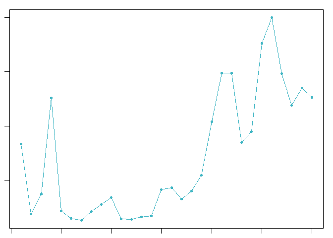

    #> NULL
    #> [1] "Creating 550 artificial doublets..."
    #> [1] "Creating Seurat object..."
    #> [1] "Normalizing Seurat object..."
    #> [1] "Finding variable genes..."
    #> [1] "Scaling data..."
    #> [1] "Running PCA..."
    #> [1] "Calculating PC distance matrix..."
    #> [1] "Computing pANN..."
    #> [1] "Classifying doublets.."
    #> Doublet Singlet 
    #>      40    1609

``` r
head(sce_df@meta.data)
#>                    orig.ident nCount_RNA nFeature_RNA percent.mt percent.rp
#> AAACCTGAGATCACGG-1       TIA2        920          441   3.913043  40.326087
#> AAACCTGGTAGGAGTC-1       TIA2       1164          817  10.395189   1.030928
#> AAACCTGGTGCAGGTA-1       TIA2        599          106  14.357262   2.504174
#> AAACGGGAGGGCTCTC-1       TIA2       3593          453   2.894517   7.180629
#> AAACGGGAGTTCCACA-1       TIA2        889          499  21.034871  13.160855
#> AAACGGGCATCTCGCT-1       TIA2        893          505  21.836506  16.909295
#>                         S.Score    G2M.Score Phase RNA_snn_res.0.4
#> AAACCTGAGATCACGG-1 -0.037260496 -0.033503464    G1               0
#> AAACCTGGTAGGAGTC-1 -0.068185303 -0.083362112    G1               1
#> AAACCTGGTGCAGGTA-1 -0.008520917 -0.001408458    G1               5
#> AAACGGGAGGGCTCTC-1 -0.018726516 -0.018105992    G1               2
#> AAACGGGAGTTCCACA-1 -0.031509755  0.011596915   G2M               4
#> AAACGGGCATCTCGCT-1  0.032450378  0.056456534   G2M               4
#>                    seurat_clusters RNA_snn_res.0.8 RNA_snn_res.1.2
#> AAACCTGAGATCACGG-1               0               0               0
#> AAACCTGGTAGGAGTC-1               9               7               9
#> AAACCTGGTGCAGGTA-1               6               6               5
#> AAACGGGAGGGCTCTC-1               3               1               3
#> AAACGGGAGTTCCACA-1               4               4               7
#> AAACGGGCATCTCGCT-1               4               4               7
#>                    RNA_snn_res.1.6 RNA_snn_res.2 RNA_snn_res.1
#> AAACCTGAGATCACGG-1               0             0             0
#> AAACCTGGTAGGAGTC-1              10            10             9
#> AAACCTGGTGCAGGTA-1               4             4             6
#> AAACGGGAGGGCTCTC-1              11            11             3
#> AAACGGGAGTTCCACA-1               8             7             4
#> AAACGGGCATCTCGCT-1               8             7             4
#>                    pANN_0.25_0.26_41 DF.classifications_0.25_0.26_41
#> AAACCTGAGATCACGG-1         0.1555944                         Singlet
#> AAACCTGGTAGGAGTC-1         0.2132867                         Singlet
#> AAACCTGGTGCAGGTA-1         0.1311189                         Singlet
#> AAACGGGAGGGCTCTC-1         0.1625874                         Singlet
#> AAACGGGAGTTCCACA-1         0.1363636                         Singlet
#> AAACGGGCATCTCGCT-1         0.1398601                         Singlet
#>                    DoubletFinder_final
#> AAACCTGAGATCACGG-1             Singlet
#> AAACCTGGTAGGAGTC-1             Singlet
#> AAACCTGGTGCAGGTA-1             Singlet
#> AAACGGGAGGGCTCTC-1             Singlet
#> AAACGGGAGTTCCACA-1             Singlet
#> AAACGGGCATCTCGCT-1             Singlet
```

``` r

p1<-dong_dimplot(sce              = sce_df,
                 reduction        = "umap",
                 groups           = "DoubletFinder_final",
                 split.by         = NULL,
                 label            = T,
                 label.size       = 5,
                 pt.size          = 0.5,
                 cols             = "normal", 
                 seed             = 54321, 
                 show_col         = F,
                 width            = 8, 
                 height           = 8, 
                 w_index          = 7, 
                 w_add            = 2,
                 max_category     = 14,
                 show_plot        = T,
                 path             = "./test",
                 index            = paste0("1-DoubletFinder"),
                 legend.position  = "right",
                 legend.direction = "vertical",
                 legend.size      = 10)
#> >>>>=== Palette option for random: 1: palette1; 2: palette2; 3: palette3;  4: palette4
#> >>> Processing group:: DoubletFinder_final
#> >>>>Options for `theme`: light, bw, classic and classic2
#> >>>>Options for 'legend.position' : none, left, right, bottom, top
#> >>>>Options for 'legend.direction' : horizontal, vertical
#> >>>>>> Figure name is:: 1-DoubletFinder-1-umap-DoubletFinder_final.pdf
```

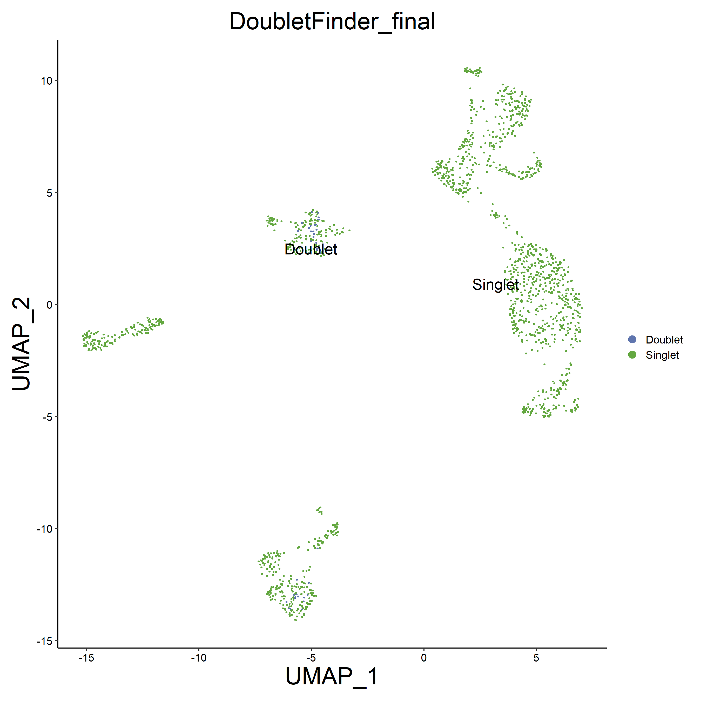

``` r

# gs<-readxl::read_excel("E:/18-Github/scsig/data/ScTyperDB-merged.xlsx", sheet = 1)
# help("sc_type_anno")
sce        <- sc_type_anno(sce         = sce,
                           gs          = NULL,  
                           cell_type   = "base",
                           tissue_type = NULL,
                           assay       = "RNA",
                           cluster     = "RNA_snn_res.1", 
                           db_         = "ScTyperDB-merged.xlsx")
#> >>>-- There are 7 options: base, epithelial, myeloid, tcell, bcell, fibroblast, endothelial
#> Maps last updated on: Thu Oct 24 12:31:05 2019
#> Warning in checkGeneSymbols(markers_all): x contains non-approved gene symbols
#> Maps last updated on: Thu Oct 24 12:31:05 2019
#> Warning in checkGeneSymbols(markers_all): Human gene symbols should be all
#> upper-case except for the 'orf' in open reading frames. The case of some letters
#> was corrected.

#> Warning in checkGeneSymbols(markers_all): x contains non-approved gene symbols
#> Maps last updated on: Thu Oct 24 12:31:05 2019
#> Warning in checkGeneSymbols(markers_all): x contains non-approved gene symbols
#> Maps last updated on: Thu Oct 24 12:31:05 2019
#> Warning in checkGeneSymbols(markers_all): Human gene symbols should be all
#> upper-case except for the 'orf' in open reading frames. The case of some letters
#> was corrected.

#> Warning in checkGeneSymbols(markers_all): x contains non-approved gene symbols
#> Maps last updated on: Thu Oct 24 12:31:05 2019
#> Warning in checkGeneSymbols(markers_all): x contains non-approved gene symbols
#> Maps last updated on: Thu Oct 24 12:31:05 2019
#> Warning in checkGeneSymbols(markers_all): x contains non-approved gene symbols
#> Maps last updated on: Thu Oct 24 12:31:05 2019
#> Warning in checkGeneSymbols(markers_all): x contains non-approved gene symbols
#> Maps last updated on: Thu Oct 24 12:31:05 2019
#> Warning in checkGeneSymbols(markers_all): x contains non-approved gene symbols
#> Maps last updated on: Thu Oct 24 12:31:05 2019
#> Warning in checkGeneSymbols(markers_all): Human gene symbols should be all
#> upper-case except for the 'orf' in open reading frames. The case of some letters
#> was corrected.

#> Warning in checkGeneSymbols(markers_all): x contains non-approved gene symbols
#> Maps last updated on: Thu Oct 24 12:31:05 2019
#> Warning in checkGeneSymbols(markers_all): x contains non-approved gene symbols
#> Maps last updated on: Thu Oct 24 12:31:05 2019
#> Maps last updated on: Thu Oct 24 12:31:05 2019
#> Maps last updated on: Thu Oct 24 12:31:05 2019
#> Maps last updated on: Thu Oct 24 12:31:05 2019
#> Maps last updated on: Thu Oct 24 12:31:05 2019
#> Maps last updated on: Thu Oct 24 12:31:05 2019
#> Maps last updated on: Thu Oct 24 12:31:05 2019
#> Maps last updated on: Thu Oct 24 12:31:05 2019
#> Maps last updated on: Thu Oct 24 12:31:05 2019
#> Maps last updated on: Thu Oct 24 12:31:05 2019
#> Maps last updated on: Thu Oct 24 12:31:05 2019
#> Maps last updated on: Thu Oct 24 12:31:05 2019
#> Maps last updated on: Thu Oct 24 12:31:05 2019
#> Maps last updated on: Thu Oct 24 12:31:05 2019
#> Maps last updated on: Thu Oct 24 12:31:05 2019
#> Maps last updated on: Thu Oct 24 12:31:05 2019
#> Maps last updated on: Thu Oct 24 12:31:05 2019
#> Maps last updated on: Thu Oct 24 12:31:05 2019
#> Warning in checkGeneSymbols(markers_all): x contains non-approved gene symbols
#> Maps last updated on: Thu Oct 24 12:31:05 2019
#> Maps last updated on: Thu Oct 24 12:31:05 2019
#> Maps last updated on: Thu Oct 24 12:31:05 2019
#> Warning in checkGeneSymbols(markers_all): x contains non-approved gene symbols
#> Maps last updated on: Thu Oct 24 12:31:05 2019
#> Warning in checkGeneSymbols(markers_all): x contains non-approved gene symbols
#> Maps last updated on: Thu Oct 24 12:31:05 2019
#> Maps last updated on: Thu Oct 24 12:31:05 2019
#> Warning in checkGeneSymbols(markers_all): x contains non-approved gene symbols
#> Maps last updated on: Thu Oct 24 12:31:05 2019
#> Warning in checkGeneSymbols(markers_all): x contains non-approved gene symbols
#> Maps last updated on: Thu Oct 24 12:31:05 2019
#> Maps last updated on: Thu Oct 24 12:31:05 2019
#> Warning in checkGeneSymbols(markers_all): x contains non-approved gene symbols
#> Maps last updated on: Thu Oct 24 12:31:05 2019
#> Warning in checkGeneSymbols(markers_all): x contains non-approved gene symbols
#> Maps last updated on: Thu Oct 24 12:31:05 2019
#> Warning in checkGeneSymbols(markers_all): x contains non-approved gene symbols
#> Maps last updated on: Thu Oct 24 12:31:05 2019
#> Warning in checkGeneSymbols(markers_all): x contains non-approved gene symbols
#> Maps last updated on: Thu Oct 24 12:31:05 2019
#> Warning in checkGeneSymbols(markers_all): x contains non-approved gene symbols
#> Maps last updated on: Thu Oct 24 12:31:05 2019
#> Warning in checkGeneSymbols(markers_all): x contains non-approved gene symbols
#> Maps last updated on: Thu Oct 24 12:31:05 2019
#> Maps last updated on: Thu Oct 24 12:31:05 2019
#> Maps last updated on: Thu Oct 24 12:31:05 2019
#> Warning in checkGeneSymbols(markers_all): x contains non-approved gene symbols
#> Maps last updated on: Thu Oct 24 12:31:05 2019
#> Warning in checkGeneSymbols(markers_all): Human gene symbols should be all
#> upper-case except for the 'orf' in open reading frames. The case of some letters
#> was corrected.

#> Warning in checkGeneSymbols(markers_all): x contains non-approved gene symbols
#> Maps last updated on: Thu Oct 24 12:31:05 2019
#> Warning in checkGeneSymbols(markers_all): x contains non-approved gene symbols
#> Maps last updated on: Thu Oct 24 12:31:05 2019
#> Warning in checkGeneSymbols(markers_all): x contains non-approved gene symbols
#> Maps last updated on: Thu Oct 24 12:31:05 2019
#> Warning in checkGeneSymbols(markers_all): x contains non-approved gene symbols
#> Maps last updated on: Thu Oct 24 12:31:05 2019
#> Warning in checkGeneSymbols(markers_all): x contains non-approved gene symbols
#> Maps last updated on: Thu Oct 24 12:31:05 2019
#> Warning in checkGeneSymbols(markers_all): x contains non-approved gene symbols
#> Maps last updated on: Thu Oct 24 12:31:05 2019
#> Warning in checkGeneSymbols(markers_all): x contains non-approved gene symbols
#> Maps last updated on: Thu Oct 24 12:31:05 2019
#> Warning in checkGeneSymbols(markers_all): x contains non-approved gene symbols
#> Maps last updated on: Thu Oct 24 12:31:05 2019
#> Warning in checkGeneSymbols(markers_all): x contains non-approved gene symbols
#> Maps last updated on: Thu Oct 24 12:31:05 2019
#> Warning in checkGeneSymbols(markers_all): x contains non-approved gene symbols
#> Maps last updated on: Thu Oct 24 12:31:05 2019
#> Warning in checkGeneSymbols(markers_all): x contains non-approved gene symbols
#> Maps last updated on: Thu Oct 24 12:31:05 2019
#> Warning in checkGeneSymbols(markers_all): x contains non-approved gene symbols
#> Maps last updated on: Thu Oct 24 12:31:05 2019
#> Warning in checkGeneSymbols(markers_all): x contains non-approved gene symbols
#> Maps last updated on: Thu Oct 24 12:31:05 2019
#> Warning in checkGeneSymbols(markers_all): x contains non-approved gene symbols
#> Maps last updated on: Thu Oct 24 12:31:05 2019
#> Warning in checkGeneSymbols(markers_all): x contains non-approved gene symbols
#> Maps last updated on: Thu Oct 24 12:31:05 2019
#> Warning in checkGeneSymbols(markers_all): x contains non-approved gene symbols
#> Maps last updated on: Thu Oct 24 12:31:05 2019
#> Warning in checkGeneSymbols(markers_all): x contains non-approved gene symbols
#> Maps last updated on: Thu Oct 24 12:31:05 2019
#> Warning in checkGeneSymbols(markers_all): x contains non-approved gene symbols
#> Maps last updated on: Thu Oct 24 12:31:05 2019
#> Warning in checkGeneSymbols(markers_all): x contains non-approved gene symbols
#> Maps last updated on: Thu Oct 24 12:31:05 2019
#> Warning in checkGeneSymbols(markers_all): x contains non-approved gene symbols
#> Maps last updated on: Thu Oct 24 12:31:05 2019
#> Warning in checkGeneSymbols(markers_all): x contains non-approved gene symbols
#> Maps last updated on: Thu Oct 24 12:31:05 2019
#> Warning in checkGeneSymbols(markers_all): x contains non-approved gene symbols
#> Maps last updated on: Thu Oct 24 12:31:05 2019
#> Warning in checkGeneSymbols(markers_all): x contains non-approved gene symbols
#> Maps last updated on: Thu Oct 24 12:31:05 2019
#> Warning in checkGeneSymbols(markers_all): x contains non-approved gene symbols
#> Maps last updated on: Thu Oct 24 12:31:05 2019
#> Warning in checkGeneSymbols(markers_all): x contains non-approved gene symbols
#> Maps last updated on: Thu Oct 24 12:31:05 2019
#> Warning in checkGeneSymbols(markers_all): x contains non-approved gene symbols
#> Maps last updated on: Thu Oct 24 12:31:05 2019
#> Warning in checkGeneSymbols(markers_all): x contains non-approved gene symbols
#> Maps last updated on: Thu Oct 24 12:31:05 2019
#> Warning in checkGeneSymbols(markers_all): x contains non-approved gene symbols
#> Maps last updated on: Thu Oct 24 12:31:05 2019
#> Warning in checkGeneSymbols(markers_all): x contains non-approved gene symbols
#> Maps last updated on: Thu Oct 24 12:31:05 2019
#> Warning in checkGeneSymbols(markers_all): x contains non-approved gene symbols
#> Maps last updated on: Thu Oct 24 12:31:05 2019
#> Maps last updated on: Thu Oct 24 12:31:05 2019
#> Warning in checkGeneSymbols(markers_all): x contains non-approved gene symbols
#> Maps last updated on: Thu Oct 24 12:31:05 2019
#> Warning in checkGeneSymbols(markers_all): x contains non-approved gene symbols
#> Maps last updated on: Thu Oct 24 12:31:05 2019
#> Warning in checkGeneSymbols(markers_all): x contains non-approved gene symbols
#> Maps last updated on: Thu Oct 24 12:31:05 2019
#> Warning in checkGeneSymbols(markers_all): x contains non-approved gene symbols
#> Maps last updated on: Thu Oct 24 12:31:05 2019
#> Maps last updated on: Thu Oct 24 12:31:05 2019
#> Warning in checkGeneSymbols(markers_all): x contains non-approved gene symbols
#> Maps last updated on: Thu Oct 24 12:31:05 2019
#> >>>---Assay used to estimation:
#> [1] "RNA"
#> # A tibble: 18 × 3
#> # Groups:   cluster [13]
#>    cluster type                  scores
#>    <fct>   <chr>                  <dbl>
#>  1 0       Epithelial cell         95.6
#>  2 0       Epithelial_cell         95.6
#>  3 9       Fibroblasts            203. 
#>  4 6       Erythroblasts          143. 
#>  5 3       Plasma cells           180. 
#>  6 4       Memory CD8+ T cells    836. 
#>  7 4       Effector CD8+ T cells  836. 
#>  8 1       Epithelial cell        196. 
#>  9 1       Epithelial_cell        196. 
#> 10 2       Myeloid_cells         1157. 
#> 11 12      Memory B cells          77.7
#> 12 5       Fibroblast cell        771. 
#> 13 5       Fibroblast             771. 
#> 14 8       Memory B cells         180. 
#> 15 7       Epithelial cell        261. 
#> 16 7       Epithelial_cell        261. 
#> 17 11      Plasma cells           114. 
#> 18 10      Smooth muscule cell    237.
#> >>>>=== Palette option for random: 1: palette1; 2: palette2; 3: palette3;  4: palette4
#> [1] "'#5f75ae', '#64a841', '#e5486e', '#de8e06', '#b5aa0f', '#7ba39d', '#b15928', '#6a3d9a', '#cab2d6', '#374E55FF', '#00A1D5FF', '#6A6599FF', '#80796BFF', '#e31a1c', '#fb9a99', '#1f78b4', '#a6cee3', '#008280FF', '#3C5488FF', '#8F7700FF', '#666666', '#A20056FF', '#fdbf6f', '#E78AC3', '#b2df8a', '#386CB0', '#CD534CFF', '#008B45FF', '#7AA6DCFF', '#00A087FF', '#A73030FF', '#631879FF', '#003C67FF'"
```

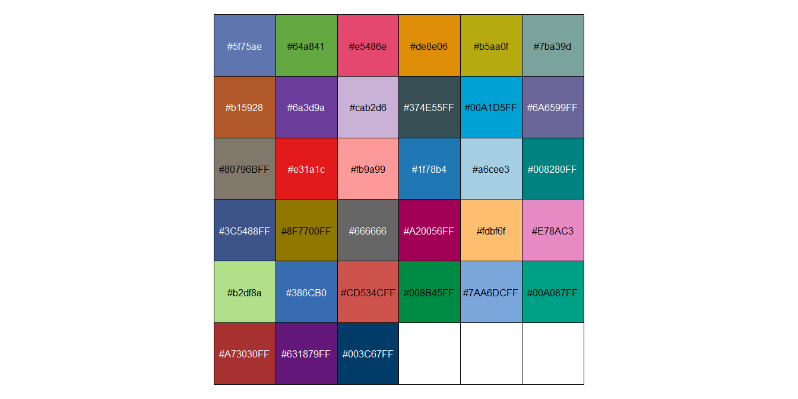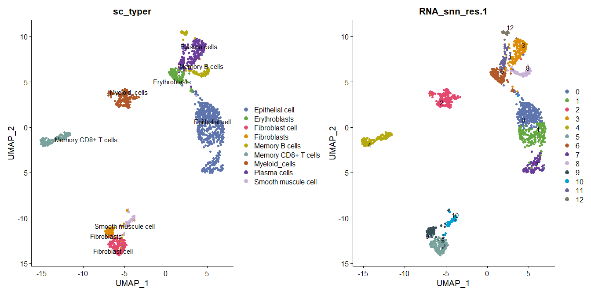

``` r
head(sce)
#>                    orig.ident nCount_RNA nFeature_RNA percent.mt percent.rp
#> AAACCTGAGATCACGG-1       TIA2        920          441   3.913043  40.326087
#> AAACCTGGTAGGAGTC-1       TIA2       1164          817  10.395189   1.030928
#> AAACCTGGTGCAGGTA-1       TIA2        599          106  14.357262   2.504174
#> AAACGGGAGGGCTCTC-1       TIA2       3593          453   2.894517   7.180629
#> AAACGGGAGTTCCACA-1       TIA2        889          499  21.034871  13.160855
#> AAACGGGCATCTCGCT-1       TIA2        893          505  21.836506  16.909295
#> AAACGGGCATGGAATA-1       TIA2       1717          141   5.125218   1.223063
#> AAACGGGGTGTAATGA-1       TIA2       1228          634  11.237785  24.837134
#> AAACGGGTCTTGAGGT-1       TIA2        922          519   9.544469   6.399132
#> AAAGATGAGCGGATCA-1       TIA2       1143          687   9.973753  17.147857
#>                         S.Score    G2M.Score Phase RNA_snn_res.0.4
#> AAACCTGAGATCACGG-1 -0.037260496 -0.033503464    G1               0
#> AAACCTGGTAGGAGTC-1 -0.068185303 -0.083362112    G1               1
#> AAACCTGGTGCAGGTA-1 -0.008520917 -0.001408458    G1               5
#> AAACGGGAGGGCTCTC-1 -0.018726516 -0.018105992    G1               2
#> AAACGGGAGTTCCACA-1 -0.031509755  0.011596915   G2M               4
#> AAACGGGCATCTCGCT-1  0.032450378  0.056456534   G2M               4
#> AAACGGGCATGGAATA-1 -0.005838080 -0.003883598    G1               5
#> AAACGGGGTGTAATGA-1 -0.030304767 -0.031053468    G1               0
#> AAACGGGTCTTGAGGT-1  0.027681443 -0.036425793     S               3
#> AAAGATGAGCGGATCA-1  0.292722100  0.065470663     S               4
#>                    seurat_clusters RNA_snn_res.0.8 RNA_snn_res.1.2
#> AAACCTGAGATCACGG-1               0               0               0
#> AAACCTGGTAGGAGTC-1               9               7               9
#> AAACCTGGTGCAGGTA-1               6               6               5
#> AAACGGGAGGGCTCTC-1               3               1               3
#> AAACGGGAGTTCCACA-1               4               4               7
#> AAACGGGCATCTCGCT-1               4               4               7
#> AAACGGGCATGGAATA-1               6               6               5
#> AAACGGGGTGTAATGA-1               1               0               1
#> AAACGGGTCTTGAGGT-1               2               3               2
#> AAAGATGAGCGGATCA-1               4               4               7
#>                    RNA_snn_res.1.6 RNA_snn_res.2 RNA_snn_res.1
#> AAACCTGAGATCACGG-1               0             0             0
#> AAACCTGGTAGGAGTC-1              10            10             9
#> AAACCTGGTGCAGGTA-1               4             4             6
#> AAACGGGAGGGCTCTC-1              11            11             3
#> AAACGGGAGTTCCACA-1               8             7             4
#> AAACGGGCATCTCGCT-1               8             7             4
#> AAACGGGCATGGAATA-1               4            13             6
#> AAACGGGGTGTAATGA-1               5             3             1
#> AAACGGGTCTTGAGGT-1              13            14             2
#> AAAGATGAGCGGATCA-1               8             7             4
#>                               sc_typer
#> AAACCTGAGATCACGG-1     Epithelial cell
#> AAACCTGGTAGGAGTC-1         Fibroblasts
#> AAACCTGGTGCAGGTA-1       Erythroblasts
#> AAACGGGAGGGCTCTC-1        Plasma cells
#> AAACGGGAGTTCCACA-1 Memory CD8+ T cells
#> AAACGGGCATCTCGCT-1 Memory CD8+ T cells
#> AAACGGGCATGGAATA-1       Erythroblasts
#> AAACGGGGTGTAATGA-1     Epithelial cell
#> AAACGGGTCTTGAGGT-1       Myeloid_cells
#> AAAGATGAGCGGATCA-1 Memory CD8+ T cells
table(sce$sc_typer, sce$seurat_clusters)
#>                      
#>                         0   1   2   3   4   5   6   7   8   9  10  11  12
#>   Epithelial cell     288 208   0   0   0   0   0 114   0   0   0   0   0
#>   Erythroblasts         0   0   0   0   0   0 133   0   0   0   0   0   0
#>   Fibroblast cell       0   0   0   0   0 144   0   0   0   0   0   0   0
#>   Fibroblasts           0   0   0   0   0   0   0   0   0  69   0   0   0
#>   Memory B cells        0   0   0   0   0   0   0   0  71   0   0   0  30
#>   Memory CD8+ T cells   0   0   0   0 147   0   0   0   0   0   0   0   0
#>   Myeloid_cells         0   0 175   0   0   0   0   0   0   0   0   0   0
#>   Plasma cells          0   0   0 147   0   0   0   0   0   0   0  61   0
#>   Smooth muscule cell   0   0   0   0   0   0   0   0   0   0  62   0   0
sce$sc_typer_subcluster<- paste0(sce$sc_typer, "_", sce$seurat_clusters)
```

``` r

signature_for_deg<- signature_metabolism
desig<-find_subcluster_signatures(sce                     = sce,
                                  assay                   = "RNA",                     #选择用于计算评分的数据
                                  col_celltype            = "sc_typer",                 #大类的id
                                  col_sub_celltype        = c("sc_typer_subcluster"),    #亚组信息的id
                                  groups                  = c("sc_typer_subcluster"),        #还可以接着放其他分类："integrated_snn_res.1"
                                  signature_for_deg       = signature_for_deg,     #选择signature
                                  min_cell_count          = 50,                    #每个cluster至少需要的细胞数量
                                  no_limitation_celltypes = NULL,                #不限制细胞数量的细胞亚型
                                  sig_methods             = c( "PCAscore"),  #"ssgsea" ，"AUCell" “PCAscore”
                                  path                    = "./test",   
                                  sig_file_name           = NULL,                     #名字的后缀
                                  index                   = 1,   #可选择细胞的序号进行计算, 如果改成NULL，那将会计算所有细胞的亚组之间的差异signatures
                                  show_feas_pheatmap      = 8,   #展示多少个差异最大的变量
                                  character_limit_heatmap = 80 ,
                                  cols                    = c(palettes(palette = "set2"), palettes(palette = "nrc")), 
                                  remove_other_celltypes  = FALSE,  #当发现细胞亚组里面出现了别的细胞时，可以使用该参数剔除其他类型的细胞
                                  find_cluster_sig        = FALSE , #If true, differential signatures between clusters will be estimate firstly.
                                  groups_for_cluster      = NULL ) # 用于比较大类之间的差异signatures, 默认为col_celltype, 如果提供多个则进入循环
#> >>>---Celltype of Seurat object:
#> sc_typer
#>     Epithelial cell       Erythroblasts     Fibroblast cell         Fibroblasts 
#>                 610                 133                 144                  69 
#>      Memory B cells Memory CD8+ T cells       Myeloid_cells        Plasma cells 
#>                 101                 147                 175                 208 
#> Smooth muscule cell 
#>                  62
#> >>>---The order of celltypes:
#> [1] "Epithelial cell"     "Fibroblasts"         "Erythroblasts"      
#> [4] "Plasma cells"        "Memory CD8+ T cells" "Myeloid_cells"      
#> [7] "Memory B cells"      "Fibroblast cell"     "Smooth muscule cell"
#> >>>--------------------------
#> >>>---Celltypes that will be processed:
#> [1] "Epithelial cell"
#> >>>---Assay used to calculate signature score:
#> [1] "RNA"
#> >>>>----Processing celltypes Epithelial cell
#> >>>--- Counts of celltypes before filtering:
#> 
#> Epithelial cell_0 Epithelial cell_1 Epithelial cell_7 
#>               288               208               114
#> >>>--- Counts of celltypes after filtering step-1:  Removing minimal cell counts: 10
#> 
#> Epithelial cell_0 Epithelial cell_1 Epithelial cell_7 
#>               288               208               114
#> >>>--- Choose clusters with cell counts more than 50 :
#> 
#> [1] "Epithelial cell_0" "Epithelial cell_1" "Epithelial cell_7"
#> >>>--- Counts of celltypes after filtering step-2 :
#> 
#> Epithelial cell_0 Epithelial cell_1 Epithelial cell_7 
#>               288               208               114
#> Validating object structure
#> Updating object slots
#> Ensuring keys are in the proper structure
#> Ensuring feature names don't have underscores or pipes
#> Object representation is consistent with the most current Seurat version
#> [1] "--------------------------------------------"
#> >>>--- Calculate PCA scores
#> Warning: In prcomp.default(t(eset), na.action = na.omit, scale. = T) :
#>  extra argument 'na.action' will be disregarded

#> Warning: In prcomp.default(t(eset), na.action = na.omit, scale. = T) :
#>  extra argument 'na.action' will be disregarded

#> Warning: In prcomp.default(t(eset), na.action = na.omit, scale. = T) :
#>  extra argument 'na.action' will be disregarded

#> Warning: In prcomp.default(t(eset), na.action = na.omit, scale. = T) :
#>  extra argument 'na.action' will be disregarded

#> Warning: In prcomp.default(t(eset), na.action = na.omit, scale. = T) :
#>  extra argument 'na.action' will be disregarded

#> Warning: In prcomp.default(t(eset), na.action = na.omit, scale. = T) :
#>  extra argument 'na.action' will be disregarded

#> Warning: In prcomp.default(t(eset), na.action = na.omit, scale. = T) :
#>  extra argument 'na.action' will be disregarded

#> Warning: In prcomp.default(t(eset), na.action = na.omit, scale. = T) :
#>  extra argument 'na.action' will be disregarded

#> Warning: In prcomp.default(t(eset), na.action = na.omit, scale. = T) :
#>  extra argument 'na.action' will be disregarded

#> Warning: In prcomp.default(t(eset), na.action = na.omit, scale. = T) :
#>  extra argument 'na.action' will be disregarded

#> Warning: In prcomp.default(t(eset), na.action = na.omit, scale. = T) :
#>  extra argument 'na.action' will be disregarded

#> Warning: In prcomp.default(t(eset), na.action = na.omit, scale. = T) :
#>  extra argument 'na.action' will be disregarded

#> Warning: In prcomp.default(t(eset), na.action = na.omit, scale. = T) :
#>  extra argument 'na.action' will be disregarded

#> Warning: In prcomp.default(t(eset), na.action = na.omit, scale. = T) :
#>  extra argument 'na.action' will be disregarded

#> Warning: In prcomp.default(t(eset), na.action = na.omit, scale. = T) :
#>  extra argument 'na.action' will be disregarded

#> Warning: In prcomp.default(t(eset), na.action = na.omit, scale. = T) :
#>  extra argument 'na.action' will be disregarded

#> Warning: In prcomp.default(t(eset), na.action = na.omit, scale. = T) :
#>  extra argument 'na.action' will be disregarded

#> Warning: In prcomp.default(t(eset), na.action = na.omit, scale. = T) :
#>  extra argument 'na.action' will be disregarded

#> Warning: In prcomp.default(t(eset), na.action = na.omit, scale. = T) :
#>  extra argument 'na.action' will be disregarded

#> Warning: In prcomp.default(t(eset), na.action = na.omit, scale. = T) :
#>  extra argument 'na.action' will be disregarded

#> Warning: In prcomp.default(t(eset), na.action = na.omit, scale. = T) :
#>  extra argument 'na.action' will be disregarded

#> Warning: In prcomp.default(t(eset), na.action = na.omit, scale. = T) :
#>  extra argument 'na.action' will be disregarded

#> Warning: In prcomp.default(t(eset), na.action = na.omit, scale. = T) :
#>  extra argument 'na.action' will be disregarded

#> Warning: In prcomp.default(t(eset), na.action = na.omit, scale. = T) :
#>  extra argument 'na.action' will be disregarded

#> Warning: In prcomp.default(t(eset), na.action = na.omit, scale. = T) :
#>  extra argument 'na.action' will be disregarded

#> Warning: In prcomp.default(t(eset), na.action = na.omit, scale. = T) :
#>  extra argument 'na.action' will be disregarded

#> Warning: In prcomp.default(t(eset), na.action = na.omit, scale. = T) :
#>  extra argument 'na.action' will be disregarded

#> Warning: In prcomp.default(t(eset), na.action = na.omit, scale. = T) :
#>  extra argument 'na.action' will be disregarded

#> Warning: In prcomp.default(t(eset), na.action = na.omit, scale. = T) :
#>  extra argument 'na.action' will be disregarded

#> Warning: In prcomp.default(t(eset), na.action = na.omit, scale. = T) :
#>  extra argument 'na.action' will be disregarded

#> Warning: In prcomp.default(t(eset), na.action = na.omit, scale. = T) :
#>  extra argument 'na.action' will be disregarded

#> Warning: In prcomp.default(t(eset), na.action = na.omit, scale. = T) :
#>  extra argument 'na.action' will be disregarded

#> Warning: In prcomp.default(t(eset), na.action = na.omit, scale. = T) :
#>  extra argument 'na.action' will be disregarded

#> Warning: In prcomp.default(t(eset), na.action = na.omit, scale. = T) :
#>  extra argument 'na.action' will be disregarded

#> Warning: In prcomp.default(t(eset), na.action = na.omit, scale. = T) :
#>  extra argument 'na.action' will be disregarded

#> Warning: In prcomp.default(t(eset), na.action = na.omit, scale. = T) :
#>  extra argument 'na.action' will be disregarded

#> Warning: In prcomp.default(t(eset), na.action = na.omit, scale. = T) :
#>  extra argument 'na.action' will be disregarded

#> Warning: In prcomp.default(t(eset), na.action = na.omit, scale. = T) :
#>  extra argument 'na.action' will be disregarded

#> Warning: In prcomp.default(t(eset), na.action = na.omit, scale. = T) :
#>  extra argument 'na.action' will be disregarded

#> Warning: In prcomp.default(t(eset), na.action = na.omit, scale. = T) :
#>  extra argument 'na.action' will be disregarded

#> Warning: In prcomp.default(t(eset), na.action = na.omit, scale. = T) :
#>  extra argument 'na.action' will be disregarded

#> Warning: In prcomp.default(t(eset), na.action = na.omit, scale. = T) :
#>  extra argument 'na.action' will be disregarded

#> Warning: In prcomp.default(t(eset), na.action = na.omit, scale. = T) :
#>  extra argument 'na.action' will be disregarded

#> Warning: In prcomp.default(t(eset), na.action = na.omit, scale. = T) :
#>  extra argument 'na.action' will be disregarded

#> Warning: In prcomp.default(t(eset), na.action = na.omit, scale. = T) :
#>  extra argument 'na.action' will be disregarded

#> Warning: In prcomp.default(t(eset), na.action = na.omit, scale. = T) :
#>  extra argument 'na.action' will be disregarded

#> Warning: In prcomp.default(t(eset), na.action = na.omit, scale. = T) :
#>  extra argument 'na.action' will be disregarded

#> Warning: In prcomp.default(t(eset), na.action = na.omit, scale. = T) :
#>  extra argument 'na.action' will be disregarded

#> Warning: In prcomp.default(t(eset), na.action = na.omit, scale. = T) :
#>  extra argument 'na.action' will be disregarded

#> Warning: In prcomp.default(t(eset), na.action = na.omit, scale. = T) :
#>  extra argument 'na.action' will be disregarded

#> Warning: In prcomp.default(t(eset), na.action = na.omit, scale. = T) :
#>  extra argument 'na.action' will be disregarded

#> Warning: In prcomp.default(t(eset), na.action = na.omit, scale. = T) :
#>  extra argument 'na.action' will be disregarded

#> Warning: In prcomp.default(t(eset), na.action = na.omit, scale. = T) :
#>  extra argument 'na.action' will be disregarded

#> Warning: In prcomp.default(t(eset), na.action = na.omit, scale. = T) :
#>  extra argument 'na.action' will be disregarded

#> Warning: In prcomp.default(t(eset), na.action = na.omit, scale. = T) :
#>  extra argument 'na.action' will be disregarded

#> Warning: In prcomp.default(t(eset), na.action = na.omit, scale. = T) :
#>  extra argument 'na.action' will be disregarded

#> Warning: In prcomp.default(t(eset), na.action = na.omit, scale. = T) :
#>  extra argument 'na.action' will be disregarded

#> Warning: In prcomp.default(t(eset), na.action = na.omit, scale. = T) :
#>  extra argument 'na.action' will be disregarded

#> Warning: In prcomp.default(t(eset), na.action = na.omit, scale. = T) :
#>  extra argument 'na.action' will be disregarded

#> Warning: In prcomp.default(t(eset), na.action = na.omit, scale. = T) :
#>  extra argument 'na.action' will be disregarded

#> Warning: In prcomp.default(t(eset), na.action = na.omit, scale. = T) :
#>  extra argument 'na.action' will be disregarded

#> Warning: In prcomp.default(t(eset), na.action = na.omit, scale. = T) :
#>  extra argument 'na.action' will be disregarded

#> Warning: In prcomp.default(t(eset), na.action = na.omit, scale. = T) :
#>  extra argument 'na.action' will be disregarded

#> Warning: In prcomp.default(t(eset), na.action = na.omit, scale. = T) :
#>  extra argument 'na.action' will be disregarded

#> Warning: In prcomp.default(t(eset), na.action = na.omit, scale. = T) :
#>  extra argument 'na.action' will be disregarded

#> Warning: In prcomp.default(t(eset), na.action = na.omit, scale. = T) :
#>  extra argument 'na.action' will be disregarded

#> Warning: In prcomp.default(t(eset), na.action = na.omit, scale. = T) :
#>  extra argument 'na.action' will be disregarded

#> Warning: In prcomp.default(t(eset), na.action = na.omit, scale. = T) :
#>  extra argument 'na.action' will be disregarded

#> Warning: In prcomp.default(t(eset), na.action = na.omit, scale. = T) :
#>  extra argument 'na.action' will be disregarded

#> Warning: In prcomp.default(t(eset), na.action = na.omit, scale. = T) :
#>  extra argument 'na.action' will be disregarded

#> Warning: In prcomp.default(t(eset), na.action = na.omit, scale. = T) :
#>  extra argument 'na.action' will be disregarded

#> Warning: In prcomp.default(t(eset), na.action = na.omit, scale. = T) :
#>  extra argument 'na.action' will be disregarded

#> Warning: In prcomp.default(t(eset), na.action = na.omit, scale. = T) :
#>  extra argument 'na.action' will be disregarded

#> Warning: In prcomp.default(t(eset), na.action = na.omit, scale. = T) :
#>  extra argument 'na.action' will be disregarded

#> Warning: In prcomp.default(t(eset), na.action = na.omit, scale. = T) :
#>  extra argument 'na.action' will be disregarded

#> Warning: In prcomp.default(t(eset), na.action = na.omit, scale. = T) :
#>  extra argument 'na.action' will be disregarded

#> Warning: In prcomp.default(t(eset), na.action = na.omit, scale. = T) :
#>  extra argument 'na.action' will be disregarded

#> Warning: In prcomp.default(t(eset), na.action = na.omit, scale. = T) :
#>  extra argument 'na.action' will be disregarded
#>                    Cholesterol_Biosynthesis Citric_Acid_Cycle
#> AAACCTGAGATCACGG-1                -0.409588        -0.8006785
#> AAACGGGGTGTAATGA-1                -0.409588         1.6928869
#> AAAGATGCAGAGTGTG-1                -0.409588        -0.8006785
#> AAATGCCCACACCGCA-1                -0.409588         1.4715125
#> AAATGCCGTGTTTGGT-1                -0.409588        -0.8006785
#>                    Cyclooxygenase_Arachidonic_Acid_Metabolism
#> AAACCTGAGATCACGG-1                                 -0.7714870
#> AAACGGGGTGTAATGA-1                                  1.1090980
#> AAAGATGCAGAGTGTG-1                                 -0.7714870
#> AAATGCCCACACCGCA-1                                  0.5375090
#> AAATGCCGTGTTTGGT-1                                  0.8824337
#>                    Prostaglandin_Biosynthesis Purine_Biosynthesis
#> AAACCTGAGATCACGG-1                -12.4623217          -0.2196037
#> AAACGGGGTGTAATGA-1                 -0.1329478          -0.2196037
#> AAAGATGCAGAGTGTG-1                 -0.1329478          -0.2196037
#> AAATGCCCACACCGCA-1                 -0.1329478          -0.2196037
#> AAATGCCGTGTTTGGT-1                 -0.1329478          -0.2196037
#> Warning: Feature names cannot have underscores ('_'), replacing with dashes
#> ('-')
#> Warning: Feature names cannot have underscores ('_'), replacing with dashes
#> ('-')
#> >>>--- Finish calculate PCA scores
#> --------------------------------------
#> >>>--- Counts of celltypes before filtering:
#> 
#> Epithelial cell_0 Epithelial cell_1 Epithelial cell_7 
#>               288               208               114
#> >>>--- Counts of celltypes after filtering step-1:  Removing minimal cell counts: 10
#> 
#> Epithelial cell_0 Epithelial cell_1 Epithelial cell_7 
#>               288               208               114
#> >>>--- Choose clusters with cell counts more than 50 :
#> 
#> [1] "Epithelial cell_0" "Epithelial cell_1" "Epithelial cell_7"
#> >>>--- Counts of celltypes after filtering step-2 :
#> 
#> Epithelial cell_0 Epithelial cell_1 Epithelial cell_7 
#>               288               208               114 
#> 
#> Epithelial cell_0 Epithelial cell_1 Epithelial cell_7 
#>               288               208               114
#> Calculate differential gene set : PCAscore
#> >>>--- Counts of celltypes before filtering:
#> 
#> Epithelial cell_0 Epithelial cell_1 Epithelial cell_7 
#>               288               208               114
#> >>>--- Counts of celltypes after filtering step-1:  Removing minimal cell counts: 10
#> 
#> Epithelial cell_0 Epithelial cell_1 Epithelial cell_7 
#>               288               208               114
#> >>>--- Choose clusters with cell counts more than 50 :
#> 
#> [1] "Epithelial cell_0" "Epithelial cell_1" "Epithelial cell_7"
#> >>>--- Counts of celltypes after filtering step-2 :
#> 
#> Epithelial cell_0 Epithelial cell_1 Epithelial cell_7 
#>               288               208               114 
#> 
#> Epithelial cell_0 Epithelial cell_1 Epithelial cell_7 
#>               288               208               114
#> >>>---Assay used to estimation:
#> [1] "PCAscore"
#> >>> Idents of Seurat object is: sc_typer_subcluster
#> 
#> Epithelial cell_0 Epithelial cell_1 Epithelial cell_7 
#>               288               208               114 
#> [1] "'#66C2A5', '#FC8D62', '#8DA0CB', '#E78AC3', '#A6D854', '#FFD92F', '#E5C494'"
```

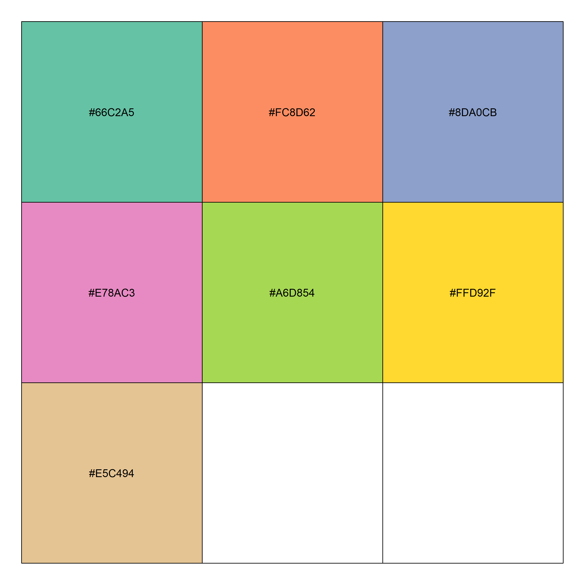

    #> [1] "'#E64B35FF', '#4DBBD5FF', '#00A087FF', '#3C5488FF', '#F39B7FFF', '#8491B4FF', '#91D1C2FF', '#DC0000FF', '#7E6148FF'"
    #> Calculating cluster Epithelial cell_0
    #> Calculating cluster Epithelial cell_1
    #> Calculating cluster Epithelial cell_7
    #>                                                   p_val avg_log2FC pct.1 pct.2
    #> Retinoid-Metabolism                        4.096247e-08  0.3095880 0.830 0.497
    #> Alanine-Aspartate-and-Glutamate-Metabolism 9.479329e-06  0.3112203 0.572 0.376
    #> Glycine-Serine-and-Threonine-Metabolism    3.564841e-05  0.3459432 0.380 0.219
    #> Glutathione-Metabolism                     9.264355e-05  0.3036686 0.538 0.366
    #> Arginine-Biosynthesis                      9.321387e-04  0.3275821 0.567 0.391
    #> Tryptophan-Metabolism                      1.687620e-03  0.2941376 0.553 0.463
    #>                                               p_val_adj           cluster
    #> Retinoid-Metabolism                        3.195073e-06 Epithelial cell_0
    #> Alanine-Aspartate-and-Glutamate-Metabolism 7.393877e-04 Epithelial cell_1
    #> Glycine-Serine-and-Threonine-Metabolism    2.780576e-03 Epithelial cell_1
    #> Glutathione-Metabolism                     7.226197e-03 Epithelial cell_1
    #> Arginine-Biosynthesis                      7.270682e-02 Epithelial cell_1
    #> Tryptophan-Metabolism                      1.316343e-01 Epithelial cell_1
    #>                                                                                  gene
    #> Retinoid-Metabolism                                               Retinoid-Metabolism
    #> Alanine-Aspartate-and-Glutamate-Metabolism Alanine-Aspartate-and-Glutamate-Metabolism
    #> Glycine-Serine-and-Threonine-Metabolism       Glycine-Serine-and-Threonine-Metabolism
    #> Glutathione-Metabolism                                         Glutathione-Metabolism
    #> Arginine-Biosynthesis                                           Arginine-Biosynthesis
    #> Tryptophan-Metabolism                                           Tryptophan-Metabolism
    #> Scale for 'fill' is already present. Adding another scale for 'fill', which
    #> will replace the existing scale.

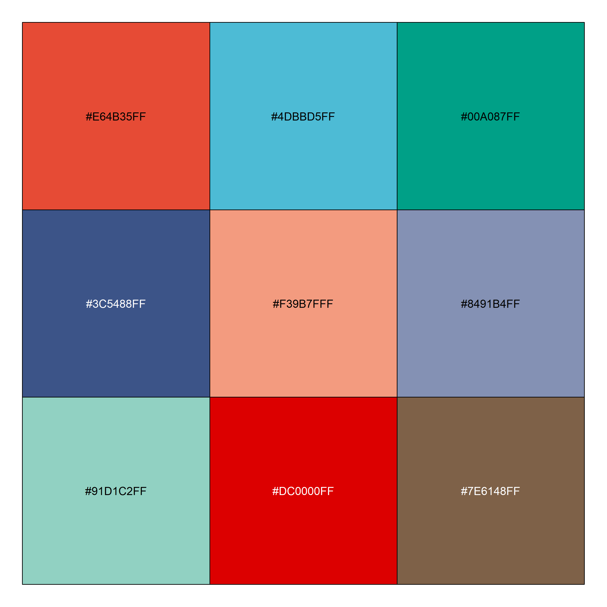

    #> >>> Idents of Seurat object is: sc_typer_subcluster
    #> 
    #> Epithelial cell_0 Epithelial cell_1 Epithelial cell_7 
    #>               288               208               114
    #> >>>--- Results of DEs..
    #>                                                     p_val avg_log2FC pct.1
    #> Retinoid-Metabolism                          4.096247e-08  0.3095880 0.830
    #> Alanine-Aspartate-and-Glutamate-Metabolism   9.479329e-06  0.3112203 0.572
    #> Glycine-Serine-and-Threonine-Metabolism      3.564841e-05  0.3459432 0.380
    #> Glutathione-Metabolism                       9.264355e-05  0.3036686 0.538
    #> Arginine-Biosynthesis                        9.321387e-04  0.3275821 0.567
    #> Tryptophan-Metabolism                        1.687620e-03  0.2941376 0.553
    #> Glyoxylate-and-Dicarboxylate-Metabolism      2.663643e-03  0.3653923 0.447
    #> Retinol-Metabolism                           3.121736e-03  0.1685700 0.264
    #> Arginine-and-Proline-Metabolism              7.390828e-03  0.1993055 0.447
    #> Porphyrin-and-Chlorophyll-Metabolism         1.327154e-49  1.1310545 0.693
    #> Glycerophospholipid-Metabolism               2.354335e-45  1.5288479 0.895
    #> Biosynthesis-of-Unsaturated-Fatty-Acids      3.454798e-44  1.0166821 0.561
    #> Glycosphingolipid-Biosynthesis               5.060507e-43  1.4753278 0.614
    #> Starch-and-Suctose-Metabolism                6.284087e-42  0.9872770 0.605
    #> Ether-Lipid-Metabolism                       4.177511e-38  1.2405077 0.789
    #> Shingolipid-Metabolism                       1.211932e-37  1.5501398 0.842
    #> Fatty-Acid-Elongation                        4.266541e-36  0.9755714 0.746
    #> Metabolism-of-Xenobiotics-by-Cytochrome-P450 4.900332e-34  1.4732931 0.825
    #> Cysteine-and-Methionine-Metabolism           1.211223e-31  0.7955262 0.570
    #> Glycerolipid-Metabolism                      1.317182e-31  1.3752793 0.904
    #> Drug-Metabolism-by-Cytochrome-P450           3.743810e-31  1.1503979 0.737
    #> Fructose-and-Mannose-Metabolism              2.110598e-29  0.8685962 0.719
    #> Butanoate-Metabolism                         3.972907e-29  0.8516687 0.570
    #> Primary-Bile-Acid-Biosynthesis               4.867329e-28  0.7458746 0.325
    #> Glycolysis                                   4.552346e-27  1.2833701 0.781
    #> Galactose-Metabolism                         6.131928e-27  0.9803787 0.789
    #> Nitrogen-Metabolism                          2.227288e-26  0.9843078 0.781
    #> Pyruvate-Metabolism                          5.894729e-25  1.3010289 0.623
    #> Nicotinate-and-Nicotinamide-Metabolism       6.356404e-25  0.3745830 0.561
    #> Steroid-Biosynthesis                         7.425103e-25  0.5138439 0.377
    #> Gluconeogenesis                              3.141905e-24  1.1890189 0.746
    #> Glutathione-Metabolism1                      5.361536e-24  1.2977810 0.833
    #> Taurine-and-Hypotaurine-Metabolism           1.426043e-23  0.6432504 0.316
    #> Pentose-Phosphate                            3.211456e-23  0.5452729 0.649
    #> Nicotinamide-Adenine-Metabolism              3.307259e-23  0.5516813 0.465
    #> Inositol-Phosphate-Metabolism                2.118242e-21  0.7568356 0.360
    #> Ketone-Biosynthesis-and-Metabolism           1.261759e-20  0.5846790 0.430
    #> N-Glycan-Biosynthesis                        6.710208e-20  0.4213766 0.342
    #> Retinoic-Acid-Metabolism                     3.859442e-19  0.9585713 0.702
    #> Amino-Sugar-and-Nucleotide-Sugar-Metabolism  5.348700e-19  0.5938185 0.412
    #> Other-Types-of-O-Glycan-Biosynthesis         5.434184e-19  0.2172848 0.316
    #> Drug-Metabolism-by-other-enzymes             4.045431e-18  0.6599132 0.474
    #> Valine-Leucine-and-Isoleucine-Degradation    6.586458e-18  0.8029248 0.588
    #> Purine-Metabolism                            3.034125e-17  0.7527163 0.614
    #> Valine-Leucine-and-Isoleucine-Biosynthesis   3.445955e-17  0.4391785 0.351
    #> Urea-Cycle                                   8.494183e-17  0.5821904 0.737
    #> Pantothenate-and-CoA-Biosynthesis            1.163877e-16  0.5893510 0.325
    #> Terpenoid-Backbone-Biosynthesis              2.234438e-16  0.5301625 0.289
    #> Arginine-Biosynthesis1                       1.905963e-15  0.7420235 0.798
    #> Homocysteine-Biosynthesis                    6.581986e-15  0.4066571 0.675
    #> Glyoxylate-and-Dicarboxylate-Metabolism1     1.961451e-14  0.5394498 0.658
    #> Cholesterol-Biosynthesis                     3.137702e-14  0.6911302 0.491
    #> Glycosaminoglycan-Biosynthesis               1.611327e-13  0.3652130 0.421
    #> Kynurenine-Metabolism                        1.083286e-12  0.6579943 0.798
    #> Retinol-Metabolism1                          2.155738e-12  0.4606007 0.465
    #> Alanine-Aspartate-and-Glutamate-Metabolism1  2.777693e-11  0.5642686 0.746
    #> Purine-Biosynthesis                          2.904194e-11  0.1337227 0.535
    #> Citric-Acid-Cycle                            5.574243e-11  0.5791962 0.798
    #> Fatty-Acid-Degradation                       3.056310e-10  0.6303378 0.632
    #> Methionine-Cycle                             1.089768e-08  0.6935428 0.579
    #> Lysine-Degradation                           1.262986e-08  0.5520295 0.421
    #> Prostaglandin-Biosynthesis                   1.969729e-08  0.1067158 0.281
    #> Cyclooxygenase-Arachidonic-Acid-Metabolism   3.403220e-08  0.5480257 0.632
    #> Tryptophan-Metabolism1                       4.320656e-08  0.6124316 0.711
    #> Glycine-Serine-and-Threonine-Metabolism1     1.582001e-07  0.1972633 0.509
    #> Fatty-Acid-Biosynthesis                      2.368838e-07  0.4331460 0.544
    #> Tyrosine-Metabolism                          8.970896e-07  0.2527263 0.386
    #> Phenylalanine-Metabolism                     8.970896e-07  0.2527263 0.386
    #> Arginine-and-Proline-Metabolism1             8.211290e-04  0.3146832 0.412
    #> Beta-Alanine-Metabolism                      2.288946e-03  0.2199376 0.491
    #> Histidine-Metabolism                         2.623981e-03  0.2331474 0.500
    #>                                              pct.2    p_val_adj
    #> Retinoid-Metabolism                          0.497 3.195073e-06
    #> Alanine-Aspartate-and-Glutamate-Metabolism   0.376 7.393877e-04
    #> Glycine-Serine-and-Threonine-Metabolism      0.219 2.780576e-03
    #> Glutathione-Metabolism                       0.366 7.226197e-03
    #> Arginine-Biosynthesis                        0.391 7.270682e-02
    #> Tryptophan-Metabolism                        0.463 1.316343e-01
    #> Glyoxylate-and-Dicarboxylate-Metabolism      0.318 2.077641e-01
    #> Retinol-Metabolism                           0.172 2.434954e-01
    #> Arginine-and-Proline-Metabolism              0.383 5.764846e-01
    #> Porphyrin-and-Chlorophyll-Metabolism         0.093 1.035180e-47
    #> Glycerophospholipid-Metabolism               0.242 1.836381e-43
    #> Biosynthesis-of-Unsaturated-Fatty-Acids      0.048 2.694743e-42
    #> Glycosphingolipid-Biosynthesis               0.085 3.947195e-41
    #> Starch-and-Suctose-Metabolism                0.060 4.901588e-40
    #> Ether-Lipid-Metabolism                       0.230 3.258459e-36
    #> Shingolipid-Metabolism                       0.292 9.453066e-36
    #> Fatty-Acid-Elongation                        0.143 3.327902e-34
    #> Metabolism-of-Xenobiotics-by-Cytochrome-P450 0.304 3.822259e-32
    #> Cysteine-and-Methionine-Metabolism           0.069 9.447540e-30
    #> Glycerolipid-Metabolism                      0.288 1.027402e-29
    #> Drug-Metabolism-by-Cytochrome-P450           0.250 2.920172e-29
    #> Fructose-and-Mannose-Metabolism              0.188 1.646267e-27
    #> Butanoate-Metabolism                         0.115 3.098868e-27
    #> Primary-Bile-Acid-Biosynthesis               0.018 3.796517e-26
    #> Glycolysis                                   0.246 3.550830e-25
    #> Galactose-Metabolism                         0.240 4.782904e-25
    #> Nitrogen-Metabolism                          0.260 1.737284e-24
    #> Pyruvate-Metabolism                          0.101 4.597888e-23
    #> Nicotinate-and-Nicotinamide-Metabolism       0.192 4.957995e-23
    #> Steroid-Biosynthesis                         0.050 5.791581e-23
    #> Gluconeogenesis                              0.236 2.450686e-22
    #> Glutathione-Metabolism1                      0.331 4.181998e-22
    #> Taurine-and-Hypotaurine-Metabolism           0.026 1.112314e-21
    #> Pentose-Phosphate                            0.149 2.504935e-21
    #> Nicotinamide-Adenine-Metabolism              0.077 2.579662e-21
    #> Inositol-Phosphate-Metabolism                0.127 1.652229e-19
    #> Ketone-Biosynthesis-and-Metabolism           0.099 9.841720e-19
    #> N-Glycan-Biosynthesis                        0.044 5.233962e-18
    #> Retinoic-Acid-Metabolism                     0.284 3.010364e-17
    #> Amino-Sugar-and-Nucleotide-Sugar-Metabolism  0.062 4.171986e-17
    #> Other-Types-of-O-Glycan-Biosynthesis         0.034 4.238663e-17
    #> Drug-Metabolism-by-other-enzymes             0.065 3.155436e-16
    #> Valine-Leucine-and-Isoleucine-Degradation    0.103 5.137438e-16
    #> Purine-Metabolism                            0.264 2.366618e-15
    #> Valine-Leucine-and-Isoleucine-Biosynthesis   0.046 2.687845e-15
    #> Urea-Cycle                                   0.236 6.625463e-15
    #> Pantothenate-and-CoA-Biosynthesis            0.044 9.078239e-15
    #> Terpenoid-Backbone-Biosynthesis              0.040 1.742862e-14
    #> Arginine-Biosynthesis1                       0.371 1.486651e-13
    #> Homocysteine-Biosynthesis                    0.181 5.133949e-13
    #> Glyoxylate-and-Dicarboxylate-Metabolism1     0.294 1.529932e-12
    #> Cholesterol-Biosynthesis                     0.089 2.447408e-12
    #> Glycosaminoglycan-Biosynthesis               0.062 1.256835e-11
    #> Kynurenine-Metabolism                        0.417 8.449634e-11
    #> Retinol-Metabolism1                          0.143 1.681476e-10
    #> Alanine-Aspartate-and-Glutamate-Metabolism1  0.373 2.166600e-09
    #> Purine-Biosynthesis                          0.123 2.265271e-09
    #> Citric-Acid-Cycle                            0.325 4.347910e-09
    #> Fatty-Acid-Degradation                       0.335 2.383921e-08
    #> Methionine-Cycle                             0.105 8.500189e-07
    #> Lysine-Degradation                           0.056 9.851291e-07
    #> Prostaglandin-Biosynthesis                   0.050 1.536389e-06
    #> Cyclooxygenase-Arachidonic-Acid-Metabolism   0.427 2.654512e-06
    #> Tryptophan-Metabolism1                       0.444 3.370112e-06
    #> Glycine-Serine-and-Threonine-Metabolism1     0.220 1.233961e-05
    #> Fatty-Acid-Biosynthesis                      0.363 1.847693e-05
    #> Tyrosine-Metabolism                          0.056 6.997299e-05
    #> Phenylalanine-Metabolism                     0.056 6.997299e-05
    #> Arginine-and-Proline-Metabolism1             0.403 6.404806e-02
    #> Beta-Alanine-Metabolism                      0.474 1.785378e-01
    #> Histidine-Metabolism                         0.474 2.046706e-01
    #>                                                        cluster
    #> Retinoid-Metabolism                          Epithelial cell_0
    #> Alanine-Aspartate-and-Glutamate-Metabolism   Epithelial cell_1
    #> Glycine-Serine-and-Threonine-Metabolism      Epithelial cell_1
    #> Glutathione-Metabolism                       Epithelial cell_1
    #> Arginine-Biosynthesis                        Epithelial cell_1
    #> Tryptophan-Metabolism                        Epithelial cell_1
    #> Glyoxylate-and-Dicarboxylate-Metabolism      Epithelial cell_1
    #> Retinol-Metabolism                           Epithelial cell_1
    #> Arginine-and-Proline-Metabolism              Epithelial cell_1
    #> Porphyrin-and-Chlorophyll-Metabolism         Epithelial cell_7
    #> Glycerophospholipid-Metabolism               Epithelial cell_7
    #> Biosynthesis-of-Unsaturated-Fatty-Acids      Epithelial cell_7
    #> Glycosphingolipid-Biosynthesis               Epithelial cell_7
    #> Starch-and-Suctose-Metabolism                Epithelial cell_7
    #> Ether-Lipid-Metabolism                       Epithelial cell_7
    #> Shingolipid-Metabolism                       Epithelial cell_7
    #> Fatty-Acid-Elongation                        Epithelial cell_7
    #> Metabolism-of-Xenobiotics-by-Cytochrome-P450 Epithelial cell_7
    #> Cysteine-and-Methionine-Metabolism           Epithelial cell_7
    #> Glycerolipid-Metabolism                      Epithelial cell_7
    #> Drug-Metabolism-by-Cytochrome-P450           Epithelial cell_7
    #> Fructose-and-Mannose-Metabolism              Epithelial cell_7
    #> Butanoate-Metabolism                         Epithelial cell_7
    #> Primary-Bile-Acid-Biosynthesis               Epithelial cell_7
    #> Glycolysis                                   Epithelial cell_7
    #> Galactose-Metabolism                         Epithelial cell_7
    #> Nitrogen-Metabolism                          Epithelial cell_7
    #> Pyruvate-Metabolism                          Epithelial cell_7
    #> Nicotinate-and-Nicotinamide-Metabolism       Epithelial cell_7
    #> Steroid-Biosynthesis                         Epithelial cell_7
    #> Gluconeogenesis                              Epithelial cell_7
    #> Glutathione-Metabolism1                      Epithelial cell_7
    #> Taurine-and-Hypotaurine-Metabolism           Epithelial cell_7
    #> Pentose-Phosphate                            Epithelial cell_7
    #> Nicotinamide-Adenine-Metabolism              Epithelial cell_7
    #> Inositol-Phosphate-Metabolism                Epithelial cell_7
    #> Ketone-Biosynthesis-and-Metabolism           Epithelial cell_7
    #> N-Glycan-Biosynthesis                        Epithelial cell_7
    #> Retinoic-Acid-Metabolism                     Epithelial cell_7
    #> Amino-Sugar-and-Nucleotide-Sugar-Metabolism  Epithelial cell_7
    #> Other-Types-of-O-Glycan-Biosynthesis         Epithelial cell_7
    #> Drug-Metabolism-by-other-enzymes             Epithelial cell_7
    #> Valine-Leucine-and-Isoleucine-Degradation    Epithelial cell_7
    #> Purine-Metabolism                            Epithelial cell_7
    #> Valine-Leucine-and-Isoleucine-Biosynthesis   Epithelial cell_7
    #> Urea-Cycle                                   Epithelial cell_7
    #> Pantothenate-and-CoA-Biosynthesis            Epithelial cell_7
    #> Terpenoid-Backbone-Biosynthesis              Epithelial cell_7
    #> Arginine-Biosynthesis1                       Epithelial cell_7
    #> Homocysteine-Biosynthesis                    Epithelial cell_7
    #> Glyoxylate-and-Dicarboxylate-Metabolism1     Epithelial cell_7
    #> Cholesterol-Biosynthesis                     Epithelial cell_7
    #> Glycosaminoglycan-Biosynthesis               Epithelial cell_7
    #> Kynurenine-Metabolism                        Epithelial cell_7
    #> Retinol-Metabolism1                          Epithelial cell_7
    #> Alanine-Aspartate-and-Glutamate-Metabolism1  Epithelial cell_7
    #> Purine-Biosynthesis                          Epithelial cell_7
    #> Citric-Acid-Cycle                            Epithelial cell_7
    #> Fatty-Acid-Degradation                       Epithelial cell_7
    #> Methionine-Cycle                             Epithelial cell_7
    #> Lysine-Degradation                           Epithelial cell_7
    #> Prostaglandin-Biosynthesis                   Epithelial cell_7
    #> Cyclooxygenase-Arachidonic-Acid-Metabolism   Epithelial cell_7
    #> Tryptophan-Metabolism1                       Epithelial cell_7
    #> Glycine-Serine-and-Threonine-Metabolism1     Epithelial cell_7
    #> Fatty-Acid-Biosynthesis                      Epithelial cell_7
    #> Tyrosine-Metabolism                          Epithelial cell_7
    #> Phenylalanine-Metabolism                     Epithelial cell_7
    #> Arginine-and-Proline-Metabolism1             Epithelial cell_7
    #> Beta-Alanine-Metabolism                      Epithelial cell_7
    #> Histidine-Metabolism                         Epithelial cell_7
    #>                                                                                      gene
    #> Retinoid-Metabolism                                                   Retinoid-Metabolism
    #> Alanine-Aspartate-and-Glutamate-Metabolism     Alanine-Aspartate-and-Glutamate-Metabolism
    #> Glycine-Serine-and-Threonine-Metabolism           Glycine-Serine-and-Threonine-Metabolism
    #> Glutathione-Metabolism                                             Glutathione-Metabolism
    #> Arginine-Biosynthesis                                               Arginine-Biosynthesis
    #> Tryptophan-Metabolism                                               Tryptophan-Metabolism
    #> Glyoxylate-and-Dicarboxylate-Metabolism           Glyoxylate-and-Dicarboxylate-Metabolism
    #> Retinol-Metabolism                                                     Retinol-Metabolism
    #> Arginine-and-Proline-Metabolism                           Arginine-and-Proline-Metabolism
    #> Porphyrin-and-Chlorophyll-Metabolism                 Porphyrin-and-Chlorophyll-Metabolism
    #> Glycerophospholipid-Metabolism                             Glycerophospholipid-Metabolism
    #> Biosynthesis-of-Unsaturated-Fatty-Acids           Biosynthesis-of-Unsaturated-Fatty-Acids
    #> Glycosphingolipid-Biosynthesis                             Glycosphingolipid-Biosynthesis
    #> Starch-and-Suctose-Metabolism                               Starch-and-Suctose-Metabolism
    #> Ether-Lipid-Metabolism                                             Ether-Lipid-Metabolism
    #> Shingolipid-Metabolism                                             Shingolipid-Metabolism
    #> Fatty-Acid-Elongation                                               Fatty-Acid-Elongation
    #> Metabolism-of-Xenobiotics-by-Cytochrome-P450 Metabolism-of-Xenobiotics-by-Cytochrome-P450
    #> Cysteine-and-Methionine-Metabolism                     Cysteine-and-Methionine-Metabolism
    #> Glycerolipid-Metabolism                                           Glycerolipid-Metabolism
    #> Drug-Metabolism-by-Cytochrome-P450                     Drug-Metabolism-by-Cytochrome-P450
    #> Fructose-and-Mannose-Metabolism                           Fructose-and-Mannose-Metabolism
    #> Butanoate-Metabolism                                                 Butanoate-Metabolism
    #> Primary-Bile-Acid-Biosynthesis                             Primary-Bile-Acid-Biosynthesis
    #> Glycolysis                                                                     Glycolysis
    #> Galactose-Metabolism                                                 Galactose-Metabolism
    #> Nitrogen-Metabolism                                                   Nitrogen-Metabolism
    #> Pyruvate-Metabolism                                                   Pyruvate-Metabolism
    #> Nicotinate-and-Nicotinamide-Metabolism             Nicotinate-and-Nicotinamide-Metabolism
    #> Steroid-Biosynthesis                                                 Steroid-Biosynthesis
    #> Gluconeogenesis                                                           Gluconeogenesis
    #> Glutathione-Metabolism1                                            Glutathione-Metabolism
    #> Taurine-and-Hypotaurine-Metabolism                     Taurine-and-Hypotaurine-Metabolism
    #> Pentose-Phosphate                                                       Pentose-Phosphate
    #> Nicotinamide-Adenine-Metabolism                           Nicotinamide-Adenine-Metabolism
    #> Inositol-Phosphate-Metabolism                               Inositol-Phosphate-Metabolism
    #> Ketone-Biosynthesis-and-Metabolism                     Ketone-Biosynthesis-and-Metabolism
    #> N-Glycan-Biosynthesis                                               N-Glycan-Biosynthesis
    #> Retinoic-Acid-Metabolism                                         Retinoic-Acid-Metabolism
    #> Amino-Sugar-and-Nucleotide-Sugar-Metabolism   Amino-Sugar-and-Nucleotide-Sugar-Metabolism
    #> Other-Types-of-O-Glycan-Biosynthesis                 Other-Types-of-O-Glycan-Biosynthesis
    #> Drug-Metabolism-by-other-enzymes                         Drug-Metabolism-by-other-enzymes
    #> Valine-Leucine-and-Isoleucine-Degradation       Valine-Leucine-and-Isoleucine-Degradation
    #> Purine-Metabolism                                                       Purine-Metabolism
    #> Valine-Leucine-and-Isoleucine-Biosynthesis     Valine-Leucine-and-Isoleucine-Biosynthesis
    #> Urea-Cycle                                                                     Urea-Cycle
    #> Pantothenate-and-CoA-Biosynthesis                       Pantothenate-and-CoA-Biosynthesis
    #> Terpenoid-Backbone-Biosynthesis                           Terpenoid-Backbone-Biosynthesis
    #> Arginine-Biosynthesis1                                              Arginine-Biosynthesis
    #> Homocysteine-Biosynthesis                                       Homocysteine-Biosynthesis
    #> Glyoxylate-and-Dicarboxylate-Metabolism1          Glyoxylate-and-Dicarboxylate-Metabolism
    #> Cholesterol-Biosynthesis                                         Cholesterol-Biosynthesis
    #> Glycosaminoglycan-Biosynthesis                             Glycosaminoglycan-Biosynthesis
    #> Kynurenine-Metabolism                                               Kynurenine-Metabolism
    #> Retinol-Metabolism1                                                    Retinol-Metabolism
    #> Alanine-Aspartate-and-Glutamate-Metabolism1    Alanine-Aspartate-and-Glutamate-Metabolism
    #> Purine-Biosynthesis                                                   Purine-Biosynthesis
    #> Citric-Acid-Cycle                                                       Citric-Acid-Cycle
    #> Fatty-Acid-Degradation                                             Fatty-Acid-Degradation
    #> Methionine-Cycle                                                         Methionine-Cycle
    #> Lysine-Degradation                                                     Lysine-Degradation
    #> Prostaglandin-Biosynthesis                                     Prostaglandin-Biosynthesis
    #> Cyclooxygenase-Arachidonic-Acid-Metabolism     Cyclooxygenase-Arachidonic-Acid-Metabolism
    #> Tryptophan-Metabolism1                                              Tryptophan-Metabolism
    #> Glycine-Serine-and-Threonine-Metabolism1          Glycine-Serine-and-Threonine-Metabolism
    #> Fatty-Acid-Biosynthesis                                           Fatty-Acid-Biosynthesis
    #> Tyrosine-Metabolism                                                   Tyrosine-Metabolism
    #> Phenylalanine-Metabolism                                         Phenylalanine-Metabolism
    #> Arginine-and-Proline-Metabolism1                          Arginine-and-Proline-Metabolism
    #> Beta-Alanine-Metabolism                                           Beta-Alanine-Metabolism
    #> Histidine-Metabolism                                                 Histidine-Metabolism
    #> [1] ">>>>> Features that will be displayed..."
    #>  [1] "Retinoid-Metabolism"                       
    #>  [2] "Alanine-Aspartate-and-Glutamate-Metabolism"
    #>  [3] "Glycine-Serine-and-Threonine-Metabolism"   
    #>  [4] "Glutathione-Metabolism"                    
    #>  [5] "Arginine-Biosynthesis"                     
    #>  [6] "Tryptophan-Metabolism"                     
    #>  [7] "Glyoxylate-and-Dicarboxylate-Metabolism"   
    #>  [8] "Retinol-Metabolism"                        
    #>  [9] "Arginine-and-Proline-Metabolism"           
    #> [10] "Porphyrin-and-Chlorophyll-Metabolism"      
    #> [11] "Glycerophospholipid-Metabolism"            
    #> [12] "Biosynthesis-of-Unsaturated-Fatty-Acids"   
    #> [13] "Glycosphingolipid-Biosynthesis"            
    #> [14] "Starch-and-Suctose-Metabolism"             
    #> [15] "Ether-Lipid-Metabolism"                    
    #> [16] "Shingolipid-Metabolism"                    
    #> [17] "Fatty-Acid-Elongation"                     
    #> [1] ">>>>> Head of feature data..."
    #>                                            AAACCTGAGATCACGG-1
    #> Retinoid-Metabolism                                 0.3355089
    #> Alanine-Aspartate-and-Glutamate-Metabolism         -0.7368882
    #> Glycine-Serine-and-Threonine-Metabolism            -0.4406079
    #> Glutathione-Metabolism                             -0.3849753
    #> Arginine-Biosynthesis                              -0.8913702
    #> Tryptophan-Metabolism                              -0.2083676
    #>                                            AAACGGGGTGTAATGA-1
    #> Retinoid-Metabolism                               -1.68109286
    #> Alanine-Aspartate-and-Glutamate-Metabolism         0.74978640
    #> Glycine-Serine-and-Threonine-Metabolism           -0.44060795
    #> Glutathione-Metabolism                            -0.04026298
    #> Arginine-Biosynthesis                              0.77445292
    #> Tryptophan-Metabolism                              1.22726901
    #>                                            AAAGATGCAGAGTGTG-1
    #> Retinoid-Metabolism                                 0.3355089
    #> Alanine-Aspartate-and-Glutamate-Metabolism         -0.7368882
    #> Glycine-Serine-and-Threonine-Metabolism            -0.4406079
    #> Glutathione-Metabolism                             -1.1746602
    #> Arginine-Biosynthesis                              -0.8913702
    #> Tryptophan-Metabolism                              -1.2896129
    #>                                            AAATGCCCACACCGCA-1
    #> Retinoid-Metabolism                                -1.2828698
    #> Alanine-Aspartate-and-Glutamate-Metabolism         -0.7368882
    #> Glycine-Serine-and-Threonine-Metabolism            -0.4406079
    #> Glutathione-Metabolism                              0.8970881
    #> Arginine-Biosynthesis                              -0.8913702
    #> Tryptophan-Metabolism                              -0.1311533
    #>                                            AAATGCCGTGTTTGGT-1
    #> Retinoid-Metabolism                                 0.3355089
    #> Alanine-Aspartate-and-Glutamate-Metabolism         -0.7368882
    #> Glycine-Serine-and-Threonine-Metabolism            -0.4406079
    #> Glutathione-Metabolism                             -1.1746602
    #> Arginine-Biosynthesis                              -0.8913702
    #> Tryptophan-Metabolism                               1.0285908
    #>                                            AACACGTTCCTGCAGG-1
    #> Retinoid-Metabolism                                -1.0421836
    #> Alanine-Aspartate-and-Glutamate-Metabolism          1.2072933
    #> Glycine-Serine-and-Threonine-Metabolism             0.4929672
    #> Glutathione-Metabolism                              1.1402804
    #> Arginine-Biosynthesis                               1.6363277
    #> Tryptophan-Metabolism                               1.0247229
    #>                                            AACCATGCAAACGCGA-1
    #> Retinoid-Metabolism                                 0.3355089
    #> Alanine-Aspartate-and-Glutamate-Metabolism         -0.7368882
    #> Glycine-Serine-and-Threonine-Metabolism             1.1695960
    #> Glutathione-Metabolism                             -1.1746602
    #> Arginine-Biosynthesis                              -0.8913702
    #> Tryptophan-Metabolism                              -1.2896129
    #>                                            AACCATGGTGACTCAT-1
    #> Retinoid-Metabolism                                 0.3355089
    #> Alanine-Aspartate-and-Glutamate-Metabolism          0.4586176
    #> Glycine-Serine-and-Threonine-Metabolism            -0.4406079
    #> Glutathione-Metabolism                              0.2628500
    #> Arginine-Biosynthesis                               0.8775874
    #> Tryptophan-Metabolism                               0.9088497
    #>                                            AACCGCGCACTCTGTC-1
    #> Retinoid-Metabolism                                 0.3355089
    #> Alanine-Aspartate-and-Glutamate-Metabolism         -0.5784996
    #> Glycine-Serine-and-Threonine-Metabolism            -0.4406079
    #> Glutathione-Metabolism                             -1.1746602
    #> Arginine-Biosynthesis                              -0.8913702
    #> Tryptophan-Metabolism                               1.2180456
    #>                                            AACTCAGCATAGAAAC-1
    #> Retinoid-Metabolism                                 0.3355089
    #> Alanine-Aspartate-and-Glutamate-Metabolism         -0.7368882
    #> Glycine-Serine-and-Threonine-Metabolism            -0.4406079
    #> Glutathione-Metabolism                             -1.1746602
    #> Arginine-Biosynthesis                              -0.8913702
    #> Tryptophan-Metabolism                               1.2966323
    #>                                            AACTCCCAGGCCGAAT-1
    #> Retinoid-Metabolism                                 0.3355089
    #> Alanine-Aspartate-and-Glutamate-Metabolism         -0.6267034
    #> Glycine-Serine-and-Threonine-Metabolism             0.6892932
    #> Glutathione-Metabolism                             -1.1746602
    #> Arginine-Biosynthesis                              -0.8913702
    #> Tryptophan-Metabolism                               0.6830320
    #>                                            AACTCTTAGAGTACAT-1
    #> Retinoid-Metabolism                                 2.2368913
    #> Alanine-Aspartate-and-Glutamate-Metabolism         -0.7368882
    #> Glycine-Serine-and-Threonine-Metabolism            -0.4406079
    #> Glutathione-Metabolism                             -0.2228600
    #> Arginine-Biosynthesis                              -0.8913702
    #> Tryptophan-Metabolism                               0.8879445
    #>                                            AACTGGTAGCATGGCA-1
    #> Retinoid-Metabolism                                 0.3355089
    #> Alanine-Aspartate-and-Glutamate-Metabolism         -0.6067695
    #> Glycine-Serine-and-Threonine-Metabolism            -0.4406079
    #> Glutathione-Metabolism                              0.3083275
    #> Arginine-Biosynthesis                              -0.8913702
    #> Tryptophan-Metabolism                               1.3847241
    #>                                            AACTGGTGTCATACTG-1
    #> Retinoid-Metabolism                                -0.5868888
    #> Alanine-Aspartate-and-Glutamate-Metabolism          0.4392536
    #> Glycine-Serine-and-Threonine-Metabolism             0.3090965
    #> Glutathione-Metabolism                              1.9185448
    #> Arginine-Biosynthesis                               0.7565585
    #> Tryptophan-Metabolism                               0.3042061
    #>                                            AACTGGTTCAGTCAGT-1
    #> Retinoid-Metabolism                                -1.1867677
    #> Alanine-Aspartate-and-Glutamate-Metabolism          0.9040875
    #> Glycine-Serine-and-Threonine-Metabolism            -0.4406079
    #> Glutathione-Metabolism                             -0.3949550
    #> Arginine-Biosynthesis                               0.9473478
    #> Tryptophan-Metabolism                               1.1570200
    #>                                            AACTTTCGTGAGGGTT-1
    #> Retinoid-Metabolism                                 0.3355089
    #> Alanine-Aspartate-and-Glutamate-Metabolism          0.6855235
    #> Glycine-Serine-and-Threonine-Metabolism            -0.4406079
    #> Glutathione-Metabolism                             -1.1746602
    #> Arginine-Biosynthesis                               1.2133340
    #> Tryptophan-Metabolism                               0.1980547
    #>                                            AAGACCTGTATAATGG-1
    #> Retinoid-Metabolism                                 1.5639275
    #> Alanine-Aspartate-and-Glutamate-Metabolism          0.7979026
    #> Glycine-Serine-and-Threonine-Metabolism             0.6490119
    #> Glutathione-Metabolism                              0.1572972
    #> Arginine-Biosynthesis                               0.8283673
    #> Tryptophan-Metabolism                               2.1278017
    #>                                            AAGACCTTCCAGAAGG-1
    #> Retinoid-Metabolism                                 0.3110903
    #> Alanine-Aspartate-and-Glutamate-Metabolism          0.5014875
    #> Glycine-Serine-and-Threonine-Metabolism            -0.1819869
    #> Glutathione-Metabolism                              0.9393153
    #> Arginine-Biosynthesis                               0.5768000
    #> Tryptophan-Metabolism                               1.6168796
    #>                                            AAGGCAGAGCATCATC-1
    #> Retinoid-Metabolism                                 4.1145686
    #> Alanine-Aspartate-and-Glutamate-Metabolism         -0.7368882
    #> Glycine-Serine-and-Threonine-Metabolism            -0.4406079
    #> Glutathione-Metabolism                             -1.1746602
    #> Arginine-Biosynthesis                              -0.8913702
    #> Tryptophan-Metabolism                              -1.2896129
    #>                                            AAGGCAGCAGCCTTTC-1
    #> Retinoid-Metabolism                                 0.3355089
    #> Alanine-Aspartate-and-Glutamate-Metabolism         -0.7368882
    #> Glycine-Serine-and-Threonine-Metabolism             0.8114097
    #> Glutathione-Metabolism                              0.4630857
    #> Arginine-Biosynthesis                              -0.8913702
    #> Tryptophan-Metabolism                               0.2083360
    #>                                            AAGGTTCGTTGCTCCT-1
    #> Retinoid-Metabolism                                 0.3355089
    #> Alanine-Aspartate-and-Glutamate-Metabolism          0.5215370
    #> Glycine-Serine-and-Threonine-Metabolism            -0.4406079
    #> Glutathione-Metabolism                             -1.1746602
    #> Arginine-Biosynthesis                               0.9706876
    #> Tryptophan-Metabolism                               2.1704078
    #>                                            AAGTCTGGTTACAGAA-1
    #> Retinoid-Metabolism                               -0.17938959
    #> Alanine-Aspartate-and-Glutamate-Metabolism         0.02560757
    #> Glycine-Serine-and-Threonine-Metabolism            0.09258667
    #> Glutathione-Metabolism                             0.20809824
    #> Arginine-Biosynthesis                              0.23687422
    #> Tryptophan-Metabolism                              1.36947449
    #>                                            AATCGGTCAAGTTAAG-1
    #> Retinoid-Metabolism                                -0.7908122
    #> Alanine-Aspartate-and-Glutamate-Metabolism          0.9991322
    #> Glycine-Serine-and-Threonine-Metabolism             1.4158201
    #> Glutathione-Metabolism                              0.5810664
    #> Arginine-Biosynthesis                               0.9264014
    #> Tryptophan-Metabolism                              -1.2896129
    #>                                            AATCGGTCATCGATTG-1
    #> Retinoid-Metabolism                                 0.3355089
    #> Alanine-Aspartate-and-Glutamate-Metabolism          1.0782136
    #> Glycine-Serine-and-Threonine-Metabolism            -0.4406079
    #> Glutathione-Metabolism                              0.6522464
    #> Arginine-Biosynthesis                               1.1424566
    #> Tryptophan-Metabolism                               0.1792792
    #>                                            ACACCAAAGTAATCCC-1
    #> Retinoid-Metabolism                                -1.1401437
    #> Alanine-Aspartate-and-Glutamate-Metabolism         -1.0225796
    #> Glycine-Serine-and-Threonine-Metabolism             0.6858437
    #> Glutathione-Metabolism                              1.0117406
    #> Arginine-Biosynthesis                              -0.1224302
    #> Tryptophan-Metabolism                              -0.9520015
    #>                                            ACACCAAGTGCGGTAA-1
    #> Retinoid-Metabolism                                -0.6589909
    #> Alanine-Aspartate-and-Glutamate-Metabolism         -0.7368882
    #> Glycine-Serine-and-Threonine-Metabolism             4.5995894
    #> Glutathione-Metabolism                             -0.1690518
    #> Arginine-Biosynthesis                              -0.8913702
    #> Tryptophan-Metabolism                               0.3812382
    #>                                            ACACCCTCAAGTTAAG-1
    #> Retinoid-Metabolism                               -0.51237442
    #> Alanine-Aspartate-and-Glutamate-Metabolism         0.02529243
    #> Glycine-Serine-and-Threonine-Metabolism           -0.08890890
    #> Glutathione-Metabolism                             1.96687981
    #> Arginine-Biosynthesis                              0.08028388
    #> Tryptophan-Metabolism                              0.27960892
    #>                                            ACACCCTCACCTATCC-1
    #> Retinoid-Metabolism                                 0.3355089
    #> Alanine-Aspartate-and-Glutamate-Metabolism         -0.7368882
    #> Glycine-Serine-and-Threonine-Metabolism            -0.4406079
    #> Glutathione-Metabolism                             -1.1746602
    #> Arginine-Biosynthesis                              -0.8913702
    #> Tryptophan-Metabolism                              -1.2896129
    #>                                            ACACCCTGTGCGAAAC-1
    #> Retinoid-Metabolism                                -0.9326311
    #> Alanine-Aspartate-and-Glutamate-Metabolism          0.9640030
    #> Glycine-Serine-and-Threonine-Metabolism             0.3968029
    #> Glutathione-Metabolism                              0.8217073
    #> Arginine-Biosynthesis                               1.2335145
    #> Tryptophan-Metabolism                               0.2567770
    #>                                            ACACCCTTCTTTACAC-1
    #> Retinoid-Metabolism                                 1.8473044
    #> Alanine-Aspartate-and-Glutamate-Metabolism          0.6590496
    #> Glycine-Serine-and-Threonine-Metabolism            -0.4406079
    #> Glutathione-Metabolism                              0.3157321
    #> Arginine-Biosynthesis                               0.6727821
    #> Tryptophan-Metabolism                              -0.3814480
    #>                                            ACACCGGTCCAAAGTC-1
    #> Retinoid-Metabolism                                 0.3355089
    #> Alanine-Aspartate-and-Glutamate-Metabolism         -0.7368882
    #> Glycine-Serine-and-Threonine-Metabolism            -0.4406079
    #> Glutathione-Metabolism                             -1.1746602
    #> Arginine-Biosynthesis                              -0.8913702
    #> Tryptophan-Metabolism                              -1.2896129
    #>                                            ACAGCTACATGGTCAT-1
    #> Retinoid-Metabolism                                 0.3355089
    #> Alanine-Aspartate-and-Glutamate-Metabolism          1.3285366
    #> Glycine-Serine-and-Threonine-Metabolism            -0.4406079
    #> Glutathione-Metabolism                             -1.1746602
    #> Arginine-Biosynthesis                               1.4229442
    #> Tryptophan-Metabolism                              -1.2896129
    #>                                            ACAGCTAGTCTCTCTG-1
    #> Retinoid-Metabolism                                -0.4949672
    #> Alanine-Aspartate-and-Glutamate-Metabolism          0.1583440
    #> Glycine-Serine-and-Threonine-Metabolism            -0.4406079
    #> Glutathione-Metabolism                             -0.3781923
    #> Arginine-Biosynthesis                               0.1117400
    #> Tryptophan-Metabolism                              -0.2913451
    #>                                            ACATACGTCCCTGACT-1
    #> Retinoid-Metabolism                                -1.2181717
    #> Alanine-Aspartate-and-Glutamate-Metabolism         -0.7368882
    #> Glycine-Serine-and-Threonine-Metabolism            -0.4406079
    #> Glutathione-Metabolism                             -1.1746602
    #> Arginine-Biosynthesis                              -0.8913702
    #> Tryptophan-Metabolism                              -0.1774651
    #>                                            ACATCAGGTCCCTTGT-1
    #> Retinoid-Metabolism                                 0.3355089
    #> Alanine-Aspartate-and-Glutamate-Metabolism         -0.7368882
    #> Glycine-Serine-and-Threonine-Metabolism            -0.4406079
    #> Glutathione-Metabolism                             -0.5374675
    #> Arginine-Biosynthesis                              -0.8913702
    #> Tryptophan-Metabolism                              -0.1212833
    #>                                            ACATCAGGTCCGAACC-1
    #> Retinoid-Metabolism                                 0.3355089
    #> Alanine-Aspartate-and-Glutamate-Metabolism          1.2957105
    #> Glycine-Serine-and-Threonine-Metabolism            -0.4406079
    #> Glutathione-Metabolism                             -1.1746602
    #> Arginine-Biosynthesis                               1.3861624
    #> Tryptophan-Metabolism                              -1.2896129
    #>                                            ACATGGTGTAGCCTCG-1
    #> Retinoid-Metabolism                                 4.3778380
    #> Alanine-Aspartate-and-Glutamate-Metabolism          1.2735588
    #> Glycine-Serine-and-Threonine-Metabolism            -0.4406079
    #> Glutathione-Metabolism                              1.2376154
    #> Arginine-Biosynthesis                               1.3613414
    #> Tryptophan-Metabolism                              -1.2896129
    #>                                            ACCAGTATCCGGGTGT-1
    #> Retinoid-Metabolism                                 3.6545569
    #> Alanine-Aspartate-and-Glutamate-Metabolism         -0.7368882
    #> Glycine-Serine-and-Threonine-Metabolism            -0.4406079
    #> Glutathione-Metabolism                              0.6805439
    #> Arginine-Biosynthesis                              -0.8913702
    #> Tryptophan-Metabolism                              -1.2896129
    #>                                            ACCCACTTCGTATCAG-1
    #> Retinoid-Metabolism                              -1.489491448
    #> Alanine-Aspartate-and-Glutamate-Metabolism       -0.736888178
    #> Glycine-Serine-and-Threonine-Metabolism          -0.440607946
    #> Glutathione-Metabolism                           -1.174660221
    #> Arginine-Biosynthesis                            -0.891370237
    #> Tryptophan-Metabolism                            -0.009730199
    #>                                            ACCGTAACAAAGGCGT-1
    #> Retinoid-Metabolism                                -1.8722151
    #> Alanine-Aspartate-and-Glutamate-Metabolism         -0.7368882
    #> Glycine-Serine-and-Threonine-Metabolism            -0.4406079
    #> Glutathione-Metabolism                             -1.1746602
    #> Arginine-Biosynthesis                              -0.8913702
    #> Tryptophan-Metabolism                              -1.2896129
    #>                                            ACCGTAACAGATGGGT-1
    #> Retinoid-Metabolism                                0.33550886
    #> Alanine-Aspartate-and-Glutamate-Metabolism         0.09954709
    #> Glycine-Serine-and-Threonine-Metabolism            0.67776500
    #> Glutathione-Metabolism                            -0.42977356
    #> Arginine-Biosynthesis                              0.34628052
    #> Tryptophan-Metabolism                             -0.51653503
    #>                                            ACCTTTAAGAACAACT-1
    #> Retinoid-Metabolism                               -0.23127906
    #> Alanine-Aspartate-and-Glutamate-Metabolism         0.67458634
    #> Glycine-Serine-and-Threonine-Metabolism           -0.44060795
    #> Glutathione-Metabolism                             0.59349012
    #> Arginine-Biosynthesis                              0.72939864
    #> Tryptophan-Metabolism                             -0.02721588
    #>                                            ACCTTTAGTTGCTCCT-1
    #> Retinoid-Metabolism                                 0.3355089
    #> Alanine-Aspartate-and-Glutamate-Metabolism         -0.5475259
    #> Glycine-Serine-and-Threonine-Metabolism            -0.4406079
    #> Glutathione-Metabolism                             -0.2141870
    #> Arginine-Biosynthesis                              -0.8913702
    #> Tryptophan-Metabolism                              -1.2896129
    #>                                            ACGAGCCGTTATGTGC-1
    #> Retinoid-Metabolism                                 0.3355089
    #> Alanine-Aspartate-and-Glutamate-Metabolism         -0.7368882
    #> Glycine-Serine-and-Threonine-Metabolism            -0.4406079
    #> Glutathione-Metabolism                              0.1263396
    #> Arginine-Biosynthesis                              -0.8913702
    #> Tryptophan-Metabolism                               1.2534468
    #>                                            ACGAGCCTCAGTCCCT-1
    #> Retinoid-Metabolism                                 0.3355089
    #> Alanine-Aspartate-and-Glutamate-Metabolism         -0.7368882
    #> Glycine-Serine-and-Threonine-Metabolism            -0.4406079
    #> Glutathione-Metabolism                             -1.1746602
    #> Arginine-Biosynthesis                              -0.8913702
    #> Tryptophan-Metabolism                               0.2343416
    #>                                            ACGAGGAAGTACCGGA-1
    #> Retinoid-Metabolism                                 0.3355089
    #> Alanine-Aspartate-and-Glutamate-Metabolism         -0.5610016
    #> Glycine-Serine-and-Threonine-Metabolism            -0.4406079
    #> Glutathione-Metabolism                             -1.1746602
    #> Arginine-Biosynthesis                              -0.8913702
    #> Tryptophan-Metabolism                              -1.2896129
    #>                                            ACGATACAGTTTGCGT-1
    #> Retinoid-Metabolism                               -1.54370417
    #> Alanine-Aspartate-and-Glutamate-Metabolism        -0.58772975
    #> Glycine-Serine-and-Threonine-Metabolism            1.99394104
    #> Glutathione-Metabolism                            -0.09826818
    #> Arginine-Biosynthesis                             -0.89137024
    #> Tryptophan-Metabolism                             -1.28961293
    #>                                            ACGATACGTCGAAAGC-1
    #> Retinoid-Metabolism                               -1.44128688
    #> Alanine-Aspartate-and-Glutamate-Metabolism         0.74455406
    #> Glycine-Serine-and-Threonine-Metabolism            1.80590351
    #> Glutathione-Metabolism                             1.47459541
    #> Arginine-Biosynthesis                              0.89250796
    #> Tryptophan-Metabolism                              0.09098687
    #>                                            ACGATACGTCTTGTCC-1
    #> Retinoid-Metabolism                                 0.3355089
    #> Alanine-Aspartate-and-Glutamate-Metabolism          0.9790558
    #> Glycine-Serine-and-Threonine-Metabolism            -0.4406079
    #> Glutathione-Metabolism                             -1.1746602
    #> Arginine-Biosynthesis                               1.0313499
    #> Tryptophan-Metabolism                               3.5783095
    #>                                            ACGATGTGTCCAGTTA-1
    #> Retinoid-Metabolism                                -0.8262118
    #> Alanine-Aspartate-and-Glutamate-Metabolism          0.7906058
    #> Glycine-Serine-and-Threonine-Metabolism             2.3421241
    #> Glutathione-Metabolism                              1.2464951
    #> Arginine-Biosynthesis                               1.0548376
    #> Tryptophan-Metabolism                               0.7685171
    #>                                            ACGCAGCAGGAGTCTG-1
    #> Retinoid-Metabolism                                0.44794299
    #> Alanine-Aspartate-and-Glutamate-Metabolism         5.17527765
    #> Glycine-Serine-and-Threonine-Metabolism            0.87245079
    #> Glutathione-Metabolism                             0.03190864
    #> Arginine-Biosynthesis                              0.98866685
    #> Tryptophan-Metabolism                              2.07849778
    #>                                            ACGCCAGAGTGGAGAA-1
    #> Retinoid-Metabolism                                -0.6972288
    #> Alanine-Aspartate-and-Glutamate-Metabolism          0.3763769
    #> Glycine-Serine-and-Threonine-Metabolism             2.3177257
    #> Glutathione-Metabolism                              1.0694253
    #> Arginine-Biosynthesis                               0.3560465
    #> Tryptophan-Metabolism                               0.6975593
    #>                                            ACGCCAGCAACTGCTA-1
    #> Retinoid-Metabolism                                -0.5161877
    #> Alanine-Aspartate-and-Glutamate-Metabolism         -0.6508819
    #> Glycine-Serine-and-Threonine-Metabolism             0.9631777
    #> Glutathione-Metabolism                              0.5150348
    #> Arginine-Biosynthesis                              -0.8913702
    #> Tryptophan-Metabolism                              -0.4489740
    #>                                            ACGCCAGCAATAGAGT-1
    #> Retinoid-Metabolism                                 0.3355089
    #> Alanine-Aspartate-and-Glutamate-Metabolism         -0.7368882
    #> Glycine-Serine-and-Threonine-Metabolism             3.8237854
    #> Glutathione-Metabolism                             -1.1746602
    #> Arginine-Biosynthesis                              -0.8913702
    #> Tryptophan-Metabolism                               1.2587294
    #>                                            ACGCCAGCACAGGAGT-1
    #> Retinoid-Metabolism                                0.33550886
    #> Alanine-Aspartate-and-Glutamate-Metabolism         0.67109706
    #> Glycine-Serine-and-Threonine-Metabolism           -0.44060795
    #> Glutathione-Metabolism                             0.06284518
    #> Arginine-Biosynthesis                              0.68628128
    #> Tryptophan-Metabolism                              1.29718021
    #>                                            ACGCCGATCACAGTAC-1
    #> Retinoid-Metabolism                                -1.0592358
    #> Alanine-Aspartate-and-Glutamate-Metabolism         -2.6959912
    #> Glycine-Serine-and-Threonine-Metabolism            -0.4406079
    #> Glutathione-Metabolism                             -1.1746602
    #> Arginine-Biosynthesis                              -0.8913702
    #> Tryptophan-Metabolism                               0.1642706
    #>                                            ACGGCCACAATGTAAG-1
    #> Retinoid-Metabolism                                0.33550886
    #> Alanine-Aspartate-and-Glutamate-Metabolism         0.68059865
    #> Glycine-Serine-and-Threonine-Metabolism           -0.44060795
    #> Glutathione-Metabolism                            -0.12631662
    #> Arginine-Biosynthesis                              1.20604689
    #> Tryptophan-Metabolism                              0.02050368
    #>                                            ACGGGCTAGATAGGAG-1
    #> Retinoid-Metabolism                              -1.105592106
    #> Alanine-Aspartate-and-Glutamate-Metabolism       -0.063822348
    #> Glycine-Serine-and-Threonine-Metabolism          -5.865258542
    #> Glutathione-Metabolism                            0.004549911
    #> Arginine-Biosynthesis                             0.104547166
    #> Tryptophan-Metabolism                             0.984526613
    #>                                            ACGGGCTCAGCTGCTG-1
    #> Retinoid-Metabolism                                 0.3355089
    #> Alanine-Aspartate-and-Glutamate-Metabolism          0.5399080
    #> Glycine-Serine-and-Threonine-Metabolism            -0.4406079
    #> Glutathione-Metabolism                             -0.2303685
    #> Arginine-Biosynthesis                               0.9978707
    #> Tryptophan-Metabolism                              -1.2896129
    #>                                            ACGGGTCAGTCAATAG-1
    #> Retinoid-Metabolism                                 0.3355089
    #> Alanine-Aspartate-and-Glutamate-Metabolism          0.5181807
    #> Glycine-Serine-and-Threonine-Metabolism            -0.4406079
    #> Glutathione-Metabolism                              0.4430390
    #> Arginine-Biosynthesis                               0.9657214
    #> Tryptophan-Metabolism                               1.1022314
    #>                                            ACGGGTCCATCGGTTA-1
    #> Retinoid-Metabolism                                 0.3355089
    #> Alanine-Aspartate-and-Glutamate-Metabolism          0.5192965
    #> Glycine-Serine-and-Threonine-Metabolism            -0.4406079
    #> Glutathione-Metabolism                             -1.1746602
    #> Arginine-Biosynthesis                               0.9673724
    #> Tryptophan-Metabolism                               2.9464742
    #>                                            ACTATCTAGTCTCCTC-1
    #> Retinoid-Metabolism                                -1.2290698
    #> Alanine-Aspartate-and-Glutamate-Metabolism         -0.5788935
    #> Glycine-Serine-and-Threonine-Metabolism            -0.4406079
    #> Glutathione-Metabolism                              1.2491903
    #> Arginine-Biosynthesis                              -0.8913702
    #> Tryptophan-Metabolism                               0.9275834
    #>                                            ACTATCTCATCGTCGG-1
    #> Retinoid-Metabolism                                 0.3355089
    #> Alanine-Aspartate-and-Glutamate-Metabolism         -0.7368882
    #> Glycine-Serine-and-Threonine-Metabolism            -0.4406079
    #> Glutathione-Metabolism                              0.7879952
    #> Arginine-Biosynthesis                              -0.8913702
    #> Tryptophan-Metabolism                               1.2439557
    #>                                            ACTATCTGTAGCTGCC-1
    #> Retinoid-Metabolism                                 0.3355089
    #> Alanine-Aspartate-and-Glutamate-Metabolism         -0.7368882
    #> Glycine-Serine-and-Threonine-Metabolism            -0.4406079
    #> Glutathione-Metabolism                             -1.1746602
    #> Arginine-Biosynthesis                              -0.8913702
    #> Tryptophan-Metabolism                               0.3263325
    #>                                            ACTGAACGTCGCGGTT-1
    #> Retinoid-Metabolism                                 0.3355089
    #> Alanine-Aspartate-and-Glutamate-Metabolism         -0.7368882
    #> Glycine-Serine-and-Threonine-Metabolism            -0.4406079
    #> Glutathione-Metabolism                             -1.1746602
    #> Arginine-Biosynthesis                              -0.8913702
    #> Tryptophan-Metabolism                               0.5566019
    #>                                            ACTGAACTCCAAGCCG-1
    #> Retinoid-Metabolism                                 0.3355089
    #> Alanine-Aspartate-and-Glutamate-Metabolism         -0.7368882
    #> Glycine-Serine-and-Threonine-Metabolism            -0.4406079
    #> Glutathione-Metabolism                             -1.1746602
    #> Arginine-Biosynthesis                              -0.8913702
    #> Tryptophan-Metabolism                              -1.2896129
    #>                                            ACTGATGTCCGCGGTA-1
    #> Retinoid-Metabolism                                -1.2411899
    #> Alanine-Aspartate-and-Glutamate-Metabolism          0.1866772
    #> Glycine-Serine-and-Threonine-Metabolism            -0.4406079
    #> Glutathione-Metabolism                             -1.1746602
    #> Arginine-Biosynthesis                               0.4752046
    #> Tryptophan-Metabolism                              -1.2896129
    #>                                            ACTGCTCAGTGATCGG-1
    #> Retinoid-Metabolism                                 0.3355089
    #> Alanine-Aspartate-and-Glutamate-Metabolism         -0.7368882
    #> Glycine-Serine-and-Threonine-Metabolism            -0.4406079
    #> Glutathione-Metabolism                             -1.1746602
    #> Arginine-Biosynthesis                              -0.8913702
    #> Tryptophan-Metabolism                               0.1270414
    #>                                            ACTGCTCGTTAAGACA-1
    #> Retinoid-Metabolism                                0.33550886
    #> Alanine-Aspartate-and-Glutamate-Metabolism        -0.73688818
    #> Glycine-Serine-and-Threonine-Metabolism           -0.44060795
    #> Glutathione-Metabolism                            -2.79075408
    #> Arginine-Biosynthesis                             -0.89137024
    #> Tryptophan-Metabolism                             -0.09665158
    #>                                            ACTTACTAGACCTTTG-1
    #> Retinoid-Metabolism                                 0.3355089
    #> Alanine-Aspartate-and-Glutamate-Metabolism          0.5360643
    #> Glycine-Serine-and-Threonine-Metabolism             1.0650948
    #> Glutathione-Metabolism                             -1.0933777
    #> Arginine-Biosynthesis                               0.7749202
    #> Tryptophan-Metabolism                               0.5281380
    #>                                            ACTTGTTAGTTACGGG-1
    #> Retinoid-Metabolism                                 0.3355089
    #> Alanine-Aspartate-and-Glutamate-Metabolism         -0.7368882
    #> Glycine-Serine-and-Threonine-Metabolism            -0.4406079
    #> Glutathione-Metabolism                             -1.1746602
    #> Arginine-Biosynthesis                              -0.8913702
    #> Tryptophan-Metabolism                               0.3311260
    #>                                            ACTTGTTCATCGGACC-1
    #> Retinoid-Metabolism                                 0.3355089
    #> Alanine-Aspartate-and-Glutamate-Metabolism         -0.7368882
    #> Glycine-Serine-and-Threonine-Metabolism            -0.4406079
    #> Glutathione-Metabolism                              1.1063117
    #> Arginine-Biosynthesis                              -0.8913702
    #> Tryptophan-Metabolism                               1.2576608
    #>                                            ACTTTCACACGCTTTC-1
    #> Retinoid-Metabolism                                 0.3355089
    #> Alanine-Aspartate-and-Glutamate-Metabolism          0.5053804
    #> Glycine-Serine-and-Threonine-Metabolism            -0.4406079
    #> Glutathione-Metabolism                              0.9501759
    #> Arginine-Biosynthesis                               0.9467812
    #> Tryptophan-Metabolism                               1.0289895
    #>                                            ACTTTCAGTCTTGATG-1
    #> Retinoid-Metabolism                                 0.3355089
    #> Alanine-Aspartate-and-Glutamate-Metabolism          1.4104659
    #> Glycine-Serine-and-Threonine-Metabolism            -0.4406079
    #> Glutathione-Metabolism                             -0.2667629
    #> Arginine-Biosynthesis                               1.5147462
    #> Tryptophan-Metabolism                              -1.2896129
    #>                                            AGAATAGGTCTAACGT-1
    #> Retinoid-Metabolism                                 0.3355089
    #> Alanine-Aspartate-and-Glutamate-Metabolism          0.4411751
    #> Glycine-Serine-and-Threonine-Metabolism            -0.4406079
    #> Glutathione-Metabolism                              0.8644525
    #> Arginine-Biosynthesis                               0.4286531
    #> Tryptophan-Metabolism                               1.0729809
    #>                                            AGAATAGTCTGGAGCC-1
    #> Retinoid-Metabolism                              -1.498967196
    #> Alanine-Aspartate-and-Glutamate-Metabolism       -3.183995450
    #> Glycine-Serine-and-Threonine-Metabolism          -0.440607946
    #> Glutathione-Metabolism                           -0.002947551
    #> Arginine-Biosynthesis                            -0.891370237
    #> Tryptophan-Metabolism                             0.288189088
    #>                                            AGACGTTGTGCTCTTC-1
    #> Retinoid-Metabolism                               -0.25442926
    #> Alanine-Aspartate-and-Glutamate-Metabolism         0.64595870
    #> Glycine-Serine-and-Threonine-Metabolism           -0.44060795
    #> Glutathione-Metabolism                             0.36669219
    #> Arginine-Biosynthesis                              0.83823196
    #> Tryptophan-Metabolism                             -0.03194642
    #>                                            AGAGCTTGTCTCTCGT-1
    #> Retinoid-Metabolism                                 3.9369855
    #> Alanine-Aspartate-and-Glutamate-Metabolism         -0.7368882
    #> Glycine-Serine-and-Threonine-Metabolism            -0.4406079
    #> Glutathione-Metabolism                             -1.1746602
    #> Arginine-Biosynthesis                              -0.8913702
    #> Tryptophan-Metabolism                              -0.1243063
    #>                                            AGAGCTTTCGGATGGA-1
    #> Retinoid-Metabolism                                 0.3355089
    #> Alanine-Aspartate-and-Glutamate-Metabolism         -0.7368882
    #> Glycine-Serine-and-Threonine-Metabolism            -0.4406079
    #> Glutathione-Metabolism                             -1.1746602
    #> Arginine-Biosynthesis                              -0.8913702
    #> Tryptophan-Metabolism                              -1.2896129
    #>                                            AGAGCTTTCTGGTATG-1
    #> Retinoid-Metabolism                                -0.9444507
    #> Alanine-Aspartate-and-Glutamate-Metabolism         -0.7368882
    #> Glycine-Serine-and-Threonine-Metabolism             0.8848331
    #> Glutathione-Metabolism                              0.2984640
    #> Arginine-Biosynthesis                              -0.8913702
    #> Tryptophan-Metabolism                               0.9653315
    #>                                            AGAGTGGAGCTAGCCC-1
    #> Retinoid-Metabolism                                0.33550886
    #> Alanine-Aspartate-and-Glutamate-Metabolism        -0.56208024
    #> Glycine-Serine-and-Threonine-Metabolism           -0.44060795
    #> Glutathione-Metabolism                            -0.06899142
    #> Arginine-Biosynthesis                             -0.89137024
    #> Tryptophan-Metabolism                              0.21353489
    #>                                            AGAGTGGAGTCGATAA-1
    #> Retinoid-Metabolism                                -1.4853309
    #> Alanine-Aspartate-and-Glutamate-Metabolism         -0.7368882
    #> Glycine-Serine-and-Threonine-Metabolism            -0.4406079
    #> Glutathione-Metabolism                             -1.1746602
    #> Arginine-Biosynthesis                              -0.8913702
    #> Tryptophan-Metabolism                              -1.2896129
    #>                                            AGATTGCAGTCCGTAT-1
    #> Retinoid-Metabolism                                0.33550886
    #> Alanine-Aspartate-and-Glutamate-Metabolism        -0.54682999
    #> Glycine-Serine-and-Threonine-Metabolism           -0.44060795
    #> Glutathione-Metabolism                            -0.22947122
    #> Arginine-Biosynthesis                             -0.89137024
    #> Tryptophan-Metabolism                              0.03031025
    #>                                            AGCAGCCTCACCTCGT-1
    #> Retinoid-Metabolism                               -1.32819002
    #> Alanine-Aspartate-and-Glutamate-Metabolism         0.40567661
    #> Glycine-Serine-and-Threonine-Metabolism           -0.44060795
    #> Glutathione-Metabolism                             0.47372300
    #> Arginine-Biosynthesis                              0.38887691
    #> Tryptophan-Metabolism                              0.08812134
    #>                                            AGCAGCCTCGTATCAG-1
    #> Retinoid-Metabolism                                -1.3592430
    #> Alanine-Aspartate-and-Glutamate-Metabolism          0.3274669
    #> Glycine-Serine-and-Threonine-Metabolism            -2.2126698
    #> Glutathione-Metabolism                              0.9085796
    #> Arginine-Biosynthesis                               0.6013394
    #> Tryptophan-Metabolism                               0.4285361
    #>                                            AGCATACGTTGCTCCT-1
    #> Retinoid-Metabolism                                 0.3355089
    #> Alanine-Aspartate-and-Glutamate-Metabolism         -0.7368882
    #> Glycine-Serine-and-Threonine-Metabolism             0.8160424
    #> Glutathione-Metabolism                             -1.1746602
    #> Arginine-Biosynthesis                              -0.8913702
    #> Tryptophan-Metabolism                               0.9768938
    #>                                            AGCCTAACATGCTGGC-1
    #> Retinoid-Metabolism                                -1.2401968
    #> Alanine-Aspartate-and-Glutamate-Metabolism          0.5476035
    #> Glycine-Serine-and-Threonine-Metabolism            -0.4406079
    #> Glutathione-Metabolism                              0.8792679
    #> Arginine-Biosynthesis                               0.5479063
    #> Tryptophan-Metabolism                               0.3989975
    #>                                            AGCGGTCAGGCTAGCA-1
    #> Retinoid-Metabolism                                 0.3355089
    #> Alanine-Aspartate-and-Glutamate-Metabolism          0.7712589
    #> Glycine-Serine-and-Threonine-Metabolism             5.0844999
    #> Glutathione-Metabolism                              1.0215332
    #> Arginine-Biosynthesis                               0.6537678
    #> Tryptophan-Metabolism                              -0.1185467
    #>                                            AGCGGTCTCCGCATCT-1
    #> Retinoid-Metabolism                              -1.075343415
    #> Alanine-Aspartate-and-Glutamate-Metabolism       -0.736888178
    #> Glycine-Serine-and-Threonine-Metabolism          -0.440607946
    #> Glutathione-Metabolism                            0.356094076
    #> Arginine-Biosynthesis                            -0.891370237
    #> Tryptophan-Metabolism                             0.005693878
    #>                                            AGCGGTCTCGCCTGAG-1
    #> Retinoid-Metabolism                                 0.3355089
    #> Alanine-Aspartate-and-Glutamate-Metabolism          2.6733704
    #> Glycine-Serine-and-Threonine-Metabolism             1.2881569
    #> Glutathione-Metabolism                             -1.1746602
    #> Arginine-Biosynthesis                               3.5083284
    #> Tryptophan-Metabolism                               1.0761898
    #>                                            AGCGTATAGCAGATCG-1
    #> Retinoid-Metabolism                                 0.3355089
    #> Alanine-Aspartate-and-Glutamate-Metabolism         -0.7368882
    #> Glycine-Serine-and-Threonine-Metabolism            -0.4406079
    #> Glutathione-Metabolism                             -0.3216214
    #> Arginine-Biosynthesis                              -0.8913702
    #> Tryptophan-Metabolism                              -1.2896129
    #>                                            AGCGTATTCGACCAGC-1
    #> Retinoid-Metabolism                                0.33550886
    #> Alanine-Aspartate-and-Glutamate-Metabolism        -0.73688818
    #> Glycine-Serine-and-Threonine-Metabolism           -0.44060795
    #> Glutathione-Metabolism                             1.19020618
    #> Arginine-Biosynthesis                             -0.89137024
    #> Tryptophan-Metabolism                              0.02149498
    #>                                            AGCGTCGCAGAGTGTG-1
    #> Retinoid-Metabolism                                0.33550886
    #> Alanine-Aspartate-and-Glutamate-Metabolism        -0.73688818
    #> Glycine-Serine-and-Threonine-Metabolism           -0.44060795
    #> Glutathione-Metabolism                            -0.06388721
    #> Arginine-Biosynthesis                             -0.89137024
    #> Tryptophan-Metabolism                             -1.28961293
    #>                                            AGCTCCTAGGGTGTGT-1
    #> Retinoid-Metabolism                                 0.3355089
    #> Alanine-Aspartate-and-Glutamate-Metabolism          0.6000120
    #> Glycine-Serine-and-Threonine-Metabolism            -0.4406079
    #> Glutathione-Metabolism                             -0.2999659
    #> Arginine-Biosynthesis                               0.8586275
    #> Tryptophan-Metabolism                              -1.2896129
    #>                                            AGCTCCTCACGCATCG-1
    #> Retinoid-Metabolism                                -1.0919809
    #> Alanine-Aspartate-and-Glutamate-Metabolism         -0.7368882
    #> Glycine-Serine-and-Threonine-Metabolism            -0.4406079
    #> Glutathione-Metabolism                              1.4803844
    #> Arginine-Biosynthesis                              -0.8913702
    #> Tryptophan-Metabolism                              -0.2885065
    #>                                            AGCTCCTCAGAGTGTG-1
    #> Retinoid-Metabolism                                 0.3355089
    #> Alanine-Aspartate-and-Glutamate-Metabolism         -0.7368882
    #> Glycine-Serine-and-Threonine-Metabolism            -0.4406079
    #> Glutathione-Metabolism                             -0.2334112
    #> Arginine-Biosynthesis                              -0.8913702
    #> Tryptophan-Metabolism                              -1.2896129
    #>                                            AGCTCCTTCAGTTAGC-1
    #> Retinoid-Metabolism                                 0.3355089
    #> Alanine-Aspartate-and-Glutamate-Metabolism         -0.7368882
    #> Glycine-Serine-and-Threonine-Metabolism            -0.4406079
    #> Glutathione-Metabolism                              0.7006691
    #> Arginine-Biosynthesis                              -0.8913702
    #> Tryptophan-Metabolism                              -1.2896129
    #>                                            AGCTTGAGTTACCGAT-1
    #> Retinoid-Metabolism                                -0.8313245
    #> Alanine-Aspartate-and-Glutamate-Metabolism          0.7895408
    #> Glycine-Serine-and-Threonine-Metabolism             1.7708170
    #> Glutathione-Metabolism                              1.1586742
    #> Arginine-Biosynthesis                               1.0482108
    #> Tryptophan-Metabolism                              -0.1131474
    #>                                            AGCTTGATCCGTCATC-1
    #> Retinoid-Metabolism                                 0.3355089
    #> Alanine-Aspartate-and-Glutamate-Metabolism         -0.7368882
    #> Glycine-Serine-and-Threonine-Metabolism             1.3897115
    #> Glutathione-Metabolism                              1.6789392
    #> Arginine-Biosynthesis                              -0.8913702
    #> Tryptophan-Metabolism                               0.2398848
    #>                                            AGGCCGTGTTACAGAA-1
    #> Retinoid-Metabolism                                 0.3355089
    #> Alanine-Aspartate-and-Glutamate-Metabolism         -0.7368882
    #> Glycine-Serine-and-Threonine-Metabolism            -0.4406079
    #> Glutathione-Metabolism                             -0.2727017
    #> Arginine-Biosynthesis                              -0.8913702
    #> Tryptophan-Metabolism                              -1.2896129
    #>                                            AGGCCGTTCCCGACTT-1
    #> Retinoid-Metabolism                                 0.3355089
    #> Alanine-Aspartate-and-Glutamate-Metabolism         -0.7368882
    #> Glycine-Serine-and-Threonine-Metabolism            -0.4406079
    #> Glutathione-Metabolism                             -1.1746602
    #> Arginine-Biosynthesis                              -0.8913702
    #> Tryptophan-Metabolism                               0.0401559
    #>                                            AGGGAGTTCGTGGTCG-1
    #> Retinoid-Metabolism                                -0.9394905
    #> Alanine-Aspartate-and-Glutamate-Metabolism          4.0659830
    #> Glycine-Serine-and-Threonine-Metabolism             0.5735396
    #> Glutathione-Metabolism                              3.2547780
    #> Arginine-Biosynthesis                               2.2504421
    #> Tryptophan-Metabolism                              -1.7207669
    #>                                            AGGGATGCAGTAAGAT-1
    #> Retinoid-Metabolism                                -0.8295863
    #> Alanine-Aspartate-and-Glutamate-Metabolism          0.3356843
    #> Glycine-Serine-and-Threonine-Metabolism            -0.4406079
    #> Glutathione-Metabolism                              2.0472409
    #> Arginine-Biosynthesis                               0.6956864
    #> Tryptophan-Metabolism                               0.2703774
    #>                                            AGGGATGGTAGGACAC-1
    #> Retinoid-Metabolism                                 0.3355089
    #> Alanine-Aspartate-and-Glutamate-Metabolism         -0.7368882
    #> Glycine-Serine-and-Threonine-Metabolism            -0.4406079
    #> Glutathione-Metabolism                             -0.2682539
    #> Arginine-Biosynthesis                              -0.8913702
    #> Tryptophan-Metabolism                               0.1549844
    #>                                            AGGGATGGTTATGTGC-1
    #> Retinoid-Metabolism                                0.33550886
    #> Alanine-Aspartate-and-Glutamate-Metabolism        -0.54636132
    #> Glycine-Serine-and-Threonine-Metabolism           -0.44060795
    #> Glutathione-Metabolism                            -1.17466022
    #> Arginine-Biosynthesis                             -0.89137024
    #> Tryptophan-Metabolism                              0.03356506
    #>                                            AGGTCCGAGCACGCCT-1
    #> Retinoid-Metabolism                                 0.3355089
    #> Alanine-Aspartate-and-Glutamate-Metabolism         -0.7368882
    #> Glycine-Serine-and-Threonine-Metabolism            -0.4406079
    #> Glutathione-Metabolism                             -1.1746602
    #> Arginine-Biosynthesis                              -0.8913702
    #> Tryptophan-Metabolism                               0.1449741
    #>                                            AGGTCCGCACTAAGTC-1
    #> Retinoid-Metabolism                                 0.3355089
    #> Alanine-Aspartate-and-Glutamate-Metabolism          1.1943773
    #> Glycine-Serine-and-Threonine-Metabolism            -0.4406079
    #> Glutathione-Metabolism                              2.7055589
    #> Arginine-Biosynthesis                               1.2726183
    #> Tryptophan-Metabolism                              -1.2896129
    #>                                            AGTAGTCTCCTCAATT-1
    #> Retinoid-Metabolism                                 0.3355089
    #> Alanine-Aspartate-and-Glutamate-Metabolism          0.4891373
    #> Glycine-Serine-and-Threonine-Metabolism            -0.4406079
    #> Glutathione-Metabolism                             -0.3638364
    #> Arginine-Biosynthesis                               0.9227466
    #> Tryptophan-Metabolism                               0.3218584
    #>                                            AGTCTTTCACACCGCA-1
    #> Retinoid-Metabolism                                 0.3355089
    #> Alanine-Aspartate-and-Glutamate-Metabolism          1.1320249
    #> Glycine-Serine-and-Threonine-Metabolism             1.3547237
    #> Glutathione-Metabolism                             -1.1746602
    #> Arginine-Biosynthesis                               1.2027523
    #> Tryptophan-Metabolism                              -1.2896129
    #>                                            AGTCTTTCAGGCAGTA-1
    #> Retinoid-Metabolism                                0.33550886
    #> Alanine-Aspartate-and-Glutamate-Metabolism         0.09751746
    #> Glycine-Serine-and-Threonine-Metabolism            0.67505124
    #> Glutathione-Metabolism                             1.08825165
    #> Arginine-Biosynthesis                              0.34327734
    #> Tryptophan-Metabolism                              0.66226345
    #>                                            AGTGGGACAACCGCCA-1
    #> Retinoid-Metabolism                                 0.3355089
    #> Alanine-Aspartate-and-Glutamate-Metabolism         -0.7368882
    #> Glycine-Serine-and-Threonine-Metabolism            -0.4406079
    #> Glutathione-Metabolism                             -0.4381480
    #> Arginine-Biosynthesis                              -0.8913702
    #> Tryptophan-Metabolism                              -0.2137658
    #>                                            AGTGTCAGTGATGTGG-1
    #> Retinoid-Metabolism                                 3.1414423
    #> Alanine-Aspartate-and-Glutamate-Metabolism         -0.6061583
    #> Glycine-Serine-and-Threonine-Metabolism            -0.4406079
    #> Glutathione-Metabolism                             -0.3477872
    #> Arginine-Biosynthesis                              -0.8913702
    #> Tryptophan-Metabolism                              -0.3817151
    #>                                            AGTGTCATCGGAGGTA-1
    #> Retinoid-Metabolism                                 0.3355089
    #> Alanine-Aspartate-and-Glutamate-Metabolism         -0.7368882
    #> Glycine-Serine-and-Threonine-Metabolism            -0.4406079
    #> Glutathione-Metabolism                             -1.1746602
    #> Arginine-Biosynthesis                              -0.8913702
    #> Tryptophan-Metabolism                              -0.1742724
    #>                                            ATAACGCAGCCAACAG-1
    #> Retinoid-Metabolism                                -0.6976304
    #> Alanine-Aspartate-and-Glutamate-Metabolism          0.7793149
    #> Glycine-Serine-and-Threonine-Metabolism             0.6117414
    #> Glutathione-Metabolism                              1.0681486
    #> Arginine-Biosynthesis                               0.9885468
    #> Tryptophan-Metabolism                               0.6580750
    #>                                            ATAACGCTCAGTTGAC-1
    #> Retinoid-Metabolism                                 0.3355089
    #> Alanine-Aspartate-and-Glutamate-Metabolism         -0.7368882
    #> Glycine-Serine-and-Threonine-Metabolism            -0.4406079
    #> Glutathione-Metabolism                              1.9009282
    #> Arginine-Biosynthesis                              -0.8913702
    #> Tryptophan-Metabolism                              -1.2896129
    #>                                            ATAGACCAGCGTTCCG-1
    #> Retinoid-Metabolism                                 4.4937093
    #> Alanine-Aspartate-and-Glutamate-Metabolism          0.8957730
    #> Glycine-Serine-and-Threonine-Metabolism             1.1277733
    #> Glutathione-Metabolism                              0.7736244
    #> Arginine-Biosynthesis                               0.9380313
    #> Tryptophan-Metabolism                               1.1399764
    #>                                            ATCACGAAGTGTGAAT-1
    #> Retinoid-Metabolism                                 3.2928538
    #> Alanine-Aspartate-and-Glutamate-Metabolism          1.1608818
    #> Glycine-Serine-and-Threonine-Metabolism             0.9723152
    #> Glutathione-Metabolism                             -1.1746602
    #> Arginine-Biosynthesis                               1.2350865
    #> Tryptophan-Metabolism                              -0.3327238
    #>                                            ATCACGATCCGCGGTA-1
    #> Retinoid-Metabolism                                -1.5610196
    #> Alanine-Aspartate-and-Glutamate-Metabolism         -0.6087775
    #> Glycine-Serine-and-Threonine-Metabolism            -0.4406079
    #> Glutathione-Metabolism                              0.2854416
    #> Arginine-Biosynthesis                              -0.8913702
    #> Tryptophan-Metabolism                              -0.1264777
    #>                                            ATCATGGCATATACCG-1
    #> Retinoid-Metabolism                                 0.3355089
    #> Alanine-Aspartate-and-Glutamate-Metabolism         -0.6272202
    #> Glycine-Serine-and-Threonine-Metabolism            -0.4406079
    #> Glutathione-Metabolism                              1.0545994
    #> Arginine-Biosynthesis                              -0.8913702
    #> Tryptophan-Metabolism                               2.5038117
    #>                                            ATCCACCAGACCGGAT-1
    #> Retinoid-Metabolism                                 0.3355089
    #> Alanine-Aspartate-and-Glutamate-Metabolism         -0.7368882
    #> Glycine-Serine-and-Threonine-Metabolism            -0.4406079
    #> Glutathione-Metabolism                             -1.1746602
    #> Arginine-Biosynthesis                              -0.8913702
    #> Tryptophan-Metabolism                              -0.0148222
    #>                                            ATCCGAACAAACAACA-1
    #> Retinoid-Metabolism                                 0.3355089
    #> Alanine-Aspartate-and-Glutamate-Metabolism         -0.7368882
    #> Glycine-Serine-and-Threonine-Metabolism            -0.4406079
    #> Glutathione-Metabolism                              0.6674194
    #> Arginine-Biosynthesis                              -0.8913702
    #> Tryptophan-Metabolism                               0.5344088
    #>                                            ATCGAGTGTAAATGTG-1
    #> Retinoid-Metabolism                                -1.0705523
    #> Alanine-Aspartate-and-Glutamate-Metabolism         -0.6322527
    #> Glycine-Serine-and-Threonine-Metabolism             0.6323878
    #> Glutathione-Metabolism                             -0.6439338
    #> Arginine-Biosynthesis                              -0.8913702
    #> Tryptophan-Metabolism                              -0.1418593
    #>                                            ATCGAGTTCTCTTATG-1
    #> Retinoid-Metabolism                                 0.3355089
    #> Alanine-Aspartate-and-Glutamate-Metabolism         -0.7368882
    #> Glycine-Serine-and-Threonine-Metabolism            -0.4406079
    #> Glutathione-Metabolism                              0.5940903
    #> Arginine-Biosynthesis                              -0.8913702
    #> Tryptophan-Metabolism                              -0.1895331
    #>                                            ATCGAGTTCTTTCCTC-1
    #> Retinoid-Metabolism                                -0.7640347
    #> Alanine-Aspartate-and-Glutamate-Metabolism          0.1146856
    #> Glycine-Serine-and-Threonine-Metabolism            -0.4406079
    #> Glutathione-Metabolism                              1.5993228
    #> Arginine-Biosynthesis                               0.3686806
    #> Tryptophan-Metabolism                              -1.2896129
    #>                                            ATCTACTCAGGCAGTA-1
    #> Retinoid-Metabolism                                 0.3355089
    #> Alanine-Aspartate-and-Glutamate-Metabolism         -0.7368882
    #> Glycine-Serine-and-Threonine-Metabolism             0.9397410
    #> Glutathione-Metabolism                             -0.4919104
    #> Arginine-Biosynthesis                              -0.8913702
    #> Tryptophan-Metabolism                               1.3293990
    #>                                            ATCTGCCCAGGAATGC-1
    #> Retinoid-Metabolism                                -1.0499960
    #> Alanine-Aspartate-and-Glutamate-Metabolism         -0.7368882
    #> Glycine-Serine-and-Threonine-Metabolism            -0.4406079
    #> Glutathione-Metabolism                             -1.1746602
    #> Arginine-Biosynthesis                              -0.8913702
    #> Tryptophan-Metabolism                              -1.2896129
    #>                                            ATGCGATAGCCGATTT-1
    #> Retinoid-Metabolism                                -0.8095070
    #> Alanine-Aspartate-and-Glutamate-Metabolism         -0.7368882
    #> Glycine-Serine-and-Threonine-Metabolism            -0.4406079
    #> Glutathione-Metabolism                              0.4019301
    #> Arginine-Biosynthesis                              -0.8913702
    #> Tryptophan-Metabolism                               0.3330124
    #>                                            ATGCGATCAGTTCCCT-1
    #> Retinoid-Metabolism                                -1.4162237
    #> Alanine-Aspartate-and-Glutamate-Metabolism         -0.6477104
    #> Glycine-Serine-and-Threonine-Metabolism            -0.4406079
    #> Glutathione-Metabolism                              5.4400687
    #> Arginine-Biosynthesis                              -0.8913702
    #> Tryptophan-Metabolism                              -1.2896129
    #>                                            ATGCGATTCATAAAGG-1
    #> Retinoid-Metabolism                                 0.3355089
    #> Alanine-Aspartate-and-Glutamate-Metabolism         -0.7368882
    #> Glycine-Serine-and-Threonine-Metabolism            -0.4406079
    #> Glutathione-Metabolism                             -1.1746602
    #> Arginine-Biosynthesis                              -0.8913702
    #> Tryptophan-Metabolism                               1.1589884
    #>                                            ATGGGAGGTTCTGAAC-1
    #> Retinoid-Metabolism                                 0.3355089
    #> Alanine-Aspartate-and-Glutamate-Metabolism         -0.7368882
    #> Glycine-Serine-and-Threonine-Metabolism             3.2344976
    #> Glutathione-Metabolism                             -1.1746602
    #> Arginine-Biosynthesis                              -0.8913702
    #> Tryptophan-Metabolism                               1.0760741
    #>                                            ATGGGAGTCACTTCAT-1
    #> Retinoid-Metabolism                               -0.05011479
    #> Alanine-Aspartate-and-Glutamate-Metabolism         0.58695908
    #> Glycine-Serine-and-Threonine-Metabolism           -0.44060795
    #> Glutathione-Metabolism                             0.86313867
    #> Arginine-Biosynthesis                              0.76318586
    #> Tryptophan-Metabolism                              0.54390969
    #>                                            ATTCTACAGGGAGTAA-1
    #> Retinoid-Metabolism                                -1.0885107
    #> Alanine-Aspartate-and-Glutamate-Metabolism          2.6409442
    #> Glycine-Serine-and-Threonine-Metabolism            -0.4406079
    #> Glutathione-Metabolism                             -1.1746602
    #> Arginine-Biosynthesis                               3.4007259
    #> Tryptophan-Metabolism                               0.7283942
    #>                                            ATTCTACGTACTCTCC-1
    #> Retinoid-Metabolism                                -1.7498710
    #> Alanine-Aspartate-and-Glutamate-Metabolism         -0.7368882
    #> Glycine-Serine-and-Threonine-Metabolism            -0.4406079
    #> Glutathione-Metabolism                              1.0152309
    #> Arginine-Biosynthesis                              -0.8913702
    #> Tryptophan-Metabolism                              -1.2896129
    #>                                            ATTGGACGTGAGGCTA-1
    #> Retinoid-Metabolism                               -1.41166676
    #> Alanine-Aspartate-and-Glutamate-Metabolism        -0.86640314
    #> Glycine-Serine-and-Threonine-Metabolism           -0.44060795
    #> Glutathione-Metabolism                             0.42548788
    #> Arginine-Biosynthesis                              0.06947775
    #> Tryptophan-Metabolism                             -0.16231194
    #>                                            ATTGGACTCCTTTCGG-1
    #> Retinoid-Metabolism                                -1.6333993
    #> Alanine-Aspartate-and-Glutamate-Metabolism         -0.6020721
    #> Glycine-Serine-and-Threonine-Metabolism            -0.4406079
    #> Glutathione-Metabolism                             -0.3219420
    #> Arginine-Biosynthesis                              -0.8913702
    #> Tryptophan-Metabolism                              -0.3533373
    #>                                            ATTGGTGTCCTGCCAT-1
    #> Retinoid-Metabolism                                 0.3355089
    #> Alanine-Aspartate-and-Glutamate-Metabolism          0.8721510
    #> Glycine-Serine-and-Threonine-Metabolism             1.1050813
    #> Glutathione-Metabolism                             -0.4101296
    #> Arginine-Biosynthesis                               0.9115628
    #> Tryptophan-Metabolism                              -0.2428092
    #>                                            ATTTCTGCATCGACGC-1
    #> Retinoid-Metabolism                                0.33550886
    #> Alanine-Aspartate-and-Glutamate-Metabolism        -0.73688818
    #> Glycine-Serine-and-Threonine-Metabolism           -0.44060795
    #> Glutathione-Metabolism                            -0.02620116
    #> Arginine-Biosynthesis                             -0.89137024
    #> Tryptophan-Metabolism                             -1.28961293
    #>                                            CAACCTCCAATAGAGT-1
    #> Retinoid-Metabolism                                 0.3355089
    #> Alanine-Aspartate-and-Glutamate-Metabolism          0.8548975
    #> Glycine-Serine-and-Threonine-Metabolism            -0.4406079
    #> Glutathione-Metabolism                             -0.2806907
    #> Arginine-Biosynthesis                               0.7394579
    #> Tryptophan-Metabolism                               0.9066219
    #>                                            CAACTAGCAGTATCTG-1
    #> Retinoid-Metabolism                                -0.5152391
    #> Alanine-Aspartate-and-Glutamate-Metabolism          1.4815923
    #> Glycine-Serine-and-Threonine-Metabolism             0.7995367
    #> Glutathione-Metabolism                              0.4056994
    #> Arginine-Biosynthesis                               1.9275771
    #> Tryptophan-Metabolism                               1.8673862
    #>                                            CAAGATCTCTTATCTG-1
    #> Retinoid-Metabolism                               -1.48120110
    #> Alanine-Aspartate-and-Glutamate-Metabolism         2.62848361
    #> Glycine-Serine-and-Threonine-Metabolism           -0.44060795
    #> Glutathione-Metabolism                            -0.13406923
    #> Arginine-Biosynthesis                              3.38489263
    #> Tryptophan-Metabolism                             -0.01554426
    #>                                            CAAGGCCAGGATATAC-1
    #> Retinoid-Metabolism                                -1.2578362
    #> Alanine-Aspartate-and-Glutamate-Metabolism          1.4890515
    #> Glycine-Serine-and-Threonine-Metabolism             0.2306797
    #> Glutathione-Metabolism                              0.9632961
    #> Arginine-Biosynthesis                               2.0232159
    #> Tryptophan-Metabolism                               0.6354531
    #>                                            CAAGTTGCACGGACAA-1
    #> Retinoid-Metabolism                                 0.3355089
    #> Alanine-Aspartate-and-Glutamate-Metabolism         -0.7368882
    #> Glycine-Serine-and-Threonine-Metabolism            -0.4406079
    #> Glutathione-Metabolism                             -1.1746602
    #> Arginine-Biosynthesis                              -0.8913702
    #> Tryptophan-Metabolism                              -0.2343964
    #>                                            CACAAACAGGCGATAC-1
    #> Retinoid-Metabolism                                 0.3355089
    #> Alanine-Aspartate-and-Glutamate-Metabolism         -0.7368882
    #> Glycine-Serine-and-Threonine-Metabolism            -0.4406079
    #> Glutathione-Metabolism                             -1.1746602
    #> Arginine-Biosynthesis                              -0.8913702
    #> Tryptophan-Metabolism                              -1.2896129
    #>                                            CACAAACAGTGATCGG-1
    #> Retinoid-Metabolism                                 0.3355089
    #> Alanine-Aspartate-and-Glutamate-Metabolism         -0.7368882
    #> Glycine-Serine-and-Threonine-Metabolism            -0.4406079
    #> Glutathione-Metabolism                             -1.1746602
    #> Arginine-Biosynthesis                              -0.8913702
    #> Tryptophan-Metabolism                              -1.2896129
    #>                                            CACAAACTCAGGTAAA-1
    #> Retinoid-Metabolism                                -1.2778778
    #> Alanine-Aspartate-and-Glutamate-Metabolism          0.5126465
    #> Glycine-Serine-and-Threonine-Metabolism            -0.4406079
    #> Glutathione-Metabolism                              0.6822102
    #> Arginine-Biosynthesis                               0.9575326
    #> Tryptophan-Metabolism                              -0.1581360
    #>                                            CACACAAAGAAGGTGA-1
    #> Retinoid-Metabolism                             -0.6320835704
    #> Alanine-Aspartate-and-Glutamate-Metabolism      -0.1346462700
    #> Glycine-Serine-and-Threonine-Metabolism          0.0802169128
    #> Glutathione-Metabolism                           0.8204127075
    #> Arginine-Biosynthesis                           -0.0002490854
    #> Tryptophan-Metabolism                            0.1856584403
    #>                                            CACACAAAGATCCTGT-1
    #> Retinoid-Metabolism                               -1.22713018
    #> Alanine-Aspartate-and-Glutamate-Metabolism        -0.73688818
    #> Glycine-Serine-and-Threonine-Metabolism           -0.44060795
    #> Glutathione-Metabolism                            -0.04702027
    #> Arginine-Biosynthesis                             -0.89137024
    #> Tryptophan-Metabolism                             -1.28961293
    #>                                            CACACAACATCGATTG-1
    #> Retinoid-Metabolism                                 0.3355089
    #> Alanine-Aspartate-and-Glutamate-Metabolism         -0.7368882
    #> Glycine-Serine-and-Threonine-Metabolism            -0.4406079
    #> Glutathione-Metabolism                             -1.7833320
    #> Arginine-Biosynthesis                              -0.8913702
    #> Tryptophan-Metabolism                               0.1280745
    #>                                            CACACCTAGTACGCGA-1
    #> Retinoid-Metabolism                                 0.3355089
    #> Alanine-Aspartate-and-Glutamate-Metabolism         -0.7368882
    #> Glycine-Serine-and-Threonine-Metabolism            -0.4406079
    #> Glutathione-Metabolism                             -1.0830675
    #> Arginine-Biosynthesis                              -0.8913702
    #> Tryptophan-Metabolism                              -1.2896129
    #>                                            CACACCTCACAGGTTT-1
    #> Retinoid-Metabolism                                -0.7507455
    #> Alanine-Aspartate-and-Glutamate-Metabolism         -0.6271957
    #> Glycine-Serine-and-Threonine-Metabolism             0.6842449
    #> Glutathione-Metabolism                              0.5438144
    #> Arginine-Biosynthesis                              -0.8913702
    #> Tryptophan-Metabolism                               0.7941296
    #>                                            CACAGGCAGTGGTCCC-1
    #> Retinoid-Metabolism                                 0.1701775
    #> Alanine-Aspartate-and-Glutamate-Metabolism          0.4685405
    #> Glycine-Serine-and-Threonine-Metabolism             1.2075509
    #> Glutathione-Metabolism                             -0.8585932
    #> Arginine-Biosynthesis                               0.5611462
    #> Tryptophan-Metabolism                               0.8959412
    #>                                            CACAGGCGTAAATGTG-1
    #> Retinoid-Metabolism                                0.33550886
    #> Alanine-Aspartate-and-Glutamate-Metabolism        -0.73688818
    #> Glycine-Serine-and-Threonine-Metabolism           -0.44060795
    #> Glutathione-Metabolism                            -1.17466022
    #> Arginine-Biosynthesis                             -0.89137024
    #> Tryptophan-Metabolism                             -0.05174327
    #>                                            CACAGGCGTATTAGCC-1
    #> Retinoid-Metabolism                               -1.42174219
    #> Alanine-Aspartate-and-Glutamate-Metabolism         0.62406648
    #> Glycine-Serine-and-Threonine-Metabolism           -0.44060795
    #> Glutathione-Metabolism                            -1.17466022
    #> Arginine-Biosynthesis                              1.12239776
    #> Tryptophan-Metabolism                             -0.05724313
    #>                                            CACAGTAGTCGATTGT-1
    #> Retinoid-Metabolism                                 0.3355089
    #> Alanine-Aspartate-and-Glutamate-Metabolism          0.4673390
    #> Glycine-Serine-and-Threonine-Metabolism            -0.4406079
    #> Glutathione-Metabolism                              0.7736244
    #> Arginine-Biosynthesis                               0.6849590
    #> Tryptophan-Metabolism                               1.0753023
    #>                                            CACATAGGTGCATCTA-1
    #> Retinoid-Metabolism                                 0.3355089
    #> Alanine-Aspartate-and-Glutamate-Metabolism          0.6169668
    #> Glycine-Serine-and-Threonine-Metabolism            -0.4406079
    #> Glutathione-Metabolism                             -1.1746602
    #> Arginine-Biosynthesis                               1.1118926
    #> Tryptophan-Metabolism                              -1.2896129
    #>                                            CACATTTGTTTGGCGC-1
    #> Retinoid-Metabolism                                -1.8015137
    #> Alanine-Aspartate-and-Glutamate-Metabolism         -0.7368882
    #> Glycine-Serine-and-Threonine-Metabolism            -0.4406079
    #> Glutathione-Metabolism                             -1.1746602
    #> Arginine-Biosynthesis                              -0.8913702
    #> Tryptophan-Metabolism                               0.8240534
    #>                                            CACCACTAGTTGTCGT-1
    #> Retinoid-Metabolism                               -0.31555928
    #> Alanine-Aspartate-and-Glutamate-Metabolism         0.03069317
    #> Glycine-Serine-and-Threonine-Metabolism            0.23359494
    #> Glutathione-Metabolism                             0.10708820
    #> Arginine-Biosynthesis                             -0.10496209
    #> Tryptophan-Metabolism                              0.97244654
    #>                                            CACCACTCAACACGCC-1
    #> Retinoid-Metabolism                                -1.0335604
    #> Alanine-Aspartate-and-Glutamate-Metabolism          0.3440920
    #> Glycine-Serine-and-Threonine-Metabolism            -0.4406079
    #> Glutathione-Metabolism                              3.5261274
    #> Arginine-Biosynthesis                               0.3198711
    #> Tryptophan-Metabolism                              -1.2896129
    #>                                            CACCACTGTGGGTATG-1
    #> Retinoid-Metabolism                                 0.3355089
    #> Alanine-Aspartate-and-Glutamate-Metabolism         -0.7368882
    #> Glycine-Serine-and-Threonine-Metabolism            -0.4406079
    #> Glutathione-Metabolism                             -1.1746602
    #> Arginine-Biosynthesis                              -0.8913702
    #> Tryptophan-Metabolism                              -1.2896129
    #>                                            CACCAGGTCATCGCTC-1
    #> Retinoid-Metabolism                                 0.3355089
    #> Alanine-Aspartate-and-Glutamate-Metabolism         -0.7368882
    #> Glycine-Serine-and-Threonine-Metabolism             1.6331869
    #> Glutathione-Metabolism                              0.7648192
    #> Arginine-Biosynthesis                              -0.8913702
    #> Tryptophan-Metabolism                              -0.1708610
    #>                                            CACTCCAAGGATCGCA-1
    #> Retinoid-Metabolism                                -0.6301368
    #> Alanine-Aspartate-and-Glutamate-Metabolism          1.5396799
    #> Glycine-Serine-and-Threonine-Metabolism            -0.4406079
    #> Glutathione-Metabolism                              0.1726188
    #> Arginine-Biosynthesis                               1.8188807
    #> Tryptophan-Metabolism                               0.3327049
    #>                                            CACTCCACAGGGATTG-1
    #> Retinoid-Metabolism                                0.33550886
    #> Alanine-Aspartate-and-Glutamate-Metabolism        -0.73688818
    #> Glycine-Serine-and-Threonine-Metabolism           -0.44060795
    #> Glutathione-Metabolism                            -1.17466022
    #> Arginine-Biosynthesis                             -0.63030789
    #> Tryptophan-Metabolism                              0.02348129
    #>                                            CACTCCAGTTAAAGTG-1
    #> Retinoid-Metabolism                                 0.3355089
    #> Alanine-Aspartate-and-Glutamate-Metabolism         -0.7368882
    #> Glycine-Serine-and-Threonine-Metabolism            -0.4406079
    #> Glutathione-Metabolism                             -1.1746602
    #> Arginine-Biosynthesis                              -0.8913702
    #> Tryptophan-Metabolism                               0.9977569
    #>                                            CAGAATCGTCTCCACT-1
    #> Retinoid-Metabolism                                 0.3355089
    #> Alanine-Aspartate-and-Glutamate-Metabolism         -0.7368882
    #> Glycine-Serine-and-Threonine-Metabolism             2.6399809
    #> Glutathione-Metabolism                              2.2935571
    #> Arginine-Biosynthesis                              -0.8913702
    #> Tryptophan-Metabolism                               0.9895782
    #>                                            CAGAGAGGTATGCTTG-1
    #> Retinoid-Metabolism                                -1.2118646
    #> Alanine-Aspartate-and-Glutamate-Metabolism          0.6177779
    #> Glycine-Serine-and-Threonine-Metabolism            -0.4406079
    #> Glutathione-Metabolism                             -0.2883422
    #> Arginine-Biosynthesis                               0.8818830
    #> Tryptophan-Metabolism                               1.5839642
    #>                                            CAGCATACAGGACGTA-1
    #> Retinoid-Metabolism                                 0.3355089
    #> Alanine-Aspartate-and-Glutamate-Metabolism         -0.7368882
    #> Glycine-Serine-and-Threonine-Metabolism            -0.4406079
    #> Glutathione-Metabolism                             -0.1467759
    #> Arginine-Biosynthesis                              -0.8913702
    #> Tryptophan-Metabolism                              -1.2896129
    #>                                            CAGCCGAAGCGACGTA-1
    #> Retinoid-Metabolism                                -1.4874073
    #> Alanine-Aspartate-and-Glutamate-Metabolism         -0.7368882
    #> Glycine-Serine-and-Threonine-Metabolism            -0.4406079
    #> Glutathione-Metabolism                             -1.1746602
    #> Arginine-Biosynthesis                              -0.8913702
    #> Tryptophan-Metabolism                               0.4890873
    #>                                            CAGCGACGTGATGTGG-1
    #> Retinoid-Metabolism                                -0.8709568
    #> Alanine-Aspartate-and-Glutamate-Metabolism          0.7278941
    #> Glycine-Serine-and-Threonine-Metabolism            -0.4406079
    #> Glutathione-Metabolism                              2.7352612
    #> Arginine-Biosynthesis                               1.0086025
    #> Tryptophan-Metabolism                              -0.6085482
    #>                                            CAGGTGCAGCTCTCGG-1
    #> Retinoid-Metabolism                                -1.3003463
    #> Alanine-Aspartate-and-Glutamate-Metabolism          1.0265223
    #> Glycine-Serine-and-Threonine-Metabolism            -0.4406079
    #> Glutathione-Metabolism                              0.7080694
    #> Arginine-Biosynthesis                               1.0845363
    #> Tryptophan-Metabolism                              -1.2896129
    #>                                            CAGTAACAGAACTCGG-1
    #> Retinoid-Metabolism                                 0.3355089
    #> Alanine-Aspartate-and-Glutamate-Metabolism         -0.7368882
    #> Glycine-Serine-and-Threonine-Metabolism            -0.4406079
    #> Glutathione-Metabolism                             -1.1746602
    #> Arginine-Biosynthesis                              -0.8913702
    #> Tryptophan-Metabolism                               1.3010832
    #>                                            CAGTAACCAAACGCGA-1
    #> Retinoid-Metabolism                                0.33550886
    #> Alanine-Aspartate-and-Glutamate-Metabolism        -0.73688818
    #> Glycine-Serine-and-Threonine-Metabolism           -0.44060795
    #> Glutathione-Metabolism                             0.03567836
    #> Arginine-Biosynthesis                             -0.89137024
    #> Tryptophan-Metabolism                              0.06682075
    #>                                            CAGTAACTCGATAGAA-1
    #> Retinoid-Metabolism                                 0.3355089
    #> Alanine-Aspartate-and-Glutamate-Metabolism         -0.5805041
    #> Glycine-Serine-and-Threonine-Metabolism            -0.4406079
    #> Glutathione-Metabolism                              0.6076795
    #> Arginine-Biosynthesis                              -0.8913702
    #> Tryptophan-Metabolism                              -1.2896129
    #>                                            CAGTCCTCAATGACCT-1
    #> Retinoid-Metabolism                                -0.6378567
    #> Alanine-Aspartate-and-Glutamate-Metabolism          1.1328811
    #> Glycine-Serine-and-Threonine-Metabolism            -0.4406079
    #> Glutathione-Metabolism                              0.7770242
    #> Arginine-Biosynthesis                               1.3997864
    #> Tryptophan-Metabolism                              -0.3330772
    #>                                            CATATGGGTGGGTCAA-1
    #> Retinoid-Metabolism                                 0.3355089
    #> Alanine-Aspartate-and-Glutamate-Metabolism         -0.7368882
    #> Glycine-Serine-and-Threonine-Metabolism            -0.4406079
    #> Glutathione-Metabolism                              0.9835391
    #> Arginine-Biosynthesis                              -0.8913702
    #> Tryptophan-Metabolism                              -0.4915852
    #>                                            CATCAAGAGGGTGTGT-1
    #> Retinoid-Metabolism                               -0.87759256
    #> Alanine-Aspartate-and-Glutamate-Metabolism         1.04234699
    #> Glycine-Serine-and-Threonine-Metabolism           -0.44060795
    #> Glutathione-Metabolism                             1.21227118
    #> Arginine-Biosynthesis                              1.32618211
    #> Tryptophan-Metabolism                             -0.09099513
    #>                                            CATCCACAGTCTCCTC-1
    #> Retinoid-Metabolism                                 0.3355089
    #> Alanine-Aspartate-and-Glutamate-Metabolism         -0.5870054
    #> Glycine-Serine-and-Threonine-Metabolism            -0.4406079
    #> Glutathione-Metabolism                             -1.1746602
    #> Arginine-Biosynthesis                              -0.8913702
    #> Tryptophan-Metabolism                              -1.2896129
    #>                                            CATCCACCACTGCCAG-1
    #> Retinoid-Metabolism                                -1.8234431
    #> Alanine-Aspartate-and-Glutamate-Metabolism          0.3019111
    #> Glycine-Serine-and-Threonine-Metabolism            -0.4406079
    #> Glutathione-Metabolism                              0.8696806
    #> Arginine-Biosynthesis                               0.3413916
    #> Tryptophan-Metabolism                              -0.2991328
    #>                                            CATCCACTCCGAGCCA-1
    #> Retinoid-Metabolism                                -0.8472718
    #> Alanine-Aspartate-and-Glutamate-Metabolism          1.3918103
    #> Glycine-Serine-and-Threonine-Metabolism            -0.4406079
    #> Glutathione-Metabolism                              0.5061786
    #> Arginine-Biosynthesis                               1.6547579
    #> Tryptophan-Metabolism                               0.4146293
    #>                                            CATCGAAAGAGTACAT-1
    #> Retinoid-Metabolism                                -1.4026642
    #> Alanine-Aspartate-and-Glutamate-Metabolism          0.3035383
    #> Glycine-Serine-and-Threonine-Metabolism            -0.4406079
    #> Glutathione-Metabolism                             -0.3166141
    #> Arginine-Biosynthesis                               0.6481208
    #> Tryptophan-Metabolism                               0.1262352
    #>                                            CATCGAACATGAAGTA-1
    #> Retinoid-Metabolism                                 1.2322430
    #> Alanine-Aspartate-and-Glutamate-Metabolism          3.2326696
    #> Glycine-Serine-and-Threonine-Metabolism             2.4362692
    #> Glutathione-Metabolism                             -0.1183571
    #> Arginine-Biosynthesis                               0.7586804
    #> Tryptophan-Metabolism                               1.1692127
    #>                                            CATCGGGAGCTACCGC-1
    #> Retinoid-Metabolism                               0.335508862
    #> Alanine-Aspartate-and-Glutamate-Metabolism        0.677346198
    #> Glycine-Serine-and-Threonine-Metabolism          -0.440607946
    #> Glutathione-Metabolism                           -0.008332432
    #> Arginine-Biosynthesis                             1.201234328
    #> Tryptophan-Metabolism                            -0.008997348
    #>                                            CATGACACAATCAGAA-1
    #> Retinoid-Metabolism                                 0.3355089
    #> Alanine-Aspartate-and-Glutamate-Metabolism         -3.3692450
    #> Glycine-Serine-and-Threonine-Metabolism             1.0527596
    #> Glutathione-Metabolism                             -1.1746602
    #> Arginine-Biosynthesis                              -0.8913702
    #> Tryptophan-Metabolism                               0.7540502
    #>                                            CATGACAGTTGTGGCC-1
    #> Retinoid-Metabolism                                 0.3355089
    #> Alanine-Aspartate-and-Glutamate-Metabolism         -0.7368882
    #> Glycine-Serine-and-Threonine-Metabolism            -0.4406079
    #> Glutathione-Metabolism                             -1.1746602
    #> Arginine-Biosynthesis                              -0.8913702
    #> Tryptophan-Metabolism                              -1.2896129
    #>                                            CATGCCTCACATAACC-1
    #> Retinoid-Metabolism                                -1.9331344
    #> Alanine-Aspartate-and-Glutamate-Metabolism         -0.7368882
    #> Glycine-Serine-and-Threonine-Metabolism            -0.4406079
    #> Glutathione-Metabolism                             -1.1746602
    #> Arginine-Biosynthesis                              -0.8913702
    #> Tryptophan-Metabolism                              -1.2896129
    #>                                            CATGCCTTCTTTAGTC-1
    #> Retinoid-Metabolism                                -0.7900168
    #> Alanine-Aspartate-and-Glutamate-Metabolism          0.5416399
    #> Glycine-Serine-and-Threonine-Metabolism            -0.4406079
    #> Glutathione-Metabolism                              0.2404073
    #> Arginine-Biosynthesis                               0.8322565
    #> Tryptophan-Metabolism                               0.5708667
    #>                                            CATTATCCATATACCG-1
    #> Retinoid-Metabolism                                 0.3355089
    #> Alanine-Aspartate-and-Glutamate-Metabolism          1.2063474
    #> Glycine-Serine-and-Threonine-Metabolism             0.8956581
    #> Glutathione-Metabolism                             -1.1746602
    #> Arginine-Biosynthesis                               1.1400194
    #> Tryptophan-Metabolism                              -0.3846391
    #>                                            CATTCGCCACCCATGG-1
    #> Retinoid-Metabolism                                 0.3355089
    #> Alanine-Aspartate-and-Glutamate-Metabolism         -0.7368882
    #> Glycine-Serine-and-Threonine-Metabolism            -0.4406079
    #> Glutathione-Metabolism                             -1.1746602
    #> Arginine-Biosynthesis                              -0.8913702
    #> Tryptophan-Metabolism                              -1.2896129
    #>                                            CCAATCCCACCTTGTC-1
    #> Retinoid-Metabolism                                 0.3355089
    #> Alanine-Aspartate-and-Glutamate-Metabolism          2.2374765
    #> Glycine-Serine-and-Threonine-Metabolism            -0.4406079
    #> Glutathione-Metabolism                              0.8821657
    #> Arginine-Biosynthesis                               2.8880533
    #> Tryptophan-Metabolism                              -1.2896129
    #>                                            CCAATCCTCTTGTATC-1
    #> Retinoid-Metabolism                                 0.3355089
    #> Alanine-Aspartate-and-Glutamate-Metabolism         -0.7368882
    #> Glycine-Serine-and-Threonine-Metabolism            -0.4406079
    #> Glutathione-Metabolism                              0.8585141
    #> Arginine-Biosynthesis                              -0.8913702
    #> Tryptophan-Metabolism                              -1.2896129
    #>                                            CCACCTATCAAGCCTA-1
    #> Retinoid-Metabolism                                -0.8022664
    #> Alanine-Aspartate-and-Glutamate-Metabolism          0.6107508
    #> Glycine-Serine-and-Threonine-Metabolism            -0.2951690
    #> Glutathione-Metabolism                              2.7671786
    #> Arginine-Biosynthesis                               0.6779430
    #> Tryptophan-Metabolism                               0.9154623
    #>                                            CCACGGAGTGGTACAG-1
    #> Retinoid-Metabolism                                 0.3355089
    #> Alanine-Aspartate-and-Glutamate-Metabolism         -0.7368882
    #> Glycine-Serine-and-Threonine-Metabolism            -0.4406079
    #> Glutathione-Metabolism                             -0.4374276
    #> Arginine-Biosynthesis                              -0.8913702
    #> Tryptophan-Metabolism                               0.7868748
    #>                                            CCACGGATCATATCGG-1
    #> Retinoid-Metabolism                                 2.9154641
    #> Alanine-Aspartate-and-Glutamate-Metabolism         -0.7368882
    #> Glycine-Serine-and-Threonine-Metabolism             3.5738780
    #> Glutathione-Metabolism                             -0.6198925
    #> Arginine-Biosynthesis                              -0.8913702
    #> Tryptophan-Metabolism                               0.8824208
    #>                                            CCAGCGACAACGATCT-1
    #> Retinoid-Metabolism                                0.33550886
    #> Alanine-Aspartate-and-Glutamate-Metabolism         1.30074442
    #> Glycine-Serine-and-Threonine-Metabolism            1.51680051
    #> Glutathione-Metabolism                            -1.17466022
    #> Arginine-Biosynthesis                              1.39180297
    #> Tryptophan-Metabolism                              0.03602382
    #>                                            CCCAGTTTCGGTCCGA-1
    #> Retinoid-Metabolism                                0.33550886
    #> Alanine-Aspartate-and-Glutamate-Metabolism        -0.73688818
    #> Glycine-Serine-and-Threonine-Metabolism           -0.44060795
    #> Glutathione-Metabolism                            -1.17466022
    #> Arginine-Biosynthesis                             -0.89137024
    #> Tryptophan-Metabolism                             -0.01415879
    #>                                            CCCTCCTAGTTTGCGT-1
    #> Retinoid-Metabolism                                 0.3355089
    #> Alanine-Aspartate-and-Glutamate-Metabolism         -0.7368882
    #> Glycine-Serine-and-Threonine-Metabolism             1.0168990
    #> Glutathione-Metabolism                             -1.1746602
    #> Arginine-Biosynthesis                              -0.8913702
    #> Tryptophan-Metabolism                              -0.3025299
    #>                                            CCGGGATCAATGGACG-1
    #> Retinoid-Metabolism                                 0.3355089
    #> Alanine-Aspartate-and-Glutamate-Metabolism         -0.7368882
    #> Glycine-Serine-and-Threonine-Metabolism             1.2736660
    #> Glutathione-Metabolism                             -1.0830675
    #> Arginine-Biosynthesis                              -0.8913702
    #> Tryptophan-Metabolism                               1.0563591
    #>                                            CCGGTAGCATACTCTT-1
    #> Retinoid-Metabolism                                 0.3355089
    #> Alanine-Aspartate-and-Glutamate-Metabolism          0.6240665
    #> Glycine-Serine-and-Threonine-Metabolism            -0.4406079
    #> Glutathione-Metabolism                             -0.2746019
    #> Arginine-Biosynthesis                               1.1223978
    #> Tryptophan-Metabolism                              -1.2896129
    #>                                            CCGGTAGTCAAAGACA-1
    #> Retinoid-Metabolism                                 0.3355089
    #> Alanine-Aspartate-and-Glutamate-Metabolism         -0.7368882
    #> Glycine-Serine-and-Threonine-Metabolism            -0.4406079
    #> Glutathione-Metabolism                             -0.2287668
    #> Arginine-Biosynthesis                              -0.8913702
    #> Tryptophan-Metabolism                               1.5492344
    #>                                            CCGGTAGTCTGGAGCC-1
    #> Retinoid-Metabolism                                 0.9066391
    #> Alanine-Aspartate-and-Glutamate-Metabolism          0.9290159
    #> Glycine-Serine-and-Threonine-Metabolism             0.1735079
    #> Glutathione-Metabolism                              0.5158860
    #> Arginine-Biosynthesis                               1.1997178
    #> Tryptophan-Metabolism                               2.2540489
    #>                                            CCGTACTCAAGGCTCC-1
    #> Retinoid-Metabolism                              -0.475160938
    #> Alanine-Aspartate-and-Glutamate-Metabolism        0.947935517
    #> Glycine-Serine-and-Threonine-Metabolism           0.751729905
    #> Glutathione-Metabolism                            1.580382543
    #> Arginine-Biosynthesis                             1.317871196
    #> Tryptophan-Metabolism                            -0.005175958
    #>                                            CCGTACTGTCCGAAGA-1
    #> Retinoid-Metabolism                                 0.3355089
    #> Alanine-Aspartate-and-Glutamate-Metabolism         -0.5545639
    #> Glycine-Serine-and-Threonine-Metabolism            -0.4406079
    #> Glutathione-Metabolism                             -0.1404857
    #> Arginine-Biosynthesis                              -0.8913702
    #> Tryptophan-Metabolism                              -1.2896129
    #>                                            CCGTGGACAAGGTTCT-1
    #> Retinoid-Metabolism                                 0.3355089
    #> Alanine-Aspartate-and-Glutamate-Metabolism         -0.7368882
    #> Glycine-Serine-and-Threonine-Metabolism            -0.4406079
    #> Glutathione-Metabolism                             -1.1746602
    #> Arginine-Biosynthesis                              -0.8913702
    #> Tryptophan-Metabolism                              -1.2896129
    #>                                            CCGTGGATCTGATTCT-1
    #> Retinoid-Metabolism                                 0.3355089
    #> Alanine-Aspartate-and-Glutamate-Metabolism          0.2989802
    #> Glycine-Serine-and-Threonine-Metabolism             1.7389866
    #> Glutathione-Metabolism                              1.4865928
    #> Arginine-Biosynthesis                               0.2693233
    #> Tryptophan-Metabolism                               1.0231096
    #>                                            CCTAAAGGTGTTGAGG-1
    #> Retinoid-Metabolism                                 0.3355089
    #> Alanine-Aspartate-and-Glutamate-Metabolism          0.2396487
    #> Glycine-Serine-and-Threonine-Metabolism            -0.4406079
    #> Glutathione-Metabolism                              0.1259079
    #> Arginine-Biosynthesis                               0.2028421
    #> Tryptophan-Metabolism                               0.6197727
    #>                                            CCTACACAGCGCCTTG-1
    #> Retinoid-Metabolism                                 0.3355089
    #> Alanine-Aspartate-and-Glutamate-Metabolism         -0.5837654
    #> Glycine-Serine-and-Threonine-Metabolism            -0.4406079
    #> Glutathione-Metabolism                             -0.3979991
    #> Arginine-Biosynthesis                              -0.8913702
    #> Tryptophan-Metabolism                              -0.2262000
    #>                                            CCTACACTCATTATCC-1
    #> Retinoid-Metabolism                               -1.32367328
    #> Alanine-Aspartate-and-Glutamate-Metabolism        -0.10483402
    #> Glycine-Serine-and-Threonine-Metabolism            0.01485831
    #> Glutathione-Metabolism                             9.29397203
    #> Arginine-Biosynthesis                              0.95178176
    #> Tryptophan-Metabolism                              0.22018530
    #>                                            CCTACCAGTGAGTATA-1
    #> Retinoid-Metabolism                                 0.4968913
    #> Alanine-Aspartate-and-Glutamate-Metabolism          1.8940118
    #> Glycine-Serine-and-Threonine-Metabolism            -0.4406079
    #> Glutathione-Metabolism                              0.4566391
    #> Arginine-Biosynthesis                               2.3537047
    #> Tryptophan-Metabolism                               0.5275667
    #>                                            CCTACCAGTGGTCTCG-1
    #> Retinoid-Metabolism                                 0.3355089
    #> Alanine-Aspartate-and-Glutamate-Metabolism         -0.7368882
    #> Glycine-Serine-and-Threonine-Metabolism            -0.4406079
    #> Glutathione-Metabolism                             -1.1746602
    #> Arginine-Biosynthesis                              -0.8913702
    #> Tryptophan-Metabolism                              -1.2896129
    #>                                            CCTTCCCCACATCCAA-1
    #> Retinoid-Metabolism                                 0.3355089
    #> Alanine-Aspartate-and-Glutamate-Metabolism         -0.7368882
    #> Glycine-Serine-and-Threonine-Metabolism            -0.4406079
    #> Glutathione-Metabolism                             -1.1746602
    #> Arginine-Biosynthesis                              -0.8913702
    #> Tryptophan-Metabolism                              -1.2896129
    #>                                            CCTTCGACACGAAAGC-1
    #> Retinoid-Metabolism                               -1.06687014
    #> Alanine-Aspartate-and-Glutamate-Metabolism         0.34416470
    #> Glycine-Serine-and-Threonine-Metabolism            0.02620118
    #> Glutathione-Metabolism                             0.72722526
    #> Arginine-Biosynthesis                              0.46634148
    #> Tryptophan-Metabolism                              0.74637518
    #>                                            CCTTCGACATGATCCA-1
    #> Retinoid-Metabolism                               -1.43531016
    #> Alanine-Aspartate-and-Glutamate-Metabolism        -0.73688818
    #> Glycine-Serine-and-Threonine-Metabolism           -0.44060795
    #> Glutathione-Metabolism                            -0.38753995
    #> Arginine-Biosynthesis                             -0.89137024
    #> Tryptophan-Metabolism                             -0.04772783
    #>                                            CCTTTCTTCACAGGCC-1
    #> Retinoid-Metabolism                                -1.6451853
    #> Alanine-Aspartate-and-Glutamate-Metabolism         -0.7368882
    #> Glycine-Serine-and-Threonine-Metabolism            -0.4406079
    #> Glutathione-Metabolism                             -1.1746602
    #> Arginine-Biosynthesis                              -0.8913702
    #> Tryptophan-Metabolism                              -1.2896129
    #>                                            CGAACATAGCTAACTC-1
    #> Retinoid-Metabolism                                 0.3355089
    #> Alanine-Aspartate-and-Glutamate-Metabolism         -0.7368882
    #> Glycine-Serine-and-Threonine-Metabolism            -0.4406079
    #> Glutathione-Metabolism                             -1.1746602
    #> Arginine-Biosynthesis                              -0.8913702
    #> Tryptophan-Metabolism                               0.0489757
    #>                                            CGAACATGTCACTGGC-1
    #> Retinoid-Metabolism                                 1.6245516
    #> Alanine-Aspartate-and-Glutamate-Metabolism          0.6323676
    #> Glycine-Serine-and-Threonine-Metabolism             2.1834606
    #> Glutathione-Metabolism                              0.4917580
    #> Arginine-Biosynthesis                               0.7827341
    #> Tryptophan-Metabolism                               1.5427038
    #>                                            CGAACATGTTGGTGGA-1
    #> Retinoid-Metabolism                                 0.3355089
    #> Alanine-Aspartate-and-Glutamate-Metabolism          0.9884402
    #> Glycine-Serine-and-Threonine-Metabolism             0.2071743
    #> Glutathione-Metabolism                              0.7379279
    #> Arginine-Biosynthesis                               1.3009455
    #> Tryptophan-Metabolism                               0.4525756
    #>                                            CGAATGTGTCGCATCG-1
    #> Retinoid-Metabolism                                -1.2306915
    #> Alanine-Aspartate-and-Glutamate-Metabolism          0.9506326
    #> Glycine-Serine-and-Threonine-Metabolism            -0.4406079
    #> Glutathione-Metabolism                              8.6293613
    #> Arginine-Biosynthesis                               1.1933477
    #> Tryptophan-Metabolism                               3.2890289
    #>                                            CGAGCACAGGGTATCG-1
    #> Retinoid-Metabolism                                 0.3355089
    #> Alanine-Aspartate-and-Glutamate-Metabolism         -0.7368882
    #> Glycine-Serine-and-Threonine-Metabolism            -0.4406079
    #> Glutathione-Metabolism                             -1.1746602
    #> Arginine-Biosynthesis                              -0.8913702
    #> Tryptophan-Metabolism                              -1.2896129
    #>                                            CGAGCACTCTGCTGCT-1
    #> Retinoid-Metabolism                               -0.83972128
    #> Alanine-Aspartate-and-Glutamate-Metabolism         0.54212792
    #> Glycine-Serine-and-Threonine-Metabolism           -0.01562991
    #> Glutathione-Metabolism                             3.06734570
    #> Arginine-Biosynthesis                              0.84226011
    #> Tryptophan-Metabolism                              0.73050997
    #>                                            CGAGCCAAGTCCGGTC-1
    #> Retinoid-Metabolism                                0.33550886
    #> Alanine-Aspartate-and-Glutamate-Metabolism        -0.56451835
    #> Glycine-Serine-and-Threonine-Metabolism            0.92008241
    #> Glutathione-Metabolism                             0.33764090
    #> Arginine-Biosynthesis                             -0.89137024
    #> Tryptophan-Metabolism                             -0.09253252
    #>                                            CGAGCCATCAGTTTGG-1
    #> Retinoid-Metabolism                                 0.3355089
    #> Alanine-Aspartate-and-Glutamate-Metabolism          2.1009387
    #> Glycine-Serine-and-Threonine-Metabolism            -0.4406079
    #> Glutathione-Metabolism                             -1.1746602
    #> Arginine-Biosynthesis                               2.7145593
    #> Tryptophan-Metabolism                              -0.2152632
    #>                                            CGATCGGAGACGCAAC-1
    #> Retinoid-Metabolism                                 0.3355089
    #> Alanine-Aspartate-and-Glutamate-Metabolism          1.1781197
    #> Glycine-Serine-and-Threonine-Metabolism             1.7961235
    #> Glutathione-Metabolism                              1.3072582
    #> Arginine-Biosynthesis                               1.4862376
    #> Tryptophan-Metabolism                              -1.2896129
    #>                                            CGATCGGGTGGGTCAA-1
    #> Retinoid-Metabolism                                0.33550886
    #> Alanine-Aspartate-and-Glutamate-Metabolism         0.31478229
    #> Glycine-Serine-and-Threonine-Metabolism           -0.44060795
    #> Glutathione-Metabolism                            -0.31955558
    #> Arginine-Biosynthesis                              0.28702956
    #> Tryptophan-Metabolism                              0.01802313
    #>                                            CGATGGCTCGGTCTAA-1
    #> Retinoid-Metabolism                                 0.3355089
    #> Alanine-Aspartate-and-Glutamate-Metabolism         -0.7368882
    #> Glycine-Serine-and-Threonine-Metabolism            -0.4406079
    #> Glutathione-Metabolism                              0.1226820
    #> Arginine-Biosynthesis                              -0.8913702
    #> Tryptophan-Metabolism                              -1.8457683
    #>                                            CGATGTACAGGATCGA-1
    #> Retinoid-Metabolism                                -1.2583624
    #> Alanine-Aspartate-and-Glutamate-Metabolism          2.2156852
    #> Glycine-Serine-and-Threonine-Metabolism            -0.4406079
    #> Glutathione-Metabolism                              0.6597497
    #> Arginine-Biosynthesis                               2.8603638
    #> Tryptophan-Metabolism                              -1.2896129
    #>                                            CGATGTAGTATAGGTA-1
    #> Retinoid-Metabolism                                 0.3355089
    #> Alanine-Aspartate-and-Glutamate-Metabolism         -0.7368882
    #> Glycine-Serine-and-Threonine-Metabolism            -0.4406079
    #> Glutathione-Metabolism                             -0.3788700
    #> Arginine-Biosynthesis                              -0.8913702
    #> Tryptophan-Metabolism                              -0.1774651
    #>                                            CGCGTTTAGACTAAGT-1
    #> Retinoid-Metabolism                                 0.3355089
    #> Alanine-Aspartate-and-Glutamate-Metabolism          0.5976934
    #> Glycine-Serine-and-Threonine-Metabolism            -0.4406079
    #> Glutathione-Metabolism                             -1.1746602
    #> Arginine-Biosynthesis                               1.0833743
    #> Tryptophan-Metabolism                               1.7362586
    #>                                            CGCTATCGTTGGTGGA-1
    #> Retinoid-Metabolism                                 0.3355089
    #> Alanine-Aspartate-and-Glutamate-Metabolism         -0.6423520
    #> Glycine-Serine-and-Threonine-Metabolism            -0.4406079
    #> Glutathione-Metabolism                              0.3959169
    #> Arginine-Biosynthesis                              -0.8913702
    #> Tryptophan-Metabolism                               1.8185547
    #>                                            CGCTGGAAGTTACGGG-1
    #> Retinoid-Metabolism                                 0.3355089
    #> Alanine-Aspartate-and-Glutamate-Metabolism         -0.7368882
    #> Glycine-Serine-and-Threonine-Metabolism            -0.4406079
    #> Glutathione-Metabolism                             -1.1746602
    #> Arginine-Biosynthesis                              -0.8913702
    #> Tryptophan-Metabolism                               0.0401559
    #>                                            CGCTGGAGTATCACCA-1
    #> Retinoid-Metabolism                               -0.83423615
    #> Alanine-Aspartate-and-Glutamate-Metabolism        -0.61876466
    #> Glycine-Serine-and-Threonine-Metabolism            1.48739233
    #> Glutathione-Metabolism                            -0.57552058
    #> Arginine-Biosynthesis                             -0.89137024
    #> Tryptophan-Metabolism                             -0.09885317
    #>                                            CGCTTCACAAGAAGAG-1
    #> Retinoid-Metabolism                                 0.3355089
    #> Alanine-Aspartate-and-Glutamate-Metabolism         -3.3692450
    #> Glycine-Serine-and-Threonine-Metabolism             2.0320999
    #> Glutathione-Metabolism                              0.9631369
    #> Arginine-Biosynthesis                              -0.8913702
    #> Tryptophan-Metabolism                              -1.2896129
    #>                                            CGCTTCAGTGAAATCA-1
    #> Retinoid-Metabolism                                 0.3355089
    #> Alanine-Aspartate-and-Glutamate-Metabolism         -0.7368882
    #> Glycine-Serine-and-Threonine-Metabolism            -0.4406079
    #> Glutathione-Metabolism                             -0.2050167
    #> Arginine-Biosynthesis                              -0.8913702
    #> Tryptophan-Metabolism                              -1.2896129
    #>                                            CGCTTCATCACTGGGC-1
    #> Retinoid-Metabolism                                 0.3355089
    #> Alanine-Aspartate-and-Glutamate-Metabolism          0.9099164
    #> Glycine-Serine-and-Threonine-Metabolism             2.0320999
    #> Glutathione-Metabolism                             -1.1746602
    #> Arginine-Biosynthesis                               0.9538790
    #> Tryptophan-Metabolism                               0.8752990
    #>                                            CGGACACAGATGTTAG-1
    #> Retinoid-Metabolism                                 0.3355089
    #> Alanine-Aspartate-and-Glutamate-Metabolism         -0.7368882
    #> Glycine-Serine-and-Threonine-Metabolism            -0.4406079
    #> Glutathione-Metabolism                             -1.1746602
    #> Arginine-Biosynthesis                              -0.8913702
    #> Tryptophan-Metabolism                              -1.2896129
    #>                                            CGGACGTAGGCCCTCA-1
    #> Retinoid-Metabolism                                 1.5329916
    #> Alanine-Aspartate-and-Glutamate-Metabolism         -0.7368882
    #> Glycine-Serine-and-Threonine-Metabolism             1.0034555
    #> Glutathione-Metabolism                              3.8265356
    #> Arginine-Biosynthesis                              -0.8913702
    #> Tryptophan-Metabolism                               0.7475101
    #>                                            CGGACGTCACGACTCG-1
    #> Retinoid-Metabolism                                0.33550886
    #> Alanine-Aspartate-and-Glutamate-Metabolism         0.62085704
    #> Glycine-Serine-and-Threonine-Metabolism            1.37479317
    #> Glutathione-Metabolism                            -0.30762173
    #> Arginine-Biosynthesis                              1.11764884
    #> Tryptophan-Metabolism                             -0.03471269
    #>                                            CGGACTGTCAACACTG-1
    #> Retinoid-Metabolism                                 0.3355089
    #> Alanine-Aspartate-and-Glutamate-Metabolism         -0.7368882
    #> Glycine-Serine-and-Threonine-Metabolism            -0.4406079
    #> Glutathione-Metabolism                             -1.1746602
    #> Arginine-Biosynthesis                              -0.8913702
    #> Tryptophan-Metabolism                              -1.2896129
    #>                                            CGGAGCTCAATTGCTG-1
    #> Retinoid-Metabolism                                 0.3355089
    #> Alanine-Aspartate-and-Glutamate-Metabolism          0.4922654
    #> Glycine-Serine-and-Threonine-Metabolism            -0.4406079
    #> Glutathione-Metabolism                             -1.1746602
    #> Arginine-Biosynthesis                               0.9273752
    #> Tryptophan-Metabolism                              -0.1765915
    #>                                            CGGAGCTCAGCTGCAC-1
    #> Retinoid-Metabolism                               -0.86099643
    #> Alanine-Aspartate-and-Glutamate-Metabolism        -0.73688818
    #> Glycine-Serine-and-Threonine-Metabolism           -0.44060795
    #> Glutathione-Metabolism                             0.12353070
    #> Arginine-Biosynthesis                             -0.89137024
    #> Tryptophan-Metabolism                             -0.01530372
    #>                                            CGGCTAGCATTCGACA-1
    #> Retinoid-Metabolism                                -0.8713259
    #> Alanine-Aspartate-and-Glutamate-Metabolism          0.1977804
    #> Glycine-Serine-and-Threonine-Metabolism            -0.4406079
    #> Glutathione-Metabolism                              1.1262767
    #> Arginine-Biosynthesis                               0.4916337
    #> Tryptophan-Metabolism                               0.1125992
    #>                                            CGGGTCATCGCCAAAT-1
    #> Retinoid-Metabolism                                 0.3355089
    #> Alanine-Aspartate-and-Glutamate-Metabolism          1.4007236
    #> Glycine-Serine-and-Threonine-Metabolism            -0.4406079
    #> Glutathione-Metabolism                             -1.1746602
    #> Arginine-Biosynthesis                               1.5038299
    #> Tryptophan-Metabolism                               2.5489770
    #>                                            CGGTTAACAGTGGAGT-1
    #> Retinoid-Metabolism                                -1.3783413
    #> Alanine-Aspartate-and-Glutamate-Metabolism          0.9302767
    #> Glycine-Serine-and-Threonine-Metabolism             0.1414644
    #> Glutathione-Metabolism                              0.8594191
    #> Arginine-Biosynthesis                               1.1868757
    #> Tryptophan-Metabolism                               0.7079399
    #>                                            CGGTTAATCGAGGTAG-1
    #> Retinoid-Metabolism                                 0.3355089
    #> Alanine-Aspartate-and-Glutamate-Metabolism          1.1997008
    #> Glycine-Serine-and-Threonine-Metabolism             1.4197351
    #> Glutathione-Metabolism                             -1.1746602
    #> Arginine-Biosynthesis                               1.2785833
    #> Tryptophan-Metabolism                              -1.2896129
    #>                                            CGTAGCGAGAATTGTG-1
    #> Retinoid-Metabolism                                 0.3355089
    #> Alanine-Aspartate-and-Glutamate-Metabolism          0.2450926
    #> Glycine-Serine-and-Threonine-Metabolism            -0.4406079
    #> Glutathione-Metabolism                              0.2010187
    #> Arginine-Biosynthesis                               0.5616403
    #> Tryptophan-Metabolism                              -1.2896129
    #>                                            CGTAGCGAGATAGTCA-1
    #> Retinoid-Metabolism                                -0.7625381
    #> Alanine-Aspartate-and-Glutamate-Metabolism          1.2971934
    #> Glycine-Serine-and-Threonine-Metabolism            -0.4406079
    #> Glutathione-Metabolism                             -1.1746602
    #> Arginine-Biosynthesis                               1.6932677
    #> Tryptophan-Metabolism                              -0.5036145
    #>                                            CGTAGCGCAGACGTAG-1
    #> Retinoid-Metabolism                                -0.2085459
    #> Alanine-Aspartate-and-Glutamate-Metabolism          0.8932681
    #> Glycine-Serine-and-Threonine-Metabolism            -0.4406079
    #> Glutathione-Metabolism                              0.6504121
    #> Arginine-Biosynthesis                               0.9705495
    #> Tryptophan-Metabolism                               0.4948290
    #>                                            CGTCACTAGACTGGGT-1
    #> Retinoid-Metabolism                                -0.7382405
    #> Alanine-Aspartate-and-Glutamate-Metabolism          0.4448147
    #> Glycine-Serine-and-Threonine-Metabolism            -1.7072140
    #> Glutathione-Metabolism                              1.6741066
    #> Arginine-Biosynthesis                               0.4724014
    #> Tryptophan-Metabolism                               0.9673607
    #>                                            CGTCACTCATGGTCTA-1
    #> Retinoid-Metabolism                               -1.93539037
    #> Alanine-Aspartate-and-Glutamate-Metabolism         1.26277848
    #> Glycine-Serine-and-Threonine-Metabolism           -0.44060795
    #> Glutathione-Metabolism                            -1.17466022
    #> Arginine-Biosynthesis                              1.34926203
    #> Tryptophan-Metabolism                              0.03823943
    #>                                            CGTCCATAGGGAGTAA-1
    #> Retinoid-Metabolism                                 0.3355089
    #> Alanine-Aspartate-and-Glutamate-Metabolism          2.3659438
    #> Glycine-Serine-and-Threonine-Metabolism            -0.4406079
    #> Glutathione-Metabolism                             -0.1048176
    #> Arginine-Biosynthesis                               3.0512923
    #> Tryptophan-Metabolism                              -1.2896129
    #>                                            CGTCCATTCGTAGATC-1
    #> Retinoid-Metabolism                                 0.3355089
    #> Alanine-Aspartate-and-Glutamate-Metabolism         -0.7368882
    #> Glycine-Serine-and-Threonine-Metabolism            -0.4406079
    #> Glutathione-Metabolism                             -1.1746602
    #> Arginine-Biosynthesis                              -0.8913702
    #> Tryptophan-Metabolism                              -1.2896129
    #>                                            CGTCCATTCTCCGGTT-1
    #> Retinoid-Metabolism                                 0.3355089
    #> Alanine-Aspartate-and-Glutamate-Metabolism         -0.5806309
    #> Glycine-Serine-and-Threonine-Metabolism            -0.4406079
    #> Glutathione-Metabolism                             -0.3821005
    #> Arginine-Biosynthesis                              -0.8913702
    #> Tryptophan-Metabolism                              -1.2896129
    #>                                            CGTCTACGTGTCAATC-1
    #> Retinoid-Metabolism                                 0.3355089
    #> Alanine-Aspartate-and-Glutamate-Metabolism         -0.7368882
    #> Glycine-Serine-and-Threonine-Metabolism            -0.4406079
    #> Glutathione-Metabolism                             -0.3253573
    #> Arginine-Biosynthesis                              -0.8913702
    #> Tryptophan-Metabolism                               1.6737790
    #>                                            CGTGAGCAGGGCTCTC-1
    #> Retinoid-Metabolism                                -1.5334511
    #> Alanine-Aspartate-and-Glutamate-Metabolism          0.3995093
    #> Glycine-Serine-and-Threonine-Metabolism            -0.4406079
    #> Glutathione-Metabolism                              0.2742827
    #> Arginine-Biosynthesis                               0.7901265
    #> Tryptophan-Metabolism                               0.6841425
    #>                                            CGTGAGCGTAAGCACG-1
    #> Retinoid-Metabolism                                0.33550886
    #> Alanine-Aspartate-and-Glutamate-Metabolism        -0.73688818
    #> Glycine-Serine-and-Threonine-Metabolism           -0.44060795
    #> Glutathione-Metabolism                            -0.04387108
    #> Arginine-Biosynthesis                             -0.89137024
    #> Tryptophan-Metabolism                             -1.28961293
    #>                                            CGTGAGCTCCTAAGTG-1
    #> Retinoid-Metabolism                                -1.2766117
    #> Alanine-Aspartate-and-Glutamate-Metabolism          0.3902389
    #> Glycine-Serine-and-Threonine-Metabolism            -0.4406079
    #> Glutathione-Metabolism                              0.5667003
    #> Arginine-Biosynthesis                               0.5042519
    #> Tryptophan-Metabolism                               0.7156647
    #>                                            CGTGTCTCAACGCACC-1
    #> Retinoid-Metabolism                                -1.5069878
    #> Alanine-Aspartate-and-Glutamate-Metabolism         -0.7368882
    #> Glycine-Serine-and-Threonine-Metabolism            -0.4406079
    #> Glutathione-Metabolism                             -1.1746602
    #> Arginine-Biosynthesis                              -0.8913702
    #> Tryptophan-Metabolism                              -1.2896129
    #>                                            CGTGTCTGTGGTCCGT-1
    #> Retinoid-Metabolism                                -0.8147939
    #> Alanine-Aspartate-and-Glutamate-Metabolism          0.6192693
    #> Glycine-Serine-and-Threonine-Metabolism            -0.4406079
    #> Glutathione-Metabolism                             -1.1746602
    #> Arginine-Biosynthesis                               0.4980503
    #> Tryptophan-Metabolism                              -0.1186447
    #>                                            CGTGTCTTCCTTTACA-1
    #> Retinoid-Metabolism                               0.335508862
    #> Alanine-Aspartate-and-Glutamate-Metabolism        0.685523475
    #> Glycine-Serine-and-Threonine-Metabolism           1.461256761
    #> Glutathione-Metabolism                           -0.001588582
    #> Arginine-Biosynthesis                             1.213334025
    #> Tryptophan-Metabolism                             1.313075725
    #>                                            CGTTAGAGTATATCCG-1
    #> Retinoid-Metabolism                                 1.8289266
    #> Alanine-Aspartate-and-Glutamate-Metabolism         -0.6077095
    #> Glycine-Serine-and-Threonine-Metabolism            -0.4406079
    #> Glutathione-Metabolism                              0.7471803
    #> Arginine-Biosynthesis                              -0.8913702
    #> Tryptophan-Metabolism                              -1.2896129
    #>                                            CGTTCTGAGACAGAGA-1
    #> Retinoid-Metabolism                                 1.9142429
    #> Alanine-Aspartate-and-Glutamate-Metabolism         -0.7368882
    #> Glycine-Serine-and-Threonine-Metabolism            -0.4406079
    #> Glutathione-Metabolism                             -1.1746602
    #> Arginine-Biosynthesis                              -0.8913702
    #> Tryptophan-Metabolism                               2.4488986
    #>                                            CGTTCTGGTCTCAACA-1
    #> Retinoid-Metabolism                                -1.0125280
    #> Alanine-Aspartate-and-Glutamate-Metabolism         -0.7368882
    #> Glycine-Serine-and-Threonine-Metabolism            -0.4406079
    #> Glutathione-Metabolism                             -0.1973573
    #> Arginine-Biosynthesis                              -0.8913702
    #> Tryptophan-Metabolism                              -1.2896129
    #>                                            CGTTCTGGTGGCCCTA-1
    #> Retinoid-Metabolism                                 1.1682841
    #> Alanine-Aspartate-and-Glutamate-Metabolism          1.4045924
    #> Glycine-Serine-and-Threonine-Metabolism             1.4646292
    #> Glutathione-Metabolism                              0.2208272
    #> Arginine-Biosynthesis                               1.6258784
    #> Tryptophan-Metabolism                               0.6745837
    #>                                            CGTTCTGTCGAGAACG-1
    #> Retinoid-Metabolism                                 0.3355089
    #> Alanine-Aspartate-and-Glutamate-Metabolism          0.7376290
    #> Glycine-Serine-and-Threonine-Metabolism            -0.4406079
    #> Glutathione-Metabolism                              0.6141836
    #> Arginine-Biosynthesis                               1.0908876
    #> Tryptophan-Metabolism                               0.6028955
    #>                                            CGTTCTGTCGGCGGTT-1
    #> Retinoid-Metabolism                                -1.1459688
    #> Alanine-Aspartate-and-Glutamate-Metabolism          0.8717026
    #> Glycine-Serine-and-Threonine-Metabolism            -0.4406079
    #> Glutathione-Metabolism                              3.5827432
    #> Arginine-Biosynthesis                               1.2674547
    #> Tryptophan-Metabolism                              -1.2896129
    #>                                            CGTTGGGAGCCTCGTG-1
    #> Retinoid-Metabolism                                0.33550886
    #> Alanine-Aspartate-and-Glutamate-Metabolism        -0.73688818
    #> Glycine-Serine-and-Threonine-Metabolism            0.96599174
    #> Glutathione-Metabolism                            -0.07115848
    #> Arginine-Biosynthesis                             -0.89137024
    #> Tryptophan-Metabolism                             -0.03405542
    #>                                            CTAACTTAGACTACAA-1
    #> Retinoid-Metabolism                                 0.3355089
    #> Alanine-Aspartate-and-Glutamate-Metabolism         -0.5662789
    #> Glycine-Serine-and-Threonine-Metabolism            -0.4406079
    #> Glutathione-Metabolism                             -0.3093051
    #> Arginine-Biosynthesis                              -0.8913702
    #> Tryptophan-Metabolism                              -1.2896129
    #>                                            CTAATGGTCGTGACAT-1
    #> Retinoid-Metabolism                                 0.3355089
    #> Alanine-Aspartate-and-Glutamate-Metabolism         -0.7368882
    #> Glycine-Serine-and-Threonine-Metabolism             1.3357803
    #> Glutathione-Metabolism                             -1.1746602
    #> Arginine-Biosynthesis                              -0.8913702
    #> Tryptophan-Metabolism                              -1.2896129
    #>                                            CTACACCAGTATGACA-1
    #> Retinoid-Metabolism                                -1.8834915
    #> Alanine-Aspartate-and-Glutamate-Metabolism         -0.7368882
    #> Glycine-Serine-and-Threonine-Metabolism            -0.4406079
    #> Glutathione-Metabolism                             -1.1746602
    #> Arginine-Biosynthesis                              -0.8913702
    #> Tryptophan-Metabolism                              -1.2896129
    #>                                            CTACACCAGTCATCCA-1
    #> Retinoid-Metabolism                                 0.3355089
    #> Alanine-Aspartate-and-Glutamate-Metabolism          1.4351208
    #> Glycine-Serine-and-Threonine-Metabolism             1.2235316
    #> Glutathione-Metabolism                              0.8838066
    #> Arginine-Biosynthesis                               1.5423721
    #> Tryptophan-Metabolism                               0.9877505
    #>                                            CTACACCGTCCTCTTG-1
    #> Retinoid-Metabolism                                 0.3355089
    #> Alanine-Aspartate-and-Glutamate-Metabolism         -0.5608198
    #> Glycine-Serine-and-Threonine-Metabolism             1.3649037
    #> Glutathione-Metabolism                             -1.1746602
    #> Arginine-Biosynthesis                              -0.8913702
    #> Tryptophan-Metabolism                              -1.2896129
    #>                                            CTACATTCAGGTGCCT-1
    #> Retinoid-Metabolism                                 0.3355089
    #> Alanine-Aspartate-and-Glutamate-Metabolism          1.2545242
    #> Glycine-Serine-and-Threonine-Metabolism             1.4724001
    #> Glutathione-Metabolism                             -0.2284460
    #> Arginine-Biosynthesis                               1.3400131
    #> Tryptophan-Metabolism                              -1.2896129
    #>                                            CTACATTTCCAAGTAC-1
    #> Retinoid-Metabolism                                 0.3355089
    #> Alanine-Aspartate-and-Glutamate-Metabolism         -0.7368882
    #> Glycine-Serine-and-Threonine-Metabolism            -0.4406079
    #> Glutathione-Metabolism                             -1.0830675
    #> Arginine-Biosynthesis                              -0.8913702
    #> Tryptophan-Metabolism                              -1.2896129
    #>                                            CTACGTCAGAGTACCG-1
    #> Retinoid-Metabolism                                 0.3355089
    #> Alanine-Aspartate-and-Glutamate-Metabolism         -0.7368882
    #> Glycine-Serine-and-Threonine-Metabolism            -0.4406079
    #> Glutathione-Metabolism                              1.1405887
    #> Arginine-Biosynthesis                              -0.8913702
    #> Tryptophan-Metabolism                              -1.2896129
    #>                                            CTAGCCTGTGAAATCA-1
    #> Retinoid-Metabolism                                 0.3355089
    #> Alanine-Aspartate-and-Glutamate-Metabolism         -0.7368882
    #> Glycine-Serine-and-Threonine-Metabolism            -0.4406079
    #> Glutathione-Metabolism                             -1.1746602
    #> Arginine-Biosynthesis                              -0.8913702
    #> Tryptophan-Metabolism                              -1.2896129
    #>                                            CTAGCCTTCTATGTGG-1
    #> Retinoid-Metabolism                                 0.3355089
    #> Alanine-Aspartate-and-Glutamate-Metabolism          1.8910286
    #> Glycine-Serine-and-Threonine-Metabolism            -0.4406079
    #> Glutathione-Metabolism                             -0.3620943
    #> Arginine-Biosynthesis                               2.4478338
    #> Tryptophan-Metabolism                              -0.2741480
    #>                                            CTAGTGACATTGGGCC-1
    #> Retinoid-Metabolism                                -1.3458781
    #> Alanine-Aspartate-and-Glutamate-Metabolism          1.0756045
    #> Glycine-Serine-and-Threonine-Metabolism            -0.4406079
    #> Glutathione-Metabolism                             -0.2115807
    #> Arginine-Biosynthesis                               1.1395330
    #> Tryptophan-Metabolism                               0.4219805
    #>                                            CTCACACGTAAAGGAG-1
    #> Retinoid-Metabolism                                 0.3355089
    #> Alanine-Aspartate-and-Glutamate-Metabolism          0.7736940
    #> Glycine-Serine-and-Threonine-Metabolism            -0.4406079
    #> Glutathione-Metabolism                             -1.1746602
    #> Arginine-Biosynthesis                               0.8012414
    #> Tryptophan-Metabolism                              -0.2865307
    #>                                            CTCAGAAGTACTTGAC-1
    #> Retinoid-Metabolism                                 2.0474500
    #> Alanine-Aspartate-and-Glutamate-Metabolism         -0.7368882
    #> Glycine-Serine-and-Threonine-Metabolism            -0.4406079
    #> Glutathione-Metabolism                              0.2617468
    #> Arginine-Biosynthesis                              -0.8913702
    #> Tryptophan-Metabolism                               0.0663163
    #>                                            CTCAGAAGTCATTAGC-1
    #> Retinoid-Metabolism                               -0.42985773
    #> Alanine-Aspartate-and-Glutamate-Metabolism        -0.14412756
    #> Glycine-Serine-and-Threonine-Metabolism           -0.44060795
    #> Glutathione-Metabolism                             0.52031253
    #> Arginine-Biosynthesis                             -0.01427829
    #> Tryptophan-Metabolism                             -1.28961293
    #>                                            CTCCTAGAGCGATAGC-1
    #> Retinoid-Metabolism                                0.33550886
    #> Alanine-Aspartate-and-Glutamate-Metabolism         0.15589968
    #> Glycine-Serine-and-Threonine-Metabolism           -0.44060795
    #> Glutathione-Metabolism                            -0.47898598
    #> Arginine-Biosynthesis                              0.02331542
    #> Tryptophan-Metabolism                              1.04112097
    #>                                            CTCCTAGGTGCCTGGT-1
    #> Retinoid-Metabolism                                  1.605199
    #> Alanine-Aspartate-and-Glutamate-Metabolism           5.913595
    #> Glycine-Serine-and-Threonine-Metabolism              2.037303
    #> Glutathione-Metabolism                               2.146697
    #> Arginine-Biosynthesis                                1.375083
    #> Tryptophan-Metabolism                                1.440989
    #>                                            CTCCTAGTCGCTGATA-1
    #> Retinoid-Metabolism                                0.33550886
    #> Alanine-Aspartate-and-Glutamate-Metabolism        -0.73688818
    #> Glycine-Serine-and-Threonine-Metabolism            0.98380354
    #> Glutathione-Metabolism                            -1.17466022
    #> Arginine-Biosynthesis                             -0.89137024
    #> Tryptophan-Metabolism                             -0.02101578
    #>                                            CTCGAAATCAACACAC-1
    #> Retinoid-Metabolism                                 0.3355089
    #> Alanine-Aspartate-and-Glutamate-Metabolism          1.5283838
    #> Glycine-Serine-and-Threonine-Metabolism             2.6566535
    #> Glutathione-Metabolism                             -0.5104347
    #> Arginine-Biosynthesis                               1.8382352
    #> Tryptophan-Metabolism                               2.0748368
    #>                                            CTCGAGGGTCTGATTG-1
    #> Retinoid-Metabolism                                 2.9023801
    #> Alanine-Aspartate-and-Glutamate-Metabolism         -0.7368882
    #> Glycine-Serine-and-Threonine-Metabolism             1.0144288
    #> Glutathione-Metabolism                              1.8740301
    #> Arginine-Biosynthesis                              -0.8913702
    #> Tryptophan-Metabolism                               1.6192471
    #>                                            CTCGGGAAGGCACATG-1
    #> Retinoid-Metabolism                                 0.3355089
    #> Alanine-Aspartate-and-Glutamate-Metabolism          1.3841769
    #> Glycine-Serine-and-Threonine-Metabolism            -0.4406079
    #> Glutathione-Metabolism                              1.7500667
    #> Arginine-Biosynthesis                               1.8628958
    #> Tryptophan-Metabolism                               1.9217300
    #>                                            CTCGTACGTGCAGGTA-1
    #> Retinoid-Metabolism                                 0.3355089
    #> Alanine-Aspartate-and-Glutamate-Metabolism          0.3699607
    #> Glycine-Serine-and-Threonine-Metabolism             1.0046634
    #> Glutathione-Metabolism                             -0.5188339
    #> Arginine-Biosynthesis                               0.3488572
    #> Tryptophan-Metabolism                               0.8958252
    #>                                            CTCGTCAAGATGAGAG-1
    #> Retinoid-Metabolism                                -0.6243522
    #> Alanine-Aspartate-and-Glutamate-Metabolism         -0.7368882
    #> Glycine-Serine-and-Threonine-Metabolism            -0.4406079
    #> Glutathione-Metabolism                             -0.3307969
    #> Arginine-Biosynthesis                              -0.8913702
    #> Tryptophan-Metabolism                              -0.6025300
    #>                                            CTCGTCAGTGCAACTT-1
    #> Retinoid-Metabolism                                -0.8724350
    #> Alanine-Aspartate-and-Glutamate-Metabolism          0.8558324
    #> Glycine-Serine-and-Threonine-Metabolism            -0.4406079
    #> Glutathione-Metabolism                              0.8709736
    #> Arginine-Biosynthesis                               1.1324453
    #> Tryptophan-Metabolism                              -1.2896129
    #>                                            CTCTAATTCCAATGGT-1
    #> Retinoid-Metabolism                                 0.3355089
    #> Alanine-Aspartate-and-Glutamate-Metabolism          0.6973772
    #> Glycine-Serine-and-Threonine-Metabolism            -0.4406079
    #> Glutathione-Metabolism                              0.6889170
    #> Arginine-Biosynthesis                               0.7157282
    #> Tryptophan-Metabolism                              -1.2896129
    #>                                            CTCTACGGTTTAGCTG-1
    #> Retinoid-Metabolism                                -1.8087583
    #> Alanine-Aspartate-and-Glutamate-Metabolism         -0.7368882
    #> Glycine-Serine-and-Threonine-Metabolism            -0.4406079
    #> Glutathione-Metabolism                             -1.1746602
    #> Arginine-Biosynthesis                              -0.8913702
    #> Tryptophan-Metabolism                               0.2141734
    #>                                            CTCTGGTAGATAGCAT-1
    #> Retinoid-Metabolism                                 0.3355089
    #> Alanine-Aspartate-and-Glutamate-Metabolism         -0.5630946
    #> Glycine-Serine-and-Threonine-Metabolism             0.9338052
    #> Glutathione-Metabolism                             -1.1746602
    #> Arginine-Biosynthesis                              -0.8913702
    #> Tryptophan-Metabolism                              -1.2896129
    #>                                            CTGATAGCAAGGGTCA-1
    #> Retinoid-Metabolism                                -0.8085674
    #> Alanine-Aspartate-and-Glutamate-Metabolism          0.8674659
    #> Glycine-Serine-and-Threonine-Metabolism             0.2987660
    #> Glutathione-Metabolism                              1.9076064
    #> Arginine-Biosynthesis                               1.1418972
    #> Tryptophan-Metabolism                               0.4116785
    #>                                            CTGATAGGTCTAGTCA-1
    #> Retinoid-Metabolism                                0.33550886
    #> Alanine-Aspartate-and-Glutamate-Metabolism         0.37543874
    #> Glycine-Serine-and-Threonine-Metabolism            0.36842085
    #> Glutathione-Metabolism                            -0.01019223
    #> Arginine-Biosynthesis                              0.63777238
    #> Tryptophan-Metabolism                              0.56410956
    #>                                            CTGATCCAGACCGGAT-1
    #> Retinoid-Metabolism                                0.33550886
    #> Alanine-Aspartate-and-Glutamate-Metabolism         0.17535343
    #> Glycine-Serine-and-Threonine-Metabolism            0.36065687
    #> Glutathione-Metabolism                            -0.11266750
    #> Arginine-Biosynthesis                              0.04324632
    #> Tryptophan-Metabolism                              0.59458341
    #>                                            CTGATCCTCCAGAAGG-1
    #> Retinoid-Metabolism                               -1.53514702
    #> Alanine-Aspartate-and-Glutamate-Metabolism        -0.54798508
    #> Glycine-Serine-and-Threonine-Metabolism           -0.44060795
    #> Glutathione-Metabolism                            -2.95188085
    #> Arginine-Biosynthesis                             -0.89137024
    #> Tryptophan-Metabolism                              0.02228831
    #>                                            CTGATCCTCGAGAGCA-1
    #> Retinoid-Metabolism                                -1.1933842
    #> Alanine-Aspartate-and-Glutamate-Metabolism         -0.5824971
    #> Glycine-Serine-and-Threonine-Metabolism            -0.4406079
    #> Glutathione-Metabolism                              0.5849652
    #> Arginine-Biosynthesis                              -0.8913702
    #> Tryptophan-Metabolism                              -0.2173919
    #>                                            CTGCCTATCTTTACGT-1
    #> Retinoid-Metabolism                                 0.3355089
    #> Alanine-Aspartate-and-Glutamate-Metabolism         -0.7368882
    #> Glycine-Serine-and-Threonine-Metabolism            -0.4406079
    #> Glutathione-Metabolism                             -1.1746602
    #> Arginine-Biosynthesis                              -0.8913702
    #> Tryptophan-Metabolism                              -1.2896129
    #>                                            CTGTGCTCACTAGTAC-1
    #> Retinoid-Metabolism                                -1.8581691
    #> Alanine-Aspartate-and-Glutamate-Metabolism         -0.7368882
    #> Glycine-Serine-and-Threonine-Metabolism            -0.4406079
    #> Glutathione-Metabolism                             -1.1746602
    #> Arginine-Biosynthesis                              -0.8913702
    #> Tryptophan-Metabolism                              -1.2896129
    #>                                            CTGTGCTGTATTAGCC-1
    #> Retinoid-Metabolism                                0.33550886
    #> Alanine-Aspartate-and-Glutamate-Metabolism         0.59101613
    #> Glycine-Serine-and-Threonine-Metabolism           -0.44060795
    #> Glutathione-Metabolism                             0.14976812
    #> Arginine-Biosynthesis                              1.07349405
    #> Tryptophan-Metabolism                             -0.08717083
    #>                                            CTGTGCTTCAACACTG-1
    #> Retinoid-Metabolism                                0.33550886
    #> Alanine-Aspartate-and-Glutamate-Metabolism         0.07838980
    #> Glycine-Serine-and-Threonine-Metabolism            1.29444112
    #> Glutathione-Metabolism                            -0.50229546
    #> Arginine-Biosynthesis                              0.31497466
    #> Tryptophan-Metabolism                             -0.01064434
    #>                                            CTGTTTACAGGGTATG-1
    #> Retinoid-Metabolism                                 0.3355089
    #> Alanine-Aspartate-and-Glutamate-Metabolism         -0.7368882
    #> Glycine-Serine-and-Threonine-Metabolism            -0.4406079
    #> Glutathione-Metabolism                             -0.1900232
    #> Arginine-Biosynthesis                              -0.8913702
    #> Tryptophan-Metabolism                               1.1812172
    #>                                            CTGTTTAGTGCTGTAT-1
    #> Retinoid-Metabolism                                 0.3355089
    #> Alanine-Aspartate-and-Glutamate-Metabolism         -0.7368882
    #> Glycine-Serine-and-Threonine-Metabolism            -0.4406079
    #> Glutathione-Metabolism                             -0.2875571
    #> Arginine-Biosynthesis                              -0.8913702
    #> Tryptophan-Metabolism                              -1.2896129
    #>                                            CTTAACTCATGGGAAC-1
    #> Retinoid-Metabolism                                 0.3355089
    #> Alanine-Aspartate-and-Glutamate-Metabolism         -0.7368882
    #> Glycine-Serine-and-Threonine-Metabolism            -0.4406079
    #> Glutathione-Metabolism                              0.5342600
    #> Arginine-Biosynthesis                              -0.8913702
    #> Tryptophan-Metabolism                               0.5361469
    #>                                            CTTAACTTCGGTCCGA-1
    #> Retinoid-Metabolism                                -0.8040078
    #> Alanine-Aspartate-and-Glutamate-Metabolism          0.5723080
    #> Glycine-Serine-and-Threonine-Metabolism             0.3882304
    #> Glutathione-Metabolism                              1.1698365
    #> Arginine-Biosynthesis                               0.4850221
    #> Tryptophan-Metabolism                               0.3252195
    #>                                            CTTACCGCACAGCCCA-1
    #> Retinoid-Metabolism                                -0.7080698
    #> Alanine-Aspartate-and-Glutamate-Metabolism          0.2374640
    #> Glycine-Serine-and-Threonine-Metabolism             0.6400528
    #> Glutathione-Metabolism                              0.2162579
    #> Arginine-Biosynthesis                               0.3045462
    #> Tryptophan-Metabolism                              -1.2896129
    #>                                            CTTGGCTAGTGCAAGC-1
    #> Retinoid-Metabolism                                -0.3229442
    #> Alanine-Aspartate-and-Glutamate-Metabolism          0.2290457
    #> Glycine-Serine-and-Threonine-Metabolism             0.6446693
    #> Glutathione-Metabolism                              3.6853115
    #> Arginine-Biosynthesis                               0.1164569
    #> Tryptophan-Metabolism                               0.9215849
    #>                                            CTTTGCGCAGGCTCAC-1
    #> Retinoid-Metabolism                                 0.3355089
    #> Alanine-Aspartate-and-Glutamate-Metabolism          0.7686255
    #> Glycine-Serine-and-Threonine-Metabolism            -0.4406079
    #> Glutathione-Metabolism                             -0.4593194
    #> Arginine-Biosynthesis                               0.7955622
    #> Tryptophan-Metabolism                              -1.2896129
    #>                                            GAAATGACATCGGTTA-1
    #> Retinoid-Metabolism                                 5.0009861
    #> Alanine-Aspartate-and-Glutamate-Metabolism          1.1387467
    #> Glycine-Serine-and-Threonine-Metabolism            -0.4406079
    #> Glutathione-Metabolism                              0.1783741
    #> Arginine-Biosynthesis                               1.2102841
    #> Tryptophan-Metabolism                              -1.2896129
    #>                                            GAACATCTCAAACCAC-1
    #> Retinoid-Metabolism                                -1.3307937
    #> Alanine-Aspartate-and-Glutamate-Metabolism         -0.5686211
    #> Glycine-Serine-and-Threonine-Metabolism            -0.4406079
    #> Glutathione-Metabolism                              0.8432994
    #> Arginine-Biosynthesis                              -0.8913702
    #> Tryptophan-Metabolism                              -1.2896129
    #>                                            GAACATCTCTATCGCC-1
    #> Retinoid-Metabolism                                 0.3355089
    #> Alanine-Aspartate-and-Glutamate-Metabolism         -0.7368882
    #> Glycine-Serine-and-Threonine-Metabolism            -0.4406079
    #> Glutathione-Metabolism                              0.7943203
    #> Arginine-Biosynthesis                              -0.8913702
    #> Tryptophan-Metabolism                              -1.2896129
    #>                                            GAACCTAAGGCTATCT-1
    #> Retinoid-Metabolism                                 0.3355089
    #> Alanine-Aspartate-and-Glutamate-Metabolism          0.5082716
    #> Glycine-Serine-and-Threonine-Metabolism            -0.4406079
    #> Glutathione-Metabolism                             -1.1746602
    #> Arginine-Biosynthesis                               0.9510592
    #> Tryptophan-Metabolism                              -1.2896129
    #>                                            GAACGGAAGAGGGATA-1
    #> Retinoid-Metabolism                                -0.8793066
    #> Alanine-Aspartate-and-Glutamate-Metabolism          1.3010116
    #> Glycine-Serine-and-Threonine-Metabolism             0.4559576
    #> Glutathione-Metabolism                              2.0885740
    #> Arginine-Biosynthesis                               1.5681604
    #> Tryptophan-Metabolism                               0.9208652
    #>                                            GAACGGAGTAGCCTCG-1
    #> Retinoid-Metabolism                                -0.7397349
    #> Alanine-Aspartate-and-Glutamate-Metabolism          0.5317275
    #> Glycine-Serine-and-Threonine-Metabolism            -0.4406079
    #> Glutathione-Metabolism                              1.8977640
    #> Arginine-Biosynthesis                               0.7692433
    #> Tryptophan-Metabolism                               0.4963117
    #>                                            GAAGCAGAGAATTCCC-1
    #> Retinoid-Metabolism                                0.33550886
    #> Alanine-Aspartate-and-Glutamate-Metabolism         1.11415514
    #> Glycine-Serine-and-Threonine-Metabolism           -0.44060795
    #> Glutathione-Metabolism                             0.01370632
    #> Arginine-Biosynthesis                              1.18272914
    #> Tryptophan-Metabolism                             -1.28961293
    #>                                            GAAGCAGCATTATCTC-1
    #> Retinoid-Metabolism                                -0.4511129
    #> Alanine-Aspartate-and-Glutamate-Metabolism          0.8859716
    #> Glycine-Serine-and-Threonine-Metabolism            -0.8551255
    #> Glutathione-Metabolism                              1.7234356
    #> Arginine-Biosynthesis                               1.1132645
    #> Tryptophan-Metabolism                               0.8821270
    #>                                            GAATAAGTCAGCTCTC-1
    #> Retinoid-Metabolism                                -0.5279037
    #> Alanine-Aspartate-and-Glutamate-Metabolism          0.5697106
    #> Glycine-Serine-and-Threonine-Metabolism            -0.4406079
    #> Glutathione-Metabolism                              1.8539291
    #> Arginine-Biosynthesis                               0.5726775
    #> Tryptophan-Metabolism                              -1.2896129
    #>                                            GAATAAGTCGGACAAG-1
    #> Retinoid-Metabolism                                -0.5149686
    #> Alanine-Aspartate-and-Glutamate-Metabolism          1.2983096
    #> Glycine-Serine-and-Threonine-Metabolism             0.4400899
    #> Glutathione-Metabolism                              1.9425737
    #> Arginine-Biosynthesis                               1.5294197
    #> Tryptophan-Metabolism                               0.1588305
    #>                                            GAATAAGTCTTCTGGC-1
    #> Retinoid-Metabolism                                -0.8625468
    #> Alanine-Aspartate-and-Glutamate-Metabolism         -0.7368882
    #> Glycine-Serine-and-Threonine-Metabolism             1.1983274
    #> Glutathione-Metabolism                              1.1361095
    #> Arginine-Biosynthesis                              -0.8913702
    #> Tryptophan-Metabolism                               2.0720726
    #>                                            GAATGAAAGGCTCTTA-1
    #> Retinoid-Metabolism                               0.335508862
    #> Alanine-Aspartate-and-Glutamate-Metabolism       -0.736888178
    #> Glycine-Serine-and-Threonine-Metabolism           4.476197941
    #> Glutathione-Metabolism                           -0.231765656
    #> Arginine-Biosynthesis                            -0.891370237
    #> Tryptophan-Metabolism                             0.001408679
    #>                                            GAATGAAGTGAGTGAC-1
    #> Retinoid-Metabolism                                 0.3355089
    #> Alanine-Aspartate-and-Glutamate-Metabolism         -0.7368882
    #> Glycine-Serine-and-Threonine-Metabolism            -0.4406079
    #> Glutathione-Metabolism                             -0.2644817
    #> Arginine-Biosynthesis                              -0.8913702
    #> Tryptophan-Metabolism                              -0.2902466
    #>                                            GACACGCCATAGTAAG-1
    #> Retinoid-Metabolism                                 0.3355089
    #> Alanine-Aspartate-and-Glutamate-Metabolism         -0.4831750
    #> Glycine-Serine-and-Threonine-Metabolism            -0.4406079
    #> Glutathione-Metabolism                             -1.1746602
    #> Arginine-Biosynthesis                              -0.8913702
    #> Tryptophan-Metabolism                               1.3314106
    #>                                            GACACGCGTCCGACGT-1
    #> Retinoid-Metabolism                                -2.0744115
    #> Alanine-Aspartate-and-Glutamate-Metabolism         -0.7368882
    #> Glycine-Serine-and-Threonine-Metabolism            -0.4406079
    #> Glutathione-Metabolism                              3.8029656
    #> Arginine-Biosynthesis                              -0.8913702
    #> Tryptophan-Metabolism                              -1.2896129
    #>                                            GACACGCGTTCCTCCA-1
    #> Retinoid-Metabolism                                -1.2415213
    #> Alanine-Aspartate-and-Glutamate-Metabolism          0.4844891
    #> Glycine-Serine-and-Threonine-Metabolism            -0.4406079
    #> Glutathione-Metabolism                              0.6403670
    #> Arginine-Biosynthesis                               0.9158689
    #> Tryptophan-Metabolism                              -1.2896129
    #>                                            GACACGCTCCGGGTGT-1
    #> Retinoid-Metabolism                               0.335508862
    #> Alanine-Aspartate-and-Glutamate-Metabolism        0.354670890
    #> Glycine-Serine-and-Threonine-Metabolism          -0.440607946
    #> Glutathione-Metabolism                           -1.174660221
    #> Arginine-Biosynthesis                             0.723780355
    #> Tryptophan-Metabolism                             0.004604928
    #>                                            GACAGAGTCAGAGACG-1
    #> Retinoid-Metabolism                                 0.3355089
    #> Alanine-Aspartate-and-Glutamate-Metabolism         -0.5458888
    #> Glycine-Serine-and-Threonine-Metabolism            -0.4406079
    #> Glutathione-Metabolism                             -1.1746602
    #> Arginine-Biosynthesis                              -0.8913702
    #> Tryptophan-Metabolism                               0.3291517
    #>                                            GACAGAGTCATTCACT-1
    #> Retinoid-Metabolism                                -1.4320046
    #> Alanine-Aspartate-and-Glutamate-Metabolism         -0.7368882
    #> Glycine-Serine-and-Threonine-Metabolism            -0.4406079
    #> Glutathione-Metabolism                             -1.1746602
    #> Arginine-Biosynthesis                              -0.8913702
    #> Tryptophan-Metabolism                              -1.2896129
    #>                                            GACCAATGTCTGCCAG-1
    #> Retinoid-Metabolism                                 0.3355089
    #> Alanine-Aspartate-and-Glutamate-Metabolism         -0.7368882
    #> Glycine-Serine-and-Threonine-Metabolism            -0.4406079
    #> Glutathione-Metabolism                              1.5113574
    #> Arginine-Biosynthesis                              -0.8913702
    #> Tryptophan-Metabolism                              -1.2896129
    #>                                            GACCTGGTCCTTGGTC-1
    #> Retinoid-Metabolism                                -2.2761632
    #> Alanine-Aspartate-and-Glutamate-Metabolism         -0.7368882
    #> Glycine-Serine-and-Threonine-Metabolism            -0.4406079
    #> Glutathione-Metabolism                              1.1824587
    #> Arginine-Biosynthesis                              -0.8913702
    #> Tryptophan-Metabolism                              -1.2896129
    #>                                            GACGCGTCACGAAACG-1
    #> Retinoid-Metabolism                                -0.8040078
    #> Alanine-Aspartate-and-Glutamate-Metabolism          1.3740142
    #> Glycine-Serine-and-Threonine-Metabolism            -0.4406079
    #> Glutathione-Metabolism                             -0.5910034
    #> Arginine-Biosynthesis                               1.7908812
    #> Tryptophan-Metabolism                              -0.0598275
    #>                                            GACGCGTGTTGATTGC-1
    #> Retinoid-Metabolism                                 0.3355089
    #> Alanine-Aspartate-and-Glutamate-Metabolism         -0.7368882
    #> Glycine-Serine-and-Threonine-Metabolism            -0.4406079
    #> Glutathione-Metabolism                             -1.1746602
    #> Arginine-Biosynthesis                              -0.8913702
    #> Tryptophan-Metabolism                              -0.0598275
    #>                                            GACGCGTTCAAACAAG-1
    #> Retinoid-Metabolism                              -0.891076219
    #> Alanine-Aspartate-and-Glutamate-Metabolism       -0.071492827
    #> Glycine-Serine-and-Threonine-Metabolism           0.876083926
    #> Glutathione-Metabolism                            0.051126940
    #> Arginine-Biosynthesis                            -0.004241715
    #> Tryptophan-Metabolism                             0.694527987
    #>                                            GACGGCTGTAAAGTCA-1
    #> Retinoid-Metabolism                                 0.3355089
    #> Alanine-Aspartate-and-Glutamate-Metabolism          0.6373319
    #> Glycine-Serine-and-Threonine-Metabolism             2.9642931
    #> Glutathione-Metabolism                             -0.3604121
    #> Arginine-Biosynthesis                               0.6484473
    #> Tryptophan-Metabolism                               0.5169557
    #>                                            GACGTGCAGTGTACCT-1
    #> Retinoid-Metabolism                                 0.3355089
    #> Alanine-Aspartate-and-Glutamate-Metabolism          1.4816589
    #> Glycine-Serine-and-Threonine-Metabolism            -0.4406079
    #> Glutathione-Metabolism                             -1.1746602
    #> Arginine-Biosynthesis                               1.8686849
    #> Tryptophan-Metabolism                               0.6397750
    #>                                            GACGTGCGTAGTAGTA-1
    #> Retinoid-Metabolism                                 0.3355089
    #> Alanine-Aspartate-and-Glutamate-Metabolism         -0.7368882
    #> Glycine-Serine-and-Threonine-Metabolism            -0.4406079
    #> Glutathione-Metabolism                              1.3656196
    #> Arginine-Biosynthesis                              -0.8913702
    #> Tryptophan-Metabolism                              -1.2896129
    #>                                            GACGTTAAGCCTTGAT-1
    #> Retinoid-Metabolism                                 0.2524792
    #> Alanine-Aspartate-and-Glutamate-Metabolism          0.9494579
    #> Glycine-Serine-and-Threonine-Metabolism             1.3256089
    #> Glutathione-Metabolism                              0.5021585
    #> Arginine-Biosynthesis                               1.1907335
    #> Tryptophan-Metabolism                               1.8880805
    #>                                            GACGTTAAGGCACATG-1
    #> Retinoid-Metabolism                                -1.3964487
    #> Alanine-Aspartate-and-Glutamate-Metabolism          0.2990046
    #> Glycine-Serine-and-Threonine-Metabolism            -0.4406079
    #> Glutathione-Metabolism                             -0.4085356
    #> Arginine-Biosynthesis                               0.6414125
    #> Tryptophan-Metabolism                               0.6058345
    #>                                            GACGTTAGTAGCTTGT-1
    #> Retinoid-Metabolism                                 0.3355089
    #> Alanine-Aspartate-and-Glutamate-Metabolism         -0.7368882
    #> Glycine-Serine-and-Threonine-Metabolism            -0.4406079
    #> Glutathione-Metabolism                             -1.1746602
    #> Arginine-Biosynthesis                              -0.8913702
    #> Tryptophan-Metabolism                               0.2065758
    #>                                            GACGTTAGTTGGTAAA-1
    #> Retinoid-Metabolism                                -1.4198966
    #> Alanine-Aspartate-and-Glutamate-Metabolism         -0.7368882
    #> Glycine-Serine-and-Threonine-Metabolism            -0.4406079
    #> Glutathione-Metabolism                              0.8456617
    #> Arginine-Biosynthesis                              -0.8913702
    #> Tryptophan-Metabolism                              -1.2896129
    #>                                            GACTAACAGCGTCTAT-1
    #> Retinoid-Metabolism                                 0.3355089
    #> Alanine-Aspartate-and-Glutamate-Metabolism         -0.7368882
    #> Glycine-Serine-and-Threonine-Metabolism            -0.4406079
    #> Glutathione-Metabolism                              0.5424911
    #> Arginine-Biosynthesis                              -0.8913702
    #> Tryptophan-Metabolism                               0.9526417
    #>                                            GACTAACGTGGAAAGA-1
    #> Retinoid-Metabolism                                 0.3355089
    #> Alanine-Aspartate-and-Glutamate-Metabolism          0.4768571
    #> Glycine-Serine-and-Threonine-Metabolism            -0.4406079
    #> Glutathione-Metabolism                             -0.3719578
    #> Arginine-Biosynthesis                               0.9045761
    #> Tryptophan-Metabolism                              -0.1905439
    #>                                            GACTAACTCATGTCCC-1
    #> Retinoid-Metabolism                                -1.4492185
    #> Alanine-Aspartate-and-Glutamate-Metabolism          2.5692373
    #> Glycine-Serine-and-Threonine-Metabolism            -0.4406079
    #> Glutathione-Metabolism                             -1.1746602
    #> Arginine-Biosynthesis                               3.3096103
    #> Tryptophan-Metabolism                              -1.2896129
    #>                                            GACTACATCGGCGGTT-1
    #> Retinoid-Metabolism                                 0.3355089
    #> Alanine-Aspartate-and-Glutamate-Metabolism          0.7399285
    #> Glycine-Serine-and-Threonine-Metabolism             0.9448844
    #> Glutathione-Metabolism                             -1.1746602
    #> Arginine-Biosynthesis                               1.0939182
    #> Tryptophan-Metabolism                              -0.3318881
    #>                                            GACTGCGGTGCAACGA-1
    #> Retinoid-Metabolism                                0.33550886
    #> Alanine-Aspartate-and-Glutamate-Metabolism        -0.56443310
    #> Glycine-Serine-and-Threonine-Metabolism            1.32785104
    #> Glutathione-Metabolism                            -0.29994298
    #> Arginine-Biosynthesis                             -0.89137024
    #> Tryptophan-Metabolism                             -0.09194046
    #>                                            GAGGTGACACCTATCC-1
    #> Retinoid-Metabolism                                 0.3355089
    #> Alanine-Aspartate-and-Glutamate-Metabolism         -0.7368882
    #> Glycine-Serine-and-Threonine-Metabolism             4.4393632
    #> Glutathione-Metabolism                              1.0388741
    #> Arginine-Biosynthesis                              -0.8913702
    #> Tryptophan-Metabolism                              -1.2896129
    #>                                            GAGGTGACATCCGTGG-1
    #> Retinoid-Metabolism                                 0.3355089
    #> Alanine-Aspartate-and-Glutamate-Metabolism         -0.7368882
    #> Glycine-Serine-and-Threonine-Metabolism            -0.4406079
    #> Glutathione-Metabolism                             -1.1746602
    #> Arginine-Biosynthesis                              -0.8913702
    #> Tryptophan-Metabolism                               2.0132764
    #>                                            GAGTCCGCATCAGTAC-1
    #> Retinoid-Metabolism                              -1.457043700
    #> Alanine-Aspartate-and-Glutamate-Metabolism       -0.736888178
    #> Glycine-Serine-and-Threonine-Metabolism          -0.440607946
    #> Glutathione-Metabolism                           -1.174660221
    #> Arginine-Biosynthesis                            -0.891370237
    #> Tryptophan-Metabolism                            -0.006477003
    #>                                            GATCGATCACGCTTTC-1
    #> Retinoid-Metabolism                                -0.5878428
    #> Alanine-Aspartate-and-Glutamate-Metabolism          0.2497052
    #> Glycine-Serine-and-Threonine-Metabolism             2.3796855
    #> Glutathione-Metabolism                              0.6874523
    #> Arginine-Biosynthesis                               0.4000771
    #> Tryptophan-Metabolism                               1.3189557
    #>                                            GATCGATTCTACCTGC-1
    #> Retinoid-Metabolism                                 0.3355089
    #> Alanine-Aspartate-and-Glutamate-Metabolism         -0.5978929
    #> Glycine-Serine-and-Threonine-Metabolism            -0.4406079
    #> Glutathione-Metabolism                              0.4094958
    #> Arginine-Biosynthesis                              -0.8913702
    #> Tryptophan-Metabolism                              -0.3043422
    #>                                            GATCGCGAGCACCGCT-1
    #> Retinoid-Metabolism                                -1.0284922
    #> Alanine-Aspartate-and-Glutamate-Metabolism         -0.5991482
    #> Glycine-Serine-and-Threonine-Metabolism            -0.4406079
    #> Glutathione-Metabolism                             -1.1746602
    #> Arginine-Biosynthesis                              -0.8913702
    #> Tryptophan-Metabolism                               1.7106506
    #>                                            GATCGCGCAACGATCT-1
    #> Retinoid-Metabolism                                 0.3355089
    #> Alanine-Aspartate-and-Glutamate-Metabolism         -0.7368882
    #> Glycine-Serine-and-Threonine-Metabolism            -0.4406079
    #> Glutathione-Metabolism                              1.7545866
    #> Arginine-Biosynthesis                              -0.8913702
    #> Tryptophan-Metabolism                              -1.2896129
    #>                                            GATCGCGCATCGGGTC-1
    #> Retinoid-Metabolism                               -1.15451275
    #> Alanine-Aspartate-and-Glutamate-Metabolism         0.05991343
    #> Glycine-Serine-and-Threonine-Metabolism            0.50188313
    #> Glutathione-Metabolism                            -0.18716039
    #> Arginine-Biosynthesis                              0.15164033
    #> Tryptophan-Metabolism                              1.80201383
    #>                                            GATCGTAAGGCATGGT-1
    #> Retinoid-Metabolism                                0.33550886
    #> Alanine-Aspartate-and-Glutamate-Metabolism        -0.73688818
    #> Glycine-Serine-and-Threonine-Metabolism           -0.44060795
    #> Glutathione-Metabolism                            -1.17466022
    #> Arginine-Biosynthesis                             -0.89137024
    #> Tryptophan-Metabolism                             -0.04136496
    #>                                            GATCGTATCAGTTTGG-1
    #> Retinoid-Metabolism                                 0.3355089
    #> Alanine-Aspartate-and-Glutamate-Metabolism         -0.7368882
    #> Glycine-Serine-and-Threonine-Metabolism            -0.4406079
    #> Glutathione-Metabolism                             -1.1746602
    #> Arginine-Biosynthesis                              -0.8913702
    #> Tryptophan-Metabolism                               0.5222552
    #>                                            GATCTAGGTGTTCGAT-1
    #> Retinoid-Metabolism                                 0.3355089
    #> Alanine-Aspartate-and-Glutamate-Metabolism         -0.7368882
    #> Glycine-Serine-and-Threonine-Metabolism            -0.4406079
    #> Glutathione-Metabolism                             -0.3903231
    #> Arginine-Biosynthesis                              -0.8913702
    #> Tryptophan-Metabolism                               0.8804517
    #>                                            GATGAAACAAATCCGT-1
    #> Retinoid-Metabolism                                 1.8849986
    #> Alanine-Aspartate-and-Glutamate-Metabolism          0.6938551
    #> Glycine-Serine-and-Threonine-Metabolism            -0.4406079
    #> Glutathione-Metabolism                             -1.1746602
    #> Arginine-Biosynthesis                               0.7117818
    #> Tryptophan-Metabolism                               1.5328648
    #>                                            GATGAAATCATCTGTT-1
    #> Retinoid-Metabolism                                -0.2733005
    #> Alanine-Aspartate-and-Glutamate-Metabolism          0.3061123
    #> Glycine-Serine-and-Threonine-Metabolism             0.2911002
    #> Glutathione-Metabolism                              1.1265337
    #> Arginine-Biosynthesis                               0.3752782
    #> Tryptophan-Metabolism                               0.7555313
    #>                                            GATGAAATCTCGCTTG-1
    #> Retinoid-Metabolism                                 0.3355089
    #> Alanine-Aspartate-and-Glutamate-Metabolism          0.8310108
    #> Glycine-Serine-and-Threonine-Metabolism            -0.4406079
    #> Glutathione-Metabolism                             -0.1423429
    #> Arginine-Biosynthesis                               1.4286077
    #> Tryptophan-Metabolism                              -1.2896129
    #>                                            GATGAGGGTACGCTGC-1
    #> Retinoid-Metabolism                                 0.3355089
    #> Alanine-Aspartate-and-Glutamate-Metabolism         -0.7368882
    #> Glycine-Serine-and-Threonine-Metabolism            -0.4406079
    #> Glutathione-Metabolism                             -0.1375851
    #> Arginine-Biosynthesis                              -0.8913702
    #> Tryptophan-Metabolism                              -1.2896129
    #>                                            GATGAGGGTTCCATGA-1
    #> Retinoid-Metabolism                                0.33550886
    #> Alanine-Aspartate-and-Glutamate-Metabolism        -0.07673769
    #> Glycine-Serine-and-Threonine-Metabolism           -0.44060795
    #> Glutathione-Metabolism                             1.34102014
    #> Arginine-Biosynthesis                             -0.07013571
    #> Tryptophan-Metabolism                             -0.41052917
    #>                                            GATGAGGTCACCGTAA-1
    #> Retinoid-Metabolism                                -1.3342499
    #> Alanine-Aspartate-and-Glutamate-Metabolism          0.8481159
    #> Glycine-Serine-and-Threonine-Metabolism             0.4217180
    #> Glutathione-Metabolism                              4.1525247
    #> Arginine-Biosynthesis                               1.0338262
    #> Tryptophan-Metabolism                              -0.5677323
    #>                                            GATGCTAGTGCCTGGT-1
    #> Retinoid-Metabolism                                 0.3355089
    #> Alanine-Aspartate-and-Glutamate-Metabolism         -0.7368882
    #> Glycine-Serine-and-Threonine-Metabolism            -0.4406079
    #> Glutathione-Metabolism                             -1.1746602
    #> Arginine-Biosynthesis                              -0.8913702
    #> Tryptophan-Metabolism                              -1.2896129
    #>                                            GATGCTAGTTGGGACA-1
    #> Retinoid-Metabolism                                 0.3355089
    #> Alanine-Aspartate-and-Glutamate-Metabolism          1.6407972
    #> Glycine-Serine-and-Threonine-Metabolism            -0.4406079
    #> Glutathione-Metabolism                             -0.1484701
    #> Arginine-Biosynthesis                               1.7728330
    #> Tryptophan-Metabolism                               0.2572543
    #>                                            GATTCAGAGGTACTCT-1
    #> Retinoid-Metabolism                                 0.3355089
    #> Alanine-Aspartate-and-Glutamate-Metabolism          0.5923432
    #> Glycine-Serine-and-Threonine-Metabolism            -0.4406079
    #> Glutathione-Metabolism                             -0.2955818
    #> Arginine-Biosynthesis                               1.0754577
    #> Tryptophan-Metabolism                              -1.2896129
    #>                                            GATTCAGGTAGCACGA-1
    #> Retinoid-Metabolism                                 0.3355089
    #> Alanine-Aspartate-and-Glutamate-Metabolism          0.5863727
    #> Glycine-Serine-and-Threonine-Metabolism            -0.4406079
    #> Glutathione-Metabolism                              1.5625659
    #> Arginine-Biosynthesis                               0.5913474
    #> Tryptophan-Metabolism                              -0.1339637
    #>                                            GCAAACTAGTCCTCCT-1
    #> Retinoid-Metabolism                                -1.0865383
    #> Alanine-Aspartate-and-Glutamate-Metabolism          0.3644580
    #> Glycine-Serine-and-Threonine-Metabolism             1.0319695
    #> Glutathione-Metabolism                             -1.1746602
    #> Arginine-Biosynthesis                               0.7382620
    #> Tryptophan-Metabolism                              -0.2923235
    #>                                            GCAAACTCAACACCTA-1
    #> Retinoid-Metabolism                                 0.3355089
    #> Alanine-Aspartate-and-Glutamate-Metabolism         -0.7368882
    #> Glycine-Serine-and-Threonine-Metabolism            -0.4406079
    #> Glutathione-Metabolism                             -0.1477693
    #> Arginine-Biosynthesis                              -0.8913702
    #> Tryptophan-Metabolism                              -1.2896129
    #>                                            GCAATCAAGCACACAG-1
    #> Retinoid-Metabolism                                -0.7860608
    #> Alanine-Aspartate-and-Glutamate-Metabolism          0.4721356
    #> Glycine-Serine-and-Threonine-Metabolism            -0.4406079
    #> Glutathione-Metabolism                              0.1161708
    #> Arginine-Biosynthesis                               0.4633444
    #> Tryptophan-Metabolism                              -0.4867766
    #>                                            GCACATAAGAGTGAGA-1
    #> Retinoid-Metabolism                                 0.3355089
    #> Alanine-Aspartate-and-Glutamate-Metabolism         -0.7368882
    #> Glycine-Serine-and-Threonine-Metabolism            -0.4406079
    #> Glutathione-Metabolism                              1.6975513
    #> Arginine-Biosynthesis                              -0.8913702
    #> Tryptophan-Metabolism                               2.7679767
    #>                                            GCACTCTGTTCACCTC-1
    #> Retinoid-Metabolism                                 0.3355089
    #> Alanine-Aspartate-and-Glutamate-Metabolism         -0.7368882
    #> Glycine-Serine-and-Threonine-Metabolism             1.2028571
    #> Glutathione-Metabolism                             -1.1746602
    #> Arginine-Biosynthesis                              -0.8913702
    #> Tryptophan-Metabolism                               0.1088830
    #>                                            GCAGCCACAGACTCGC-1
    #> Retinoid-Metabolism                                 0.3355089
    #> Alanine-Aspartate-and-Glutamate-Metabolism          0.2151022
    #> Glycine-Serine-and-Threonine-Metabolism             0.8322704
    #> Glutathione-Metabolism                             -1.1746602
    #> Arginine-Biosynthesis                               0.5172644
    #> Tryptophan-Metabolism                               0.7293563
    #>                                            GCAGTTAAGACAATAC-1
    #> Retinoid-Metabolism                                 0.3355089
    #> Alanine-Aspartate-and-Glutamate-Metabolism          2.3114431
    #> Glycine-Serine-and-Threonine-Metabolism            -0.4406079
    #> Glutathione-Metabolism                             -1.1746602
    #> Arginine-Biosynthesis                               2.9820400
    #> Tryptophan-Metabolism                               1.0423491
    #>                                            GCATACAAGAGATGAG-1
    #> Retinoid-Metabolism                                -1.6331750
    #> Alanine-Aspartate-and-Glutamate-Metabolism         -3.3692450
    #> Glycine-Serine-and-Threonine-Metabolism            -0.4406079
    #> Glutathione-Metabolism                             -1.1746602
    #> Arginine-Biosynthesis                              -0.8913702
    #> Tryptophan-Metabolism                              -0.1010737
    #>                                            GCATGCGAGATCCCAT-1
    #> Retinoid-Metabolism                                0.33550886
    #> Alanine-Aspartate-and-Glutamate-Metabolism         0.59567921
    #> Glycine-Serine-and-Threonine-Metabolism           -0.44060795
    #> Glutathione-Metabolism                            -0.18912126
    #> Arginine-Biosynthesis                              1.08039389
    #> Tryptophan-Metabolism                             -0.08294832
    #>                                            GCATGCGAGCTGGAAC-1
    #> Retinoid-Metabolism                                 0.3355089
    #> Alanine-Aspartate-and-Glutamate-Metabolism         -0.7368882
    #> Glycine-Serine-and-Threonine-Metabolism            -0.4406079
    #> Glutathione-Metabolism                             -0.1202230
    #> Arginine-Biosynthesis                              -0.8913702
    #> Tryptophan-Metabolism                              -1.2896129
    #>                                            GCATGCGGTAGAAAGG-1
    #> Retinoid-Metabolism                               -0.94950558
    #> Alanine-Aspartate-and-Glutamate-Metabolism         0.17695074
    #> Glycine-Serine-and-Threonine-Metabolism            0.87736676
    #> Glutathione-Metabolism                             0.69166003
    #> Arginine-Biosynthesis                              0.23826365
    #> Tryptophan-Metabolism                             -0.02969488
    #>                                            GCATGTAAGCACACAG-1
    #> Retinoid-Metabolism                               -0.50505071
    #> Alanine-Aspartate-and-Glutamate-Metabolism        -0.81414959
    #> Glycine-Serine-and-Threonine-Metabolism           -0.44060795
    #> Glutathione-Metabolism                             1.48007256
    #> Arginine-Biosynthesis                              0.07189108
    #> Tryptophan-Metabolism                              0.31474682
    #>                                            GCATGTAAGGGTCGAT-1
    #> Retinoid-Metabolism                                 0.3355089
    #> Alanine-Aspartate-and-Glutamate-Metabolism         -0.7368882
    #> Glycine-Serine-and-Threonine-Metabolism            -0.4406079
    #> Glutathione-Metabolism                             -0.2388294
    #> Arginine-Biosynthesis                              -0.8913702
    #> Tryptophan-Metabolism                              -1.2896129
    #>                                            GCCAAATGTAGTACCT-1
    #> Retinoid-Metabolism                                 0.3355089
    #> Alanine-Aspartate-and-Glutamate-Metabolism         -0.7368882
    #> Glycine-Serine-and-Threonine-Metabolism            -0.4406079
    #> Glutathione-Metabolism                             -1.1746602
    #> Arginine-Biosynthesis                              -0.8913702
    #> Tryptophan-Metabolism                              -1.2896129
    #>                                            GCGAGAACAAGAAAGG-1
    #> Retinoid-Metabolism                                 0.3355089
    #> Alanine-Aspartate-and-Glutamate-Metabolism          0.6397006
    #> Glycine-Serine-and-Threonine-Metabolism            -0.4406079
    #> Glutathione-Metabolism                             -0.2195474
    #> Arginine-Biosynthesis                               0.6511015
    #> Tryptophan-Metabolism                              -0.3940360
    #>                                            GCGCAACTCAGGCGAA-1
    #> Retinoid-Metabolism                                0.33550886
    #> Alanine-Aspartate-and-Glutamate-Metabolism         0.01883721
    #> Glycine-Serine-and-Threonine-Metabolism            2.16561135
    #> Glutathione-Metabolism                             0.97767037
    #> Arginine-Biosynthesis                              0.22685629
    #> Tryptophan-Metabolism                              0.93095655
    #>                                            GCGCAACTCGAATGGG-1
    #> Retinoid-Metabolism                                -0.9824114
    #> Alanine-Aspartate-and-Glutamate-Metabolism          1.5147075
    #> Glycine-Serine-and-Threonine-Metabolism             0.7374230
    #> Glutathione-Metabolism                              2.3259093
    #> Arginine-Biosynthesis                               1.9392931
    #> Tryptophan-Metabolism                               0.5894322
    #>                                            GCGCCAAAGTAGATGT-1
    #> Retinoid-Metabolism                                 0.3355089
    #> Alanine-Aspartate-and-Glutamate-Metabolism         -0.7368882
    #> Glycine-Serine-and-Threonine-Metabolism            -0.4406079
    #> Glutathione-Metabolism                             -1.1746602
    #> Arginine-Biosynthesis                              -0.8913702
    #> Tryptophan-Metabolism                              -0.3988920
    #>                                            GCGCCAAGTATCGCAT-1
    #> Retinoid-Metabolism                               -0.01775145
    #> Alanine-Aspartate-and-Glutamate-Metabolism         0.89611833
    #> Glycine-Serine-and-Threonine-Metabolism            1.10076083
    #> Glutathione-Metabolism                             1.61599348
    #> Arginine-Biosynthesis                              1.12689727
    #> Tryptophan-Metabolism                              1.60305562
    #>                                            GCGCGATAGAGCTATA-1
    #> Retinoid-Metabolism                                -1.0298094
    #> Alanine-Aspartate-and-Glutamate-Metabolism          0.3205226
    #> Glycine-Serine-and-Threonine-Metabolism            -0.4406079
    #> Glutathione-Metabolism                              1.1787435
    #> Arginine-Biosynthesis                               0.6732521
    #> Tryptophan-Metabolism                               0.2670394
    #>                                            GCGCGATGTGTGGTTT-1
    #> Retinoid-Metabolism                                 0.3355089
    #> Alanine-Aspartate-and-Glutamate-Metabolism         -0.7368882
    #> Glycine-Serine-and-Threonine-Metabolism            -0.4406079
    #> Glutathione-Metabolism                             -0.1138462
    #> Arginine-Biosynthesis                              -0.8913702
    #> Tryptophan-Metabolism                               0.3345325
    #>                                            GCGGGTTAGATGCGAC-1
    #> Retinoid-Metabolism                                 0.3355089
    #> Alanine-Aspartate-and-Glutamate-Metabolism          0.7681212
    #> Glycine-Serine-and-Threonine-Metabolism            -0.4406079
    #> Glutathione-Metabolism                             -0.4595590
    #> Arginine-Biosynthesis                               0.7949972
    #> Tryptophan-Metabolism                               1.5157738
    #>                                            GCGGGTTGTCGAGATG-1
    #> Retinoid-Metabolism                                 0.3355089
    #> Alanine-Aspartate-and-Glutamate-Metabolism         -0.7368882
    #> Glycine-Serine-and-Threonine-Metabolism             1.6962750
    #> Glutathione-Metabolism                             -1.1746602
    #> Arginine-Biosynthesis                              -0.8913702
    #> Tryptophan-Metabolism                               1.0541870
    #>                                            GCTCCTACATGCATGT-1
    #> Retinoid-Metabolism                                 0.3355089
    #> Alanine-Aspartate-and-Glutamate-Metabolism         -0.7368882
    #> Glycine-Serine-and-Threonine-Metabolism            -0.4406079
    #> Glutathione-Metabolism                             -0.2610257
    #> Arginine-Biosynthesis                              -0.8913702
    #> Tryptophan-Metabolism                              -1.2896129
    #>                                            GCTCCTAGTAGCCTCG-1
    #> Retinoid-Metabolism                                 0.3355089
    #> Alanine-Aspartate-and-Glutamate-Metabolism         -0.5666080
    #> Glycine-Serine-and-Threonine-Metabolism            -0.4406079
    #> Glutathione-Metabolism                             -1.1746602
    #> Arginine-Biosynthesis                              -0.8913702
    #> Tryptophan-Metabolism                               1.6094878
    #>                                            GCTCTGTGTGCAGACA-1
    #> Retinoid-Metabolism                                 2.4024424
    #> Alanine-Aspartate-and-Glutamate-Metabolism         -0.7368882
    #> Glycine-Serine-and-Threonine-Metabolism             0.9202876
    #> Glutathione-Metabolism                             -0.3352588
    #> Arginine-Biosynthesis                              -0.8913702
    #> Tryptophan-Metabolism                               2.3781630
    #>                                            GCTGCAGGTAGGACAC-1
    #> Retinoid-Metabolism                                 0.3355089
    #> Alanine-Aspartate-and-Glutamate-Metabolism          0.7902379
    #> Glycine-Serine-and-Threonine-Metabolism             1.0263933
    #> Glutathione-Metabolism                              0.5909519
    #> Arginine-Biosynthesis                               0.8197789
    #> Tryptophan-Metabolism                              -1.2896129
    #>                                            GCTGCGACAACACGCC-1
    #> Retinoid-Metabolism                                 0.3355089
    #> Alanine-Aspartate-and-Glutamate-Metabolism          0.2973482
    #> Glycine-Serine-and-Threonine-Metabolism            -0.4406079
    #> Glutathione-Metabolism                             -0.7253372
    #> Arginine-Biosynthesis                               0.1682333
    #> Tryptophan-Metabolism                               1.6204129
    #>                                            GCTGGGTGTATCACCA-1
    #> Retinoid-Metabolism                                -0.2655563
    #> Alanine-Aspartate-and-Glutamate-Metabolism          0.4777096
    #> Glycine-Serine-and-Threonine-Metabolism             1.2535885
    #> Glutathione-Metabolism                              1.7046481
    #> Arginine-Biosynthesis                               0.7611976
    #> Tryptophan-Metabolism                               1.2689423
    #>                                            GCTTCCACAGGGTTAG-1
    #> Retinoid-Metabolism                                 0.3355089
    #> Alanine-Aspartate-and-Glutamate-Metabolism          1.9388003
    #> Glycine-Serine-and-Threonine-Metabolism             0.9777977
    #> Glutathione-Metabolism                             -0.2997865
    #> Arginine-Biosynthesis                               2.3327786
    #> Tryptophan-Metabolism                              -0.3290108
    #>                                            GCTTCCAGTGACTACT-1
    #> Retinoid-Metabolism                                2.15234882
    #> Alanine-Aspartate-and-Glutamate-Metabolism         0.93540075
    #> Glycine-Serine-and-Threonine-Metabolism            0.78466805
    #> Glutathione-Metabolism                            -0.02071517
    #> Arginine-Biosynthesis                              1.08172408
    #> Tryptophan-Metabolism                              1.51495299
    #>                                            GCTTGAACAGACGTAG-1
    #> Retinoid-Metabolism                                 0.2926842
    #> Alanine-Aspartate-and-Glutamate-Metabolism         -0.3236569
    #> Glycine-Serine-and-Threonine-Metabolism            -0.4406079
    #> Glutathione-Metabolism                              0.6443214
    #> Arginine-Biosynthesis                              -0.3504519
    #> Tryptophan-Metabolism                               1.8990844
    #>                                            GCTTGAATCGCGATCG-1
    #> Retinoid-Metabolism                                0.33550886
    #> Alanine-Aspartate-and-Glutamate-Metabolism        -0.73688818
    #> Glycine-Serine-and-Threonine-Metabolism           -0.44060795
    #> Glutathione-Metabolism                            -1.17466022
    #> Arginine-Biosynthesis                             -0.89137024
    #> Tryptophan-Metabolism                             -0.04707112
    #>                                            GGAAAGCAGGGCACTA-1
    #> Retinoid-Metabolism                                -1.2687285
    #> Alanine-Aspartate-and-Glutamate-Metabolism         -0.7368882
    #> Glycine-Serine-and-Threonine-Metabolism            -0.4406079
    #> Glutathione-Metabolism                              0.1104330
    #> Arginine-Biosynthesis                              -0.8913702
    #> Tryptophan-Metabolism                               0.2928035
    #>                                            GGAATAACATCTGGTA-1
    #> Retinoid-Metabolism                                 0.3355089
    #> Alanine-Aspartate-and-Glutamate-Metabolism         -0.7368882
    #> Glycine-Serine-and-Threonine-Metabolism            -0.4406079
    #> Glutathione-Metabolism                             -0.1988759
    #> Arginine-Biosynthesis                              -0.8913702
    #> Tryptophan-Metabolism                              -1.2896129
    #>                                            GGAATAAGTCGCTTTC-1
    #> Retinoid-Metabolism                                 0.3355089
    #> Alanine-Aspartate-and-Glutamate-Metabolism         -0.7368882
    #> Glycine-Serine-and-Threonine-Metabolism            -0.4406079
    #> Glutathione-Metabolism                             -1.1746602
    #> Arginine-Biosynthesis                              -0.8913702
    #> Tryptophan-Metabolism                              -1.2896129
    #>                                            GGACAGACAAGTCATC-1
    #> Retinoid-Metabolism                                 4.8237207
    #> Alanine-Aspartate-and-Glutamate-Metabolism         -0.7368882
    #> Glycine-Serine-and-Threonine-Metabolism            -0.4406079
    #> Glutathione-Metabolism                             -2.7525535
    #> Arginine-Biosynthesis                              -0.8913702
    #> Tryptophan-Metabolism                              -0.1248503
    #>                                            GGACAGACACGCGAAA-1
    #> Retinoid-Metabolism                                -1.1643819
    #> Alanine-Aspartate-and-Glutamate-Metabolism          1.2981068
    #> Glycine-Serine-and-Threonine-Metabolism            -0.4406079
    #> Glutathione-Metabolism                              3.2547353
    #> Arginine-Biosynthesis                               1.6501142
    #> Tryptophan-Metabolism                               1.0178051
    #>                                            GGACAGACATGCCTAA-1
    #> Retinoid-Metabolism                                -1.1515249
    #> Alanine-Aspartate-and-Glutamate-Metabolism         -0.7368882
    #> Glycine-Serine-and-Threonine-Metabolism            -0.4406079
    #> Glutathione-Metabolism                             -1.1746602
    #> Arginine-Biosynthesis                              -0.8913702
    #> Tryptophan-Metabolism                              -1.2896129
    #>                                            GGACAGAGTTGACGTT-1
    #> Retinoid-Metabolism                                 0.3355089
    #> Alanine-Aspartate-and-Glutamate-Metabolism         -0.7368882
    #> Glycine-Serine-and-Threonine-Metabolism            -0.4406079
    #> Glutathione-Metabolism                             -1.1746602
    #> Arginine-Biosynthesis                              -0.8913702
    #> Tryptophan-Metabolism                              -1.2896129
    #>                                            GGACATTAGACCACGA-1
    #> Retinoid-Metabolism                                 0.3355089
    #> Alanine-Aspartate-and-Glutamate-Metabolism         -0.7368882
    #> Glycine-Serine-and-Threonine-Metabolism            -0.4406079
    #> Glutathione-Metabolism                             -1.0830675
    #> Arginine-Biosynthesis                              -0.8913702
    #> Tryptophan-Metabolism                              -1.2896129
    #>                                            GGACATTAGGACGAAA-1
    #> Retinoid-Metabolism                                -1.3756568
    #> Alanine-Aspartate-and-Glutamate-Metabolism         -0.7368882
    #> Glycine-Serine-and-Threonine-Metabolism            -0.4406079
    #> Glutathione-Metabolism                             -1.1746602
    #> Arginine-Biosynthesis                              -0.8913702
    #> Tryptophan-Metabolism                              -1.2896129
    #>                                            GGACATTGTTACCAGT-1
    #> Retinoid-Metabolism                                -0.4905129
    #> Alanine-Aspartate-and-Glutamate-Metabolism          0.5724485
    #> Glycine-Serine-and-Threonine-Metabolism             1.3062680
    #> Glutathione-Metabolism                              3.5673253
    #> Arginine-Biosynthesis                               0.7262038
    #> Tryptophan-Metabolism                               0.9223035
    #>                                            GGACGTCGTCTTGATG-1
    #> Retinoid-Metabolism                                0.33550886
    #> Alanine-Aspartate-and-Glutamate-Metabolism         1.01757929
    #> Glycine-Serine-and-Threonine-Metabolism           -0.44060795
    #> Glutathione-Metabolism                            -0.09161528
    #> Arginine-Biosynthesis                              0.90612982
    #> Tryptophan-Metabolism                              0.81927797
    #>                                            GGACGTCTCTGCGACG-1
    #> Retinoid-Metabolism                                 0.3355089
    #> Alanine-Aspartate-and-Glutamate-Metabolism          0.7465575
    #> Glycine-Serine-and-Threonine-Metabolism            -0.4406079
    #> Glutathione-Metabolism                             -0.3088173
    #> Arginine-Biosynthesis                               1.3036445
    #> Tryptophan-Metabolism                               1.1415787
    #>                                            GGATGTTGTACCAGTT-1
    #> Retinoid-Metabolism                                 0.3355089
    #> Alanine-Aspartate-and-Glutamate-Metabolism          1.0275474
    #> Glycine-Serine-and-Threonine-Metabolism            -0.4406079
    #> Glutathione-Metabolism                              0.1224927
    #> Arginine-Biosynthesis                               1.2347378
    #> Tryptophan-Metabolism                               0.5299373
    #>                                            GGCAATTAGTGTACCT-1
    #> Retinoid-Metabolism                               -1.48844841
    #> Alanine-Aspartate-and-Glutamate-Metabolism        -0.73688818
    #> Glycine-Serine-and-Threonine-Metabolism           -0.44060795
    #> Glutathione-Metabolism                            -1.17466022
    #> Arginine-Biosynthesis                             -0.89137024
    #> Tryptophan-Metabolism                              0.01600296
    #>                                            GGCAATTCAGGTGCCT-1
    #> Retinoid-Metabolism                                -1.2981304
    #> Alanine-Aspartate-and-Glutamate-Metabolism         -0.5719196
    #> Glycine-Serine-and-Threonine-Metabolism             1.2510803
    #> Glutathione-Metabolism                              0.7055192
    #> Arginine-Biosynthesis                              -0.8913702
    #> Tryptophan-Metabolism                               1.1223123
    #>                                            GGCAATTGTTGCTCCT-1
    #> Retinoid-Metabolism                                -1.0686485
    #> Alanine-Aspartate-and-Glutamate-Metabolism         -0.7368882
    #> Glycine-Serine-and-Threonine-Metabolism            -0.4406079
    #> Glutathione-Metabolism                              0.2413352
    #> Arginine-Biosynthesis                              -0.8913702
    #> Tryptophan-Metabolism                              -0.3048697
    #>                                            GGCAATTTCCACGTGG-1
    #> Retinoid-Metabolism                                 0.3355089
    #> Alanine-Aspartate-and-Glutamate-Metabolism         -0.5974674
    #> Glycine-Serine-and-Threonine-Metabolism            -0.4406079
    #> Glutathione-Metabolism                             -0.2320528
    #> Arginine-Biosynthesis                              -0.8913702
    #> Tryptophan-Metabolism                               0.7971166
    #>                                            GGCAATTTCGCATGAT-1
    #> Retinoid-Metabolism                                0.33550886
    #> Alanine-Aspartate-and-Glutamate-Metabolism        -0.73688818
    #> Glycine-Serine-and-Threonine-Metabolism           -0.44060795
    #> Glutathione-Metabolism                             0.82173108
    #> Arginine-Biosynthesis                             -0.89137024
    #> Tryptophan-Metabolism                             -0.04795117
    #>                                            GGCCGATAGATGTCGG-1
    #> Retinoid-Metabolism                                -1.3982174
    #> Alanine-Aspartate-and-Glutamate-Metabolism         -0.7368882
    #> Glycine-Serine-and-Threonine-Metabolism            -0.4406079
    #> Glutathione-Metabolism                             -1.1746602
    #> Arginine-Biosynthesis                              -0.8913702
    #> Tryptophan-Metabolism                              -1.2896129
    #>                                            GGCGACTGTACGACCC-1
    #> Retinoid-Metabolism                                 0.3355089
    #> Alanine-Aspartate-and-Glutamate-Metabolism         -0.7368882
    #> Glycine-Serine-and-Threonine-Metabolism            -0.4406079
    #> Glutathione-Metabolism                             -1.1746602
    #> Arginine-Biosynthesis                              -0.8913702
    #> Tryptophan-Metabolism                               0.2446749
    #>                                            GGCGTGTGTCGAGTTT-1
    #> Retinoid-Metabolism                                 0.3355089
    #> Alanine-Aspartate-and-Glutamate-Metabolism          1.1160110
    #> Glycine-Serine-and-Threonine-Metabolism            -0.4406079
    #> Glutathione-Metabolism                             -1.1746602
    #> Arginine-Biosynthesis                               1.1848086
    #> Tryptophan-Metabolism                              -0.0592196
    #>                                            GGCGTGTGTGTGTGCC-1
    #> Retinoid-Metabolism                                -0.3824046
    #> Alanine-Aspartate-and-Glutamate-Metabolism         -0.0148582
    #> Glycine-Serine-and-Threonine-Metabolism            -0.4406079
    #> Glutathione-Metabolism                              1.2491066
    #> Arginine-Biosynthesis                              -0.0686584
    #> Tryptophan-Metabolism                              -0.5432318
    #>                                            GGCTCGAAGAATTGTG-1
    #> Retinoid-Metabolism                                 0.3355089
    #> Alanine-Aspartate-and-Glutamate-Metabolism         -0.7368882
    #> Glycine-Serine-and-Threonine-Metabolism            -0.4406079
    #> Glutathione-Metabolism                              0.7925527
    #> Arginine-Biosynthesis                              -0.8913702
    #> Tryptophan-Metabolism                              -1.2896129
    #>                                            GGCTCGAAGGATGGTC-1
    #> Retinoid-Metabolism                               0.335508862
    #> Alanine-Aspartate-and-Glutamate-Metabolism       -1.558217022
    #> Glycine-Serine-and-Threonine-Metabolism          -0.440607946
    #> Glutathione-Metabolism                            0.417050557
    #> Arginine-Biosynthesis                            -0.355851622
    #> Tryptophan-Metabolism                             0.008770536
    #>                                            GGCTGGTAGCGATTCT-1
    #> Retinoid-Metabolism                                 0.3355089
    #> Alanine-Aspartate-and-Glutamate-Metabolism         -0.7368882
    #> Glycine-Serine-and-Threonine-Metabolism            -0.4406079
    #> Glutathione-Metabolism                             -1.1746602
    #> Arginine-Biosynthesis                              -0.8913702
    #> Tryptophan-Metabolism                              -1.2896129
    #>                                            GGGAATGGTGCTAGCC-1
    #> Retinoid-Metabolism                               -1.08170145
    #> Alanine-Aspartate-and-Glutamate-Metabolism         1.38198584
    #> Glycine-Serine-and-Threonine-Metabolism            0.03508479
    #> Glutathione-Metabolism                             1.10412330
    #> Arginine-Biosynthesis                              1.70361115
    #> Tryptophan-Metabolism                              0.89955944
    #>                                            GGGACCTAGGTGCAAC-1
    #> Retinoid-Metabolism                                 0.3355089
    #> Alanine-Aspartate-and-Glutamate-Metabolism         -0.5777030
    #> Glycine-Serine-and-Threonine-Metabolism            -0.4406079
    #> Glutathione-Metabolism                             -0.1678061
    #> Arginine-Biosynthesis                              -0.8913702
    #> Tryptophan-Metabolism                              -0.1612255
    #>                                            GGGACCTTCACCGGGT-1
    #> Retinoid-Metabolism                                -0.9169982
    #> Alanine-Aspartate-and-Glutamate-Metabolism         -0.7368882
    #> Glycine-Serine-and-Threonine-Metabolism             0.4902511
    #> Glutathione-Metabolism                              0.4711813
    #> Arginine-Biosynthesis                              -0.8913702
    #> Tryptophan-Metabolism                               1.2959387
    #>                                            GGGACCTTCATCACCC-1
    #> Retinoid-Metabolism                                -0.7315400
    #> Alanine-Aspartate-and-Glutamate-Metabolism         -0.5914656
    #> Glycine-Serine-and-Threonine-Metabolism             1.3181263
    #> Glutathione-Metabolism                              1.2419537
    #> Arginine-Biosynthesis                              -0.8913702
    #> Tryptophan-Metabolism                               0.9170308
    #>                                            GGGAGATAGTTACGGG-1
    #> Retinoid-Metabolism                                 0.3355089
    #> Alanine-Aspartate-and-Glutamate-Metabolism         -0.7368882
    #> Glycine-Serine-and-Threonine-Metabolism            -0.4406079
    #> Glutathione-Metabolism                             -1.1746602
    #> Arginine-Biosynthesis                              -0.8913702
    #> Tryptophan-Metabolism                               0.0422007
    #>                                            GGGAGATGTCCGTGAC-1
    #> Retinoid-Metabolism                                 0.3355089
    #> Alanine-Aspartate-and-Glutamate-Metabolism          0.4980626
    #> Glycine-Serine-and-Threonine-Metabolism            -0.4406079
    #> Glutathione-Metabolism                             -1.1746602
    #> Arginine-Biosynthesis                               0.9359533
    #> Tryptophan-Metabolism                               0.9700652
    #>                                            GGGAGATGTCTCCCTA-1
    #> Retinoid-Metabolism                                 0.3355089
    #> Alanine-Aspartate-and-Glutamate-Metabolism         -0.7368882
    #> Glycine-Serine-and-Threonine-Metabolism            -0.4406079
    #> Glutathione-Metabolism                             -0.4921213
    #> Arginine-Biosynthesis                              -0.8913702
    #> Tryptophan-Metabolism                               1.3252969
    #>                                            GGGATGAAGCGAGAAA-1
    #> Retinoid-Metabolism                                 0.3355089
    #> Alanine-Aspartate-and-Glutamate-Metabolism         -0.7368882
    #> Glycine-Serine-and-Threonine-Metabolism            -0.4406079
    #> Glutathione-Metabolism                             -1.1746602
    #> Arginine-Biosynthesis                              -0.8913702
    #> Tryptophan-Metabolism                              -1.2896129
    #>                                            GGGATGAAGTGCTGCC-1
    #> Retinoid-Metabolism                                0.33550886
    #> Alanine-Aspartate-and-Glutamate-Metabolism         0.57796860
    #> Glycine-Serine-and-Threonine-Metabolism           -0.44060795
    #> Glutathione-Metabolism                            -1.17466022
    #> Arginine-Biosynthesis                              1.05418797
    #> Tryptophan-Metabolism                             -0.09898562
    #>                                            GGGATGATCTGGCGAC-1
    #> Retinoid-Metabolism                                0.33550886
    #> Alanine-Aspartate-and-Glutamate-Metabolism        -0.73688818
    #> Glycine-Serine-and-Threonine-Metabolism           -0.44060795
    #> Glutathione-Metabolism                            -0.18563430
    #> Arginine-Biosynthesis                             -0.89137024
    #> Tryptophan-Metabolism                             -0.05362572
    #>                                            GGGCACTCACCACCAG-1
    #> Retinoid-Metabolism                                 0.3355089
    #> Alanine-Aspartate-and-Glutamate-Metabolism         -0.7368882
    #> Glycine-Serine-and-Threonine-Metabolism            -0.4406079
    #> Glutathione-Metabolism                             -0.1241430
    #> Arginine-Biosynthesis                              -0.8913702
    #> Tryptophan-Metabolism                              -1.2896129
    #>                                            GGGCACTCAGGTTTCA-1
    #> Retinoid-Metabolism                               -0.36577302
    #> Alanine-Aspartate-and-Glutamate-Metabolism        -0.19375984
    #> Glycine-Serine-and-Threonine-Metabolism           -3.73605683
    #> Glutathione-Metabolism                             0.65131758
    #> Arginine-Biosynthesis                             -0.08771784
    #> Tryptophan-Metabolism                             -0.78762487
    #>                                            GGGCATCAGAGCTTCT-1
    #> Retinoid-Metabolism                               -0.92530928
    #> Alanine-Aspartate-and-Glutamate-Metabolism         0.94178848
    #> Glycine-Serine-and-Threonine-Metabolism           -0.05405933
    #> Glutathione-Metabolism                             1.31395098
    #> Arginine-Biosynthesis                              1.08990663
    #> Tryptophan-Metabolism                              0.18368995
    #>                                            GGGCATCGTCGATTGT-1
    #> Retinoid-Metabolism                                0.33550886
    #> Alanine-Aspartate-and-Glutamate-Metabolism        -0.73688818
    #> Glycine-Serine-and-Threonine-Metabolism           -0.44060795
    #> Glutathione-Metabolism                            -1.17466022
    #> Arginine-Biosynthesis                             -0.89137024
    #> Tryptophan-Metabolism                             -0.03933384
    #>                                            GGGTTGCGTGACGGTA-1
    #> Retinoid-Metabolism                                 1.9048206
    #> Alanine-Aspartate-and-Glutamate-Metabolism          0.3041903
    #> Glycine-Serine-and-Threonine-Metabolism             3.1496895
    #> Glutathione-Metabolism                              0.2838101
    #> Arginine-Biosynthesis                               0.6490856
    #> Tryptophan-Metabolism                              -1.2896129
    #>                                            GGTGCGTGTTCCGGCA-1
    #> Retinoid-Metabolism                                 0.3355089
    #> Alanine-Aspartate-and-Glutamate-Metabolism         -0.7368882
    #> Glycine-Serine-and-Threonine-Metabolism            -0.4406079
    #> Glutathione-Metabolism                             -1.1746602
    #> Arginine-Biosynthesis                              -0.8913702
    #> Tryptophan-Metabolism                              -0.1454804
    #>                                            GGTGTTAAGCCTATGT-1
    #> Retinoid-Metabolism                                 0.3355089
    #> Alanine-Aspartate-and-Glutamate-Metabolism          1.8411248
    #> Glycine-Serine-and-Threonine-Metabolism            -0.4406079
    #> Glutathione-Metabolism                             -0.5270725
    #> Arginine-Biosynthesis                               2.2827062
    #> Tryptophan-Metabolism                               0.6407079
    #>                                            GGTGTTACAAGGTGTG-1
    #> Retinoid-Metabolism                                 1.2863447
    #> Alanine-Aspartate-and-Glutamate-Metabolism         -0.7368882
    #> Glycine-Serine-and-Threonine-Metabolism            -0.4406079
    #> Glutathione-Metabolism                              0.2062030
    #> Arginine-Biosynthesis                              -0.8913702
    #> Tryptophan-Metabolism                              -0.4902719
    #>                                            GGTGTTAGTTCGTGAT-1
    #> Retinoid-Metabolism                                 0.3355089
    #> Alanine-Aspartate-and-Glutamate-Metabolism         -0.7368882
    #> Glycine-Serine-and-Threonine-Metabolism            -0.4406079
    #> Glutathione-Metabolism                             -0.2938182
    #> Arginine-Biosynthesis                              -0.8913702
    #> Tryptophan-Metabolism                               0.4610160
    #>                                            GTAACGTTCGTCGTTC-1
    #> Retinoid-Metabolism                                -0.6469763
    #> Alanine-Aspartate-and-Glutamate-Metabolism          0.6389365
    #> Glycine-Serine-and-Threonine-Metabolism             1.1542548
    #> Glutathione-Metabolism                              0.2560734
    #> Arginine-Biosynthesis                               0.8601505
    #> Tryptophan-Metabolism                              -0.2568170
    #>                                            GTAACTGCACTTCGAA-1
    #> Retinoid-Metabolism                                 0.3355089
    #> Alanine-Aspartate-and-Glutamate-Metabolism          1.5697048
    #> Glycine-Serine-and-Threonine-Metabolism            -0.4406079
    #> Glutathione-Metabolism                             -1.1746602
    #> Arginine-Biosynthesis                               1.5139003
    #> Tryptophan-Metabolism                              -1.2896129
    #>                                            GTACGTAGTAACGACG-1
    #> Retinoid-Metabolism                                 0.3355089
    #> Alanine-Aspartate-and-Glutamate-Metabolism         -0.7368882
    #> Glycine-Serine-and-Threonine-Metabolism            -0.4406079
    #> Glutathione-Metabolism                             -0.4998010
    #> Arginine-Biosynthesis                              -0.8913702
    #> Tryptophan-Metabolism                              -1.2896129
    #>                                            GTACGTAGTATGCTTG-1
    #> Retinoid-Metabolism                                 0.3355089
    #> Alanine-Aspartate-and-Glutamate-Metabolism         -0.7368882
    #> Glycine-Serine-and-Threonine-Metabolism            -0.4406079
    #> Glutathione-Metabolism                             -0.1280922
    #> Arginine-Biosynthesis                              -0.8913702
    #> Tryptophan-Metabolism                               1.6059790
    #>                                            GTACGTATCCAGATCA-1
    #> Retinoid-Metabolism                                 0.3355089
    #> Alanine-Aspartate-and-Glutamate-Metabolism          0.4595829
    #> Glycine-Serine-and-Threonine-Metabolism            -0.4406079
    #> Glutathione-Metabolism                              0.9558208
    #> Arginine-Biosynthesis                               0.8790159
    #> Tryptophan-Metabolism                              -1.2896129
    #>                                            GTACTTTAGGTAGCCA-1
    #> Retinoid-Metabolism                                 0.3355089
    #> Alanine-Aspartate-and-Glutamate-Metabolism          0.5261957
    #> Glycine-Serine-and-Threonine-Metabolism            -0.4406079
    #> Glutathione-Metabolism                              0.8552822
    #> Arginine-Biosynthesis                               0.3643885
    #> Tryptophan-Metabolism                              -0.7074724
    #>                                            GTACTTTCATGCAACT-1
    #> Retinoid-Metabolism                               0.335508862
    #> Alanine-Aspartate-and-Glutamate-Metabolism       -0.736888178
    #> Glycine-Serine-and-Threonine-Metabolism          -0.440607946
    #> Glutathione-Metabolism                           -0.001588582
    #> Arginine-Biosynthesis                            -0.891370237
    #> Tryptophan-Metabolism                            -1.289612928
    #>                                            GTACTTTGTAAGTAGT-1
    #> Retinoid-Metabolism                                 0.3355089
    #> Alanine-Aspartate-and-Glutamate-Metabolism         -0.7368882
    #> Glycine-Serine-and-Threonine-Metabolism            -0.4406079
    #> Glutathione-Metabolism                             -1.1746602
    #> Arginine-Biosynthesis                              -0.8913702
    #> Tryptophan-Metabolism                               1.0603272
    #>                                            GTAGGCCAGCCAGGAT-1
    #> Retinoid-Metabolism                                 0.3355089
    #> Alanine-Aspartate-and-Glutamate-Metabolism          1.1141551
    #> Glycine-Serine-and-Threonine-Metabolism            -0.4406079
    #> Glutathione-Metabolism                             -1.1746602
    #> Arginine-Biosynthesis                               1.1827291
    #> Tryptophan-Metabolism                               1.1437941
    #>                                            GTAGGCCCATTGAGCT-1
    #> Retinoid-Metabolism                               -1.14211465
    #> Alanine-Aspartate-and-Glutamate-Metabolism         0.40750073
    #> Glycine-Serine-and-Threonine-Metabolism           -0.44060795
    #> Glutathione-Metabolism                            -1.17466022
    #> Arginine-Biosynthesis                              0.80195124
    #> Tryptophan-Metabolism                              0.02869281
    #>                                            GTAGTCAGTCCGAAGA-1
    #> Retinoid-Metabolism                                 0.3355089
    #> Alanine-Aspartate-and-Glutamate-Metabolism          0.7207551
    #> Glycine-Serine-and-Threonine-Metabolism            -0.4406079
    #> Glutathione-Metabolism                              0.9914699
    #> Arginine-Biosynthesis                               1.2654654
    #> Tryptophan-Metabolism                               1.9462170
    #>                                            GTAGTCATCCCAAGTA-1
    #> Retinoid-Metabolism                                0.33550886
    #> Alanine-Aspartate-and-Glutamate-Metabolism        -0.73688818
    #> Glycine-Serine-and-Threonine-Metabolism           -0.44060795
    #> Glutathione-Metabolism                             0.01656293
    #> Arginine-Biosynthesis                             -0.89137024
    #> Tryptophan-Metabolism                             -1.28961293
    #>                                            GTCAAGTAGAATCTCC-1
    #> Retinoid-Metabolism                                 0.3355089
    #> Alanine-Aspartate-and-Glutamate-Metabolism          1.1040509
    #> Glycine-Serine-and-Threonine-Metabolism            -0.4406079
    #> Glutathione-Metabolism                             -1.1746602
    #> Arginine-Biosynthesis                               1.1714073
    #> Tryptophan-Metabolism                              -1.2896129
    #>                                            GTCAAGTCACCGCTAG-1
    #> Retinoid-Metabolism                               -0.78383454
    #> Alanine-Aspartate-and-Glutamate-Metabolism         0.81938453
    #> Glycine-Serine-and-Threonine-Metabolism            0.08460332
    #> Glutathione-Metabolism                             1.25051763
    #> Arginine-Biosynthesis                              1.13924841
    #> Tryptophan-Metabolism                              1.01067835
    #>                                            GTCAAGTGTTCCGTCT-1
    #> Retinoid-Metabolism                                 0.3355089
    #> Alanine-Aspartate-and-Glutamate-Metabolism          0.4143564
    #> Glycine-Serine-and-Threonine-Metabolism             1.0986872
    #> Glutathione-Metabolism                             -1.1746602
    #> Arginine-Biosynthesis                               0.8120954
    #> Tryptophan-Metabolism                              -0.2471395
    #>                                            GTCACAAAGGAGTCTG-1
    #> Retinoid-Metabolism                                -1.2458490
    #> Alanine-Aspartate-and-Glutamate-Metabolism          0.4878409
    #> Glycine-Serine-and-Threonine-Metabolism             0.7987341
    #> Glutathione-Metabolism                              0.3997333
    #> Arginine-Biosynthesis                               0.9208284
    #> Tryptophan-Metabolism                               1.1168966
    #>                                            GTCACAAGTAAGTGTA-1
    #> Retinoid-Metabolism                                0.33550886
    #> Alanine-Aspartate-and-Glutamate-Metabolism        -0.73688818
    #> Glycine-Serine-and-Threonine-Metabolism           -0.44060795
    #> Glutathione-Metabolism                             0.02233746
    #> Arginine-Biosynthesis                             -0.89137024
    #> Tryptophan-Metabolism                              0.02467787
    #>                                            GTCATTTAGTAGGTGC-1
    #> Retinoid-Metabolism                                 0.3355089
    #> Alanine-Aspartate-and-Glutamate-Metabolism          0.6871776
    #> Glycine-Serine-and-Threonine-Metabolism             4.4704718
    #> Glutathione-Metabolism                             -1.1746602
    #> Arginine-Biosynthesis                               1.2157815
    #> Tryptophan-Metabolism                               0.3239666
    #>                                            GTCGGGTGTGCATCTA-1
    #> Retinoid-Metabolism                                 0.3355089
    #> Alanine-Aspartate-and-Glutamate-Metabolism         -0.7368882
    #> Glycine-Serine-and-Threonine-Metabolism            -0.4406079
    #> Glutathione-Metabolism                             -1.7053004
    #> Arginine-Biosynthesis                              -0.8913702
    #> Tryptophan-Metabolism                              -1.2896129
    #>                                            GTCGTAAAGGTGATAT-1
    #> Retinoid-Metabolism                                 0.3355089
    #> Alanine-Aspartate-and-Glutamate-Metabolism          0.4783722
    #> Glycine-Serine-and-Threonine-Metabolism             2.0320999
    #> Glutathione-Metabolism                             -1.1746602
    #> Arginine-Biosynthesis                               0.9068179
    #> Tryptophan-Metabolism                               1.5098394
    #>                                            GTCTCGTCAACCGCCA-1
    #> Retinoid-Metabolism                                -1.2750459
    #> Alanine-Aspartate-and-Glutamate-Metabolism         -0.7368882
    #> Glycine-Serine-and-Threonine-Metabolism             1.2271755
    #> Glutathione-Metabolism                             -0.2521526
    #> Arginine-Biosynthesis                              -0.8913702
    #> Tryptophan-Metabolism                              -1.2896129
    #>                                            GTCTCGTGTTAAGAAC-1
    #> Retinoid-Metabolism                              -1.213748808
    #> Alanine-Aspartate-and-Glutamate-Metabolism       -0.736888178
    #> Glycine-Serine-and-Threonine-Metabolism          -0.440607946
    #> Glutathione-Metabolism                           -0.002658296
    #> Arginine-Biosynthesis                            -0.891370237
    #> Tryptophan-Metabolism                            -0.180631124
    #>                                            GTCTTCGTCTCAACTT-1
    #> Retinoid-Metabolism                               -0.44923143
    #> Alanine-Aspartate-and-Glutamate-Metabolism         0.50366603
    #> Glycine-Serine-and-Threonine-Metabolism            0.37201693
    #> Glutathione-Metabolism                             0.09459169
    #> Arginine-Biosynthesis                              0.82698796
    #> Tryptophan-Metabolism                              1.09925760
    #>                                            GTGCAGCAGCAGATCG-1
    #> Retinoid-Metabolism                                -1.4296555
    #> Alanine-Aspartate-and-Glutamate-Metabolism         -0.7368882
    #> Glycine-Serine-and-Threonine-Metabolism            -0.4406079
    #> Glutathione-Metabolism                              1.3878195
    #> Arginine-Biosynthesis                              -0.8913702
    #> Tryptophan-Metabolism                               1.3266051
    #>                                            GTGCAGCAGTGCAAGC-1
    #> Retinoid-Metabolism                                0.33550886
    #> Alanine-Aspartate-and-Glutamate-Metabolism        -0.73688818
    #> Glycine-Serine-and-Threonine-Metabolism           -0.44060795
    #> Glutathione-Metabolism                            -1.17466022
    #> Arginine-Biosynthesis                             -0.89137024
    #> Tryptophan-Metabolism                              0.01598582
    #>                                            GTGCTTCAGTATTGGA-1
    #> Retinoid-Metabolism                                 0.3355089
    #> Alanine-Aspartate-and-Glutamate-Metabolism         -0.7368882
    #> Glycine-Serine-and-Threonine-Metabolism            -0.4406079
    #> Glutathione-Metabolism                              0.1184049
    #> Arginine-Biosynthesis                              -0.8913702
    #> Tryptophan-Metabolism                              -1.2896129
    #>                                            GTGTGCGCATCGGTTA-1
    #> Retinoid-Metabolism                                0.33550886
    #> Alanine-Aspartate-and-Glutamate-Metabolism         0.85519288
    #> Glycine-Serine-and-Threonine-Metabolism           -0.44060795
    #> Glutathione-Metabolism                             0.07076699
    #> Arginine-Biosynthesis                              1.46438928
    #> Tryptophan-Metabolism                              1.04341771
    #>                                            GTTACAGTCTCGCATC-1
    #> Retinoid-Metabolism                                 0.3355089
    #> Alanine-Aspartate-and-Glutamate-Metabolism          1.5836467
    #> Glycine-Serine-and-Threonine-Metabolism            -0.4406079
    #> Glutathione-Metabolism                             -0.2638959
    #> Arginine-Biosynthesis                               2.0572541
    #> Tryptophan-Metabolism                               0.4855876
    #>                                            GTTCATTAGCAGGCTA-1
    #> Retinoid-Metabolism                                 0.3355089
    #> Alanine-Aspartate-and-Glutamate-Metabolism          1.2578529
    #> Glycine-Serine-and-Threonine-Metabolism            -0.4406079
    #> Glutathione-Metabolism                              0.7736244
    #> Arginine-Biosynthesis                               1.1522967
    #> Tryptophan-Metabolism                              -0.1030363
    #>                                            GTTCTCGAGTCATGCT-1
    #> Retinoid-Metabolism                                -0.8204265
    #> Alanine-Aspartate-and-Glutamate-Metabolism          0.6259099
    #> Glycine-Serine-and-Threonine-Metabolism            -0.4406079
    #> Glutathione-Metabolism                             -0.4363436
    #> Arginine-Biosynthesis                               0.5048538
    #> Tryptophan-Metabolism                               0.4356410
    #>                                            GTTCTCGCACGAGAGT-1
    #> Retinoid-Metabolism                                 0.3355089
    #> Alanine-Aspartate-and-Glutamate-Metabolism          0.8636932
    #> Glycine-Serine-and-Threonine-Metabolism            -0.4406079
    #> Glutathione-Metabolism                              4.3255932
    #> Arginine-Biosynthesis                               0.9020858
    #> Tryptophan-Metabolism                               1.2847111
    #>                                            GTTCTCGTCATTATCC-1
    #> Retinoid-Metabolism                               -1.41348504
    #> Alanine-Aspartate-and-Glutamate-Metabolism        -3.36924502
    #> Glycine-Serine-and-Threonine-Metabolism           -0.44060795
    #> Glutathione-Metabolism                            -0.05754653
    #> Arginine-Biosynthesis                             -0.89137024
    #> Tryptophan-Metabolism                             -0.03765694
    #>                                            GTTTCTAAGTACGATA-1
    #> Retinoid-Metabolism                                -0.7562163
    #> Alanine-Aspartate-and-Glutamate-Metabolism          0.3290956
    #> Glycine-Serine-and-Threonine-Metabolism            -0.4406079
    #> Glutathione-Metabolism                              1.4267060
    #> Arginine-Biosynthesis                               0.5663131
    #> Tryptophan-Metabolism                               0.2242260
    #>                                            GTTTCTATCCACGACG-1
    #> Retinoid-Metabolism                                -1.1802339
    #> Alanine-Aspartate-and-Glutamate-Metabolism         -0.7368882
    #> Glycine-Serine-and-Threonine-Metabolism            -0.4406079
    #> Glutathione-Metabolism                             -1.1746602
    #> Arginine-Biosynthesis                              -0.8913702
    #> Tryptophan-Metabolism                              -1.2896129
    #>                                            GTTTCTATCGTACGGC-1
    #> Retinoid-Metabolism                                 0.3355089
    #> Alanine-Aspartate-and-Glutamate-Metabolism         -0.7368882
    #> Glycine-Serine-and-Threonine-Metabolism            -0.4406079
    #> Glutathione-Metabolism                              0.8711578
    #> Arginine-Biosynthesis                              -0.8913702
    #> Tryptophan-Metabolism                              -1.2896129
    #>                                            TAAACCGCAATCCAAC-1
    #> Retinoid-Metabolism                                 0.3355089
    #> Alanine-Aspartate-and-Glutamate-Metabolism         -0.5821906
    #> Glycine-Serine-and-Threonine-Metabolism            -0.4406079
    #> Glutathione-Metabolism                             -0.3900115
    #> Arginine-Biosynthesis                              -0.8913702
    #> Tryptophan-Metabolism                              -0.2152632
    #>                                            TAAACCGCAGAAGCAC-1
    #> Retinoid-Metabolism                                 0.3355089
    #> Alanine-Aspartate-and-Glutamate-Metabolism          0.5336049
    #> Glycine-Serine-and-Threonine-Metabolism            -0.4406079
    #> Glutathione-Metabolism                              0.5768949
    #> Arginine-Biosynthesis                               0.5322210
    #> Tryptophan-Metabolism                               0.3805948
    #>                                            TAAACCGTCTCTGTCG-1
    #> Retinoid-Metabolism                               -1.36722089
    #> Alanine-Aspartate-and-Glutamate-Metabolism         0.58184086
    #> Glycine-Serine-and-Threonine-Metabolism           -0.44060795
    #> Glutathione-Metabolism                            -0.08709627
    #> Arginine-Biosynthesis                              1.05991765
    #> Tryptophan-Metabolism                              0.22367706
    #>                                            TACACGACACCTATCC-1
    #> Retinoid-Metabolism                                 3.2336376
    #> Alanine-Aspartate-and-Glutamate-Metabolism         -0.7368882
    #> Glycine-Serine-and-Threonine-Metabolism            -0.4406079
    #> Glutathione-Metabolism                              0.4452682
    #> Arginine-Biosynthesis                              -0.8913702
    #> Tryptophan-Metabolism                               0.3416318
    #>                                            TACCTTAAGCGCTCCA-1
    #> Retinoid-Metabolism                               -0.57329817
    #> Alanine-Aspartate-and-Glutamate-Metabolism         0.77823325
    #> Glycine-Serine-and-Threonine-Metabolism            2.92782022
    #> Glutathione-Metabolism                             0.30286062
    #> Arginine-Biosynthesis                              1.11542700
    #> Tryptophan-Metabolism                             -0.06838614
    #>                                            TACGGATGTAAACACA-1
    #> Retinoid-Metabolism                                0.33550886
    #> Alanine-Aspartate-and-Glutamate-Metabolism         1.60992943
    #> Glycine-Serine-and-Threonine-Metabolism           -0.44060795
    #> Glutathione-Metabolism                            -1.17466022
    #> Arginine-Biosynthesis                              1.73824567
    #> Tryptophan-Metabolism                             -0.02708743
    #>                                            TACGGATTCCCTGACT-1
    #> Retinoid-Metabolism                                 0.3355089
    #> Alanine-Aspartate-and-Glutamate-Metabolism         -0.7368882
    #> Glycine-Serine-and-Threonine-Metabolism            -0.4406079
    #> Glutathione-Metabolism                              0.4964035
    #> Arginine-Biosynthesis                              -0.8913702
    #> Tryptophan-Metabolism                              -1.2896129
    #>                                            TACGGATTCGCATGGC-1
    #> Retinoid-Metabolism                                 0.3355089
    #> Alanine-Aspartate-and-Glutamate-Metabolism         -0.7368882
    #> Glycine-Serine-and-Threonine-Metabolism             1.4228254
    #> Glutathione-Metabolism                             -1.1746602
    #> Arginine-Biosynthesis                              -0.8913702
    #> Tryptophan-Metabolism                               0.2629708
    #>                                            TACGGTACACCCAGTG-1
    #> Retinoid-Metabolism                                 0.3355089
    #> Alanine-Aspartate-and-Glutamate-Metabolism         -0.6088140
    #> Glycine-Serine-and-Threonine-Metabolism            -0.4406079
    #> Glutathione-Metabolism                              1.2088536
    #> Arginine-Biosynthesis                              -0.8913702
    #> Tryptophan-Metabolism                               2.0721776
    #>                                            TACGGTAGTCAAACTC-1
    #> Retinoid-Metabolism                                0.33550886
    #> Alanine-Aspartate-and-Glutamate-Metabolism         2.46658877
    #> Glycine-Serine-and-Threonine-Metabolism           -0.44060795
    #> Glutathione-Metabolism                             0.05198972
    #> Arginine-Biosynthesis                              3.17917838
    #> Tryptophan-Metabolism                             -1.28961293
    #>                                            TACTCATGTACCAGTT-1
    #> Retinoid-Metabolism                               0.335508862
    #> Alanine-Aspartate-and-Glutamate-Metabolism        6.886937811
    #> Glycine-Serine-and-Threonine-Metabolism          -0.440607946
    #> Glutathione-Metabolism                           -0.004723575
    #> Arginine-Biosynthesis                             1.081859833
    #> Tryptophan-Metabolism                            -5.984630733
    #>                                            TACTCGCCAATAGCGG-1
    #> Retinoid-Metabolism                                0.33550886
    #> Alanine-Aspartate-and-Glutamate-Metabolism        -3.22069175
    #> Glycine-Serine-and-Threonine-Metabolism           -0.44060795
    #> Glutathione-Metabolism                            -1.17466022
    #> Arginine-Biosynthesis                             -0.89137024
    #> Tryptophan-Metabolism                              0.05105489
    #>                                            TACTCGCTCGGCCGAT-1
    #> Retinoid-Metabolism                                 0.9323269
    #> Alanine-Aspartate-and-Glutamate-Metabolism          2.8512853
    #> Glycine-Serine-and-Threonine-Metabolism            -5.8652585
    #> Glutathione-Metabolism                              2.6067270
    #> Arginine-Biosynthesis                               1.4661688
    #> Tryptophan-Metabolism                               6.5450423
    #>                                            TACTTGTGTTCTGGTA-1
    #> Retinoid-Metabolism                                -0.1821513
    #> Alanine-Aspartate-and-Glutamate-Metabolism          0.5378032
    #> Glycine-Serine-and-Threonine-Metabolism            -0.4406079
    #> Glutathione-Metabolism                              0.8819163
    #> Arginine-Biosynthesis                               0.6466397
    #> Tryptophan-Metabolism                               0.2886315
    #>                                            TAGACCAAGTCGAGTG-1
    #> Retinoid-Metabolism                                -0.9281121
    #> Alanine-Aspartate-and-Glutamate-Metabolism          0.7426582
    #> Glycine-Serine-and-Threonine-Metabolism             0.6838936
    #> Glutathione-Metabolism                              1.8321944
    #> Arginine-Biosynthesis                               0.7586804
    #> Tryptophan-Metabolism                               0.9698983
    #>                                            TAGCCGGAGAACTGTA-1
    #> Retinoid-Metabolism                                -0.6319007
    #> Alanine-Aspartate-and-Glutamate-Metabolism          1.1309482
    #> Glycine-Serine-and-Threonine-Metabolism             4.5214051
    #> Glutathione-Metabolism                              0.3468790
    #> Arginine-Biosynthesis                               1.5714093
    #> Tryptophan-Metabolism                              -0.2212493
    #>                                            TAGTTGGGTCGGCTCA-1
    #> Retinoid-Metabolism                                 0.3355089
    #> Alanine-Aspartate-and-Glutamate-Metabolism         -0.6311042
    #> Glycine-Serine-and-Threonine-Metabolism            -0.4406079
    #> Glutathione-Metabolism                              1.9189208
    #> Arginine-Biosynthesis                              -0.8913702
    #> Tryptophan-Metabolism                              -1.2896129
    #>                                            TATCAGGAGAAGAAGC-1
    #> Retinoid-Metabolism                                0.33550886
    #> Alanine-Aspartate-and-Glutamate-Metabolism        -0.73688818
    #> Glycine-Serine-and-Threonine-Metabolism           -0.44060795
    #> Glutathione-Metabolism                            -0.00226871
    #> Arginine-Biosynthesis                             -0.89137024
    #> Tryptophan-Metabolism                             -1.28961293
    #>                                            TATCAGGCAATGTTGC-1
    #> Retinoid-Metabolism                                 0.3355089
    #> Alanine-Aspartate-and-Glutamate-Metabolism         -0.7368882
    #> Glycine-Serine-and-Threonine-Metabolism            -0.4406079
    #> Glutathione-Metabolism                             -0.3739508
    #> Arginine-Biosynthesis                              -0.8913702
    #> Tryptophan-Metabolism                              -1.2896129
    #>                                            TATCAGGCAGAAGCAC-1
    #> Retinoid-Metabolism                                 0.3355089
    #> Alanine-Aspartate-and-Glutamate-Metabolism         -0.7368882
    #> Glycine-Serine-and-Threonine-Metabolism            -0.4406079
    #> Glutathione-Metabolism                              1.5881666
    #> Arginine-Biosynthesis                              -0.8913702
    #> Tryptophan-Metabolism                              -1.2896129
    #>                                            TATCTCACAAAGCAAT-1
    #> Retinoid-Metabolism                                -0.6078258
    #> Alanine-Aspartate-and-Glutamate-Metabolism          0.1648533
    #> Glycine-Serine-and-Threonine-Metabolism            -0.4406079
    #> Glutathione-Metabolism                             -0.5074505
    #> Arginine-Biosynthesis                               0.1896690
    #> Tryptophan-Metabolism                              -0.6143598
    #>                                            TATGCCCTCTCGTTTA-1
    #> Retinoid-Metabolism                                0.33550886
    #> Alanine-Aspartate-and-Glutamate-Metabolism        -0.73688818
    #> Glycine-Serine-and-Threonine-Metabolism           -0.44060795
    #> Glutathione-Metabolism                            -1.17466022
    #> Arginine-Biosynthesis                             -0.89137024
    #> Tryptophan-Metabolism                             -0.05853746
    #>                                            TCAACGACACATGTGT-1
    #> Retinoid-Metabolism                                -0.9017275
    #> Alanine-Aspartate-and-Glutamate-Metabolism          0.7217603
    #> Glycine-Serine-and-Threonine-Metabolism            -0.4406079
    #> Glutathione-Metabolism                             -0.3424091
    #> Arginine-Biosynthesis                               0.6030551
    #> Tryptophan-Metabolism                               0.4637000
    #>                                            TCAACGACATACTCTT-1
    #> Retinoid-Metabolism                                 0.3355089
    #> Alanine-Aspartate-and-Glutamate-Metabolism         -0.7368882
    #> Glycine-Serine-and-Threonine-Metabolism             1.3906874
    #> Glutathione-Metabolism                             -1.1746602
    #> Arginine-Biosynthesis                              -0.8913702
    #> Tryptophan-Metabolism                              -1.2896129
    #>                                            TCAATCTCAAGCGCTC-1
    #> Retinoid-Metabolism                                0.33550886
    #> Alanine-Aspartate-and-Glutamate-Metabolism        -0.73688818
    #> Glycine-Serine-and-Threonine-Metabolism           -0.44060795
    #> Glutathione-Metabolism                             1.84970110
    #> Arginine-Biosynthesis                             -0.89137024
    #> Tryptophan-Metabolism                              0.03666577
    #>                                            TCAATCTCAGCTCCGA-1
    #> Retinoid-Metabolism                                0.33550886
    #> Alanine-Aspartate-and-Glutamate-Metabolism         0.30044184
    #> Glycine-Serine-and-Threonine-Metabolism           -0.44060795
    #> Glutathione-Metabolism                            -0.01896847
    #> Arginine-Biosynthesis                              0.17140282
    #> Tryptophan-Metabolism                             -0.24879242
    #>                                            TCAATCTGTCGTGGCT-1
    #> Retinoid-Metabolism                                 0.3355089
    #> Alanine-Aspartate-and-Glutamate-Metabolism         -0.7368882
    #> Glycine-Serine-and-Threonine-Metabolism            -0.4406079
    #> Glutathione-Metabolism                              3.3893730
    #> Arginine-Biosynthesis                              -0.8913702
    #> Tryptophan-Metabolism                              -0.2033518
    #>                                            TCAATCTGTCTCTCGT-1
    #> Retinoid-Metabolism                                 3.3207972
    #> Alanine-Aspartate-and-Glutamate-Metabolism         -0.5978020
    #> Glycine-Serine-and-Threonine-Metabolism             3.2381012
    #> Glutathione-Metabolism                             -1.1746602
    #> Arginine-Biosynthesis                              -0.8913702
    #> Tryptophan-Metabolism                              -0.3036980
    #>                                            TCACAAGGTCGCGTGT-1
    #> Retinoid-Metabolism                                 0.3355089
    #> Alanine-Aspartate-and-Glutamate-Metabolism         -0.7368882
    #> Glycine-Serine-and-Threonine-Metabolism            -0.4406079
    #> Glutathione-Metabolism                             -1.1746602
    #> Arginine-Biosynthesis                              -0.8913702
    #> Tryptophan-Metabolism                              -1.2896129
    #>                                            TCACGAACAATAGCGG-1
    #> Retinoid-Metabolism                                 0.3355089
    #> Alanine-Aspartate-and-Glutamate-Metabolism         -0.7368882
    #> Glycine-Serine-and-Threonine-Metabolism            -0.4406079
    #> Glutathione-Metabolism                             -0.2277531
    #> Arginine-Biosynthesis                              -0.8913702
    #> Tryptophan-Metabolism                              -0.1062617
    #>                                            TCACGAACATCTATGG-1
    #> Retinoid-Metabolism                                 0.3355089
    #> Alanine-Aspartate-and-Glutamate-Metabolism         -0.7368882
    #> Glycine-Serine-and-Threonine-Metabolism            -0.4406079
    #> Glutathione-Metabolism                             -0.2134197
    #> Arginine-Biosynthesis                              -0.8913702
    #> Tryptophan-Metabolism                              -0.1126987
    #>                                            TCAGCTCGTCCGAATT-1
    #> Retinoid-Metabolism                                0.33550886
    #> Alanine-Aspartate-and-Glutamate-Metabolism        -0.55185265
    #> Glycine-Serine-and-Threonine-Metabolism           -0.44060795
    #> Glutathione-Metabolism                            -1.17466022
    #> Arginine-Biosynthesis                             -0.89137024
    #> Tryptophan-Metabolism                              0.02201521
    #>                                            TCAGCTCGTGATAAAC-1
    #> Retinoid-Metabolism                                 0.3355089
    #> Alanine-Aspartate-and-Glutamate-Metabolism         -0.7368882
    #> Glycine-Serine-and-Threonine-Metabolism            -0.4406079
    #> Glutathione-Metabolism                             -0.1121246
    #> Arginine-Biosynthesis                              -0.8913702
    #> Tryptophan-Metabolism                              -1.2896129
    #>                                            TCATTACTCAATAAGG-1
    #> Retinoid-Metabolism                                0.14599618
    #> Alanine-Aspartate-and-Glutamate-Metabolism         0.94376484
    #> Glycine-Serine-and-Threonine-Metabolism           -0.01291387
    #> Glutathione-Metabolism                             0.43123173
    #> Arginine-Biosynthesis                              1.10669553
    #> Tryptophan-Metabolism                              0.99514497
    #>                                            TCATTTGAGGAGTAGA-1
    #> Retinoid-Metabolism                                 0.3355089
    #> Alanine-Aspartate-and-Glutamate-Metabolism         -0.7368882
    #> Glycine-Serine-and-Threonine-Metabolism            -0.4406079
    #> Glutathione-Metabolism                              0.1562585
    #> Arginine-Biosynthesis                              -0.8913702
    #> Tryptophan-Metabolism                               0.2019557
    #>                                            TCCACACAGCTGCCCA-1
    #> Retinoid-Metabolism                                 0.3355089
    #> Alanine-Aspartate-and-Glutamate-Metabolism         -0.7368882
    #> Glycine-Serine-and-Threonine-Metabolism             1.0012883
    #> Glutathione-Metabolism                              0.3360939
    #> Arginine-Biosynthesis                              -0.8913702
    #> Tryptophan-Metabolism                              -0.2928988
    #>                                            TCCACACCATGCCTAA-1
    #> Retinoid-Metabolism                                 1.0135261
    #> Alanine-Aspartate-and-Glutamate-Metabolism          1.3143292
    #> Glycine-Serine-and-Threonine-Metabolism             1.7119793
    #> Glutathione-Metabolism                              0.7881802
    #> Arginine-Biosynthesis                               1.6405200
    #> Tryptophan-Metabolism                               0.9339271
    #>                                            TCCCGATGTAACGACG-1
    #> Retinoid-Metabolism                                 0.3355089
    #> Alanine-Aspartate-and-Glutamate-Metabolism          1.2727537
    #> Glycine-Serine-and-Threonine-Metabolism            -0.4406079
    #> Glutathione-Metabolism                              0.6186105
    #> Arginine-Biosynthesis                               1.3604393
    #> Tryptophan-Metabolism                              -0.4205083
    #>                                            TCGAGGCTCACCGGGT-1
    #> Retinoid-Metabolism                                 0.3355089
    #> Alanine-Aspartate-and-Glutamate-Metabolism         -0.7368882
    #> Glycine-Serine-and-Threonine-Metabolism            -0.4406079
    #> Glutathione-Metabolism                              0.9387639
    #> Arginine-Biosynthesis                              -0.8913702
    #> Tryptophan-Metabolism                               0.2232190
    #>                                            TCGCGTTCAGCTGCTG-1
    #> Retinoid-Metabolism                               -0.55444194
    #> Alanine-Aspartate-and-Glutamate-Metabolism         1.00157407
    #> Glycine-Serine-and-Threonine-Metabolism           -0.44060795
    #> Glutathione-Metabolism                             0.57825436
    #> Arginine-Biosynthesis                              1.20344051
    #> Tryptophan-Metabolism                             -0.02962335
    #>                                            TCGCGTTGTCCGCTGA-1
    #> Retinoid-Metabolism                                -0.9057972
    #> Alanine-Aspartate-and-Glutamate-Metabolism          0.9267773
    #> Glycine-Serine-and-Threonine-Metabolism            -0.4406079
    #> Glutathione-Metabolism                              0.1188533
    #> Arginine-Biosynthesis                               1.1427003
    #> Tryptophan-Metabolism                               0.5655630
    #>                                            TCGCGTTTCAGCAACT-1
    #> Retinoid-Metabolism                                 0.3355089
    #> Alanine-Aspartate-and-Glutamate-Metabolism         -0.7368882
    #> Glycine-Serine-and-Threonine-Metabolism            -0.4406079
    #> Glutathione-Metabolism                             -1.1746602
    #> Arginine-Biosynthesis                              -0.8913702
    #> Tryptophan-Metabolism                               0.0967378
    #>                                            TCGCGTTTCCAAATGC-1
    #> Retinoid-Metabolism                                1.80254306
    #> Alanine-Aspartate-and-Glutamate-Metabolism         0.12996167
    #> Glycine-Serine-and-Threonine-Metabolism            0.67499206
    #> Glutathione-Metabolism                             0.26501320
    #> Arginine-Biosynthesis                             -0.07382051
    #> Tryptophan-Metabolism                              3.31391798
    #>                                            TCGCGTTTCCCAACGG-1
    #> Retinoid-Metabolism                                 0.3355089
    #> Alanine-Aspartate-and-Glutamate-Metabolism         -0.5864413
    #> Glycine-Serine-and-Threonine-Metabolism            -0.4406079
    #> Glutathione-Metabolism                             -0.2230764
    #> Arginine-Biosynthesis                              -0.8913702
    #> Tryptophan-Metabolism                              -1.2896129
    #>                                            TCGGTAAAGTCACGCC-1
    #> Retinoid-Metabolism                                 0.3355089
    #> Alanine-Aspartate-and-Glutamate-Metabolism         -0.7368882
    #> Glycine-Serine-and-Threonine-Metabolism             1.1039131
    #> Glutathione-Metabolism                             -0.2043754
    #> Arginine-Biosynthesis                              -0.8913702
    #> Tryptophan-Metabolism                               2.4091650
    #>                                            TCGTACCGTAAATGTG-1
    #> Retinoid-Metabolism                                0.33550886
    #> Alanine-Aspartate-and-Glutamate-Metabolism        -0.73688818
    #> Glycine-Serine-and-Threonine-Metabolism           -0.44060795
    #> Glutathione-Metabolism                             0.17897128
    #> Arginine-Biosynthesis                             -0.89137024
    #> Tryptophan-Metabolism                             -0.09194046
    #>                                            TCGTAGAAGCCTTGAT-1
    #> Retinoid-Metabolism                                -1.5618104
    #> Alanine-Aspartate-and-Glutamate-Metabolism         -0.5452926
    #> Glycine-Serine-and-Threonine-Metabolism            -0.4406079
    #> Glutathione-Metabolism                             -1.1746602
    #> Arginine-Biosynthesis                              -0.8913702
    #> Tryptophan-Metabolism                               1.3991170
    #>                                            TCGTAGAAGTTTCCTT-1
    #> Retinoid-Metabolism                                 0.3355089
    #> Alanine-Aspartate-and-Glutamate-Metabolism         -0.7368882
    #> Glycine-Serine-and-Threonine-Metabolism            -0.4406079
    #> Glutathione-Metabolism                             -0.2760187
    #> Arginine-Biosynthesis                              -0.8913702
    #> Tryptophan-Metabolism                              -1.2896129
    #>                                            TCTCATAAGATGCCTT-1
    #> Retinoid-Metabolism                                -0.6123292
    #> Alanine-Aspartate-and-Glutamate-Metabolism          1.2976449
    #> Glycine-Serine-and-Threonine-Metabolism             2.0909677
    #> Glutathione-Metabolism                              1.4060149
    #> Arginine-Biosynthesis                               1.7520931
    #> Tryptophan-Metabolism                               0.6730161
    #>                                            TCTGAGAGTTACAGAA-1
    #> Retinoid-Metabolism                                 0.3355089
    #> Alanine-Aspartate-and-Glutamate-Metabolism          0.8535924
    #> Glycine-Serine-and-Threonine-Metabolism            -0.4406079
    #> Glutathione-Metabolism                             -1.1746602
    #> Arginine-Biosynthesis                               0.8907678
    #> Tryptophan-Metabolism                               0.2123276
    #>                                            TCTGGAATCAGTACGT-1
    #> Retinoid-Metabolism                                -1.4245222
    #> Alanine-Aspartate-and-Glutamate-Metabolism         -0.7368882
    #> Glycine-Serine-and-Threonine-Metabolism             2.0320999
    #> Glutathione-Metabolism                             -1.1746602
    #> Arginine-Biosynthesis                              -0.8913702
    #> Tryptophan-Metabolism                               0.4072068
    #>                                            TCTGGAATCGAGCCCA-1
    #> Retinoid-Metabolism                                -1.0400251
    #> Alanine-Aspartate-and-Glutamate-Metabolism          0.4673390
    #> Glycine-Serine-and-Threonine-Metabolism            -0.4406079
    #> Glutathione-Metabolism                             -2.4814892
    #> Arginine-Biosynthesis                               0.6849590
    #> Tryptophan-Metabolism                               0.9436537
    #>                                            TCTTCGGCATGACATC-1
    #> Retinoid-Metabolism                                 0.3355089
    #> Alanine-Aspartate-and-Glutamate-Metabolism         -0.7368882
    #> Glycine-Serine-and-Threonine-Metabolism             1.6015238
    #> Glutathione-Metabolism                             -1.1746602
    #> Arginine-Biosynthesis                              -0.8913702
    #> Tryptophan-Metabolism                              -0.1914558
    #>                                            TCTTCGGTCTATCCTA-1
    #> Retinoid-Metabolism                                 0.3355089
    #> Alanine-Aspartate-and-Glutamate-Metabolism         -0.7368882
    #> Glycine-Serine-and-Threonine-Metabolism            -0.4406079
    #> Glutathione-Metabolism                             -0.3267190
    #> Arginine-Biosynthesis                              -0.8913702
    #> Tryptophan-Metabolism                              -0.2299394
    #>                                            TCTTTCCGTTGGACCC-1
    #> Retinoid-Metabolism                                 0.3355089
    #> Alanine-Aspartate-and-Glutamate-Metabolism         -0.7368882
    #> Glycine-Serine-and-Threonine-Metabolism            -0.4406079
    #> Glutathione-Metabolism                             -0.1876316
    #> Arginine-Biosynthesis                              -0.8913702
    #> Tryptophan-Metabolism                              -0.0811244
    #>                                            TGAAAGACAGGCTGAA-1
    #> Retinoid-Metabolism                                 0.3355089
    #> Alanine-Aspartate-and-Glutamate-Metabolism         -0.7368882
    #> Glycine-Serine-and-Threonine-Metabolism            -0.4406079
    #> Glutathione-Metabolism                             -1.1746602
    #> Arginine-Biosynthesis                              -0.8913702
    #> Tryptophan-Metabolism                               1.3025724
    #>                                            TGAAAGACATGAGCGA-1
    #> Retinoid-Metabolism                               -1.00599021
    #> Alanine-Aspartate-and-Glutamate-Metabolism         0.02057684
    #> Glycine-Serine-and-Threonine-Metabolism           -0.44060795
    #> Glutathione-Metabolism                             0.51117560
    #> Arginine-Biosynthesis                              0.22943038
    #> Tryptophan-Metabolism                             -0.60371424
    #>                                            TGACGGCCAGGAATCG-1
    #> Retinoid-Metabolism                                -1.4472793
    #> Alanine-Aspartate-and-Glutamate-Metabolism         -0.7368882
    #> Glycine-Serine-and-Threonine-Metabolism            -0.4406079
    #> Glutathione-Metabolism                             -1.1746602
    #> Arginine-Biosynthesis                              -0.8913702
    #> Tryptophan-Metabolism                               1.2368125
    #>                                            TGACGGCTCGTAGATC-1
    #> Retinoid-Metabolism                                 1.4253348
    #> Alanine-Aspartate-and-Glutamate-Metabolism          0.3595377
    #> Glycine-Serine-and-Threonine-Metabolism             0.3332327
    #> Glutathione-Metabolism                              0.7084598
    #> Arginine-Biosynthesis                               0.5290197
    #> Tryptophan-Metabolism                               2.0730765
    #>                                            TGACTAGCAAACTGCT-1
    #> Retinoid-Metabolism                                 0.3355089
    #> Alanine-Aspartate-and-Glutamate-Metabolism          0.4187015
    #> Glycine-Serine-and-Threonine-Metabolism            -0.4406079
    #> Glutathione-Metabolism                             -1.1746602
    #> Arginine-Biosynthesis                               0.8185247
    #> Tryptophan-Metabolism                              -1.2896129
    #>                                            TGACTTTAGAGGTTGC-1
    #> Retinoid-Metabolism                                0.33550886
    #> Alanine-Aspartate-and-Glutamate-Metabolism        -0.73688818
    #> Glycine-Serine-and-Threonine-Metabolism           -0.44060795
    #> Glutathione-Metabolism                            -1.17466022
    #> Arginine-Biosynthesis                             -0.89137024
    #> Tryptophan-Metabolism                             -0.05983625
    #>                                            TGACTTTTCAGGCGAA-1
    #> Retinoid-Metabolism                                 0.3355089
    #> Alanine-Aspartate-and-Glutamate-Metabolism         -0.5065315
    #> Glycine-Serine-and-Threonine-Metabolism            -0.4406079
    #> Glutathione-Metabolism                             -1.1746602
    #> Arginine-Biosynthesis                              -0.8913702
    #> Tryptophan-Metabolism                              -3.7632129
    #>                                            TGAGAGGTCGCACTCT-1
    #> Retinoid-Metabolism                                -1.6852518
    #> Alanine-Aspartate-and-Glutamate-Metabolism          5.3894436
    #> Glycine-Serine-and-Threonine-Metabolism            -0.4406079
    #> Glutathione-Metabolism                             -0.1446144
    #> Arginine-Biosynthesis                               1.4985719
    #> Tryptophan-Metabolism                              -0.2560390
    #>                                            TGAGCATGTCTAGCGC-1
    #> Retinoid-Metabolism                                 0.3355089
    #> Alanine-Aspartate-and-Glutamate-Metabolism         -0.7368882
    #> Glycine-Serine-and-Threonine-Metabolism            -0.4406079
    #> Glutathione-Metabolism                             -0.2659491
    #> Arginine-Biosynthesis                              -0.8913702
    #> Tryptophan-Metabolism                              -0.0453957
    #>                                            TGAGCATTCTTTACGT-1
    #> Retinoid-Metabolism                                -0.2574530
    #> Alanine-Aspartate-and-Glutamate-Metabolism         -0.4492274
    #> Glycine-Serine-and-Threonine-Metabolism            -0.4406079
    #> Glutathione-Metabolism                              1.5998722
    #> Arginine-Biosynthesis                               0.8646430
    #> Tryptophan-Metabolism                               0.8293436
    #>                                            TGAGCCGAGGCGACAT-1
    #> Retinoid-Metabolism                                0.33550886
    #> Alanine-Aspartate-and-Glutamate-Metabolism        -0.54565103
    #> Glycine-Serine-and-Threonine-Metabolism           -0.44060795
    #> Glutathione-Metabolism                            -1.17466022
    #> Arginine-Biosynthesis                             -0.89137024
    #> Tryptophan-Metabolism                              0.03849791
    #>                                            TGAGGGAAGGACGAAA-1
    #> Retinoid-Metabolism                                 0.3355089
    #> Alanine-Aspartate-and-Glutamate-Metabolism         -0.7368882
    #> Glycine-Serine-and-Threonine-Metabolism            -0.4406079
    #> Glutathione-Metabolism                             -1.1746602
    #> Arginine-Biosynthesis                              -0.8913702
    #> Tryptophan-Metabolism                              -1.2896129
    #>                                            TGAGGGAGTGTAAGTA-1
    #> Retinoid-Metabolism                                -1.1885639
    #> Alanine-Aspartate-and-Glutamate-Metabolism          0.6250221
    #> Glycine-Serine-and-Threonine-Metabolism             3.7992149
    #> Glutathione-Metabolism                              0.2111951
    #> Arginine-Biosynthesis                               1.1238117
    #> Tryptophan-Metabolism                              -1.2896129
    #>                                            TGAGGGATCACCTCGT-1
    #> Retinoid-Metabolism                                 0.3355089
    #> Alanine-Aspartate-and-Glutamate-Metabolism         -0.7368882
    #> Glycine-Serine-and-Threonine-Metabolism             0.4783304
    #> Glutathione-Metabolism                             -0.1533320
    #> Arginine-Biosynthesis                              -0.8913702
    #> Tryptophan-Metabolism                              -0.6672704
    #>                                            TGAGGGATCTGGCGAC-1
    #> Retinoid-Metabolism                                0.33550886
    #> Alanine-Aspartate-and-Glutamate-Metabolism        -0.73688818
    #> Glycine-Serine-and-Threonine-Metabolism           -0.44060795
    #> Glutathione-Metabolism                            -0.14734159
    #> Arginine-Biosynthesis                             -0.89137024
    #> Tryptophan-Metabolism                             -0.03179454
    #>                                            TGATTTCCAGTTCATG-1
    #> Retinoid-Metabolism                                -1.1909685
    #> Alanine-Aspartate-and-Glutamate-Metabolism          0.4453370
    #> Glycine-Serine-and-Threonine-Metabolism            -0.4406079
    #> Glutathione-Metabolism                              0.4815456
    #> Arginine-Biosynthesis                               0.8579366
    #> Tryptophan-Metabolism                              -0.2190860
    #>                                            TGCACCTTCGGACAAG-1
    #> Retinoid-Metabolism                                -0.7555156
    #> Alanine-Aspartate-and-Glutamate-Metabolism         -1.1491558
    #> Glycine-Serine-and-Threonine-Metabolism             0.4070522
    #> Glutathione-Metabolism                              1.1311251
    #> Arginine-Biosynthesis                              -0.2451460
    #> Tryptophan-Metabolism                               1.0849368
    #>                                            TGCCAAACACCAGATT-1
    #> Retinoid-Metabolism                                 0.3355089
    #> Alanine-Aspartate-and-Glutamate-Metabolism         -0.5532245
    #> Glycine-Serine-and-Threonine-Metabolism            -0.4406079
    #> Glutathione-Metabolism                             -1.1746602
    #> Arginine-Biosynthesis                              -0.8913702
    #> Tryptophan-Metabolism                              -1.2896129
    #>                                            TGCCAAAGTGGTCCGT-1
    #> Retinoid-Metabolism                                -1.5266380
    #> Alanine-Aspartate-and-Glutamate-Metabolism          4.5200666
    #> Glycine-Serine-and-Threonine-Metabolism             1.4636974
    #> Glutathione-Metabolism                              0.1224068
    #> Arginine-Biosynthesis                               0.4326552
    #> Tryptophan-Metabolism                               1.0697439
    #>                                            TGCCCATAGGATGGTC-1
    #> Retinoid-Metabolism                                -1.2857434
    #> Alanine-Aspartate-and-Glutamate-Metabolism          0.5187382
    #> Glycine-Serine-and-Threonine-Metabolism            -0.4406079
    #> Glutathione-Metabolism                             -0.2460252
    #> Arginine-Biosynthesis                               0.9665464
    #> Tryptophan-Metabolism                              -0.1526198
    #>                                            TGCCCATTCACTCCTG-1
    #> Retinoid-Metabolism                                -1.6318311
    #> Alanine-Aspartate-and-Glutamate-Metabolism          2.4698718
    #> Glycine-Serine-and-Threonine-Metabolism            -0.4406079
    #> Glutathione-Metabolism                             -1.1746602
    #> Arginine-Biosynthesis                               3.2490684
    #> Tryptophan-Metabolism                              -1.2896129
    #>                                            TGCCCTAAGGCTCATT-1
    #> Retinoid-Metabolism                                 0.3355089
    #> Alanine-Aspartate-and-Glutamate-Metabolism         -0.7368882
    #> Glycine-Serine-and-Threonine-Metabolism            -0.4406079
    #> Glutathione-Metabolism                             -1.1746602
    #> Arginine-Biosynthesis                              -0.8913702
    #> Tryptophan-Metabolism                               1.9034663
    #>                                            TGCCCTAGTTTGACTG-1
    #> Retinoid-Metabolism                                -1.8552025
    #> Alanine-Aspartate-and-Glutamate-Metabolism         -0.7368882
    #> Glycine-Serine-and-Threonine-Metabolism            -0.4406079
    #> Glutathione-Metabolism                              0.9621202
    #> Arginine-Biosynthesis                              -0.8913702
    #> Tryptophan-Metabolism                               0.2467450
    #>                                            TGCGGGTGTGAGCGAT-1
    #> Retinoid-Metabolism                                 0.3355089
    #> Alanine-Aspartate-and-Glutamate-Metabolism         -0.7368882
    #> Glycine-Serine-and-Threonine-Metabolism            -0.4406079
    #> Glutathione-Metabolism                             -1.1746602
    #> Arginine-Biosynthesis                              -0.8913702
    #> Tryptophan-Metabolism                               0.1390850
    #>                                            TGCTACCAGCCGTCGT-1
    #> Retinoid-Metabolism                                0.41923421
    #> Alanine-Aspartate-and-Glutamate-Metabolism         0.69963408
    #> Glycine-Serine-and-Threonine-Metabolism            0.09521085
    #> Glutathione-Metabolism                             0.53107998
    #> Arginine-Biosynthesis                              1.03387541
    #> Tryptophan-Metabolism                             -0.25987532
    #>                                            TGCTACCTCCGTTGCT-1
    #> Retinoid-Metabolism                                 0.3355089
    #> Alanine-Aspartate-and-Glutamate-Metabolism         -0.7368882
    #> Glycine-Serine-and-Threonine-Metabolism            -0.4406079
    #> Glutathione-Metabolism                             -1.1746602
    #> Arginine-Biosynthesis                              -0.8913702
    #> Tryptophan-Metabolism                               0.1563509
    #>                                            TGGACGCCATACGCCG-1
    #> Retinoid-Metabolism                                 0.3355089
    #> Alanine-Aspartate-and-Glutamate-Metabolism         -0.7368882
    #> Glycine-Serine-and-Threonine-Metabolism            -0.4406079
    #> Glutathione-Metabolism                             -0.2259338
    #> Arginine-Biosynthesis                              -0.8913702
    #> Tryptophan-Metabolism                              -0.2479213
    #>                                            TGGCCAGGTAAACGCG-1
    #> Retinoid-Metabolism                                 5.0602517
    #> Alanine-Aspartate-and-Glutamate-Metabolism         -0.7368882
    #> Glycine-Serine-and-Threonine-Metabolism            -0.4406079
    #> Glutathione-Metabolism                             -1.1746602
    #> Arginine-Biosynthesis                              -0.8913702
    #> Tryptophan-Metabolism                              -1.2896129
    #>                                            TGGCGCAAGAGCCTAG-1
    #> Retinoid-Metabolism                                 0.3355089
    #> Alanine-Aspartate-and-Glutamate-Metabolism         -0.7368882
    #> Glycine-Serine-and-Threonine-Metabolism            -0.4406079
    #> Glutathione-Metabolism                             -1.1746602
    #> Arginine-Biosynthesis                              -0.8913702
    #> Tryptophan-Metabolism                              -0.2142157
    #>                                            TGGCTGGCAAGTTCTG-1
    #> Retinoid-Metabolism                                 0.3355089
    #> Alanine-Aspartate-and-Glutamate-Metabolism         -0.7368882
    #> Glycine-Serine-and-Threonine-Metabolism            -5.7354036
    #> Glutathione-Metabolism                             -1.1746602
    #> Arginine-Biosynthesis                              -0.8913702
    #> Tryptophan-Metabolism                              -1.2896129
    #>                                            TGGCTGGCAATACGCT-1
    #> Retinoid-Metabolism                                 0.3355089
    #> Alanine-Aspartate-and-Glutamate-Metabolism          0.5198555
    #> Glycine-Serine-and-Threonine-Metabolism            -0.4406079
    #> Glutathione-Metabolism                             -1.1746602
    #> Arginine-Biosynthesis                               0.9681995
    #> Tryptophan-Metabolism                               1.5237832
    #>                                            TGGCTGGTCAATAAGG-1
    #> Retinoid-Metabolism                                -0.9865797
    #> Alanine-Aspartate-and-Glutamate-Metabolism          0.4206630
    #> Glycine-Serine-and-Threonine-Metabolism            -0.4406079
    #> Glutathione-Metabolism                              2.9844509
    #> Arginine-Biosynthesis                               0.6982536
    #> Tryptophan-Metabolism                              -0.2465180
    #>                                            TGGCTGGTCTCGTTTA-1
    #> Retinoid-Metabolism                                 0.3355089
    #> Alanine-Aspartate-and-Glutamate-Metabolism         -0.7368882
    #> Glycine-Serine-and-Threonine-Metabolism            -0.4406079
    #> Glutathione-Metabolism                             -1.1746602
    #> Arginine-Biosynthesis                              -0.8913702
    #> Tryptophan-Metabolism                              -0.2974633
    #>                                            TGGGAAGCAAGGTGTG-1
    #> Retinoid-Metabolism                                 0.3355089
    #> Alanine-Aspartate-and-Glutamate-Metabolism         -0.7368882
    #> Glycine-Serine-and-Threonine-Metabolism            -0.4406079
    #> Glutathione-Metabolism                              1.5142395
    #> Arginine-Biosynthesis                              -0.8913702
    #> Tryptophan-Metabolism                               1.1046081
    #>                                            TGGGAAGTCCCTGACT-1
    #> Retinoid-Metabolism                                 0.3355089
    #> Alanine-Aspartate-and-Glutamate-Metabolism         -0.7368882
    #> Glycine-Serine-and-Threonine-Metabolism            -0.4406079
    #> Glutathione-Metabolism                             -1.1746602
    #> Arginine-Biosynthesis                              -0.8913702
    #> Tryptophan-Metabolism                               0.5810718
    #>                                            TGGGCGTAGCAGGTCA-1
    #> Retinoid-Metabolism                               -0.53776401
    #> Alanine-Aspartate-and-Glutamate-Metabolism         0.93922925
    #> Glycine-Serine-and-Threonine-Metabolism           -1.21473373
    #> Glutathione-Metabolism                             1.01984721
    #> Arginine-Biosynthesis                              1.16418317
    #> Tryptophan-Metabolism                             -0.06976795
    #>                                            TGGTTCCAGGATCGCA-1
    #> Retinoid-Metabolism                               -0.84817417
    #> Alanine-Aspartate-and-Glutamate-Metabolism         0.53909222
    #> Glycine-Serine-and-Threonine-Metabolism            0.78513551
    #> Glutathione-Metabolism                            -2.29922082
    #> Arginine-Biosynthesis                              0.53836948
    #> Tryptophan-Metabolism                             -0.02528138
    #>                                            TGGTTCCAGTCGCCGT-1
    #> Retinoid-Metabolism                                0.33550886
    #> Alanine-Aspartate-and-Glutamate-Metabolism        -0.73688818
    #> Glycine-Serine-and-Threonine-Metabolism           -0.44060795
    #> Glutathione-Metabolism                            -0.20828032
    #> Arginine-Biosynthesis                             -0.89137024
    #> Tryptophan-Metabolism                              0.06094059
    #>                                            TGGTTCCTCATTATCC-1
    #> Retinoid-Metabolism                                -1.3347229
    #> Alanine-Aspartate-and-Glutamate-Metabolism          1.6334942
    #> Glycine-Serine-and-Threonine-Metabolism             0.8844508
    #> Glutathione-Metabolism                              2.9629871
    #> Arginine-Biosynthesis                               2.1205936
    #> Tryptophan-Metabolism                               0.3414302
    #>                                            TGTCCCACACATCCGG-1
    #> Retinoid-Metabolism                                0.33550886
    #> Alanine-Aspartate-and-Glutamate-Metabolism        -0.61249175
    #> Glycine-Serine-and-Threonine-Metabolism           -0.44060795
    #> Glutathione-Metabolism                            -1.17466022
    #> Arginine-Biosynthesis                             -0.89137024
    #> Tryptophan-Metabolism                              0.03902858
    #>                                            TGTCCCATCATCACCC-1
    #> Retinoid-Metabolism                                -0.3472726
    #> Alanine-Aspartate-and-Glutamate-Metabolism         -0.1210586
    #> Glycine-Serine-and-Threonine-Metabolism             1.1615130
    #> Glutathione-Metabolism                              1.0803609
    #> Arginine-Biosynthesis                              -0.1089189
    #> Tryptophan-Metabolism                               0.8461652
    #>                                            TTAACTCCACTGAAGG-1
    #> Retinoid-Metabolism                                 0.3355089
    #> Alanine-Aspartate-and-Glutamate-Metabolism         -0.6097155
    #> Glycine-Serine-and-Threonine-Metabolism            -0.4406079
    #> Glutathione-Metabolism                             -0.2303685
    #> Arginine-Biosynthesis                              -0.8913702
    #> Tryptophan-Metabolism                               1.2133756
    #>                                            TTAACTCGTAAGTTCC-1
    #> Retinoid-Metabolism                                0.33550886
    #> Alanine-Aspartate-and-Glutamate-Metabolism        -4.22766927
    #> Glycine-Serine-and-Threonine-Metabolism           -0.44060795
    #> Glutathione-Metabolism                            -1.17466022
    #> Arginine-Biosynthesis                             -0.89137024
    #> Tryptophan-Metabolism                              0.01055242
    #>                                            TTAGGACAGATTACCC-1
    #> Retinoid-Metabolism                               -0.84824945
    #> Alanine-Aspartate-and-Glutamate-Metabolism         0.06455245
    #> Glycine-Serine-and-Threonine-Metabolism            0.12989343
    #> Glutathione-Metabolism                             0.59512357
    #> Arginine-Biosynthesis                              0.29449990
    #> Tryptophan-Metabolism                              0.82359726
    #>                                            TTAGGACAGCCAGTTT-1
    #> Retinoid-Metabolism                                -0.4530805
    #> Alanine-Aspartate-and-Glutamate-Metabolism         -1.2912156
    #> Glycine-Serine-and-Threonine-Metabolism             0.7251860
    #> Glutathione-Metabolism                             -0.5298200
    #> Arginine-Biosynthesis                               0.3987591
    #> Tryptophan-Metabolism                              -0.3279955
    #>                                            TTAGGACCAATGGTCT-1
    #> Retinoid-Metabolism                                -0.9713808
    #> Alanine-Aspartate-and-Glutamate-Metabolism          0.4231588
    #> Glycine-Serine-and-Threonine-Metabolism            -0.1580280
    #> Glutathione-Metabolism                              0.1949436
    #> Arginine-Biosynthesis                               0.4156993
    #> Tryptophan-Metabolism                               0.4952639
    #>                                            TTAGGCACATCGGTTA-1
    #> Retinoid-Metabolism                                -1.5547327
    #> Alanine-Aspartate-and-Glutamate-Metabolism         -0.7368882
    #> Glycine-Serine-and-Threonine-Metabolism            -0.4406079
    #> Glutathione-Metabolism                             -1.1746602
    #> Arginine-Biosynthesis                              -0.8913702
    #> Tryptophan-Metabolism                              -1.2896129
    #>                                            TTAGTTCGTTGGAGGT-1
    #> Retinoid-Metabolism                                0.33550886
    #> Alanine-Aspartate-and-Glutamate-Metabolism         0.09899234
    #> Glycine-Serine-and-Threonine-Metabolism            0.67702326
    #> Glutathione-Metabolism                            -0.25091816
    #> Arginine-Biosynthesis                              0.34545968
    #> Tryptophan-Metabolism                              0.67393987
    #>                                            TTAGTTCTCGCCAGCA-1
    #> Retinoid-Metabolism                                 0.3355089
    #> Alanine-Aspartate-and-Glutamate-Metabolism         -0.7368882
    #> Glycine-Serine-and-Threonine-Metabolism            -0.4406079
    #> Glutathione-Metabolism                             -1.1746602
    #> Arginine-Biosynthesis                              -0.8913702
    #> Tryptophan-Metabolism                              -1.2896129
    #>                                            TTCCCAGCATCACCCT-1
    #> Retinoid-Metabolism                                 0.3355089
    #> Alanine-Aspartate-and-Glutamate-Metabolism          0.1488333
    #> Glycine-Serine-and-Threonine-Metabolism             0.7436642
    #> Glutathione-Metabolism                             -0.5195991
    #> Arginine-Biosynthesis                               0.4192081
    #> Tryptophan-Metabolism                               2.1983256
    #>                                            TTCCCAGGTGAAAGAG-1
    #> Retinoid-Metabolism                                -0.8575598
    #> Alanine-Aspartate-and-Glutamate-Metabolism          0.9512116
    #> Glycine-Serine-and-Threonine-Metabolism             1.3662576
    #> Glutathione-Metabolism                              0.6862700
    #> Arginine-Biosynthesis                               1.2148470
    #> Tryptophan-Metabolism                               1.0455432
    #>                                            TTCCCAGGTTGTCGCG-1
    #> Retinoid-Metabolism                                 0.3355089
    #> Alanine-Aspartate-and-Glutamate-Metabolism          1.2592272
    #> Glycine-Serine-and-Threonine-Metabolism            -0.4406079
    #> Glutathione-Metabolism                             -0.1140116
    #> Arginine-Biosynthesis                               1.3452828
    #> Tryptophan-Metabolism                              -1.2896129
    #>                                            TTCGAAGAGTGCAAGC-1
    #> Retinoid-Metabolism                                0.33550886
    #> Alanine-Aspartate-and-Glutamate-Metabolism         0.14933852
    #> Glycine-Serine-and-Threonine-Metabolism            3.58450466
    #> Glutathione-Metabolism                             0.69377230
    #> Arginine-Biosynthesis                              0.01659332
    #> Tryptophan-Metabolism                              1.16224930
    #>                                            TTCGAAGTCGTTGACA-1
    #> Retinoid-Metabolism                               0.335508862
    #> Alanine-Aspartate-and-Glutamate-Metabolism        0.353186641
    #> Glycine-Serine-and-Threonine-Metabolism          -0.440607946
    #> Glutathione-Metabolism                           -0.140196800
    #> Arginine-Biosynthesis                             0.721584150
    #> Tryptophan-Metabolism                             0.003157596
    #>                                            TTCGAAGTCTCACATT-1
    #> Retinoid-Metabolism                                -0.6623257
    #> Alanine-Aspartate-and-Glutamate-Metabolism         -0.5991925
    #> Glycine-Serine-and-Threonine-Metabolism             0.5926832
    #> Glutathione-Metabolism                             -0.3037283
    #> Arginine-Biosynthesis                              -0.8913702
    #> Tryptophan-Metabolism                               0.5414839
    #>                                            TTCTCAAAGAGGTTGC-1
    #> Retinoid-Metabolism                                 0.3355089
    #> Alanine-Aspartate-and-Glutamate-Metabolism          0.5387358
    #> Glycine-Serine-and-Threonine-Metabolism            -0.4406079
    #> Glutathione-Metabolism                              0.1901902
    #> Arginine-Biosynthesis                               0.9961363
    #> Tryptophan-Metabolism                               1.0444878
    #>                                            TTCTCAACACCTCGTT-1
    #> Retinoid-Metabolism                                -1.0472569
    #> Alanine-Aspartate-and-Glutamate-Metabolism          1.8246219
    #> Glycine-Serine-and-Threonine-Metabolism            -0.4406079
    #> Glutathione-Metabolism                              1.6568216
    #> Arginine-Biosynthesis                               2.3634530
    #> Tryptophan-Metabolism                              -0.3198717
    #>                                            TTCTCAACATCACAAC-1
    #> Retinoid-Metabolism                                 0.3355089
    #> Alanine-Aspartate-and-Glutamate-Metabolism          0.3410939
    #> Glycine-Serine-and-Threonine-Metabolism             0.1039801
    #> Glutathione-Metabolism                             -0.2613795
    #> Arginine-Biosynthesis                               0.3165118
    #> Tryptophan-Metabolism                               0.8947134
    #>                                            TTCTCAAGTCGCGGTT-1
    #> Retinoid-Metabolism                                0.33550886
    #> Alanine-Aspartate-and-Glutamate-Metabolism        -0.73688818
    #> Glycine-Serine-and-Threonine-Metabolism           -0.44060795
    #> Glutathione-Metabolism                            -0.05403931
    #> Arginine-Biosynthesis                             -0.89137024
    #> Tryptophan-Metabolism                             -0.05918302
    #>                                            TTCTTAGCACGAGAGT-1
    #> Retinoid-Metabolism                                 0.3355089
    #> Alanine-Aspartate-and-Glutamate-Metabolism         -0.7368882
    #> Glycine-Serine-and-Threonine-Metabolism            -0.4406079
    #> Glutathione-Metabolism                             -1.1746602
    #> Arginine-Biosynthesis                              -0.8913702
    #> Tryptophan-Metabolism                               0.7866936
    #>                                            TTCTTAGTCAAGCCTA-1
    #> Retinoid-Metabolism                               -0.22978186
    #> Alanine-Aspartate-and-Glutamate-Metabolism        -0.11605488
    #> Glycine-Serine-and-Threonine-Metabolism           -0.08370344
    #> Glutathione-Metabolism                             1.12975065
    #> Arginine-Biosynthesis                             -0.05720607
    #> Tryptophan-Metabolism                              1.49835186
    #>                                            TTGAACGAGACTTGAA-1
    #> Retinoid-Metabolism                                 0.3355089
    #> Alanine-Aspartate-and-Glutamate-Metabolism          1.6623923
    #> Glycine-Serine-and-Threonine-Metabolism             0.7362971
    #> Glutathione-Metabolism                              3.3672882
    #> Arginine-Biosynthesis                               2.2187466
    #> Tryptophan-Metabolism                               0.7513569
    #>                                            TTGAACGTCCAGTATG-1
    #> Retinoid-Metabolism                                 0.3355089
    #> Alanine-Aspartate-and-Glutamate-Metabolism         -0.7368882
    #> Glycine-Serine-and-Threonine-Metabolism             1.2665586
    #> Glutathione-Metabolism                             -1.1746602
    #> Arginine-Biosynthesis                              -0.8913702
    #> Tryptophan-Metabolism                              -1.2896129
    #>                                            TTGACTTAGGTGCACA-1
    #> Retinoid-Metabolism                                -1.5416550
    #> Alanine-Aspartate-and-Glutamate-Metabolism         -0.7368882
    #> Glycine-Serine-and-Threonine-Metabolism             0.4143726
    #> Glutathione-Metabolism                              0.8046630
    #> Arginine-Biosynthesis                              -0.8913702
    #> Tryptophan-Metabolism                              -0.0873167
    #>                                            TTGCCGTAGTGAATTG-1
    #> Retinoid-Metabolism                                -1.2232722
    #> Alanine-Aspartate-and-Glutamate-Metabolism         -0.7368882
    #> Glycine-Serine-and-Threonine-Metabolism            -0.4406079
    #> Glutathione-Metabolism                             -1.1746602
    #> Arginine-Biosynthesis                              -0.8913702
    #> Tryptophan-Metabolism                               1.4975107
    #>                                            TTGCCGTCACTTGGAT-1
    #> Retinoid-Metabolism                                 0.3355089
    #> Alanine-Aspartate-and-Glutamate-Metabolism         -0.7368882
    #> Glycine-Serine-and-Threonine-Metabolism             1.1363798
    #> Glutathione-Metabolism                              0.9915954
    #> Arginine-Biosynthesis                              -0.8913702
    #> Tryptophan-Metabolism                              -0.2216126
    #>                                            TTGCGTCTCCTAGTGA-1
    #> Retinoid-Metabolism                                -1.1994724
    #> Alanine-Aspartate-and-Glutamate-Metabolism         -0.7368882
    #> Glycine-Serine-and-Threonine-Metabolism            -0.4406079
    #> Glutathione-Metabolism                              2.6671432
    #> Arginine-Biosynthesis                              -0.8913702
    #> Tryptophan-Metabolism                              -1.2896129
    #>                                            TTGCGTCTCGACGGAA-1
    #> Retinoid-Metabolism                                0.33550886
    #> Alanine-Aspartate-and-Glutamate-Metabolism        -0.73688818
    #> Glycine-Serine-and-Threonine-Metabolism           -0.44060795
    #> Glutathione-Metabolism                            -1.17466022
    #> Arginine-Biosynthesis                             -0.89137024
    #> Tryptophan-Metabolism                              0.02708195
    #>                                            TTGGCAAAGCTAGTCT-1
    #> Retinoid-Metabolism                                -1.4951576
    #> Alanine-Aspartate-and-Glutamate-Metabolism          0.7584867
    #> Glycine-Serine-and-Threonine-Metabolism             2.8201927
    #> Glutathione-Metabolism                              0.8900047
    #> Arginine-Biosynthesis                               1.1898949
    #> Tryptophan-Metabolism                               0.4093945
    #>                                            TTGGCAAAGTGTTAGA-1
    #> Retinoid-Metabolism                               -0.21950105
    #> Alanine-Aspartate-and-Glutamate-Metabolism        -0.02730282
    #> Glycine-Serine-and-Threonine-Metabolism            1.04890336
    #> Glutathione-Metabolism                             1.95212266
    #> Arginine-Biosynthesis                              0.07565413
    #> Tryptophan-Metabolism                              0.04409079
    #>                                            TTGGCAACATTGGGCC-1
    #> Retinoid-Metabolism                                -0.5114244
    #> Alanine-Aspartate-and-Glutamate-Metabolism          0.8152405
    #> Glycine-Serine-and-Threonine-Metabolism             0.6960956
    #> Glutathione-Metabolism                              0.8483123
    #> Arginine-Biosynthesis                               1.0459868
    #> Tryptophan-Metabolism                               0.7625740
    #>                                            TTGGCAAGTCCCTTGT-1
    #> Retinoid-Metabolism                                 0.3355089
    #> Alanine-Aspartate-and-Glutamate-Metabolism         -0.5313965
    #> Glycine-Serine-and-Threonine-Metabolism            -0.4406079
    #> Glutathione-Metabolism                             -1.1746602
    #> Arginine-Biosynthesis                              -0.8913702
    #> Tryptophan-Metabolism                              -0.1490670
    #>                                            TTGTAGGAGCACCGCT-1
    #> Retinoid-Metabolism                                 0.3355089
    #> Alanine-Aspartate-and-Glutamate-Metabolism         -0.7368882
    #> Glycine-Serine-and-Threonine-Metabolism            -0.4406079
    #> Glutathione-Metabolism                             -0.1331487
    #> Arginine-Biosynthesis                              -0.8913702
    #> Tryptophan-Metabolism                               0.1659400
    #>                                            TTGTAGGCATGACGGA-1
    #> Retinoid-Metabolism                                 0.3355089
    #> Alanine-Aspartate-and-Glutamate-Metabolism         -0.7368882
    #> Glycine-Serine-and-Threonine-Metabolism            -0.4406079
    #> Glutathione-Metabolism                              0.3362747
    #> Arginine-Biosynthesis                              -0.8913702
    #> Tryptophan-Metabolism                              -1.2896129
    #>                                            TTGTAGGGTAACGCGA-1
    #> Retinoid-Metabolism                                4.37541048
    #> Alanine-Aspartate-and-Glutamate-Metabolism        -0.73688818
    #> Glycine-Serine-and-Threonine-Metabolism           -0.44060795
    #> Glutathione-Metabolism                             0.01584758
    #> Arginine-Biosynthesis                             -0.89137024
    #> Tryptophan-Metabolism                              0.01755205
    #>                                            TTGTAGGTCTTTCCTC-1
    #> Retinoid-Metabolism                                -0.7460040
    #> Alanine-Aspartate-and-Glutamate-Metabolism          0.6655499
    #> Glycine-Serine-and-Threonine-Metabolism             2.0349633
    #> Glutathione-Metabolism                              0.8892756
    #> Arginine-Biosynthesis                               0.8255272
    #> Tryptophan-Metabolism                               0.8719236
    #>                                            TTTACTGTCGGCGCTA-1
    #> Retinoid-Metabolism                                 0.3355089
    #> Alanine-Aspartate-and-Glutamate-Metabolism         -0.7368882
    #> Glycine-Serine-and-Threonine-Metabolism            -0.4406079
    #> Glutathione-Metabolism                             -1.1746602
    #> Arginine-Biosynthesis                              -0.8913702
    #> Tryptophan-Metabolism                               0.6369789
    #>                                            TTTATGCGTCGGGTCT-1
    #> Retinoid-Metabolism                                -0.8327780
    #> Alanine-Aspartate-and-Glutamate-Metabolism         -0.6189119
    #> Glycine-Serine-and-Threonine-Metabolism             0.7691923
    #> Glutathione-Metabolism                              0.4140759
    #> Arginine-Biosynthesis                              -0.8913702
    #> Tryptophan-Metabolism                               0.7359397
    #>                                            TTTCCTCCAGATGAGC-1
    #> Retinoid-Metabolism                                0.33550886
    #> Alanine-Aspartate-and-Glutamate-Metabolism        -0.55744159
    #> Glycine-Serine-and-Threonine-Metabolism           -0.44060795
    #> Glutathione-Metabolism                            -0.03965168
    #> Arginine-Biosynthesis                             -0.89137024
    #> Tryptophan-Metabolism                              1.76554961
    #>                                            TTTGTCAAGCCACGTC-1
    #> Retinoid-Metabolism                                 3.9728599
    #> Alanine-Aspartate-and-Glutamate-Metabolism          6.9349476
    #> Glycine-Serine-and-Threonine-Metabolism            -0.4406079
    #> Glutathione-Metabolism                             -0.3151037
    #> Arginine-Biosynthesis                               1.1356550
    #> Tryptophan-Metabolism                              -5.9846307
    #> [1] ">>>>> Features not exited in matrix data..."
    #>    Mode    TRUE 
    #> logical      17 
    #> character(0)
    #> >>>--- Processing cluster: Epithelial cell_0
    #>                                                     p_val   avg_diff pct.1
    #> Glutathione-Metabolism                       4.071224e-31 -1.0651018 0.181
    #> Metabolism-of-Xenobiotics-by-Cytochrome-P450 2.261384e-28 -0.8910383 0.212
    #> Glycerolipid-Metabolism                      1.969269e-23 -0.8960939 0.174
    #> Drug-Metabolism-by-Cytochrome-P450           5.948360e-23 -0.5952825 0.167
    #> Glycerophospholipid-Metabolism               1.082061e-22 -0.7270036 0.181
    #> Ether-Lipid-Metabolism                       9.271111e-22 -0.6249861 0.149
    #>                                              pct.2    p_val_adj
    #> Glutathione-Metabolism                       0.643 3.175555e-29
    #> Metabolism-of-Xenobiotics-by-Cytochrome-P450 0.571 1.763880e-26
    #> Glycerolipid-Metabolism                      0.609 1.536030e-21
    #> Drug-Metabolism-by-Cytochrome-P450           0.497 4.639721e-21
    #> Glycerophospholipid-Metabolism               0.528 8.440080e-21
    #> Ether-Lipid-Metabolism                       0.500 7.231467e-20
    #> [1] "Default assay is PCAscore"
    #> [1] ">>>-- Colors could be change by parameter: 'cols'"
    #> Warning: 'ncol' is ignored with 'stack' is TRUE
    #> >>>--- Processing cluster: Epithelial cell_1
    #>                                                   p_val   avg_diff pct.1 pct.2
    #> Alanine-Aspartate-and-Glutamate-Metabolism 9.479329e-06  0.3112203 0.572 0.376
    #> Glycine-Serine-and-Threonine-Metabolism    3.564841e-05  0.3459432 0.380 0.219
    #> Glutathione-Metabolism                     9.264355e-05  0.3036686 0.538 0.366
    #> Starch-and-Suctose-Metabolism              6.019306e-04 -0.2104666 0.087 0.201
    #> Arginine-Biosynthesis                      9.321387e-04  0.3275821 0.567 0.391
    #> Lysine-Degradation                         1.386960e-03 -0.2030394 0.082 0.147
    #>                                               p_val_adj
    #> Alanine-Aspartate-and-Glutamate-Metabolism 0.0007393877
    #> Glycine-Serine-and-Threonine-Metabolism    0.0027805759
    #> Glutathione-Metabolism                     0.0072261967
    #> Starch-and-Suctose-Metabolism              0.0469505870
    #> Arginine-Biosynthesis                      0.0727068198
    #> Lysine-Degradation                         0.1081828473
    #> [1] "Default assay is PCAscore"
    #> [1] ">>>-- Colors could be change by parameter: 'cols'"
    #> Warning: 'ncol' is ignored with 'stack' is TRUE
    #> >>>--- Processing cluster: Epithelial cell_7
    #>                                                p_val avg_diff pct.1 pct.2
    #> Porphyrin-and-Chlorophyll-Metabolism    1.327154e-49 1.131054 0.693 0.093
    #> Glycerophospholipid-Metabolism          2.354335e-45 1.528848 0.895 0.242
    #> Biosynthesis-of-Unsaturated-Fatty-Acids 3.454798e-44 1.016682 0.561 0.048
    #> Glycosphingolipid-Biosynthesis          5.060507e-43 1.475328 0.614 0.085
    #> Starch-and-Suctose-Metabolism           6.284087e-42 0.987277 0.605 0.060
    #> Ether-Lipid-Metabolism                  4.177511e-38 1.240508 0.789 0.230
    #>                                            p_val_adj
    #> Porphyrin-and-Chlorophyll-Metabolism    1.035180e-47
    #> Glycerophospholipid-Metabolism          1.836381e-43
    #> Biosynthesis-of-Unsaturated-Fatty-Acids 2.694743e-42
    #> Glycosphingolipid-Biosynthesis          3.947195e-41
    #> Starch-and-Suctose-Metabolism           4.901588e-40
    #> Ether-Lipid-Metabolism                  3.258459e-36
    #> [1] "Default assay is PCAscore"
    #> [1] ">>>-- Colors could be change by parameter: 'cols'"
    #> Warning: 'ncol' is ignored with 'stack' is TRUE

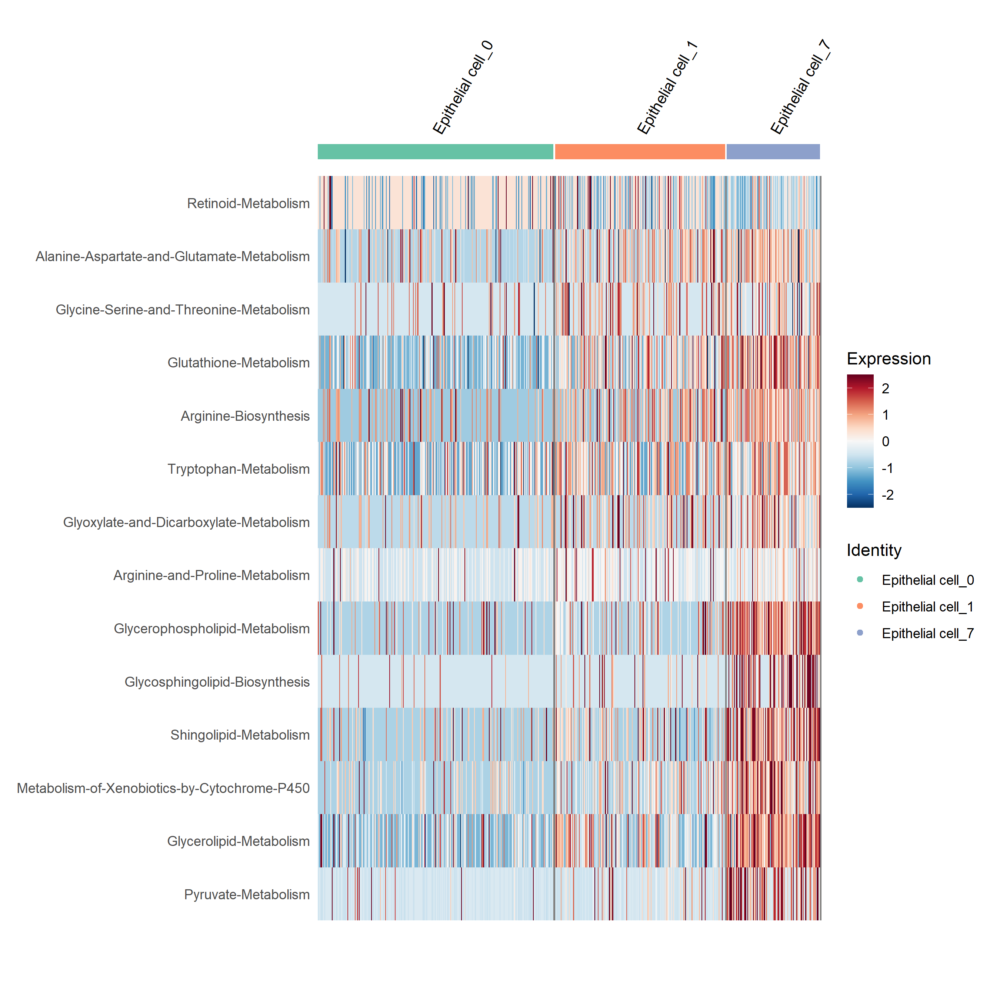

### Citation

If you use scsig in published research, please cite:

### Contact

E-mail any questions to <dongqiangzeng0808@gmail.com>
